# 🏠 স্বপ্নের বাড়ি: ইন্টারনেটের শহরে প্রথম ওয়েবসাইট বানানোর গল্প

> এই ডকুমেন্টটা **গল্প আকারে** লেখা — যাতে কিছুই মুখস্থ করতে না হয়। গল্পটা মনে থাকলে ট্যাগ, নিয়ম, ধারণা — সবকিছু নিজে থেকেই মনে পড়বে।
> **মডিউল ১: [Foundation] ইন্ট্রোডাকশন অব ওয়েব ডেভেলপমেন্ট এবং HTML**-এর অন্তর্গত এই টপিকগুলো একটানা একটা গল্পে বাঁধা হয়েছে:
> *How the internet works · What is an IP Address · What is DNS & How DNS Works · VS Code Setup for HTML · Structural Tags · Text Formatting · List · Link · Image and Multimedia · Table · Form · Semantic Tags · Scripting · Interactive Element · Special Purpose Tags · Advance web page structure*
>

> 💡 **কোড পড়ার নিয়ম:** HTML কোডে "ভেরিয়েবল" বলতে বুঝবো — `id`, `class`, `name`, `src`, `href`-এর মতো attribute-এর মান, আর JavaScript-এর `const`/`let`। প্রতিটার পাশে **কমেন্টে লেখা আছে সেটা কেন ব্যবহার করা হয়েছে**।

---

## 📚 সূচিপত্র (Table of Contents)

- [ভূমিকা: শহর, বাড়ি আর তিন কারিগর](#ভূমিকা-শহর-বাড়ি-আর-তিন-কারিগর)
- [১. শহরের ডাকব্যবস্থা: Internet কীভাবে কাজ করে](#১-শহরের-ডাকব্যবস্থা-internet-কীভাবে-কাজ-করে)
- [২. বাড়ির ঠিকানা: IP Address কী](#২-বাড়ির-ঠিকানা-ip-address-কী)
- [৩. শহরের ফোনবুক: DNS কী এবং কীভাবে কাজ করে](#৩-শহরের-ফোনবুক-dns-কী-এবং-কীভাবে-কাজ-করে)
- [৪. কারিগরের টুলবক্স: HTML-এর জন্য VS Code Setup](#৪-কারিগরের-টুলবক্স-html-এর-জন্য-vs-code-setup)
- [৫. বাড়ির কাঠামো: HTML পরিচিতি ও Structural Tags](#৫-বাড়ির-কাঠামো-html-পরিচিতি-ও-structural-tags)
- [৬. দেয়ালের লেখা: Text Formatting](#৬-দেয়ালের-লেখা-text-formatting)
- [৭. বাজারের ফর্দ: List](#৭-বাজারের-ফর্দ-list)
- [৮. বাড়ির দরজা ও রাস্তা: Link](#৮-বাড়ির-দরজা-ও-রাস্তা-link)
- [৯. দেয়ালের ছবি, জানালা আর টিভি: Image ও Multimedia](#৯-দেয়ালের-ছবি-জানালা-আর-টিভি-image-ও-multimedia)
- [১০. বাড়ির নোটিশ বোর্ড: Table (ভিত্তি)](#১০-বাড়ির-নোটিশ-বোর্ড-table-ভিত্তি)
- [১১. রিসেপশন ডেস্ক: Form (ভিত্তি)](#১১-রিসেপশন-ডেস্ক-form-ভিত্তি)
- [১২. ঘরের নামফলক: Semantic Tags](#১২-ঘরের-নামফলক-semantic-tags)
- [১৩. বাড়ির বিদ্যুৎ: Scripting](#১৩-বাড়ির-বিদ্যুৎ-scripting)
- [১৪. সুইচ, ড্রয়ার আর ডোরবেল: Interactive Element](#১৪-সুইচ-ড্রয়ার-আর-ডোরবেল-interactive-element)
- [১৫. বিশেষ যন্ত্রপাতি: Special Purpose Tags](#১৫-বিশেষ-যন্ত্রপাতি-special-purpose-tags)
- [১৬. পুরো বাড়ির নকশা: Advance Web Page Structure](#১৬-পুরো-বাড়ির-নকশা-advance-web-page-structure)
- [১৭. সারসংক্ষেপ ও Practice আইডিয়া](#১৭-সারসংক্ষেপ-ও-practice-আইডিয়া)
- [📌 GitHub-এ যেভাবে রাখবেন](#-github-এ-যেভাবে-রাখবেন)

---

## ভূমিকা: শহর, বাড়ি আর তিন কারিগর

কল্পনা করুন, আপনি এক বিশাল আধুনিক শহরে একটুকরো জমি কিনেছেন। স্বপ্ন একটাই — **নিজের একটা বাড়ি বানাবেন, যেখানে সারা দুনিয়ার মানুষ বেড়াতে আসতে পারবে।** কিন্তু ইট-সিমেন্ট ধরার আগে মাথায় কয়েকটা প্রশ্ন ঘুরছে:

1. শহরটা আসলে চলে কীভাবে? মানুষ আমার বাড়িতে আসবে কোন রাস্তা দিয়ে? → **Internet কীভাবে কাজ করে**
2. আমার বাড়ির ঠিকানা কী? → **IP Address**
3. মানুষ কি সংখ্যার ঠিকানা মুখস্থ রাখবে? না, নাম বলবে। নাম থেকে ঠিকানা বের করে দেবে কে? → **DNS**
4. বাড়ি বানানোর যন্ত্রপাতি কোথায় রাখবো? → **VS Code**
5. এরপর শুরু নির্মাণ — দেয়াল-ছাদ, লেখা, তালিকা, দরজা, জানালা, ছবি, নোটিশ বোর্ড, রিসেপশন ডেস্ক, ঘরের নামফলক, বিদ্যুৎ, সুইচ, আর শেষে পুরো বাড়ির নকশা → **HTML-এর সব ট্যাগ**

### গল্পের চরিত্রগুলো (এটা একবার মাথায় গেঁথে নিন)

| গল্পে | বাস্তবে |
|---|---|
| 🌆 বিশাল শহর | **Internet** |
| 🛣️ রাস্তা, ডাকঘর, ট্রাফিক পুলিশ | Cable, ISP, Router |
| 🏠 আপনার বাড়ি | **Website** |
| 🔢 বাড়ির ঠিকানা | **IP Address** |
| 📒 শহরের ফোনবুক | **DNS** |
| 🧰 কারিগরের টুলবক্স | **VS Code** |
| 🧱 দেয়াল, ছাদ, ঘরের কাঠামো | **HTML** — ওয়েবপেজের *কাঠামো ও অর্থ* |
| 🎨 রং, সাজসজ্জা | **CSS** — ওয়েবপেজের *চেহারা* |
| 💡 বিদ্যুৎ, সুইচ, ডোরবেল | **JavaScript** — ওয়েবপেজের *আচরণ* |

> **আজকের কাজ শুধু কাঠামো (HTML)।** রং (CSS) আর বিদ্যুৎ (JavaScript) পরের মডিউলে গভীরে শিখবো। বিদ্যুতের তার কীভাবে টানা হয় সেটা শুধু এক ঝলক দেখবো (Scripting অংশে)।

**Web Development-এর দুই দিক:** বাড়ির *সামনের দিক* — যা দর্শক দেখে ও ছোঁয় (**Front-end**: HTML, CSS, JS)। আর *পেছনের দিক* — রান্নাঘর, গুদামঘর, হিসাবের খাতা, যেটা দর্শক দেখে না কিন্তু ছাড়া চলে না (**Back-end**: Server, Database)। MERN Stack-এ পুরোটাই JavaScript দিয়ে হয় — আর তার সবকিছুর শুরু এই HTML দিয়ে।

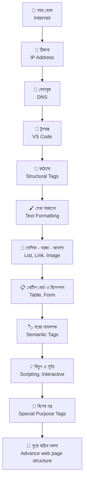

---

## ১. শহরের ডাকব্যবস্থা: Internet কীভাবে কাজ করে

### ইন্টারনেট আসলে কী?

**Internet = কোটি কোটি কম্পিউটারের একটা বিশাল সংযুক্ত জাল (network of networks)।** শহরের রাস্তাঘাট, ডাকঘর আর বিদ্যুতের লাইন মিলিয়ে যেমন একটা শহর — তেমনি ক্যাবল, রাউটার আর সার্ভার মিলিয়ে ইন্টারনেট।

একটা ভুল ধারণা এখনই ভেঙে দিই: **Internet আর Web এক জিনিস নয়।**

| | Internet | World Wide Web (Web) |
|---|---|---|
| গল্পে | শহরের **রাস্তা-ঘাট আর ডাকব্যবস্থা** | সেই শহরের **বাড়ি আর দোকানপাট** |
| আসলে | কম্পিউটার জোড়া লাগানোর অবকাঠামো | ওই অবকাঠামোর উপর চলা ওয়েবসাইটের সমষ্টি |
| উদাহরণ | ক্যাবল, Wi-Fi, TCP/IP | Facebook.com, Wikipedia, আপনার বানানো সাইট |
| একই অবকাঠামো ব্যবহার করে আর কী | ইমেইল, অনলাইন গেম, ভিডিও কল — এগুলোও ইন্টারনেট ব্যবহার করে, কিন্তু "Web" নয় | — |

### গল্পের কারিগরেরা

| চরিত্র | গল্পে | বাস্তবে |
|---|---|---|
| **Client** | বাড়ি দেখতে আসা অতিথি | আপনার ফোন/ল্যাপটপ + Browser (Chrome, Firefox) |
| **Server** | ২৪ ঘণ্টা দরজা খোলা রাখা বাড়ির মালিক | এমন একটা কম্পিউটার, যার কাছে ওয়েবসাইটের ফাইল আছে এবং যে সবসময় চালু |
| **ISP** | এলাকার ডাকঘর ও রাস্তার ঠিকাদার | Internet Service Provider — যে কোম্পানি আপনাকে ইন্টারনেটে ঢুকিয়ে দেয় |
| **Router** | চৌরাস্তার ট্রাফিক পুলিশ | যে যন্ত্র ঠিক করে দেয় ডেটার প্যাকেট কোন পথে যাবে |
| **Cable** | রাস্তা | ফাইবার অপটিক ক্যাবল (মহাদেশের মাঝে সমুদ্রের নিচ দিয়েও যায়) |

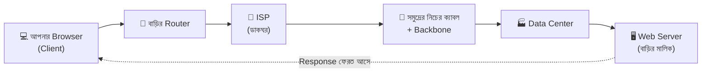

### প্যাকেট: বড় জিনিস টুকরো করে পাঠানো

আপনার বাড়ির সব আসবাব কি একটা ট্রাকে ধরবে? না। তাই ওগুলো **অনেকগুলো ছোট বাক্সে (Packet)** ভাগ করা হয়। প্রতিটা বাক্সে লেখা থাকে *কোথা থেকে এসেছে, কোথায় যাবে, আর কত নম্বর বাক্স*। বাক্সগুলো আলাদা আলাদা রাস্তা দিয়ে যেতে পারে — গন্তব্যে পৌঁছে নম্বর মিলিয়ে আবার জোড়া লাগানো হয়।

- **IP (Internet Protocol)** = প্রতিটা বাক্সের গায়ে ঠিকানা লেখার নিয়ম
- **TCP (Transmission Control Protocol)** = সব বাক্স ঠিকমতো পৌঁছেছে কিনা মিলিয়ে দেখে, হারিয়ে গেলে আবার পাঠায়

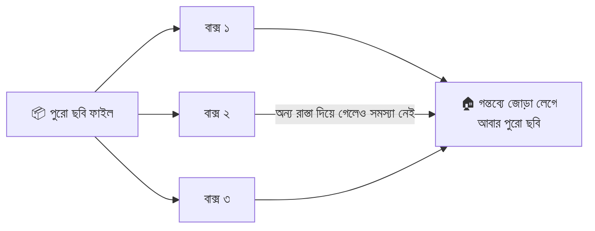

### HTTP আর HTTPS: কথা বলার নিয়ম

Client আর Server কীভাবে কথা বলবে, তার নিয়মের নাম **HTTP (HyperText Transfer Protocol)**। কথোপকথন সবসময় দুই ধাপের:

1. **Request** — অতিথি জিজ্ঞেস করে: "আমাকে `about.html` পাতাটা দেখাও"
2. **Response** — বাড়ির মালিক উত্তর দেয়: "এই নাও" (সাথে একটা **Status Code**)

**HTTPS** = HTTP + **সিল করা খাম (TLS encryption)**। মাঝপথে কেউ চিঠি খুলে পড়তে পারে না। ব্রাউজারের ঠিকানার পাশে 🔒 দেখলে বুঝবেন খামটা সিল করা।

| Status Code | গল্পে মালিক কী বললো | মানে |
|---|---|---|
| **200 OK** | "এই নাও, সব ঠিক আছে" | সফল |
| **301 Moved Permanently** | "আমরা নতুন ঠিকানায় চলে গেছি" | স্থায়ী redirect |
| **400 Bad Request** | "তুমি কী চাইছো বুঝতে পারছি না" | Request-এ ভুল |
| **403 Forbidden** | "এই ঘরে তোমার ঢোকা নিষেধ" | অনুমতি নেই |
| **404 Not Found** | "এই নামের কোনো ঘরই নেই" | পাতা পাওয়া যায়নি |
| **500 Internal Server Error** | "আমার রান্নাঘরে আগুন লেগেছে!" | Server-এর নিজের ভুল |
| **503 Service Unavailable** | "আজ বন্ধ, পরে এসো" | Server ব্যস্ত/বন্ধ |

> **সহজ নিয়ম:** `2xx` = সফল · `3xx` = অন্যত্র যাও · `4xx` = **তোমার** ভুল · `5xx` = **আমার** (Server-এর) ভুল।

Request-এর ধরন (**Method**) সংক্ষেপে: `GET` = "দেখতে চাই", `POST` = "কিছু পাঠাতে চাই" (যেমন ফর্ম), `PUT/PATCH` = "বদলাতে চাই", `DELETE` = "মুছতে চাই"। Form অংশে `GET` আর `POST` আবার কাজে লাগবে।

### ব্রাউজারে `https://example.com` লিখে Enter চাপলে কী হয়?

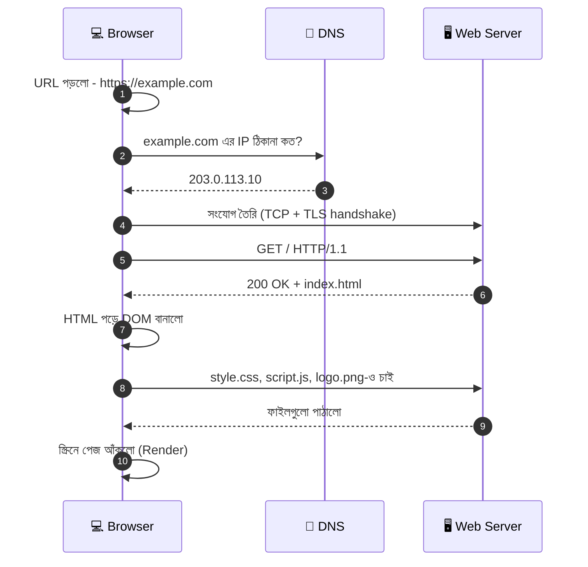

> `203.0.113.10` একটা **নমুনা IP** (documentation-এর জন্য নির্ধারিত), আসল কোনো সাইটের নয়।

### URL: বাড়ির পূর্ণ ঠিকানার গঠন

`https://www.example.com:8080/blog/post.html?id=5&lang=bn#comments`

| অংশ | উদাহরণ | গল্পে |
|---|---|---|
| **Scheme/Protocol** | `https://` | কীভাবে যাবেন — সিল করা গাড়িতে |
| **Subdomain** | `www` | এলাকার নাম |
| **Domain + TLD** | `example.com` | বাড়ির নাম (`.com` = এলাকার ধরন; `.bd`, `.org` ইত্যাদি) |
| **Port** | `:8080` | কোন দরজা দিয়ে ঢুকবেন (না লিখলে HTTP-র জন্য 80, HTTPS-এর জন্য 443) |
| **Path** | `/blog/post.html` | বাড়ির ভেতরে কোন ঘর |
| **Query String** | `?id=5&lang=bn` | ঘরে গিয়ে বলা "৫ নম্বর জিনিসটা, বাংলা ভাষায়" |
| **Fragment** | `#comments` | ঘরের ভেতরে ঠিক কোন কোণায় (পাতার নির্দিষ্ট অংশ) |

```javascript
const address = "https://www.example.com:8080/blog/post.html?id=5&lang=bn#comments";
// address = পুরো ঠিকানাটা একটা স্ট্রিং হিসেবে রাখলাম, যেটা আমরা ভেঙে দেখবো

const url = new URL(address);
// url = ঠিকানাটাকে অংশ অংশ করে ভাঙা একটা object।
// new URL() ব্রাউজারের বিল্ট-ইন টুল — নিজে স্ট্রিং কাটাকুটি করতে হয় না

console.log(url.protocol);            // "https:"           → Scheme
console.log(url.hostname);            // "www.example.com"  → Subdomain + Domain + TLD
console.log(url.port);                // "8080"             → Port
console.log(url.pathname);            // "/blog/post.html"  → Path
console.log(url.search);              // "?id=5&lang=bn"    → Query String
console.log(url.hash);                // "#comments"        → Fragment
console.log(url.searchParams.get("id")); // "5" → Query String থেকে শুধু id-এর মানটা তুলে আনলাম
```

### হাতে-কলমে: নিজের চোখে দেখুন

```bash
ping example.com
# ping = "কেউ আছো?" বলে ডাক দেওয়া। উত্তর আসতে কত মিলিসেকেন্ড (ms) লাগলো সেটাও দেখায়

tracert example.com        # Windows
traceroute example.com     # macOS / Linux
# tracert/traceroute = আপনার কম্পিউটার থেকে সার্ভার পর্যন্ত যেসব Router (চৌরাস্তা) পার হলো, তার তালিকা
```

**আরও একটা মজার পরীক্ষা:** Chrome-এ যেকোনো সাইটে গিয়ে `F12` চাপুন → **Network** ট্যাব → পেজ Reload দিন। দেখবেন প্রতিটা ছবি, CSS, JS ফাইলের জন্য আলাদা আলাদা Request গেছে, সাথে Status Code (200, 304, 404…)।

> **মনে রাখার গল্প-সূত্র:** *"অতিথি (Client) ডাকঘরের (ISP) মাধ্যমে চিঠি পাঠায়, ট্রাফিক পুলিশ (Router) পথ দেখায়, চিঠি ছোট বাক্সে (Packet) ভাগ হয়ে যায়, বাড়ির মালিক (Server) উত্তর দেয় — সাথে একটা স্ট্যাটাস কার্ড (200/404)।"*

---

## ২. বাড়ির ঠিকানা: IP Address কী

**IP Address = ইন্টারনেটে প্রতিটা ডিভাইসের সংখ্যার ঠিকানা।** ডাকপিয়ন ঠিকানা ছাড়া চিঠি পৌঁছাতে পারে না, ঠিক তেমনি ইন্টারনেটে ঠিকানা ছাড়া প্যাকেট পৌঁছায় না। আপনার ফোন, ল্যাপটপ, Server — সবার একটা করে IP আছে।

### IPv4: পুরোনো, কিন্তু এখনো সবচেয়ে চেনা ঠিকানা

`192.168.1.10` — **চারটা অংশ (octet)**, প্রতিটা `0` থেকে `255`, মাঝে বিন্দু।

- প্রতিটা অংশ ৮ bit → মোট **৩২ bit**
- সম্ভাব্য ঠিকানা = 2³² ≈ **৪২৯ কোটি**
- সমস্যা: পৃথিবীর জনসংখ্যা আর ডিভাইসের তুলনায় এটা **ফুরিয়ে গেছে!**

### IPv6: নতুন শহর, অসীম ঠিকানা

`2001:0db8:85a3:0000:0000:8a2e:0370:7334` — **৮টা অংশ, hex (০-৯, a-f), কোলন দিয়ে আলাদা**, মোট **১২৮ bit**। ঠিকানার সংখ্যা এত বেশি যে প্রতিটা বালুকণারও আলাদা ঠিকানা দেওয়া যায়। লম্বা হলে সংক্ষেপ করা যায়: `2001:db8:85a3::8a2e:370:7334` (পরপর শূন্যের অংশ `::` দিয়ে)।

```javascript
const ip = "192.168.1.10";
// ip = একটা নমুনা IPv4 ঠিকানা (স্ট্রিং), যার ভেতরটা আমরা ভেঙে দেখবো

const octets = ip.split(".");
// octets = ["192", "168", "1", "10"] — ঠিকানার চারটা অংশ।
// split(".") বিন্দু (.) ধরে ঠিকানাটাকে টুকরো করে

const bits = octets.map((n) => Number(n).toString(2).padStart(8, "0"));
// bits = প্রতিটা অংশের binary রূপ। Number(n) = স্ট্রিং থেকে সংখ্যা,
// toString(2) = দুই-ভিত্তিক সংখ্যা, padStart(8, "0") = ৮ ঘর পূরণ করতে সামনে ০ বসানো

console.log(bits.join("."));
// 11000000.10101000.00000001.00001010 → ৪ অংশ × ৮ bit = ৩২ bit
```

### Public IP বনাম Private IP

| | Public IP | Private IP |
|---|---|---|
| গল্পে | শহরের **রাস্তার নম্বর** | বাড়ির **ভেতরের ঘর নম্বর** |
| কে দেয় | ISP | আপনার Router |
| বৈশিষ্ট্য | সারা দুনিয়ায় অনন্য | শুধু আপনার বাড়ির নেটওয়ার্কে অনন্য |
| রেঞ্জ | বাকি সব | `10.x.x.x` · `172.16.x.x – 172.31.x.x` · `192.168.x.x` |

**NAT (Network Address Translation):** আপনার বাড়িতে ফোন, ল্যাপটপ, টিভি — সবার জন্য ISP আলাদা আলাদা Public IP দেয় না। **Router একটাই Public IP নিয়ে সবার হয়ে বাইরে কথা বলে**, আর ভেতরে সবাইকে নিজের Private ঠিকানা দেয়। যেন পুরো বাড়ির একটাই রাস্তার নম্বর, ভেতরে ঘর ১, ঘর ২, ঘর ৩।

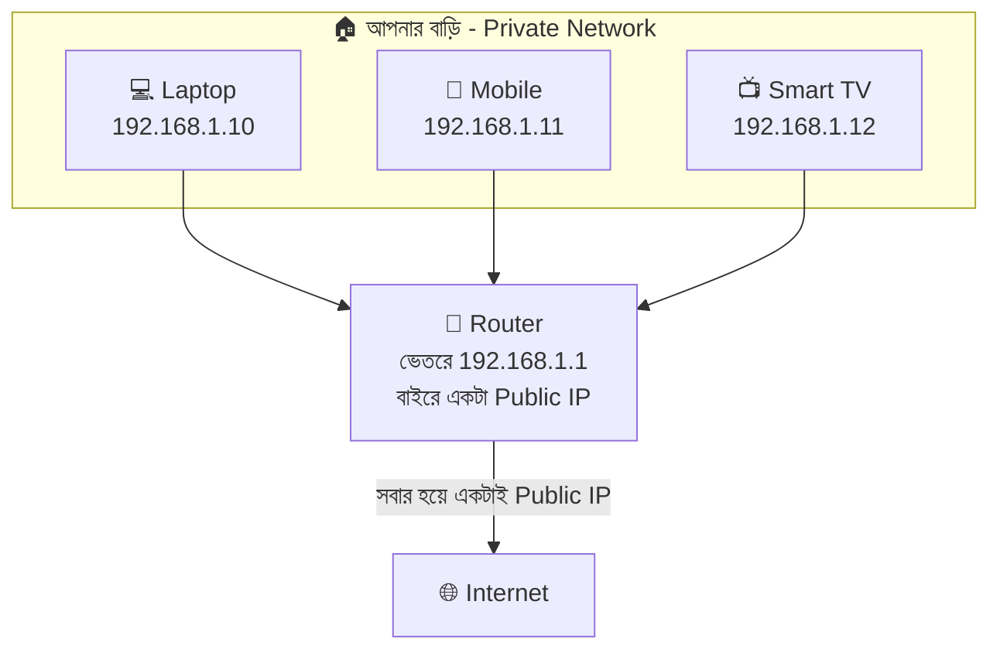

### Static বনাম Dynamic IP

- **Dynamic IP** (বেশিরভাগ ক্ষেত্রে): প্রতিবার সংযোগের সময় **DHCP** নামের ব্যবস্থা অস্থায়ী ঠিকানা ধার দেয় — যেন হোটেলে প্রতিবার আলাদা রুম নম্বর।
- **Static IP**: ঠিকানা স্থায়ী, বদলায় না — Web Server-এর জন্য জরুরি, কারণ সাইটের ঠিকানা রোজ বদলালে চলবে না।

### বিশেষ ঠিকানা: `127.0.0.1` (localhost)

`127.0.0.1` মানে **"আমি নিজে"** — আয়নায় নিজেকে দেখা। `localhost` নামটাও এই ঠিকানাকেই বোঝায়। VS Code-এর Live Server বা পরে Node.js দিয়ে যে সাইট চালাবেন, সেটা আপনার নিজের কম্পিউটারেই চলে — তাই ঠিকানা `http://localhost:5500`।

### Port: বাড়ির ঠিকানা + দরজার নম্বর

একটা বাড়ির (IP) অনেক দরজা (Port) থাকতে পারে — সামনের দরজা, পেছনের দরজা, গ্যারেজ। **প্রতিটা সেবা নিজের দরজায় অপেক্ষা করে।**

| Port | সেবা | গল্পে |
|---|---|---|
| **80** | HTTP | সদর দরজা (খোলা) |
| **443** | HTTPS | সিকিউরিটি গেট (সিল করা) |
| **22** | SSH | দূর থেকে মালিকের নিরাপদ প্রবেশ |
| **3306** | MySQL | হিসাবের গুদামঘর |
| **5500** | VS Code Live Server | আপনার টেস্ট-ঘরের দরজা |
| **3000** | Node.js dev server | পরের মডিউলের দরজা |

### নিজের IP দেখার উপায়

```bash
ipconfig        # Windows: "IPv4 Address" লাইনটা আপনার Private IP
ifconfig        # macOS
ip a            # Linux
# তিনটাই একই কাজ করে — আপনার কম্পিউটারের নেটওয়ার্ক কার্ডের ঠিকানা দেখায়
```

Public IP জানতে ব্রাউজারে সার্চ করুন *"what is my ip"*।

> **মনে রাখার গল্প-সূত্র:** *"শহরের রাস্তার নম্বর (Public IP) একটাই, ভেতরে ঘরের নম্বর (Private IP)। `127.0.0.1` মানে আমি নিজে। আর দরজার নম্বর (Port) ছাড়া সেবা মেলে না।"*

---

## ৩. শহরের ফোনবুক: DNS কী এবং কীভাবে কাজ করে

ধরুন আপনার বন্ধু রাতুলের ফোন নম্বর `01712-345678`। আপনি কি নম্বর মুখস্থ রাখেন? না — ফোনে **"রাতুল"** নামে সেভ করা থাকে, নাম বললেই ফোন নম্বর বের করে দেয়।

**DNS (Domain Name System) = ইন্টারনেটের ফোনবুক।** আমরা মনে রাখি `google.com`, কিন্তু কম্পিউটার চেনে শুধু IP (`142.250.x.x`)। DNS নাম থেকে IP বের করে দেয়।

> DNS না থাকলে প্রতিটা সাইটের জন্য `142.250.190.78`-এর মতো নম্বর মুখস্থ রাখতে হতো!

### Domain Name-এর গঠন

`blog.example.com`

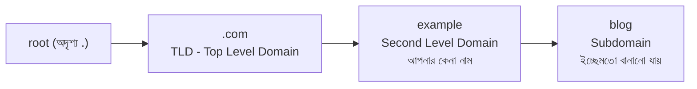

ডান থেকে বামে পড়ুন: **TLD** (`.com`, `.org`, `.bd`, `.com.bd`) → **Domain** (`example`) → **Subdomain** (`blog`, `www`, `shop`)।

### DNS কীভাবে নাম থেকে IP বের করে? (ধাপে ধাপে)

আপনি ব্রাউজারে `www.example.com` লিখলেন। এবার একটা খোঁজাখুঁজির খেলা শুরু:

1. **Browser Cache** — "আমার নিজের মুখস্থ আছে?" (সদ্য গিয়ে থাকলে এখানেই শেষ)
2. **OS Cache + hosts ফাইল** — "কম্পিউটারের নিজের খাতায় আছে?"
3. **Recursive Resolver** — অনুসন্ধান কেন্দ্র (সাধারণত ISP-র, অথবা Google `8.8.8.8`, Cloudflare `1.1.1.1`)। সে আপনার হয়ে বাকি সব খোঁজ করে
4. **Root Server** — "`.com` এলাকার দায়িত্বে কে?" (উত্তর দেয়: TLD Server)
5. **TLD Server** — "`example.com`-এর খাতা কার কাছে?" (উত্তর দেয়: Authoritative Name Server)
6. **Authoritative Name Server** — **আসল মালিকের খাতা।** এখানেই লেখা আছে `www.example.com = 203.0.113.10`

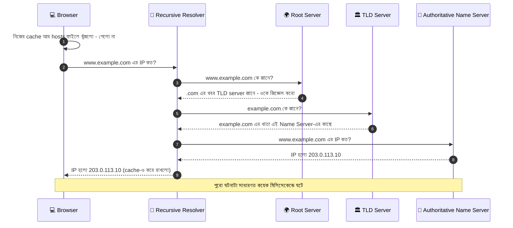

### DNS Record-এর ধরন: ফোনবুকের কলামগুলো

| Record | কাজ | গল্পে |
|---|---|---|
| **A** | নাম → IPv4 ঠিকানা | "রাতুল = ০১৭১২..." |
| **AAAA** | নাম → IPv6 ঠিকানা | নতুন লম্বা নম্বর |
| **CNAME** | এক নামকে আরেক নামের ডাকনাম বানায় | "ঝন্টু = রাতুল-এর ডাকনাম" (`www` → `example.com`) |
| **MX** | ইমেইল কোন Mail Server-এ যাবে | ডাকবাক্সের ঠিকানা |
| **TXT** | মালিকানা যাচাই, SPF/DKIM ইত্যাদির লিখিত নোট | দেয়ালের নোটিশ |
| **NS** | এই ডোমেইনের খাতা কোন Name Server-এ | "খাতা আছে ওই অফিসে" |

**TTL (Time To Live):** ফোনবুকের প্রতিটা এন্ট্রির পাশে লেখা থাকে *"এই নম্বর ৩০০ সেকেন্ড পর্যন্ত মনে রাখো, তারপর আবার যাচাই করো।"* এই কারণেই ডোমেইনের ঠিকানা বদলালে খবরটা সব জায়গায় ছড়াতে সময় লাগে (একেই বলে **DNS Propagation**)।

### Domain কেনা আর Hosting নেওয়া — দুটো আলাদা কাজ

- **Domain** = বাড়ির **নামফলক** (আপনি Registrar-এর কাছ থেকে কেনেন)
- **Hosting** = বাড়ি বানানোর **জমি/ভাড়া বাড়ি** (যেখানে আপনার ফাইল থাকে)
- **DNS A Record** = নামফলকের সাথে জমির ঠিকানা জুড়ে দেওয়ার সুতো

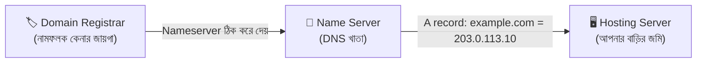

### `hosts` ফাইল: নিজের পকেট-ফোনবুক

আপনার কম্পিউটারের একটা ছোট নিজস্ব খাতা আছে, যেটা **DNS-এর আগেই দেখা হয়**। ডেভেলপমেন্টে এটা কাজে লাগে।

```bash
# ফাইলের অবস্থান:
#   Windows : C:\Windows\System32\drivers\etc\hosts
#   Mac/Linux : /etc/hosts

127.0.0.1    mysite.test
# 127.0.0.1 = "আমি নিজে" (localhost)। mysite.test = নিজের বানানো একটা নাম।
# এখন ব্রাউজারে mysite.test লিখলে DNS-এ না গিয়ে সরাসরি নিজের কম্পিউটারেই যাবে
```

### DNS পরীক্ষা করার কমান্ড

```bash
nslookup example.com
# nslookup = নাম দিয়ে ফোনবুকে খুঁজে IP বের করে (Windows, Mac, Linux — সবখানে)

dig example.com A +short
# dig = আরও বিস্তারিত টুল (Mac/Linux)। A = কোন Record চাই, +short = শুধু উত্তরটুকু দেখাও

dig example.com MX
# MX = এই ডোমেইনের ইমেইল সার্ভার কারা

ipconfig /flushdns
# Windows-এর নিজের DNS cache মুছে ফেলে — ঠিকানা বদলের পরে পুরোনো তথ্য আটকে থাকলে কাজে লাগে
```

> **মনে রাখার গল্প-সূত্র:** *"নাম বললে ফোনবুক নম্বর দেয়। ফোনবুকে খোঁজার ক্রম — নিজের মুখস্থ → কম্পিউটারের খাতা → অনুসন্ধান কেন্দ্র → Root → TLD → আসল মালিকের খাতা। আর প্রতিটা এন্ট্রির পাশে TTL — কতক্ষণ মনে রাখবে।"*

---
## ৪. কারিগরের টুলবক্স: HTML-এর জন্য VS Code Setup

বাড়ি বানাতে কারিগরের চাই হাতুড়ি, ফিতা, লেভেল। ওয়েব-কারিগরের টুলবক্স হলো **Code Editor** — সবচেয়ে জনপ্রিয়টা **Visual Studio Code (VS Code)**। Notepad-এও HTML লেখা যায়, কিন্তু সেটা হাতে হাতুড়ি না নিয়ে পাথর দিয়ে পেরেক ঠোকার মতো।

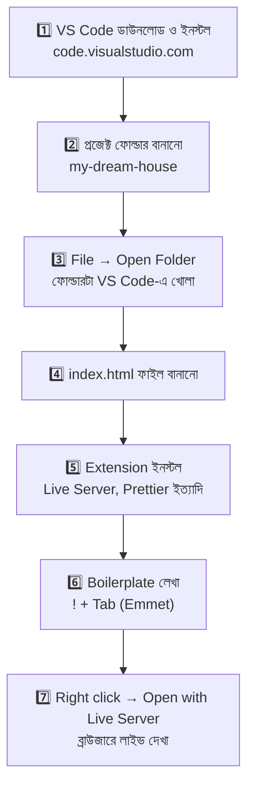

### ধাপে ধাপে সেটআপ

1. **ইনস্টল:** [code.visualstudio.com](https://code.visualstudio.com) থেকে নিজের OS-এর ভার্সন নামিয়ে ইনস্টল করুন।
2. **ফোল্ডার:** কম্পিউটারে `my-dream-house` নামে একটা ফোল্ডার বানান → VS Code-এ **File → Open Folder** দিয়ে খুলুন। (সবসময় *ফোল্ডার* খুলবেন, একটা ফাইল নয় — তাহলে ছবি, CSS সব এক জায়গায় থাকে।)
3. **ফাইল:** বাম পাশের Explorer-এ **New File** চেপে `index.html` লিখুন। নামের ছোট হাতের অক্ষর ও `-` ব্যবহার করুন, স্পেস নয়।
4. **Boilerplate:** ফাঁকা ফাইলে `!` লিখে `Tab` চাপুন — পুরো HTML কাঠামো নিজে নিজে চলে আসবে (এটা **Emmet**, VS Code-এ আগে থেকেই আছে)।
5. **Live Server:** ফাইলে Right Click → **Open with Live Server** → ব্রাউজারে `http://127.0.0.1:5500` খুলবে। এরপর থেকে **Ctrl + S** চাপলেই পেজ নিজে রিফ্রেশ হবে।

### দরকারি Extension

| Extension | কেন লাগে |
|---|---|
| **Live Server** (Ritwick Dey) | সেভ করলেই ব্রাউজার নিজে রিফ্রেশ — বারবার F5 চাপতে হয় না |
| **Prettier - Code formatter** | কোড আপনাআপনি সুন্দর করে সাজিয়ে দেয় (indent, লাইন ভাঙা) |
| **Path Intellisense** | `src="..."` লেখার সময় ফাইলের নাম অটো-সাজেস্ট করে — বানান ভুলে ছবি হারানো বন্ধ |
| **Material Icon Theme** | ফোল্ডার/ফাইলে সুন্দর আইকন — চিনতে সুবিধা |
| **HTML CSS Support** | HTML লেখার সময় নিজের CSS-এর class-এর নাম সাজেস্ট করে |

> **Auto Rename Tag** আলাদা extension হিসেবে বহুদিন ছিল। এখন VS Code-এর নিজের সেটিং `editor.linkedEditing` দিয়েই একই কাজ হয় — নিচের settings-এ দেখুন।

### `settings.json` (Ctrl + Shift + P → *Open User Settings (JSON)*)

```jsonc
{
  "editor.formatOnSave": true,
  // formatOnSave = প্রতিবার Ctrl+S চাপলে কোড নিজে সুন্দর হয়ে যাবে

  "editor.defaultFormatter": "esbenp.prettier-vscode",
  // defaultFormatter = কোন টুল দিয়ে সাজাবে — Prettier extension-এর আইডি এটা

  "editor.tabSize": 2,
  // tabSize = এক Tab-এ কয়টা স্পেস ঢুকবে। HTML-এ ২ স্পেস চলে, কারণ ট্যাগের ভেতর ট্যাগ অনেক গভীরে যায়

  "editor.wordWrap": "on",
  // wordWrap = লম্বা লাইন স্ক্রিনের প্রান্তে ভেঙে পরের লাইনে নামবে, ডানে স্ক্রল করতে হবে না

  "editor.linkedEditing": true,
  // linkedEditing = <div> বদলে <section> লিখলে </div> নিজে নিজে </section> হয়ে যাবে

  "files.autoSave": "afterDelay"
  // autoSave = লেখা থামালে কিছুক্ষণ পর নিজে সেভ হবে (Live Server-এর সাথে দারুণ কাজ করে)
}
```

> ⚠️ `settings.json`-এ কমেন্ট লেখা যায় (এটা JSONC ফরম্যাট), কিন্তু সাধারণ `.json` ফাইলে যায় না।

### Emmet: কম লিখে বেশি বানানোর জাদু

Emmet হলো **শর্টহ্যান্ড** — ছোট্ট সংকেত লিখে `Tab` চাপলে পুরো HTML তৈরি।

| যা লিখবেন | `Tab` চাপলে যা পাবেন |
|---|---|
| `!` | পুরো HTML5 boilerplate |
| `h1{আমার বাড়ি}` | `<h1>আমার বাড়ি</h1>` |
| `div.card` | `<div class="card"></div>` |
| `div#main` | `<div id="main"></div>` |
| `ul>li*3` | `<ul>` ভেতরে ৩টা `<li>` |
| `ul>li.item$*3` | ৩টা `li`, class হবে `item1`, `item2`, `item3` (`$` = ক্রমিক নম্বর) |
| `nav>ul>li*4>a` | `nav` → `ul` → ৪টা `li` → প্রতিটায় `a` |
| `a[href="#"]` | `<a href="#"></a>` |
| `img[src alt]` | `` |
| `lorem10` | ১০ শব্দের নমুনা লেখা (ডিজাইনের সময় ফাঁকা জায়গা ভরাতে) |

### দরকারি শর্টকাট (Mac-এ Ctrl-এর জায়গায় Cmd)

| শর্টকাট | কাজ |
|---|---|
| `Ctrl + S` | সেভ |
| `Ctrl + /` | লাইন কমেন্ট/আনকমেন্ট |
| `Alt + ↑ / ↓` | লাইন উপরে/নিচে সরানো |
| `Shift + Alt + ↓` | লাইন কপি করে নিচে বসানো |
| `Shift + Alt + F` | পুরো ফাইল ফরম্যাট |
| `Ctrl + P` | নাম লিখে যেকোনো ফাইলে লাফ |
| `Ctrl + Shift + P` | Command Palette — যেকোনো কমান্ড খোঁজা |
| `Ctrl + B` | Sidebar লুকানো/দেখানো |
| ``Ctrl + ` `` | Terminal খোলা/বন্ধ |

> **মনে রাখার গল্প-সূত্র:** *"টুলবক্স = VS Code। ফিতা = Live Server (সাথে সাথে দেখায়)। পালিশ = Prettier। শর্টহ্যান্ড = Emmet (`!` + Tab)।"*

---

## ৫. বাড়ির কাঠামো: HTML পরিচিতি ও Structural Tags

### HTML আসলে কী?

**HTML = HyperText Markup Language**

- **HyperText** — এক পাতা থেকে আরেক পাতায় লাফ দেওয়া যায় এমন লেখা (লিংক)
- **Markup** — লেখার গায়ে চিহ্ন (ট্যাগ) বসিয়ে অর্থ বুঝিয়ে দেওয়া: "এটা শিরোনাম", "এটা অনুচ্ছেদ", "এটা ছবি"
- **Language** — নিয়মের ভাষা। তবে এটা **Programming Language নয়** — এতে যোগ-বিয়োগ, if-else, loop নেই। এটা শুধু বলে দেয় *পাতায় কী কী আছে*

ব্রাউজার HTML পড়ে বাড়ির **নকশা** বুঝে নেয়, তারপর সেই অনুযায়ী স্ক্রিনে বাড়িটা তুলে ধরে।

### একটা Element-এর শরীর

```html
<p class="intro">আমার স্বপ্নের বাড়ি</p>
```

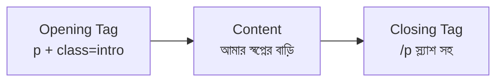

- **Tag** = কোণা বন্ধনী `< >`-এর ভেতরের নাম
- **Element** = Opening Tag + Content + Closing Tag — পুরোটা মিলে
- **Attribute** = ট্যাগের গায়ে লাগানো অতিরিক্ত তথ্য (`class="intro"`) — *নাম="মান"* আকারে
- **Void/Empty element** = যার ভেতরে কিছু রাখা যায় না, তাই Closing Tag-ও নেই: `<br>`, `<hr>`, ``, `<input>`, `<meta>`, `<link>`

### ব্রাউজারের চোখে বাড়ির নকশা: DOM Tree

HTML-এর ট্যাগগুলো একটা **গাছের** মতো সাজানো — বড় ঘরের ভেতরে ছোট ঘর। ব্রাউজার এই গাছটাকেই বলে **DOM (Document Object Model)**।

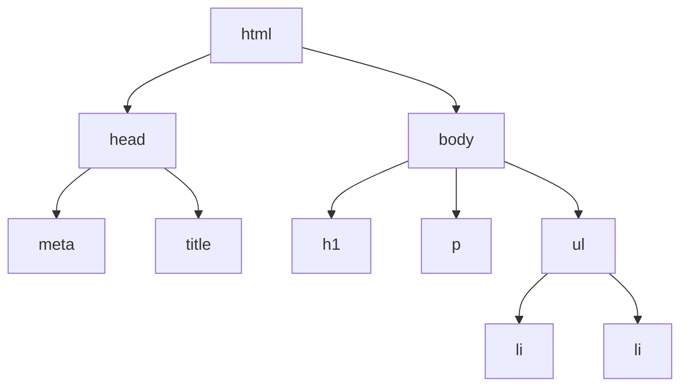

> **নিয়ম:** ট্যাগ খোলা মানে বন্ধও করতে হবে, আর **ভেতরে-ভেতরে (nested) ঠিকঠাক** বন্ধ করতে হবে। `<b><i>text</b></i>` ❌ ভুল · `<b><i>text</i></b>` ✅ ঠিক — যে ঘরে আগে ঢুকেছেন, তার দরজা সবার শেষে বন্ধ হবে।

### মূল কাঠামো (Boilerplate)

```html
<!DOCTYPE html>
<!-- DOCTYPE = ব্রাউজারকে বলে "এটা আধুনিক HTML5 ডকুমেন্ট"।
     না লিখলে ব্রাউজার পুরোনো "Quirks mode"-এ চলে, তখন লেআউট এলোমেলো হতে পারে -->

<html lang="bn">
  <!-- html = পুরো বাড়ির বাইরের দেয়াল, সবকিছু এর ভেতরে।
       lang="bn" = পাতার ভাষা বাংলা — screen reader সঠিক উচ্চারণে পড়ে,
       Google ভাষা বোঝে, ব্রাউজার অনুবাদের প্রস্তাব দেয় কিনা ঠিক করে -->

  <head>
    <!-- head = বাড়ির "নামফলক ও দলিল" — স্ক্রিনে দেখা যায় না, কিন্তু ব্রাউজার আর সার্চ ইঞ্জিনের জন্য জরুরি তথ্য -->

    <meta charset="UTF-8" />
    <!-- charset="UTF-8" = অক্ষরের এনকোডিং। এটা না দিলে বাংলা লেখা "আম" জাতীয় হিজিবিজি দেখাতে পারে -->

    <meta name="viewport" content="width=device-width, initial-scale=1.0" />
    <!-- viewport = মোবাইলে পেজ কত চওড়া দেখাবে।
         width=device-width → ফোনের স্ক্রিনের সমান চওড়া; initial-scale=1.0 → শুরুতে জুম ১০০%
         এটা ছাড়া মোবাইলে সাইট ছোট্ট হয়ে "ডেস্কটপ ভার্সন" হিসেবে দেখায় -->

    <meta name="description" content="আমার স্বপ্নের বাড়ির ওয়েবসাইট" />
    <!-- name="description" = Google সার্চের ফলাফলে শিরোনামের নিচে যে ছোট বিবরণ দেখায় সেটা -->

    <title>স্বপ্নের বাড়ি</title>
    <!-- title = ব্রাউজারের ট্যাবে আর Google-এর ফলাফলে দেখানো নাম -->

    <link rel="icon" href="favicon.ico" />
    <!-- rel="icon" = এই লিংকটা ট্যাবের ছোট আইকন (favicon)। href = আইকন ফাইলের ঠিকানা -->

    <link rel="stylesheet" href="style.css" />
    <!-- rel="stylesheet" = এই ফাইলটা CSS (রং-সাজ)। href = ফাইলের ঠিকানা -->
  </head>

  <body>
    <!-- body = বাড়ির ভেতরটা — দর্শক যা কিছু দেখে সব এখানে -->
    <h1>স্বাগতম আমার বাড়িতে</h1>
  </body>
</html>
```

### head-এর ভেতরে কী কী থাকে

| ট্যাগ | কাজ |
|---|---|
| `<title>` | ট্যাবের নাম |
| `<meta>` | পাতার তথ্য (charset, viewport, description…) |
| `<link>` | বাইরের ফাইল জোড়া (CSS, favicon) |
| `<style>` | সরাসরি এখানে CSS লেখা |
| `<script>` | JavaScript |
| `<base>` | সব relative লিংকের একটা সাধারণ ভিত্তি-ঠিকানা |

### body-র ভেতরের প্রাথমিক ট্যাগ

```html
<h1>প্রধান শিরোনাম</h1>
<!-- h1 = পাতার সবচেয়ে বড় শিরোনাম। প্রতি পাতায় সাধারণত একটাই h1 রাখা ভালো অভ্যাস (বইয়ের নামের মতো) -->
<h2>উপ-শিরোনাম</h2>
<h3>উপ-উপ-শিরোনাম</h3>
<!-- h1 থেকে h6 — ক্রমানুসারে নামবে। h1 থেকে সরাসরি h4-এ লাফ দেবেন না (বইয়ের অধ্যায় → পরিচ্ছেদ → অনুচ্ছেদের মতো ক্রম) -->

<p>এটা একটা অনুচ্ছেদ (paragraph)।</p>
<!-- p = লেখার অনুচ্ছেদ। আগে-পরে নিজে ফাঁকা জায়গা নেয় -->

লাইন ভাঙতে চাইলে<br />এভাবে br দিন।
<!-- br = জোর করে নতুন লাইন। কবিতা বা ঠিকানার মতো জায়গায় ঠিক; পাতা সাজাতে বারবার br দেবেন না -->

<hr />
<!-- hr = আড়াআড়ি রেখা — দুটো বিষয়ের মাঝে থিম-বিরতি -->

<div id="gallery" class="box">
  <span class="tag">নতুন</span>
</div>
<!-- div = ব্লক-বাক্স, অন্য ট্যাগ গুছিয়ে রাখার "কার্টন"।
     id="gallery" = এই একটা বাক্সের অনন্য নাম (পুরো পাতায় একবারই), লিংক বা JS দিয়ে ধরার জন্য
     class="box" = অনেকগুলো বাক্সের একই ধরনের নাম (বারবার ব্যবহার করা যায়), CSS-এ একসাথে সাজানোর জন্য
     span = ইনলাইন-বাক্স, লাইনের ভেতরে ছোট অংশ আলাদা করার জন্য -->

<!-- এটা একটা কমেন্ট — ব্রাউজারে দেখা যায় না, নিজের বা টিমের জন্য নোট -->
```

### Block বনাম Inline: ঘর বনাম ঘরের ভেতরের জিনিস

| | **Block** ঘর/কক্ষ | **Inline** ঘরের ভেতরের জিনিস |
|---|---|---|
| আচরণ | নতুন লাইনে শুরু হয়, পুরো প্রস্থ নেয় | লাইনের ভেতরেই থাকে, শুধু নিজের জায়গাটুকু নেয় |
| উদাহরণ | `div`, `p`, `h1–h6`, `ul`, `ol`, `li`, `table`, `form`, `header`, `section` | `span`, `a`, `strong`, `em`, `img`, `code`, `label` |
| ভেতরে কী রাখা যায় | block আর inline দুটোই | সাধারণত শুধু inline (`<a>`-এর ভেতরে block রাখা আধুনিক HTML-এ বৈধ, তবে সচেতনভাবে) |

> `<p>` -এর ভেতরে `<div>` রাখা যায় না — ব্রাউজার নিজে থেকেই `p`-কে আগে বন্ধ করে দেয় আর লেআউট ভেঙে যায়।

### Global Attribute: সব ট্যাগে লাগানো যায় এমন গুণ

| Attribute | কাজ | কেন ব্যবহার করি |
|---|---|---|
| `id` | অনন্য নাম | লিংক (`#id`), CSS, JS দিয়ে ঠিক এই একটা element ধরতে |
| `class` | দলের নাম | একই ধরনের অনেক element একসাথে সাজাতে |
| `style` | সরাসরি CSS | দ্রুত পরীক্ষা (পাকা কাজে আলাদা CSS ফাইল ভালো) |
| `title` | মাউস রাখলে ভেসে ওঠা টুলটিপ | অতিরিক্ত ব্যাখ্যা |
| `lang` | ওই অংশের ভাষা | `<span lang="en">Hello</span>` — মিশ্র ভাষার লেখায় |
| `hidden` | লুকিয়ে রাখা | শর্ত মিললে JS দিয়ে দেখানোর জন্য |
| `data-*` | নিজের বানানো তথ্য | `data-price="500"` — JS-এর জন্য তথ্য রাখার জায়গা |
| `tabindex` | Tab চেপে যাওয়ার ক্রম | কিবোর্ড ব্যবহারকারীদের সুবিধা |
| `contenteditable` | ব্রাউজারেই লেখা বদলানো | সহজ edit-যোগ্য অংশ |

### শুরুর দিকের সাধারণ ভুল

1. Closing Tag ভুলে যাওয়া → পুরো লেআউট এলোমেলো
2. একাধিক element-এ একই `id` দেওয়া (`id` অনন্য হতে হবে, দলের জন্য `class`)
3. শুধু বড়-ছোট দেখতে `h3` ব্যবহার (আকার CSS দিয়ে ঠিক করুন, `h`-এর কাজ *অর্থ* বোঝানো)
4. `<br>` দিয়ে ফাঁকা জায়গা বানানো (এটা CSS `margin`-এর কাজ)

> **মনে রাখার গল্প-সূত্র:** *"`html` = বাড়ির বাইরের দেয়াল। `head` = দরজার নামফলক আর দলিল (কেউ দেখে না, সবাই মানে)। `body` = ভেতরের ঘর। ঘরের ভেতরে ঘর (nested), তাই যে আগে ঢুকেছে সে সবার শেষে বেরোবে।"*

---

## ৬. দেয়ালের লেখা: Text Formatting

বাড়ির দেয়ালে লেখা থাকে — কোনটা সাধারণ, কোনটা মোটা হরফে সাবধানবাণী, কোনটা বাঁকা হরফে ইংরেজি ভাষার অনুবাদ। HTML-এ দুই ধরনের ট্যাগ আছে:

- **অর্থবহ (Semantic/Logical)** — *কেন* মোটা/বাঁকা তা বলে দেয়। Screen reader আর সার্চ ইঞ্জিন এটা বোঝে। ✅ পছন্দ করুন
- **শুধু চেহারার (Presentational)** — শুধু দেখতে কেমন, অর্থ নেই

### কোন ট্যাগ কখন

| ট্যাগ | ডিফল্ট চেহারা | আসল অর্থ / কখন ব্যবহার করবেন |
|---|---|---|
| `<strong>` | **মোটা** | **গুরুত্বপূর্ণ** কিছু — যেমন সাবধানবাণী: "**বিপদ:** খোলা তার" |
| `<b>` | **মোটা** | শুধু দৃষ্টি আকর্ষণ, বাড়তি গুরুত্ব ছাড়া — যেমন রেসিপির উপকরণের নাম |
| `<em>` | *বাঁকা* | কথায় **জোর** — "আমি *সত্যিই* যাবো" |
| `<i>` | *বাঁকা* | অন্য ভাষার শব্দ, চিন্তা, জাহাজের নাম — *bonjour* |
| `<u>` | <u>দাগ</u> | ভুল বানান বা বিশেষ চিহ্ন (লিংকের সাথে গুলিয়ে যায়, তাই কম ব্যবহার) |
| `<mark>` | হলুদ হাইলাইট | প্রাসঙ্গিক অংশ চিহ্নিত করা — ম্যাগাজিনের হাইলাইটারের মতো |
| `<small>` | ছোট | ছোট হরফের নোট, কপিরাইট, শর্ত |
| `<del>` | ~~কাটা~~ | মুছে ফেলা লেখা (সংশোধনী) |
| `<ins>` | <ins>নিচে দাগ</ins> | নতুন যোগ করা লেখা |
| `<s>` | ~~কাটা~~ | আর প্রযোজ্য নয় এমন তথ্য — পুরোনো দাম |
| `<sub>` / `<sup>` | H₂O / x² | নিচে-বসা / উপরে-বসা লেখা |

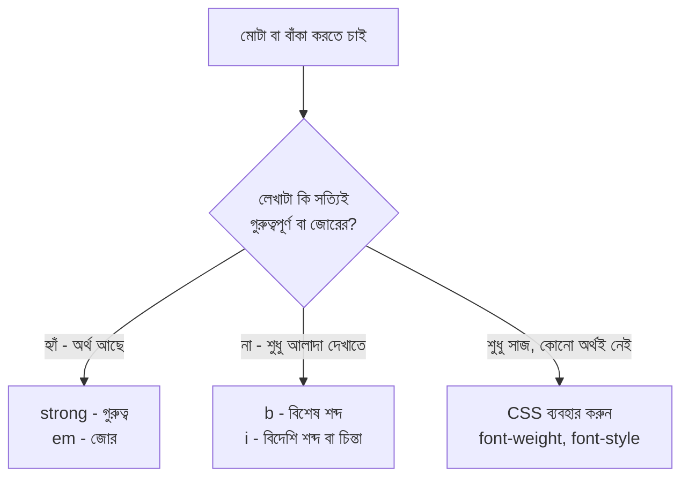

### কোড ও প্রযুক্তিগত লেখার ট্যাগ

| ট্যাগ | কাজ |
|---|---|
| `<code>` | কোডের ছোট টুকরো (মনোস্পেস হরফে) |
| `<pre>` | আগে-থেকে-সাজানো লেখা — স্পেস আর নতুন লাইন **যেমন আছে তেমনই** দেখায় |
| `<kbd>` | কিবোর্ডের বাটন — `Ctrl` + `S` |
| `<samp>` | প্রোগ্রামের আউটপুট নমুনা |
| `<var>` | গণিত/প্রোগ্রামের চলক (variable) |

### উদ্ধৃতি ও অন্যান্য

| ট্যাগ | কাজ |
|---|---|
| `<blockquote>` | লম্বা উদ্ধৃতি (আলাদা অনুচ্ছেদ আকারে) |
| `<q>` | ছোট উদ্ধৃতি — ব্রাউজার নিজে উদ্ধৃতি চিহ্ন বসায় |
| `<cite>` | বই/সিনেমা/গানের নাম |
| `<abbr>` | সংক্ষেপণ — `title`-এ পুরো রূপ থাকে |
| `<dfn>` | নতুন সংজ্ঞায়িত শব্দ |
| `<address>` | যোগাযোগের তথ্য |
| `<time>` | তারিখ/সময় (মেশিনের বোঝার জন্য) |
| `<bdo>` | লেখার দিক জোর করে উল্টানো |
| `<wbr>` | লম্বা শব্দের কোথায় ভাঙা যেতে পারে সেই ইঙ্গিত |

```html
<p>
  <strong>সাবধান:</strong> খোলা তারে হাত দেবেন না।
  <!-- strong = "সাবধান" শব্দটা সত্যিই গুরুত্বপূর্ণ; screen reader জোর দিয়ে পড়ে -->
</p>

<p>আমি <em>সত্যিই</em> আসবো।</p>
<!-- em = "সত্যিই" শব্দে কথার জোর। অর্থ বদলে যায়: "আমিই আসবো" বনাম "সত্যিই আসবো" -->

<p>পানির সংকেত H<sub>2</sub>O আর ক্ষেত্রফলের সূত্র x<sup>2</sup>।</p>
<!-- sub = নিচে (H₂O), sup = উপরে (x²) -->

<p>দাম <del>৫০০ টাকা</del> <ins>৪০০ টাকা</ins>।</p>
<!-- del = পুরোনো দাম কাটা, ins = নতুন দাম যোগ। দুটোতে আলাদা করে তারিখও দেওয়া যায় -->

<p>সেভ করতে <kbd>Ctrl</kbd> + <kbd>S</kbd> চাপুন।</p>
<!-- kbd = কিবোর্ডের বাটন বোঝায় -->

<p>
  <abbr title="HyperText Markup Language">HTML</abbr> একটা মার্কআপ ভাষা।
  <!-- abbr title="..." = মাউস রাখলে সংক্ষেপণের পূর্ণরূপ দেখায় -->
</p>

<blockquote cite="https://example.com/speech">
  <!-- cite = উদ্ধৃতির উৎসের URL (পাতায় দেখা যায় না, মেশিন পড়ে) -->
  <p>পড়ার আনন্দই আসল আনন্দ।</p>
</blockquote>

<p>তারিখ: <time datetime="2026-12-16">১৬ ডিসেম্বর ২০২৬</time></p>
<!-- time datetime="..." = মানুষের জন্য বাংলা লেখা, কিন্তু মেশিন পড়ে ISO ফরম্যাটে (বছর-মাস-দিন) -->

<pre>
  ঘর ১      ঘর ২
     ঘর ৩
</pre>
<!-- pre = স্পেস আর নতুন লাইন হুবহু রাখে; সাধারণ p-তে একাধিক স্পেস একটাই হয়ে যায় -->

<pre><code>const name = "Rafsun";</code></pre>
<!-- pre + code একসাথে = কোডের ব্লক (কোড দেখানোর প্রচলিত জোড়া) -->
```

### Special Character (Entity): ট্যাগের সাথে গোলমাল এড়াতে

`<` আর `>` HTML-এর নিজস্ব চিহ্ন। লেখায় এগুলো দেখাতে চাইলে বিশেষ কোড লাগে:

| দেখাতে চাই | লিখুন | কেন |
|---|---|---|
| `<` | `&lt;` | less than — ট্যাগ শুরুর সাথে গুলিয়ে যাওয়া আটকায় |
| `>` | `&gt;` | greater than |
| `&` | `&amp;` | ampersand — নিজেই entity-র শুরু, তাই কোড করে লিখতে হয় |
| `"` | `&quot;` | attribute-এর ভেতরে উদ্ধৃতি চিহ্ন |
| খালি স্পেস (না ভাঙা) | `&nbsp;` | non-breaking space — একাধিক স্পেস জোর করে রাখা বা লাইন ভাঙা আটকানো |
| © | `&copy;` | কপিরাইট চিহ্ন |
| ™ / ® | `&trade;` / `&reg;` | ট্রেডমার্ক / রেজিস্টার্ড |

> **মনে রাখার গল্প-সূত্র:** *"দেয়ালের লিখন দুই রকম — যে লেখা সত্যিই জরুরি (`strong`, `em`) আর যে লেখা শুধু সাজ (`b`, `i`)। জরুরি লেখা অন্ধ মানুষও যেন বোঝেন — সেটাই semantic!"*

---
## ৭. বাজারের ফর্দ: List

বাড়ি বানাতে বাজারে যাবেন — হাতে একটা ফর্দ। কোনোটা **ক্রম না-মানা** (যেকোনো ক্রমে কিনলেই হয়), কোনোটা **ক্রম-মানা** (আগে ভিত, তারপর দেয়াল, তারপর ছাদ), আবার কোনোটা **শব্দ + ব্যাখ্যা** (দালান = পাকা বাড়ি)। HTML-এ তিন রকম list:

| ট্যাগ | নাম | কখন | গল্পে |
|---|---|---|---|
| `<ul>` | Unordered List | ক্রম জরুরি নয় | বাজারের ফর্দ |
| `<ol>` | Ordered List | ক্রম জরুরি | নির্মাণের ধাপ |
| `<dl>` | Description List | শব্দ + সংজ্ঞা জোড়া | অভিধান/গ্লসারি |

```html
<!-- ১. Unordered List: ক্রম ছাড়া বুলেট -->
<ul>
  <li>ইট</li>
  <li>সিমেন্ট</li>
  <li>রড</li>
</ul>
<!-- ul = unordered list (বুলেট-চিহ্ন)। li = list item, প্রতিটা বিষয়ের জন্য একটা।
     ul-এর সরাসরি সন্তান শুধু li হতে পারে -->

<!-- ২. Ordered List: ক্রম-নম্বর সহ -->
<ol>
  <li>ভিত খোঁড়া</li>
  <li>দেয়াল তোলা</li>
  <li>ছাদ ঢালাই</li>
</ol>
<!-- ol = ordered list (১, ২, ৩ ক্রমে)। ধাপের ক্রম বদলালে অর্থ বদলে যায়, তাই ol -->

<!-- ৩. Description List: শব্দ ও ব্যাখ্যা -->
<dl>
  <dt>ভিত</dt>
  <dd>বাড়ির নিচের শক্ত ভিত্তি।</dd>
  <dt>ছাদ</dt>
  <dd>বাড়ির উপরের ঢাকনা।</dd>
</dl>
<!-- dl = description list, dt = description term (শব্দ), dd = description details (ব্যাখ্যা) -->
```

> 🔎 `ol`-এর `type`, `start`, `reversed`; nested list; `dl`-এর একাধিক `dd` — সব **[পরের ফাইলে](./lists-table-form-multimedia-details-and-dialog-elements.md)** গভীরে আছে।

---

## ৮. বাড়ির দরজা ও রাস্তা: Link

ওয়েবকে "web" (জাল) বলা হয় কারণ পাতাগুলো একটা আরেকটার সাথে **লিংক** দিয়ে বাঁধা। লিংক = **দরজা**, যেটা খুললে আরেক ঘরে (বা আরেক বাড়িতে) যাওয়া যায়। এর ট্যাগ `<a>` (**anchor** = নোঙর/সংযোগ-স্থল)।

### ঠিকানা লেখার দুই রকম উপায়

| ধরন | উদাহরণ | গল্পে |
|---|---|---|
| **Absolute URL** | `https://www.wikipedia.org/` | পুরো ঠিকানা — দেশ, শহর, রাস্তা, বাড়ি নম্বর সহ। **অন্য সাইটে** যেতে |
| **Relative URL** | `about.html`, `../index.html` | "এই বাড়ির ভেতরে — ডান দিকের ঘর।" **নিজের সাইটের ভেতরে** যেতে |

### Relative path: ফোল্ডারের ভেতরে ভেতরে পথ চেনা

ধরুন আপনার প্রজেক্ট এমন:

```text
my-dream-house/
 ┣ index.html
 ┣ about.html
 ┣ images/
 ┃ ┗ logo.png
 ┗ pages/
   ┗ contact.html
```

| আপনি কোথায় | কোথায় যেতে চান | লিখবেন | মানে |
|---|---|---|---|
| `index.html` | `about.html` | `about.html` | একই ফোল্ডারে |
| `index.html` | `contact.html` | `pages/contact.html` | ভেতরের ফোল্ডারে ঢুকে |
| `pages/contact.html` | `index.html` | `../index.html` | `..` = এক ধাপ বাইরে/উপরে |
| `pages/contact.html` | `logo.png` | `../images/logo.png` | বাইরে গিয়ে আবার `images`-এ ঢুকে |
| যেকোনো জায়গা | `index.html` | `/index.html` | `/` = সাইটের মূল ফোল্ডার থেকে শুরু (root-relative) |

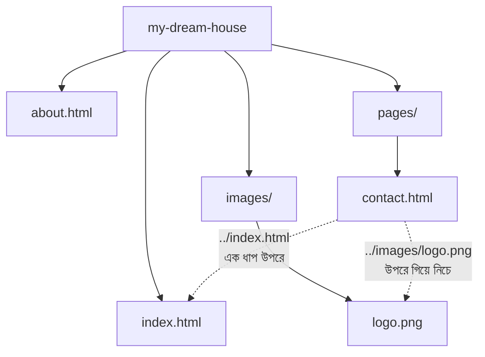

### কোড

```html
<a href="https://www.wikipedia.org" target="_blank" rel="noopener noreferrer">উইকিপিডিয়া</a>
<!-- href = hypertext reference, যেখানে যাবো সেই ঠিকানা (সবচেয়ে জরুরি attribute)
     target="_blank" = নতুন ট্যাবে খুলবে (ডিফল্ট _self = একই ট্যাবে)
     rel="noopener noreferrer" = নতুন ট্যাবের পেজটা যেন আপনার পেজের ওপর নিয়ন্ত্রণ না পায়
                                 (নিরাপত্তার অভ্যাস; আধুনিক ব্রাউজার _blank-এ নিজেই noopener ধরে, তবু লেখা ভালো) -->

<a href="about.html">আমাদের সম্পর্কে</a>
<!-- href="about.html" = relative URL, একই ফোল্ডারের about.html ফাইলে যাবে -->

<a href="#contact">নিচে যোগাযোগে যান</a>
<!-- href="#contact" = একই পাতার ভেতরে লাফ। # চিহ্নের পরের নামটা নিচের কোনো element-এর id-র সাথে মিলতে হবে -->

<h2 id="contact">যোগাযোগ</h2>
<!-- id="contact" = উপরের লিংক এই নামটা খুঁজে এখানে এসে থামবে (বইয়ের সূচিপত্র থেকে পৃষ্ঠায় যাওয়ার মতো) -->

<a href="mailto:hello@example.com?subject=নমস্কার">ইমেইল করুন</a>
<!-- mailto: = ব্রাউজারকে বলে ইমেইল অ্যাপ খুলতে। ?subject=... = আগে থেকে বিষয় বসিয়ে দেয় -->

<a href="tel:+8801700000000">কল করুন</a>
<!-- tel: = মোবাইলে সরাসরি ডায়াল করার লিংক (নম্বরটা নমুনা) -->

<a href="files/my-cv.pdf" download="Rafsun-CV.pdf">CV ডাউনলোড</a>
<!-- download = খুলবে না, সরাসরি ডাউনলোড হবে। মানটা (Rafsun-CV.pdf) = ডাউনলোড হওয়া ফাইলের নাম -->

<a href="index.html">
  
</a>
<!-- ছবিও লিংক হতে পারে। a-এর ভেতরে img রাখলে ছবিতে ক্লিক করলেই যাবে।
     alt = ছবি না দেখা গেলে বা screen reader-এর জন্য বিবরণ -->
```

**`target`-এর মান:** `_self` (একই ট্যাব, ডিফল্ট) · `_blank` (নতুন ট্যাব) · `_parent` / `_top` (frame-এর ক্ষেত্রে)।

> **ভালো অভ্যাস:** লিংকের লেখা যেন নিজে নিজেই অর্থ বহন করে। ❌ "[এখানে ক্লিক করুন](#)" · ✅ "[ভর্তির নিয়মাবলি পড়ুন](#)" — screen reader ব্যবহারকারীরা শুধু লিংকগুলোর তালিকা শুনে পাতা বোঝেন।

> **মনে রাখার গল্প-সূত্র:** *"`href` = গন্তব্যের ঠিকানা। বাইরের বাড়ির জন্য পুরো ঠিকানা (absolute), নিজের বাড়ির ভেতরে শুধু দিক (relative)। `..` মানে এক ধাপ বাইরে বেরিয়ে আসা।"*

---

## ৯. দেয়ালের ছবি, জানালা আর টিভি: Image ও Multimedia

### ছবি: ``

```html

<!-- img = void element, তাই closing tag নেই
     src  = source, ছবির ফাইলের ঠিকানা (relative বা absolute)
     alt  = alternative text। তিনটা কারণে জরুরি: (১) ছবি লোড না হলে এই লেখা দেখায়
            (২) screen reader ব্যবহারকারীকে পড়ে শোনায় (৩) Google ছবি বুঝতে এটা পড়ে
            সাজসজ্জার ছবি হলে alt="" (খালি) রাখুন — তখন screen reader এড়িয়ে যায়
     width/height = ছবির আসল মাপ। দিলে ছবি লোড হওয়ার আগেই ব্রাউজার জায়গা ধরে রাখে,
                    ফলে পেজ হঠাৎ নিচে সরে যায় না (Layout Shift কমে)
     loading="lazy" = ছবিটা স্ক্রলে কাছাকাছি এলে তবেই লোড হবে — পেজ দ্রুত খোলে -->
```

> **`<image>` লেখা ভুল!** সঠিক ট্যাগ ``। (`<image>` লিখলে ব্রাউজার নিজেই সেটাকে `` ধরে নেয়, কিন্তু সবসময় `img` লিখবেন।)

### ছবির ফরম্যাট: কোনটা কখন

| ফরম্যাট | কখন ভালো |
|---|---|
| **JPG/JPEG** | ছবি/ফটো (ছোট সাইজ, কিন্তু স্বচ্ছতা নেই) |
| **PNG** | স্বচ্ছ ব্যাকগ্রাউন্ড, স্ক্রিনশট, লোগো |
| **WebP / AVIF** | আধুনিক, JPG/PNG-র চেয়ে অনেক ছোট সাইজ |
| **SVG** | আইকন/লোগো — গাণিতিক আঁকা, যত বড় করুন ঝাপসা হয় না |
| **GIF** | ছোট অ্যানিমেশন (বড় ভিডিওর জন্য বদলে video ব্যবহার করুন) |

### সব স্ক্রিনে ঠিক ছবি: `srcset` আর `<picture>`

ছোট ফোনে বড় ছবি নামালে ডেটা নষ্ট। তাই **স্ক্রিন অনুযায়ী আলাদা ছবি** দেওয়া যায়:

```html

<!-- src    = পুরোনো ব্রাউজারের জন্য ভরসার (fallback) ছবি
     srcset = ছবির তালিকা — প্রতিটার পাশে w দিয়ে ছবির আসল প্রস্থ (pixel) লেখা
     sizes  = ছবিটা পাতায় কত জায়গা নেবে তার হিসাব: স্ক্রিন ৬০০px বা কম হলে পুরো প্রস্থ (100vw), নাহলে ৮০০px
              ব্রাউজার এই দুটো মিলিয়ে সবচেয়ে উপযুক্ত ছবিটা নিজে বেছে নেয় -->

<picture>
  <source srcset="images/house.avif" type="image/avif" />
  <source srcset="images/house.webp" type="image/webp" />
  
</picture>
<!-- picture = ছবির বেছে-নেওয়ার-বাক্স। ব্রাউজার উপর থেকে নিচে দেখে — যে ফরম্যাট বোঝে, প্রথমে সেটাই নেয়
     type = ফাইলের MIME type, ব্রাউজার না বুঝলে ওই source বাদ দিয়ে পরেরটায় যায়
     শেষের img = সবার ভরসা এবং ছবি দেখানোর আসল ট্যাগ (এটা বাদ দেওয়া যাবে না) -->
```

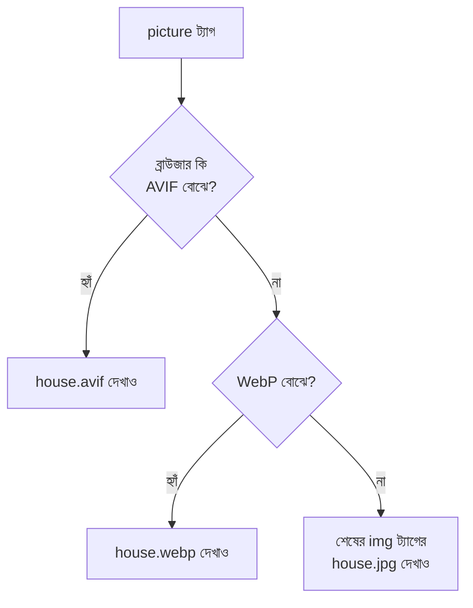

### ছবি + ক্যাপশন: `<figure>` ও `<figcaption>`

```html
<figure>
  
  <figcaption>চিত্র ১: আমার বাড়ির বাগান</figcaption>
</figure>
<!-- figure = ছবি/চিত্র/কোড এমন জিনিস যা লেখার প্রবাহ থেকে সরালেও অর্থ নষ্ট হয় না
     figcaption = ওই figure-এর ক্যাপশন। ছবির সাথে ক্যাপশন যে একসাথে বাঁধা, ব্রাউজার ও screen reader তা বোঝে -->
```

### Video ও Audio (ভিত্তি)

```html
<video src="media/house-tour.mp4" controls width="640" poster="images/tour-cover.jpg">
  আপনার ব্রাউজার video সমর্থন করে না।
</video>
<!-- src    = ভিডিও ফাইলের ঠিকানা
     controls = play/pause/volume বাটন দেখাবে (না দিলে ভিডিও শুধু ছবির মতো পড়ে থাকবে)
     width  = ভিডিওর প্রস্থ
     poster = ভিডিও চালানোর আগে যে ছবিটা দেখাবে (কভার)
     ভেতরের লেখা = fallback, পুরোনো ব্রাউজারে দেখাবে -->

<audio src="media/welcome.mp3" controls>আপনার ব্রাউজার audio সমর্থন করে না।</audio>
<!-- audio = শুধু শব্দের জন্য; controls না দিলে কিছুই দেখা যাবে না -->
```

> 🔎 `<source>` দিয়ে একাধিক ফরম্যাট, `<track>` দিয়ে সাবটাইটেল, `autoplay` কেন `muted` ছাড়া চলে না, JavaScript দিয়ে play/pause — সব **[পরের ফাইলে](./lists-table-form-multimedia-details-and-dialog-elements.md)**।

### অন্যান্য ছবি-সংক্রান্ত ট্যাগ

```html
<!-- Inline SVG: কোডের ভেতরেই আঁকা ছবি -->
<svg width="60" height="60" viewBox="0 0 60 60" role="img" aria-label="লাল বৃত্ত">
  <circle cx="30" cy="30" r="25" fill="tomato" />
</svg>
<!-- svg = আঁকার ক্যানভাস। width/height = ক্যানভাসের মাপ
     viewBox="0 0 60 60" = ক্যানভাসের ভেতরের হিসাবের ঘর (x শুরু, y শুরু, প্রস্থ, উচ্চতা)
     circle: cx, cy = বৃত্তের কেন্দ্র; r = ব্যাসার্ধ (radius); fill = ভেতরের রং
     role="img" + aria-label = screen reader-কে বলে "এটা একটা ছবি, নাম হলো লাল বৃত্ত" -->

<!-- Image Map: এক ছবির বিভিন্ন অংশে আলাদা লিংক -->

<map name="plan">
  <area shape="rect" coords="0,0,100,100" href="kitchen.html" alt="রান্নাঘর" />
  <area shape="circle" coords="200,50,40" href="garden.html" alt="বাগান" />
</map>
<!-- usemap="#plan" = এই ছবিতে "plan" নামের map ব্যবহার করো (# চিহ্ন সহ)
     map name="plan" = ম্যাপের নাম, উপরের usemap-এর সাথে মিলতে হবে
     area = ছবির ক্লিক-যোগ্য এলাকা। shape = আকৃতি, coords = আকৃতির x,y মাপ, href = কোথায় যাবে, alt = বর্ণনা -->
```

> **মনে রাখার গল্প-সূত্র:** *"ছবি = দেয়ালের ফ্রেম। `alt` = ফ্রেমের নিচের ছোট্ট কার্ড (অন্ধ অতিথিকে পড়ে শোনানো হয়)। `width/height` = ফ্রেমের জায়গা আগেই রেখে দেওয়া। `picture` = 'তোমার চোখ AVIF দেখতে পারলে ওটা, নাহলে পরেরটা।'"*

---

## ১০. বাড়ির নোটিশ বোর্ড: Table (ভিত্তি)

নোটিশ বোর্ডে মাসিক খরচের ছক থাকে — **সারি (row)** আর **কলাম (column)** মিলে **ঘর (cell)**। ডেটা যখন স্বভাবতই ছকে বাঁধা, তখনই `<table>`।

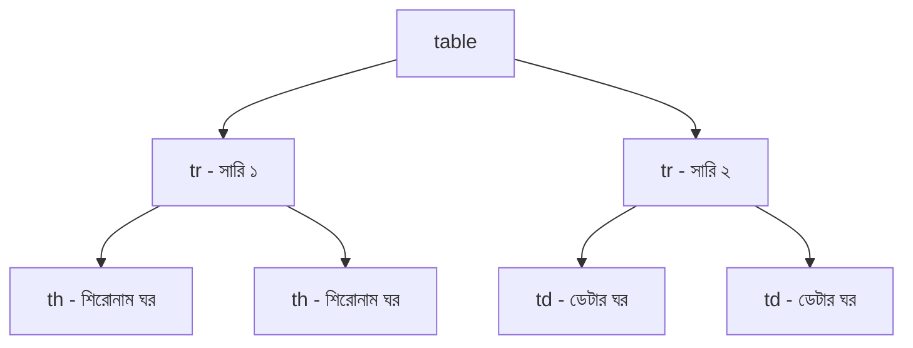

```html
<table border="1">
  <tr>
    <th>খাত</th>
    <th>টাকা</th>
  </tr>
  <tr>
    <td>বিদ্যুৎ বিল</td>
    <td>১,৫০০</td>
  </tr>
  <tr>
    <td>ইন্টারনেট</td>
    <td>১,০০০</td>
  </tr>
</table>
<!-- table = পুরো ছক
     border="1" = শুধু শেখার জন্য দ্রুত দাগ দেখতে; পাকা কাজে CSS border ব্যবহার করুন (এই attribute পুরোনো)
     tr = table row, প্রতিটা সারির জন্য একটা
     th = table header cell — শিরোনামের ঘর (মোটা ও মাঝখানে বসে, screen reader জানে এটা শিরোনাম)
     td = table data cell — আসল তথ্যের ঘর -->

<table border="1">
  <tr>
    <th colspan="2">ঘরের তালিকা</th>
    <!-- colspan="2" = এই ঘরটা পাশাপাশি ২টা কলাম জুড়ে থাকবে -->
  </tr>
  <tr>
    <td rowspan="2">নিচতলা</td>
    <!-- rowspan="2" = এই ঘরটা উপর-নিচ ২টা সারি জুড়ে থাকবে -->
    <td>বসার ঘর</td>
  </tr>
  <tr>
    <td>রান্নাঘর</td>
    <!-- নিচতলা ঘরটা আগের সারি থেকে নিচে নেমে এসেছে, তাই এই সারিতে কলাম একটাই লিখলাম -->
  </tr>
</table>
```

> ⚠️ **Table দিয়ে পাতার লেআউট (পাশাপাশি বাক্স সাজানো) বানাবেন না।** টেবিল শুধু *ছকে বাঁধা তথ্যের* জন্য। লেআউটের কাজ CSS Flexbox/Grid-এর।
>
> 🔎 `caption`, `colgroup`, `thead/tbody/tfoot`, `scope`, accessibility, ছক ছোট স্ক্রিনে দেখানো — সব **[পরের ফাইলে](./lists-table-form-multimedia-details-and-dialog-elements.md)**।

---

## ১১. রিসেপশন ডেস্ক: Form (ভিত্তি)

আপনার বাড়িতে কেউ এলে রিসেপশনে **ভিজিটর ফর্ম** পূরণ করে — নাম, ফোন, কেন এসেছেন। Website-এও তেমনই, ব্যবহারকারীর কাছ থেকে তথ্য নিতে `<form>`। লগইন, সার্চ বক্স, রেজিস্ট্রেশন, কমেন্ট — সবই form।

```html
<form action="/submit-visitor" method="post">
  <!-- form = পুরো ফর্মের খাম
       action = ফর্ম জমা দিলে তথ্য কোন ঠিকানায় (server-এর কোন route-এ) যাবে
       method = কীভাবে পাঠাবে: post (গোপনে body-তে) বা get (ঠিকানার শেষে লেখা হয়ে) -->

  <label for="visitorName">আপনার নাম</label>
  <!-- label = ঘরের পাশের লেখা। for="visitorName" = নিচের কোন ঘরের জন্য (input-এর id-র সাথে মিলতে হবে)
       label-এ ক্লিক করলে ঘরটায় কার্সর চলে যায় — মোবাইলে আঙুলের জন্য বিরাট সুবিধা -->
  <input type="text" id="visitorName" name="visitor_name" placeholder="যেমন: রাফসুন" required />
  <!-- input = তথ্য নেওয়ার ঘর
       type="text" = সাধারণ লেখার ঘর
       id="visitorName" = label-এর for এর সাথে জুড়তে (পাতায় অনন্য)
       name="visitor_name" = ⭐ সবচেয়ে জরুরি! Server তথ্যটা এই নামেই পাবে ("visitor_name" = "রাফসুন")
                            name না থাকলে ঘরের তথ্য জমাই যায় না
       placeholder = ঘর খালি থাকলে হালকা রঙে দেখানো ইঙ্গিত
       required = খালি রেখে Submit করা যাবে না -->

  <label for="visitorEmail">ইমেইল</label>
  <input type="email" id="visitorEmail" name="visitor_email" />
  <!-- type="email" = ব্রাউজার নিজেই যাচাই করে @ আছে কিনা; মোবাইলে @ সহ কিবোর্ড আসে -->

  <label for="reason">কেন এসেছেন?</label>
  <textarea id="reason" name="reason" rows="3"></textarea>
  <!-- textarea = একাধিক লাইনের লেখার ঘর। rows = কয় লাইন উঁচু দেখাবে
       ভেতরের লেখা ট্যাগের মাঝখানে লিখতে হয় (value attribute নয়) -->

  <button type="submit">জমা দিন</button>
  <!-- button type="submit" = ক্লিক করলে ফর্মের সব তথ্য action-এর ঠিকানায় পাঠাবে -->
</form>
```

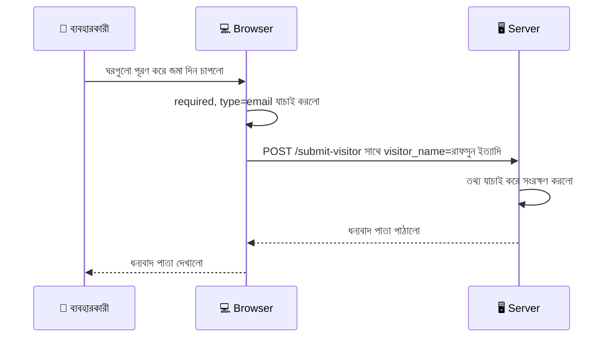

**GET বনাম POST — এক নজরে:**

| | GET | POST |
|---|---|---|
| তথ্য যায় | ঠিকানার শেষে (`?name=রাফসুন`) — সবাই দেখতে পায় | Request-এর ভেতরে (body) — ঠিকানায় দেখা যায় না |
| কখন | সার্চ, ফিল্টার (বুকমার্ক/শেয়ার করা যায়) | লগইন, রেজিস্ট্রেশন, পাসওয়ার্ড, ফাইল আপলোড |
| বিপদ | পাসওয়ার্ড ঠিকানায় দেখা যাবে ❌ | — |

> ⚠️ ব্রাউজারের `required` যাচাই শুধু সুবিধার জন্য — চালাক ব্যবহারকারী DevTools দিয়ে এটা সরিয়ে দিতে পারে। **আসল যাচাই সবসময় Server-এ** করতে হবে।
>
> 🔎 সব `input type`, checkbox, radio, select, fieldset, validation-এর পূর্ণ আলোচনা **[পরের ফাইলে](./lists-table-form-multimedia-details-and-dialog-elements.md)**।

---
## ১২. ঘরের নামফলক: Semantic Tags

ধরুন আপনার বাড়ির প্রতিটা ঘরই একই রকম, কোনোটার দরজায় নাম নেই। অতিথি এসে বুঝবে না কোনটা রান্নাঘর, কোনটা শোবার ঘর। আবার অন্ধ অতিথি সাথে থাকলে তার আরও বিপদ।

`<div>` হলো নামহীন ঘর। **Semantic Tag হলো নামফলক-লাগানো ঘর** — নামটাই বলে দেয় ঘরটা কীসের জন্য।

```html
<!-- ❌ "div-এর জঙ্গল" (Div Soup): কোনো নাম নেই -->
<div class="top">
  <div class="menu"></div>
</div>
<div class="content"></div>
<div class="bottom"></div>

<!-- ✅ Semantic: নামফলক সহ -->
<header>
  <nav></nav>
</header>
<main></main>
<footer></footer>
```

### কেন Semantic Tag?

1. **Accessibility** — screen reader ব্যবহারকারী "শুধু মূল লেখায় যাও" বা "মেনুতে যাও" বলে সরাসরি লাফ দিতে পারেন
2. **SEO** — Google বোঝে পাতার আসল কনটেন্ট কোনটা (`main`), কোনটা শুধু সাজ (`footer`, `aside`)
3. **পড়া সহজ** — নতুন ডেভেলপার কোড খুলেই বাড়ির নকশা বুঝে যায়
4. **রক্ষণাবেক্ষণ** — `<div class="hdr2">`-এর চেয়ে `<header>` স্পষ্ট

### ঘরের নামের তালিকা

| ট্যাগ | গল্পে | কাজ |
|---|---|---|
| `<header>` | সদর দরজার উপরের নামফলক | পাতা/সেকশনের মাথা — লোগো, শিরোনাম, মেনু |
| `<nav>` | বাড়ির দিকনির্দেশক ম্যাপ | প্রধান নেভিগেশন লিংকের গুচ্ছ |
| `<main>` | মূল বসার ঘর | পাতার **মূল** কনটেন্ট (পাতায় একটাই) |
| `<section>` | বাড়ির ভেতরের আলাদা কক্ষ | একই বিষয়ের একটা অংশ, সাধারণত নিজের শিরোনাম সহ |
| `<article>` | স্বয়ংসম্পূর্ণ চিঠি/খবর | আলাদা করে তুললেও অর্থবহ — ব্লগ পোস্ট, খবর, কমেন্ট |
| `<aside>` | পাশের ঘরের ঘোষণা-বোর্ড | মূল লেখার সাথে সম্পর্কিত কিন্তু আলাদা — সাইডবার, বিজ্ঞাপন, টিপস |
| `<footer>` | বাড়ির নিচের ঠিকানা-ফলক | কপিরাইট, যোগাযোগ, সোশ্যাল লিংক |
| `<figure>` + `<figcaption>` | ক্যাপশনসহ ছবি | ছবি/ডায়াগ্রাম/কোড এবং তার ক্যাপশন |
| `<address>` | যোগাযোগের কার্ড | লেখক/মালিকের যোগাযোগ |
| `<time>` | ক্যালেন্ডারের তারিখ | মেশিন-পাঠযোগ্য তারিখ-সময় |
| `<search>` | রিসেপশনের অনুসন্ধান ডেস্ক | সার্চ ফর্ম বা ফিল্টারের এলাকা (নতুন ট্যাগ, আধুনিক ব্রাউজারে সমর্থিত) |

### লেআউটের ছবি

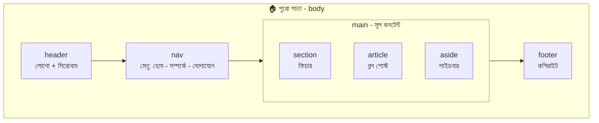

### `section`, `article`, `div` — কোনটা কখন?

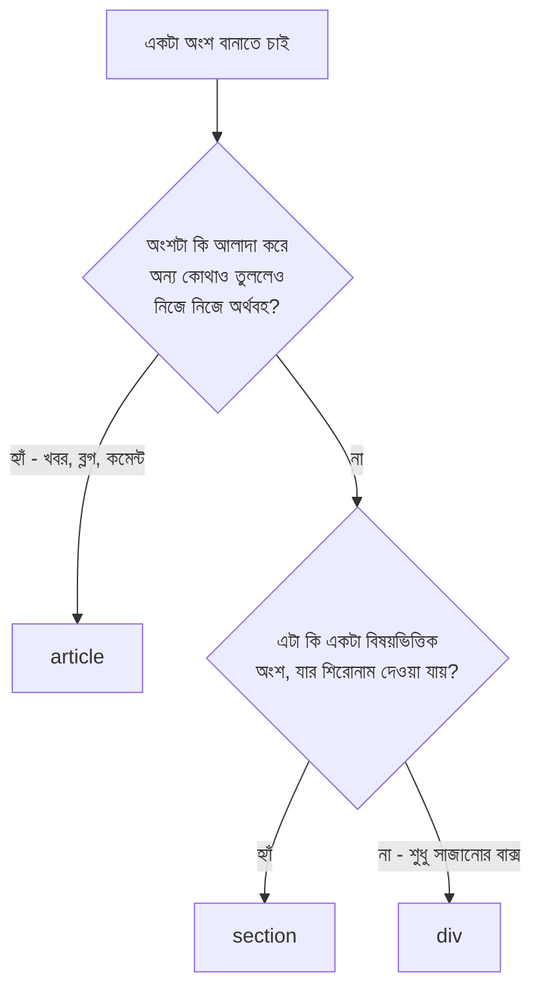

### পূর্ণ উদাহরণ

```html
<body>
  <header>
    <!-- header = পাতার মাথা; সাধারণত সব পাতায় একই -->
    <h1>স্বপ্নের বাড়ি</h1>
    <nav aria-label="প্রধান মেনু">
      <!-- nav = প্রধান মেনু। aria-label = একাধিক nav থাকলে screen reader-কে বলে "এটা কোন মেনু" -->
      <ul>
        <li><a href="index.html">হোম</a></li>
        <li><a href="about.html">সম্পর্কে</a></li>
        <li><a href="contact.html">যোগাযোগ</a></li>
      </ul>
      <!-- মেনু আসলে লিংকের তালিকা, তাই ul + li -->
    </nav>
  </header>

  <main>
    <!-- main = পাতার মূল কনটেন্ট; পুরো পাতায় একটাই। header/footer/nav এর ভেতরে থাকে না -->
    <section aria-labelledby="rooms-heading">
      <!-- section = "আমাদের ঘরসমূহ" বিষয়ভিত্তিক অংশ
           aria-labelledby="rooms-heading" = এই section-এর নাম কোন heading থেকে নেবে (heading-এর id দিয়ে) -->
      <h2 id="rooms-heading">আমাদের ঘরসমূহ</h2>
      <!-- id="rooms-heading" = উপরের aria-labelledby এই id-টাই খোঁজে -->

      <article>
        <!-- article = স্বয়ংসম্পূর্ণ একটা লেখা; আলাদা করে RSS বা অন্য সাইটে দিলেও অর্থ থাকে -->
        <h3>বসার ঘর</h3>
        <p>প্রশস্ত আলো-বাতাসের ঘর।</p>
        <p><small>প্রকাশিত: <time datetime="2026-12-16">১৬ ডিসেম্বর ২০২৬</time></small></p>
      </article>
    </section>

    <aside>
      <!-- aside = মূল লেখার সাথে সম্পর্কিত পাশের বাক্স -->
      <h2>টিপস</h2>
      <p>সকালে জানালা খুলে দিন।</p>
    </aside>
  </main>

  <footer>
    <!-- footer = পাতার তলা -->
    <p>&copy; ২০২৬ স্বপ্নের বাড়ি</p>
    <address>যোগাযোগ: <a href="mailto:hello@example.com">hello@example.com</a></address>
  </footer>
</body>
```

> **মনে রাখার গল্প-সূত্র:** *"`div` = নামহীন ঘর, `section/article/aside` = নাম-লাগানো ঘর। `header` = মাথা, `nav` = মানচিত্র, `main` = বসার ঘর (একটাই!), `footer` = তলার ঠিকানা-ফলক।"*

---

## ১৩. বাড়ির বিদ্যুৎ: Scripting

HTML দিয়ে বাড়ি তৈরি, কিন্তু বাতি জ্বলে না — কারণ বিদ্যুতের তার টানা হয়নি। **JavaScript হলো সেই বিদ্যুৎ।** HTML-এ JavaScript ঢোকানোর ট্যাগ `<script>`।

### তিনভাবে JavaScript লাগানো

```html
<!-- ১. Inline (ট্যাগের গায়ে) - ছোট পরীক্ষার জন্য, পাকা কাজে এড়ানো ভালো -->
<button onclick="alert('স্বাগতম!')">ক্লিক</button>
<!-- onclick = "ক্লিক" ঘটলে ভেতরের JS চলবে। alert() = পপআপ বার্তা দেখায় -->

<!-- ২. Internal (পাতার ভেতরেই) -->
<script>
  console.log("পাতা লোড হয়েছে");
  // console.log = ব্রাউজারের DevTools → Console ট্যাবে লেখা দেখায় (ডেভেলপারের ডায়েরি)
</script>

<!-- ৩. External (আলাদা ফাইলে) ✅ সবচেয়ে ভালো অভ্যাস -->
<script src="script.js" defer></script>
<!-- src = JS ফাইলের ঠিকানা
     defer = HTML পুরো পড়া শেষ হলে তারপর স্ক্রিপ্ট চালাও (নিচে বিস্তারিত) -->
```

### Script কোথায় বসাবেন — `defer` বনাম `async`

ব্রাউজার HTML ওপর থেকে নিচে পড়ে। মাঝপথে সাধারণ `<script>` পেলে পড়া **থামিয়ে** আগে স্ক্রিপ্ট নামায় ও চালায় — দর্শক ততক্ষণ সাদা পাতা দেখে!

| লেখা | আচরণ | গল্পে |
|---|---|---|
| `<script src="a.js">` | HTML পড়া থামিয়ে ডাউনলোড ও চালায় | কারিগর কাজ থামিয়ে তার জোড়া লাগাতে বসে |
| `<script src="a.js" defer>` | **পাশাপাশি** ডাউনলোড, HTML শেষ হলে তবেই চালায়, **ক্রম বজায় রেখে** | নিচ থেকে তার আনিয়ে রাখো, বাড়ির কাজ শেষে টানো ✅ |
| `<script src="a.js" async>` | পাশাপাশি ডাউনলোড, **আসামাত্র** চালায় — ক্রম নিশ্চিত নয় | যে তার আগে আসে সে আগে লাগে (Analytics-এর মতো স্বাধীন স্ক্রিপ্টে ঠিক) |
| `<script type="module" src="a.js">` | আধুনিক module (`import/export` চলে), নিজে থেকেই defer-এর মতো | আলাদা আলাদা বৈদ্যুতিক প্যানেল-বাক্স |

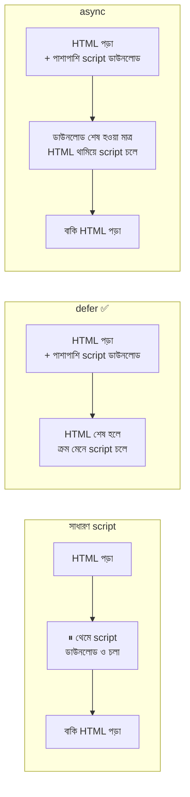

### একটা ছোট বিদ্যুৎ-সংযোগ: বাতির সুইচ

```html
<button id="lightBtn">💡 বাতি জ্বালান</button>
<p id="status">বাতি বন্ধ আছে।</p>

<script>
  const lightBtn = document.getElementById("lightBtn");
  // lightBtn = HTML-এর বাটনটা JS-এ ধরে রাখার ভেরিয়েবল।
  // const = একবার ঠিক হলে বদলাবে না (বাটন তো একটাই থাকছে)।
  // document.getElementById("lightBtn") = id="lightBtn" ওয়ালা element খুঁজে আনো

  const status = document.getElementById("status");
  // status = যে লেখাটা বদলে বদলে বাতির অবস্থা জানাবে

  let isOn = false;
  // isOn = বাতির বর্তমান অবস্থা (true = জ্বলছে, false = নিভে আছে)।
  // let ব্যবহার করলাম কারণ এর মান বারবার বদলাবে

  lightBtn.addEventListener("click", () => {
    // addEventListener = "click" ঘটনা ঘটলেই নিচের কাজ করো (ঘণ্টা-সিস্টেম)
    isOn = !isOn;
    // ! = উল্টে দাও। false হলে true, true হলে false

    status.textContent = isOn ? "বাতি জ্বলছে! 🔆" : "বাতি বন্ধ আছে।";
    // textContent = লেখা বদলে দাও। শর্ত ? ক : খ = শর্ত সত্য হলে "ক", নাহলে "খ"

    lightBtn.textContent = isOn ? "💡 বাতি নেভান" : "💡 বাতি জ্বালান";
    // বাটনের লেখাও অবস্থা অনুযায়ী বদলে গেল
  });
</script>
```

### বাকি দুটো সম্পর্কিত ট্যাগ

```html
<noscript>এই সাইট চালাতে JavaScript চালু করুন।</noscript>
<!-- noscript = ব্যবহারকারীর ব্রাউজারে JS বন্ধ থাকলেই কেবল এই বার্তা দেখায় -->

<template id="cardTemplate">
  <div class="card"><h3></h3></div>
</template>
<!-- template = "ছাঁচ"। এর ভেতরের HTML ব্রাউজার আঁকে না, পড়ে থাকে।
     JS দিয়ে কপি করে একের পর এক কার্ড বানানোর সময় কাজে লাগে -->
```

> **মনে রাখার গল্প-সূত্র:** *"বিদ্যুতের তার (`script`) বাড়ি বানানো শেষে টানুন — `defer` লিখলেই সেটা হয়। বাটন = সুইচ, `addEventListener` = সুইচ চাপলে কী হবে তার সংযোগ।"*

---

## ১৪. সুইচ, ড্রয়ার আর ডোরবেল: Interactive Element

বিদ্যুৎ এলো, এখন ঘরে **সুইচ, ড্রয়ার, দরজার বেল** — যেগুলো ব্যবহারকারী **ছোঁয়, চাপে, ভাঁজ খোলে**। কিছু interactive element JS ছাড়াই কাজ করে!

| Element | গল্পে | কাজ |
|---|---|---|
| `<button>` | সুইচ | ক্লিক করার বাটন |
| `<a>` | দরজা | লিংক |
| `<input>`, `<select>`, `<textarea>` | ফর্মের ঘর | তথ্য নেওয়া (পরের ফাইলে গভীরে) |
| `<details>` + `<summary>` | ভাঁজ-করা ড্রয়ার | ক্লিকে খোলে/বন্ধ হয় |
| `<dialog>` | হঠাৎ-আসা ঘোষণা/ডোরবেল | পপআপ ডায়ালগ |
| `<progress>` | নির্মাণের অগ্রগতি-দণ্ড | কাজ কতটা এগোলো |
| `<meter>` | পানির ট্যাংকের মিটার | মাপা যায় এমন পরিসরের মান |
| `<datalist>` | সাজেশন-তালিকা | টাইপ করতে করতে পরামর্শ |
| `contenteditable` (attribute) | লিখতে-দেওয়া দেয়াল | পাতার লেখা ব্রাউজারেই বদলানো |
| `popover` (attribute) | ছোট ভাসমান নোটিশ | JS ছাড়াই পপ-ওভার |

```html
<!-- ১. details + summary: ভাঁজ-করা তথ্য (JS ছাড়াই!) -->
<details>
  <summary>ছাদ বাগান সম্পর্কে জানুন</summary>
  <!-- summary = সবসময় দেখা যায়, ক্লিক করার শিরোনাম। details-এর প্রথম সন্তান হতে হবে -->
  <p>ছাদে ২০টা টবে সবজি আর ফুল আছে।</p>
  <!-- বাকি সব ভেতরের অংশ ক্লিকের আগে লুকানো থাকে -->
</details>

<!-- ২. progress: অগ্রগতির দণ্ড -->
<label for="build">নির্মাণ কাজ:</label>
<progress id="build" value="70" max="100">70%</progress>
<!-- value = এ পর্যন্ত কতটা হয়েছে; max = মোট কত (এখানে ১০০ এর মধ্যে ৭০ = ৭০%)
     id="build" = label-এর for এর সাথে জুড়তে; ভেতরের 70% = পুরোনো ব্রাউজারের ভরসা -->

<!-- ৩. meter: মাপা যায় এমন মান -->
<label for="tank">পানির ট্যাংক:</label>
<meter id="tank" min="0" max="100" low="20" high="80" optimum="60" value="45">45%</meter>
<!-- min/max = পরিসরের সীমা; value = বর্তমান মান
     low/high = কম/বেশির সীমারেখা; optimum = আদর্শ মান
     ব্রাউজার এগুলো দেখে রং ঠিক করে (ভালো = সবুজ, সতর্কতা = হলুদ, খারাপ = লাল) -->
<!-- progress = কাজ চলছে (শেষ হবে), meter = একটা মাপ (ওঠানামা করে) — দুটো আলাদা -->

<!-- ৪. datalist: টাইপ করার সময় সাজেশন -->
<label for="room">ঘর বেছে নিন:</label>
<input list="roomList" id="room" name="room" />
<!-- list="roomList" = এই ঘরে "roomList" নামের datalist-এর সাজেশন দেখাও (datalist-এর id দিয়ে মেলে) -->
<datalist id="roomList">
  <option value="বসার ঘর"></option>
  <option value="রান্নাঘর"></option>
  <option value="শোবার ঘর"></option>
</datalist>
<!-- id="roomList" = input-এর list এর সাথে মেলে; option value = সাজেশনের লেখা -->

<!-- ৫. contenteditable: ব্রাউজারেই লেখা বদলানো -->
<p contenteditable="true">এই লেখাটা ক্লিক করে বদলে দেখুন।</p>
<!-- contenteditable="true" = ব্যবহারকারী লেখাটা সরাসরি এডিট করতে পারে (সেভ করার ব্যবস্থা আলাদা করে করতে হয়) -->

<!-- ৬. popover: JS ছাড়া ভাসমান বাক্স (আধুনিক ব্রাউজার) -->
<button popovertarget="tipBox">টিপস দেখুন</button>
<div id="tipBox" popover>সকালে জানালা খুলে দিন।</div>
<!-- popovertarget="tipBox" = এই বাটন "tipBox" আইডির element-কে খুলবে/বন্ধ করবে
     popover = এই div ভাসমান বাক্স হয়ে যাবে; বাইরে ক্লিক করলে বা Esc চাপলে নিজে বন্ধ হয় -->
```

> 🔎 `details/summary` আর `dialog`-এর বিস্তারিত (attribute, JS method, event, accordion) → **[পরের ফাইলে](./lists-table-form-multimedia-details-and-dialog-elements.md)**।

> **মনে রাখার গল্প-সূত্র:** *"বাড়িতে যা চাপা, খোলা বা ঘোরানো যায় সবই interactive। সুইচ (`button`), ড্রয়ার (`details`), ডোরবেল (`dialog`), অগ্রগতি-দণ্ড (`progress`)।"*

---

## ১৫. বিশেষ যন্ত্রপাতি: Special Purpose Tags

বাড়িতে কিছু বিশেষ কাজের যন্ত্র থাকে — জানালা দিয়ে অন্য বাড়ি দেখা, নামফলক, ছবি-আঁকার বোর্ড। এই ট্যাগগুলো কম ব্যবহার হলেও **নির্দিষ্ট কাজে অপরিহার্য।**

### ১. `<iframe>` — জানালা দিয়ে অন্য বাড়ি দেখা

```html
<iframe
  src="https://www.youtube.com/embed/VIDEO_ID"
  title="আমাদের বাড়ির ভিডিও ট্যুর"
  width="560"
  height="315"
  loading="lazy"
  allowfullscreen
></iframe>
<!-- iframe = আপনার পাতার ভেতরে আরেকটা পাতার "জানালা" (YouTube, Google Maps ইত্যাদি)
     src = কোন পাতা দেখাবে (VIDEO_ID = নমুনা, আসল ভিডিওর আইডি বসাতে হবে)
     title = ⭐ screen reader-এর জন্য বর্ণনা — বাধ্যতামূলক অভ্যাস
     width/height = জানালার মাপ
     loading="lazy" = স্ক্রলে কাছে এলে তবেই লোড
     allowfullscreen = ফুল-স্ক্রিনে দেখার অনুমতি -->

<iframe src="https://example.com" title="নমুনা" sandbox="allow-scripts"></iframe>
<!-- sandbox = জানালার ভেতরের পাতাকে কড়া বন্ধনীতে রাখে (ফর্ম জমা, পপআপ, নেভিগেশন সব বন্ধ)।
     "allow-scripts" = শুধু JS চালানোর অনুমতি দিলাম। অচেনা সাইট দেখালে sandbox নিরাপদ অভ্যাস -->
```

> ⚠️ **Security:** অনেক সাইট নিজেই বলে দেয় "আমাকে iframe-এ দেখানো যাবে না" (`X-Frame-Options`)। আর নিজের সাইটে অচেনা iframe বসালে সাবধান!

### ২. `<embed>` ও `<object>` — পুরোনো ধাঁচের বাইরের ফাইল বসানো

```html
<embed src="files/brochure.pdf" type="application/pdf" width="600" height="400" />
<!-- embed = void element। src = ফাইল, type = ফাইলের ধরন (MIME)। PDF দেখানোর সহজ উপায় -->

<object data="files/brochure.pdf" type="application/pdf" width="600" height="400">
  <p>PDF দেখা যাচ্ছে না। <a href="files/brochure.pdf">ডাউনলোড করুন</a>।</p>
</object>
<!-- object = embed-এর মতোই, তবে ভেতরে fallback লিখতে পারে (ফাইল না দেখা গেলে ভেতরের লেখা দেখায়)
     data = ফাইলের ঠিকানা (এখানে src নয়, data!) -->
```

### ৩. `<canvas>` — আঁকার বোর্ড

```html
<canvas id="board" width="300" height="150"></canvas>

<script>
  const canvas = document.getElementById("board");
  // canvas = আঁকার বোর্ডটা JS-এ ধরলাম

  const ctx = canvas.getContext("2d");
  // ctx = context, আঁকার "তুলি"। "2d" মানে দ্বিমাত্রিক আঁকা (ছবি, গেম, চার্টের জন্য)

  ctx.fillStyle = "tomato";
  // fillStyle = এখন থেকে যা ভরাট করবো তার রং

  ctx.fillRect(20, 20, 100, 60);
  // fillRect(x, y, প্রস্থ, উচ্চতা) = বাম-উপরের কোণা থেকে (২০, ২০) দূরত্বে ১০০×৬০ মাপের আয়তক্ষেত্র
</script>
<!-- canvas নিজে শুধু খালি বোর্ড; আসল আঁকা হয় JavaScript দিয়ে। width/height = বোর্ডের পিক্সেল মাপ -->
```

### ৪. `<meta>` — বাড়ির লুকানো পরিচয়পত্র

```html
<head>
  <meta name="robots" content="index, follow" />
  <!-- robots = সার্চ ইঞ্জিনকে নির্দেশ: index = পাতা তালিকাভুক্ত করো, follow = লিংকগুলো অনুসরণ করো
       বন্ধ করতে "noindex, nofollow" -->

  <meta name="author" content="Rafsun Jani" />
  <!-- author = পাতার লেখক -->

  <meta name="theme-color" content="#2563eb" />
  <!-- theme-color = মোবাইল ব্রাউজারের ওপরের বারের রং -->

  <meta property="og:title" content="স্বপ্নের বাড়ি" />
  <meta property="og:description" content="আমার স্বপ্নের বাড়ির ওয়েবসাইট" />
  <meta property="og:image" content="https://example.com/images/cover.jpg" />
  <!-- og: = Open Graph। Facebook, WhatsApp, LinkedIn-এ লিংক শেয়ার করলে যে শিরোনাম, বিবরণ ও কভার-ছবির কার্ড দেখায় সেটা ঠিক করে
       property = (name-এর বদলে) Open Graph এই নামটা ব্যবহার করে -->

  <meta http-equiv="refresh" content="5;url=https://example.com" />
  <!-- http-equiv="refresh" = ৫ সেকেন্ড পর অন্য পাতায় নিয়ে যাবে (দৃষ্টিহীনদের জন্য সমস্যাজনক, তাই সাধারণত এড়ানো ভালো) -->
</head>
```

### ৫. `<link>` ও `<base>` — বাইরের সংযোগ

```html
<link rel="stylesheet" href="style.css" />       <!-- rel="stylesheet" = CSS ফাইল জোড়া -->
<link rel="icon" href="favicon.ico" />           <!-- rel="icon" = ট্যাবের ছোট আইকন -->
<link rel="canonical" href="https://example.com/" />
<!-- canonical = একই কনটেন্ট একাধিক URL-এ থাকলে "আসল ঠিকানা" এটা — Google-কে ধন্ধ থেকে বাঁচায় -->
<link rel="preload" href="fonts/bangla.woff2" as="font" type="font/woff2" crossorigin />
<!-- preload = "এই ফাইলটা একটু পরেই লাগবে, আগেভাগেই নামিয়ে রাখো"। as = ফাইলের ধরন (font/image/style/script) -->

<base href="https://example.com/blog/" target="_blank" />
<!-- base = এই পাতার সব relative লিংকের ভিত্তি-ঠিকানা (head-এ একবারই)। এখন "post.html" মানে "https://example.com/blog/post.html"
     target="_blank" = সব লিংক ডিফল্টে নতুন ট্যাবে -->
```

### ৬. আন্তর্জাতিক ও বিশেষ লেখার ট্যাগ

```html
<p>
  <ruby>漢<rp>(</rp><rt>han</rt><rp>)</rp></ruby>
</p>
<!-- ruby = চীনা/জাপানি অক্ষরের উপরে উচ্চারণ-সংকেত বসায়। rt = সংকেতের লেখা (ruby text)
     rp = ruby parenthesis, ruby না বুঝলে ব্রাউজার কেবল বন্ধনীসহ লেখা দেখায় -->

<p>ইংরেজিতে "<bdo dir="rtl">Hello</bdo>" ডান থেকে বামে।</p>
<!-- bdo = Bi-Directional Override, লেখার দিক জোর করে উল্টায়। dir="rtl" = right-to-left -->

<p><bdi>مرحبا</bdi> নামে একজন ব্যবহারকারী সাইনআপ করেছেন।</p>
<!-- bdi = Bi-Directional Isolate, অচেনা দিকের লেখা (যেমন ব্যবহারকারীর নাম) আলাদা করে রাখে যাতে আশপাশের লেখার দিক না গুলিয়ে ফেলে -->

<p>Data: <data value="1001">দালান-১</data></p>
<!-- data = দেখানোর লেখা এক, আর মেশিনের জন্য value আলাদা (যেমন পণ্যের কোড) -->

<p>MathML: <math><mfrac><mn>1</mn><mn>2</mn></mfrac></math></p>
<!-- math = গাণিতিক সূত্র লেখার ভাষা (MathML)। mfrac = ভগ্নাংশ, mn = সংখ্যা → ½ -->
```

### ৭. Emoji আর বিশেষ চিহ্ন

```html
<p>&#128512; &#x1F60A; ❤ &hearts;</p>
<!-- &#128512; = দশমিক সংখ্যা কোড, &#x1F60A; = hex কোড, &hearts; = নামযুক্ত entity।
     UTF-8 থাকলে সরাসরিও লিখতে পারেন (❤) — তাই head-এ charset="UTF-8" জরুরি -->
```

> **মনে রাখার গল্প-সূত্র:** *"`iframe` = জানালা দিয়ে অন্য বাড়ি, `canvas` = আঁকার বোর্ড, `meta` = নামফলকের লুকানো পরিচয়পত্র (Google আর Facebook পড়ে), `link/base` = বাইরের সাথে সংযোগ-তার।"*

---

## ১৬. পুরো বাড়ির নকশা: Advance Web Page Structure

সব যন্ত্রপাতি চেনা হলো। এবার একজন ভালো স্থপতির মতো **পুরো বাড়ির নকশা** আঁকার সময় — যেখানে কাঠামো, নামফলক, ছবি, ফর্ম, বিদ্যুৎ সব একসাথে, আর সেটা সবার (অন্ধ অতিথি, মোবাইল ব্যবহারকারী, Google) জন্যই ঠিক।

### একটা ভালো পাতার ৬টা নীতি

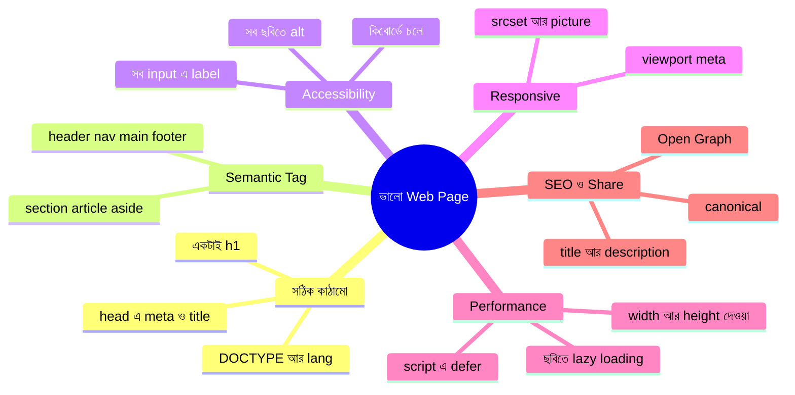

### Accessibility-র চেকলিস্ট (সবার জন্য বাড়ি)

- **Skip Link:** কিবোর্ডে Tab চেপে চলা ব্যবহারকারী প্রতিবার মেনুর ২০টা লিংক পেরিয়ে আসল লেখায় যেতে চান না → শুরুতেই একটা "মূল লেখায় যান" লিংক রাখুন
- **Heading ক্রম:** `h1 → h2 → h3` (লাফ নয়)
- **রঙের একার উপর নির্ভর নয়:** "লাল ঘরটা ভুল" না বলে "ভুল: ইমেইল ঘরটা পূরণ করুন" বলুন
- **কিবোর্ডে সবকিছু চলে:** Tab দিয়ে সব বাটন/লিংক ধরা যায় কিনা পরীক্ষা করুন
- **ARIA** = HTML-এর অর্থ বাড়ানোর অতিরিক্ত নাম-ফলক। প্রথম নিয়ম: **আগে সঠিক Semantic Tag ব্যবহার করুন; ARIA শেষ ভরসা।**

| ARIA attribute | কাজ |
|---|---|
| `aria-label="..."` | element-এর অদৃশ্য নাম (যেমন আইকন-বাটনে) |
| `aria-labelledby="id"` | অন্য একটা element-এর লেখাকে নাম হিসেবে ধরা |
| `aria-hidden="true"` | সাজসজ্জার জিনিস screen reader-এর কাছ থেকে লুকানো |
| `aria-current="page"` | মেনুর কোনটা বর্তমান পাতা |
| `role="..."` | element-এর ভূমিকা জানানো (semantic tag না থাকলে) |

### পূর্ণ নকশা: "স্বপ্নবাড়ি" ওয়েবসাইট

```html
<!DOCTYPE html>
<html lang="bn">
  <head>
    <meta charset="UTF-8" />
    <meta name="viewport" content="width=device-width, initial-scale=1.0" />
    <title>স্বপ্নবাড়ি | আপনার স্বপ্নের ঠিকানা</title>
    <meta name="description" content="স্বপ্নবাড়ি — ঘর, বাগান আর ছাদের সুন্দর সংগ্রহ।" />
    <meta property="og:title" content="স্বপ্নবাড়ি" />
    <meta property="og:image" content="https://example.com/images/cover.jpg" />
    <link rel="icon" href="favicon.ico" />
    <link rel="canonical" href="https://example.com/" />
    <link rel="stylesheet" href="style.css" />
    <script src="script.js" defer></script>
    <!-- script head-এ রাখলাম কিন্তু defer সহ — HTML পড়া থামবে না, আবার ফাইলও আগেভাগে নামা শুরু হবে -->
  </head>

  <body>
    <a href="#main-content" class="skip-link">মূল লেখায় যান</a>
    <!-- skip-link = কিবোর্ড-ব্যবহারকারী Tab চাপলেই প্রথমে এটা পাবেন, ক্লিকে মেনু টপকে সরাসরি main-এ যান
         href="#main-content" = নিচের main-এর id-র সাথে মিলছে -->

    <header>
      <a href="index.html" aria-label="স্বপ্নবাড়ি হোমপেজে যান">
        
        <!-- alt="" = লোগোর পাশে আগেই লিংকের নাম (aria-label) আছে, তাই ছবির alt খালি —
             নাহলে screen reader দুবার একই কথা বলতো -->
      </a>
      <nav aria-label="প্রধান মেনু">
        <ul>
          <li><a href="index.html" aria-current="page">হোম</a></li>
          <!-- aria-current="page" = "আপনি এখন এই পাতায় আছেন" — screen reader ও CSS দুটোই এটা ধরতে পারে -->
          <li><a href="rooms.html">ঘরসমূহ</a></li>
          <li><a href="contact.html">যোগাযোগ</a></li>
        </ul>
      </nav>
    </header>

    <main id="main-content">
      <!-- id="main-content" = skip-link-এর গন্তব্য -->
      <section aria-labelledby="hero-title">
        <h1 id="hero-title">আপনার স্বপ্নের বাড়ি এখানে</h1>
        <p>আলো, বাতাস আর সবুজে ঘেরা প্রতিটা কোণ।</p>
        <picture>
          <source srcset="images/hero.webp" type="image/webp" />
          
        </picture>
      </section>

      <section aria-labelledby="rooms-title">
        <h2 id="rooms-title">আমাদের ঘরসমূহ</h2>
        <article>
          <h3>বসার ঘর</h3>
          <figure>
            
            <!-- hero ছবি বাদে বাকি ছবিতে loading="lazy" — স্ক্রলে কাছে এলেই লোড, পাতা দ্রুত খোলে -->
            <figcaption>বসার ঘরে সকালের রোদ</figcaption>
          </figure>
          <details>
            <summary>আরও জানুন</summary>
            <p>ঘরটা ২০ ফুট × ১৫ ফুট, তিনদিকে জানালা।</p>
          </details>
        </article>
      </section>

      <section aria-labelledby="contact-title">
        <h2 id="contact-title">যোগাযোগ করুন</h2>
        <form action="/contact" method="post">
          <label for="cName">নাম</label>
          <input type="text" id="cName" name="name" required />
          <!-- id="cName" ↔ label for="cName"; name="name" = server এই নামে তথ্য পাবে -->

          <label for="cMsg">বার্তা</label>
          <textarea id="cMsg" name="message" rows="4" required></textarea>

          <button type="submit">পাঠান</button>
        </form>
      </section>

      <aside aria-label="দরকারি টিপস">
        <h2>আজকের টিপস</h2>
        <p>সকালে জানালা খুলে দিন।</p>
      </aside>
    </main>

    <footer>
      <p>&copy; ২০২৬ স্বপ্নবাড়ি। সর্বস্বত্ব সংরক্ষিত।</p>
    </footer>

    <noscript>কিছু ফিচারের জন্য JavaScript চালু করুন।</noscript>
  </body>
</html>
```

### পাতার নকশার ছবি

```mermaid
flowchart TD
    A["html lang=bn"] --> B["head"]
    A --> C["body"]
    B --> B1["meta: charset, viewport, description"]
    B --> B2["title, link, script defer"]
    C --> D["skip-link"]
    C --> E["header: logo + nav"]
    C --> F["main"]
    C --> G["footer"]
    F --> F1["section: hero"]
    F --> F2["section: ঘরসমূহ + article"]
    F --> F3["section: যোগাযোগ form"]
    F --> F4["aside: টিপস"]
```

### বহু-পাতার সাইটের ফোল্ডার-গঠন

```text
📦 my-dream-house/
 ┣ 📜 index.html          ← হোমপেজ (সার্ভার ডিফল্টে এই নামের ফাইলই খোঁজে)
 ┣ 📜 rooms.html
 ┣ 📜 contact.html
 ┣ 📜 style.css
 ┣ 📜 script.js
 ┣ 📜 favicon.ico
 ┗ 📂 images/
   ┣ 📜 logo.svg
   ┣ 📜 hero.jpg
   ┗ 📜 hero.webp
```

### Validation: নিজের বাড়ি নিজে পরীক্ষা

- **HTML Validator:** [validator.w3.org](https://validator.w3.org/) — ট্যাগ বন্ধ হয়নি, ভুল nesting, অপ্রয়োজনীয় attribute ধরিয়ে দেয়
- **Chrome DevTools → Lighthouse:** Performance, Accessibility, SEO-র স্কোর দেয়
- **Responsive টেস্ট:** DevTools (`F12`) → 📱 Toggle device toolbar

> **মনে রাখার গল্প-সূত্র:** *"ভালো নকশা = সবার জন্য ঘর। অন্ধ অতিথির জন্য নামফলক (`alt`, `label`, semantic), ছোট গাড়ির জন্য ছোট রাস্তা (`viewport`, `srcset`), ব্যস্ত অতিথির জন্য সোজা পথ (`skip-link`), আর দ্রুত ঢোকার ব্যবস্থা (`defer`, `lazy`)।"*

---

## ১৭. সারসংক্ষেপ ও Practice আইডিয়া

```mermaid
mindmap
  root((HTML Foundation))
    Internet
      Client ও Server
      Packet, TCP, IP
      HTTP ও HTTPS
      Status Code
      URL এর গঠন
    IP Address
      IPv4 ও IPv6
      Public ও Private
      localhost 127.0.0.1
      Port
    DNS
      নাম থেকে IP
      Resolver, Root, TLD, Authoritative
      A, CNAME, MX, TXT, NS
      TTL
    VS Code
      Live Server
      Prettier
      Emmet
    HTML কাঠামো
      DOCTYPE html head body
      Block ও Inline
      Global Attribute
    বিষয়বস্তু
      Text Formatting
      List ul ol dl
      Link a
      Image ও Multimedia
      Table
      Form
    উন্নত
      Semantic Tags
      Script defer async
      Interactive
      Special Purpose
      Accessibility
```

### দ্রুত মিলিয়ে নেওয়ার ছক

| বিষয় | মূল কথা |
|---|---|
| Internet | রাস্তা; Web = তার উপরের বাড়ি |
| IP | বাড়ির সংখ্যার ঠিকানা; `127.0.0.1` = আমি নিজে |
| DNS | নাম → IP এর ফোনবুক |
| `<!DOCTYPE html>` | "এটা HTML5" |
| `<head>` vs `<body>` | নামফলক/দলিল vs ভেতরের ঘর |
| `strong/em` vs `b/i` | অর্থসহ vs শুধু সাজ |
| `href` | লিংকের গন্তব্য; `..` = এক ধাপ বাইরে |
| `alt` | ছবির বিকল্প বর্ণনা (জরুরি!) |
| `name` (input) | server তথ্য এই নামে পায় |
| `main` | পাতায় একটাই |
| `defer` | HTML শেষ হলে script চলে |

### Practice-এর জন্য আইডিয়া

1. **নিজের পোর্টফোলিও পাতা বানান** — `header/nav/main/section/footer` সহ, VS Code + Live Server-এ। (কপি-পেস্ট নয়, হাতে টাইপ করুন — টাইপ করলে মাথায় থাকে।)
2. **DevTools-এ গোয়েন্দাগিরি** — যেকোনো সাইটে `F12 → Elements` ট্যাবে `<head>`-এর ভেতরে কী কী `meta` আছে দেখুন।
3. **`nslookup` পরীক্ষা** — নিজের পছন্দের ৩টা সাইটের IP বের করুন, তারপর ব্রাউজারে সরাসরি IP লিখে দেখুন খোলে কিনা।
4. **URL ভাঙা** — `new URL()` দিয়ে যেকোনো লম্বা ঠিকানা (Google সার্চের ফলাফল) ভেঙে `searchParams` দেখুন।
5. **Validator পরীক্ষা** — ইচ্ছে করে একটা closing tag বাদ দিয়ে [validator.w3.org](https://validator.w3.org/)-এ দেখুন কী বলে।
6. **Lighthouse** — নিজের পাতার Accessibility স্কোর ৯০+ করার চেষ্টা করুন।
7. **`alt` ছাড়া পাতা** — ছবি কিছুক্ষণ বন্ধ করে দেখুন (DevTools থেকে Block request URL) — কেন `alt` জরুরি বুঝবেন।

---
