# 🛋️ বাড়ির ভেতরসজ্জা: List, Table, Form, Multimedia, Details আর Dialog-এর গল্প

> এই ডকুমেন্টটা আগের ফাইলের **সরাসরি ধারাবাহিকতা** — আর এটাও **গল্প আকারে** লেখা, যাতে কিছু মুখস্থ করতে না হয়।
> **মডিউল ১: [Foundation] ইন্ট্রোডাকশন অব ওয়েব ডেভেলপমেন্ট এবং HTML**-এর অন্তর্গত এই টপিকগুলোর গভীর আলোচনা:
> *Lists (`ol`, `ul`, `dl`) · Table element (`caption`, `colgroup`, `thead`, `tbody`, `tfoot`) · Form element (`input`, `button`, `checkbox`, `radio`, `select`, `label`, `fieldset`) · Multimedia element (`image`, `video`, `audio`) · Details and summary element · Dialog element (`dialog`)*
>
> 📖 আগের ফাইল: [how-the-internet-works-to-advance-web-page-structure.md](./how-the-internet-works-to-advance-web-page-structure.md) — সেখানে Internet, IP, DNS, VS Code, HTML-এর কাঠামো, Text Formatting, Link, Semantic Tags, Scripting ইত্যাদি আছে। সেই ফাইলের **ভিত্তি (foundation)**-টুকু ধরে এখানে আমরা প্রতিটা বিষয়ে **গভীরে** যাবো।
>
> 💡 **কোড পড়ার নিয়ম:** HTML কোডে "ভেরিয়েবল" বলতে বুঝবো — `id`, `class`, `name`, `value`, `for`-এর মতো attribute-এর মান, আর JavaScript-এর `const`/`let`। প্রতিটার পাশে **কমেন্টে লেখা আছে সেটা কেন ব্যবহার করা হয়েছে**।

---

## 📚 সূচিপত্র (Table of Contents)

- [ভূমিকা: কাঠামো হয়েছে, এবার ভেতরসজ্জা](#ভূমিকা-কাঠামো-হয়েছে-এবার-ভেতরসজ্জা)
- [১. বাজারের ফর্দ আর মশলার তাক: Lists (`ul`, `ol`, `dl`)](#১-বাজারের-ফর্দ-আর-মশলার-তাক-lists-ul-ol-dl)
- [২. দেয়ালের নোটিশ বোর্ড: Table (`caption`, `colgroup`, `thead`, `tbody`, `tfoot`)](#২-দেয়ালের-নোটিশ-বোর্ড-table-caption-colgroup-thead-tbody-tfoot)
- [৩. রিসেপশন ডেস্ক: Form (`input`, `button`, `checkbox`, `radio`, `select`, `label`, `fieldset`)](#৩-রিসেপশন-ডেস্ক-form-input-button-checkbox-radio-select-label-fieldset)
- [৪. দেয়ালের ফ্রেম, টিভি আর স্পিকার: Multimedia (`img`, `video`, `audio`)](#৪-দেয়ালের-ফ্রেম-টিভি-আর-স্পিকার-multimedia-img-video-audio)
- [৫. ভাঁজ-করা ড্রয়ার: Details ও Summary element](#৫-ভাঁজ-করা-ড্রয়ার-details-ও-summary-element)
- [৬. দরজার বেল আর জরুরি ঘোষণা: Dialog element (`<dialog>`)](#৬-দরজার-বেল-আর-জরুরি-ঘোষণা-dialog-element-dialog)
- [৭. সারসংক্ষেপ ও Practice আইডিয়া](#৭-সারসংক্ষেপ-ও-practice-আইডিয়া)
- [📌 GitHub-এ যেভাবে রাখবেন](#-github-এ-যেভাবে-রাখবেন)

---

## ভূমিকা: কাঠামো হয়েছে, এবার ভেতরসজ্জা

আগের গল্পে আপনি শহরে জমি কিনেছিলেন, ঠিকানা আর নামফলক পেয়েছিলেন, আর বাড়ির দেয়াল-ছাদ-ঘরের কাঠামো (HTML) দাঁড় করিয়েছিলেন। বাড়ি এখন **দাঁড়িয়ে আছে, কিন্তু ফাঁকা।** এবার সময় ভেতরসজ্জার — আসবাব, যন্ত্রপাতি আর ব্যবস্থাপনার:

| ঘরের জিনিস (গল্পে) | HTML-এর ট্যাগ | কাজ |
|---|---|---|
| 🛒 বাজারের ফর্দ, মশলার তাক | **Lists** `ul` `ol` `dl` | তথ্য সারি সারি সাজানো |
| 📋 দেয়ালের নোটিশ বোর্ড | **Table** `table` `thead` `tbody` `tfoot` | ছকে বাঁধা তথ্য |
| 🛎️ রিসেপশন ডেস্ক (ভিজিটর ফর্ম) | **Form** `form` `input` `select` `label` | দর্শকের কাছ থেকে তথ্য নেওয়া |
| 🖼️📺🔊 ফ্রেমের ছবি, টিভি, স্পিকার | **Multimedia** `img` `video` `audio` | ছবি, ভিডিও, শব্দ |
| 🗄️ ভাঁজ-করা ড্রয়ার | **Details & Summary** | ক্লিকে খোলে-বন্ধ হয় এমন তথ্য |
| 🔔 দরজার বেল, ম্যানেজারের জরুরি ঘোষণা | **Dialog** `dialog` | পর্দার উপরে ভেসে আসা বার্তা |

### টপিকের নামে ছোট্ট সংশোধন ⚠️

কোর্সের টপিকের তালিকায় কয়েকটা নাম লেখা আছে, যেগুলো আসলে **আলাদা ট্যাগ নয়** — তাই ভুল ট্যাগ লিখে সময় নষ্ট না করতে এটা জেনে রাখুন:

| টপিকে যা লেখা | সঠিক ট্যাগ | কারণ |
|---|---|---|
| `<image>` | **``** | HTML-এ ছবির ট্যাগ `img`। (`<image>` লিখলে ব্রাউজার ভুলটা শুধরে `img` ধরে নেয়, তবু লিখবেন `img`) |
| `<checkbox>` | **`<input type="checkbox">`** | checkbox আলাদা ট্যাগ নয়, `input`-এর একটা **type** |
| `<radio>` | **`<input type="radio">`** | radio-ও তাই — `input`-এর একটা type |

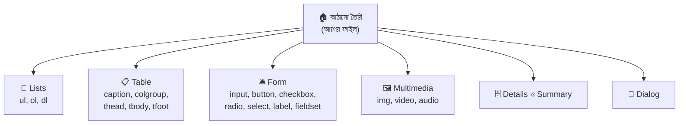

---

## ১. বাজারের ফর্দ আর মশলার তাক: Lists (`ul`, `ol`, `dl`)

বাড়ি সাজাতে বাজারে যাবেন — হাতে ফর্দ। রান্নাঘরে মশলার তাক। নির্মাণের ধাপের তালিকা। অভিধানে শব্দের পাশে অর্থ। **তালিকা এত জায়গায় আছে যে HTML-এ এর জন্য তিন রকম ট্যাগ আছে।**

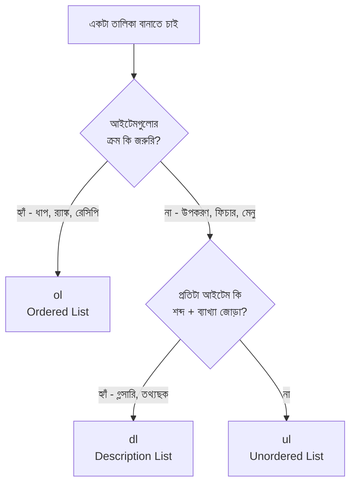

### ১.১ Unordered List — `<ul>` (ক্রম ছাড়া, বুলেট দেওয়া)

```html
<h3>বাজারের ফর্দ</h3>
<ul>
  <li>ইট</li>
  <li>সিমেন্ট</li>
  <li>রড</li>
</ul>
<!-- ul = unordered list — বুলেট (●) দিয়ে সাজায়। ফর্দের আইটেমের ক্রম বদলালে অর্থ বদলায় না, তাই ul
     li = list item — প্রতিটা আইটেমের জন্য একটা করে li
     ⚠️ ul-এর সরাসরি ভেতরে শুধু li থাকতে পারে (অন্য ট্যাগ সরাসরি রাখা ভুল) -->
```

### ১.২ Ordered List — `<ol>` (ক্রম-নম্বর সহ)

```html
<h3>বাড়ি বানানোর ধাপ</h3>
<ol>
  <li>জমি পরিষ্কার করা</li>
  <li>ভিত খোঁড়া</li>
  <li>দেয়াল তোলা</li>
  <li>ছাদ ঢালাই</li>
</ol>
<!-- ol = ordered list — ১, ২, ৩ ক্রমে। ধাপের ক্রম বদলালে বাড়ি ধসে পড়বে! তাই এখানে ol -->
```

**`<ol>`-এর বিশেষ attribute:**

| Attribute | কাজ | উদাহরণ |
|---|---|---|
| `type` | নম্বরের ধরন | `type="1"` (১,২,৩ — ডিফল্ট) · `"a"` (a,b,c) · `"A"` (A,B,C) · `"i"` (i,ii,iii) · `"I"` (I,II,III) |
| `start` | কত থেকে শুরু | `start="5"` → ৫, ৬, ৭… |
| `reversed` | উল্টো গণনা | ৩, ২, ১ |
| `value` (`li`-তে) | নির্দিষ্ট আইটেমের নম্বর জোর করে বসানো | `<li value="10">` |

```html
<ol type="A">
  <li>প্রথম ভাগ</li>
  <li>দ্বিতীয় ভাগ</li>
</ol>
<!-- type="A" = নম্বরের বদলে A, B, C… (আইনের ধারা বা অনুচ্ছেদ চিহ্নের মতো ক্ষেত্রে) -->

<ol start="5">
  <li>পঞ্চম ধাপ</li>
  <li>ষষ্ঠ ধাপ</li>
</ol>
<!-- start="5" = গণনা ৫ থেকে শুরু। আগের পাতার তালিকার পর থেকে চালিয়ে যেতে কাজে লাগে -->

<h3>ছাদ উদ্বোধনের কাউন্টডাউন</h3>
<ol reversed>
  <li>তিন</li>
  <li>দুই</li>
  <li>এক</li>
</ol>
<!-- reversed = boolean attribute (শুধু নামটা লিখলেই চালু)। এখানে ৩, ২, ১ ক্রমে দেখাবে -->
```

### ১.৩ Description List — `<dl>` (শব্দ + ব্যাখ্যা)

অভিধানের পাতা মনে করুন: **শব্দ** আর তার পাশে **অর্থ**। `dl` ঠিক সেই জোড়ার জন্য।

```html
<dl>
  <dt>ভিত</dt>
  <dd>বাড়ির নিচের শক্ত ভিত্তি, যার ওপর পুরো দালান দাঁড়ায়।</dd>

  <dt>কলাম</dt>
  <dd>ছাদের ভার বহনকারী খাড়া স্তম্ভ।</dd>
  <dd>আরেক নাম — খুঁটি।</dd>
</dl>
<!-- dl = description list (পুরো অভিধান)
     dt = description term — শব্দ/নাম/প্রশ্ন (ডান পাশে ফাঁকা রেখে বাম দিকে থাকে)
     dd = description details — অর্থ/মান/উত্তর (ডানে সামান্য ভেতরে বসে)
     এক dt-র জন্য একাধিক dd দেওয়া যায় (কলামের দুটো ব্যাখ্যা), আবার একাধিক dt-র জন্য একটা dd-ও -->

<!-- key-value তথ্যছক হিসেবেও দারুণ: -->
<dl>
  <div>
    <dt>আয়তন</dt>
    <dd>১২০০ বর্গফুট</dd>
  </div>
  <div>
    <dt>তলা</dt>
    <dd>২টি</dd>
  </div>
</dl>
<!-- dl-এর ভেতরে dt+dd জোড়াকে div দিয়ে মুড়ে দেওয়া বৈধ — CSS দিয়ে প্রতিটা জোড়া সাজানো সহজ হয় -->
```

**`dl`-এর ব্যবহার:** গ্লসারি · পণ্যের স্পেসিফিকেশন (RAM, Storage) · FAQ · প্রোফাইলের তথ্য (নাম: …, ঠিকানা: …)।

### ১.৪ Nested List — তালিকার ভেতরে তালিকা

```html
<ul>
  <li>
    রান্নাঘরের জিনিস
    <ul>
      <li>চুলা</li>
      <li>ফ্রিজ</li>
    </ul>
    <!-- ভেতরের ul বসেছে বাইরের li-এর ভিতরে — ঠিক যেন "রান্নাঘরের জিনিস" আইটেমের উপ-তালিকা -->
  </li>
  <li>শোবার ঘরের জিনিস</li>
</ul>
```

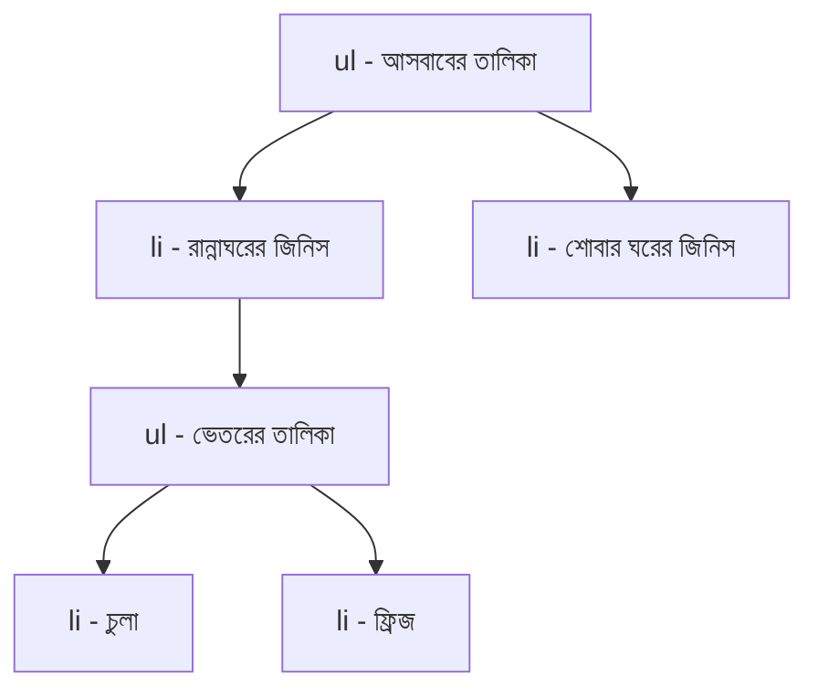

> ⚠️ **সবচেয়ে বড় ভুল:** ভেতরের `<ul>` বাইরের `<ul>`-এর সরাসরি সন্তান করে দেওয়া। সেটা **অবৈধ**। ভেতরের তালিকা সবসময় একটা **`<li>`-এর ভেতরে** থাকবে।

### ১.৫ Navigation Menu-ও আসলে একটা `ul`

ওয়েবসাইটের মেনু = **লিংকের তালিকা**। তাই প্রায় সবাই `nav > ul > li > a` ব্যবহার করে:

```html
<nav aria-label="প্রধান মেনু">
  <ul class="menu">
    <li><a href="index.html">হোম</a></li>
    <li><a href="rooms.html">ঘরসমূহ</a></li>
    <li><a href="contact.html">যোগাযোগ</a></li>
  </ul>
  <!-- class="menu" = CSS দিয়ে এই ul-কে সাজানোর নাম (বুলেট মুছে পাশাপাশি বসানো) -->
</nav>
```

```css
.menu {
  list-style: none;   /* list-style: none = বুলেট বা নম্বর সরিয়ে ফেলা */
  display: flex;      /* display: flex = li গুলো উপর-নিচ না হয়ে পাশাপাশি বসবে */
  gap: 16px;          /* gap = দুই আইটেমের মাঝে ফাঁক */
  padding: 0;         /* ul-এর ডিফল্ট বাঁ-দিকের ফাঁকা জায়গা মুছে ফেলা */
}
```

> 🍎 **একটা সূক্ষ্ম নোট:** Safari (VoiceOver) কখনো `list-style: none` দিলে ওই `ul`-কে আর "তালিকা" বলে ঘোষণা করে না। দরকার হলে `<ul role="list">` লিখে দিন।

### ১.৬ তালিকা সাজানোর CSS (ঝটপট)

| CSS property | কাজ | উদাহরণ |
|---|---|---|
| `list-style-type` | বুলেট/নম্বরের ধরন | `disc` ● · `circle` ○ · `square` ■ · `none` · `decimal` · `lower-alpha` |
| `list-style-position` | বুলেট ভেতরে না বাইরে | `inside` / `outside` |
| `list-style-image` | নিজের ছবি বুলেট | `url(star.png)` |
| `li::marker` | বুলেটের রং/আকার | `li::marker { color: tomato; }` |

### ১.৭ আরেকটা: `<menu>`

`<menu>` আসলে `<ul>`-এর মতোই, তবে **টুলবারের কমান্ড-তালিকা** বোঝাতে (যেমন "সেভ / এডিট / ডিলিট" বাটনের সারি)। সাধারণ লিংক-তালিকার জন্য `ul`-ই ঠিক।

> **মনে রাখার গল্প-সূত্র:** *"ফর্দে ক্রম লাগে না → `ul`। ধাপে ধাপে কাজে ক্রম লাগে → `ol`। অভিধানে শব্দ আর অর্থ → `dl`। তালিকার ভেতরে তালিকা থাকলে সেটা **আইটেমের (`li`) ভেতরে** রাখো, তালিকার সরাসরি ভেতরে নয়।"*

---

## ২. দেয়ালের নোটিশ বোর্ড: Table (`caption`, `colgroup`, `thead`, `tbody`, `tfoot`)

আপনার বাড়ির দেয়ালে একটা নোটিশ বোর্ড — **মাসিক খরচের ছক**। সারি-সারি, কলাম-কলাম, উপরে শিরোনাম, নিচে মোট। HTML-এর `<table>` ঠিক এই ছকের জন্য।

> 📖 আগের ফাইলে `table`, `tr`, `th`, `td`, `colspan`, `rowspan`-এর প্রাথমিক ধারণা দেখেছেন। এখানে দেখবো **পূর্ণাঙ্গ, অর্থবহ ও accessible টেবিল**।

### ২.১ পূর্ণ গঠন: ছকের অংশগুলো

একটা আদর্শ টেবিলে উপাদানগুলো **এই ক্রমে** বসে:

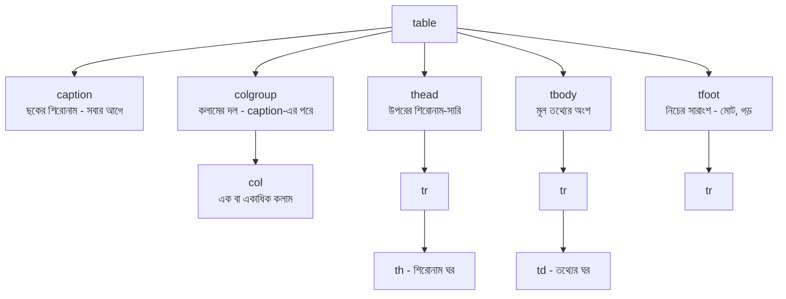

| উপাদান | ভূমিকা | গল্পে |
|---|---|---|
| `<table>` | পুরো ছক | নোটিশ বোর্ড |
| `<caption>` | ছকের **শিরোনাম** | বোর্ডের মাথার বড় লেখা |
| `<colgroup>` / `<col>` | কলামগুলোর **দল/ধরন** ঠিক করা | কলামের রঙিন ফিতে |
| `<thead>` | **শিরোনামের সারি**(গুলো) | কলামের নাম লেখা সারি |
| `<tbody>` | **আসল তথ্যের** সারিগুলো | বোর্ডের মূল অংশ |
| `<tfoot>` | **সারাংশ** সারি — মোট, গড় | নিচের "মোট" সারি |
| `<tr>` | সারি (table row) | একটা লাইন |
| `<th>` | শিরোনাম-ঘর | কলাম/সারির নাম |
| `<td>` | তথ্য-ঘর | আসল ডেটা |

### ২.২ `<caption>` — ছকের নাম

```html
<table>
  <caption>জানুয়ারি মাসের বাড়ির খরচ</caption>
  <!-- caption = টেবিলের শিরোনাম। অবশ্যই table-এর প্রথম সন্তান হতে হবে।
       এটা screen reader-কে বলে "এই ছকটা কীসের", আর সবার জন্য ছকের উপরে/নিচে পরিষ্কার নাম হিসেবে দেখায় -->
  ...
</table>
```

> `caption` আর সাধারণ `<h3>`-এর তফাত: `h3` টেবিলের বাইরে ভাসে, কিন্তু `caption` **টেবিলের সাথে বাঁধা** — টেবিল নাড়লে ক্যাপশনও নড়ে, আর screen reader টেবিলে ঢোকামাত্র তার নাম জানায়।

### ২.৩ `<thead>`, `<tbody>`, `<tfoot>` — ছকের তিন ভাগ

```html
<table>
  <caption>জানুয়ারি মাসের বাড়ির খরচ</caption>

  <thead>
    <tr>
      <th scope="col">ক্রম</th>
      <th scope="col">খাত</th>
      <th scope="col">টাকা</th>
    </tr>
    <!-- thead = শিরোনাম-সারি। scope="col" = "এই th নিচের পুরো কলামটার শিরোনাম" (screen reader-এর জন্য) -->
  </thead>

  <tbody>
    <tr>
      <td>১</td>
      <th scope="row">বিদ্যুৎ বিল</th>
      <td>১,৫০০</td>
    </tr>
    <tr>
      <td>২</td>
      <th scope="row">ইন্টারনেট</th>
      <td>১,০০০</td>
    </tr>
    <tr>
      <td>৩</td>
      <th scope="row">গ্যাস</th>
      <td>৮০০</td>
    </tr>
    <tr>
      <td>৪</td>
      <th scope="row">পানি</th>
      <td>৫০০</td>
    </tr>
    <!-- tbody = আসল তথ্য। প্রতি সারির প্রথম ঘরে th scope="row" দিয়েছি —
         "এই th ডান পাশের পুরো সারিটার শিরোনাম", তাই screen reader পড়ে: "বিদ্যুৎ বিল, টাকা, ১,৫০০" -->
  </tbody>

  <tfoot>
    <tr>
      <th scope="row" colspan="2">মোট</th>
      <!-- colspan="2" = "মোট" ঘরটা ২ কলাম জুড়ে বসবে (ক্রম + খাত) -->
      <td>৩,৮০০</td>
      <!-- ১৫০০ + ১০০০ + ৮০০ + ৫০০ = ৩৮০০ -->
    </tr>
  </tfoot>
</table>
```

**গুরুত্বপূর্ণ নিয়ম:**

- `tfoot` **`tbody`-র পরে** লেখাই আধুনিক HTML-এর নিয়ম (পুরোনো HTML 4 এ `tbody`-র আগে লিখতে হতো)।
- একটা টেবিলে **একাধিক `<tbody>`** থাকতে পারে — সারিগুলোকে ভাগ ভাগ করে সাজাতে (যেমন "নিচতলা", "দোতলা")।
- ব্রাউজার লম্বা টেবিল ছাপার সময় প্রতি পাতায় `thead` আবার বসিয়ে দিতে পারে — কাজের সুবিধা।
- `<thead>/<tbody>` না লিখে সরাসরি `<tr>` লিখলে ব্রাউজার নিজে `tbody` বসিয়ে নেয় — তবে **নিজে লেখাই ভালো অভ্যাস**।

### ২.৪ `<colgroup>` ও `<col>` — পুরো কলামকে একসাথে সাজানো

সমস্যা: "তৃতীয় কলামের পুরোটা ডানে সাজাতে চাই" — কীভাবে? প্রতিটা `td`-তে আলাদা class বসানো ক্লান্তিকর। **`colgroup` দিয়ে কলামের দলকে একবারেই নাম দেওয়া যায়।**

```html
<table>
  <caption>জানুয়ারি মাসের বাড়ির খরচ</caption>

  <colgroup>
    <col class="col-serial" />
    <col class="col-item" />
    <col class="col-amount" span="1" />
  </colgroup>
  <!-- colgroup = কলামের দল; caption-এর পরে, thead-এর আগে বসে
       col = একটা কলামের প্রতিনিধি (void element — ভেতরে কিছু নেই)। ক্রমটা কলামের ক্রম: ১ম col = ১ম কলাম…
       class="col-amount" = ৩য় কলামের সব ঘরের জন্য CSS নাম
       span="1" = এই col কয়টা কলাম নিয়ে কাজ করবে (ডিফল্ট ১; span="2" মানে পরপর দুই কলাম) -->

  <thead>...</thead>
  <tbody>...</tbody>
</table>
```

```css
.col-serial { width: 60px; }              /* width = ক্রম কলামের প্রস্থ ঠিক করে দেওয়া */
.col-amount { background: #fff7e6; }      /* background = পুরো টাকার কলামে হালকা হলুদ রং */
```

> ⚠️ `col`-এ CSS দিয়ে শুধু কিছু property কাজ করে: **`width`, `background`, `border`, `visibility`**। টেক্সটের রং, `text-align` ইত্যাদি `col`-এ কাজ করে না — ওগুলোর জন্য `td:nth-child(3)` ব্যবহার করুন।

```html
<colgroup>
  <col span="2" class="left" />   <!-- একটা col দিয়ে পরপর ২টা কলামের জন্য একই নাম -->
  <col class="right" />
</colgroup>
<!-- span="2" = এই একটা col ট্যাগ প্রথম ২টা কলাম কভার করছে, তাই আলাদা আলাদা col লিখতে হয়নি -->
```

### ২.৫ দুই স্তরের শিরোনাম: `colspan`, `rowspan` আর `scope="colgroup"`

```html
<table>
  <caption>নির্মাণ কাজের বাজেট বনাম প্রকৃত খরচ</caption>
  <thead>
    <tr>
      <th rowspan="2" scope="col">কাজ</th>
      <!-- rowspan="2" = "কাজ" ঘরটা উপরের ২টা সারি জুড়ে (একটা মাথা, নিচে আর কিছু নেই) -->
      <th colspan="2" scope="colgroup">খরচ (টাকা)</th>
      <!-- colspan="2" = "খরচ" ঘরটা পাশাপাশি ২ কলাম জুড়ে। scope="colgroup" = নিচের দুটো কলামের সম্মিলিত শিরোনাম -->
    </tr>
    <tr>
      <th scope="col">বাজেট</th>
      <th scope="col">প্রকৃত</th>
      <!-- "কাজ" ঘরটা আগের সারি থেকে নেমে এসেছে, তাই এই সারিতে মাত্র ২টা th -->
    </tr>
  </thead>
  <tbody>
    <tr><th scope="row">ভিত</th><td>৫০,০০০</td><td>৫২,০০০</td></tr>
    <tr><th scope="row">দেয়াল</th><td>৮০,০০০</td><td>৭৯,০০০</td></tr>
  </tbody>
  <tfoot>
    <tr><th scope="row">মোট</th><td>১,৩০,০০০</td><td>১,৩১,০০০</td></tr>
    <!-- বাজেট: ৫০,০০০ + ৮০,০০০ = ১,৩০,০০০ · প্রকৃত: ৫২,০০০ + ৭৯,০০০ = ১,৩১,০০০ -->
  </tfoot>
</table>
```

কাগজে ছকটা এমন দেখায়:

```text
┌────────┬─────────────────────┐
│        │     খরচ (টাকা)      │   ← colspan="2"
│  কাজ   ├──────────┬──────────┤
│        │ বাজেট    │ প্রকৃত   │
├────────┼──────────┼──────────┤
│ ভিত    │ ৫০,০০০   │ ৫২,০০০   │
│ দেয়াল │ ৮০,০০০   │ ৭৯,০০০   │
├────────┼──────────┼──────────┤
│ মোট    │ ১,৩০,০০০ │ ১,৩১,০০০ │
└────────┴──────────┴──────────┘
  ↑ rowspan="2" (উপরের দুই সারি জুড়ে "কাজ")
```

### ২.৬ `scope` কী আর কেন?

`scope` = **"এই শিরোনাম-ঘরটা কার শিরোনাম?"** — screen reader ব্যবহারকারী একটা ঘরে গেলে সে পুরো শিরোনাম শুনতে পান।

| `scope` মান | মানে |
|---|---|
| `col` | নিচের কলামটার শিরোনাম |
| `row` | ডান পাশের সারিটার শিরোনাম |
| `colgroup` | নিচের কয়েকটা কলামের দলের শিরোনাম |
| `rowgroup` | কয়েকটা সারির দলের শিরোনাম |

খুব জটিল টেবিলে (যেখানে `scope` যথেষ্ট নয়) `headers` আর `id` দিয়ে ঘরের সাথে শিরোনামের সরাসরি সংযোগ দেওয়া যায়:

```html
<th id="h-budget">বাজেট</th>
<td headers="h-budget">৫০,০০০</td>
<!-- id="h-budget" = শিরোনাম ঘরের অনন্য নাম
     headers="h-budget" = "আমার শিরোনাম হলো ঐ id-র ঘরটা" (একাধিক হলে স্পেস দিয়ে লিখুন: headers="h-a h-b") -->
```

### ২.৭ টেবিলে দেখতে সুন্দর করার CSS

```css
table {
  border-collapse: collapse;   /* border-collapse = ঘরের সীমারেখাগুলো জোড়া লাগিয়ে একটা রেখা বানায় (নাহলে দ্বিগুণ রেখা দেখায়) */
  width: 100%;                 /* width = টেবিল পুরো জায়গা নেবে */
}
th, td {
  border: 1px solid #ccc;      /* border = প্রতিটা ঘরের চারদিকে ধূসর রেখা */
  padding: 8px 12px;           /* padding = ঘরের ভেতরের লেখার চারদিকে ফাঁকা জায়গা */
  text-align: left;            /* text-align = লেখা বামে থাকবে */
}
thead th { background: #f0f4ff; }             /* thead-এর শিরোনাম ঘরে হালকা নীল রং */
tbody tr:nth-child(even) { background: #fafafa; }  /* nth-child(even) = জোড় নম্বর সারিতে হালকা রং — "জেব্রা" দাগ */
tfoot td, tfoot th { font-weight: bold; }     /* মোট সারি মোটা হরফে */

.table-wrap { overflow-x: auto; }
/* overflow-x: auto = টেবিল স্ক্রিনের চেয়ে চওড়া হলে টেবিলের চারপাশের বাক্সটা ডানে-বামে স্ক্রল হবে, পুরো পাতা ভাঙবে না */
```

```html
<div class="table-wrap">
  <table>...</table>
</div>
<!-- class="table-wrap" = টেবিলকে মুড়ে রাখা বাক্স, যাতে মোবাইলে টেবিল ছাপিয়ে গেলে শুধু বাক্সটা স্ক্রল হয় -->
```

### ২.৮ কখন Table, কখন নয়

- ✅ **Table:** ছকে বাঁধা তথ্য — খরচের হিসাব, ফলাফল, মূল্যতালিকা, ক্লাস রুটিন
- ❌ **Table নয়:** পাতার লেআউট (হেডার/সাইডবার/কনটেন্ট পাশাপাশি সাজানো) — এর জন্য CSS **Flexbox / Grid**। টেবিল দিয়ে লেআউট বানালে screen reader গুলিয়ে ফেলে, মোবাইলে ভেঙে যায়।

> **মনে রাখার গল্প-সূত্র:** *"নোটিশ বোর্ড = `table`। বোর্ডের নাম = `caption`। কলামের ফিতে = `colgroup`। মাথার সারি = `thead`, মাঝের তথ্য = `tbody`, নিচের মোট = `tfoot`। আর `scope` = 'এই শিরোনাম কার?' — অন্ধ অতিথিকেও যাতে ঘরে ঘরে ঠিক নামটা শোনানো যায়।"*

---
## ৩. রিসেপশন ডেস্ক: Form (`input`, `button`, `checkbox`, `radio`, `select`, `label`, `fieldset`)

আপনার বাড়িতে নতুন অতিথি এলে রিসেপশন ডেস্কে একটা **ভিজিটর ফর্ম** পূরণ করতে হয়:

- নাম লিখুন *(ছোট্ট লেখার ঘর)*
- কোন তলায় যাবেন — *একটা বেছে নিন* (একাধিক নয়)
- কোন সুবিধা চান — *যত ইচ্ছা টিক দিন*
- বিশেষ কিছু জানাতে চাইলে — *লম্বা মন্তব্যের ঘর*
- শেষে **"জমা দিন"** বাটন

**HTML `<form>` ঠিক এই রিসেপশন ডেস্ক।** ব্যবহারকারীর কাছ থেকে তথ্য নিয়ে server-এ পৌঁছে দেওয়াই এর কাজ। লগইন, সাইনআপ, সার্চ, কমেন্ট, অর্ডার — সবই form।

### ৩.১ `<form>` ট্যাগের attribute

```html
<form action="/visitors" method="post" enctype="application/x-www-form-urlencoded" autocomplete="on" novalidate>
  ...
</form>
```

| Attribute | কাজ | গল্পে |
|---|---|---|
| `action` | জমা দিলে তথ্য কোথায় যাবে (server-এর URL) | ফর্ম জমা দেওয়ার কাউন্টার |
| `method` | কীভাবে পাঠাবে: `get` বা `post` | খোলা পোস্টকার্ড (`get`) নাকি সিল-করা খাম (`post`) |
| `enctype` | তথ্য কোন ফরম্যাটে মোড়ানো হবে | মোড়কের ধরন |
| `target` | উত্তর কোথায় দেখাবে (`_self`, `_blank`) | উত্তর নতুন ঘরে না এই ঘরেই |
| `autocomplete` | ব্রাউজারের আগে-পূরণ সাজেশন `on`/`off` | আগের ভিজিটরের তথ্য মনে রাখা |
| `novalidate` | ব্রাউজারের নিজস্ব যাচাই বন্ধ | (নিজে যাচাই করলে) |
| `name` / `id` | ফর্মের নাম — JS দিয়ে ধরতে | ডেস্কের নামফলক |

**`enctype`-এর তিন মান:**

| মান | কখন |
|---|---|
| `application/x-www-form-urlencoded` (ডিফল্ট) | সাধারণ লেখার তথ্য |
| `multipart/form-data` | **ফাইল আপলোড থাকলে অবশ্যই** |
| `text/plain` | প্রায় ব্যবহার হয় না (ডিবাগের জন্য) |

### ৩.২ GET বনাম POST: খোলা পোস্টকার্ড না সিল-করা খাম

```html
<form action="/search" method="get">
  <input type="search" name="q" />
  <button type="submit">খুঁজুন</button>
</form>
<!-- method="get" + name="q" → জমা দিলে ঠিকানা হয়: /search?q=বসার+ঘর
     তথ্য ঠিকানার শেষে ভেসে থাকে (Query String), তাই বুকমার্ক করা বা শেয়ার করা যায় -->

<form action="/login" method="post">
  <input type="password" name="pass" />
  <button type="submit">লগইন</button>
</form>
<!-- method="post" → তথ্য Request-এর body-তে যায়, ঠিকানায় দেখা যায় না। পাসওয়ার্ড, ব্যক্তিগত তথ্য, ফাইলের জন্য এটাই -->
```

| | `GET` | `POST` |
|---|---|---|
| গল্পে | খোলা পোস্টকার্ড | সিল-করা খাম |
| তথ্য কোথায় | ঠিকানার শেষে | Request-এর body-তে |
| ব্রাউজারের ইতিহাসে জমা | হয় (সবাই দেখতে পাবে) | হয় না |
| ঠিকানা লেখা/শেয়ার | যায় | যায় না |
| কখন | সার্চ, ফিল্টার, পেজিনেশন | লগইন, সাইনআপ, অর্ডার, আপলোড |
| আকারের সীমা | ছোট (URL-এর দৈর্ঘ্য সীমিত) | অনেক বড় |

### ৩.৩ তিন বন্ধু: `id`, `name`, `for` — কে কার সাথে?

ফর্মে নতুনদের সবচেয়ে বড় গোলমাল এখানে। তিনটার কাজ **সম্পূর্ণ আলাদা**:

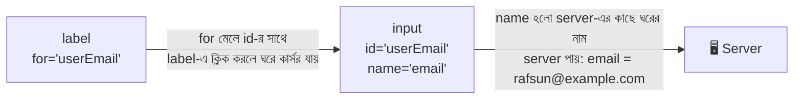

| Attribute | কার সাথে মেলে | কী করে | না দিলে কী হয় |
|---|---|---|---|
| `id` (input-এ) | `label`-এর `for`, CSS, JS | ঘরের অনন্য পরিচয় | label জোড়া লাগে না |
| `for` (label-এ) | input-এর `id` | "আমি ওই ঘরের নামফলক" | label-এ ক্লিকে ঘরে কার্সর যায় না, screen reader গুলিয়ে যায় |
| **`name`** (input-এ) | Server | **তথ্য পাঠানোর নাম** | ⚠️ **ঘরের তথ্য জমাই যায় না!** |

> ⭐ **সোনালি নিয়ম:** `name` ছাড়া কোনো ঘরের তথ্য server-এ পৌঁছায় না। JS-এ `FormData` পড়লেও `name` লাগে।

### ৩.৪ `<label>` — ঘরের নামফলক

```html
<!-- পদ্ধতি ১: for + id জোড়া (সবচেয়ে সাধারণ) -->
<label for="guestName">অতিথির নাম</label>
<input type="text" id="guestName" name="guest_name" />
<!-- for="guestName" ↔ id="guestName" মিলে গেল। label-এর লেখায় ক্লিকেও ঘরটা সক্রিয় হবে
     name="guest_name" = server এই নামে তথ্য পাবে -->

<!-- পদ্ধতি ২: label-এর ভেতরে input মুড়ে দেওয়া (id/for লাগে না) -->
<label>
  ফোন নম্বর
  <input type="tel" name="guest_phone" />
</label>
<!-- ভেতরে থাকা input আপনাআপনি এই label-এর সাথে বাঁধা -->
```

**Label কেন এত জরুরি:**
1. **Screen reader** ঘরে গেলে label পড়ে শোনায় — নাহলে অন্ধ ব্যবহারকারী জানেন না ঘরটা কীসের
2. **ক্লিকের এলাকা বড়** — মোবাইলে ছোট radio/checkbox-এ আঙুল ঠিকঠাক না পড়লেও লেখায় চাপলেই হয়
3. `placeholder` কখনোই label-এর বিকল্প নয় — লেখা শুরু করলেই placeholder মুছে যায়!

### ৩.৫ `<input>` — সবচেয়ে বহুমুখী ট্যাগ

`<input>` একটা **void element**। এর আচরণ পুরোপুরি নির্ভর করে **`type`** attribute-এর ওপর। `type` না দিলে ডিফল্ট `text`।

**লেখার ধরন:**

| `type` | কাজ | বিশেষত্ব |
|---|---|---|
| `text` | সাধারণ এক-লাইনের লেখা | ডিফল্ট |
| `password` | গোপন লেখা | অক্ষর ●●● হয়ে দেখায় (কিন্তু POST-এর বদলে GET-এ পাঠাবেন না!) |
| `email` | ইমেইল | `@` যাচাই করে, মোবাইলে `@` সহ কিবোর্ড |
| `tel` | ফোন নম্বর | মোবাইলে নম্বর-প্যাড (কোনো ফরম্যাট যাচাই করে না) |
| `url` | ওয়েব ঠিকানা | `https://` আছে কিনা যাচাই |
| `search` | সার্চ বক্স | কিছু ব্রাউজারে ✕ মোছার বাটন আসে |
| `number` | সংখ্যা | `min`, `max`, `step` চলে; ↑↓ বাটন |

**তারিখ ও সময়:**

| `type` | কাজ |
|---|---|
| `date` | তারিখ বাছাই |
| `time` | সময় বাছাই |
| `datetime-local` | তারিখ + সময় একসাথে |
| `month` | মাস ও বছর |
| `week` | সপ্তাহ ও বছর |

**বেছে নেওয়ার ধরন:**

| `type` | কাজ |
|---|---|
| `checkbox` | টিক-বাক্স — একাধিক বেছে নেওয়া যায় |
| `radio` | গোল বাটন — দলের মধ্যে একটাই |
| `range` | স্লাইডার (`min`, `max`, `step`) |
| `color` | রং বাছাই |
| `file` | ফাইল আপলোড |

**বাটন ও লুকানো:**

| `type` | কাজ |
|---|---|
| `submit` | ফর্ম জমা দেয় |
| `reset` | সব ঘর আগের অবস্থায় ফেরায় |
| `button` | সাধারণ বাটন (নিজে কিছু করে না, JS দিয়ে কাজ দিতে হয়) |
| `image` | ছবি-বাটন যা submit করে |
| `hidden` | দেখা যায় না, কিন্তু তথ্য পাঠায় (যেমন ফর্মের আইডি, টোকেন) |

### ৩.৬ `<input>`-এর সাধারণ attribute

| Attribute | কাজ | মনে রাখার কথা |
|---|---|---|
| `name` | server-এর কাছে ঘরের নাম | ⭐ না থাকলে তথ্য যায় না |
| `value` | ঘরের বর্তমান/ডিফল্ট মান | checkbox/radio-তে = "টিক দিলে যে মান যাবে" |
| `placeholder` | খালি ঘরে হালকা ইঙ্গিত | label-এর বিকল্প নয় |
| `required` | খালি রাখা যাবে না | boolean (নামটাই যথেষ্ট) |
| `readonly` | শুধু পড়া যায়, বদলানো যায় না | **জমা হয়** ✅ |
| `disabled` | সম্পূর্ণ নিষ্ক্রিয় (ধূসর) | **জমা হয় না** ❌ |
| `autofocus` | পাতা খুললে এই ঘরে কার্সর | পাতায় একটাতেই দিন |
| `autocomplete` | ব্রাউজারের সাজেশন: `on`, `off`, `email`, `new-password` ইত্যাদি | পাসওয়ার্ড-ম্যানেজারের কাজে লাগে |
| `minlength` / `maxlength` | কমপক্ষে/সর্বোচ্চ অক্ষর | text-জাতীয় type-এ |
| `min` / `max` / `step` | সংখ্যা/তারিখের সীমা ও ধাপ | `number`, `range`, `date`-এ |
| `pattern` | Regex দিয়ে ফরম্যাট যাচাই | সাথে `title` দিয়ে ইঙ্গিত দিন |
| `multiple` | একাধিক মান (`file`, `email`-এ) | |
| `accept` | কোন ধরনের ফাইল (`file`-এ) | `accept="image/*"` |
| `list` | `datalist`-এর সাজেশন জোড়া | `datalist`-এর `id` লিখে |
| `form` | ফর্মের বাইরে থেকেও ওই ফর্মের অংশ করা | ফর্মের `id` লিখে |
| `inputmode` | মোবাইলে কোন কিবোর্ড আসবে | `numeric`, `decimal` ইত্যাদি |

> ⚠️ **`readonly` বনাম `disabled`:** `readonly` ঘরের তথ্য **যায়**, `disabled` ঘরের তথ্য **যায় না**। ভুল বেছে নিলে server-এ তথ্য হারিয়ে যায় — এটা খুব সাধারণ বাগ।

### ৩.৭ Checkbox — "যতগুলো ইচ্ছে টিক দিন"

```html
<fieldset>
  <legend>কোন সুবিধাগুলো চান?</legend>

  <label>
    <input type="checkbox" name="facility" value="parking" checked />
    গাড়ি পার্কিং
  </label>
  <!-- type="checkbox" = টিক-বাক্স
       name="facility" = ⭐ তিনটা checkbox-এর নাম একই রাখলাম — এরা একই প্রশ্নের একাধিক উত্তর
       value="parking" = টিক থাকলে server-এ এই মান যাবে (মানুষ পড়ে "গাড়ি পার্কিং", server পায় "parking")
       checked = পাতা খোলার সময় আগে থেকেই টিক দেওয়া (boolean attribute) -->

  <label>
    <input type="checkbox" name="facility" value="wifi" />
    Wi-Fi
  </label>

  <label>
    <input type="checkbox" name="facility" value="lift" />
    লিফট
  </label>
</fieldset>
```

**Checkbox-এর জরুরি নিয়ম:**
- টিক **না** দিলে ওই checkbox-এর তথ্য **কোনোভাবেই যায় না** (server-এ আসেই না)
- `value` না লিখলে ডিফল্ট মান হয় `"on"`
- একই `name`-এর একাধিক checkbox টিক দিলে server একটা তালিকা পায়: `facility=parking&facility=wifi`
- একটা একক "আমি শর্তে রাজি" ধরনের checkbox-এ সাধারণত `required` দেয়

### ৩.৮ Radio — "শুধু একটা বেছে নিন"

```html
<fieldset>
  <legend>আপনি কেন এসেছেন?</legend>

  <label>
    <input type="radio" name="purpose" value="visit" checked />
    বেড়াতে
  </label>
  <!-- type="radio" = গোল বাটন
       name="purpose" = ⭐ এই একই নামই radio-দের একটা "দল" বানায়। একই দলের মধ্যে একবারে মাত্র একটাই বাছা যায়
       value="visit" = এটা বাছলে server-এ purpose=visit যাবে
       checked = আগে থেকেই বাছা (দলে একটার বেশিতে দেবেন না) -->

  <label>
    <input type="radio" name="purpose" value="business" />
    ব্যবসায়িক কাজে
  </label>

  <label>
    <input type="radio" name="purpose" value="delivery" />
    ডেলিভারি
  </label>
</fieldset>
```

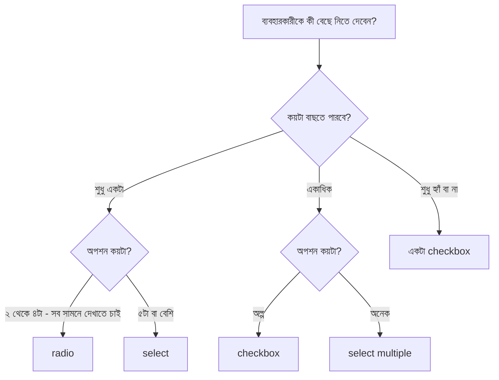

| | **Checkbox** | **Radio** |
|---|---|---|
| গল্পে | বাজারের ফর্দে টিক | পরীক্ষার MCQ-র গোল ভরাট |
| কয়টা বাছা যায় | ০ থেকে সব | একটা (দলের মধ্যে) |
| `name` | একই প্রশ্নের জন্য একই `name` (ফলাফল একাধিক) | একই `name` = একই দল (ফলাফল একটা) |
| একবার বাছলে ফেরানো | আবার ক্লিকে টিক উঠে যায় | ফেরানো যায় না (অন্য একটা বাছতে হয়) |

### ৩.৯ `<select>` — ঝুলে-পড়া তালিকা (Dropdown)

```html
<label for="floor">কোন তলায় যাবেন?</label>
<select id="floor" name="floor" required>
  <!-- select = dropdown। id="floor" ↔ label for="floor"; name="floor" = server-এ তথ্যের নাম
       required = অবশ্যই কিছু বাছতে হবে -->

  <option value="" disabled selected>-- তলা বেছে নিন --</option>
  <!-- প্রথম option = "ইঙ্গিত"। value="" (খালি) + disabled (বাছা যাবে না) + selected (শুরুতে এটাই দেখাবে)।
       required থাকায় এটা না বদলে জমা দেওয়া যাবে না -->

  <option value="ground">নিচতলা</option>
  <!-- option = একটা বিকল্প। value="ground" = server পাবে এই মান; ট্যাগের ভেতরের "নিচতলা" = মানুষ পড়ে -->

  <optgroup label="উপরের তলাগুলো">
    <!-- optgroup = বিকল্পগুলোর দল। label = দলের নাম (এটা নিজে বাছা যায় না) -->
    <option value="first">দোতলা</option>
    <option value="second">তিনতলা</option>
    <option value="roof" disabled>ছাদ (বন্ধ আছে)</option>
    <!-- disabled = এই বিকল্প বাছা যাবে না -->
  </optgroup>
</select>

<!-- একাধিক বাছতে চাইলে -->
<label for="rooms">যেসব ঘর দেখতে চান (Ctrl চেপে একাধিক):</label>
<select id="rooms" name="rooms" multiple size="4">
  <option value="living">বসার ঘর</option>
  <option value="kitchen">রান্নাঘর</option>
  <option value="bed">শোবার ঘর</option>
  <option value="garden">বাগান</option>
</select>
<!-- multiple = একাধিক বাছা যাবে
     size="4" = একসাথে ৪টা option দেখাবে (dropdown না হয়ে তালিকা-বাক্স হয়ে যায়) -->
```

### ৩.১০ `<textarea>` — লম্বা লেখার ঘর

```html
<label for="note">বিশেষ কিছু জানাতে চান?</label>
<textarea id="note" name="note" rows="4" cols="40" maxlength="300" placeholder="এখানে লিখুন..."></textarea>
<!-- textarea = একাধিক লাইনের লেখার ঘর। input-এর মতো void নয় — খোলা ও বন্ধ ট্যাগ আছে
     rows = কয় লাইন উঁচু (পরে CSS-ও দেওয়া যায়); cols = কয় অক্ষর চওড়া
     maxlength="300" = সর্বোচ্চ ৩০০ অক্ষর
     ⚠️ আগে-থেকে-লেখা লেখা দিতে চাইলে ট্যাগের ভেতরে লিখুন — value attribute কাজ করে না।
     ⚠️ ট্যাগের মাঝখানের বাড়তি স্পেস বা ফাঁকাও লেখার অংশ হয়ে যায়, তাই খোলা-বন্ধ ট্যাগ দুটো গায়ে গায়ে লেখা হলো -->
```

### ৩.১১ `<button>` — জমা ও কাজের সুইচ

```html
<button type="submit">জমা দিন</button>
<button type="reset">মুছে ফেলুন</button>
<button type="button" id="helpBtn">সাহায্য</button>
<!-- type="submit" = ফর্ম জমা দেয়
     type="reset" = সব ঘর শুরুর অবস্থায় ফেরায়
     type="button" = কিছুই করে না নিজে, শুধু JS-এর click শোনার জন্য। id="helpBtn" = JS দিয়ে ধরতে -->
```

> ⚠️ **সবচেয়ে বড় ফাঁদ:** `<form>`-এর ভেতরে `<button>`-এ `type` না লিখলে ডিফল্ট হয় **`submit`**! অর্থাৎ শুধু "সাহায্য" বাটন চাপলেও ফর্ম জমা হয়ে যাবে। তাই **সবসময় `type` লিখুন।**

| | `<button>` | `<input type="submit">` |
|---|---|---|
| ভেতরে কী রাখা যায় | লেখা, আইকন, ছবি, HTML — যা খুশি | শুধু `value`-এর লেখা |
| ব্যবহার | ✅ আধুনিক পছন্দ | পুরোনো ধাঁচ |

বাটনে অতিরিক্ত attribute: `name` + `value` (কোন বাটন চাপা হলো তা server-কে জানাতে), `disabled`, আর `formaction`/`formmethod` (এই বাটন চাপলে ফর্মের `action`/`method` বদলে ভিন্ন জায়গায় পাঠানো — যেমন একই ফর্মে "সেভ করুন" আর "ড্রাফট রাখুন")।

### ৩.১২ `<fieldset>` আর `<legend>` — প্রশ্নের দল

`fieldset` = **ফর্মের প্রাসঙ্গিক ঘরগুলোকে একটা বাক্সে গুছিয়ে রাখা**, আর `legend` = ওই বাক্সের শিরোনাম। বিশেষ করে **radio/checkbox দলে** এটা প্রায় বাধ্যতামূলক অভ্যাস — কারণ screen reader শুনিয়ে দেয় "আপনি কেন এসেছেন? — বেড়াতে · ব্যবসায়িক কাজে…"।

```html
<fieldset>
  <legend>ব্যক্তিগত তথ্য</legend>
  <!-- legend = fieldset-এর প্রথম সন্তান, দলের শিরোনাম -->
  <label for="fn">নাম</label>
  <input id="fn" name="full_name" />
  <label for="ph">ফোন</label>
  <input id="ph" name="phone" type="tel" />
</fieldset>

<fieldset disabled>
  <legend>শুধু পরিচালকের জন্য</legend>
  <input name="secret" />
</fieldset>
<!-- fieldset-এ disabled দিলে ভেতরের সব ঘর এক ঝটকায় নিষ্ক্রিয় হয়ে যায় (আর জমাও হয় না) -->
```

### ৩.১৩ বাড়তি কয়েকটা: `datalist`, `output`

```html
<!-- datalist: সাজেশনসহ টাইপ করার ঘর (আগের ফাইলে বিস্তারিত) -->
<label for="city">শহর</label>
<input list="cities" id="city" name="city" />
<datalist id="cities">
  <option value="ঢাকা"></option>
  <option value="চট্টগ্রাম"></option>
</datalist>
<!-- list="cities" ↔ datalist id="cities" — মিলে গেলে টাইপ করার সময় সাজেশন আসে; নিজের মতো অন্য কিছুও লেখা যায় (select-এর চেয়ে নমনীয়) -->

<!-- output: হিসাবের ফলাফল দেখানোর জায়গা -->
<label for="rate">সন্তুষ্টি (১–১০):</label>
<input type="range" id="rate" name="rate" min="1" max="10" value="5" />
<output for="rate" id="rateOut">5</output>
<!-- range: min/max = সীমা, value = শুরুর মান
     output for="rate" = "আমি rate ঘরের হিসাবের ফল"। JS দিয়ে স্লাইডার নাড়লে এর লেখা বদলাতে হয় -->
```

### ৩.১৪ ব্রাউজারের নিজস্ব যাচাই (Built-in Validation)

জমা দেওয়ার আগে ব্রাউজার নিজেই ভুল ধরতে পারে — **JavaScript ছাড়াই**:

| Attribute | কী যাচাই করে |
|---|---|
| `required` | খালি নয় |
| `type="email"` / `url` | সঠিক ফরম্যাট |
| `minlength` / `maxlength` | অক্ষর সংখ্যা |
| `min` / `max` | সংখ্যা বা তারিখের সীমা |
| `pattern="..."` | Regex মিলছে কিনা |

```html
<label for="mobile">মোবাইল নম্বর</label>
<input
  type="tel"
  id="mobile"
  name="mobile"
  pattern="01[3-9][0-9]{8}"
  title="১১ অক্ষরের বাংলাদেশি নম্বর দিন, যেমন 01712345678"
  required
/>
<!-- pattern="01[3-9][0-9]{8}" = Regex:
       01     → শুরুতে অবশ্যই "01"
       [3-9]  → তারপর ৩ থেকে ৯-এর যেকোনো একটা অঙ্ক (013, 014… 019)
       [0-9]{8} → এরপর ঠিক ৮টা অঙ্ক → মোট ১১ অঙ্ক
     title = pattern না মিললে ব্রাউজারের ভুল-বার্তায় এই লেখাটা ইঙ্গিত হিসেবে দেখায়
     required = খালি রাখা যাবে না -->
```

**CSS দিয়ে ঠিক/ভুল রং:**

```css
input:invalid { border-color: crimson; }    /* :invalid = ঘরের মান যাচাইয়ে ফেল করলে */
input:valid   { border-color: seagreen; }   /* :valid   = ঘরের মান যাচাইয়ে পাশ করলে */
```

> ⚠️ **অত্যন্ত জরুরি:** ব্রাউজারের এই যাচাই শুধু **ব্যবহারকারীর সুবিধার জন্য** — একজন চালাক ব্যবহারকারী DevTools দিয়ে `required` মুছে ফেলতে পারে, বা সরাসরি server-কে Request পাঠাতে পারে। **আসল যাচাই সবসময় Server-এ** করতে হবে। (পরের মডিউলগুলোতে Node.js/Express-এ এটাই করবো।)

**JavaScript দিয়ে নিজস্ব যাচাই (Constraint Validation API):**

```html
<input type="password" id="pass1" name="pass1" required minlength="6" />
<input type="password" id="pass2" name="pass2" required />

<script>
  const pass1 = document.getElementById("pass1");
  // pass1 = প্রথম পাসওয়ার্ড ঘর (মূল পাসওয়ার্ড)

  const pass2 = document.getElementById("pass2");
  // pass2 = দ্বিতীয় ঘর (নিশ্চিত করার জন্য আবার লেখা)

  pass2.addEventListener("input", () => {
    // input event = ঘরে প্রতিবার কিছু লেখা/মোছা হলেই এই কাজ চলবে
    if (pass2.value !== pass1.value) {
      pass2.setCustomValidity("দুটো পাসওয়ার্ড মিলছে না");
      // setCustomValidity(বার্তা) = ঘরটাকে "ভুল" চিহ্নিত করে, বার্তাটা জমা দেওয়ার সময় দেখায়
    } else {
      pass2.setCustomValidity("");
      // খালি স্ট্রিং দিলে ভুল চিহ্ন মুছে যায় — এটা না দিলে ঘর চিরকালের জন্য "ভুল" হয়ে থাকবে!
    }
  });
</script>
```

### ৩.১৫ ফাইল আপলোড

```html
<form action="/upload" method="post" enctype="multipart/form-data">
  <!-- enctype="multipart/form-data" = ⭐ ফাইল পাঠাতে হলে এটা বাধ্যতামূলক, নাহলে শুধু ফাইলের নাম যায়, ফাইল নয়
       method অবশ্যই post -->

  <label for="photo">বাড়ির ছবি দিন</label>
  <input type="file" id="photo" name="photo" accept="image/*" multiple />
  <!-- type="file" = ফাইল বাছাইয়ের বাটন
       accept="image/*" = শুধু ছবি বাছার ফাইল-ডায়ালগ খুলবে (ব্যবহারকারীর সুবিধা; নিরাপত্তা নয় — server-এও যাচাই লাগবে)
       multiple = একাধিক ফাইল একসাথে বাছা যাবে -->

  <button type="submit">আপলোড</button>
</form>
```

### ৩.১৬ জমা দেওয়ার পর পর্দার আড়ালে কী হয়?

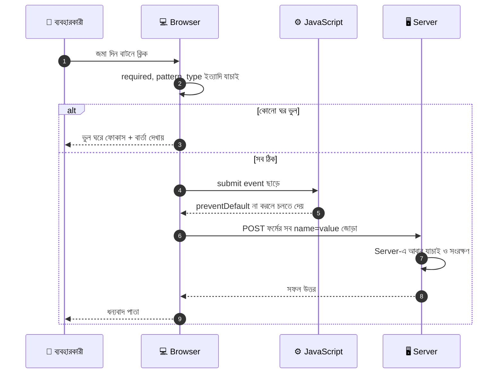

Server-এ যা যায় তা দেখতে এমন — শুধু `name=value` জোড়া, `&` দিয়ে আলাদা:

```text
guest_name=রাফসুন&purpose=visit&facility=parking&facility=wifi&floor=ground&note=...
```

### ৩.১৭ JavaScript-এ ফর্মের তথ্য পড়া (`FormData`)

MERN-এ ফর্মের তথ্য প্রায়ই JavaScript দিয়ে ধরে `fetch` দিয়ে পাঠানো হয়:

```javascript
const form = document.getElementById("visitorForm");
// form = পুরো ফর্মটা (HTML-এর <form id="visitorForm">)

form.addEventListener("submit", (event) => {
  // submit event = জমা দিন বাটন চাপা বা Enter চেপে জমা দিলে এই কাজ চলবে
  // event = ঘটনার তথ্য-object

  event.preventDefault();
  // preventDefault() = ব্রাউজারের ডিফল্ট আচরণ (পাতা রিলোড হয়ে চলে যাওয়া) থামালাম, যাতে নিজে হাতে তথ্য পাঠাতে পারি

  const formData = new FormData(form);
  // formData = ফর্মের সব ঘরের name=value জোড়ার সংগ্রহ। শুধু যেসব ঘরে name আছে সেগুলোই আসে

  const name = formData.get("guest_name");
  // .get("নাম") = ওই name-এর ঘরের মান একটা। এখানে ব্যবহারকারীর লেখা নাম

  const facilities = formData.getAll("facility");
  // .getAll("নাম") = একই name-এর একাধিক মান (তালিকা)। checkbox-এ একাধিক টিকের জন্য এটাই লাগে
  // ফল: ["parking", "wifi"]

  const data = Object.fromEntries(formData.entries());
  // data = সব জোড়াকে একটা সাধারণ object বানালাম — { guest_name: "...", purpose: "visit", ... }
  // ⚠️ একই name একাধিকবার থাকলে (checkbox) fromEntries শুধু শেষেরটা রাখে, তাই ওগুলোর জন্য getAll ব্যবহার করুন

  console.log(name, facilities, data);
});
```

### ৩.১৮ পূর্ণ উদাহরণ: "ভিজিটর নিবন্ধন ফর্ম"

```html
<form id="visitorForm" action="/visitors" method="post">
  <!-- id="visitorForm" = JS দিয়ে এই ফর্মটা ধরার নাম (উপরের JS-এর সাথে মিলছে) -->

  <fieldset>
    <legend>ব্যক্তিগত তথ্য</legend>

    <label for="guestName">নাম *</label>
    <input type="text" id="guestName" name="guest_name" required minlength="2" autocomplete="name" />
    <!-- id/for জোড়া; name="guest_name" = server-এর নাম; required = ফাঁকা চলবে না;
         minlength="2" = কমপক্ষে ২ অক্ষর; autocomplete="name" = ব্রাউজার নিজে আগের নামটা সাজেস্ট করবে -->

    <label for="guestEmail">ইমেইল</label>
    <input type="email" id="guestEmail" name="guest_email" autocomplete="email" />
    <!-- type="email" = ফরম্যাট যাচাই + মোবাইলে সঠিক কিবোর্ড -->

    <label for="visitDate">দেখা করার তারিখ</label>
    <input type="date" id="visitDate" name="visit_date" min="2026-01-01" />
    <!-- type="date" = তারিখ বাছাই; min = এর আগের তারিখ বাছা যাবে না -->

    <label for="guestCount">অতিথির সংখ্যা</label>
    <input type="number" id="guestCount" name="guest_count" min="1" max="10" value="1" />
    <!-- type="number" = শুধু সংখ্যা; min/max = ১ থেকে ১০; value="1" = শুরুর মান -->
  </fieldset>

  <fieldset>
    <legend>কেন এসেছেন?</legend>
    <label><input type="radio" name="purpose" value="visit" checked /> বেড়াতে</label>
    <label><input type="radio" name="purpose" value="business" /> ব্যবসায়িক কাজে</label>
    <!-- radio: একই name="purpose" = একই দল, একটাই বাছা যাবে; value = server-এর কাছে যাওয়া মান -->
  </fieldset>

  <fieldset>
    <legend>কোন সুবিধা চান?</legend>
    <label><input type="checkbox" name="facility" value="parking" /> পার্কিং</label>
    <label><input type="checkbox" name="facility" value="wifi" /> Wi-Fi</label>
    <!-- checkbox: একই name="facility" — একাধিক টিক দিলে একাধিক মান যাবে -->
  </fieldset>

  <label for="floor">কোন তলায়?</label>
  <select id="floor" name="floor" required>
    <option value="" disabled selected>-- বেছে নিন --</option>
    <option value="ground">নিচতলা</option>
    <option value="first">দোতলা</option>
  </select>

  <label for="note">মন্তব্য</label>
  <textarea id="note" name="note" rows="3" maxlength="300"></textarea>

  <input type="hidden" name="source" value="reception-desk" />
  <!-- type="hidden" = অদৃশ্য ঘর, কিন্তু তথ্য যায়। এখানে "এই ফর্ম রিসেপশন থেকে এসেছে" server-কে জানাচ্ছি -->

  <label>
    <input type="checkbox" name="agree" value="yes" required />
    আমি নিয়মাবলিতে রাজি
  </label>
  <!-- required checkbox = টিক না দিলে জমা যাবে না -->

  <button type="submit">জমা দিন</button>
  <button type="reset">মুছে ফেলুন</button>
</form>
```

> **মনে রাখার গল্প-সূত্র:** *"রিসেপশন ডেস্কে প্রতিটা ঘরের তিনটা পরিচয় — **`id`** (ঘরের বাড়ি-নম্বর), **`for`** (নামফলক থেকে ঘরের দিকে তীর), **`name`** (কর্তৃপক্ষকে জানানোর নাম)। একটা বাছতে **radio**, অনেকগুলো বাছতে **checkbox**, অনেক অপশনে **select**। বাটনে সবসময় **`type`** লিখুন। আর ব্রাউজারের যাচাই শুধু ভদ্রতা — আসল পাহারাদার Server।"*

---
## ৪. দেয়ালের ফ্রেম, টিভি আর স্পিকার: Multimedia (`img`, `video`, `audio`)

বাড়ির দেয়ালে ঝুলছে **ছবির ফ্রেম** (`img`), বসার ঘরে একটা **টিভি** (`video`), আর কোণায় একটা **স্পিকার** (`audio`)। তিনটাই HTML-এর নিজস্ব ট্যাগ — কোনো প্লাগইন লাগে না।

> 📖 আগের ফাইলে `img`, `srcset`, `picture`, `figure`, `svg`, `image map`-এর ভিত্তি দেখেছেন। এখানে দেখবো **ভালো `alt` লেখার কৌশল**, **video-audio-র পূর্ণ নিয়ম**, আর **JavaScript দিয়ে নিয়ন্ত্রণ**।

### ৪.১ `` — ফ্রেমের ছবি

| Attribute | কাজ | কেন লাগে |
|---|---|---|
| `src` | ছবির ফাইলের ঠিকানা | কোন ছবি দেখাবে |
| `alt` | ছবির বিকল্প বর্ণনা | ছবি না এলে, screen reader-এ, Google-এ |
| `width` / `height` | ছবির আসল মাপ (পিক্সেল) | লোডের আগেই জায়গা ধরে রাখে — পাতা লাফায় না |
| `loading="lazy"` | দরকারের সময় লোড | পাতা দ্রুত খোলে |
| `decoding="async"` | ছবি আঁকার কাজ আলাদাভাবে | পাতার বাকি অংশ আটকায় না |
| `fetchpriority="high"` | এই ছবি আগে নামাও | পাতার সবচেয়ে বড় (hero) ছবিতে |
| `srcset` + `sizes` | স্ক্রিন অনুযায়ী ছবি বাছা | মোবাইলে ছোট ছবি = কম ডেটা |

```html

<!-- fetchpriority="high" = এটা পাতার সবচেয়ে গুরুত্বপূর্ণ ছবি, তাই আগে নামাও (এখানে loading="lazy" দেবেন না — এটা তো শুরুতেই স্ক্রিনে দেখা যাচ্ছে) -->


<!-- gallery ছবি পাতার নিচের দিকে, তাই loading="lazy"; decoding="async" = ছবি ডিকোড করার কাজ ব্যাকগ্রাউন্ডে -->
```

#### ভালো `alt` লেখার নিয়ম (কী লিখবেন, কী না)

| ছবির ধরন | `alt` কী হবে | উদাহরণ |
|---|---|---|
| **তথ্যবহ ছবি** | ছবিতে যা দেখা যায়, সংক্ষেপে | `alt="সাদা সোফা আর বড় জানালাওয়ালা বসার ঘর"` |
| **শুধু সাজসজ্জা** | **খালি** `alt=""` | `alt=""` (screen reader পুরো এড়িয়ে যায়) |
| **লিংকের ভেতরের ছবি** | ছবির বর্ণনা নয়, **লিংক কোথায় নিয়ে যাবে** | `<a href="index.html"></a>` |
| **বাটনের ভেতরের আইকন** | বাটনের কাজ | `alt="মুছুন"` |
| **চার্ট/জটিল ছবি** | ছোট শিরোনাম + নিচে পুরো ব্যাখ্যা লেখা | `alt="মাসিক খরচের চার্ট"` + নিচে টেক্সটে বিস্তারিত |

> ❌ `alt="image"`, `alt="photo.jpg"`, `alt="ছবি"` — এগুলো কোনো কাজেরই না। ❌ "ছবি:…" বা "…-এর চিত্র" দিয়ে শুরুও করতে হয় না — screen reader নিজেই বলে "graphic"।
> ⚠️ `alt` **বাদ দেওয়া** আর `alt=""` **খালি রাখা** এক নয়। বাদ দিলে screen reader ফাইলের নাম পড়ে ফেলে!

#### `<picture>` দিয়ে "Art Direction" — স্ক্রিন অনুযায়ী আলাদা ক্রপ

```html
<picture>
  <source media="(min-width: 800px)" srcset="images/house-wide.webp" type="image/webp" />
  <source media="(min-width: 800px)" srcset="images/house-wide.jpg" />
  
</picture>
<!-- media="(min-width: 800px)" = স্ক্রিন ৮০০px বা চওড়া হলে এই source-এর ছবি (চওড়া ক্রপ)
     না মিললে শেষের img-এর ছোট চৌকো ছবি — মোবাইলে মূল বিষয় (বাড়ি) বড় করে দেখায়
     ব্রাউজার উপর থেকে নিচে পরীক্ষা করে প্রথম যেটা মেলে সেটাই নেয় -->
```

### ৪.২ `<video>` — বসার ঘরের টিভি

```html
<video controls width="640" poster="images/tour-cover.jpg" preload="metadata" playsinline>
  <source src="media/house-tour.webm" type="video/webm" />
  <source src="media/house-tour.mp4" type="video/mp4" />
  <track kind="subtitles" src="media/tour-bn.vtt" srclang="bn" label="বাংলা" default />
  <track kind="captions" src="media/tour-en.vtt" srclang="en" label="English" />
  আপনার ব্রাউজার video সমর্থন করে না। <a href="media/house-tour.mp4">ভিডিও ডাউনলোড করুন</a>।
</video>
<!-- video = টিভি-পর্দা।
     controls    = play/pause/সময়-রেখা/volume বাটন দেখায়। না দিলে ভিডিও চলবেই না (autoplay না থাকলে)
     width       = পর্দার প্রস্থ (height ঠিক অনুপাতে নিজে ঠিক হয়)
     poster      = ভিডিও চালানোর আগে দেখানো কভার-ছবি
     preload     = আগেভাগে কতটা নামাবে: "none" (কিছুই না) · "metadata" (শুধু সময়/মাপের তথ্য — সবচেয়ে ভারসাম্যপূর্ণ) · "auto" (যতটা পারে)
     playsinline = iPhone-এ ভিডিও ফুল-স্ক্রিন না হয়ে পাতার ভেতরেই চলবে

     source = একই ভিডিওর ভিন্ন ফরম্যাট। ব্রাউজার উপর থেকে দেখে, যেটা বোঝে সেটাই চালায়
       src  = ফাইলের ঠিকানা; type = ফাইলের ধরন (ব্রাউজার আগেই বুঝে ফাইল নামানো এড়ায়)

     track = সাবটাইটেল/ক্যাপশনের ফাইল (.vtt)
       kind    = ধরন: subtitles (অনুবাদ) · captions (সংলাপ + শব্দের বর্ণনা, বধিরদের জন্য) · descriptions · chapters · metadata
       src     = .vtt ফাইলের ঠিকানা
       srclang = সাবটাইটেলের ভাষার কোড (bn = বাংলা, en = ইংরেজি)
       label   = প্লেয়ারের মেনুতে দেখানো নাম
       default = ডিফল্টে এটা চালু থাকবে

     ট্যাগের ভেতরের সাধারণ লেখা = fallback (পুরোনো ব্রাউজারে দেখায়) -->
```

**ভিডিও ফরম্যাট কোনটা কখন:**

| ফরম্যাট | Codec | মন্তব্য |
|---|---|---|
| **MP4** | H.264 + AAC | 🥇 প্রায় সব ব্রাউজারে চলে — সবচেয়ে নিরাপদ পছন্দ |
| **WebM** | VP9 / AV1 | ছোট সাইজ, আধুনিক ব্রাউজারে |
| **Ogg** | Theora | প্রায় বাদ পড়ে গেছে |

> 🎯 সহজ নিয়ম: বেশিরভাগ ক্ষেত্রে শুধু একটা **MP4 (H.264)** দিলেই চলে। ছোট সাইজের জন্য আগে WebM, পরে MP4 `source` দেওয়া যায়।

#### বাটন ছাড়া নিজে নিজে চলা: `autoplay`, `muted`, `loop`

```html
<video src="media/banner.mp4" autoplay muted loop playsinline></video>
<!-- autoplay = পাতা খুললেই নিজে চলা শুরু
     muted    = ⭐ শব্দ বন্ধ। প্রায় সব ব্রাউজার শব্দ-সহ autoplay আটকে দেয় (বিরক্তিকর বিজ্ঞাপন ঠেকাতে) — autoplay কাজ করাতে muted লাগে
     loop     = শেষ হলে আবার প্রথম থেকে
     এই তিনটা মিলিয়ে "ব্যাকগ্রাউন্ড ভিডিও"-র সাধারণ ছাঁচ, যেখানে controls দরকার নেই -->
```

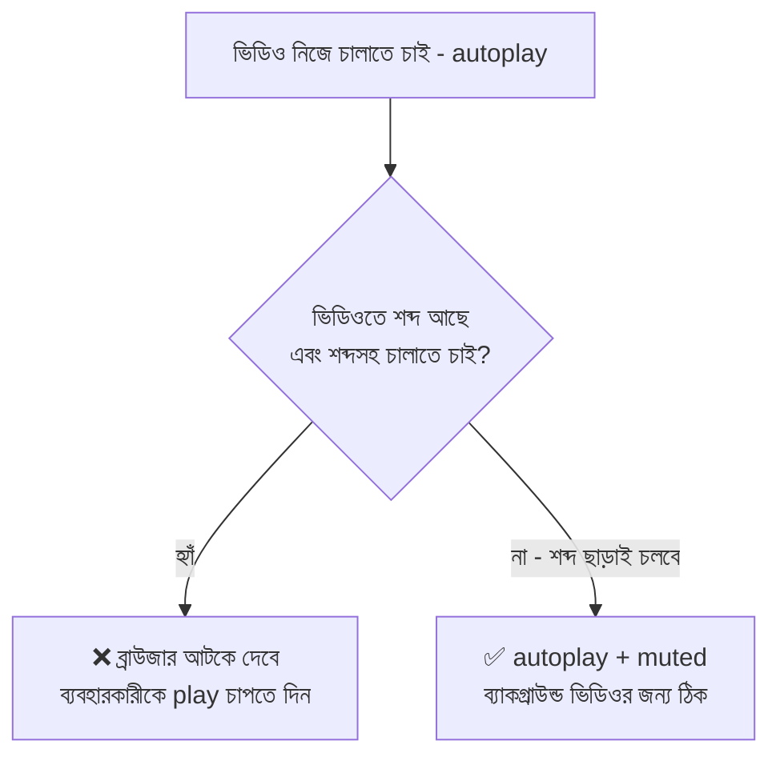

#### `<track>`-এর ফাইল: WebVTT (`.vtt`)

```text
WEBVTT

00:00:01.000 --> 00:00:04.000
স্বপ্নবাড়িতে আপনাকে স্বাগতম।

00:00:04.500 --> 00:00:08.000
এটা আমাদের বসার ঘর।
```

- প্রথম লাইন অবশ্যই `WEBVTT`
- প্রতিটা সাবটাইটেল-ব্লকে: **শুরুর সময় `-->` শেষের সময়** (`ঘণ্টা:মিনিট:সেকেন্ড.মিলিসেকেন্ড`), তার নিচে লেখা
- বধির/স্বল্পশ্রবণ ব্যবহারকারীর জন্য ক্যাপশন **অত্যন্ত জরুরি**; আবার কোলাহলে ভিডিও দেখা লোকজনও মিউট করে ক্যাপশনেই দেখেন

#### JavaScript দিয়ে ভিডিও নিয়ন্ত্রণ

```html
<video id="tour" src="media/house-tour.mp4" width="480"></video>
<button id="playPauseBtn" type="button">▶ চালান</button>
<input type="range" id="volumeBar" min="0" max="1" step="0.1" value="1" />
<span id="timeLabel">0:00</span>

<script>
  const tour = document.getElementById("tour");
  // tour = video element-টা JS-এ ধরে রাখলাম — এর গায়ে play(), pause() ইত্যাদি বিল্ট-ইন কাজ আছে

  const playPauseBtn = document.getElementById("playPauseBtn");
  // playPauseBtn = নিজের বানানো play/pause বাটন (আমরা built-in controls ব্যবহার করছি না)

  const volumeBar = document.getElementById("volumeBar");
  // volumeBar = ভলিউমের স্লাইডার। min=0 (নিঃশব্দ) থেকে max=1 (পুরো শব্দ) — video.volume ঠিক এই পরিসরই নেয়

  const timeLabel = document.getElementById("timeLabel");
  // timeLabel = কত সেকেন্ড চলেছে সেটা দেখানোর লেখা

  playPauseBtn.addEventListener("click", () => {
    if (tour.paused) {
      // tour.paused = ভিডিও এখন থামানো আছে কিনা (true/false) — ব্রাউজার নিজে এটা হালনাগাদ রাখে
      tour.play();
      // play() = ভিডিও চালাও (এটা Promise ফেরত দেয়)
      playPauseBtn.textContent = "⏸ থামান";
    } else {
      tour.pause();
      // pause() = ভিডিও থামাও
      playPauseBtn.textContent = "▶ চালান";
    }
  });

  volumeBar.addEventListener("input", () => {
    tour.volume = Number(volumeBar.value);
    // volume = ভিডিওর শব্দ (0 থেকে 1)। স্লাইডারের value স্ট্রিং হয়ে আসে, তাই Number(...) দিয়ে সংখ্যা বানালাম
  });

  tour.addEventListener("timeupdate", () => {
    // timeupdate event = ভিডিও চলতে থাকলে বারবার (সেকেন্ডে কয়েকবার) এই ঘটনা ঘটে
    timeLabel.textContent = Math.floor(tour.currentTime) + " সেকেন্ড";
    // currentTime = ভিডিও এখন কত সেকেন্ডে আছে (দশমিকসহ); Math.floor = দশমিক ফেলে পূর্ণ সংখ্যা
  });

  tour.addEventListener("ended", () => {
    // ended event = ভিডিও শেষ হলে
    playPauseBtn.textContent = "▶ আবার চালান";
  });
</script>
```

| প্রপার্টি / মেথড | কাজ |
|---|---|
| `play()` / `pause()` | চালানো / থামানো |
| `currentTime` | বর্তমান সময় (বদলালে ভিডিও লাফিয়ে যায়) |
| `duration` | ভিডিওর মোট দৈর্ঘ্য (সেকেন্ড) |
| `volume` | শব্দ (0–1) |
| `muted` | মিউট (true/false) |
| `playbackRate` | গতি (`0.5` ধীর, `2` দ্রুত) |
| ঘটনা: `loadedmetadata` | ভিডিওর তথ্য (দৈর্ঘ্য ইত্যাদি) এসে গেছে |
| ঘটনা: `play`, `pause`, `ended`, `timeupdate` | চালু, থামা, শেষ, সময় বদল |

### ৪.৩ `<audio>` — কোণার স্পিকার

`audio` প্রায় `video`-র যমজ ভাই — শুধু **ছবি নেই** (তাই `width`, `height`, `poster` নেই)।

```html
<audio controls preload="none">
  <source src="media/welcome.ogg" type="audio/ogg" />
  <source src="media/welcome.mp3" type="audio/mpeg" />
  আপনার ব্রাউজার audio সমর্থন করে না। <a href="media/welcome.mp3">ডাউনলোড করুন</a>।
</audio>
<!-- audio = স্পিকার। controls না দিলে পাতায় কিছুই দেখা যাবে না (autoplay না থাকলে)
     preload="none" = ব্যবহারকারী play না চাপা পর্যন্ত কিছুই নামাবে না — একাধিক audio থাকা পাতায় ডেটা বাঁচে
     source: ব্রাউজার যে ফরম্যাট বোঝে সেটা চালাবে। type="audio/mpeg" = MP3 ফাইলের MIME type (audio/mp3 নয়!) -->

<audio src="media/rain.mp3" loop autoplay muted></audio>
<!-- loop = বারবার বাজবে; autoplay + muted = শব্দহীন চলা (শব্দ পরে JS দিয়ে চালু করতে হবে) -->
```

| ফরম্যাট | MIME `type` | মন্তব্য |
|---|---|---|
| **MP3** | `audio/mpeg` | 🥇 সবখানে চলে |
| **AAC / M4A** | `audio/mp4` বা `audio/aac` | ভালো মান, Apple-এ জনপ্রিয় |
| **OGG** | `audio/ogg` | মুক্ত ফরম্যাট, Safari-তে সীমিত |
| **WAV** | `audio/wav` | কম্প্রেস নয়, সাইজ বিশাল — ছোট শব্দ-ইফেক্টে |

`audio`-এর attribute: `controls`, `autoplay`, `loop`, `muted`, `preload`, `src` — `video`-র মতো একই। JS-এর `play()`, `pause()`, `volume`, `currentTime` সবই একই ভাবে চলে।

### ৪.৪ Multimedia-র চারটা সাধারণ নীতি

1. **Accessibility:** ভিডিওতে ক্যাপশন (`track`), শুধু-audio কন্টেন্টের নিচে লেখা প্রতিলিপি (transcript) দিন
2. **নিজে নিজে শব্দ বাজাবেন না** — ব্যবহারকারী চমকে যান, screen reader-এর কথাও চাপা পড়ে
3. **Performance:** `preload="metadata"`, `poster`, ছবিতে `width/height` + `loading="lazy"`, ফাইল কম্প্রেস করুন
4. **ফরম্যাট fallback:** `source` দিয়ে একাধিক ফরম্যাট, আর ট্যাগের ভেতরে fallback লেখা/ডাউনলোড লিংক

> YouTube-এর ভিডিও সরাসরি বসাতে `<iframe>` লাগে — সেটা আগের ফাইলের **Special Purpose Tags** অংশে আছে।

> **মনে রাখার গল্প-সূত্র:** *"ফ্রেমের নিচের কার্ড = `alt`। টিভি-পর্দা = `video`, স্পিকার = `audio`, আর দুটোরই চাই রিমোট (`controls`)। ব্রাউজার যে ফরম্যাট বোঝে সেটাই চালায় (`source`)। শব্দসহ নিজে নিজে বাজলে অতিথি চমকে যান — তাই `autoplay` চাইলে আগে `muted`।"*

---

## ৫. ভাঁজ-করা ড্রয়ার: Details ও Summary element

বাড়ির আলমারিতে একটা ড্রয়ার — বন্ধ থাকলে শুধু **হাতলের লেখা** ("ডকুমেন্টস") দেখা যায়। টান দিলে ভেতরের জিনিস দেখা যায়। ওয়েবে এটাই `<details>` + `<summary>` — **কোনো JavaScript ছাড়াই** ক্লিকে খোলা-বন্ধ হয়।

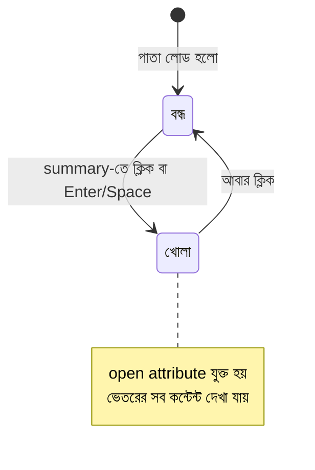

```html
<details>
  <summary>ভাড়ার নিয়মাবলি দেখুন</summary>
  <!-- details = পুরো ড্রয়ার (ভাঁজ করার অংশ)
       summary = হাতল/শিরোনাম, যেটা সবসময় দেখা যায় আর ক্লিক করা যায়। ⚠️ অবশ্যই details-এর প্রথম সন্তান, আর একটাই -->

  <p>মাসিক ভাড়া অগ্রিম দিতে হবে।</p>
  <ul>
    <li>জামানত: দুই মাসের ভাড়া</li>
    <li>চুক্তি: ন্যূনতম ১ বছর</li>
  </ul>
  <!-- summary ছাড়া বাকি সব কিছুই ভেতরের কন্টেন্ট — লেখা, তালিকা, ছবি, টেবিল যা খুশি -->
</details>

<details open>
  <summary>সবসময় খোলা থাকা ড্রয়ার</summary>
  <p>open attribute দিলে পাতা খোলার সময় ড্রয়ারটা খোলাই থাকে।</p>
</details>
<!-- open = boolean attribute। খোলা অবস্থায় ব্রাউজার নিজে এটা যোগ করে, বন্ধ হলে সরিয়ে দেয় -->
```

### ৫.১ FAQ বানানো (সবচেয়ে জনপ্রিয় ব্যবহার)

```html
<section aria-labelledby="faq-title">
  <h2 id="faq-title">সচরাচর জিজ্ঞাসা</h2>

  <details name="faq">
    <summary>ভাড়া কত?</summary>
    <p>মাসে ১৫,০০০ টাকা।</p>
  </details>

  <details name="faq">
    <summary>পোষা প্রাণী রাখা যাবে?</summary>
    <p>হ্যাঁ, ছোট প্রাণী রাখা যাবে।</p>
  </details>
</section>
<!-- name="faq" = ⭐ একই name-এর details গুলো একটা "দল" — একটা খুললে বাকিটা নিজে বন্ধ হয় (exclusive accordion)।
     আধুনিক ব্রাউজারে JS ছাড়াই এটা চলে; পুরোনো ব্রাউজারে name উপেক্ষা হয়, তখন সব ড্রয়ার আলাদাভাবে খোলে-বন্ধ হয় — কিছু ভাঙে না -->
```

### ৫.২ Nested details — ড্রয়ারের ভেতরে ড্রয়ার

```html
<details>
  <summary>ঘরের তালিকা</summary>
  <details>
    <summary>নিচতলা</summary>
    <p>বসার ঘর, রান্নাঘর।</p>
  </details>
  <details>
    <summary>দোতলা</summary>
    <p>দুটো শোবার ঘর।</p>
  </details>
</details>
```

### ৫.৩ JavaScript দিয়ে খোলা-বন্ধ ধরা

```javascript
const drawer = document.querySelector("details");
// drawer = পাতার প্রথম <details> ট্যাগটা। querySelector = CSS selector দিয়ে প্রথম মিলটা খোঁজে

drawer.addEventListener("toggle", () => {
  // toggle event = ড্রয়ার খুললে বা বন্ধ হলে ঘটে (ক্লিক, JS বা name-দল বদল — যেভাবেই হোক)
  if (drawer.open) {
    // drawer.open = ড্রয়ার এখন খোলা কিনা (true/false)। এটা লিখলে নিজেও খোলা/বন্ধ করা যায়
    console.log("ড্রয়ার খুলেছে");
  } else {
    console.log("ড্রয়ার বন্ধ হয়েছে");
  }
});

drawer.open = true;
// JS দিয়ে ড্রয়ার খুলে দেওয়া — HTML-এর open attribute যোগ করার সমান
```

### ৫.৪ সাজানোর CSS

```css
details {
  border: 1px solid #ddd;    /* ড্রয়ারের চারপাশে হালকা দাগ */
  border-radius: 8px;        /* কোণা গোল */
  padding: 8px 12px;         /* ভেতরে ফাঁকা জায়গা */
}
summary {
  cursor: pointer;           /* মাউস রাখলে হাতের আঙুল — বোঝা যায় ক্লিক করা যাবে */
  font-weight: bold;         /* হাতলের লেখা মোটা */
}
details[open] summary {
  color: #2563eb;            /* [open] = ড্রয়ার খোলা থাকলে হাতলের রং বদলাবে */
}
summary::marker {
  content: "➕ ";            /* ::marker = ডিফল্ট ত্রিভুজ-চিহ্ন; নিজের চিহ্ন বসানো */
}
details[open] summary::marker {
  content: "➖ ";            /* খোলা থাকলে ➖ */
}
```

**কখন ব্যবহার করবেন:**

| ✅ ভালো | ❌ ঠিক নয় |
|---|---|
| FAQ, প্রশ্নোত্তর | জরুরি তথ্য যা সবার আগে দেখানো দরকার |
| "আরও দেখুন" ধরনের বাড়তি তথ্য | মূল কন্টেন্ট লুকিয়ে ফেলা |
| শর্তাবলি, স্পয়লার, উন্নত সেটিংস | ঠিক পপআপ বা মডাল দরকার এমন ক্ষেত্রে (তখন `dialog`) |

**Accessibility বোনাস:** কিবোর্ডে `Tab` দিয়ে `summary`-তে গিয়ে `Enter`/`Space` চেপে খোলা যায়, screen reader নিজে বলে "সম্প্রসারিত/সংকুচিত (expanded/collapsed)" — নিজে হাতে JS দিয়ে accordion বানালে এসব আলাদা করে করতে হতো।

> **মনে রাখার গল্প-সূত্র:** *"ড্রয়ারের হাতল = `summary`, ড্রয়ারের ভেতরটা = `details`-এর বাকি সব। খোলা অবস্থার চিহ্ন = `open`। একই `name`-এর ড্রয়ারগুলো একসাথে একটাই খোলা থাকে।"*

---

## ৬. দরজার বেল আর জরুরি ঘোষণা: Dialog element (`<dialog>`)

বাড়িতে হঠাৎ দরজার বেল বাজলো! অথবা ম্যানেজার বললেন, *"এই বাড়ির ফাইল মুছে ফেলার আগে নিশ্চিত হোন — মুছবো?"* — সবকিছু থেমে গিয়ে এই প্রশ্নের উত্তর না দেওয়া পর্যন্ত আর কিছু করা যাবে না।

ওয়েবে এটাই **`<dialog>`** — পাতার উপরে ভেসে ওঠা বার্তা-বাক্স। আগে এটা বানাতে জটিল CSS/JS লাগতো; এখন ব্রাউজারের নিজস্ব ট্যাগ।

### ৬.১ Dialog-এর দুই রূপ

| | **Modal** (বাধ্যতামূলক উত্তর) | **Non-modal** (ভাসমান নোট) |
|---|---|---|
| খোলার উপায় | `dialog.showModal()` | `dialog.show()` বা HTML-এ `open` attribute |
| গল্পে | "আগে এই প্রশ্নের উত্তর দিন!" | "একটা নোটিশ ঝুলছে, দেখতে পারেন" |
| পেছনের পাতা | **অচল (inert)** — ক্লিক, Tab, কিছুই চলে না | চালু থাকে |
| পেছনে ঝাপসা পর্দা (`::backdrop`) | ✅ আছে | ❌ নেই |
| `Esc` চাপলে | বন্ধ হয় | নিজে থেকে বন্ধ হয় না |
| Focus | ভেতরেই আটকে থাকে (focus trap) | স্বাধীন |
| কখন | কনফার্মেশন, লগইন বক্স, ফর্ম | ছোট নোটিফিকেশন |

### ৬.২ প্রাথমিক গঠন

```html
<button id="openBtn" type="button">বাড়ি মুছুন</button>

<dialog id="confirmDialog" aria-labelledby="dialogTitle">
  <div class="dialog-body">
    <!-- class="dialog-body" = ভেতরের সবকিছুর মোড়ক-বাক্স; CSS-এ এতে padding দেওয়া হবে (৬.৫ দেখুন) -->
    <h2 id="dialogTitle">নিশ্চিত করুন</h2>
    <p>এই বাড়ির সব তথ্য মুছে যাবে। মুছবেন?</p>

    <form method="dialog">
      <button value="cancel">না, থাক</button>
      <button value="confirm">হ্যাঁ, মুছুন</button>
    </form>
  </div>
</dialog>
<!-- dialog = ভাসমান বাক্স। ডিফল্টে লুকানো থাকে (open attribute না থাকলে দেখা যায় না)
     id="confirmDialog" = JS দিয়ে ধরার নাম
     aria-labelledby="dialogTitle" = screen reader-কে বলে "এই বাক্সের নাম হলো ঐ h2-র লেখা"

     form method="dialog" = ⭐ dialog-এর জাদু! এই ফর্মের যেকোনো বাটন চাপলে JS ছাড়াই dialog বন্ধ হয়ে যায়
                            আর সেই বাটনের value ("cancel" বা "confirm") dialog.returnValue-তে জমা থাকে
     button value="..." = কোন বাটন চাপা হলো তা বোঝানোর ছাপ -->
```

### ৬.৩ JavaScript: খোলা, বন্ধ, উত্তর পড়া

```html
<script>
  const openBtn = document.getElementById("openBtn");
  // openBtn = যে বাটন চাপলে dialog খুলবে

  const confirmDialog = document.getElementById("confirmDialog");
  // confirmDialog = <dialog> element — এর গায়ে showModal(), close() ইত্যাদি বিল্ট-ইন মেথড আছে

  openBtn.addEventListener("click", () => {
    confirmDialog.showModal();
    // showModal() = modal আকারে খোলো: পেছনে ঝাপসা পর্দা, পাতা অচল, Esc চাপলে বন্ধ
    // ⚠️ এটা ইতিমধ্যে খোলা dialog-এ চালালে ত্রুটি (InvalidStateError) হয়
  });

  confirmDialog.addEventListener("close", () => {
    // close event = dialog বন্ধ হলেই ঘটে — বাটন চেপে, Esc চেপে বা JS-এ close() দিয়ে; যেভাবেই বন্ধ হোক
    if (confirmDialog.returnValue === "confirm") {
      // returnValue = কোন বাটনের value দিয়ে বন্ধ হয়েছিল তার ছাপ।
      // Esc চাপলে এটা আগের মানই (বা খালি) থাকে, তাই শুধু "confirm" মিললেই কাজ করবো
      console.log("✅ বাড়ি মুছে ফেলা হলো");
    } else {
      console.log("❎ বাতিল করা হয়েছে");
    }
  });
</script>
```

| মেথড / প্রপার্টি / ঘটনা | কাজ |
|---|---|
| `show()` | non-modal আকারে খোলে |
| `showModal()` | modal আকারে খোলে (পেছনে পর্দা + অচল) |
| `close(returnValue)` | বন্ধ করে; ঐচ্ছিক মানটা `returnValue`-তে যায় |
| `open` (প্রপার্টি) | এখন খোলা কিনা (true/false) |
| `returnValue` | বন্ধ হওয়ার সময়ের ছাপ (কোন বাটন চাপা হলো) |
| ঘটনা `close` | বন্ধ হওয়ার পরে ঘটে |
| ঘটনা `cancel` | `Esc` চাপলে বন্ধ হওয়ার ঠিক আগে ঘটে (`preventDefault()` দিয়ে আটকানো যায়) |

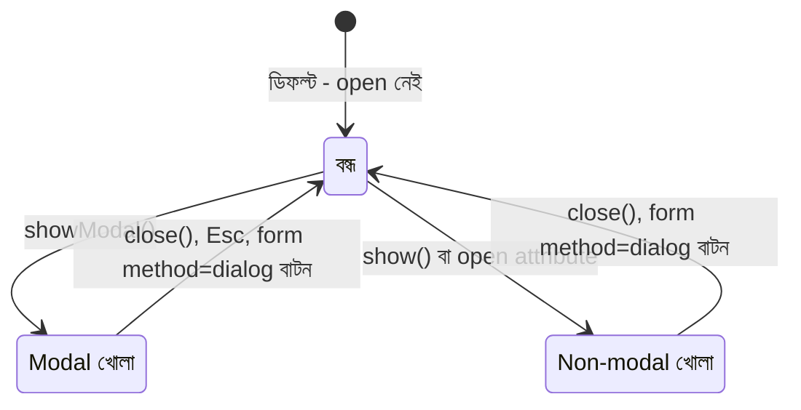

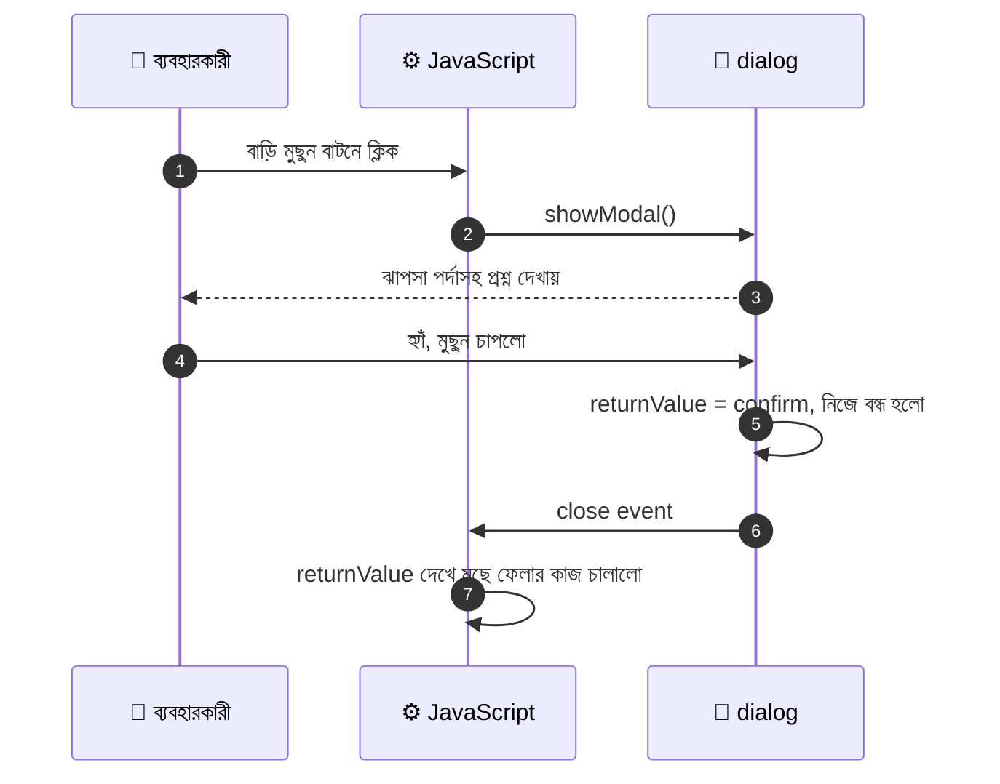

### ৬.৪ ভেতরে ফর্ম থাকা Dialog

```html
<dialog id="nameDialog">
  <form method="dialog">
    <label for="visitorName">আপনার নাম বলুন:</label>
    <input type="text" id="visitorName" name="visitorName" autofocus required />
    <!-- autofocus = dialog খুলতেই কার্সর এই ঘরে (ব্যবহারকারীকে আলাদা করে ক্লিক করতে হয় না)
         name="visitorName" = ফর্ম থেকে মান পড়ার নাম -->

    <button value="cancel" formnovalidate>বাতিল</button>
    <!-- formnovalidate = এই বাটন চাপলে required যাচাই বাদ — নাহলে নাম না লিখে "বাতিল" চাপাই যেত না! -->
    <button value="ok">ঠিক আছে</button>
  </form>
</dialog>

<script>
  const nameDialog = document.getElementById("nameDialog");
  // nameDialog = ফর্মসহ dialog

  const visitorName = document.getElementById("visitorName");
  // visitorName = নামের input — dialog বন্ধ হলে এখান থেকে মান পড়বো

  nameDialog.addEventListener("close", () => {
    if (nameDialog.returnValue === "ok") {
      // "ok" বাটন দিয়ে বন্ধ হলে তবেই নামটা নেবো
      console.log("স্বাগতম, " + visitorName.value);
      // visitorName.value = ব্যবহারকারীর লেখা নাম
    }
    visitorName.value = "";
    // পরের বার খুললে আগের নাম যেন না থাকে — তাই ঘর খালি করে দিলাম
  });
</script>
```

### ৬.৫ পেছনের পর্দা সাজানো আর বাইরে ক্লিকে বন্ধ

```css
dialog::backdrop {
  background: rgba(0, 0, 0, 0.5);   /* ::backdrop = modal-এর পেছনের পর্দা — এখানে ৫০% কালো */
}
dialog {
  border: none;                     /* ডিফল্ট কালো দাগ সরানো */
  border-radius: 12px;              /* কোণা গোল */
  padding: 0;                       /* dialog-এর নিজের ফাঁকা জায়গা শূন্য — নিচের বাইরে-ক্লিকের কৌশলের জন্য জরুরি */
}
dialog .dialog-body {
  padding: 24px;                    /* ফাঁকা জায়গাটা দিলাম ভেতরের মোড়ক-বাক্সে (নিচে ব্যাখ্যা) */
}
```

```javascript
confirmDialog.addEventListener("click", (event) => {
  // dialog-এর যেকোনো জায়গায় ক্লিক এখানে ধরা পড়বে
  if (event.target === confirmDialog) {
    // event.target = আসলে কোথায় ক্লিক পড়েছে।
    // dialog-এর ভেতরের লেখা/বাটনে ক্লিক হলে target হবে সেই ভেতরের element;
    // কিন্তু পেছনের ঝাপসা পর্দায় (::backdrop) ক্লিক ধরা পড়ে "dialog নিজেই" হিসেবে — তাই এই তুলনা মিললে বুঝি বাইরে ক্লিক হয়েছে
    confirmDialog.close("cancel");
    // close("cancel") = বন্ধ করো, আর returnValue-তে "cancel" বসাও
  }
});
```

> ⚠️ এই কৌশল ঠিকঠাক কাজ করতে dialog-এর ভেতরের সব কন্টেন্ট একটা `<div class="dialog-body">`-তে মুড়ে ওটাতে `padding` দিন, আর `dialog`-এর নিজের `padding` রাখুন `0`। নাহলে dialog-এর ভেতরের ফাঁকা কিনারায় ক্লিক করলেও `event.target` হবে dialog নিজেই — আর ভুল করে dialog বন্ধ হয়ে যাবে।

### ৬.৬ `alert()`-এর চেয়ে `dialog` ভালো কেন

| | `alert()` / `confirm()` | `<dialog>` |
|---|---|---|
| সাজানো | ❌ যায় না (ব্রাউজারের ধূসর বাক্স) | ✅ পুরো CSS |
| ভেতরে কী থাকে | শুধু লেখা | ফর্ম, ছবি, লিংক — যা খুশি |
| Accessibility | সীমিত | ✅ focus সামলায়, `aria` জুড়তে পারে |
| কাজ থামায় | পুরো ব্রাউজার আটকে যায় | শুধু পাতা অচল, বাকি চলে |

### ৬.৭ Accessibility-র ছোট কথা

- সবসময় `aria-labelledby` (বা `aria-label`) দিয়ে dialog-কে নাম দিন
- modal dialog বন্ধ হলে ব্রাউজার সাধারণত ফোকাস আগের বাটনে ফিরিয়ে দেয় — নিজেও পরীক্ষা করে নিন
- সবসময় বন্ধ করার একটা স্পষ্ট বাটন রাখুন (শুধু `Esc`-এর ভরসা নয়)

### ৬.৮ `dialog` বনাম `popover`

আগের ফাইলে দেখা `popover` attribute হলো `dialog`-এর হালকা ভাই:

| | `<dialog>` | `popover` attribute |
|---|---|---|
| উদ্দেশ্য | গুরুত্বপূর্ণ ইন্টারঅ্যাকশন (নিশ্চিতকরণ, ফর্ম) | হালকা ভাসমান বাক্স (টুলটিপ, মেনু) |
| পেছনের পাতা | modal হলে অচল | সবসময় চালু |
| বাইরে ক্লিকে বন্ধ | নিজে হয় না (উপরের কৌশল লাগে) | ✅ নিজে বন্ধ হয় |
| JS | `showModal()` লাগে | JS ছাড়াই `popovertarget` দিয়ে |

> **মনে রাখার গল্প-সূত্র:** *"দরজার বেল বাজলে সবকিছু থেমে যায় — এটাই `showModal()`। জানালার ধারে ঝোলানো নোট — এটা `show()`। বেলের ভেতরের ফর্মে `method="dialog"` দিলে বাটন চাপলেই বেল থামে, আর কোন বাটন চাপা হলো সেটা মনে থাকে `returnValue`-তে।"*

---

## ৭. সারসংক্ষেপ ও Practice আইডিয়া

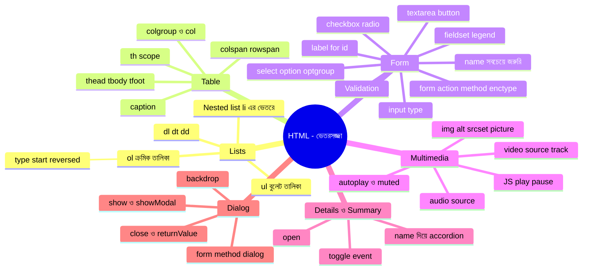

### দ্রুত মিলিয়ে নেওয়ার ছক

| বিষয় | মূল কথা |
|---|---|
| `ul` / `ol` / `dl` | ক্রম নেই / ক্রম আছে / শব্দ+ব্যাখ্যা |
| ভেতরের list | সবসময় `li`-এর ভেতরে |
| `caption` | table-এর প্রথম সন্তান, ছকের নাম |
| `thead` / `tbody` / `tfoot` | শিরোনাম / তথ্য / মোট |
| `scope` | th কার শিরোনাম — col, row, colgroup, rowgroup |
| `label for` ↔ `input id` | ক্লিকে ঘর সক্রিয় + screen reader |
| `name` | ⭐ না থাকলে তথ্যই যায় না |
| radio | একই `name` = একই দল, একটাই বাছা |
| checkbox | একাধিক টিক, না টিক = পাঠানোই হয় না |
| `button` (form-এ) | `type` না দিলে ডিফল্ট `submit` |
| `readonly` vs `disabled` | পাঠায় vs পাঠায় না |
| `<image>`, `<checkbox>`, `<radio>` | ❌ ট্যাগই নয় → `img`, `input type=…` |
| `alt` | তথ্যবহ = বর্ণনা, সাজসজ্জা = `alt=""` |
| `autoplay` | শব্দসহ আটকে যায়, তাই `muted` লাগে |
| `details` `name` | একই দলের একটাই খোলা থাকে |
| `dialog` | `showModal()` = পর্দাসহ, `show()` = সাধারণ; `form method="dialog"` = JS ছাড়া বন্ধ |

### Practice-এর জন্য আইডিয়া

1. **"স্বপ্নবাড়ি" রেস্টুরেন্টের মেনু পাতা** — `nav`-এ `ul`, রেসিপির ধাপে `ol`, উপকরণ-তথ্যে `dl` ব্যবহার করুন।
2. **নিজের মাসিক খরচের Table** — `caption`, `colgroup`, `thead`, `tbody`, `tfoot` সব সহ; মোটটা নিজে হাতে যোগ করে বসান, `scope` দিতে ভুলবেন না।
3. **সম্পূর্ণ Registration Form** — text, email, password, date, radio (লিঙ্গ/পছন্দ), checkbox (আগ্রহ), select (জেলা), textarea, file, submit/reset। প্রতিটা ঘরে `label` + `name` দিন, তারপর DevTools-এ Form Data দেখুন।
4. **"`name` ছাড়া" পরীক্ষা** — একটা ঘর থেকে `name` মুছে GET ফর্ম জমা দিন, URL-এ ঘরটা আসছে কিনা দেখুন।
5. **`FormData` দিয়ে ফর্মের তথ্য console-এ ছাপান** (৩.১৭-র কোড) — checkbox-এর একাধিক মান `getAll` দিয়ে পড়ুন।
6. **ছোট Video Player বানান** — নিজের বাটন দিয়ে play/pause, ভলিউম স্লাইডার, সময় দেখানো (৪.২-র JS)।
7. **FAQ পাতা** — `details` + `name` দিয়ে exclusive accordion; তারপর `toggle` event-এ console-এ খোলা-বন্ধ লগ করুন।
8. **Delete Confirmation** — একটা তালিকার প্রতিটা আইটেমের পাশে "মুছুন" বাটন; চাপলে `dialog` উঠবে, "হ্যাঁ" চাপলেই কেবল আইটেম মুছবে (`returnValue` দিয়ে)।
9. **Lighthouse-এ Accessibility স্কোর দেখুন** — ভুলে একটা `label` বা `alt` বাদ দিন, স্কোর কীভাবে নামে দেখুন।

---
