# 🛎️ রিসেপশন ডেস্ক খোলার গল্প: Express.js Basics, Routing আর Response

> এই ফাইলে রেস্টুরেন্টের দরজায় প্রথমবারের মতো বসছে একজন **রিসেপশনিস্ট — Express.js**। আমরা শিখবো তাকে কীভাবে বসাতে হয়, তার হাতে ঠিকানা-খাতা (Routing) কীভাবে তুলে দিতে হয়, আর সে কাস্টমারকে **কত রকমভাবে উত্তর ফেরত দিতে পারে** (লেখা, JSON, ফাইল, redirect, cookie)।
> আজকের গল্পের মূল প্রশ্ন: **Express অ্যাপ কীভাবে বানাবো, কোন ঠিকানায় কোন কাজ হবে সেটা কীভাবে ঠিক করবো, আর কাস্টমারের কাছে কী কী রূপে উত্তর পাঠাবো?**
> 📎 Request-এর গভীর অংশ (Query, Header, Middleware, POST, JSON, Multer দিয়ে File Upload) আছে পরের ফাইলে: [`multer-file-upload-request-handling-in-express-js.md`](./multer-file-upload-request-handling-in-express-js.md)। এই ফাইলে `Working With Request` অংশে শুধু ভিত্তিটা দেওয়া হয়েছে।

---

## 📚 সূচিপত্র (Table of Contents)

1. [ভূমিকা: রেস্টুরেন্টে রিসেপশনিস্ট দরকার হলো কেন?](#ভূমিকা-রেস্টুরেন্টে-রিসেপশনিস্ট-দরকার-হলো-কেন)
2. [Your First Express Application — প্রথম রিসেপশন ডেস্ক বসানো](#১-your-first-express-application--প্রথম-রিসেপশন-ডেস্ক-বসানো)
3. [Express.js Routing — ডেস্কের ঠিকানা-খাতা](#২-expressjs-routing--ডেস্কের-ঠিকানা-খাতা)
4. [Understanding Responses — ফেরত পাঠানোর ট্রে](#৩-understanding-responses--ফেরত-পাঠানোর-ট্রে)
5. [Simple String Response — চিরকুটে লিখে উত্তর](#৪-simple-string-response--চিরকুটে-লিখে-উত্তর)
6. [Response Status Code — ট্রের গায়ে রঙিন স্টিকার](#৫-response-status-code--ট্রের-গায়ে-রঙিন-স্টিকার)
7. [JSON Response — গোছানো ছাপানো ফর্ম ফেরত](#৬-json-response--গোছানো-ছাপানো-ফর্ম-ফেরত)
8. [Response Download — টেক-অ্যাওয়ে প্যাকেট](#৭-response-download--টেক-অ্যাওয়ে-প্যাকেট)
9. [Response Redirect — "ওই কাউন্টারে যান" চিরকুট](#৮-response-redirect--ওই-কাউন্টারে-যান-চিরকুট)
10. [Response Header — ফেরত ট্রের লেবেল](#৯-response-header--ফেরত-ট্রের-লেবেল)
11. [Response Set Cookies — টোকেন কার্ড দেওয়া](#১০-response-set-cookies--টোকেন-কার্ড-দেওয়া)
12. [Clear Cookies — টোকেন কার্ড ফেরত নেওয়া](#১১-clear-cookies--টোকেন-কার্ড-ফেরত-নেওয়া)
13. [Working With Request — কাস্টমারের খাম খোলা](#১২-working-with-request--কাস্টমারের-খাম-খোলা)
14. [সব একসাথে — পুরো Flow, সাধারণ ভুল আর সমাধান](#১৩-সব-একসাথে--পুরো-flow-সাধারণ-ভুল-আর-সমাধান)
15. [সারসংক্ষেপ ও Practice আইডিয়া](#১৪-সারসংক্ষেপ-ও-practice-আইডিয়া)

---

## ভূমিকা: রেস্টুরেন্টে রিসেপশনিস্ট দরকার হলো কেন?

কল্পনা করুন, আপনার ছোট্ট রেস্টুরেন্ট এখন জমজমাট। আগে শেফ (Node.js) নিজেই দরজায় দাঁড়িয়ে প্রতিটা কাস্টমারের সাথে কথা বলতেন। প্রতিবার তাকে হাতে-কলমে এই কাজগুলো করতে হতো:

- খামের ঠিকানা পড়ে বুঝতে হতো কাস্টমার **কোথায়** যেতে চায় (`req.url`)
- বুঝতে হতো সে কী **চায়** — দেখতে, নাকি জমা দিতে (`req.method`)
- উত্তরের খামে **লেবেল** লাগাতে হতো (`res.writeHead`)
- উত্তর নিজে হাতে **String বানিয়ে** পাঠাতে হতো (`JSON.stringify` + `res.end`)

কাস্টমার বাড়লে এই `if / else if` এর জঙ্গলে শেফ আর রান্না করার সময়ই পান না। তাই রেস্টুরেন্ট একজন **রিসেপশনিস্ট** নিয়োগ দিলো — নাম **Express**।

রিসেপশনিস্টের তিনটা মূল শক্তি:

| শক্তি | গল্পে | টেকনিক্যাল নাম |
|---|---|---|
| ঠিকানা-খাতা রাখা | "মেনু চাইলে এই ডেস্কে, অর্ডার দিলে ওই ডেস্কে পাঠাও" | **Routing** |
| উত্তরের সহজ ট্রে | "JSON দাও, ফাইল দাও, ঘুরিয়ে অন্য কাউন্টারে পাঠাও" — এক লাইনে | **Response helpers** (`res.json`, `res.download`...) |
| মাঝখানের চেকপোস্ট | "খাতায় নাম লেখো, পরিচয় যাচাই করো, তারপর ভেতরে যাও" | **Middleware** (পরের ফাইলে) |

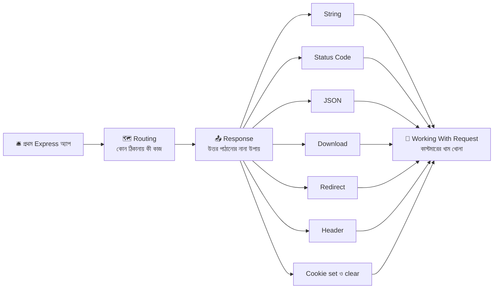

---

## ১. Your First Express Application — প্রথম রিসেপশন ডেস্ক বসানো

### গল্প

রেস্টুরেন্টের মালিক হিসেবে আপনার প্রথম কাজ — দরজার পাশে একটা টেবিল বসানো, একজন রিসেপশনিস্ট বসানো, আর দরজা খুলে ঘোষণা করা: **"আমরা ৩০০০ নম্বর দরজায় খোলা আছি!"**

এই পুরো কাজটা Express-এ **৫ ধাপ**:

1. রিসেপশনিস্টকে ডেকে আনা (`require("express")`)
2. ডেস্কটা বানানো (`express()`)
3. ডেস্কের খাতায় একটা নিয়ম লেখা (`app.get(...)`)
4. দরজা খোলা (`app.listen(...)`)
5. কাস্টমারের অপেক্ষা

### Node-এর `http` বনাম Express — একই কাজ, দুই পথ

আগের মডিউলের কষ্টের পথ:

```javascript
// আগের মডিউলের পথ — শুধু http module দিয়ে
const http = require("http");
// http = Node.js-এর বিল্ট-ইন module, সরাসরি server বানাতে দেয়

const server = http.createServer((req, res) => {
  // req = কাস্টমারের খাম, res = ফেরত পাঠানোর ট্রে

  if (req.method === "GET" && req.url === "/menu") {
    // প্রতিটা route-এর জন্য method আর url নিজে হাতে মেলাতে হচ্ছে
    res.writeHead(200, { "Content-Type": "application/json; charset=utf-8" });
    // status আর header নিজে হাতে বসাতে হচ্ছে
    res.end(JSON.stringify([{ id: 1, name: "কাচ্চি বিরিয়ানি" }]));
    // JSON বানানোও নিজের কাজ, তারপর end() দিয়ে শেষ করা
  } else {
    res.writeHead(404);
    res.end("Not Found");
  }
});

server.listen(3000);
```

Express-এর সহজ পথ — একই কাজ:

```javascript
// Express-এর পথ
const express = require("express");
const app = express();

app.get("/menu", (req, res) => {
  res.json([{ id: 1, name: "কাচ্চি বিরিয়ানি" }]);
  // method মেলানো, url মেলানো, status 200, Content-Type, JSON.stringify — সব Express নিজে করে দিলো
});

app.listen(3000);
```

| কাজ | শুধু `http` module | Express |
|---|---|---|
| method + url মেলানো | `if (req.method === ... && req.url === ...)` নিজে হাতে | `app.get("/menu", ...)` |
| Query string আলাদা করা | `new URL(req.url, ...)` দিয়ে নিজে ভাঙা | `req.query` তৈরি হয়েই আছে |
| JSON পাঠানো | `writeHead` + `JSON.stringify` + `end` | `res.json(data)` |
| Status বসানো | `res.writeHead(404)` | `res.status(404)` |
| ফাইল পাঠানো | `fs.createReadStream` + header নিজে হাতে | `res.sendFile`, `res.download` |
| Body পড়া | `req.on("data")` দিয়ে টুকরো জোড়া | `express.json()` দিলেই `req.body` |
| Route ভাগ করা | একটা বিশাল `if/else` | `express.Router()` |

> **মনে রাখুন:** Express কোনো নতুন ভাষা নয়। ভেতরে ভেতরে সেই Node.js-এর `http` server-ই চলছে। Express শুধু তার উপরে বসানো একটা **সুবিধার লেয়ার**।

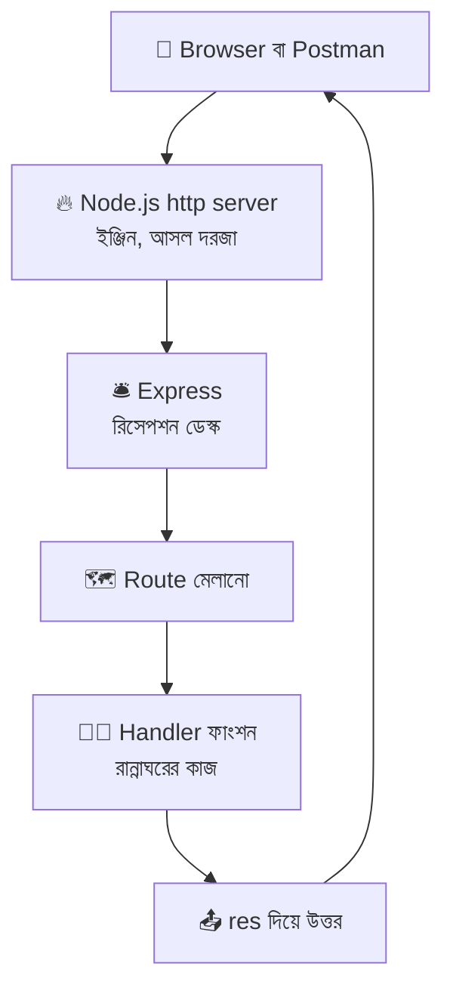

### প্রজেক্ট সেটআপ

```bash
mkdir express-basics-demo && cd express-basics-demo   # প্রজেক্ট ফোল্ডার বানিয়ে ভেতরে ঢোকা
npm init -y                                           # package.json বানানো (-y = সব প্রশ্নের ডিফল্ট উত্তর)
npm install express cookie-parser                     # express = রিসেপশনিস্ট, cookie-parser = টোকেন কার্ড পড়ার যন্ত্র (১০ নম্বর সেকশনে লাগবে)
mkdir routes data files                               # routes = আলাদা বিভাগ ডেস্ক, data = নকল ডেটা, files = ডাউনলোডের ফাইল
```

`package.json`-এ `scripts` অংশে:

```json
{
  "scripts": {
    "start": "node server.js",
    "dev": "node --watch server.js"
  }
}
```

> `node --watch` = ফাইল সেভ করলেই server নিজে থেকে restart হবে (Node 18+ এ বিল্ট-ইন)। এখন `npm run dev` দিয়ে চালাবেন।

### ফোল্ডার স্ট্রাকচার

```
📦 express-basics-demo/
 ┣ 📂 data/
 ┃ ┗ 📜 menu.js              ← নকল ডেটাবেস (মেনুর তালিকা)
 ┣ 📂 routes/
 ┃ ┗ 📜 menu.js              ← মেনু বিভাগের আলাদা ডেস্ক (Router)
 ┣ 📂 files/
 ┃ ┗ 📜 menu.txt             ← ডাউনলোড টেস্ট করার ফাইল (নিজে বানাবেন)
 ┣ 📜 server.js              ← মূল রিসেপশন ডেস্ক
 ┣ 📜 .gitignore
 ┗ 📜 package.json
```

**`.gitignore`**

```bash
node_modules/     # ইনস্টল করা প্যাকেজ — npm install দিলেই ফিরে আসে
.env              # গোপন চাবি (cookie secret এখানে রাখা হয়)
```

### `server.js` — আমাদের প্রথম রিসেপশন ডেস্ক

```javascript
// server.js — রেস্টুরেন্টের রিসেপশন ডেস্ক (Express)

const express = require("express");
// express = require করলে যা পাই সেটা আসলে একটা ফাংশন। এই ফাংশনটা call করলেই নতুন app তৈরি হয়

const app = express();
// app = আমাদের পুরো Express অ্যাপ্লিকেশন, অর্থাৎ রিসেপশন ডেস্কটা।
// সব route, সব middleware, সব সেটিং এই app-এর গায়েই বসবে

const PORT = process.env.PORT || 3000;
// PORT = server কোন দরজা (port) দিয়ে অপেক্ষা করবে।
// process.env.PORT = hosting সার্ভিস (Render, Railway ইত্যাদি) নিজে যে নম্বর দেয়। ওটা না থাকলে (লোকাল মেশিনে) 3000

app.get("/", (req, res) => {
  // app.get(path, handler) = "কেউ GET method-এ এই path-এ এলে এই ফাংশন চালাও"
  // "/" = root ঠিকানা, অর্থাৎ http://localhost:3000/
  // req = কাস্টমারের আনা খাম (তার পাঠানো সব তথ্য)
  // res = উত্তর ফেরত পাঠানোর ট্রে

  res.send("স্বাগতম! রিসেপশন ডেস্ক চালু আছে 🛎️");
  // res.send() = উত্তর পাঠিয়ে request-এর কাজ শেষ করে দেয়
});

app.listen(PORT, (error) => {
  // app.listen(port, callback) = দরজা খুলে কাস্টমারের অপেক্ষা শুরু করা
  // error = Express 5-এ port খুলতে না পারলে (যেমন অন্য কেউ ওই port ব্যবহার করছে) callback-এ error আসে

  if (error) {
    console.error("❌ দরজা খুলতে পারলাম না:", error.message);
    // error.message = সমস্যাটা কী তার সংক্ষিপ্ত বিবরণ
    process.exit(1);
    // process.exit(1) = প্রোগ্রাম বন্ধ করা। 1 মানে "কোনো সমস্যা হয়েছে" (0 মানে সব ঠিক)
    return;
  }

  console.log(`✅ রিসেপশন খুলেছে → http://localhost:${PORT}`);
  // template literal (backtick) দিয়ে PORT-এর মান বসিয়ে ঠিকানাটা দেখালাম
});
```

### চালানো ও দেখা

```bash
npm run dev
# ✅ রিসেপশন খুলেছে → http://localhost:3000
```

ব্রাউজারে `http://localhost:3000` খুলুন — লেখা দেখা যাবে। এবার `F12` (DevTools) → **Network** ট্যাবে গিয়ে রিফ্রেশ দিন। প্রথম request-এ ক্লিক করলে দেখবেন Express নিজে থেকে বসিয়ে দিয়েছে:

- `Status Code: 200 OK`
- `Content-Type: text/html; charset=utf-8`
- `X-Powered-By: Express`

আমরা এগুলোর কোনোটাই নিজে লিখিনি — এটাই রিসেপশনিস্টের সুবিধা।

### একটা request-এর যাত্রা

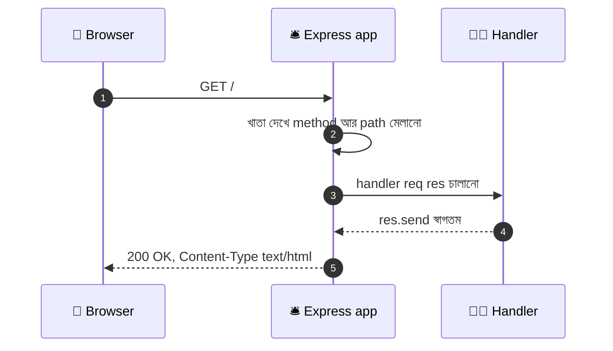

### `app.get("/", (req, res) => {...})` লাইনটা ভেঙে দেখি

| অংশ | মানে |
|---|---|
| `app` | আমাদের রিসেপশন ডেস্ক |
| `.get` | HTTP method — শুধু **GET** request-এর জন্য এই নিয়ম |
| `"/"` | path — কোন ঠিকানার জন্য |
| `(req, res) => {...}` | **handler** — মিলে গেলে যে ফাংশনটা চলবে |
| `req` | ইনকামিং খাম (request) |
| `res` | ফেরত ট্রে (response) |
| `res.send(...)` | উত্তর পাঠিয়ে দেওয়া। **এটা না লিখলে browser ঘুরতেই থাকবে** |

### `app` object কী কী পারে

| মেথড / সেটিং | কাজ | উদাহরণ |
|---|---|---|
| `app.get()`, `app.post()`... | নির্দিষ্ট method-এর route বসানো | `app.get("/menu", ...)` |
| `app.use()` | middleware বা Router জোড়া | `app.use("/menu", menuRouter)` |
| `app.listen()` | দরজা খোলা | `app.listen(3000)` |
| `app.set(key, value)` | অ্যাপের সেটিং বদলানো | `app.set("json spaces", 2)` |
| `app.get(key)` | সেটিং-এর মান পড়া (একই নামের route method থেকে আলাদা, শুধু একটা আর্গুমেন্ট দিলে) | `app.get("json spaces")` |
| `app.disable(key)` | সেটিং বন্ধ করা | `app.disable("x-powered-by")` |
| `app.locals` | পুরো অ্যাপে শেয়ার করা ডেটা রাখার জায়গা | `app.locals.shopName = "রান্নাঘর"` |

### ES Module (`import`) দিয়ে লিখতে চাইলে

`package.json`-এ `"type": "module"` বসালে `require`-এর বদলে `import` চলে:

```javascript
import express from "express";
// import = ES Module পদ্ধতি। CommonJS-এর require("express") এর আধুনিক রূপ

import path from "node:path";
// "node:" prefix = বোঝায় এটা Node-এর বিল্ট-ইন module, npm প্যাকেজ নয়

const __dirname = import.meta.dirname;
// ES Module-এ __dirname নিজে থেকে থাকে না। import.meta.dirname (Node 20.11+) দিয়ে একই জিনিস পাওয়া যায়
```

> এই ফাইলের সব কোড **CommonJS** (`require`) দিয়ে লেখা, যাতে আগের মডিউলের সাথে মিলে থাকে।

### প্রথমবারের সাধারণ ভুল

| লক্ষণ | কারণ | সমাধান |
|---|---|---|
| `Error: listen EADDRINUSE: address already in use :::3000` | ৩০০০ নম্বর দরজা আগে থেকেই আরেকটা প্রোগ্রাম দখল করে আছে (হয়তো আগের server বন্ধ করা হয়নি) | পুরোনো টার্মিনালে `Ctrl + C` দিন, অথবা `PORT=3001 npm run dev` |
| `Cannot find module 'express'` | `npm install express` করা হয়নি, বা ভুল ফোল্ডারে আছেন | প্রজেক্ট ফোল্ডারে গিয়ে ইনস্টল করুন |
| ব্রাউজারে `Cannot GET /menu` | `/menu` নামে কোনো route বানানো হয়নি | route যোগ করুন (পরের সেকশন) |
| পেজ শুধু লোড হচ্ছে, উত্তর আসছে না | handler-এ `res.send/json` লেখা হয়নি | প্রতিটা পথে একটা করে উত্তর নিশ্চিত করুন |
| কোড বদলালাম কিন্তু কিছু বদলালো না | server restart হয়নি | `npm run dev` (`--watch` সহ) ব্যবহার করুন |

---

## ২. Express.js Routing — ডেস্কের ঠিকানা-খাতা

### গল্প

রিসেপশনিস্টের টেবিলে একটা **মোটা খাতা** আছে। খাতার প্রতিটা লাইনে লেখা: *"কেউ যদি এই কাজ নিয়ে এই ঠিকানায় আসে, তাহলে তাকে এই কর্মীর কাছে পাঠাও।"* যেমন:

- "**মেনু দেখতে** চাইলে → মেনু কার্ড দাও"
- "**অর্ডার জমা** দিতে চাইলে → রান্নাঘরে পাঠাও"
- "**৩ নম্বর টেবিলের** খবর চাইলে → ৩ নম্বর টেবিলের ওয়েটারের কাছে পাঠাও"

এই খাতাটাই **Routing**। প্রতিটা লাইন একটা **Route**। আর কাস্টমার এলে রিসেপশনিস্ট খাতা **উপর থেকে নিচে** পড়ে, **প্রথম যে লাইন মিলে যায়** সেটাই চালায়, বাকি লাইন আর পড়ে না।

### একটা Route-এর গঠন

```
app.METHOD( PATH , HANDLER )
     │        │        └── মিলে গেলে যে ফাংশন চলবে
     │        └── কোন ঠিকানা
     └── কোন HTTP method (get, post, put, patch, delete ...)
```

```javascript
app.get("/menu", (req, res) => {
  res.send("এই নিন মেনু কার্ড");
});
// app  = রিসেপশন ডেস্ক
// get  = শুধু GET method
// "/menu" = শুধু এই ঠিকানা
// handler = মিললে এই ফাংশন চলবে
```

### HTTP Method-গুলো — কাস্টমার কী করতে চায়

| Method | গল্পে | Express-এ | সাধারণ কাজ (CRUD) |
|---|---|---|---|
| **GET** | "মেনুটা দেখান" | `app.get()` | Read — শুধু পড়া |
| **POST** | "এই নিন আমার অর্ডার" | `app.post()` | Create — নতুন কিছু জমা |
| **PUT** | "আমার অর্ডারটা পুরো বদলে এটা করুন" | `app.put()` | Update — পুরোটা বদলানো |
| **PATCH** | "অর্ডারে শুধু ঝালটা কমান" | `app.patch()` | Update — আংশিক বদলানো |
| **DELETE** | "আমার অর্ডার বাতিল করুন" | `app.delete()` | Delete — মুছে ফেলা |
| **সবগুলো** | "যে method-ই হোক, এই ঠিকানায় আমাকে জানাও" | `app.all()` | যেকোনো method |

```javascript
app.get("/orders", (req, res) => res.send("সব অর্ডার দেখাও"));
app.post("/orders", (req, res) => res.send("নতুন অর্ডার নাও"));
app.put("/orders/1", (req, res) => res.send("১ নম্বর অর্ডার পুরো বদলাও"));
app.patch("/orders/1", (req, res) => res.send("১ নম্বর অর্ডারের কিছু অংশ বদলাও"));
app.delete("/orders/1", (req, res) => res.send("১ নম্বর অর্ডার মুছে দাও"));
// লক্ষ্য করুন: /orders ঠিকানা একই, কিন্তু method আলাদা হওয়ায় কাজ আলাদা।
// (ব্রাউজারের Address Bar শুধু GET পাঠায়, বাকিগুলো টেস্ট করতে Postman বা fetch লাগবে)
```

### খাতা পড়ার নিয়ম — উপর থেকে নিচে, প্রথম মিলেই থামা

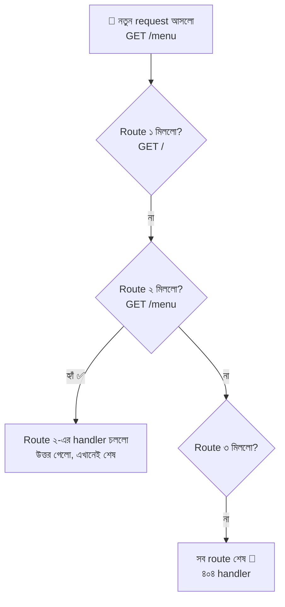

এই নিয়মের কারণে **ক্রম** খুব গুরুত্বপূর্ণ:

```javascript
app.get("/menu/special", (req, res) => res.send("আজকের স্পেশাল"));
// ✅ নির্দিষ্ট route আগে বসান

app.get("/menu/:id", (req, res) => res.send(`${req.params.id} নম্বর আইটেম`));
// :id যেকোনো কিছু ধরে ফেলে, তাই এটা পরে বসান।
// উল্টো ক্রমে লিখলে /menu/special-ও :id ধরে ফেলতো (id = "special") আর স্পেশাল route কখনো চলতোই না
```

> **নিয়ম:** নির্দিষ্ট route আগে, সাধারণ (`:param`, wildcard) route পরে, আর ৪০৪ handler একদম সবার শেষে।

### Route Path-এর নানা রূপ

**১. সাধারণ String path**

```javascript
app.get("/", ...);            // http://localhost:3000/
app.get("/about", ...);       // /about
app.get("/menu/desserts", ...); // /menu/desserts
```

**২. Route Parameter — `:নাম`**

```javascript
app.get("/menu/:id", (req, res) => {
  const { id } = req.params;
  // req.params = path-এর ভেতরের :name অংশগুলো একটা object-এ। /menu/3 হলে { id: "3" }
  // destructuring দিয়ে id আলাদা ভেরিয়েবলে নিলাম। ⚠️ এটা সবসময় String
  res.send(`আপনি ${id} নম্বর আইটেম দেখছেন`);
});

app.get("/tables/:tableNo/orders/:orderId", (req, res) => {
  // একাধিক parameter একসাথে বসানো যায়। /tables/7/orders/42 → { tableNo: "7", orderId: "42" }
  const { tableNo, orderId } = req.params;
  res.json({ tableNo: Number(tableNo), orderId: Number(orderId) });
  // Number() দিয়ে String → সংখ্যা বানালাম, কারণ params-এর মান সবসময় String আসে
});
```

**৩. Optional অংশ — `{ }` (Express 5)**

```javascript
app.get("/report{/:year}", (req, res) => {
  // {...} এর ভেতরের অংশটা ঐচ্ছিক। /report আর /report/2026 দুটোই মিলবে
  const year = req.params.year ?? "চলতি বছর";
  // req.params.year না থাকলে undefined, তাই ?? (nullish coalescing) দিয়ে ডিফল্ট বসালাম
  res.send(`রিপোর্ট: ${year}`);
});
```

**৪. Wildcard — `*নাম` (Express 5)**

```javascript
app.get("/files/*filePath", (req, res) => {
  // *filePath = এক বা একাধিক অংশ ধরে ফেলে। /files/a/b/c.txt → filePath = ["a", "b", "c.txt"]
  // ⚠️ Express 5-এ wildcard-এর অবশ্যই একটা নাম দিতে হবে, শুধু "*" চলে না। আর মান আসে array হিসেবে
  res.json({ parts: req.params.filePath });
});
```

**৫. Regular Expression**

```javascript
app.get(/.*fly$/, (req, res) => res.send("যেকোনো path যেটা fly দিয়ে শেষ, যেমন /butterfly"));
// String-এর ভেতরে regex লেখা যায় না (Express 5-এ), কিন্তু নিজে RegExp object (/.../) দিলে চলে
```

**৬. Parameter-এ শুধু সংখ্যা ধরানো — নিজে যাচাই করে**

```javascript
app.get("/menu/:id", (req, res, next) => {
  const id = Number(req.params.id);
  // id = String থেকে বানানো সংখ্যা
  if (Number.isNaN(id)) {
    return next();
    // সংখ্যা না হলে এই route ছেড়ে দিয়ে খাতার পরের route-এ যাও (next() মানে "পরের জনের কাছে যাও")
    // পরে কেউ মিললে সে ধরবে, না হলে শেষের ৪০৪ handler ধরবে
  }
  res.json({ id });
});
```

### একই route-এ একাধিক Handler — `next()`

```javascript
app.get(
  "/secret-menu",
  (req, res, next) => {
    // প্রথম handler = চেকপোস্ট। এখানে শর্ত যাচাই হচ্ছে
    if (req.get("x-vip") !== "yes") {
      return res.status(403).send("শুধু VIP-দের জন্য");
      // req.get("x-vip") = খামের গায়ে x-vip লেবেলটা কী লেখা আছে। "yes" না হলে ফিরিয়ে দিলাম, এখানেই শেষ
    }
    next();
    // শর্ত ঠিক থাকলে next() দিয়ে পরের handler-কে ডাকলাম
  },
  (req, res) => {
    // দ্বিতীয় handler = আসল কাজ
    res.send("গোপন মেনু: শেফের স্পেশাল বিরিয়ানি 🤫");
  }
);
```

> `next()` = "আমার কাজ শেষ, পরের জনের কাছে যাও"। `next("route")` = "এই route-এর বাকি handler বাদ দিয়ে খাতার পরের route-এ যাও"। আর `next(error)` = "কিছু গড়বড় হয়েছে, অভিযোগ ডেস্কে (error handler) পাঠাও"। Middleware-এর পুরো গল্প আছে পরের ফাইলে।

### `app.route()` — একই ঠিকানার সব method এক জায়গায়

`/orders` ঠিকানাটা বারবার লেখা না লাগে সেজন্য:

```javascript
app
  .route("/orders")
  // .route(path) = এই path-এর জন্য একটা "চেইন" শুরু করা। path একবারই লিখতে হয়
  .get((req, res) => res.send("সব অর্ডার"))
  .post((req, res) => res.send("নতুন অর্ডার জমা"));
  // একই ঠিকানা /orders, কিন্তু method ভেদে আলাদা কাজ। ভুলে বানান ভুল করার সুযোগ কমে
```

### `app.all()` — যেকোনো method ধরা

```javascript
app.all("/ping", (req, res) => {
  // GET, POST, PUT... যেকোনো method-এ /ping এলে এটা চলবে
  res.send(`${req.method} request পেয়েছি`);
  // req.method = কাস্টমার কোন method পাঠিয়েছে ("GET", "POST" ইত্যাদি, বড় হাতের অক্ষরে)
});
```

### `express.Router()` — আলাদা বিভাগের আলাদা ডেস্ক

রেস্টুরেন্ট বড় হলে একটা খাতায় ১০০ লাইন লেখা কঠিন। তাই ভাগ করে দেওয়া হলো: **মেনু বিভাগ**, **অর্ডার বিভাগ**, **কাস্টমার বিভাগ** — প্রত্যেকের নিজের ছোট খাতা। রিসেপশনিস্ট শুধু বলে দেয়: *"`/menu` দিয়ে শুরু হলে মেনু বিভাগে যাও।"*

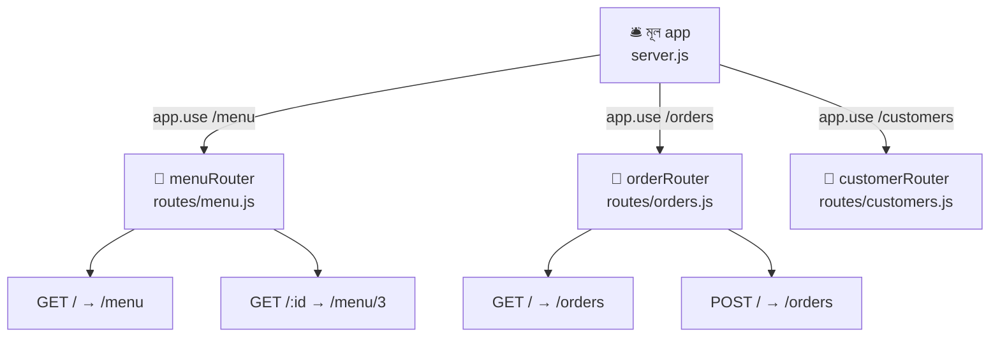

**`data/menu.js`** — নকল ডেটাবেস

```javascript
// data/menu.js — মেনুর তালিকা (আসল DB না লাগিয়ে একটা array দিয়ে কাজ চালাচ্ছি)
module.exports = [
  { id: 1, name: "কাচ্চি বিরিয়ানি", category: "main", price: 350, vegetarian: false },
  { id: 2, name: "সবজি খিচুড়ি", category: "main", price: 180, vegetarian: true },
  { id: 3, name: "ফিরনি", category: "dessert", price: 90, vegetarian: true },
  { id: 4, name: "মিষ্টি লাচ্ছি", category: "drink", price: 70, vegetarian: true },
];
// module.exports = এই ফাইলের ভেতরের জিনিসটা বাইরের ফাইলকে ব্যবহার করতে দেওয়া
// ⚠️ এটা RAM-এ থাকে, server restart দিলে পরিবর্তন উধাও হবে। আসল প্রজেক্টে এখানে ডেটাবেস বসবে
```

**`routes/menu.js`** — মেনু বিভাগের ডেস্ক

```javascript
// routes/menu.js
const express = require("express");
const menu = require("../data/menu");
// menu = data/menu.js থেকে আসা array। ../ মানে এক ফোল্ডার উপরে যাওয়া (routes থেকে বেরিয়ে data-তে)

const router = express.Router();
// router = ছোট আকারের mini-app। নিজের route রাখতে পারে, কিন্তু নিজে listen করে না।
// মূল app-এ জুড়ে দিলে তবেই কাজ করে

router.get("/", (req, res) => {
  // এখানে "/" মানে mount করা path-এর পরে আর কিছু নেই। /menu-তে mount করলে পুরো ঠিকানা GET /menu
  res.json(menu);
});

router.get("/:id", (req, res) => {
  // পুরো ঠিকানা GET /menu/3
  const id = Number(req.params.id);
  // id = URL থেকে পাওয়া String-কে সংখ্যা বানালাম

  const dish = menu.find((item) => item.id === id);
  // dish = মেনুতে ওই id-র আইটেম। না পেলে find() দেয় undefined

  if (!dish) {
    return res.status(404).json({ error: "এই আইটেম মেনুতে নেই।" });
    // return লিখেছি যাতে নিচের res.json() আর না চলে
  }
  res.json(dish);
});

module.exports = router;
// router-টাকে বাইরে পাঠালাম, যাতে server.js এটা app.use() দিয়ে জুড়তে পারে
```

**`server.js`-এ জুড়ে দেওয়া**

```javascript
const menuRouter = require("./routes/menu");
// menuRouter = উপরের ফাইল থেকে আসা Router

app.use("/menu", menuRouter);
// app.use(prefix, router) = "/menu দিয়ে শুরু হওয়া সব request এই Router-কে দাও"
// Router-এর ভেতরের "/" আর "/:id" এর সামনে "/menu" বসে যায়
```

> **Router-এর ভেতরে `req.params` না পেলে?** মূল app-এর path-এ `:param` থাকলে (`app.use("/shops/:shopId/menu", menuRouter)`) Router-এর ভেতরে সেটা পেতে হলে `express.Router({ mergeParams: true })` লিখতে হয়।

### সব route-এর শেষে ৪০৪ handler

```javascript
app.use((req, res) => {
  // কোনো route না মিললে request এখানে এসে পড়ে — তাই এটা অবশ্যই সবার শেষে থাকতে হবে
  res.status(404).json({ error: `${req.method} ${req.originalUrl} — এই ঠিকানা আমাদের রেস্টুরেন্টে নেই।` });
  // req.originalUrl = কাস্টমার যে পুরো ঠিকানা লিখেছিল (query সহ)
});
```

### Routing-এর দুটো ডিফল্ট আচরণ

| আচরণ | ডিফল্ট | বদলানোর উপায় |
|---|---|---|
| বড়-ছোট হাতের অক্ষর | `/Menu` আর `/menu` **একই** ধরা হয় | `app.set("case sensitive routing", true)` |
| শেষের স্ল্যাশ | `/menu` আর `/menu/` **একই** ধরা হয় | `app.set("strict routing", true)` |

### Express 4 আর Express 5 — Routing-এর পার্থক্য

এখন `npm install express` দিলে **Express 5** আসে। পুরোনো টিউটোরিয়াল দেখলে এগুলো চোখে পড়বে:

| বিষয় | Express 4 | Express 5 |
|---|---|---|
| Wildcard | `app.get("/files/*", ...)` চলতো | নাম লাগবে: `"/files/*filePath"` |
| Optional অংশ | `"/report/:year?"` | `"/report{/:year}"` |
| String-এর ভেতরে regex | `"/:id(\\d+)"` চলতো | চলে না। নিজে যাচাই করুন বা RegExp object দিন |
| `req.param("id")` | ছিল | **বাদ**। `req.params`, `req.query`, `req.body` ব্যবহার করুন |
| `app.del()` | ছিল | **বাদ**। `app.delete()` ব্যবহার করুন |
| `async` handler-এ error | নিজে `try/catch` বা `next(err)` | rejected promise নিজে থেকেই error handler-এ যায় |

---

## ৩. Understanding Responses — ফেরত পাঠানোর ট্রে

### গল্প

কাস্টমারের খাম (`req`) খুলে রান্নাঘর কাজ করলো। এবার **উত্তর ফেরত পাঠানোর** পালা। রিসেপশনিস্টের হাতে একটা **ফেরত ট্রে (`res`)** আছে, আর ট্রে-তে **নানা রকম জিনিস** রাখার ব্যবস্থা আছে:

- একটা সাধারণ **চিরকুট** → `res.send()`
- একটা **গোছানো ছাপানো ফর্ম** (ডেটা) → `res.json()`
- একটা **টেক-অ্যাওয়ে প্যাকেট** (ফাইল) → `res.download()`
- একটা **"ওই কাউন্টারে যান" চিরকুট** → `res.redirect()`
- ট্রের গায়ে **রঙিন স্টিকার** (সব ঠিক আছে কি না) → `res.status()`
- ট্রের গায়ে **লেবেল** (অতিরিক্ত তথ্য) → `res.set()`
- কাস্টমারের পকেটে রাখার **টোকেন কার্ড** → `res.cookie()`

**সোনালী নিয়ম:** প্রতিটা request-এর জন্য ট্রে **একবারই** পাঠানো যায়। পাঠানো হয়ে গেলে আর কিছু জুড়ে দেওয়া যায় না।

### `res` যা যা পারে — পুরো তালিকা

| মেথড | কাজ | পরে কোথায় শিখবো |
|---|---|---|
| `res.send(data)` | লেখা, HTML, Buffer পাঠায় | সেকশন ৪ |
| `res.json(obj)` | JSON পাঠায় | সেকশন ৬ |
| `res.jsonp(obj)` | JSONP পাঠায় (এখন প্রায় ব্যবহার হয় না) | সেকশন ৬ |
| `res.end()` | কোনো ডেটা ছাড়া উত্তর শেষ করে | সেকশন ৪, ৫ |
| `res.status(code)` | Status code বসায় (পাঠায় না) | সেকশন ৫ |
| `res.sendStatus(code)` | Status code + তার নাম লিখে পাঠায় | সেকশন ৫ |
| `res.download(path)` | ফাইল **ডাউনলোড** করায় | সেকশন ৭ |
| `res.attachment(name)` | শুধু "এটা ডাউনলোডের ফাইল" header বসায় | সেকশন ৭ |
| `res.sendFile(path)` | ফাইল পাঠায়, ব্রাউজার **দেখাতে** পারলে দেখায় | সেকশন ৭ |
| `res.redirect(url)` | অন্য ঠিকানায় পাঠিয়ে দেয় | সেকশন ৮ |
| `res.location(url)` | শুধু `Location` header বসায় | সেকশন ৮ |
| `res.set(name, value)` / `res.header()` | Response header বসায় | সেকশন ৯ |
| `res.get(name)` | বসানো header-এর মান পড়ে | সেকশন ৯ |
| `res.append(name, value)` | আগের header-এ আরেকটা মান জোড়ে | সেকশন ৯ |
| `res.type(t)` | `Content-Type` বসানোর সংক্ষিপ্ত উপায় | সেকশন ৪, ৯ |
| `res.cookie(name, value, opts)` | Cookie বসায় | সেকশন ১০ |
| `res.clearCookie(name, opts)` | Cookie মুছে দেয় | সেকশন ১১ |
| `res.render(view, data)` | Template engine (EJS, Pug...) দিয়ে HTML বানিয়ে পাঠায় | এই ফাইলের বাইরে (SSR-এর সময়) |
| `res.format({...})` | কাস্টমারের `Accept` header দেখে সেই অনুযায়ী উত্তর দেয় | এই ফাইলের বাইরে |
| `res.vary(header)` | `Vary` header যোগ করে (caching-এর জন্য) | এই ফাইলের বাইরে |

### কোন পরিস্থিতিতে কোনটা?

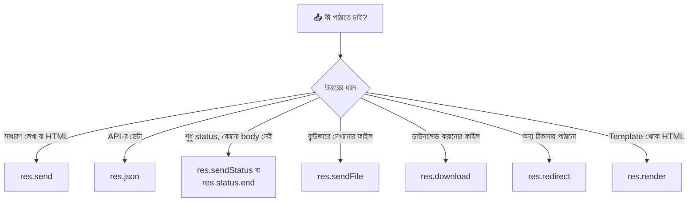

### দুটো জরুরি জিনিস

**১. Method chaining — ট্রের কাজগুলো একটার পর একটা জোড়া**

```javascript
app.post("/orders", (req, res) => {
  res
    .status(201)                       // ১. স্টিকার লাগালাম: "নতুন কিছু তৈরি হয়েছে"
    .set("X-Order-Source", "desk-1")   // ২. লেবেল লাগালাম
    .json({ message: "অর্ডার জমা হয়েছে" }); // ৩. উত্তর পাঠিয়ে দিলাম
  // status() আর set() নিজেকেই (res) ফেরত দেয়, তাই এভাবে জোড়া লাগানো যায়।
  // শেষে অবশ্যই একটা "পাঠানোর" মেথড (json/send/end...) লাগবে
});
```

**২. উত্তর একবারই**

```javascript
app.get("/oops", (req, res) => {
  res.send("প্রথম উত্তর");
  res.send("দ্বিতীয় উত্তর");
  // ❌ Error: Cannot set headers after they are sent to the client
  // প্রথম res.send()-এর সাথেই ট্রে চলে গেছে, দ্বিতীয়টা পাঠানোর মতো আর কিছু নেই
});

app.get("/safe", (req, res) => {
  const loggedIn = false;
  // loggedIn = কাস্টমারের লগইন অবস্থা (এখানে নকল মান)
  if (!loggedIn) {
    return res.status(401).send("আগে লগইন করুন");
    // ✅ return দিলাম, তাই নিচের কোড আর চলবে না
  }
  res.send("স্বাগতম!");
});
```

> **অভ্যাস করুন:** `if` এর ভেতরে উত্তর পাঠালে সামনে সবসময় `return` লিখুন।

---

## ৪. Simple String Response — চিরকুটে লিখে উত্তর

### গল্প

কাস্টমার জিজ্ঞেস করলো, "রেস্টুরেন্ট কি খোলা?" রিসেপশনিস্ট একটা ছোট্ট **চিরকুটে** লিখে দিলো: *"জি, রাত ১১টা পর্যন্ত খোলা।"* কোনো ফর্ম নেই, কোনো ছক নেই — শুধু সাদামাটা লেখা। এটাই **String response** — `res.send()`।

`res.send()` **স্মার্ট**। আপনি যা দেবেন তার ধরন দেখে সে নিজেই ঠিক করে `Content-Type` header কী হবে:

| যা দিলাম | Express যে `Content-Type` বসায় | ব্রাউজারে কী দেখা যায় |
|---|---|---|
| `"হ্যালো"` (String) | `text/html; charset=utf-8` | লেখা (বা HTML হলে render করা পেজ) |
| `{ ok: true }` (Object/Array) | `application/json; charset=utf-8` | JSON (সাথে `res.json()` চালানোর মতোই) |
| `Buffer.from("...")` | `application/octet-stream` | সাধারণত ডাউনলোড বা বাইনারি ডেটা |

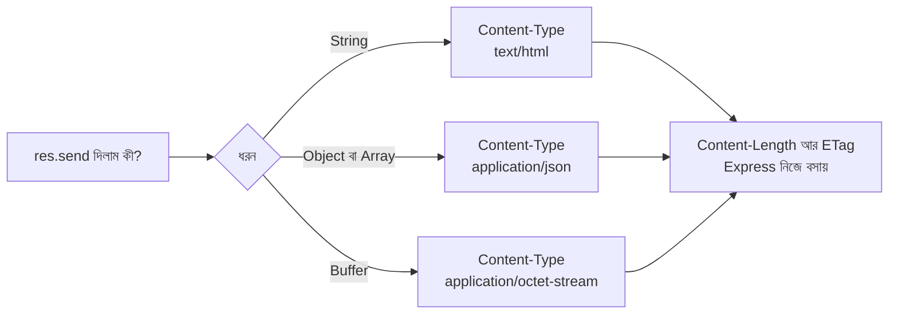

### কোড

```javascript
app.get("/hello", (req, res) => {
  res.send("হ্যালো, রিসেপশন থেকে বলছি!");
  // String দিলাম, তাই Content-Type হলো text/html; charset=utf-8
  // charset=utf-8 থাকায় বাংলা অক্ষর ঠিকঠাক দেখায়
});

app.get("/html", (req, res) => {
  res.send("<h1>আজকের মেনু</h1><ul><li>কাচ্চি</li><li>ফিরনি</li></ul>");
  // String-এর ভেতরে HTML ট্যাগ থাকলে ব্রাউজার সেটাকে রেন্ডার করে সুন্দর পেজ দেখায়
});

app.get("/plain", (req, res) => {
  res.type("text/plain");
  // res.type() = Content-Type header বসানোর সংক্ষিপ্ত উপায়।
  // "text/plain" মানে "এটা শুধুই লেখা, HTML নয়", তাই ব্রাউজার ট্যাগগুলো রেন্ডার না করে হুবহু দেখাবে
  // (res.type("txt") বা res.type("json") এর মতো সংক্ষেপেও লেখা যায়)

  res.send("<h1>এটা ট্যাগ সহ দেখাবে</h1>");
  // ব্রাউজারে <h1> ট্যাগ সহই লেখাটা দেখা যাবে
});

app.get("/about", (req, res) => {
  const shopName = "রান্নাঘর রেস্টুরেন্ট";
  // shopName = দোকানের নাম রাখার ভেরিয়েবল, যাতে বারবার লিখতে না হয়
  const openHour = 11;
  // openHour = কয়টায় খোলে (২৪ ঘণ্টার হিসাবে)

  res.send(`${shopName} প্রতিদিন সকাল ${openHour}টায় খোলে।`);
  // ${...} = template literal-এর ভেতরে ভেরিয়েবলের মান বসানোর পদ্ধতি
});
```

### `res.send()` বনাম `res.end()`

| | `res.send()` | `res.end()` |
|---|---|---|
| কে দেয় | **Express** | **Node.js** (আগের মডিউলের `http`) |
| `Content-Type` নিজে বসায়? | হ্যাঁ | না |
| Object দিলে JSON বানায়? | হ্যাঁ | না, String বা Buffer লাগে |
| কখন লাগে | প্রায় সবসময় | কোনো body ছাড়া শুধু শেষ করতে (`res.status(204).end()`) |

### সাধারণ ভুল

```javascript
res.send(42);
// ❌ সংখ্যা সরাসরি res.send()-এ দেবেন না। পুরোনো Express-এ এটা status code ধরা হতো, আর Express 5-এ এই পদ্ধতি বাদ
res.send(String(42));
// ✅ সংখ্যা পাঠাতে চাইলে String করে দিন, অথবা res.json(42)

res.send(JSON.stringify({ a: 1 }));
// ⚠️ চলে, কিন্তু Content-Type হয় text/html, তাই client বুঝবে না এটা JSON
res.json({ a: 1 });
// ✅ JSON পাঠাতে সবসময় res.json()
```

> **উত্তরে ব্যবহারকারীর দেওয়া লেখা সরাসরি HTML হিসেবে বসাবেন না।** `` res.send(`<h1>${req.query.name}</h1>`) `` লিখলে কেউ `name=<script>...</script>` দিয়ে আপনার পেজে স্ক্রিপ্ট ঢুকিয়ে দিতে পারে (এটাকে **XSS** বলে)। ব্যবহারকারীর ইনপুট **escape** করে বসাতে হয়, বা JSON হিসেবে পাঠাতে হয়।

---

## ৫. Response Status Code — ট্রের গায়ে রঙিন স্টিকার

### গল্প

প্রতিটা ফেরত ট্রের উপরে রিসেপশনিস্ট একটা **রঙিন স্টিকার** লাগায়, যাতে কাস্টমার ভেতরের জিনিস না খুলেই বুঝে যায় **কী হলো**:

- 🟢 **২xx (সবুজ)** — "সব ঠিক আছে!"
- 🟡 **৩xx (হলুদ)** — "এখানে নয়, ওই কাউন্টারে যান।"
- 🟠 **৪xx (কমলা)** — "**আপনার** কোথাও ভুল হয়েছে।"
- 🔴 **৫xx (লাল)** — "**আমাদের** রান্নাঘরে সমস্যা হয়েছে।"

কাস্টমারের অ্যাপ (Browser/React) এই স্টিকার দেখেই ঠিক করে পরের ধাপ কী হবে। তাই **সঠিক status code দেওয়া** ভালো API-র অন্যতম লক্ষণ।

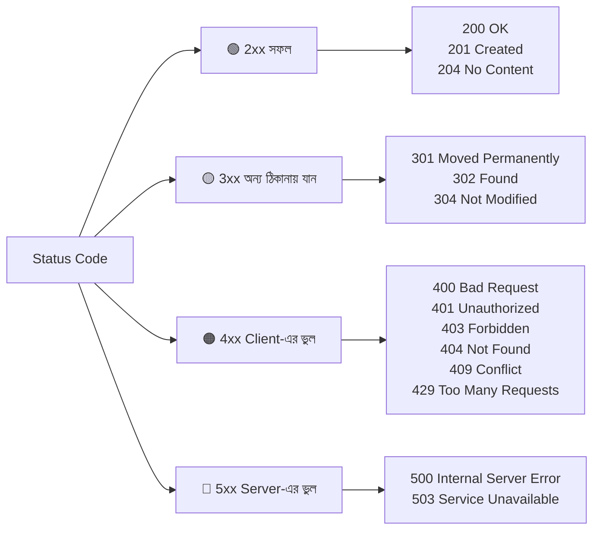

### সবচেয়ে বেশি লাগে এমন Status Code

| Code | নাম | গল্পে | কখন দেবেন |
|---|---|---|---|
| **200** | OK | "এই নিন আপনার জিনিস" | সফল GET, সফল আপডেট (ডিফল্ট) |
| **201** | Created | "নতুন অর্ডার খাতায় লেখা হয়েছে" | সফলভাবে **নতুন কিছু তৈরি** হলে (POST) |
| **204** | No Content | "কাজ হয়ে গেছে, ফেরত দেওয়ার মতো কিছু নেই" | সফল DELETE, বা যেখানে body লাগে না |
| **301** | Moved Permanently | "এই কাউন্টার **চিরতরে** সরে গেছে" | স্থায়ী redirect |
| **302** | Found | "**আজকের মতো** ওই কাউন্টারে যান" | অস্থায়ী redirect (`res.redirect`-এর ডিফল্ট) |
| **304** | Not Modified | "আপনার কাছে যা আছে সেটাই লেটেস্ট" | Caching (Express নিজে দেয়) |
| **400** | Bad Request | "আপনার ফর্মটাই ভুলভাবে ভরা" | ভুল বা অসম্পূর্ণ ইনপুট |
| **401** | Unauthorized | "আপনি কে? পরিচয় দেখান" | লগইন করা নেই |
| **403** | Forbidden | "আপনাকে চিনি, কিন্তু এই ঘরে ঢোকা নিষেধ" | লগইন আছে, কিন্তু অনুমতি নেই |
| **404** | Not Found | "এই জিনিস আমাদের নেই" | ঠিকানা বা ডেটা খুঁজে পাওয়া যায়নি |
| **409** | Conflict | "এই নামে আগেই একটা আছে" | ডুপ্লিকেট, সংঘাত |
| **422** | Unprocessable Content | "ফর্ম ঠিকমতো ভরা, কিন্তু মানগুলো গ্রহণযোগ্য নয়" | Validation ব্যর্থ হলে |
| **429** | Too Many Requests | "একটু থামুন, অনেক বেশি চাইছেন" | Rate limit |
| **500** | Internal Server Error | "আমাদের রান্নাঘরে আগুন লেগেছে" | অপ্রত্যাশিত server error |
| **503** | Service Unavailable | "আজ রেস্টুরেন্ট বন্ধ, পরে আসুন" | সাময়িকভাবে সেবা বন্ধ |

> **মনে রাখার সহজ নিয়ম:** ৪xx = *ক্লায়েন্ট* ভুল করেছে (তার ঠিক করার কিছু আছে), ৫xx = *সার্ভার* ভুল করেছে (ক্লায়েন্টের করার কিছু নেই)।

### Express-এ Status বসানোর তিন উপায়

```javascript
app.get("/menu/:id", (req, res) => {
  const id = Number(req.params.id);
  // id = URL থেকে পাওয়া String-কে সংখ্যা বানালাম

  if (Number.isNaN(id)) {
    return res.status(400).json({ error: "id অবশ্যই একটা সংখ্যা হতে হবে।" });
    // 400 = ক্লায়েন্ট ভুল ইনপুট দিয়েছে
    // res.status(400) = শুধু স্টিকার লাগালো, এখনো পাঠায়নি। পরে .json() লাগিয়ে তবেই পাঠালো
  }

  const menu = require("./data/menu");
  // menu = নকল ডেটার array
  const dish = menu.find((item) => item.id === id);
  // dish = ওই id-র আইটেম, না পেলে undefined

  if (!dish) {
    return res.status(404).json({ error: "এই আইটেম মেনুতে নেই।" });
    // 404 = ঠিকানা ঠিক আছে, কিন্তু ওই জিনিসটা নেই
  }

  res.json(dish);
  // status না বসালে ডিফল্ট 200 OK
});
```

**উপায় ১ — `res.status(code)` + পাঠানোর মেথড** (সবচেয়ে প্রচলিত)

```javascript
res.status(201).json({ message: "তৈরি হয়েছে" });
// ⚠️ শুধু res.status(404) লিখে থামলে কিছুই পাঠানো হয় না, request ঝুলে থাকবে!
```

**উপায় ২ — `res.sendStatus(code)`** (স্টিকার + স্টিকারের নাম লিখে পাঠানো)

```javascript
app.delete("/menu/:id", (req, res) => {
  // ... মুছে ফেলার কাজ ...
  res.sendStatus(204);
  // 204 পাঠালো। sendStatus(404) দিলে body তে "Not Found" লেখা যায়, নিজে কিছু লিখতে হয় না
});
```

**উপায় ৩ — `res.status(code).end()`** (কোনো body ছাড়া)

```javascript
res.status(204).end();
// 204 এবং 304-এর সাথে body পাঠানোই যায় না (HTTP-র নিয়ম), তাই .end() দিয়ে শুধু স্টিকারটা পাঠালাম
```

### একটা মজার উদাহরণ

```javascript
app.get("/coffee", (req, res) => {
  res.status(418).send("আমি একটা চায়ের কেটলি ☕, কফি বানাতে পারি না");
  // 418 "I'm a teapot" = ১৯৯৮ সালের একটা এপ্রিল ফুলস মজার স্ট্যান্ডার্ড
  // প্রমাণ যে যেকোনো ৩ অঙ্কের সংখ্যাই (১০০-৯৯৯) status হতে পারে
});
```

### Frontend থেকে status পড়া

```javascript
const response = await fetch("/menu/999");
// response = server থেকে আসা পুরো উত্তর (খাম সহ)

console.log(response.status);
// response.status = সংখ্যা, যেমন 404

console.log(response.ok);
// response.ok = status ২০০-২৯৯ এর মধ্যে হলে true, নাহলে false

if (!response.ok) {
  const err = await response.json();
  // err = server-এর পাঠানো error বার্তা { error: "..." }
  console.log(err.error);
}
```

> ⚠️ `fetch` **৪০৪ বা ৫০০-তেও error throw করে না** — শুধু নেটওয়ার্ক সমস্যায় করে। তাই সবসময় `response.ok` দেখে নিতে হয়।

---

## ৬. JSON Response — গোছানো ছাপানো ফর্ম ফেরত

### গল্প

আগের সেকশনে রিসেপশনিস্ট হাতে লিখে চিরকুট দিতো। কিন্তু কাস্টমার যদি একটা **রোবট** হয় (আপনার React অ্যাপ বা মোবাইল অ্যাপ)? রোবট হাতের লেখা বোঝে না, সে চায় **ছাপানো, গোছানো ফর্ম** — যেখানে প্রতিটা তথ্যের নির্দিষ্ট ঘর আছে: নাম কোথায়, দাম কোথায়, সংখ্যা কোথায়। এই গোছানো ফর্মের নামই **JSON** (JavaScript Object Notation)। আজকের সব API এই ভাষাতেই কথা বলে।

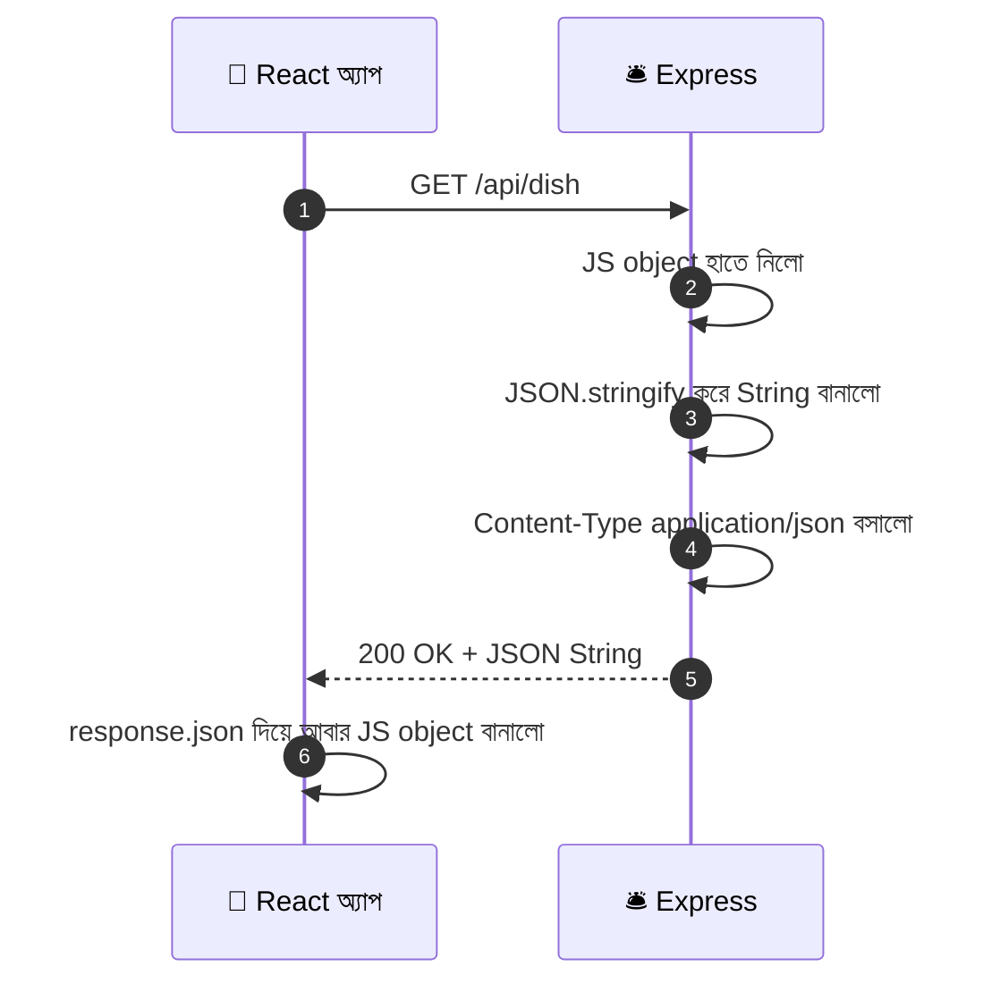

### কোড

```javascript
const menu = require("./data/menu");
// menu = নকল ডেটার array (data/menu.js থেকে)

app.get("/api/dish", (req, res) => {
  res.json({ id: 1, name: "কাচ্চি বিরিয়ানি", price: 350, vegetarian: false });
  // res.json(object) = JS object-কে JSON বানিয়ে পাঠায়,
  // সাথে Content-Type: application/json; charset=utf-8 নিজে বসায়, status ডিফল্ট 200
});

app.get("/api/menu", (req, res) => {
  res.json({ count: menu.length, items: menu });
  // Array সরাসরি না পাঠিয়ে একটা object-এ মুড়িয়ে পাঠালাম। এতে পরে count, page, message ইত্যাদি সহজে জোড়া যায়
  // menu.length = মেনুতে কয়টা আইটেম আছে
});

app.post("/api/menu", (req, res) => {
  const created = { id: 99, name: "নতুন আইটেম" };
  // created = নতুন তৈরি হওয়া আইটেম (এখানে নকল)
  res.status(201).location("/api/menu/99").json(created);
  // 201 Created + Location header (নতুন জিনিসটা কোথায় পাওয়া যাবে) + তৈরি হওয়া জিনিসটা body-তে
});
```

### `res.json()` নিজে নিজে যা যা করে

`JSON.stringify()` চালানোর সময় কিছু জিনিস অন্যরকম আচরণ করে:

| JS-এ যা আছে | JSON-এ কী হয় |
|---|---|
| `undefined` (object-এর property হিসেবে) | property-টাই **বাদ** পড়ে যায় |
| `function` | **বাদ** পড়ে যায় |
| `Date` object | ISO String হয়ে যায়, যেমন `"2026-09-24T10:00:00.000Z"` |
| `NaN`, `Infinity` | `null` হয়ে যায় |
| `BigInt` | ❌ **error** ("Do not know how to serialize a BigInt") |
| নিজেকে নিজে ঘুরে ধরা object (circular) | ❌ **error** |

```javascript
app.get("/api/demo", (req, res) => {
  res.json({
    name: "ফিরনি",
    note: undefined,          // ← এই property JSON-এ থাকবেই না
    createdAt: new Date(),    // ← ISO String হয়ে যাবে
    price: 90,
  });
});
```

**`toJSON()` দিয়ে নিজের নিয়মে সাজানো**

```javascript
const dish = {
  name: "কাচ্চি",
  price: 350,
  secretCost: 200,
  // secretCost = রান্নার আসল খরচ, যেটা কাস্টমারকে দেখানো যাবে না
  toJSON() {
    return { name: this.name, price: this.price };
    // JSON.stringify (এবং res.json) এই ফাংশন থাকলে সেটাই চালায়
    // this = এই object নিজে। শুধু name আর price ফেরত দিলাম, secretCost বাদ
  },
};
app.get("/api/safe-dish", (req, res) => res.json(dish));
// কাস্টমার শুধু { name, price } পাবে। গোপন তথ্য (পাসওয়ার্ড, খরচ) কখনো উত্তরে পাঠাবেন না
```

### সুন্দর করে (pretty) দেখাতে

```javascript
app.set("json spaces", 2);
// "json spaces" = res.json() ফরম্যাট করার সময় কয়টা space দিয়ে indent হবে। 2 দিলে পড়তে সুবিধা
// শুধু ডেভেলপমেন্টে ব্যবহার করুন, কারণ space বাড়লে উত্তরের সাইজও বাড়ে

app.set("json replacer", (key, value) => (key === "password" ? undefined : value));
// "json replacer" = সব res.json()-এর জন্য একটা ফিল্টার। এখানে "password" নামের যেকোনো key বাদ পড়বে
// key = property-র নাম, value = তার মান। undefined ফেরত দিলে property বাদ যায়
```

### সব উত্তরের একটা মিলানো চেহারা রাখা

বড় প্রজেক্টে সব API-র উত্তর একই ছাঁচে দিলে frontend-এর কাজ সহজ হয়:

```javascript
// সফল উত্তরের ছাঁচ
res.status(200).json({ success: true, data: dish });

// ব্যর্থ উত্তরের ছাঁচ
res.status(404).json({ success: false, error: "এই আইটেম মেনুতে নেই।" });
// success = কাজ হলো কি না (true/false)
// data / error = সফল হলে ডেটা, ব্যর্থ হলে বার্তা
// Frontend শুধু data.success দেখেই বুঝে ফেলবে কী করতে হবে
```

### `res.send(object)` বনাম `res.json(object)`

দুটোই object দিলে JSON পাঠায়। তবু **`res.json()` লিখুন**, কারণ:

- কোডে পরিষ্কার বোঝা যায় এটা JSON উত্তর
- `null` বা সংখ্যার মতো মানও ঠিকভাবে JSON বানায় (`res.json(null)` → `null`)
- `json spaces`, `json replacer` সেটিং শুধু এর সাথে কাজ করে

### `res.jsonp()` — একটা পুরোনো কৌশল

```javascript
app.get("/api/old", (req, res) => res.jsonp({ ok: true }));
// URL-এ ?callback=myFunc দিলে উত্তর হয় myFunc({"ok":true}) — এই স্ক্রিপ্ট ট্যাগ দিয়ে অন্য ডোমেইন থেকে ডেটা আনার পুরোনো পদ্ধতি।
// আজকের দিনে এর বদলে CORS ব্যবহার হয়, তাই শুধু জেনে রাখুন, ব্যবহার করবেন না
```

### Frontend-এ JSON নেওয়া

```javascript
const response = await fetch("/api/menu");
// response = পুরো উত্তর। এখনো body পড়া হয়নি

const data = await response.json();
// response.json() = body-র JSON String-কে আবার JS object বানায় (এটাও async, তাই await)
console.log(data.count, data.items);
```

---

## ৭. Response Download — টেক-অ্যাওয়ে প্যাকেট

### গল্প

কাস্টমার বললো, "আপনাদের মেনুর PDF-টা দিন।" রিসেপশনিস্টের সামনে দুটো পথ:

- 🍽️ **ডাইন-ইন:** কাস্টমারের সামনে মেনু খুলে ধরা — সে বসে বসে দেখবে। (`res.sendFile()` — ব্রাউজার ফাইলটা নিজেই খুলে দেখায়, যেমন ছবি বা PDF)
- 🥡 **টেক-অ্যাওয়ে:** মেনুটা সুন্দর প্যাকেটে ভরে গায়ে নাম লিখে ধরিয়ে দেওয়া — "এটা বাড়ি নিয়ে যান।" (`res.download()` — ব্রাউজার ফাইলটা দেখানোর বদলে সরাসরি **ডাউনলোড** করে)

তফাতটা আসলে একটা **লেবেলের**: `Content-Disposition: attachment; filename="..."`। এই লেবেল দেখলেই ব্রাউজার বুঝে যায় "এটা দেখাতে হবে না, সেভ করতে হবে।" `res.download()` এই লেবেলটা নিজেই লাগিয়ে দেয়।

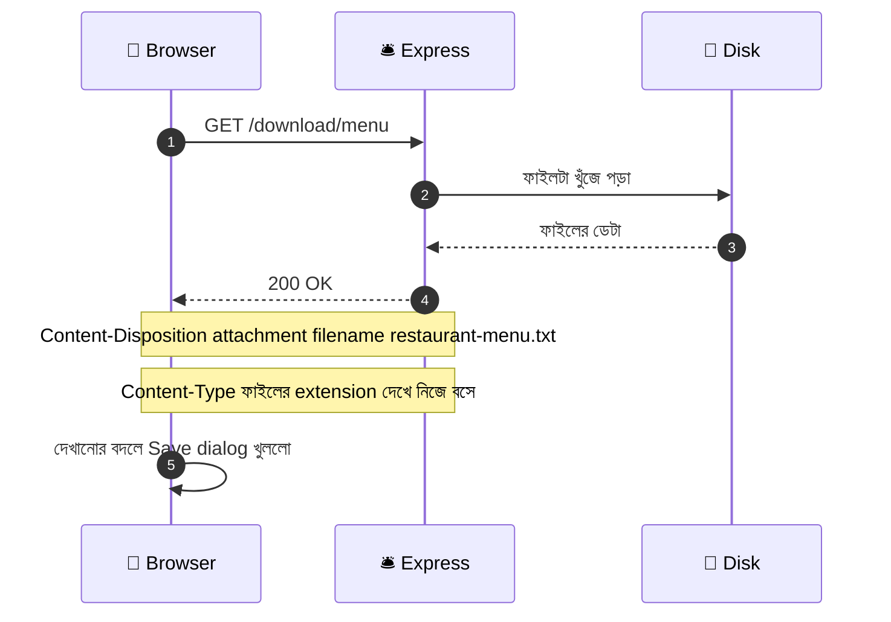

### প্রস্তুতি — ডাউনলোডের ফাইল বানানো

`files/menu.txt` নামে একটা ফাইল বানান, ভেতরে যা খুশি লিখুন:

```
রান্নাঘর রেস্টুরেন্ট — মেনু
১. কাচ্চি বিরিয়ানি — ৳৩৫০
২. সবজি খিচুড়ি — ৳১৮০
৩. ফিরনি — ৳৯০
```

### কোড — `res.download()`

```javascript
const path = require("path");
// path = ফোল্ডার/ফাইলের ঠিকানা বানানোর বিল্ট-ইন module, যা সব অপারেটিং সিস্টেমে ঠিক কাজ করে

app.get("/download/menu", (req, res) => {
  const filePath = path.join(__dirname, "files", "menu.txt");
  // filePath = ফাইলটার পূর্ণ ঠিকানা (absolute path)।
  // __dirname = এই server.js যে ফোল্ডারে আছে তার ঠিকানা। path.join() সেটার সাথে "files" আর "menu.txt" জুড়ে দেয়
  // ⚠️ ঠিকানা সবসময় __dirname দিয়ে বানান। সরাসরি "files/menu.txt" লিখলে server অন্য ফোল্ডার থেকে চালালে ফাইল খুঁজে পাবে না

  res.download(filePath, "restaurant-menu.txt", (error) => {
    // res.download(পথ, ডাউনলোডে-দেখানো-নাম, callback)
    // ২য় আর্গুমেন্ট = ব্যবহারকারীর কম্পিউটারে ফাইলটা যে নামে সেভ হবে (ডিস্কের আসল নামের সাথে মিলতে হবে না)
    // বাংলা নামও চলে, যেমন "মেনু.txt"
    // callback = ডাউনলোড শেষ হলে (বা ব্যর্থ হলে) চলে। error থাকলে কিছু একটা ভুল হয়েছে

    if (error) {
      console.error("ডাউনলোড ব্যর্থ:", error.message);
      // error.message = কেন ব্যর্থ হলো (যেমন ফাইল নেই বা কানেকশন কেটে গেছে)

      if (!res.headersSent) {
        res.status(404).json({ error: "ফাইলটা পাওয়া যায়নি।" });
        // res.headersSent = উত্তরের header আগেই চলে গেছে কি না।
        // চলে গেলে আর নতুন উত্তর পাঠানো যায় না (দুইবার পাঠালে crash), তাই আগে যাচাই করে নিলাম
      }
    }
  });
});
```

### ব্যবহারকারী ফাইলের নাম দিলে — 🔐 নিরাপত্তা

```javascript
const FILES_DIR = path.join(__dirname, "files");
// FILES_DIR = শুধু এই ফোল্ডারের ফাইলই ডাউনলোড করা যাবে, এর বাইরের কিছু নয়

app.get("/download/:name", (req, res) => {
  const safeName = path.basename(req.params.name);
  // req.params.name = URL থেকে পাওয়া ফাইলের নাম, যেটা ব্যবহারকারী নিজে লিখতে পারে
  // path.basename() = পথের শুধু শেষের ফাইলের নামটুকু রাখে। "../../.env" দিলে হয়ে যায় ".env" (ফোল্ডার ছাড়ার সুযোগ থাকে না)

  res.download(safeName, safeName, { root: FILES_DIR }, (error) => {
    // { root: FILES_DIR } = "ফাইলটা এই ফোল্ডারের ভেতর থেকে খোঁজো, বাইরে বেরোতে দিয়ো না"
    // ১ম আর্গুমেন্ট এখানে root-এর সাপেক্ষে ঠিকানা। ".." দিয়ে বাইরে যাওয়ার চেষ্টা Express নিজেই আটকে দেয়

    if (error && !res.headersSent) {
      res.status(404).json({ error: "ফাইলটা পাওয়া যায়নি।" });
    }
  });
});
```

> ⚠️ **কখনোই** `res.download(req.params.name)` বা `res.download("files/" + req.query.file)` এভাবে সরাসরি ব্যবহারকারীর দেওয়া নাম বসাবেন না। কেউ `../../.env` লিখে আপনার গোপন ফাইল নামিয়ে নিতে পারে। এই আক্রমণের নাম **Path Traversal**।

### ডিস্কে ফাইল নেই, ডেটা থেকেই ডাউনলোড বানাতে — `res.attachment()`

ধরুন মেনুর CSV ফাইল বানিয়ে দিতে চান, কিন্তু ফাইলটা ডিস্কে নেই, মেমরির ডেটা থেকে বানাবেন:

```javascript
const menu = require("./data/menu");
// menu = নকল ডেটার array

app.get("/download/menu.csv", (req, res) => {
  const header = "id,name,price";
  // header = CSV-র প্রথম লাইন (কলামের নাম)

  const rows = menu.map((dish) => `${dish.id},${dish.name},${dish.price}`);
  // rows = প্রতিটা আইটেম থেকে একটা করে লাইন। map() নতুন array বানায়

  const csv = [header, ...rows].join("\n");
  // csv = সব লাইন নতুন লাইন ("\n") দিয়ে জোড়া একটা বড় String

  res.attachment("menu.csv");
  // res.attachment(নাম) = শুধু Content-Disposition: attachment; filename="menu.csv" লাগায়,
  // আর ফাইলের extension (.csv) দেখে Content-Type নিজে বসায়। এটা ফাইল পাঠায় না, শুধু লেবেল লাগায়

  res.send(csv);
  // এবার আসল ডেটা পাঠালাম। ব্রাউজার লেবেল দেখে ডাউনলোড করবে
});
```

> 💡 বাংলা লেখা সহ CSV Excel-এ খুললে অক্ষর ভেঙে যেতে পারে। তখন CSV-র শুরুতে `"\uFEFF"` (BOM) জুড়ে দিলে Excel UTF-8 বুঝতে পারে।

### `res.sendFile()` — ডাইন-ইন পদ্ধতি

```javascript
app.get("/view/menu", (req, res) => {
  res.sendFile(path.join(__dirname, "files", "menu.txt"));
  // sendFile = ফাইল পাঠায়, কিন্তু "ডাউনলোড করো" লেবেল লাগায় না।
  // .txt, .png, .pdf, .html ইত্যাদি হলে ব্রাউজার নিজেই খুলে দেখাবে
  // ⚠️ ঠিকানা অবশ্যই absolute হতে হয় (অথবা { root: ... } option দিতে হয়), নাহলে error আসে
});
```

### `sendFile` বনাম `download` বনাম `attachment`

| | `res.sendFile()` | `res.download()` | `res.attachment()` |
|---|---|---|---|
| গল্পে | ডাইন-ইন (সামনে খুলে দেখানো) | টেক-অ্যাওয়ে (প্যাকেট করে দেওয়া) | শুধু প্যাকেটের গায়ে স্টিকার লাগানো |
| ফাইল পাঠায়? | হ্যাঁ | হ্যাঁ | **না** (আপনি নিজে `res.send` করবেন) |
| ডাউনলোড করায়? | না (ব্রাউজার দেখাতে পারলে দেখায়) | হ্যাঁ | হ্যাঁ (পরে `res.send` করলে) |
| কখন লাগে | ছবি, PDF দেখানো, HTML পেজ পাঠানো | রিপোর্ট, ইনভয়েস, ব্যাকআপ ডাউনলোড | ডিস্কে নেই এমন ডেটা (CSV, generated PDF) ডাউনলোড |

### Frontend থেকে ডাউনলোড

```html
<a href="/download/menu" download>মেনু ডাউনলোড করুন</a>
<!-- সাধারণ লিংকই যথেষ্ট। Express Content-Disposition দিয়েছে বলে ব্রাউজার সেভ করবে -->
```

```javascript
// JavaScript দিয়ে ডাউনলোড (যেমন Authorization header সহ)
const response = await fetch("/download/menu");
const blob = await response.blob();
// blob = ফাইলের বাইনারি ডেটা (Binary Large Object)

const url = URL.createObjectURL(blob);
// url = ব্রাউজারের মেমরিতে থাকা blob-টার একটা সাময়িক ঠিকানা (blob:http://...)

const link = document.createElement("a");
link.href = url;
link.download = "menu.txt";
// link.download = সেভ করার সময় যে নামে দেখাবে
link.click();
// লুকানো লিংকে নিজে থেকে ক্লিক করালাম, ফলে ডাউনলোড শুরু
URL.revokeObjectURL(url);
// কাজ শেষে সাময়িক ঠিকানাটা মুছে মেমরি খালি করলাম
```

---

## ৮. Response Redirect — "ওই কাউন্টারে যান" চিরকুট

### গল্প

কাস্টমার এসে বললো, "আমি পুরোনো `/old-menu` কাউন্টারে যাবো।" রিসেপশনিস্ট বললো, "ওই কাউন্টার সরে গেছে। এই চিরকুটে নতুন ঠিকানা লেখা: **`/menu`**। ওখানে যান।" কাস্টমার নিজেই নতুন কাউন্টারে হেঁটে গেলো।

মনে রাখুন: **রিসেপশনিস্ট নিজে কাস্টমারকে টেনে নিয়ে যায়নি।** সে শুধু একটা চিরকুট দিয়েছে (status 3xx + `Location` header)। **ব্রাউজার নিজে** নতুন ঠিকানায় দ্বিতীয় একটা request পাঠিয়েছে। তাই redirect-এ সবসময় **দুইটা request** হয়।

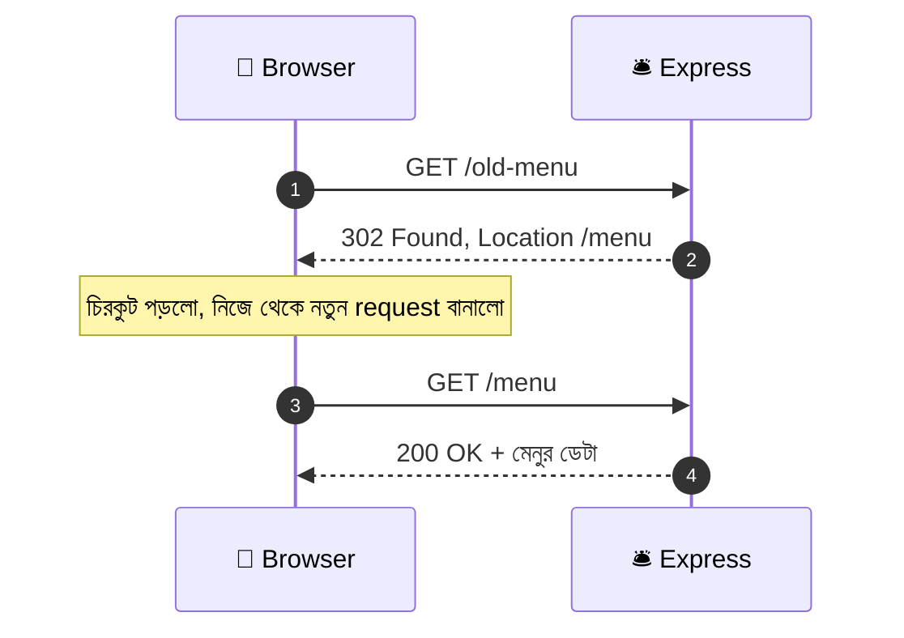

### কোড

```javascript
app.get("/old-menu", (req, res) => {
  res.redirect(301, "/menu");
  // res.redirect(status, url) = ব্রাউজারকে url-এ পাঠিয়ে দেয়।
  // 301 = স্থায়ীভাবে সরে গেছে। ব্রাউজার আর Google এই খবর মনে রাখে, পরে সরাসরি নতুন ঠিকানায় যায়
});

app.get("/go-menu", (req, res) => {
  res.redirect("/menu");
  // status না দিলে ডিফল্ট 302 (অস্থায়ী)। সাধারণ ক্ষেত্রে এটাই যথেষ্ট
});

app.get("/docs", (req, res) => {
  res.redirect("https://expressjs.com");
  // অন্য ওয়েবসাইটেও পাঠানো যায়। পুরো URL (https://...) দিতে হয়
});
```

### Redirect-এর status code — কোনটা কখন

| Code | নাম | স্থায়ী? | পরের request-এর method | কখন |
|---|---|---|---|---|
| **301** | Moved Permanently | স্থায়ী | POST → GET হয়ে যেতে পারে | ওয়েবসাইটের ঠিকানা চিরতরে বদলেছে |
| **302** | Found | অস্থায়ী | POST → GET হয়ে যেতে পারে | সাধারণ অস্থায়ী redirect (**ডিফল্ট**) |
| **303** | See Other | অস্থায়ী | **সবসময় GET** | POST-এর পর ফলাফল পেজে পাঠানো |
| **307** | Temporary Redirect | অস্থায়ী | **একই method আর body** থাকে | অস্থায়ীভাবে সরে গেছে, POST-ই আবার পাঠাতে হবে |
| **308** | Permanent Redirect | স্থায়ী | **একই method আর body** থাকে | স্থায়ীভাবে সরে গেছে, POST-ও একই থাকবে |

> **সহজ নিয়ম:** সাধারণ পেজ সরালে `301`/`302`। POST করার পর "ধন্যবাদ পেজ"-এ পাঠালে `303`। API-র এন্ডপয়েন্ট সরালে যেখানে method বদলানো যাবে না, সেখানে `307`/`308`।

### Redirect-এর ঠিকানা লেখার নানা রূপ

```javascript
res.redirect("/menu");                       // root থেকে শুরু। localhost:3000/menu
res.redirect("menu");                        // বর্তমান পথের সাপেক্ষে (relative)
res.redirect("../menu");                     // এক ধাপ উপরে গিয়ে
res.redirect("https://example.com/menu");    // অন্য সাইটে
res.redirect(req.get("Referer") || "/");
// "পিছনে ফিরে যাও"। req.get("Referer") = কাস্টমার আগে কোন পেজ থেকে এসেছিল (ব্রাউজার পাঠায়)। না থাকলে "/"
// ⚠️ Express 5-এ res.redirect("back") বাদ, তাই এই লেখাটাই এখনকার উপায়
```

> ⚠️ **Express 5 সতর্কতা:** পুরোনো `res.redirect(url, status)` (ঠিকানা আগে, status পরে) আর চলে না। এখন সবসময় **`res.redirect(status, url)`** — status আগে।

### POST-এর পরে Redirect — Post/Redirect/Get (PRG)

ফর্ম জমা দেওয়ার পর ব্যবহারকারী যদি রিফ্রেশ দেয়, ব্রাউজার আবার POST পাঠাতে চায় — ফলে **একই অর্ডার দুইবার জমা** পড়তে পারে। সমাধান: POST শেষে একটা **GET পেজে redirect** করে দিন।

```javascript
app.post("/orders", (req, res) => {
  // ... অর্ডার সেভ করার কাজ ...
  res.redirect(303, "/orders/thanks");
  // 303 = "অর্ডার জমা হয়েছে, এখন ধন্যবাদ পেজ (GET) দেখো"।
  // এরপর রিফ্রেশ দিলে ধন্যবাদ পেজই আবার লোড হবে, অর্ডার আবার জমা পড়বে না
});

app.get("/orders/thanks", (req, res) => res.send("ধন্যবাদ! আপনার অর্ডার জমা হয়েছে 🎉"));
```

### 🔐 Open Redirect — ব্যবহারকারীর দেওয়া ঠিকানায় সরাসরি পাঠাবেন না

লগইনের পর `?next=/profile` দিয়ে "আগের পেজে ফেরত পাঠানো" খুব প্রচলিত। কিন্তু কেউ যদি লিংক বানায় `?next=https://fake-bank.com`, তাহলে আপনার সাইটের ভরসায় ব্যবহারকারী নকল সাইটে চলে যাবে।

```javascript
app.get("/login-done", (req, res) => {
  const next = req.query.next;
  // next = URL-এর ?next=... অংশ। ব্যবহারকারী যা খুশি লিখতে পারে, তাই যাচাই না করে বিশ্বাস করা যাবে না

  const isSafe =
    typeof next === "string" &&
    next.startsWith("/") &&
    !next.startsWith("//") &&
    !next.startsWith("/\\");
  // isSafe = true হবে যদি:
  //   ১. next একটা String,
  //   ২. আমাদের নিজের সাইটের ভেতরের পথ ("/" দিয়ে শুরু),
  //   ৩. "//evil.com" নয় (ব্রাউজার এটাকে অন্য সাইট ধরে), ৪. "/\evil.com" নয় (ব্রাউজার \ কে / ধরে)

  res.redirect(isSafe ? next : "/");
  // নিরাপদ হলে next-এ, নাহলে হোমপেজে
});
```

### Frontend-এ Redirect

```javascript
const response = await fetch("/old-menu");
// fetch redirect নিজে থেকেই অনুসরণ করে, তাই আপনি সরাসরি চূড়ান্ত উত্তরটা পাবেন

console.log(response.redirected); // true = redirect হয়েছিল
console.log(response.url);        // শেষে যে ঠিকানায় পৌঁছেছে, যেমন http://localhost:3000/menu
```

---

## ৯. Response Header — ফেরত ট্রের লেবেল

### গল্প

আগের ফাইলে দেখেছেন, **আসা** খামের গায়ে লেবেল থাকে (Request Header)। ঠিক তেমনি **ফেরত** ট্রের গায়েও রিসেপশনিস্ট লেবেল লাগায় — ভেতরের জিনিসটা সম্পর্কে **অতিরিক্ত তথ্য (metadata)**:

- *"ভেতরে JSON আছে"* → `Content-Type`
- *"এটা ৩০ মিনিট মনে রাখতে পারেন"* → `Cache-Control`
- *"এটা ডাউনলোড করুন"* → `Content-Disposition`
- *"নতুন ঠিকানা এই"* → `Location`
- *"এই টোকেন কার্ডটা রাখুন"* → `Set-Cookie`
- *"আমাদের নিজেদের বিশেষ লেবেল"* → `X-Served-By: desk-1`

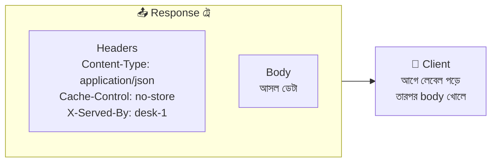

### কোড

```javascript
app.get("/headers-demo", (req, res) => {
  res.set("X-Served-By", "reception-desk-1");
  // res.set(নাম, মান) = একটা header বসানো। নাম বড়-ছোট হাতের অক্ষরে পার্থক্য করে না
  // "X-" দিয়ে শুরু হওয়া নাম = নিজের বানানো custom header (একটা প্রচলিত রীতি)

  res.set({
    "Cache-Control": "no-store",
    "X-Shop-Name": "Rannaghor",
  });
  // object দিলে একসাথে অনেকগুলো header বসানো যায়
  // Cache-Control: no-store = ব্রাউজারকে বলা "এই উত্তর মনে রেখো না, প্রতিবার নতুন করে চাও"

  res.append("X-Note", "first");
  res.append("X-Note", "second");
  // res.append() = আগের header মুছে না ফেলে তার সাথে নতুন মান জুড়ে দেয়।
  // set() দিয়ে দুইবার লিখলে দ্বিতীয়টা প্রথমটাকে মুছে দিতো।
  // ⚠️ header-এর মান ইংরেজিতে রেখেছি, কারণ বাংলা দিলে Node error দেয় (নিচে দেখুন)

  const servedBy = res.get("X-Served-By");
  // servedBy = res.get(নাম) দিয়ে নিজের বসানো header-এর মান আবার পড়া। এখানে "reception-desk-1"

  res.json({ ok: true, servedBy });
});
```

> ⚠️ **Header-এর মানে বাংলা বা অন্য non-ASCII অক্ষর সরাসরি দেবেন না** — Node `ERR_INVALID_CHAR` দিয়ে crash করে। বাংলা পাঠাতেই হলে `encodeURIComponent("রান্নাঘর")` দিয়ে এনকোড করে পাঠান, আর client `decodeURIComponent` দিয়ে খুলবে।

### সব উত্তরে একই header বসানো

```javascript
app.use((req, res, next) => {
  res.set("X-Shop-Name", "Rannaghor");
  // app.use() দিয়ে বসানো এই ফাংশনটা (এটাকেই middleware বলে) প্রতিটা request-এ আগে চলে।
  // ফলে সব উত্তরে এই লেবেল যাবে
  next();
  // next() না লিখলে request এখানেই আটকে যাবে, কোনো route পর্যন্ত পৌঁছাবেই না
});
// ⚠️ এটা অবশ্যই route-গুলোর আগে লিখতে হবে
```

### Express-এর নিজের বসানো `X-Powered-By`

```javascript
app.disable("x-powered-by");
// Express ডিফল্টে প্রতিটা উত্তরে "X-Powered-By: Express" লাগায়, মানে বাইরের সবাইকে জানিয়ে দেয় আমরা কোন টুল ব্যবহার করছি।
// এটা বন্ধ করা একটা ছোট কিন্তু ভালো অভ্যাস। এটা route-এর আগে, একদম উপরের দিকে রাখুন
```

### গুরুত্বপূর্ণ Response Header-গুলো

| Header | কাজ | উদাহরণ |
|---|---|---|
| `Content-Type` | ভেতরে কী ধরনের ডেটা | `application/json; charset=utf-8` |
| `Content-Length` | body কত বাইটের (Express নিজে বসায়) | `128` |
| `Cache-Control` | ব্রাউজার কতক্ষণ মনে রাখবে | `no-store`, `public, max-age=3600` |
| `ETag` | উত্তরের "আঙুলের ছাপ"। বদলালে বোঝা যায় ডেটা বদলেছে (Express নিজে বসায়) | `W/"a1-xyz"` |
| `Content-Disposition` | ডাউনলোড হবে কি না, কী নামে | `attachment; filename="menu.txt"` |
| `Location` | redirect বা নতুন তৈরি জিনিসের ঠিকানা | `/menu/99` |
| `Set-Cookie` | ব্রাউজারে cookie বসানো | `theme=dark; Path=/; HttpOnly` |
| `Access-Control-Allow-Origin` | অন্য ডোমেইনের ওয়েবসাইট (CORS) এই API ডাকতে পারবে কি না | `https://myapp.com` |
| `Retry-After` | কতক্ষণ পরে আবার চেষ্টা করতে হবে (429/503-এ) | `30` |
| `Strict-Transport-Security` | ব্রাউজারকে বলা "সবসময় https ব্যবহার করো" | `max-age=31536000` |

> 💡 নিরাপত্তা সম্পর্কিত ১০-১৫টা header একসাথে বসাতে **`helmet`** নামের প্যাকেজ ব্যবহার হয় (`npm install helmet`, তারপর `app.use(helmet())`)। আর CORS-এর জন্য **`cors`** প্যাকেজ।

### Header বসানোর নিয়ম — আগে লেবেল, পরে বাক্স

```javascript
app.get("/late", (req, res) => {
  res.send("উত্তর চলে গেলো");
  res.set("X-Late", "yes");
  // ❌ Error [ERR_HTTP_HEADERS_SENT]: Cannot set headers after they are sent
  // res.send() চালানোর সাথে সাথে header আর body দুটোই চলে গেছে। ট্রে পাঠানোর পর আর লেবেল লাগানো যায় না
});
```

> **নিয়ম:** সব `res.set()`, `res.status()`, `res.cookie()` **আগে**, আর `res.send/json/end` **সবার শেষে**।

---

## ১০. Response Set Cookies — টোকেন কার্ড দেওয়া

### গল্প

কাস্টমার প্রথমবার রেস্টুরেন্টে এলো। রিসেপশনিস্ট তাকে একটা ছোট **টোকেন কার্ড** ধরিয়ে দিয়ে বললো: *"এটা আপনার পকেটে রাখুন। পরের বার যখনই আসবেন, প্রথমেই এই কার্ডটা দেখাবেন।"*

কাস্টমার কার্ডটা পকেটে রাখলো (**ব্রাউজার** সেটা জমিয়ে রাখলো)। পরের বার এসে সে আপনা-আপনি কার্ড দেখালো (**ব্রাউজার প্রতিটা request-এর সাথে নিজে থেকে cookie পাঠিয়ে দিলো**)। রিসেপশনিস্ট কার্ড দেখে বুঝলো: *"ও, ইনি সেই কাস্টমার যিনি ডার্ক থিম পছন্দ করেন / যিনি লগইন করা আছেন।"*

**এটাই Cookie।** HTTP আসলে **স্মৃতিহীন (stateless)** — প্রতিটা request-এ রিসেপশনিস্ট আগের কাস্টমারকে ভুলে যায়। Cookie হলো সেই ছোট্ট স্মৃতি-চিহ্ন, যা কাস্টমারই বহন করে।

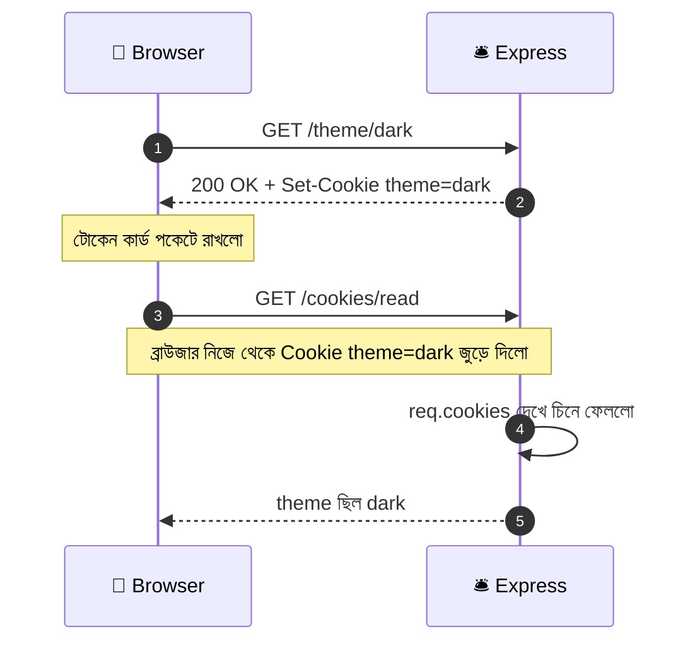

**দুটো নতুন জিনিস মাথায় রাখুন:**

- Server `res.cookie()` চালালে আসলে উত্তরে একটা **`Set-Cookie` header** যায় (সেকশন ৯-এর লেবেলের গল্প!)।
- পরের প্রতিটা request-এ ব্রাউজার একটা **`Cookie` header** জুড়ে দেয়। Server সেটা পড়ে `req.cookies` দিয়ে।

### প্রস্তুতি — `cookie-parser`

Express `res.cookie()` দিয়ে cookie **বসাতে** পারে, কিন্তু আসা cookie **পড়তে** পারে না। এজন্য দরকার `cookie-parser` (সেটআপের সময়েই ইনস্টল করেছি):

```javascript
const cookieParser = require("cookie-parser");
// cookie-parser = আসা Cookie header-টাকে ভেঙে req.cookies নামের সুন্দর object বানিয়ে দেয়

const COOKIE_SECRET = process.env.COOKIE_SECRET || "dev-only-secret-change-me";
// COOKIE_SECRET = signed cookie-তে "সিলমোহর" দেওয়ার গোপন চাবি।
// আসল প্রজেক্টে এটা .env ফাইলে থাকে, কোডে লেখা থাকে না (এখানে শেখার জন্য একটা ডিফল্ট দিলাম)

app.use(cookieParser(COOKIE_SECRET));
// app.use() = এই middleware সব request-এ চলবে। ⚠️ এটা route-গুলোর আগে বসাতে হবে,
// নাহলে route-এর ভেতরে req.cookies পাওয়া যাবে না (undefined আসবে)
```

### কোড — সবচেয়ে সহজ Cookie

```javascript
app.get("/cookies/set", (req, res) => {
  res.cookie("visitor", "guest-101");
  // res.cookie(নাম, মান) = "visitor" নামের একটা cookie বসালো, মান "guest-101"
  // কোনো option না দিলে এটা session cookie: ব্রাউজার বন্ধ করলেই মুছে যায়

  res.send("টোকেন কার্ড দিয়েছি! DevTools → Application → Cookies দেখুন।");
});
```

### কোড — Option সহ Cookie

```javascript
const isProduction = process.env.NODE_ENV === "production";
// isProduction = আমরা কি আসল (live) সার্ভারে আছি? নাকি লোকাল কম্পিউটারে?
// NODE_ENV = Node-এর একটা প্রচলিত পরিবেশ-ভেরিয়েবল। hosting-এ সাধারণত "production" সেট করা থাকে

const ONE_WEEK = 7 * 24 * 60 * 60 * 1000;
// ONE_WEEK = এক সপ্তাহ, মিলিসেকেন্ডে (৭ দিন × ২৪ ঘণ্টা × ৬০ মিনিট × ৬০ সেকেন্ড × ১০০০)
// ⚠️ Express-এ maxAge মিলিসেকেন্ডে দিতে হয়, সেকেন্ডে নয়

const themeCookieOptions = {
  maxAge: ONE_WEEK,      // কতক্ষণ বাঁচবে। এর পরে ব্রাউজার নিজে মুছে ফেলবে
  httpOnly: false,       // false = ব্রাউজারের JavaScript (document.cookie) থেকে পড়া যাবে। থিমের মতো নিরীহ জিনিসের জন্য ঠিক আছে
  secure: isProduction,  // true = শুধু https-এ পাঠাবে। লাইভ সার্ভারে true, লোকাল http-তে false
  sameSite: "lax",       // অন্য সাইট থেকে আসা request-এ cookie পাঠানো কতটা সীমিত হবে (নিচের টেবিলে দেখুন)
  path: "/",             // সাইটের কোন কোন পথে cookie যাবে। "/" = পুরো সাইটে
};
// অপশনগুলো একটা const object-এ রাখলাম, কারণ cookie মোছার সময় (পরের সেকশন) হুবহু একই অপশন লাগবে

app.get("/theme/:mode", (req, res) => {
  const mode = req.params.mode === "dark" ? "dark" : "light";
  // mode = URL থেকে পাওয়া মান। "dark" ছাড়া যা-ই দিক, আমরা "light" ধরবো।
  // ব্যবহারকারীর ইনপুট সরাসরি cookie-তে বসাই না, আগে যাচাই করে নিই

  res.cookie("theme", mode, themeCookieOptions);
  // তিন আর্গুমেন্ট: নাম, মান, অপশন

  res.json({ message: `থিম ${mode} করা হলো`, theme: mode });
});

app.get("/cookies/read", (req, res) => {
  res.json({
    cookies: req.cookies,
    // req.cookies = cookie-parser-এর বানানো object। সাধারণ (unsigned) সব cookie এখানে। যেমন { theme: "dark" }
    signedCookies: req.signedCookies,
    // req.signedCookies = সিলমোহর-করা (signed) cookie এখানে আলাদা থাকে। সিলমোহর নষ্ট হলে মান হয় false
  });
});
```

### Cookie-র Option-গুলো

| Option | কাজ | গল্পে | উদাহরণ |
|---|---|---|---|
| `maxAge` | কত **মিলিসেকেন্ড** বাঁচবে | "কার্ডের মেয়াদ এত সময়" | `60 * 60 * 1000` (১ ঘণ্টা) |
| `expires` | কোন **তারিখ-সময়ে** মেয়াদ শেষ (`Date` object) | "কার্ডের মেয়াদ এই তারিখে শেষ" | `new Date("2026-12-31")` |
| `httpOnly` | `true` হলে JavaScript থেকে পড়া যায় না, শুধু server পায় | "কার্ড শুধু রিসেপশনিস্টই দেখতে পারবে, কাস্টমার নিজেও পকেট থেকে বের করে দেখাতে পারবে না" | `true` |
| `secure` | `true` হলে শুধু **https** সংযোগে যায় | "কার্ড শুধু বুলেটপ্রুফ গাড়িতে (https) নেওয়া যাবে" | `true` |
| `sameSite` | অন্য সাইট থেকে আসা request-এ cookie যাবে কি না | "অন্য রেস্টুরেন্ট থেকে আসা কাস্টমারের কার্ড নেব কি না" | `"strict"`, `"lax"`, `"none"` |
| `path` | কোন URL-পথে যাবে (ডিফল্ট `/`) | "কার্ড কোন কোন ঘরে চলবে" | `"/admin"` |
| `domain` | কোন ডোমেইনে (ও তার subdomain-এ) যাবে | "কার্ড কোন শাখায় চলবে" | `".myshop.com"` |
| `signed` | `true` হলে মানের সাথে **সিলমোহর** জোড়ে | "কার্ডে রিসেপশনের সিল, জাল করলে ধরা পড়বে" | `true` |

**`sameSite`-এর তিন মান:**

| মান | আচরণ | কখন |
|---|---|---|
| `"strict"` | অন্য সাইট থেকে আসা **যেকোনো** request-এ cookie যায় না (এমনকি লিংকে ক্লিক করলেও) | ব্যাংকিং ধরনের খুব সংবেদনশীল কাজ |
| `"lax"` | অন্য সাইট থেকে শুধু নিরাপদ লিংক-নেভিগেশনে (GET) যায় | **সাধারণ ব্যবহারের জন্য ভালো ডিফল্ট** |
| `"none"` | সব ক্ষেত্রে যায়, কিন্তু **`secure: true` বাধ্যতামূলক** | frontend আর backend আলাদা ডোমেইনে থাকলে |

### Signed Cookie — সিলমোহর-করা কার্ড

কার্ডের লেখা যে কেউ পকেটে বসে বদলে ফেলতে পারে (DevTools-এ গিয়ে cookie-র মান এডিট করা যায়)। **Signed cookie**-তে মানের সাথে একটা গোপন সিলমোহর জোড়া থাকে; কেউ মান বদলালে সিলমোহর মেলে না, server ধরে ফেলে।

```javascript
app.get("/cookies/signed", (req, res) => {
  res.cookie("customerId", "C-1024", {
    signed: true,
    // signed: true = cookie-parser-এ দেওয়া COOKIE_SECRET দিয়ে সিলমোহর বানাবে
    // ব্রাউজারে রাখা হবে "s:C-1024.সিলমোহর" এই চেহারায়

    httpOnly: true,
    // httpOnly: true = JavaScript থেকে লুকানো। আইডি বা টোকেন জাতীয় জিনিসের জন্য সবসময় true
    maxAge: 60 * 60 * 1000,
    // এক ঘণ্টা
  });
  res.send("সিলমোহর করা কার্ড দিলাম");
});

app.get("/cookies/whoami", (req, res) => {
  const id = req.signedCookies.customerId;
  // id = সিলমোহর ঠিক থাকলে আসল মান "C-1024"। কেউ বদলে ফেললে false। কার্ড না থাকলে undefined

  if (!id) {
    return res.status(401).json({ error: "আপনার কার্ড নেই বা নকল।" });
    // 401 = পরিচয় প্রমাণ হলো না
  }
  res.json({ customerId: id });
});
```

> ⚠️ **Signed মানে গোপন নয়।** সিলমোহর শুধু জাল ধরে, ভেতরের লেখা যে কেউ পড়তে পারে। তাই cookie-তে কখনো **পাসওয়ার্ড বা গোপন তথ্য** সরাসরি রাখবেন না।

### Object বা JSON Cookie

```javascript
app.get("/cookies/cart", (req, res) => {
  res.cookie("cart", { items: [1, 3], total: 440 });
  // object দিলে Express নিজে "j:" দিয়ে শুরু করা JSON String বানিয়ে রাখে
  // cookie-parser আবার সেটাকে object বানিয়ে দেয়, তাই req.cookies.cart একটা আসল object

  res.send("কার্ট cookie-তে রাখলাম");
});
```

### একটা ছোট প্র্যাকটিক্যাল উদাহরণ — কতবার এসেছেন?

```javascript
app.get("/visit", (req, res) => {
  const previousVisits = Number(req.cookies.visits) || 0;
  // previousVisits = আগে কতবার এসেছে। cookie-র মান সবসময় String, তাই Number() দিয়ে সংখ্যা বানালাম।
  // cookie না থাকলে Number(undefined) = NaN, আর NaN || 0 = 0। অর্থাৎ প্রথমবার এলে ০

  const visits = previousVisits + 1;
  // visits = এবারসহ মোট কতবার

  res.cookie("visits", visits, { maxAge: ONE_WEEK, httpOnly: true, sameSite: "lax" });
  // নতুন সংখ্যাটা আবার cookie-তে বসিয়ে দিলাম

  res.send(visits === 1 ? "প্রথমবার স্বাগতম! 🎉" : `আপনি এই নিয়ে ${visits} বার এলেন।`);
});
```

### Cookie নিরাপদ রাখার চেকলিস্ট

| ✅ করুন | ❌ করবেন না |
|---|---|
| আইডি/টোকেন জাতীয় cookie-তে `httpOnly: true` | পাসওয়ার্ড, কার্ড নম্বর cookie-তে রাখা |
| লাইভ সার্ভারে `secure: true` (https) | https ছাড়া সংবেদনশীল cookie পাঠানো |
| `sameSite: "lax"` বা `"strict"` রাখা | ভালো কারণ ছাড়া `sameSite: "none"` |
| মেয়াদ ছোট রাখা (`maxAge`) | সারাজীবনের মেয়াদ দেওয়া |
| `COOKIE_SECRET` `.env` ফাইলে, লম্বা আর এলোমেলো | Secret কোডে লিখে GitHub-এ push করা |
| Cookie ছোট রাখা (সাধারণত প্রতিটা ~৪KB-র নিচে) | বড় ডেটা cookie-তে ঠেসে দেওয়া (এটা **প্রতিটা** request-এর সাথে যায়) |

> 💡 **আসল লগইন সিস্টেমে** সাধারণত cookie-তে শুধু একটা এলোমেলো **session ID** থাকে, আসল তথ্য থাকে server বা ডেটাবেসে। পরের মডিউলগুলোতে আপনি এটাই শিখবেন (session বা JWT)।

### Cookie বনাম localStorage — সংক্ষেপে

| | Cookie | localStorage |
|---|---|---|
| কে বসাতে পারে | Server (`res.cookie`) বা JS | শুধু JS |
| Server-এ নিজে যায়? | ✅ প্রতিটা request-এর সাথে নিজে থেকে | ❌ যায় না, হাতে পাঠাতে হয় |
| JS থেকে লুকানো যায়? | ✅ `httpOnly` দিয়ে | ❌ না |
| সাইজ | ছোট (~৪KB) | বড় (~৫MB) |
| মেয়াদ | `maxAge` / `expires` দিয়ে ঠিক করা যায় | নিজে না মুছলে থেকে যায় |

### Frontend আলাদা ডোমেইনে থাকলে

```javascript
const response = await fetch("http://localhost:3000/cookies/read", {
  credentials: "include",
  // credentials: "include" = অন্য origin-এর server-এর সাথে cookie আদান-প্রদান করতে বলা।
  // একই origin হলে (একই ডোমেইন+port) এটা ছাড়াই cookie যায়
});
// সাথে server-এ CORS চালু করে "credentials: true" আর নির্দিষ্ট origin দিতে হয়।
// এটা CORS-এর বিষয়, আগের ফাইলের "দারোয়ানের" গল্পে আছে
```

---

## ১১. Clear Cookies — টোকেন কার্ড ফেরত নেওয়া

### গল্প

কাস্টমার এখন রেস্টুরেন্ট ছেড়ে চলে যাচ্ছে (লগআউট)। রিসেপশনিস্ট বললো, *"আপনার টোকেন কার্ডটা বাতিল করে দিচ্ছি।"* কিন্তু একটা সমস্যা: কার্ডটা তো **কাস্টমারের পকেটে** — রিসেপশনিস্ট নিজে হাত বাড়িয়ে সেটা ছিঁড়তে পারে না!

তাহলে সে কী করে? সে কাস্টমারের হাতে একটা **নতুন চিরকুট** ধরিয়ে দেয়: *"আপনার ওই কার্ডের মেয়াদ **অনেক আগেই শেষ** (১৯৭০ সালে)। ফেলে দিন।"* ব্রাউজার (কাস্টমার) সেটা দেখে নিজেই কার্ডটা ফেলে দেয়।

**এটাই `res.clearCookie()`।** ভেতরে ভেতরে সে ওই একই নামের একটা cookie পাঠায়, যার মেয়াদ ১৯৭০ সালে শেষ হয়ে গেছে:

```
Set-Cookie: theme=; Path=/; Expires=Thu, 01 Jan 1970 00:00:00 GMT
```

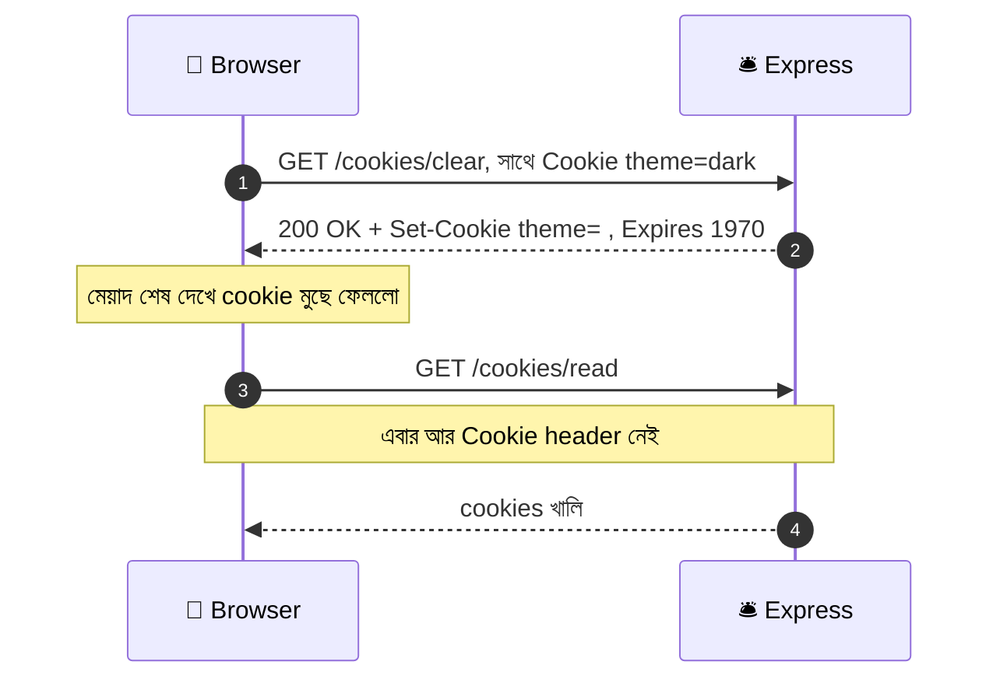

### কোড

```javascript
app.get("/cookies/clear", (req, res) => {
  res.clearCookie("theme", { path: "/" });
  // res.clearCookie(নাম, অপশন) = "theme" cookie মুছে ফেলার নির্দেশ পাঠানো
  // ⚠️ অপশনে path (আর দরকার হলে domain) হুবহু বসানোর সময়ের মতোই দিতে হবে (নিচে কারণ দেখুন)

  res.json({ message: "theme cookie মুছে ফেলা হয়েছে" });
});
```

### 🎯 সবচেয়ে বড় ফাঁদ — বসানো আর মোছার অপশন মিলতে হবে

ব্রাউজার একটা cookie চেনে তার **নাম + domain + path** দিয়ে। এই তিনটে না মিললে ব্রাউজার ভাবে *"এটা তো আমার কার্ডের কথা নয়, অন্য কার্ডের কথা"* আর কিছুই মোছে না।

```javascript
// বসানোর সময়
res.cookie("token", "abc", { path: "/admin", httpOnly: true, sameSite: "lax" });

// ❌ ভুল — path মেলেনি (ডিফল্ট "/" গেলো, অথচ cookie আছে "/admin"-এ)
res.clearCookie("token");

// ✅ ঠিক — একই path
res.clearCookie("token", { path: "/admin", httpOnly: true, sameSite: "lax" });
```

**সমাধান:** অপশনগুলো একটা `const` object-এ রেখে দুই জায়গায় **একই object** ব্যবহার করুন (আগের সেকশনে যেটা করেছিলাম):

```javascript
const authCookieOptions = {
  httpOnly: true,
  secure: isProduction,
  sameSite: "lax",
  path: "/",
};
// authCookieOptions = বসানো আর মোছা দুই কাজেই ব্যবহার হবে, তাই আলাদা করে রাখলাম

app.get("/login-demo", (req, res) => {
  res.cookie("authToken", "abc123", { ...authCookieOptions, maxAge: 60 * 60 * 1000 });
  // ...authCookieOptions = spread operator: object-টার সব property এখানে ছড়িয়ে দিলো, সাথে নতুন maxAge জুড়ে দিলাম
  res.send("লগইন হলো");
});

app.get("/logout-demo", (req, res) => {
  res.clearCookie("authToken", authCookieOptions);
  // বসানোর সময়ের একই অপশন (maxAge ছাড়া, কারণ মোছার সময় সেটা লাগে না) দিয়ে মুছলাম
  res.send("লগআউট হলো");
});
```

> **Express 5 নোট:** `res.clearCookie()` এখন অপশনের `maxAge` আর `expires` **উপেক্ষা করে** (নিজে থেকে মেয়াদ ১৯৭০ বসায়), তাই ওগুলো দিলেও সমস্যা নেই, না দিলেও নেই। আর Express 4-এ এগুলো দিলে cookie মুছত না। এই কারণে পুরোনো টিউটোরিয়ালের কোড কখনো কখনো ভিন্ন আচরণ করে।

### একসাথে অনেক Cookie মোছা

```javascript
app.get("/logout-all", (req, res) => {
  ["authToken", "theme", "visits", "cart"].forEach((name) => {
    res.clearCookie(name, { path: "/" });
    // name = প্রতিবার লুপ থেকে আসা একটা cookie-র নাম
  });
  res.send("সব টোকেন কার্ড ফেরত নিলাম");
});
```

### Cookie না মোছার সাধারণ কারণ

| লক্ষণ | কারণ | সমাধান |
|---|---|---|
| `clearCookie` চালালাম, cookie থেকেই গেলো | `path` বা `domain` মেলেনি | বসানোর সময়ের `path`/`domain` হুবহু দিন |
| লোকালে মুছছে, live সার্ভারে মুছছে না | `secure` / `sameSite` / `domain` আলাদা, বা proxy-র পেছনে https চিনতে পারছে না | বসানো আর মোছার অপশন একই রাখুন, আর proxy-র পেছনে থাকলে `app.set("trust proxy", 1)` দিন |
| `document.cookie` দিয়ে `httpOnly` cookie মুছতে চাইলাম | `httpOnly` cookie JS-এর নাগালের বাইরে | শুধু server-ই মুছতে পারে। একটা "logout" route বানান |
| `signed` cookie মুছলো না | নামটা ভুল দিয়েছেন (signed হোক বা না হোক, নাম একই থাকে) | `req.signedCookies` আর `req.cookies` দুই জায়গাতেই নাম মিলিয়ে দেখুন |
| মোছার পর পেজ রিফ্রেশে cookie ফিরে এলো | আপনার অন্য কোনো কোড আবার বসিয়ে দিচ্ছে | কোথায় কোথায় `res.cookie(...)` আছে খুঁজুন |

### নিজে হাতে মেয়াদ শেষ করে মোছা (বিকল্প)

```javascript
res.cookie("theme", "", { path: "/", expires: new Date(0) });
// expires: new Date(0) = ১৯৭০ সালের ১ জানুয়ারি (Unix Epoch)। এটা "অনেক আগের তারিখ", তাই ব্রাউজার মুছে ফেলে
// clearCookie যা করে, এটা হাতে-কলমে সেটাই। সাধারণত clearCookie-ই ব্যবহার করুন
```

### দেখে নেওয়ার উপায়

1. **DevTools (F12) → Application → Cookies → `http://localhost:3000`**: এখানে সব cookie, তাদের `Path`, `HttpOnly`, `SameSite`, `Expires` সব দেখা যায়।
2. **DevTools → Network → request-এ ক্লিক → Headers:** উত্তরের **`Set-Cookie`** লাইন আর পরের request-এর **`Cookie`** লাইন দেখুন। মোছার সময় `Expires=Thu, 01 Jan 1970` দেখা যাবে।

---

## ১২. Working With Request — কাস্টমারের খাম খোলা

### গল্প

এতক্ষণ আমরা ট্রে (`res`) সাজানো শিখলাম। এবার উল্টো দিকে তাকাই — **কাস্টমারের আনা খাম (`req`)**। রিসেপশনিস্ট কাস্টমারের খাম খুলে সবকিছু গুছিয়ে একটা **`req` object**-এ রেখে দেয়। এই object-এ আছে: কাস্টমার **কী** চেয়েছে, **কোথায়** যেতে চেয়েছে, **কোন শর্তে**, **কে** পাঠিয়েছে, **কী কী** সাথে এনেছে।

খামের চারটা পকেট (পরের ফাইলে এগুলো বিস্তারিত আছে):

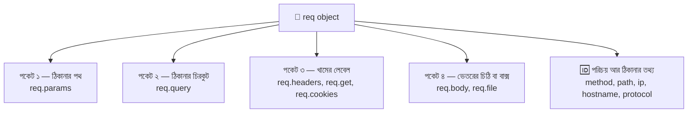

### একটা "সব দেখাও" route — `req` চেনার সবচেয়ে ভালো উপায়

```javascript
app.get("/inspect/:id", (req, res) => {
  res.json({
    method: req.method,
    // req.method = কাস্টমার কী করতে চায়: "GET", "POST" ইত্যাদি (বড় হাতের অক্ষরে)

    originalUrl: req.originalUrl,
    // req.originalUrl = কাস্টমারের লেখা পুরো ঠিকানা (query সহ), Router-এর মধ্যেও অপরিবর্তিত

    path: req.path,
    // req.path = ঠিকানার শুধু পথ অংশ, "?" এর আগ পর্যন্ত

    params: req.params,
    // req.params = পথের ভেতরের :নাম অংশ। /inspect/7 হলে { id: "7" }

    query: req.query,
    // req.query = "?" এর পরের key=value জোড়া। ?lang=bn হলে { lang: "bn" }

    userAgent: req.get("user-agent"),
    // req.get(নাম) = একটা নির্দিষ্ট header-এর মান। user-agent = কোন ব্রাউজার বা টুল থেকে এসেছে

    contentType: req.get("content-type") ?? null,
    // GET request-এ সাধারণত Content-Type থাকে না, তাই undefined আসে। ?? null দিয়ে JSON-এ দেখানোর মতো মান বানালাম

    cookies: req.cookies,
    // req.cookies = আসা cookie (cookie-parser বসানো থাকলে)

    ip: req.ip,
    // req.ip = কাস্টমারের IP ঠিকানা। লোকালে সাধারণত "::1" (IPv6 এর localhost)

    hostname: req.hostname,
    // req.hostname = কোন ডোমেইন নামে এসেছে। এখানে "localhost"

    protocol: req.protocol,
    // req.protocol = "http" নাকি "https"

    secure: req.secure,
    // req.secure = https হলে true

    prefers: req.accepts(["html", "json"]),
    // req.accepts([...]) = কাস্টমারের Accept header দেখে এই তালিকা থেকে যেটা তার বেশি পছন্দ সেটা বলে দেয়। কোনোটাই না মিললে false
  });
});
```

`http://localhost:3000/inspect/7?lang=bn` খুলে উত্তর দেখুন। Postman আর ব্রাউজার আলাদা করে চালিয়ে `userAgent` আর `prefers` কীভাবে বদলায় লক্ষ্য করুন।

### `req`-এর গুরুত্বপূর্ণ property আর মেথড

| Property / মেথড | কী দেয় | উদাহরণ (`GET /inspect/7?lang=bn`) |
|---|---|---|
| `req.method` | HTTP method | `"GET"` |
| `req.originalUrl` | পুরো ঠিকানা (query সহ) | `"/inspect/7?lang=bn"` |
| `req.path` | শুধু পথ | `"/inspect/7"` |
| `req.params` | পথের `:নাম` অংশ | `{ id: "7" }` |
| `req.query` | `?` এর পরের অংশ | `{ lang: "bn" }` |
| `req.headers` | সব header (key ছোট হাতের) | `{ host: "localhost:3000", ... }` |
| `req.get(name)` | একটা header (বড়-ছোট হাত নিয়ে ঝামেলা নেই) | `req.get("Accept-Language")` |
| `req.body` | POST-এর body (parser লাগে) | `{ dish: "কাচ্চি" }` |
| `req.cookies` | আসা cookie (`cookie-parser` লাগে) | `{ theme: "dark" }` |
| `req.signedCookies` | সিলমোহর-করা cookie | `{ customerId: "C-1024" }` |
| `req.ip` | ক্লায়েন্টের IP | `"::1"` |
| `req.hostname` | হোস্ট নাম | `"localhost"` |
| `req.protocol` | `http` / `https` | `"http"` |
| `req.secure` | https কি না | `false` |
| `req.xhr` | `X-Requested-With: XMLHttpRequest` ছিল কি না (পুরোনো AJAX চেনার জন্য) | `false` |
| `req.is("json")` | body-র `Content-Type` মিলছে কি না | `"json"` অথবা `false` |
| `req.accepts(types)` | ক্লায়েন্ট কোন ধরনের উত্তর নিতে চায় | `"html"` |
| `req.route` | যে route মিলেছে তার তথ্য (ডিবাগে কাজে লাগে) | `{ path: "/inspect/:id", ... }` |

### `originalUrl`, `url`, `baseUrl`, `path` — Router-এর ভেতরে চারটা আলাদা

`/menu`-তে Router বসানো থাকলে `GET /menu/3?a=1` request-এর জন্য **Router-এর ভেতরে**:

| Property | মান | মানে |
|---|---|---|
| `req.originalUrl` | `/menu/3?a=1` | কাস্টমার যা লিখেছিল, **পুরোটাই** |
| `req.baseUrl` | `/menu` | Router যে path-এ বসানো আছে |
| `req.url` | `/3?a=1` | baseUrl **বাদ দিয়ে** বাকি অংশ (query সহ) |
| `req.path` | `/3` | `req.url` থেকে query **বাদ দিয়ে** |

> **কোনটা কখন:** লগ লেখা বা redirect-এ পুরো ঠিকানা লাগলে `originalUrl`। Router-এর ভেতরে নিজের অংশের পথ লাগলে `path`।

### Body পড়ার প্রাথমিক ধারণা

```javascript
app.use(express.json());
// express.json() = আসা body যদি JSON হয় (Content-Type: application/json), সেটাকে ভেঙে req.body বানিয়ে দেয়।
// ⚠️ route-গুলোর আগে বসাতে হবে। না বসালে Express 5-এ req.body হবে undefined

app.use(express.urlencoded({ extended: true }));
// urlencoded = সাধারণ HTML <form> (name=Rafsun&age=25 ধরনের) পড়ার জন্য

app.post("/orders", (req, res) => {
  const { dish, quantity } = req.body ?? {};
  // req.body ?? {} = body না এলে undefined-এর বদলে খালি object, যাতে destructuring-এ crash না করে
  // dish = কোন খাবার, quantity = কয়টা

  if (!dish || !Number.isInteger(quantity) || quantity < 1) {
    return res.status(400).json({ error: "dish আর ১ বা তার বেশি পূর্ণসংখ্যার quantity লাগবে।" });
    // Number.isInteger(quantity) = quantity কি পূর্ণসংখ্যা? JSON-এ সংখ্যা সংখ্যা হিসেবেই আসে, "2" (String) নয়
  }

  res.status(201).json({ message: "অর্ডার জমা হয়েছে", order: { dish, quantity } });
});
```

Frontend থেকে পাঠানো:

```javascript
const response = await fetch("/orders", {
  method: "POST",
  // POST না দিলে fetch ডিফল্টে GET পাঠায়
  headers: { "Content-Type": "application/json" },
  // Content-Type = "ভেতরে JSON আছে", এটা না দিলে express.json() body পড়বে না
  body: JSON.stringify({ dish: "কাচ্চি বিরিয়ানি", quantity: 2 }),
  // body = JS object-কে JSON String করে পাঠাতে হয়
});
```

### Proxy-র পেছনে থাকলে — `trust proxy`

Render, Railway, Nginx বা Cloudflare-এর মতো সেবার পেছনে আপনার Express চললে, আসল কাস্টমার প্রথমে **তাদের** কাছে আসে, তারা আপনার কাছে request ঠেলে দেয়। ফলে Express দেখে "আমার কাছে তো http-তে proxy-ই এসেছে" — `req.ip` হয় proxy-র IP, `req.protocol` হয় `http`, `req.secure` হয় `false`। এতে **`secure: true` cookie বসানোও ব্যর্থ** হতে পারে।

```javascript
app.set("trust proxy", 1);
// trust proxy = "আমার সামনে ১ স্তরের proxy আছে, তার পাঠানো X-Forwarded-For আর X-Forwarded-Proto header বিশ্বাস করো"
// এর পর req.ip, req.protocol, req.secure ঠিক ঠিক আসল কাস্টমারের তথ্য দেখাবে
// ⚠️ সরাসরি ইন্টারনেটে খোলা server-এ এটা চালু করবেন না, নাহলে কেউ header জাল করে IP বদলে ফেলতে পারে
```

### 📎 বাকিটা কোথায় শিখবেন

| বিষয় | কোন ফাইলে |
|---|---|
| Request-এর চার পকেট বিস্তারিত | `multer-file-upload-request-handling-in-express-js.md` — সেকশন ১ |
| URL Query, pagination, একাধিক মান | ওই ফাইলের সেকশন ৪ |
| Request Header পড়া, `Authorization` | ওই ফাইলের সেকশন ৫ |
| Middleware (`req, res, next`) | ওই ফাইলের সেকশন ৬ |
| POST: query, header, JSON, multipart | ওই ফাইলের সেকশন ৭-১১ |
| **Multer দিয়ে File Upload** | ওই ফাইলের সেকশন ১২ |
| GET বনাম POST | ওই ফাইলের সেকশন ১৩-১৪ |

---

## ১৩. সব একসাথে — পুরো Flow, সাধারণ ভুল আর সমাধান

### `server.js` ফাইলের সঠিক সাজানো ক্রম

এতক্ষণ আলাদা আলাদা টুকরো শিখেছেন। সব এক ফাইলে জোড়া লাগালে **ক্রমটা** এমন হবে (ক্রম ভুল হলেই সবচেয়ে বেশি ঝামেলা হয়):

```javascript
// 1. require গুলো ................... express, path, cookie-parser, data/menu, routes/menu
// 2. app, PORT, COOKIE_SECRET ........ isProduction, ONE_WEEK, cookie অপশনের const object-গুলো
// 3. সেটিং .......................... app.disable("x-powered-by"), app.set("trust proxy", 1) (proxy-র পেছনে হলে)
// 4. Application Middleware ......... header বসানো → cookieParser → express.json() → express.urlencoded()
// 5. Router জোড়া ................... app.use("/menu", menuRouter)
// 6. Route গুলো ..................... নির্দিষ্ট আগে (/download/menu, /download/menu.csv), :param-ওয়ালা পরে (/download/:name)
// 7. ৪০৪ handler .................... app.use((req, res) => ...)  ← সবার শেষে
// 8. app.listen(...)
```

> ⚠️ **একই path দুইবার লিখবেন না।** সেকশন ২-এ `app.get("/menu/:id")` শেখার জন্য দেখিয়েছিলাম, কিন্তু চূড়ান্ত `server.js`-এ মেনুর সব route শুধু `routes/menu.js`-এ থাকবে। নাহলে যে আগে লেখা, সে-ই জিতবে আর অন্যটা কখনো চলবেই না।

### একটা request-এর পুরো যাত্রা

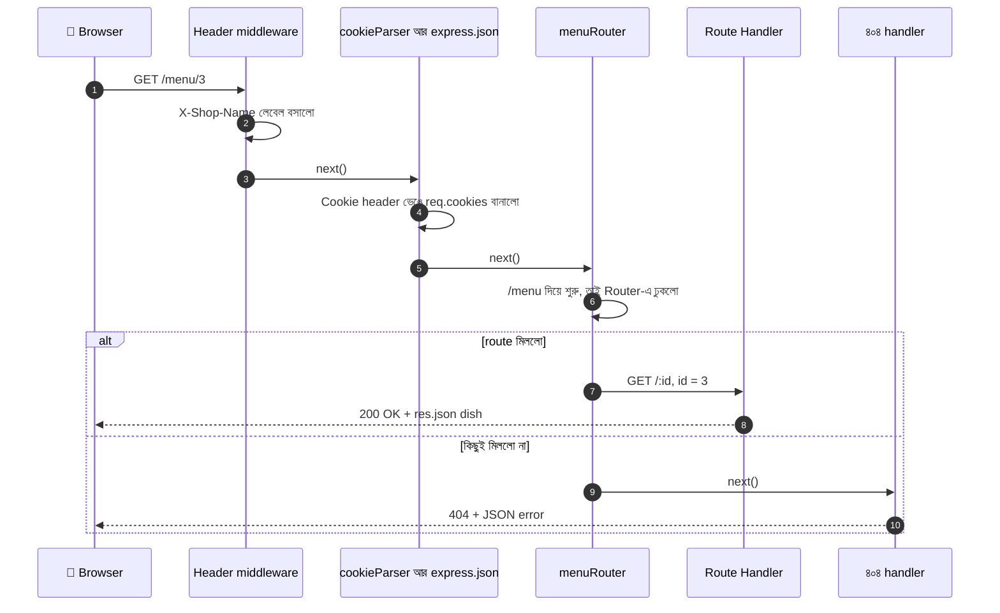

### টেস্ট করার চিটশিট

সব কোড বসানোর পর এই তালিকা ধরে একটা একটা করে চালিয়ে দেখুন:

| ঠিকানা | কী হওয়া উচিত |
|---|---|
| `/` | ✅ 200, লেখা |
| `/hello`, `/html`, `/plain` | ✅ 200, তিনটা আলাদা `Content-Type` (DevTools-এ দেখুন) |
| `/menu` | ✅ 200, JSON (Router থেকে) |
| `/menu/3` | ✅ 200, ফিরনি |
| `/menu/999` | ❌ 404, `{ error: ... }` |
| `/menu/abc` | ❌ 404 (`Number("abc")` = `NaN`, কিছুই মেলে না) |
| `/old-menu` | ↪️ 301, তারপর `/menu`-তে পৌঁছানো |
| `/download/menu` | 💾 ডাউনলোড শুরু, নাম `restaurant-menu.txt` |
| `/download/menu.csv` | 💾 CSV ডাউনলোড |
| `/download/..%2F.env` | ❌ 404 (path traversal আটকে গেছে) |
| `/theme/dark` | 🍪 `Set-Cookie: theme=dark` (Network ট্যাবে দেখুন) |
| `/cookies/read` | 📖 `{ cookies: { theme: "dark" }, ... }` |
| `/cookies/clear` | 🗑️ `Set-Cookie: theme=; ... 1970`, পরে `/cookies/read` খালি |
| `/inspect/7?lang=bn` | 🔍 `params.id = "7"`, `query.lang = "bn"` |
| `/kichu-nai` | ❌ 404, আপনার নিজের বানানো বার্তা |

### সাধারণ ভুল ও সমাধান

| লক্ষণ | সম্ভাব্য কারণ | সমাধান |
|---|---|---|
| `Cannot GET /xyz` | path বা method মেলেনি | ঠিকানার বানান আর method দেখুন। Address Bar সবসময় GET পাঠায় |
| Browser শুধু ঘুরতেই থাকে | handler-এ `res.send/json` নেই, বা শুধু `res.status(404)` লিখে থেমেছেন, বা middleware-এ `next()` ভুলেছেন | প্রতিটা পথে হয় `next()` নয় `res.xxx()` (পাঠানোর মেথড) নিশ্চিন্ত করুন |
| `Cannot set headers after they are sent to the client` (`ERR_HTTP_HEADERS_SENT`) | একই request-এ দুইবার উত্তর, বা উত্তরের পরে `res.set/cookie` | `if`-এর ভেতরে `return res...` লিখুন, header আগে আর `send` শেষে |
| `/menu/special` চালালে `special`-কে id ভেবে ধরে ফেলছে | `:id` route আগে, নির্দিষ্ট route পরে | নির্দিষ্ট route আগে বসান |
| `req.cookies` হলো `undefined` | `cookieParser()` বসানো হয়নি, বা route-এর **পরে** বসেছে | route-এর **আগে** `app.use(cookieParser(...))` |
| `req.body` হলো `undefined` | `express.json()` নেই, route-এর পরে বসেছে, বা `Content-Type` ভুল | route-এর আগে বসান, client-এ `Content-Type: application/json` দিন |
| `TypeError: path must be absolute or specify root to res.sendFile` | `sendFile`-এ relative path দিয়েছেন | `path.join(__dirname, ...)` ব্যবহার করুন |
| `TypeError: Missing parameter name at ...` (Express 5) | wildcard-এ নাম দেননি, যেমন `"/files/*"` | `"/files/*filePath"` লিখুন |
| `ERR_INVALID_CHAR` (header) | header-এর মানে বাংলা বা special অক্ষর | `encodeURIComponent()` দিয়ে এনকোড করুন |
| `res.clearCookie` চালালাম, cookie যায়নি | বসানো আর মোছার `path`/`domain` আলাদা | একটা shared অপশন-object দুই জায়গায় ব্যবহার করুন |
| `secure: true` cookie লাইভ সার্ভারে বসছে না | proxy-র পেছনে Express ভাবছে সংযোগ `http` | `app.set("trust proxy", 1)` |
| `ERR_TOO_MANY_REDIRECTS` | `/a` → `/b` → `/a` এভাবে ঘুরপাক খাচ্ছে | redirect-এর গন্তব্য আর নিজের route মিলিয়ে দেখুন |
| `fetch`-এ cookie যাচ্ছে না | frontend আলাদা origin-এ, `credentials: "include"` নেই, বা CORS-এ credentials চালু নেই | client-এ `credentials: "include"`, server-এ CORS `credentials: true` + নির্দিষ্ট origin |
| params দিয়ে যোগ করলে `"1" + 2 = "12"` | `req.params` আর `req.query`-র মান সবসময় String | `Number(...)` দিয়ে রূপান্তর করুন |
| `EADDRINUSE` | পোর্ট আগে থেকেই ব্যবহৃত | পুরোনো server বন্ধ করুন বা অন্য `PORT` দিন |

---

## ১৪. সারসংক্ষেপ ও Practice আইডিয়া

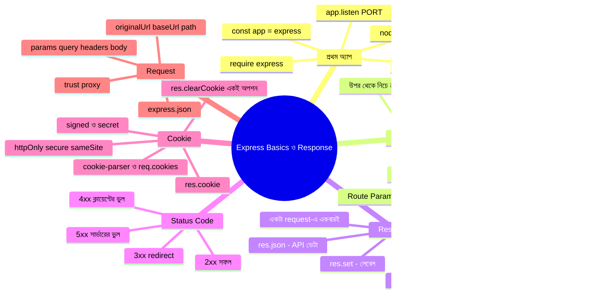

### গল্পের অভিধান — গল্পের কোনটা মানে কী

| গল্পে | টেকনিক্যাল নাম |
|---|---|
| রেস্টুরেন্টের শেফ | Node.js |
| দরজায় বসা রিসেপশনিস্ট / রিসেপশন ডেস্ক | Express (`app`) |
| দরজার নম্বর | Port |
| কাস্টমারের আনা খাম | `req` (Request) |
| ফেরত পাঠানোর ট্রে | `res` (Response) |
| ঠিকানা-খাতা | Routing |
| খাতার একটা লাইন | একটা Route (`app.get(...)`) |
| ঠিকানার ভেতরের টেবিল নম্বর | Route Param (`:id`, `req.params`) |
| আলাদা বিভাগের আলাদা ছোট খাতা | `express.Router()` |
| "যাও, পরের জনের কাছে" | `next()` |
| চিরকুটে লিখে উত্তর | `res.send()` |
| গোছানো ছাপানো ফর্ম | `res.json()` |
| ট্রের গায়ে রঙিন স্টিকার | Status Code (`res.status()`) |
| ডাইন-ইন (সামনে খুলে দেখানো) | `res.sendFile()` |
| টেক-অ্যাওয়ে প্যাকেট | `res.download()` |
| প্যাকেটের গায়ে স্টিকার লাগানো | `res.attachment()` |
| "ওই কাউন্টারে যান" চিরকুট | `res.redirect()` |
| ফেরত ট্রের লেবেল | Response Header (`res.set()`) |
| টোকেন কার্ড | Cookie |
| কার্ড শুধু রিসেপশনিস্টই দেখবে | `httpOnly: true` |
| কার্ড শুধু বুলেটপ্রুফ গাড়িতে | `secure: true` (https) |
| কার্ডে রিসেপশনের সিল | Signed Cookie |
| কার্ডের মেয়াদ ১৯৭০ সালে শেষ | `res.clearCookie()` |
| রিসেপশনিস্ট যেখানে proxy-র পেছনে বসে | `trust proxy` |

### Practice-এর জন্য আইডিয়া

1. **পুরোটা নিজে হাতে টাইপ করে চালানো** — কপি-পেস্ট নয়, টাইপ করলে মাথায় থাকে। প্রতিটা সেকশনের route আলাদাভাবে ব্রাউজার আর Postman-এ টেস্ট করুন।
2. **ক্রমের খেলা:** `/menu/special` আর `/menu/:id` দুটো route উল্টো ক্রমে লিখে দেখুন কী হয়। তারপর ঠিক ক্রমে সাজান।
3. **`res.send()` বনাম `res.json()`:** একই object দুইভাবে পাঠিয়ে DevTools-এর Network ট্যাবে `Content-Type` তুলনা করুন।
4. **নিজের status code:** `/menu/:id`-তে `abc` দিলে `400`, নেই এমন সংখ্যা দিলে `404` — আলাদা বার্তা সহ বানান।
5. **`toJSON()`** ব্যবহার করে কোনো object থেকে একটা গোপন property লুকিয়ে ফেলুন।
6. **Path Traversal নিজে পরীক্ষা:** `/download/:name` route-টা `path.basename` আর `root` ছাড়া লিখে `..%2F` দিয়ে টেস্ট করে দেখুন কী ঘটে, তারপর সুরক্ষা জুড়ে ঠিক করুন। (শুধু আপনার নিজের কম্পিউটারে!)
7. **Redirect-এর তিন রূপ:** `301`, `302`, `303` দিয়ে তিনটে route বানিয়ে DevTools-এ (Preserve log চালু করে) দুইটা request আলাদা করে দেখুন।
8. **Open Redirect আটকানো:** `/login-done?next=https://example.com` দিয়ে টেস্ট করে দেখুন আপনার যাচাই কাজ করছে কি না।
9. **Cookie নিয়ে খেলুন:** `/visit` route-এ আসা সংখ্যা গুনুন; DevTools থেকে cookie-র মান নিজে হাতে বদলে দেখুন কী হয়। তারপর একই কাজ signed cookie দিয়ে করে দেখুন — মান বদলালে কী হয়?
10. **Clear Cookie-র ফাঁদ:** `path: "/admin"` দিয়ে cookie বসিয়ে `res.clearCookie("token")` (path ছাড়া) চালান; না মোছার কারণটা নিজের চোখে দেখুন, তারপর ঠিক করুন।
11. **`/inspect` route-এ নিজের কিছু header পাঠান** (Postman-এ `x-table-number: 7`) আর `req.get("x-table-number")` দিয়ে সেটা উত্তরে ফেরত আনুন।
12. **Router ভাগ করুন:** `routes/orders.js` নামে আরেকটা Router বানিয়ে `app.use("/orders", ordersRouter)` দিয়ে জুড়ুন।
13. **এরপর:** পরের ফাইল ([`multer-file-upload-request-handling-in-express-js.md`](./multer-file-upload-request-handling-in-express-js.md)) পড়ে Query, Header, Middleware, POST আর Multer দিয়ে ফাইল আপলোড শিখুন।

---
