# 🛎️ রিসেপশন ডেস্কের গল্প: Express.js-এ Request Handling আর Multer দিয়ে File Upload

> এবার রেস্টুরেন্ট বড় হয়েছে। তাই দরজায় বসানো হলো একটা **রিসেপশন ডেস্ক — Express.js**, যে কাস্টমারের আনা সবকিছু গুছিয়ে শেফের হাতে তুলে দেয়।
> আজকের গল্পের মূল প্রশ্ন: **কাস্টমার কীভাবে কিছু চাইবে (GET), কীভাবে কিছু জমা দেবে (POST), সাথে কী কী তথ্য (query, header, body, ফাইল) আনবে — আর Express সেগুলো কীভাবে পড়বে?**

---

## 📚 সূচিপত্র (Table of Contents)

1. [ভূমিকা: রিসেপশন ডেস্কের গল্প](#ভূমিকা-রিসেপশন-ডেস্কের-গল্প)
2. [Request-এর চার পকেট — তথ্য কোথায় থাকে](#১-request-এর-চার-পকেট--তথ্য-কোথায়-থাকে)
3. [প্রজেক্ট সেটআপ](#২-প্রজেক্ট-সেটআপ)
4. [Simple GET Request — মেনু কার্ড দেখা](#৩-simple-get-request--মেনু-কার্ড-দেখা)
5. [Get Request With URL Query — ফিল্টার চিরকুট](#৪-get-request-with-url-query--ফিল্টার-চিরকুট)
6. [Working With Get Request Header — খামের লেবেল](#৫-working-with-get-request-header--খামের-লেবেল)
7. [Middleware — চেকপোস্টের সারি](#৬-middleware--চেকপোস্টের-সারি)
8. [Simple Post Request — অর্ডার জমা দেওয়া](#৭-simple-post-request--অর্ডার-জমা-দেওয়া)
9. [Post Request With URL Query — চিরকুট সহ অর্ডার](#৮-post-request-with-url-query--চিরকুট-সহ-অর্ডার)
10. [Post Request With Header Properties — লেবেল সহ অর্ডার](#৯-post-request-with-header-properties--লেবেল-সহ-অর্ডার)
11. [Post application-json — গোছানো অর্ডার ফর্ম](#১০-post-application-json--গোছানো-অর্ডার-ফর্ম)
12. [Working With Multipart Form Data — পার্সেল বাক্স](#১১-working-with-multipart-form-data--পার্সেল-বাক্স)
13. [File Upload — Multer গুদাম কর্মী](#১২-file-upload--multer-গুদাম-কর্মী)
14. [Comparison between GET and POST — পোস্টকার্ড বনাম সিল করা খাম](#১৩-comparison-between-get-and-post--পোস্টকার্ড-বনাম-সিল-করা-খাম)
15. [When to use GET and when to use POST — কখন কোনটা](#১৪-when-to-use-get-and-when-to-use-post--কখন-কোনটা)
16. [সব একসাথে — পুরো Flow, সাধারণ ভুল আর সমাধান](#১৫-সব-একসাথে--পুরো-flow-সাধারণ-ভুল-আর-সমাধান)
17. [সারসংক্ষেপ ও Practice আইডিয়া](#১৬-সারসংক্ষেপ-ও-practice-আইডিয়া)


---

## ভূমিকা: রিসেপশন ডেস্কের গল্প

কল্পনা করুন, আপনার রেস্টুরেন্টে আজ প্রচণ্ড ভিড়। আগে শেফ একাই সব সামলাতেন। এখন দরজার পাশে বসেছে **রিসেপশন ডেস্ক (Express)**। কাস্টমার এসে মূলত দুই ধরনের কাজ নিয়ে আসে:

- **"মেনুটা একটু দেখান"** → শুধু জানতে চাওয়া। কিছু বদলাচ্ছে না → এটা **GET**
- **"এই নিন আমার অর্ডার" / "এই ছবিটা মেনুতে যোগ করুন"** → কিছু জমা দিচ্ছে। রান্নাঘরের খাতা বদলাবে → এটা **POST**

আর প্রতিটা কাজের সাথে কাস্টমার কিছু **তথ্যও** আনে। কোনোটা ঠিকানার শেষে চিরকুটে লেখা, কোনোটা খামের গায়ে লেবেলে, কোনোটা খামের ভেতরের চিঠিতে, আর কোনোটা আস্ত একটা পার্সেল বাক্সে (যেমন ছবি)। রিসেপশনিস্টকে জানতে হবে **কোন তথ্য কোথা থেকে তুলতে হয়** — এই পুরো ফাইলটা আসলে সেই শেখার গল্প।

আর ডেস্ক আর রান্নাঘরের মাঝখানে থাকবে কয়েকটা **চেকপোস্ট (Middleware)** — যারা কাস্টমারকে যাচাই করে, খাতায় নাম লেখে, পার্সেল খোলে।

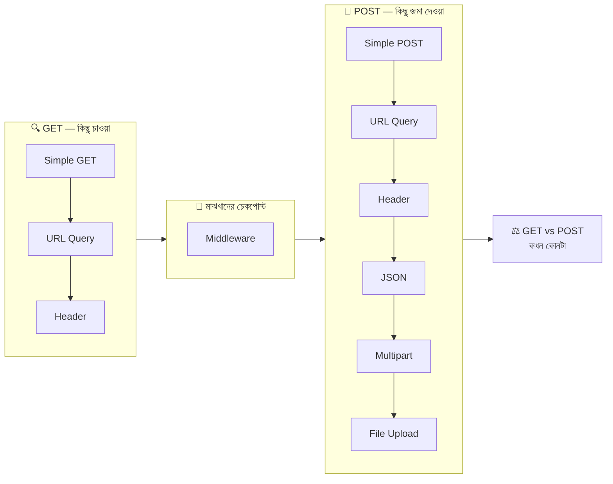

---

## ১. Request-এর চার পকেট — তথ্য কোথায় থাকে

একটা HTTP Request মানে একটা **খাম**। এই খামে চারটা জায়গায় তথ্য থাকতে পারে। এই চারটা পকেট মাথায় গেঁথে নিলে বাকি পুরো ফাইল সহজ হয়ে যাবে।

| পকেট | রেস্টুরেন্টের ভাষায় | উদাহরণ | Express-এ পড়ার উপায় |
|---|---|---|---|
| ১. URL-এর পথ | ঠিকানার ভেতরে টেবিল নম্বর | `/menu/3` | `req.params` |
| ২. URL Query | ঠিকানার শেষে জুড়ে দেওয়া চিরকুট | `?category=main&maxPrice=200` | `req.query` |
| ৩. Header | খামের গায়ে লাগানো লেবেল | `Authorization`, `Content-Type` | `req.get("...")` বা `req.headers` |
| ৪. Body | খামের ভেতরের চিঠি বা পার্সেল | JSON, ফর্ম ডেটা, ছবি | `req.body`, `req.file`, `req.files` |

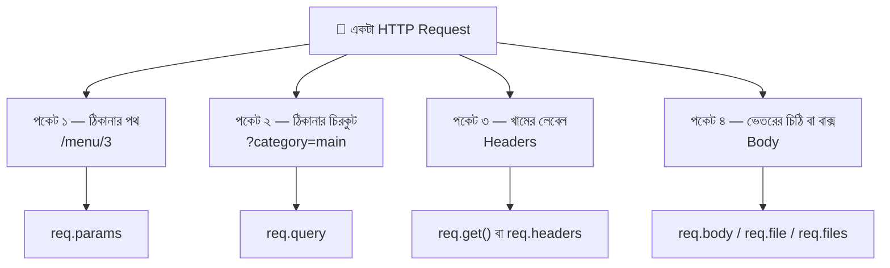

একটা পুরো URL-এর কোন অংশের কী নাম:

```
http://localhost:3000/menu/3?category=main&vegetarian=true
```

| অংশ | উদাহরণ | মানে |
|---|---|---|
| Protocol | `http://` | কোন নিয়মে কথা হবে (নিরাপদটা `https://`) |
| Host | `localhost` | কোন কম্পিউটার (রেস্টুরেন্টের ঠিকানা) |
| Port | `:3000` | ওই কম্পিউটারের কোন দরজা |
| Path | `/menu/3` | রেস্টুরেন্টের ভেতরে কোন জায়গা |
| Query String | `?category=main&vegetarian=true` | `?` দিয়ে শুরু, `key=value` জোড়া, জোড়াগুলো `&` দিয়ে আলাদা |

> **মনে রাখার এক লাইন:** *Params = কোন জিনিস, Query = কীভাবে/কোন শর্তে, Header = কে আর কী ধরনের, Body = আসল মাল।*

---

## ২. প্রজেক্ট সেটআপ

আমরা বানাবো একটা ছোট্ট "রেস্টুরেন্ট রিসেপশন সার্ভার" — যেখানে মেনু দেখা যায়, ফিল্টার করা যায়, অর্ডার দেওয়া যায় আর মেনুতে ছবি সহ নতুন আইটেম যোগ করা যায়।

### ফোল্ডার স্ট্রাকচার

```
📦 express-request-demo/
 ┣ 📂 public/               ← Browser যা যা দেখবে (Frontend)
 ┃ ┣ 📜 upload.html
 ┃ ┗ 📜 upload.js
 ┣ 📂 uploads/              ← আপলোড হওয়া ছবি এখানে জমবে (নিজে তৈরি হবে)
 ┣ 📜 server.js             ← Express Server
 ┣ 📜 .gitignore
 ┗ 📜 package.json
```

### টার্মিনালে কমান্ড

```bash
mkdir express-request-demo && cd express-request-demo   # প্রজেক্ট ফোল্ডার বানিয়ে ভেতরে ঢোকা
npm init -y                                              # package.json বানানো (-y = সব প্রশ্নের ডিফল্ট উত্তর)
npm install express multer                               # express = রিসেপশন ডেস্ক, multer = পার্সেল খোলার গুদাম কর্মী
mkdir public                                             # frontend ফাইলগুলো রাখার ফোল্ডার
```

`package.json`-এ scripts অংশে:

```json
{
  "scripts": {
    "start": "node server.js",
    "dev": "node --watch server.js"
  }
}
```

> `node --watch` = ফাইল সেভ করলেই server নিজে থেকে restart হবে (Node 18+ এ বিল্ট-ইন)।

**`.gitignore`**

```bash
node_modules/     # ইনস্টল করা প্যাকেজ — npm install দিলেই ফিরে আসে
.env              # গোপন চাবি (আগের ফাইলে শেখা)
uploads/          # ব্যবহারকারীদের আপলোড করা ফাইল GitHub-এ রাখার দরকার নেই
```

### Express 4 আর Express 5 — এই ফাইলে কাজে লাগবে এমন পার্থক্য

এখন `npm install express` দিলে **Express 5** আসে। পুরোনো টিউটোরিয়ালে Express 4-এর কোড দেখলে এই চারটা পার্থক্য মাথায় রাখবেন:

| বিষয় | Express 4 | Express 5 |
|---|---|---|
| Body parse না হলে `req.body` | `{}` (parser বসানো থাকলে) | `undefined` |
| `async` handler-এ error | নিজে `try/catch` বা `next(err)` করতে হতো | নিজে থেকেই error handler-এ চলে যায় |
| Query string parser (ডিফল্ট) | `extended` (`?a[b]=1` → nested object) | `simple` (nested হয় না) |
| `express.urlencoded()`-এর `extended` ডিফল্ট | `true` | `false` |

### `server.js`-এর ভিত্তি (এখানেই সব route যোগ হবে)

```javascript
// server.js — রেস্টুরেন্টের রিসেপশন ডেস্ক (Express)

const express = require("express");
// express = http module-এর উপরে বসানো সহজ লেয়ার। routing, middleware, body পড়া — সব অনেক কম কোডে হয়

const path = require("path");
// path = ফোল্ডার/ফাইলের ঠিকানা এমনভাবে বানায় যা Windows, Mac, Linux সবখানে ঠিক কাজ করে

const app = express();
// app = আমাদের পুরো Express অ্যাপ্লিকেশন। সব middleware আর route এর উপরেই বসবে

const PORT = 3000;
// PORT = server কোন দরজায় বসে অপেক্ষা করবে (বাস্তবে এটা .env থেকে আসে)

// ---------- নকল ডেটাবেস ----------

const menu = [
  { id: 1, name: "কাচ্চি বিরিয়ানি", category: "main", price: 350, vegetarian: false, likes: 0 },
  { id: 2, name: "সবজি খিচুড়ি", category: "main", price: 180, vegetarian: true, likes: 0 },
  { id: 3, name: "ফিরনি", category: "dessert", price: 90, vegetarian: true, likes: 0 },
  { id: 4, name: "মিষ্টি লাচ্ছি", category: "drink", price: 70, vegetarian: true, likes: 0 },
];
// menu = মেনুর তালিকা। আসল DB না লাগিয়ে শুধু একটা array দিয়ে কাজ চালাচ্ছি
// ⚠️ এটা RAM-এ থাকে, তাই server restart দিলে নতুন যোগ করা সব আইটেম উধাও হবে

const orders = [];
// orders = জমা পড়া অর্ডারগুলো রাখার জায়গা, শুরুতে খালি

// ---------- Application Middleware এখানে বসবে (৬, ১০ নম্বর সেকশন) ----------

app.use(express.static(path.join(__dirname, "public")));
// public ফোল্ডারের ফাইল (upload.html, upload.js) সরাসরি Browser-কে দিয়ে দেবে।
// __dirname = এই server.js যে ফোল্ডারে আছে তার পূর্ণ ঠিকানা

// ---------- Route গুলো এখানে এক এক করে বসবে ----------

// ---------- ৪০৪ আর Error Handler সবার শেষে বসবে (৬, ১২ নম্বর সেকশন) ----------

app.listen(PORT, () => {
  console.log(`✅ রিসেপশন খুলেছে → http://localhost:${PORT}`);
});
```

### টেস্ট করার চারটা উপায়

| উপায় | কখন কাজে লাগে | সীমাবদ্ধতা |
|---|---|---|
| Browser-এর Address Bar | সহজ GET দেখতে | **শুধু GET পাঠাতে পারে**, POST পারে না |
| Browser DevTools → Console-এ `fetch()` | GET, POST সব, header সহ | `localhost:3000` পেজ খোলা থাকতে হবে |
| **Postman** বা VS Code-এর **Thunder Client** | সবকিছু — সবচেয়ে সহজ | ইনস্টল করতে হয় |
| `curl` (টার্মিনাল) | দ্রুত টেস্ট | Windows-এ ঝামেলা আছে (নিচে দেখুন) |

> ⚠️ **Windows ব্যবহারকারীদের জন্য:** PowerShell-এ `curl` আসলে `Invoke-WebRequest`-এর alias, তাই `curl.exe` লিখতে হয়। আর CMD/PowerShell-এ JSON-এর ভেতরের `"` এস্কেপ করা ঝামেলার। তাই JSON আর ফাইলের টেস্টে Postman/Thunder Client অথবা DevTools Console-ই সবচেয়ে সহজ।

---

## ৩. Simple GET Request — মেনু কার্ড দেখা

### গল্প

কাস্টমার রিসেপশনে এসে বললো, **"মেনুটা দেখতে পারি?"** রিসেপশনিস্ট মেনু কার্ডটা এগিয়ে দিলো। কার্ড দেখে কাস্টমার চলে গেলেও রেস্টুরেন্টের কিছু বদলালো না — কোনো খাবার কমলো না, কোনো খাতা পাল্টালো না। এটাই **GET**: শুধু **চাওয়া**, কিছু **বদলানো নয়**।

> ব্রাউজারের Address Bar-এ কোনো লিংক লিখে Enter চাপলে, বা কোনো লিংকে ক্লিক করলে — সবসময় **GET request** যায়।

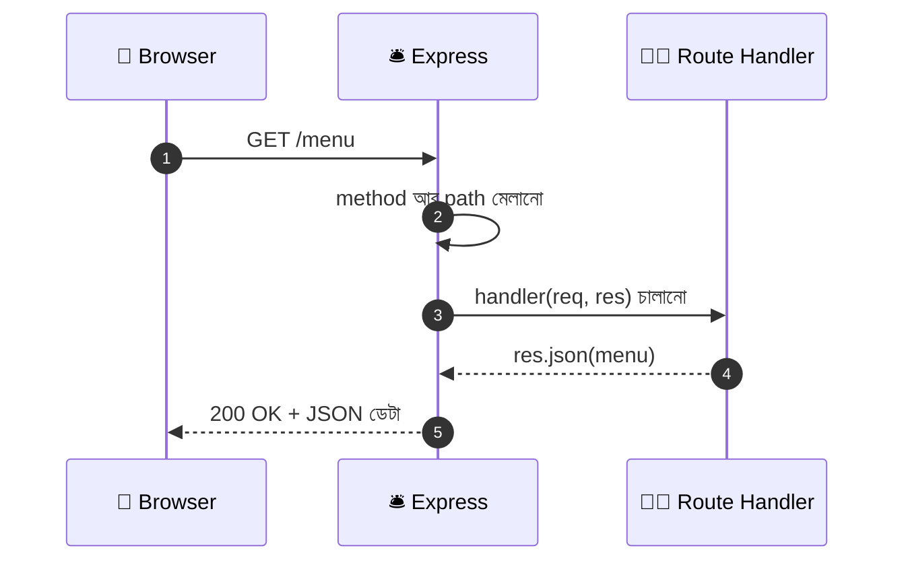

### কোড

```javascript
app.get("/", (req, res) => {
  // app.get(path, handler) = "কেউ যদি GET method-এ এই path-এ আসে, তাহলে এই ফাংশনটা চালাও"
  // req = কাস্টমারের আনা খাম (তার পাঠানো সব তথ্য এতে থাকে)
  // res = ফেরত পাঠানোর ট্রে (উত্তর এর মাধ্যমেই যায়)
  res.send("স্বাগতম! আমাদের রেস্টুরেন্টে আপনাকে স্বাগতম 🍽️");
  // res.send() = সাধারণ লেখা (বা HTML) পাঠায়
});

app.get("/menu", (req, res) => {
  res.json(menu);
  // res.json() = JS object/array-কে JSON বানিয়ে পাঠায় + Content-Type: application/json হেডার নিজে বসিয়ে দেয়
});
```

`http://localhost:3000/menu` খুললে পুরো মেনু JSON আকারে দেখা যাবে।

### `res`-এর গুরুত্বপূর্ণ মেথডগুলো

| মেথড | কাজ | উদাহরণ |
|---|---|---|
| `res.send()` | লেখা/HTML পাঠায় | `res.send("হ্যালো")` |
| `res.json()` | JSON পাঠায় (API-তে সবচেয়ে বেশি লাগে) | `res.json({ ok: true })` |
| `res.status()` | Status code বসায় (এরপর আরেকটা মেথড জুড়তে হয়) | `res.status(404).json({...})` |
| `res.sendFile()` | একটা ফাইল পাঠায় | `res.sendFile(path.join(__dirname, "public", "upload.html"))` |
| `res.redirect()` | অন্য ঠিকানায় পাঠিয়ে দেয় | `res.redirect("/menu")` |
| `res.set()` | Response header বসায় (৫ নম্বরে দেখবো) | `res.set("X-Served-By", "desk-1")` |

> ⚠️ **একটা request-এ উত্তর একবারই পাঠানো যায়।** দুইবার `res.send()` চালালে `Cannot set headers after they are sent` error আসে।

### URL-এর পথ থেকে তথ্য নেওয়া — Route Params

কাস্টমার যদি শুধু একটা নির্দিষ্ট আইটেম দেখতে চায়, যেমন ৩ নম্বর?

```javascript
app.get("/menu/:id", (req, res) => {
  // :id = "এখানে যেকোনো কিছু বসতে পারে, আমি সেটাকে id নামে ধরে রাখবো" (এটাকে Route Parameter বলে)

  const id = Number(req.params.id);
  // req.params.id = URL-এর ওই অংশটা। /menu/3 হলে "3"
  // ⚠️ এটা সবসময় String আসে। তাই Number() দিয়ে সংখ্যা বানালাম, নাহলে item.id === "3" কখনো মিলবে না

  const dish = menu.find((item) => item.id === id);
  // dish = মেনুতে ওই id-র আইটেম। না পেলে find() দেয় undefined

  if (!dish) {
    return res.status(404).json({ error: "এই আইটেম মেনুতে নেই।" });
    // return লিখেছি যাতে নিচের res.json() আর না চলে
  }

  res.json(dish);
});
```

### শেষে একটা ৪০৪ ধরা (সব route-এর পরে বসবে)

কেউ এমন ঠিকানায় এলো যেটা আমরা বানাইনি? Express ডিফল্টে `Cannot GET /xyz` লেখা একটা কুৎসিত পেজ দেয়। আমরা নিজের মেসেজ দেবো:

```javascript
app.use((req, res) => {
  // কোনো route না মিললে request এখানে এসে পড়ে — তাই এটা অবশ্যই সবার শেষে থাকবে
  // req.method = GET/POST ইত্যাদি, req.originalUrl = পুরো ঠিকানা (query সহ)
  res.status(404).json({ error: `${req.method} ${req.originalUrl} — এই ঠিকানা আমাদের রেস্টুরেন্টে নেই।` });
});
```

---

## ৪. Get Request With URL Query — ফিল্টার চিরকুট

### গল্প

কাস্টমার শুধু "মেনু দিন" বললে রিসেপশনিস্ট পুরো ৫০ পাতার মেনু ধরিয়ে দেয়। কিন্তু কাস্টমার যদি বলে, **"শুধু নিরামিষ, আর ২০০ টাকার নিচে"** — তখন সে ঠিকানার শেষে একটা **চিরকুট** জুড়ে দেয়:

```
/menu ?vegetarian=true & maxPrice=200
       └── চিরকুট শুরু     └── আরেকটা শর্ত
```

চিরকুটটা রিসেপশনিস্টকে বলে না *কোথায়* যেতে হবে — বলে *কীভাবে/কোন শর্তে* খুঁজতে হবে। এটাই **URL Query**।

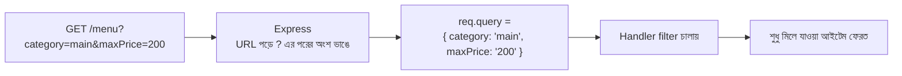

### কোড — আগের `/menu` route-টা এটা দিয়ে বদলান

```javascript
app.get("/menu", (req, res) => {
  const { category, vegetarian, maxPrice } = req.query;
  // req.query = ? এর পরের সব key=value জোড়া, একটা object হিসেবে
  // destructuring দিয়ে তিনটা শর্ত আলাদা ভেরিয়েবলে নিলাম। ⚠️ সবগুলোর মান String, অথবা দেওয়া না হলে undefined

  let result = menu;
  // result = ফিল্টার করতে করতে যে তালিকাটা ছোট হবে। শুরুতে পুরো মেনু

  if (category) {
    result = result.filter((dish) => dish.category === category);
    // category দেওয়া থাকলে শুধু ওই ক্যাটাগরির আইটেম রাখলাম
  }

  if (vegetarian !== undefined) {
    const wantVeg = vegetarian === "true";
    // wantVeg = Boolean মান। query-তে "true" আসে String হিসেবে, তাই তুলনা করে Boolean বানাতে হলো
    result = result.filter((dish) => dish.vegetarian === wantVeg);
  }

  if (maxPrice) {
    const limit = Number(maxPrice);
    // limit = String "200" থেকে সংখ্যা 200

    if (Number.isNaN(limit)) {
      // maxPrice=abc দিলে Number("abc") হয় NaN — এমন ভুল ইনপুট আটকালাম
      return res.status(400).json({ error: "maxPrice অবশ্যই একটা সংখ্যা হতে হবে।" });
    }
    result = result.filter((dish) => dish.price <= limit);
  }

  res.json({ count: result.length, items: result });
});
```

টেস্ট করার ঠিকানা:

```
/menu?category=main
/menu?vegetarian=true
/menu?category=main&vegetarian=true&maxPrice=200
/menu?maxPrice=abc            ← 400 error আসবে
```

### Pagination — এক পাতায় কতগুলো?

বড় তালিকা একবারে না পাঠিয়ে পাতা ভাগ করা হয়। এটা query-র সবচেয়ে জনপ্রিয় ব্যবহার:

```javascript
const page = Number(req.query.page) || 1;
// page = কত নম্বর পাতা। Number("abc") = NaN, আর NaN || 1 = 1 — ভুল বা খালি হলে ডিফল্ট ১ নম্বর পাতা

const limit = Math.min(Number(req.query.limit) || 10, 50);
// limit = এক পাতায় কয়টা। Math.min(..., 50) দিয়ে সর্বোচ্চ ৫০-এ আটকালাম,
// যাতে কেউ limit=1000000 দিয়ে সব ডেটা একবারে টেনে নিতে না পারে

const startIndex = (page - 1) * limit;
// startIndex = কোথা থেকে কাটা শুরু। ২ নম্বর পাতা, limit ১০ হলে (2-1)*10 = ১০

const pageItems = result.slice(startIndex, startIndex + limit);
// pageItems = ওই পাতার আইটেমগুলো (slice শুরু থেকে শেষের আগ পর্যন্ত কাটে)
```

### একই key একাধিকবার দিলে

`/menu?category=main&category=drink` — একই key দুইবার দিলে Express সেটাকে **array** বানায়:

```javascript
const categories = [].concat(req.query.category ?? []);
// req.query.category তখন হয় ["main", "drink"]। একবার দিলে "main" (String), না দিলে undefined
// [].concat(x) = x String হলে ["main"], Array হলে যেমন আছে তেমনই, আর [] হলে খালি array
// এতে সবসময় array পাওয়া যায়, তাই নিচের কোড নিশ্চিন্তে লেখা যায়

if (categories.length > 0) {
  result = result.filter((dish) => categories.includes(dish.category));
}
```

### Frontend থেকে query পাঠানো — `URLSearchParams`

```javascript
const params = new URLSearchParams({ category: "main", vegetarian: "true" });
// params = key-value জোড়াগুলো সুন্দরভাবে query string বানানোর যন্ত্র।
// বাংলা বা স্পেস থাকলে নিজে থেকে % দিয়ে এনকোড করে দেয় (হাতে জোড়া লাগালে এই ঝামেলা পোহাতে হতো)

const response = await fetch(`/menu?${params.toString()}`);
// params.toString() = "category=main&vegetarian=true"
const data = await response.json();
```

### Params নাকি Query — কোনটা কখন?

| | Route Params (`/menu/3`) | URL Query (`/menu?category=main`) |
|---|---|---|
| কীসের জন্য | **কোন জিনিস** (নির্দিষ্ট একটাকে চেনা) | **কীভাবে/কোন শর্তে** (ফিল্টার, সর্ট, পেজ) |
| বাধ্যতামূলক? | হ্যাঁ, না দিলে route-ই মিলবে না | না, ঐচ্ছিক |
| Express-এ | `req.params` | `req.query` |
| উদাহরণ | `/users/15`, `/menu/3` | `?page=2`, `?sort=price`, `?q=বিরিয়ানি` |

> ⚠️ **Express 5 সতর্কতা:** ডিফল্ট query parser এখন `simple`, তাই `?filter[price]=200` দিলে nested object হয় না — `req.query` হয় `{ "filter[price]": "200" }`। সহজ `key=value` ব্যবহার করলে কোনো সমস্যা নেই।

---

## ৫. Working With Get Request Header — খামের লেবেল

### গল্প

প্রতিটা খামের গায়ে কিছু **লেবেল** লাগানো থাকে — চিঠির ভেতরে কী আছে সেটা না খুলেও যেগুলো দেখে বোঝা যায়:

- **কে পাঠিয়েছে?** → `User-Agent` (Chrome, Postman, নাকি মোবাইল অ্যাপ)
- **কোন ভাষায় উত্তর চায়?** → `Accept-Language`
- **কী ধরনের উত্তর চায়?** → `Accept` (JSON, নাকি HTML)
- **সদস্য কার্ড দেখাচ্ছে** → `Authorization`
- **ভেতরে কী আছে?** → `Content-Type`
- **আমাদের নিজেদের বানানো লেবেল** → যেমন `x-table-number: 7`

এই লেবেলগুলোই **HTTP Header**। এগুলো ডেটার *আসল অংশ* নয়, ডেটা সম্পর্কে **অতিরিক্ত তথ্য (metadata)**।

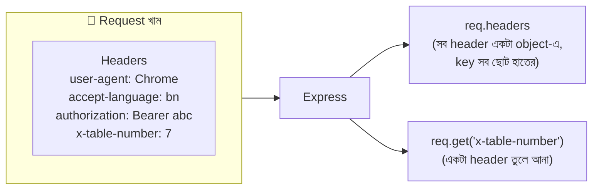

### কোড

```javascript
app.get("/whoami", (req, res) => {
  const userAgent = req.get("user-agent");
  // userAgent = কোন ব্রাউজার/টুল থেকে এসেছে। req.get("নাম") = একটা নির্দিষ্ট header-এর মান
  // req.get() বড়-ছোট হাতের অক্ষরে পার্থক্য করে না, "User-Agent" লিখলেও চলবে

  const language = req.get("accept-language");
  // language = ব্যবহারকারীর ব্রাউজারের পছন্দের ভাষা, যেমন "bn-BD,bn;q=0.9,en;q=0.8"

  const authHeader = req.get("authorization");
  // authHeader = "Bearer abc123" ধরনের পুরো লাইন। না দিলে undefined

  const token = authHeader?.split(" ")[1];
  // token = পুরো লাইন থেকে শুধু abc123 অংশ।
  // ?. (optional chaining) দিয়েছি যাতে authHeader undefined হলে error না দিয়ে token-ও undefined হয়

  const tableNumber = req.get("x-table-number");
  // tableNumber = আমাদের নিজেদের বানানো custom header। x- দিয়ে শুরু করা একটা প্রচলিত রীতি

  res.json({ userAgent, language, hasToken: Boolean(token), tableNumber });
  // Boolean(token) = আসল token ফেরত দিলাম না, শুধু আছে কি নেই সেটা জানালাম (গোপন জিনিস উত্তরে ঘুরিয়ে দেখাতে নেই)
});
```

সব header একসাথে দেখতে চাইলে `console.log(req.headers)` — এটা একটা object, যেখানে **সব key ছোট হাতের অক্ষরে** থাকে (`req.headers["user-agent"]`)।

### Header পাঠানো — Postman ও fetch

```javascript
const response = await fetch("/whoami", {
  headers: {
    "x-table-number": "7",                // আমাদের custom লেবেল
    "Authorization": "Bearer abc123",     // সদস্য কার্ড
  },
});
```

Postman-এ: **Headers ট্যাবে** গিয়ে Key `x-table-number`, Value `7` লিখুন।

### Response-এও header বসানো যায়

রিসেপশনিস্টও ফেরত পাঠানো খামে লেবেল লাগাতে পারে:

```javascript
app.get("/status", (req, res) => {
  res.set("X-Served-By", "reception-desk-1");
  // res.set(নাম, মান) = আমাদের উত্তরের খামে লেবেল লাগানো। ⚠️ মান ASCII অক্ষরে রাখুন, বাংলা লিখলে Node সাধারণত error দেয়

  res.set("Cache-Control", "no-store");
  // Cache-Control = ব্রাউজারকে বলা "এই উত্তর মনে রেখো না, প্রতিবার নতুন করে চাও"

  res.json({ open: true });
});
```

আর Express ডিফল্টে প্রতিটা উত্তরে `X-Powered-By: Express` লেবেল লাগায় — মানে বাইরের সবাইকে জানিয়ে দেয় আমরা কোন টুল ব্যবহার করছি। এটা বন্ধ করা ভালো অভ্যাস:

```javascript
app.disable("x-powered-by");
// app.disable = একটা সেটিং বন্ধ করা। এটা middleware-এর জায়গায় (const app = express() এর ঠিক পরে) বসান
```

### সচরাচর দেখা Header-এর তালিকা

| Header | কে পাঠায় | মানে |
|---|---|---|
| `Content-Type` | Request ও Response | ভেতরের ডেটা কোন ফরম্যাটে (`application/json` ইত্যাদি) |
| `Accept` | Request | ক্লায়েন্ট কোন ফরম্যাটের উত্তর নিতে চায় |
| `Authorization` | Request | পরিচয়ের প্রমাণ (Bearer token, API key) |
| `User-Agent` | Request | ক্লায়েন্টটা কোন ব্রাউজার/টুল |
| `Accept-Language` | Request | পছন্দের ভাষা |
| `Cookie` | Request | ব্রাউজারে জমানো ছোট তথ্য |
| `Content-Length` | দুইদিকেই | Body কত বাইট |
| `Cache-Control` | দুইদিকেই | ক্যাশ করার নিয়ম |

---

## ৬. Middleware — চেকপোস্টের সারি

### গল্প

কাস্টমার রিসেপশন ডেস্ক থেকে রান্নাঘরে পৌঁছানোর আগে পথে **কয়েকটা চেকপোস্ট** পড়ে:

1. **গেটের খাতা** — সবার নাম আর ঢোকার সময় লিখে রাখে (**Logger**)
2. **পার্সেল স্ক্যানার** — খামের ভেতরের চিঠি খুলে পড়ার উপযোগী করে (**`express.json()`**)
3. **VIP ঘরের গার্ড** — শুধু রান্নাঘরের দরজায় দাঁড়িয়ে সদস্য কার্ড চেক করে (**Route-specific গার্ড**)

প্রতিটা চেকপোস্টের সামনে তিনটা সম্ভাবনা:

- সব ঠিক আছে → হাত নেড়ে বলে, **"যাও, পরের জনের কাছে"** → `next()`
- কিছু ভুল → নিজেই কাস্টমারকে ফিরিয়ে দেয় → `res.status(401).json(...)` (এখানেই যাত্রা শেষ)
- বড় সমস্যা → **অভিযোগ ডেস্কে** পাঠিয়ে দেয় → `next(err)`

এই চেকপোস্টগুলোই **Middleware**: এমন ফাংশন যেটা Request আর Response-এর **মাঝখানে** বসে কাজ করে।

### Middleware-এর গঠন

```javascript
const myMiddleware = (req, res, next) => {
  // req  = কাস্টমারের খাম (চাইলে এতে নতুন তথ্যও জুড়ে দেওয়া যায়)
  // res  = ফেরত পাঠানোর ট্রে
  // next = "পরের চেকপোস্টে যাও" বলার ফাংশন। এটা না ডাকলে request সেখানেই আটকে থাকে!
  next();
};
```

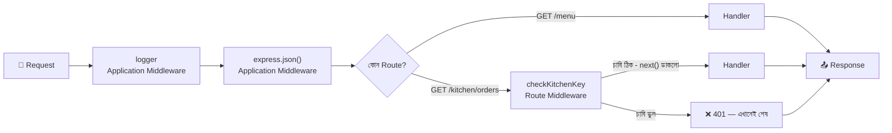

### ক) Application Middleware — পুরো রেস্টুরেন্টের গেটের গার্ড

`app.use(...)` দিয়ে বসানো middleware **প্রায় সব request-এর উপরেই** চলে (কোন path-এ চলবে সেটাও ঠিক করে দেওয়া যায়)।

```javascript
const logger = (req, res, next) => {
  const startTime = Date.now();
  // startTime = request কখন ঢুকলো (মিলিসেকেন্ডে)। পরে বের করবো কাজ শেষ হতে কত সময় লাগলো

  res.on("finish", () => {
    // "finish" Event = উত্তর পুরোটা পাঠানো শেষ হলে এই ঘণ্টা বাজে (মনে আছে events মডিউলের ঘণ্টা সিস্টেম?)
    const duration = Date.now() - startTime;
    // duration = এখনকার সময় থেকে শুরুর সময় বিয়োগ = মোট কত ms লাগলো
    console.log(`${req.method} ${req.originalUrl} → ${res.statusCode} (${duration}ms)`);
    // যেমন: GET /menu?category=main → 200 (3ms)
  });

  next();
  // ⚠️ সবচেয়ে গুরুত্বপূর্ণ লাইন। এটা ছাড়া request এখানেই ঝুলে থাকবে, ব্রাউজারে শুধু ঘুরতেই থাকবে
};

app.use(logger);
// app.use(ফাংশন) = এই middleware সব request-এর জন্য চালু। route গুলোর আগে বসাতে হবে
```

**Path দিয়ে সীমিত করা:**

```javascript
app.use("/kitchen", checkKitchenKey);
// এখন /kitchen দিয়ে শুরু হওয়া সব ঠিকানায় (/kitchen/orders, /kitchen/stock ...) গার্ড থাকবে, বাকিতে না
// ⚠️ checkKitchenKey ফাংশনটা নিচের (খ) অংশে বানানো। কোডে বসানোর সময় ফাংশনটা আগে লিখবেন, তারপর এই লাইন
```

**Built-in ও Third-party Middleware-ও আসলে Application Middleware:**

| Middleware | কাজ | কোথায় পাওয়া যায় |
|---|---|---|
| `express.json()` | JSON body পড়ে `req.body` বানায় | Express-এর ভেতরে |
| `express.urlencoded()` | HTML ফর্মের body পড়ে | Express-এর ভেতরে |
| `express.static()` | ফোল্ডারের ফাইল সরাসরি পরিবেশন | Express-এর ভেতরে |
| `multer` | multipart/ফাইল আপলোড | `npm install multer` |
| `morgan` | তৈরি করা সুন্দর logger | `npm install morgan` |
| `cors` | অন্য origin থেকে আসার অনুমতি (আগের ফাইলের CORS দারোয়ান) | `npm install cors` |
| `helmet` | নিরাপত্তা-সংক্রান্ত header বসায় | `npm install helmet` |
| `express-rate-limit` | মিনিটে কতবার request পাঠানো যাবে তার সীমা | `npm install express-rate-limit` |

### খ) Route Middleware — নির্দিষ্ট ঘরের দরজার গার্ড

যে গার্ড **সব জায়গায় নয়, শুধু একটা নির্দিষ্ট route-এ** দাঁড়ায়। route-এর path আর handler-এর **মাঝখানে** বসানো হয়:

```javascript
const KITCHEN_KEY = "chef-secret-123";
// KITCHEN_KEY = রান্নাঘরে ঢোকার গোপন কোড। ⚠️ শেখার জন্য হার্ডকোড করলাম, বাস্তবে এটা .env-এ থাকবে (আগের ফাইলে শেখা)

const checkKitchenKey = (req, res, next) => {
  const providedKey = req.get("x-kitchen-key");
  // providedKey = কাস্টমার তার খামের লেবেলে যে কোড দিয়েছে (হেডার থেকে পড়লাম, ৫ নম্বর সেকশনের মতো)

  if (providedKey !== KITCHEN_KEY) {
    return res.status(401).json({ error: "রান্নাঘরে ঢোকার অনুমতি নেই।" });
    // return = এখানেই শেষ। নিচের next() আর চলবে না, handler-ও পৌঁছাবে না
  }

  req.staffRole = "kitchen";
  // req-এর গায়ে নিজের একটা নতুন তথ্য জুড়ে দিলাম। এই request যতদূর যাবে, পরের সবাই এটা পড়তে পারবে

  next();
  // চাবি ঠিক আছে, ভেতরে ঢুকতে দাও
};

app.get("/kitchen/orders", checkKitchenKey, (req, res) => {
  // ↑ path এর পরে গার্ড, তারপর আসল handler। গার্ড next() না ডাকলে handler কখনো চলবে না
  res.json({ role: req.staffRole, count: orders.length, orders });
  // req.staffRole = ওপরের গার্ডের বসানো তথ্য
});
```

একাধিক গার্ডও সারি করে বসানো যায়: `app.get("/path", গার্ড১, গার্ড২, handler)` — বাঁ থেকে ডানে একে একে চলবে।

| | Application Middleware | Route Middleware |
|---|---|---|
| বসানো হয় | `app.use(mw)` | `app.get("/path", mw, handler)` |
| কতদূর কাজ করে | সব route (বা নির্দিষ্ট path-prefix) | শুধু ওই একটা route |
| উদাহরণ | logger, `express.json()`, cors | `checkKitchenKey`, `upload.single(...)` |
| গল্পে | রেস্টুরেন্টের প্রধান গেটের গার্ড | VIP ঘরের দরজার গার্ড |

> 🔑 **এই কারণেই Multer route middleware হিসেবে বসে** — ফাইল আপলোড শুধু নির্দিষ্ট route-এ হবে, পুরো সাইটে নয় (১২ নম্বরে দেখবো)।

### ক্রম (Order) সবচেয়ে গুরুত্বপূর্ণ

Express কোড **উপর থেকে নিচে** পড়ে, আর প্রথম যে middleware/route মিলে যায় ও উত্তর পাঠিয়ে দেয়, সেখানেই থেমে যায়।

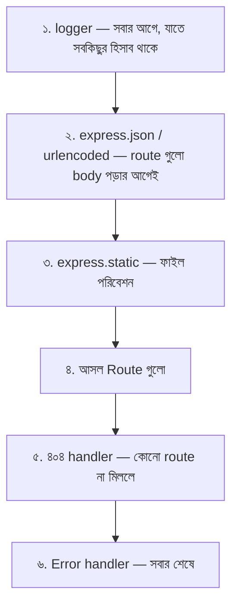

> ⚠️ `express.json()` যদি route-এর **পরে** বসান, ওই route-এ `req.body` কখনো পাবেন না। এটা শিক্ষানবিসদের সবচেয়ে বেশি হওয়া ভুল।

### গ) Error-handling Middleware — অভিযোগ ডেস্ক

`next(err)` ডাকলে বা কোথাও error ছুঁড়লে (`throw`) Express সব সাধারণ middleware ডিঙিয়ে সোজা একটা বিশেষ middleware-এ যায় — যার **চারটা** parameter:

```javascript
app.use((err, req, res, next) => {
  // ⚠️ চারটা parameter থাকতেই হবে (err সহ), নাহলে Express একে error handler বলে চিনবে না — next ব্যবহার না করলেও লিখতে হয়
  // err = কী ভুল হয়েছে তার বিবরণ

  console.error(err.stack);
  // আসল কারণটা শুধু server-এর console-এ, কাস্টমারকে দেখানো হচ্ছে না

  res.status(500).json({ error: "সার্ভারে সমস্যা হয়েছে।" });
  // কাস্টমার পাবে একটা সাধারণ বার্তা, ভেতরের তথ্য ফাঁস হবে না
});
```

> এটাকেই ১২ নম্বর সেকশনে Multer আর JSON error সামলানোর মতো বড় করবো। **Express 5-এ** `async` handler-এর ভেতরে কিছু ভুল হলে নিজে থেকেই এই handler-এ চলে আসে। **Express 4-এ** নিজে `try/catch` করে `next(err)` ডাকতে হতো।

---

## ৭. Simple Post Request — অর্ডার জমা দেওয়া

### গল্প

এবার কাস্টমার মেনু দেখে ঠিক করলো খাবে। সে বললো, **"এই নিন আমার অর্ডার।"** এবার রেস্টুরেন্টের খাতা বদলাবে, রান্নাঘরে কাজ শুরু হবে, ভাঁড়ার কমবে। কাস্টমার শুধু কিছু *চাইছে না* — কিছু **জমা দিচ্ছে**। এটাই **POST**।

Address Bar-এ লিংক লিখে Enter চাপলে POST যায় না। POST যায় HTML `<form method="POST">` থেকে, JavaScript-এর `fetch()` থেকে, বা Postman/curl থেকে।

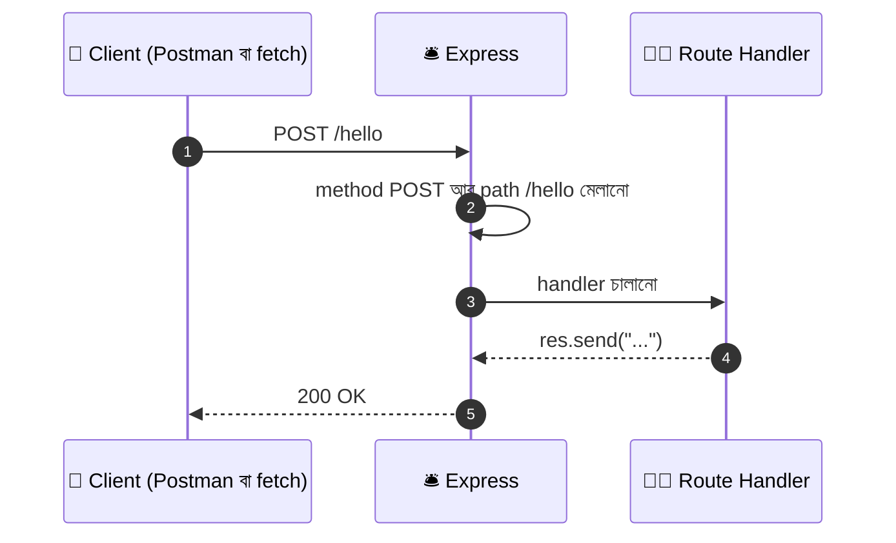

### কোড — সবচেয়ে সহজ POST

```javascript
app.post("/hello", (req, res) => {
  // app.post(path, handler) = "POST method-এ এই path-এ কেউ এলে এই ফাংশন চালাও"
  // ঠিক app.get()-এর মতোই গঠন, শুধু method আলাদা
  res.send("POST অনুরোধ পেয়েছি ✅");
});
```

### টেস্ট করা

```bash
curl -X POST http://localhost:3000/hello
# -X POST = "GET নয়, POST পাঠাও" (Windows PowerShell-এ curl.exe লিখুন)
```

অথবা `localhost:3000` খোলা ট্যাবের DevTools Console-এ:

```javascript
fetch("/hello", { method: "POST" }).then((r) => r.text()).then(console.log);
// method: "POST" না দিলে fetch ডিফল্টে GET পাঠায়, তখন "Cannot GET /hello" এর মতো ৪০৪ পাবেন
```

> ⚠️ Address Bar-এ `localhost:3000/hello` লিখে Enter দিলে GET যাবে, আর আপনার শুধু `app.post` থাকলে ৪০৪ আসবে। **Method না মিললে route-ও মেলে না।**

### Status Code — উত্তরের সিলমোহর

| Code | নাম | কখন |
|---|---|---|
| `200` | OK | সফল |
| `201` | Created | **নতুন কিছু তৈরি হলো** (POST-এর পর সবচেয়ে প্রচলিত) |
| `204` | No Content | সফল, কিন্তু ফেরত দেওয়ার কিছু নেই |
| `400` | Bad Request | ক্লায়েন্টের পাঠানো ডেটা ভুল |
| `401` | Unauthorized | পরিচয় নেই বা ভুল |
| `403` | Forbidden | পরিচয় আছে, কিন্তু অনুমতি নেই |
| `404` | Not Found | যা চাওয়া হয়েছে তা নেই |
| `413` | Payload Too Large | body/ফাইল অনেক বড় |
| `415` | Unsupported Media Type | পাঠানো ডেটার ধরন আমরা বুঝি না |
| `500` | Internal Server Error | সার্ভারের নিজের ভুল |

---

## ৮. Post Request With URL Query — চিরকুট সহ অর্ডার

### গল্প

কাস্টমার অর্ডার জমা দিলো, আর সাথে ঠিকানার শেষে ছোট একটা চিরকুটও জুড়ে দিলো: **"এটা মোবাইল অ্যাপ থেকে এসেছে।"** GET-এর মতোই POST-এর ঠিকানাতেও `?key=value` জুড়ে দেওয়া যায়, আর Express সেটা **একইভাবে `req.query`-তে** পায়।

### কোড — "লাইক" বাটন

```javascript
app.post("/menu/:id/like", (req, res) => {
  const id = Number(req.params.id);
  // id = কোন আইটেম (URL-এর পথ থেকে, ৩ নম্বর সেকশনের মতো)

  const source = req.query.source || "unknown";
  // source = রিকোয়েস্ট কোথা থেকে এলো (?source=mobile)। query থেকে পড়লাম, না দিলে "unknown"

  const dish = menu.find((item) => item.id === id);
  // dish = ওই আইটেম। না পেলে undefined

  if (!dish) {
    return res.status(404).json({ error: "এই আইটেম মেনুতে নেই।" });
  }

  dish.likes += 1;
  // সার্ভারের ডেটা বদলালাম — এই কারণেই এটা GET নয়, POST

  res.json({ id: dish.id, name: dish.name, likes: dish.likes, source });
  // { source } = { source: source } এর শর্টকাট (ES6 shorthand)
});
```

টেস্ট: `POST http://localhost:3000/menu/2/like?source=mobile`

> 💡 এখানে **কোনো body নেই**, তবু এটা POST — কারণ সার্ভারের ডেটা বদলাচ্ছে (`likes` বাড়ছে)। POST মানেই body থাকতে হবে, এমন নয়। **GET/POST ঠিক হয় "কাজের ধরন" দিয়ে, body আছে কি নেই তা দিয়ে নয়।**

### তথ্য কোথায় রাখবো — সিদ্ধান্তের নিয়ম

POST-এ চারটা জায়গাই ব্যবহার করা যায়। তাহলে কোন তথ্য কোথায়?

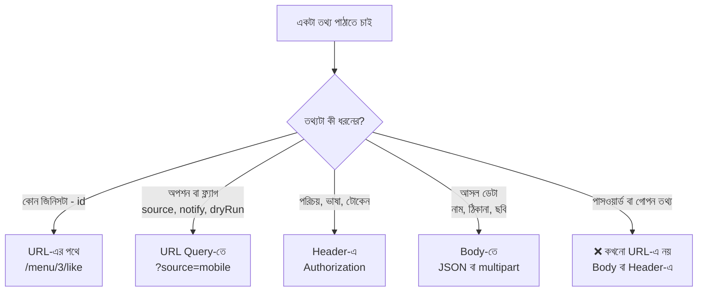

> ⚠️ **URL গোপন থাকে না।** URL ব্রাউজারের history-তে জমে, সার্ভারের log-এ লেখা হয়, অন্য সাইটে গেলে `Referer` header-এ চলে যেতে পারে। তাই পাসওয়ার্ড, টোকেন, কার্ড নম্বর **কখনো query-তে নয়।**

---

## ৯. Post Request With Header Properties — লেবেল সহ অর্ডার

### গল্প

খামের গায়ে লেবেল শুধু GET-এ নয়, POST-এও থাকে। POST-এর ক্ষেত্রে সবচেয়ে গুরুত্বপূর্ণ লেবেল হলো **`Content-Type`** — এটা বলে দেয় ভেতরের চিঠিটা কোন ভাষায় লেখা:

- "ভেতরে **JSON** আছে" → `Content-Type: application/json`
- "ভেতরে **হাতে-লেখা ফর্ম** আছে" → `Content-Type: application/x-www-form-urlencoded`
- "ভেতরে **পার্সেল বাক্স** আছে" → `Content-Type: multipart/form-data; boundary=...`

রিসেপশনিস্ট এই লেবেল দেখেই ঠিক করে কোন যন্ত্র দিয়ে খাম খুলবে। **লেবেল ভুল থাকলে খামটা খোলাই হবে না।**

### কোড

```javascript
app.post("/staff/clock-in", (req, res) => {
  const staffId = req.get("x-staff-id");
  // staffId = কোন কর্মী হাজিরা দিচ্ছে, custom header থেকে পড়লাম

  const contentType = req.get("content-type");
  // contentType = খামের ভেতরে কী আছে তার লেবেল। body না থাকলে undefined

  const isJson = req.is("json");
  // req.is("json") = Content-Type মিলে গেলে সেই type-টা (String) ফেরত দেয়। না মিললে false, আর body-ই না থাকলে null
  // বাকি নামগুলোও চলে: req.is("urlencoded"), req.is("multipart")

  if (!staffId) {
    return res.status(400).json({ error: "x-staff-id হেডার দিন।" });
    // দরকারি লেবেল ছাড়া খাম গ্রহণ করা হবে না
  }

  res.status(201).json({
    message: `কর্মী ${staffId}-এর হাজিরা নেওয়া হয়েছে`,
    receivedContentType: contentType || null,
    isJson: Boolean(isJson),
    // Boolean() দিয়ে String/false/null-কে পরিষ্কার true/false বানালাম
  });
});
```

### Content-Type → কোন parser?

এই টেবিলটাই পরের তিনটা সেকশনের মানচিত্র:

| Content-Type | body-র চেহারা | Express-এ কে পড়বে | ডেটা কোথায় পাবো |
|---|---|---|---|
| `application/json` | `{"name":"রাফসুন"}` | `express.json()` | `req.body` |
| `application/x-www-form-urlencoded` | `name=Rafsun&table=7` | `express.urlencoded()` | `req.body` |
| `multipart/form-data` | বাক্সের খোপে খোপে ভাগ করা | **Multer** | `req.body` + `req.file`/`req.files` |
| `text/plain` | সাধারণ লেখা | `express.text()` | `req.body` (String) |
| `application/octet-stream` | কাঁচা বাইনারি | `express.raw()` | `req.body` (Buffer) |

### আরও দরকারি কিছু header-ভিত্তিক কাজ

```javascript
// Content-Type ভুল হলে ৪১৫ দিয়ে ফিরিয়ে দেওয়ার গার্ড (Route Middleware)
const requireJson = (req, res, next) => {
  if (!req.is("json")) {
    return res.status(415).json({ error: "শুধু application/json গ্রহণ করা হয়।" });
    // 415 = "তোমার পাঠানো ডেটার ধরন আমরা বুঝি না"
  }
  next();
};
```

আর API-এর ক্ষেত্রে সবচেয়ে বেশি যে header দিয়ে POST-এর নিরাপত্তা দেওয়া হয় সেটা `Authorization: Bearer <token>` বা `x-api-key: <key>` — উপরের `checkKitchenKey` গার্ডের মতো middleware বানিয়ে যেকোনো POST route-এ বসিয়ে দেওয়া যায়।

---

## ১০. Post application-json — গোছানো অর্ডার ফর্ম

### গল্প

কাস্টমার যদি মুখে মুখে বলে, "একটা বিরিয়ানি, দুইটা লাচ্ছি, আর হ্যাঁ, ঝাল কম" — রিসেপশনিস্ট গুলিয়ে ফেলতে পারে। তাই রেস্টুরেন্ট বানালো একটা **ছাপানো গোছানো ফর্ম**, যেখানে প্রতিটা তথ্যের নির্দিষ্ট ঘর। সেই ফর্মই **JSON**:

```json
{
  "customerName": "রাফসুন",
  "items": [
    { "id": 1, "qty": 1 },
    { "id": 4, "qty": 2 }
  ],
  "note": "ঝাল কম"
}
```

কিন্তু ফর্মটা খামের ভেতর থেকে **পড়ার উপযোগী করে দেওয়ার জন্য** দরজায় একটা **পার্সেল স্ক্যানার** লাগবে — সেটাই `express.json()`।

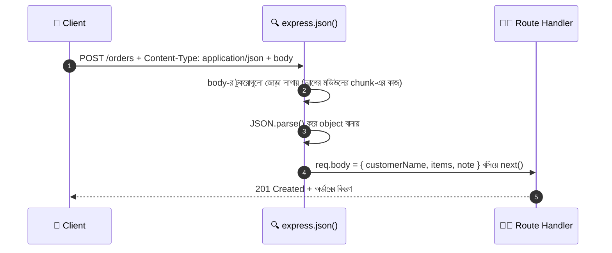

> মনে আছে `http` module-এ `req.on("data")` আর `req.on("end")` দিয়ে টুকরো জোড়া লাগিয়ে `JSON.parse(body)` করতাম? `express.json()` ঠিক ওই কাজটাই আমাদের হয়ে করে দেয়।

### ধাপ ১: স্ক্যানার বসানো (route-এর আগে!)

```javascript
app.use(express.json());
// express.json() = Content-Type: application/json থাকলে body পড়ে JS object বানিয়ে req.body-তে রাখে
// ডিফল্ট সীমা 100kb। বেশি বড় body এলে নিজে থেকে 413 error দেয়। বাড়াতে চাইলে: express.json({ limit: "1mb" })
// এটা না বসালে (বা route-এর পরে বসালে) req.body হবে undefined
```

### ধাপ ২: অর্ডার route

```javascript
app.post("/orders", (req, res) => {
  const { customerName, items, note = "" } = req.body ?? {};
  // req.body = ক্লায়েন্টের পাঠানো JSON object
  // ?? {} = body একদমই না এলে (Express 5-এ তখন undefined) যেন destructuring-এ TypeError না হয়
  // note = "" মানে note না দিলে ডিফল্ট খালি লেখা

  // ---- ইনপুট যাচাই: ক্লায়েন্টের পাঠানো কিছুই অন্ধভাবে বিশ্বাস করবেন না ----
  if (!customerName || !Array.isArray(items) || items.length === 0) {
    return res.status(400).json({ error: "customerName আর অন্তত একটা আইটেম দিতে হবে।" });
  }

  let total = 0;
  // total = মোট বিল। শুরুতে ০

  for (const item of items) {
    const dish = menu.find((d) => d.id === item.id);
    // dish = ক্লায়েন্টের দেওয়া id অনুযায়ী আমাদের নিজেদের মেনু থেকে খুঁজে পাওয়া আইটেম

    if (!dish) {
      return res.status(400).json({ error: `আইটেম ${item.id} আমাদের মেনুতে নেই।` });
    }

    const qty = item.qty === undefined ? 1 : Number(item.qty);
    // qty = কয়টা চাই। না দিলে ১টা ধরলাম

    if (!Number.isInteger(qty) || qty < 1) {
      return res.status(400).json({ error: "পরিমাণ ১ বা তার বেশি পূর্ণসংখ্যা হতে হবে।" });
    }

    total += dish.price * qty;
    // ⚠️ দাম ক্লায়েন্টের কাছ থেকে নিচ্ছি না, নিজের মেনু থেকে হিসাব করছি।
    // ক্লায়েন্ট "price: 1" পাঠিয়ে ঠকাতে পারে, তাই যা সার্ভার নিজে জানে তা ক্লায়েন্টের মুখে শুনি না
  }

  const order = {
    id: orders.length + 1,   // id = নতুন অর্ডারের নম্বর
    customerName,
    items,
    note,
    total,
    status: "received",      // status = অর্ডারের অবস্থা, শুরুতে "গ্রহণ করা হয়েছে"
  };

  orders.push(order);
  // orders array-তে জমা রাখলাম (এটাই আমাদের নকল খাতা)

  res.status(201).json(order);
  // 201 Created = নতুন কিছু তৈরি হয়েছে। ক্লায়েন্টকে অর্ডারের পুরো বিবরণ ফেরত দিলাম
});
```

### ক্লায়েন্ট থেকে পাঠানো

```javascript
const response = await fetch("/orders", {
  method: "POST",
  // method = POST, কারণ আমরা জমা দিচ্ছি
  headers: { "Content-Type": "application/json" },
  // এই লেবেলটাই express.json()-কে বলে "খামটা আমি খুলবো"। এটা ভুলে গেলে req.body হবে undefined
  body: JSON.stringify({
    // JSON.stringify = JS object-কে টেক্সটে বানায়, কারণ নেটওয়ার্কে শুধু টেক্সট যায় (আগের ফাইলে শেখা)
    customerName: "রাফসুন",
    items: [{ id: 1, qty: 1 }, { id: 4, qty: 2 }],
    note: "ঝাল কম",
  }),
});

const data = await response.json();
// data = সার্ভারের ফেরত দেওয়া অর্ডারের বিবরণ (বা { error: "..." })
console.log(data);
```

curl দিয়ে (Mac/Linux):

```bash
curl -X POST http://localhost:3000/orders \
  -H "Content-Type: application/json" \
  -d '{"customerName":"রাফসুন","items":[{"id":1,"qty":1}]}'
# -H = header বসানো, -d = body (data) পাঠানো
```

### ভাঙা JSON এলে কী হয়?

ক্লায়েন্ট যদি `{ "customerName": ` পাঠায় — JSON ভাঙা। `express.json()` তখন নিজেই error ছোঁড়ে (status `400`, `err.type === "entity.parse.failed"`)। আমাদের error handler এটা ধরবে (১২ নম্বর সেকশনের শেষ ভার্সনে দেওয়া আছে)।

### আরেক ভাই: `application/x-www-form-urlencoded`

HTML `<form method="POST">`-এ `enctype` না লিখলে ব্রাউজার ডিফল্টে এই ফরম্যাটে পাঠায়: `customerName=Rafsun&note=less+spicy`

```javascript
app.use(express.urlencoded({ extended: true }));
// urlencoded = HTML ফর্মের body পড়ে req.body-তে রাখে
// extended: true = জটিল/nested key (যেমন user[name]) বুঝতে পারে (qs লাইব্রেরি দিয়ে)
// Express 5-এ ডিফল্ট false, তাই স্পষ্ট করে লিখে রাখা ভালো
```

### তিন ধরনের body এক নজরে

| | `application/json` | `x-www-form-urlencoded` | `multipart/form-data` |
|---|---|---|---|
| গল্পে | গোছানো ছাপানো ফর্ম | হাতে-লেখা সাধারণ ফর্ম | পার্সেল বাক্স |
| ডেটার গঠন | nested object/array চলে | সমতল `key=value` | খোপে খোপে ভাগ |
| ফাইল পাঠানো যায়? | ❌ না | ❌ না | ✅ হ্যাঁ |
| Express-এ parser | `express.json()` | `express.urlencoded()` | **Multer** |
| কে বেশি ব্যবহার করে | API, React/Vue অ্যাপ | পুরোনো ধাঁচের HTML ফর্ম | ছবি/ফাইল আপলোড |

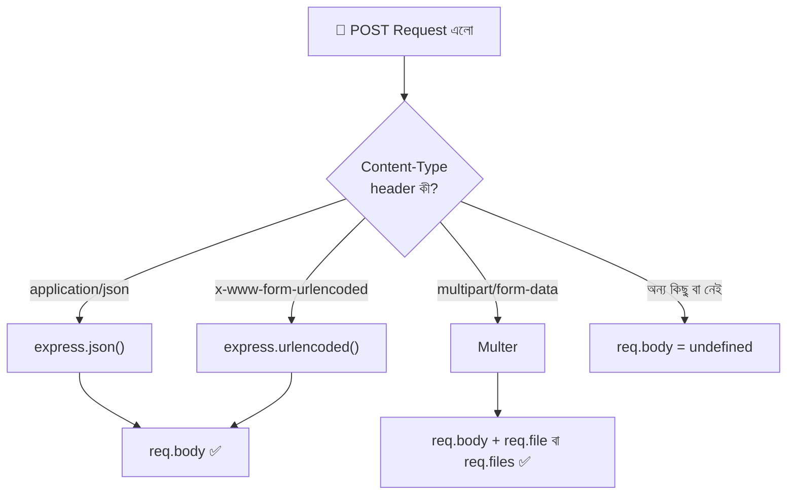

---

## ১১. Working With Multipart Form Data — পার্সেল বাক্স

### গল্প

এতক্ষণ কাস্টমার শুধু **লেখা** পাঠিয়েছে — নাম, সংখ্যা, নোট। এবার সে চায় মেনুতে নতুন আইটেম যোগ করতে, আর সাথে **আইটেমটার একটা ছবিও** পাঠাতে চায়।

কিন্তু JSON একটা লেখার চিঠি। ছবি হলো বাইনারি ডেটা — লাখ লাখ বাইটের একটা জট। এটা JSON চিঠিতে ঢোকানো যায় না। তাই কাস্টমার একটা **পার্সেল বাক্স** ব্যবহার করে:

- বাক্সের ভেতরে **অনেকগুলো খোপ**
- প্রতিটা খোপের গায়ে **লেবেল** (`name`, `price`, `photo`)
- কোনো খোপে **লেখা**, কোনোটায় **ছবির ফাইল**
- খোপগুলোকে আলাদা রাখতে খোপের মাঝে একটা **বিশেষ সীমানা-দাগ** (`boundary`)

এই পার্সেল বাক্সের নামই **`multipart/form-data`** ("multi-part" = একাধিক অংশ)।

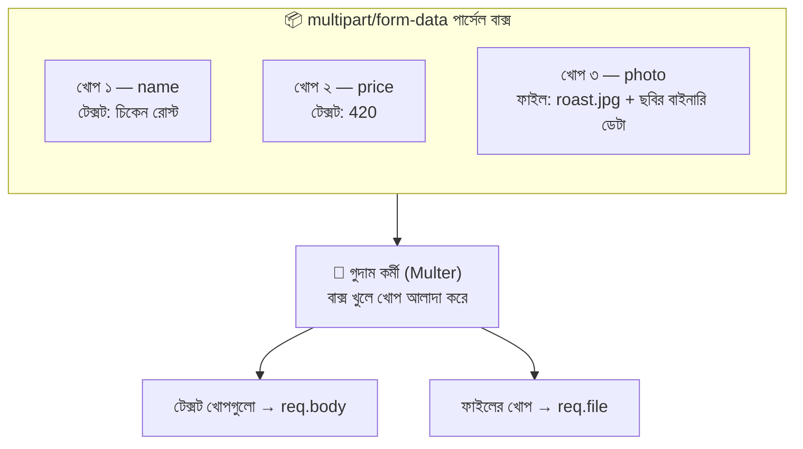

### আসলে তারের ভেতর দিয়ে কী যায়?

```
POST /menu HTTP/1.1
Content-Type: multipart/form-data; boundary=----XyZ123

------XyZ123
Content-Disposition: form-data; name="name"

চিকেন রোস্ট
------XyZ123
Content-Disposition: form-data; name="price"

420
------XyZ123
Content-Disposition: form-data; name="photo"; filename="roast.jpg"
Content-Type: image/jpeg

(...ছবির কাঁচা বাইনারি ডেটা...)
------XyZ123--
```

লক্ষ্য করুন:

- `boundary=----XyZ123` = খোপ আলাদা করার সীমানা-দাগ, ব্রাউজার নিজে বানায় (প্রতিবার আলাদা)
- প্রতিটা খোপের শুরুতে `Content-Disposition` লেবেলে `name="..."` — এই `name`-ই আমরা Multer-এ ধরবো
- ফাইলের খোপে `filename` আর নিজস্ব `Content-Type: image/jpeg` আছে
- শেষ দাগের শেষে `--` = "বাক্স এখানেই শেষ"

### কেন `express.json()` এটা পড়তে পারে না?

কারণ `express.json()` শুধু `Content-Type: application/json` দেখলেই কাজ করে। আর `express.urlencoded()` শুধু `x-www-form-urlencoded`। **multipart-এর জন্য Express-এর ভেতরে কোনো parser নেই।** তাই লাগে **Multer** (এটা `busboy` নামের একটা লাইব্রেরির উপরে বানানো)।

### Multipart পাঠানোর দুইটা উপায় ও একটা ফাঁদ

**উপায় ১: সাধারণ HTML Form (JavaScript ছাড়াই)**

```html
<form action="/menu" method="POST" enctype="multipart/form-data">
  <!-- method="POST" = ফর্ম জমা হবে POST দিয়ে -->
  <!-- enctype="multipart/form-data" = ⚠️ এই লাইনটা ছাড়া ছবি যাবেই না, শুধু ফাইলের নামটা যাবে -->
  <input type="text" name="name" />
  <input type="file" name="photo" />
  <!-- name="photo" = এই নামটাই server-এ upload.single("photo")-এ মিলতে হবে -->
  <button type="submit">পাঠান</button>
</form>
```

**উপায় ২: JavaScript-এ `FormData` + `fetch`**

```javascript
const formData = new FormData();
// FormData = পার্সেল বাক্স বানানোর যন্ত্র

formData.append("name", "চিকেন রোস্ট");     // একটা টেক্সট খোপ যোগ
formData.append("photo", fileInput.files[0]); // একটা ফাইল খোপ যোগ (fileInput.files[0] = ব্যবহারকারীর বাছা প্রথম ফাইল)

await fetch("/menu", { method: "POST", body: formData });
// body-তে সরাসরি formData দিলাম
```

> ⚠️ **সবচেয়ে বড় ফাঁদ:** `FormData` পাঠানোর সময় **`Content-Type` header নিজে হাতে লিখবেন না!**
> `headers: { "Content-Type": "multipart/form-data" }` লিখলে `boundary` অংশটা হারিয়ে যায়, আর Multer বাক্স খুলতেই পারে না (ফলে `req.file` হয় `undefined`)। `body: formData` দিলে ব্রাউজার নিজেই সঠিক `Content-Type` + `boundary` বসিয়ে দেয়।

**Postman-এ:** Body ট্যাব → **form-data** (raw বা x-www-form-urlencoded নয়) → Key-র ডানদিকের ড্রপডাউনে `Text` বা `File` বেছে নিন।

> 🔍 **নিজে দেখুন:** ব্রাউজারে ফাইল আপলোড করে DevTools → Network ট্যাবে গিয়ে request-এ ক্লিক করুন। Headers-এ `Content-Type: multipart/form-data; boundary=...` আর Payload-এ প্রতিটা খোপ দেখতে পাবেন।

---

## ১২. File Upload — Multer গুদাম কর্মী

### গল্প

পার্সেল বাক্স রিসেপশনে পৌঁছালো। রিসেপশনিস্ট (Express) বাক্স খুলতে পারে না, তাই ডাকা হলো **গুদাম কর্মী — Multer**-কে। তার কাজের ধাপ:

1. বাক্স খুলে খোপ আলাদা করা
2. প্রতিটা ফাইল **পরীক্ষককে** (`fileFilter`) দেখানো — "এটা কি আমাদের গুদামে রাখার মতো?"
3. **ওজন আর সংখ্যা** মেপে দেখা (`limits`) — "এটা কি বেশি ভারী?"
4. পাশ হলে **গুদামের তাকে** (`storage`) লেবেল লাগিয়ে রাখা
5. টেক্সট খোপগুলো `req.body`-তে আর ফাইলের তথ্য `req.file`-এ সাজিয়ে রিসেপশনিস্টের হাতে তুলে দেওয়া

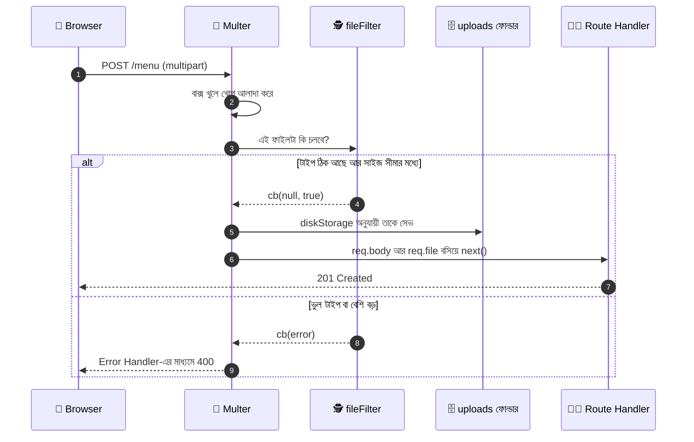

### Multer ইনস্টল

`npm install express multer` আগেই দিয়েছি। (এখন Multer-এর 2.x ভার্সন চলছে — পুরোনো 1.x ব্যবহার না করাই ভালো।)

### লেভেল ১: সবচেয়ে সহজ — `dest`

```javascript
const multer = require("multer");
// multer = multipart/form-data পড়ার middleware

const upload = multer({ dest: "uploads/" });
// upload = আমাদের গুদাম কর্মী। dest = ফাইল কোন ফোল্ডারে রাখবে
// ⚠️ এভাবে ফাইল রাখলে নাম হয় এলোমেলো (extension ছাড়া), তাই এটা শুধু বোঝার জন্য

app.post("/upload-basic", upload.single("photo"), (req, res) => {
  // upload.single("photo") = Route Middleware। "photo" নামের খোপ থেকে একটা ফাইল নেবে
  // handler-এ পৌঁছানোর আগেই Multer তার কাজ শেষ করে ফেলে
  res.json({ file: req.file, body: req.body });
});
```

### `req.file`-এ কী কী থাকে?

আপলোডের পর handler-এ `req.file` এমন দেখতে হয়:

```json
{
  "fieldname": "photo",
  "originalname": "roast.jpg",
  "encoding": "7bit",
  "mimetype": "image/jpeg",
  "destination": "/project/uploads",
  "filename": "photo-1758456000000-482913057.jpg",
  "path": "/project/uploads/photo-1758456000000-482913057.jpg",
  "size": 184320
}
```

| Property | মানে | কোন storage-এ পাওয়া যায় |
|---|---|---|
| `fieldname` | form-এ খোপের `name` (`"photo"`) | দুটোতেই |
| `originalname` | ব্যবহারকারীর কম্পিউটারে ফাইলের আসল নাম | দুটোতেই |
| `encoding` | এনকোডিং | দুটোতেই |
| `mimetype` | ফাইলের ধরন (`image/jpeg`) — **ক্লায়েন্টের দাবি করা** | দুটোতেই |
| `size` | সাইজ (বাইটে) | দুটোতেই |
| `destination` | কোন ফোল্ডারে সেভ হলো | শুধু diskStorage |
| `filename` | ফোল্ডারের ভেতরে ফাইলের নাম | শুধু diskStorage |
| `path` | ফাইলের পূর্ণ পথ | শুধু diskStorage |
| `buffer` | পুরো ফাইলের `Buffer` (RAM-এ) | শুধু memoryStorage |

### লেভেল ২: `diskStorage` — নিজের তাক, নিজের লেবেল

```javascript
const fs = require("fs");
// fs = আগের মডিউলে শেখা File System মডিউল। এখানে ফোল্ডার বানাতে আর ফাইল মুছতে লাগবে

const uploadDir = path.join(__dirname, "uploads");
// uploadDir = আপলোড ফোল্ডারের পূর্ণ ঠিকানা। path.join দিয়ে বানালাম যাতে যেকোনো OS-এ কাজ করে

fs.mkdirSync(uploadDir, { recursive: true });
// ফোল্ডার না থাকলে বানিয়ে নেবে, থাকলে কিছু করবে না (recursive: true-এর কারণে error দেয় না)
// ⚠️ নইলে ফোল্ডার না থাকলে ENOENT error আসবে

const EXT_BY_MIME = {
  "image/jpeg": ".jpg",
  "image/png": ".png",
  "image/webp": ".webp",
};
// EXT_BY_MIME = কোন ধরনের ছবি আমরা গ্রহণ করি, আর সেটার জন্য কোন extension বসবে
// এটাই আমাদের "সাদা তালিকা (whitelist)"। SVG ইচ্ছে করেই বাদ দিলাম, কারণ SVG-র ভেতরে স্ক্রিপ্ট লুকানো যায়

const storage = multer.diskStorage({
  // diskStorage = "ফাইল ডিস্কে রাখবো" — কোথায় আর কী নামে সেটা আমরা ঠিক করবো

  destination: (req, file, cb) => {
    // destination = কোন তাকে (ফোল্ডারে) রাখবো
    // file = আপলোড হতে যাওয়া ফাইলের তথ্য
    // cb = callback, কাজ শেষে ফলাফল জানানোর ফাংশন। cb(error, ফলাফল), error না থাকলে প্রথমটা null
    cb(null, uploadDir);
  },

  filename: (req, file, cb) => {
    // filename = ফাইলটা কী নামে সেভ হবে
    const uniqueSuffix = Date.now() + "-" + Math.round(Math.random() * 1e9);
    // uniqueSuffix = বর্তমান সময় + একটা র‍্যান্ডম সংখ্যা। দুইজন একই নামের ফাইল দিলেও যেন একটা আরেকটাকে মুছে না দেয়

    const ext = EXT_BY_MIME[file.mimetype];
    // ext = mimetype থেকে বেছে নেওয়া extension (.jpg ইত্যাদি)

    cb(null, `${file.fieldname}-${uniqueSuffix}${ext}`);
    // ⚠️ ব্যবহারকারীর দেওয়া originalname দিয়ে সেভ করলাম না। ওতে ../../ বা অদ্ভুত অক্ষর থাকতে পারে,
    // আর একই নামে আরেকজন এসে আগেরটা মুছে দিতে পারে। যেমন: photo-1758456000000-482913057.jpg
  },
});
```

### লেভেল ৩: `fileFilter` — পরীক্ষক

```javascript
const fileFilter = (req, file, cb) => {
  // fileFilter = প্রতিটা ফাইল ঢোকার আগে চালু হয়, সিদ্ধান্ত নেয় নেবো কিনা

  if (EXT_BY_MIME[file.mimetype]) {
    // ফাইলের ধরন আমাদের সাদা তালিকায় আছে
    cb(null, true);
    // cb(null, true) = "এটা নাও"
  } else {
    const error = new Error("শুধু JPG, PNG বা WEBP ছবি দেওয়া যাবে।");
    // error = ক্লায়েন্টকে জানানোর বার্তা সহ নিজের বানানো error
    error.status = 400;
    // error.status = নিজে জুড়ে দিলাম, যাতে error handler ৪০০ দিয়ে উত্তর দিতে পারে
    cb(error);
    // cb(error) = "এটা নেবো না" — request সরাসরি Error handler-এ চলে যাবে
  }
};
```

> ⚠️ **`file.mimetype` ক্লায়েন্টের দাবি** — কেউ `virus.exe`-র নাম বদলে `.jpg` করে পাঠালেও ব্রাউজার `image/jpeg` লিখে দিতে পারে, আবার হ্যাকার নিজেও যা খুশি লিখে পাঠাতে পারে। বাস্তব প্রজেক্টে ফাইলের প্রথম কয়েক বাইট (magic bytes) পরীক্ষা করা হয় (যেমন `file-type` প্যাকেজ দিয়ে)। শেখার জন্য এখানে mimetype-ই যথেষ্ট।

### লেভেল ৪: `limits` — ওজন আর সংখ্যার সীমা

```javascript
const upload = multer({
  storage,
  // storage = উপরে বানানো diskStorage ({ storage: storage } এর শর্টকাট)

  fileFilter,
  // fileFilter = উপরের পরীক্ষক

  limits: {
    fileSize: 2 * 1024 * 1024,
    // fileSize = একটা ফাইল সর্বোচ্চ কত বাইটের। 2 * 1024 * 1024 = ২ মেগাবাইট
    files: 5,
    // files = এক request-এ সর্বোচ্চ কয়টা ফাইল
  },
});
```

| `limits`-এর key | মানে | ডিফল্ট |
|---|---|---|
| `fileSize` | একটা ফাইলের সর্বোচ্চ সাইজ (বাইট) | সীমা নেই ⚠️ |
| `files` | সর্বোচ্চ ফাইলের সংখ্যা | সীমা নেই ⚠️ |
| `fields` | টেক্সট খোপের সর্বোচ্চ সংখ্যা | সীমা নেই |
| `fieldSize` | একটা টেক্সট খোপের সর্বোচ্চ সাইজ | ১ MB |
| `parts` | মোট খোপ (টেক্সট + ফাইল) | সীমা নেই |

> ⚠️ ডিফল্টে **ফাইলের সাইজের কোনো সীমা নেই**। `limits` না দিলে কেউ ১০ GB-র ফাইল পাঠিয়ে আপনার ডিস্ক ভরিয়ে দিতে পারে।

### সব Multer মেথড — কয়টা ফাইল, কোথায় পাবো

| মেথড | কয়টা ফাইল | ফাইল কোথায় | কখন ব্যবহার করবো |
|---|---|---|---|
| `upload.single("photo")` | ১টা | `req.file` | প্রোফাইল ছবি, একটা আইটেমের ছবি |
| `upload.array("gallery", 5)` | একই নামে সর্বোচ্চ ৫টা | `req.files` (array) | গ্যালারি |
| `upload.fields([...])` | আলাদা আলাদা নামে | `req.files` (object) | কভার ছবি + গ্যালারি |
| `upload.none()` | ০টা (শুধু টেক্সট) | — | multipart ফর্ম, কিন্তু ফাইল নেই |
| `upload.any()` | যেকোনো নামে যত খুশি | `req.files` (array) | ⚠️ এড়িয়ে চলুন — কোন নামে কী আসছে সেটা আপনি জানেন না |

### Route ১: মেনুতে ছবি সহ নতুন আইটেম (`single`)

```javascript
app.use("/uploads", express.static(uploadDir));
// /uploads/ দিয়ে শুরু হওয়া ঠিকানায় uploads ফোল্ডারের ফাইল ব্রাউজারে দেখানো যাবে
// যেমন: http://localhost:3000/uploads/photo-1758456000000-482913057.jpg

app.post("/menu", upload.single("photo"), async (req, res) => {
  // upload.single("photo") = Route Middleware। HTML/FormData-র name="photo" খোপ থেকে ১টা ফাইল নেবে
  // async ব্যবহার করলাম কারণ ভেতরে ফাইল মুছতে await লাগবে (Express 5-এ async handler-এর error নিজে থেকেই ধরা পড়ে)

  const { name, category, price } = req.body;
  // req.body = Multer-এর সাজিয়ে দেওয়া টেক্সট খোপগুলো। ⚠️ এখানেও সব মান String

  if (!req.file) {
    // req.file = আপলোড হওয়া ফাইল। ব্যবহারকারী ফাইল না দিলে বা field-এর নাম না মিললে এটা undefined
    return res.status(400).json({ error: "একটা ছবি দিতে হবে।" });
  }

  if (!name || !price || Number.isNaN(Number(price))) {
    await fs.promises.unlink(req.file.path);
    // ফাইল ততক্ষণে ডিস্কে সেভ হয়ে গেছে! ডেটা ভুল হলে অকারণে পড়ে থাকা ফাইলটা মুছে ফেললাম
    // req.file.path = ফাইলের পূর্ণ পথ, fs.promises.unlink = ফাইল মোছা (Promise ভার্সন, তাই await)
    return res.status(400).json({ error: "নাম আর সঠিক দাম দিতে হবে।" });
  }

  const newDish = {
    id: menu.length + 1,
    name,
    category: category || "main",           // category না দিলে "main" ধরলাম
    price: Number(price),                   // Number() দিয়ে String "420" থেকে সংখ্যা বানালাম
    vegetarian: false,
    likes: 0,
    photoUrl: `/uploads/${req.file.filename}`,
    // photoUrl = ব্রাউজারে ছবি দেখার ঠিকানা। req.file.filename = diskStorage-এর বানানো নাম
  };

  menu.push(newDish);
  res.status(201).json(newDish);
});
```

> 💡 **ফিল্ডের ক্রম:** Multer টেক্সট আর ফাইল খোপ **যে ক্রমে আসে সেই ক্রমেই** পড়ে। তাই `filename` বা `fileFilter`-এর ভেতরে যদি `req.body` লাগে, তাহলে HTML/FormData-তে **টেক্সট খোপগুলো ফাইলের আগে** রাখতে হবে।

### Route ২: একাধিক ফাইল (`array`)

```javascript
app.post("/gallery", upload.array("gallery", 5), (req, res) => {
  // upload.array("gallery", 5) = "gallery" নামের সর্বোচ্চ ৫টা ফাইল। ৬টা দিলে LIMIT_UNEXPECTED_FILE error
  // এখন req.file নয়, req.files — একটা array

  const urls = req.files.map((file) => `/uploads/${file.filename}`);
  // urls = প্রতিটা ফাইলের ব্রাউজার-ঠিকানা। .map() = array-র প্রতিটা উপাদান থেকে নতুন মান বানিয়ে নতুন array দেয়

  res.status(201).json({ count: req.files.length, urls });
});
```

### Route ৩: আলাদা আলাদা নামের ফাইল (`fields`)

```javascript
const coverAndGallery = upload.fields([
  { name: "cover", maxCount: 1 },
  { name: "gallery", maxCount: 4 },
]);
// fields([...]) = কোন নামে কয়টা ফাইল আসবে তার তালিকা। এখানে ১টা cover আর সর্বোচ্চ ৪টা gallery

app.post("/restaurant/photos", coverAndGallery, (req, res) => {
  // এবার req.files একটা object: { cover: [...], gallery: [...] } — প্রতিটা key-র ভেতরে array

  const cover = req.files.cover?.[0];
  // cover = cover খোপের প্রথম (একমাত্র) ফাইল। ?. দিলাম কারণ কেউ cover না দিলে req.files.cover undefined

  const gallery = req.files.gallery || [];
  // gallery = gallery খোপের ফাইলগুলো, না এলে খালি array

  res.status(201).json({
    cover: cover ? `/uploads/${cover.filename}` : null,
    gallery: gallery.map((file) => `/uploads/${file.filename}`),
  });
});
```

### Route ৪: শুধু টেক্সট, multipart ফর্ম (`none`)

```javascript
app.post("/contact", upload.none(), (req, res) => {
  // upload.none() = ফর্ম multipart, কিন্তু ফাইল আশা করছি না। কেউ ফাইল পাঠালে LIMIT_UNEXPECTED_FILE error
  res.json({ received: req.body });
});
```

### `memoryStorage` — তাকে না রেখে সরাসরি টেবিলে

ফাইল যদি ডিস্কে না রেখে **সরাসরি অন্য জায়গায় পাঠাতে** চাই (যেমন Cloudinary বা AWS S3), তখন ডিস্কে রাখার দরকার নেই — RAM-এ রাখলেই হয়:

```javascript
const memoryUpload = multer({
  storage: multer.memoryStorage(),
  // memoryStorage = ফাইল ডিস্কে সেভ হবে না, req.file.buffer-এ RAM-এ থাকবে
  limits: { fileSize: 2 * 1024 * 1024 },
  // ⚠️ সীমা না দিলে অনেকে একসাথে বড় ফাইল দিলে সার্ভারের মেমরি ফুরিয়ে যাবে
});

app.post("/upload-to-cloud", memoryUpload.single("photo"), (req, res) => {
  const fileBuffer = req.file.buffer;
  // fileBuffer = পুরো ফাইলটা Buffer আকারে (Node.js-এ কাঁচা বাইনারি ডেটা রাখার ধরন)
  // এই buffer-টাই তুলে দেওয়া হয় ক্লাউড সার্ভিসের SDK-তে

  res.json({ sizeInBytes: fileBuffer.length, type: req.file.mimetype });
});
```

| | `diskStorage` | `memoryStorage` |
|---|---|---|
| ফাইল কোথায় থাকে | সার্ভারের ফোল্ডারে | RAM-এ (`req.file.buffer`) |
| গল্পে | গুদামের তাকে লেবেল লাগিয়ে রাখা | রিসেপশনের টেবিলে কিছুক্ষণ রাখা |
| উপযোগী | ছোট প্রজেক্ট, লোকাল স্টোরেজ | ক্লাউডে পাঠানো, ছবি প্রসেস (resize) |
| ঝুঁকি | ডিস্ক ভরে যেতে পারে | মেমরি ফুরিয়ে যেতে পারে |

### Multer-এর error সামলানো — শেষ ভার্সনের Error Handler

Multer কিছু ভুল পেলে `MulterError` ছোঁড়ে, যার একটা `code` থাকে। আগের সাধারণ error handler-টা মুছে এটা বসান (**সবার শেষে**, ৪০৪ handler-এরও পরে):

```javascript
app.use((err, req, res, next) => {
  if (err instanceof multer.MulterError) {
    // MulterError = Multer-এর নিজস্ব ধরনের error (সীমা পেরোনো, ভুল ফিল্ড ইত্যাদি)
    const messages = {
      LIMIT_FILE_SIZE: "ফাইল অনেক বড় — সর্বোচ্চ ২ MB।",
      LIMIT_FILE_COUNT: "অনেক বেশি ফাইল দেওয়া হয়েছে।",
      LIMIT_UNEXPECTED_FILE: "ভুল নামের খোপে ফাইল এসেছে বা সংখ্যা বেশি।",
    };
    // messages = error code থেকে বাংলা বার্তায় রূপান্তরের তালিকা

    return res.status(400).json({ error: messages[err.code] || err.message });
    // যে code-এর বার্তা তালিকায় নেই, তার জন্য Multer-এর নিজের বার্তা
  }

  if (err.type === "entity.parse.failed") {
    // ভাঙা JSON পাঠালে express.json() এই type-এর error ছোঁড়ে (১০ নম্বর সেকশন)
    return res.status(400).json({ error: "JSON ফরম্যাট ঠিক নেই।" });
  }

  if (err.status && err.status < 500) {
    // আমাদের নিজের বানানো error (যেমন fileFilter-এর error.status = 400)
    return res.status(err.status).json({ error: err.message });
  }

  console.error(err.stack);
  // অজানা সমস্যা — আসল কারণ শুধু server console-এ
  res.status(500).json({ error: "সার্ভারে সমস্যা হয়েছে।" });
});
```

| `MulterError.code` | কখন হয় |
|---|---|
| `LIMIT_FILE_SIZE` | ফাইল `limits.fileSize`-এর চেয়ে বড় |
| `LIMIT_FILE_COUNT` | ফাইলের সংখ্যা `limits.files`-এর বেশি |
| `LIMIT_UNEXPECTED_FILE` | **সবচেয়ে বেশি দেখা** — ফাইলের খোপের `name` আর `upload.single("...")`-এর নাম মেলেনি, বা `array`-র সীমার বেশি ফাইল |
| `LIMIT_PART_COUNT` | মোট খোপের সংখ্যা `limits.parts`-এর বেশি |

### Frontend — ছবি সহ আইটেম যোগ করার ফর্ম

**`public/upload.html`**

```html
<!DOCTYPE html>
<html lang="bn">
<head>
  <meta charset="UTF-8" />
  <meta name="viewport" content="width=device-width, initial-scale=1.0" />
  <title>🍽️ মেনুতে নতুন আইটেম</title>
</head>
<body>
  <h1>🍽️ মেনুতে নতুন আইটেম যোগ করুন</h1>

  <form id="dishForm">
    <!-- id গুলো খুব জরুরি — JS এই id ধরেই এলিমেন্ট খুঁজে নেবে -->
    <!-- ⚠️ টেক্সট খোপগুলো ফাইলের আগে রাখলাম (ক্রমের নিয়ম) -->
    <input type="text" name="name" placeholder="আইটেমের নাম" required />
    <select name="category">
      <option value="main">মেইন</option>
      <option value="dessert">ডেজার্ট</option>
      <option value="drink">ড্রিংক</option>
    </select>
    <input type="number" name="price" placeholder="দাম" required />

    <input type="file" name="photo" accept="image/*" required />
    <!-- name="photo" = server-এর upload.single("photo")-এর সাথে হুবহু মিলতে হবে
         accept="image/*" = ফাইল বাছাইয়ের সময় শুধু ছবি দেখাবে। এটা কেবল সুবিধার জন্য,
         নিরাপত্তা নয় — কেউ এটা এড়িয়ে যেতে পারে, তাই server-এও fileFilter আছে -->

    <button type="submit" id="submitBtn">যোগ করুন</button>
  </form>

  <div id="result"></div>
  <!-- শুরুতে খালি, উত্তর এলে JS এখানে লিখে দেবে -->

  <script src="upload.js" defer></script>
  <!-- defer = HTML পুরো লোড হওয়ার পরে স্ক্রিপ্ট চলবে -->
</body>
</html>
```

**`public/upload.js`**

```javascript
// upload.js — কাস্টমারের টেবিল (Browser-এ চলে)

const dishForm = document.getElementById("dishForm");
// dishForm = পুরো ফর্ম এলিমেন্ট

const submitBtn = document.getElementById("submitBtn");
// submitBtn = জমা দেওয়ার বাটন (আপলোডের সময় disable করবো)

const result = document.getElementById("result");
// result = যেখানে সফল বা ব্যর্থ বার্তা দেখাবো

dishForm.addEventListener("submit", async (e) => {
  // "submit" Event = ফর্ম জমা দেওয়া হলে ঘণ্টা বাজে (আগের মডিউলের ঘণ্টা সিস্টেমই, এবার ব্রাউজারে)
  // e = event object

  e.preventDefault();
  // preventDefault = ব্রাউজারের ডিফল্ট আচরণ থামালাম (ডিফল্টে পুরো পেজ রিলোড হয়ে JSON দেখাতো)। আমরা নিজে fetch করবো

  const formData = new FormData(dishForm);
  // formData = ফর্মের সব খোপ (টেক্সট আর ফাইল) নিয়ে নিজে থেকেই বানানো পার্সেল বাক্স
  // এক লাইনেই কাজ শেষ — append করতে হয়নি, কারণ ফর্মের name গুলো থেকে নিজেই বানিয়ে নেয়

  submitBtn.disabled = true;
  // আপলোড চলাকালীন আবার ক্লিক করে একই ছবি দুইবার পাঠানো আটকালাম
  result.textContent = "⏳ আপলোড হচ্ছে...";

  try {
    const response = await fetch("/menu", {
      method: "POST",
      body: formData,
      // ⚠️ headers লিখলাম না! Content-Type ব্রাউজার নিজে বসাবে (boundary সহ)
    });

    const data = await response.json();
    // data = server-এর উত্তর — সফল হলে নতুন আইটেম, নাহলে { error: "..." }

    if (!response.ok) {
      throw new Error(data.error || "কিছু একটা সমস্যা হয়েছে।");
    }

    result.textContent = `✅ যোগ হয়েছে: ${data.name} (${data.price} টাকা)`;
    // textContent ব্যবহার করলাম, innerHTML নয় — কারণ নামের ভেতর স্ক্রিপ্ট লুকানো থাকলে চলে যেতে পারে (XSS)

    const img = document.createElement("img");
    // img = নতুন  এলিমেন্ট, ছবিটা দেখানোর জন্য
    img.src = data.photoUrl;   // server-এর দেওয়া ছবির ঠিকানা
    img.width = 200;
    result.appendChild(img);   // result-এর ভেতরে ছবিটা বসালাম

    dishForm.reset();          // ফর্ম খালি করলাম, নতুন আইটেমের জন্য প্রস্তুত
  } catch (err) {
    result.textContent = "❌ " + err.message;
  } finally {
    submitBtn.disabled = false;
    // finally = সফল হোক বা ব্যর্থ, বাটন আবার চালু করে দিলাম
  }
});
```

`http://localhost:3000/upload.html` খুলে ছবি বেছে জমা দিন। এরপর `http://localhost:3000/menu` দেখুন — নতুন আইটেম `photoUrl` সহ মেনুতে আছে।

### 🔒 ফাইল আপলোডের নিরাপত্তা চেকলিস্ট

ফাইল আপলোড হলো ওয়েব অ্যাপের সবচেয়ে ঝুঁকিপূর্ণ ফিচারগুলোর একটা। কারণ আপনি *অচেনা মানুষের পাঠানো ফাইল আপনার সার্ভারে রাখছেন*।

- [ ] `limits.fileSize` আর `limits.files` দেওয়া আছে?
- [ ] `fileFilter` দিয়ে শুধু সাদা তালিকার ধরন গ্রহণ করছেন? (কালো তালিকা নয় — সব খারাপ ধরন আপনি জানেন না)
- [ ] ফাইলের নাম আপনি নিজে বানাচ্ছেন? (ব্যবহারকারীর `originalname` দিয়ে সেভ করছেন না তো?)
- [ ] `upload` middleware **শুধু নির্দিষ্ট route-এ** বসানো? (`app.use(upload.any())` দিয়ে পুরো সাইটে বসালে কেউ আপনার না-ভাবা যেকোনো route-এ ফাইল ঢুকিয়ে দিতে পারে)
- [ ] ভুল ডেটার কারণে বাতিল হওয়া অনুরোধের ফাইল মুছে ফেলছেন? (আমরা `fs.promises.unlink` দিয়েছি)
- [ ] `uploads/` ফোল্ডার `.gitignore`-এ আছে?
- [ ] বাস্তব প্রজেক্টে: magic bytes পরীক্ষা, ভাইরাস স্ক্যান আর ক্লাউড স্টোরেজ (S3/Cloudinary) বিবেচনা করেছেন?

---

## ১৩. Comparison between GET and POST — পোস্টকার্ড বনাম সিল করা খাম

### গল্প

- **GET = পোস্টকার্ড।** যা বলার সব ঠিকানার সাথেই খোলা লেখা (URL-এ)। যে পোস্টকার্ড হাতে পাবে সে-ই পড়তে পারবে। ছোট, দ্রুত, আবার পাঠানো নিরাপদ, বন্ধুকে দেখাতে বুকমার্কও করা যায়।
- **POST = সিল করা খাম।** ঠিকানা বাইরে, কিন্তু আসল চিঠি ভেতরে (body-তে)। চিঠি যত বড় হোক, এমনকি ছবি-ফাইল ভরে দিলেও চলে। কিন্তু দুইবার পাঠালে দুইটা চিঠি পৌঁছাবে, তাই "আবার পাঠাই" বললে সতর্ক থাকতে হয়।

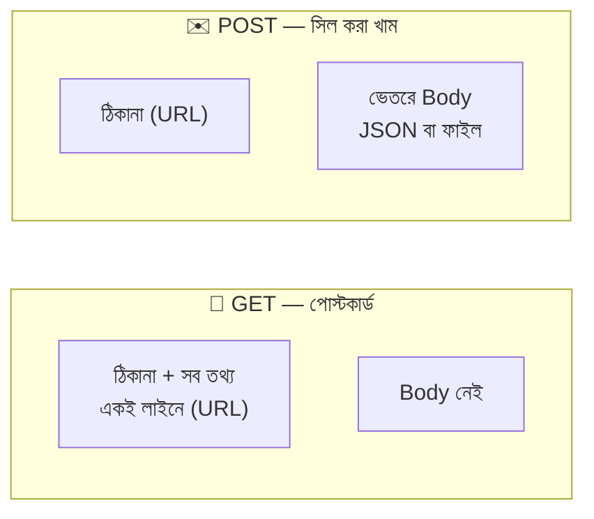

### বিস্তারিত তুলনা

| বিষয় | GET | POST |
|---|---|---|
| **উদ্দেশ্য** | ডেটা **চাওয়া/পড়া** | ডেটা **জমা দেওয়া/তৈরি করা/বদলানো** |
| **ডেটা কোথায় যায়** | URL-এ (query string) | Body-তে (URL-ও ব্যবহার করা যায়) |
| **Express-এ পড়ি** | `req.query`, `req.params` | `req.body` (+ `req.query`, `req.params`) |
| **Body থাকে?** | সাধারণত না | হ্যাঁ |
| **ডেটার পরিমাণ** | সীমিত — URL অনেক লম্বা করা যায় না, ব্রাউজার ও সার্ভারভেদে সীমা আছে | বড় ডেটা চলে (সার্ভারের সীমা পর্যন্ত) |
| **ফাইল আপলোড** | ❌ | ✅ (`multipart/form-data`) |
| **Safe (সার্ভারের কিছু বদলায় না)** | ✅ হ্যাঁ | ❌ না |
| **Idempotent (বারবার পাঠালেও একই ফল)** | ✅ হ্যাঁ | ❌ সাধারণত না (দুইবার পাঠালে দুইটা অর্ডার) |
| **ক্যাশ** | ব্রাউজার/CDN ক্যাশ করতে পারে | সাধারণত ক্যাশ হয় না |
| **বুকমার্ক/শেয়ার** | ✅ লিংক কপি করে পাঠানো যায় | ❌ যায় না |
| **Browser History ও Server Log** | URL-এর সব তথ্য থেকে যায় | body থাকে না (URL-এর অংশ থাকে) |
| **Refresh/Back বাটন** | নির্বিঘ্নে আবার লোড হয় | ব্রাউজার সতর্ক করে "আবার জমা দেবেন?" |
| **Content-Type header** | দরকার নেই | দরকার (body-র ধরন বলার জন্য) |
| **Address Bar থেকে পাঠানো** | ✅ যায় | ❌ যায় না (form/fetch/Postman লাগে) |

### একটা ভুল ধারণা ভাঙা: "POST মানেই নিরাপদ"

**না।** আসল সুরক্ষা আসে **HTTPS** থেকে, GET বা POST থেকে নয়। HTTPS দিলে পথে কেউ URL বা body কোনোটাই পড়তে পারে না — যেন দুটোকেই বুলেটপ্রুফ গাড়িতে পাঠানো হলো।

তাহলে পার্থক্য কোথায়? পোস্টকার্ডের লেখা গন্তব্যে পৌঁছেও **রয়ে যায়** — ব্রাউজারের history-তে, সার্ভারের log-এ, অন্য সাইটের Referer-এ। সিল করা খামের ভেতরের চিঠি ওসব জায়গায় লেখা হয় না। তাই **গোপন তথ্য (পাসওয়ার্ড, টোকেন) কখনো URL-এ যাবে না** — সেটা POST-এর body বা Header-এ যাবে। কিন্তু POST হলেই যে নিরাপদ, তা নয়; HTTPS আর সার্ভারের যাচাইও লাগবে।

---

## ১৪. When to use GET and when to use POST — কখন কোনটা

### সোনালি নিয়ম

> **GET = "আমাকে দেখাও"**, **POST = "আমার কিছু এটা করো"।**
> সার্ভারের কিছু বদলাচ্ছে? → POST। শুধু পড়ছে? → GET।

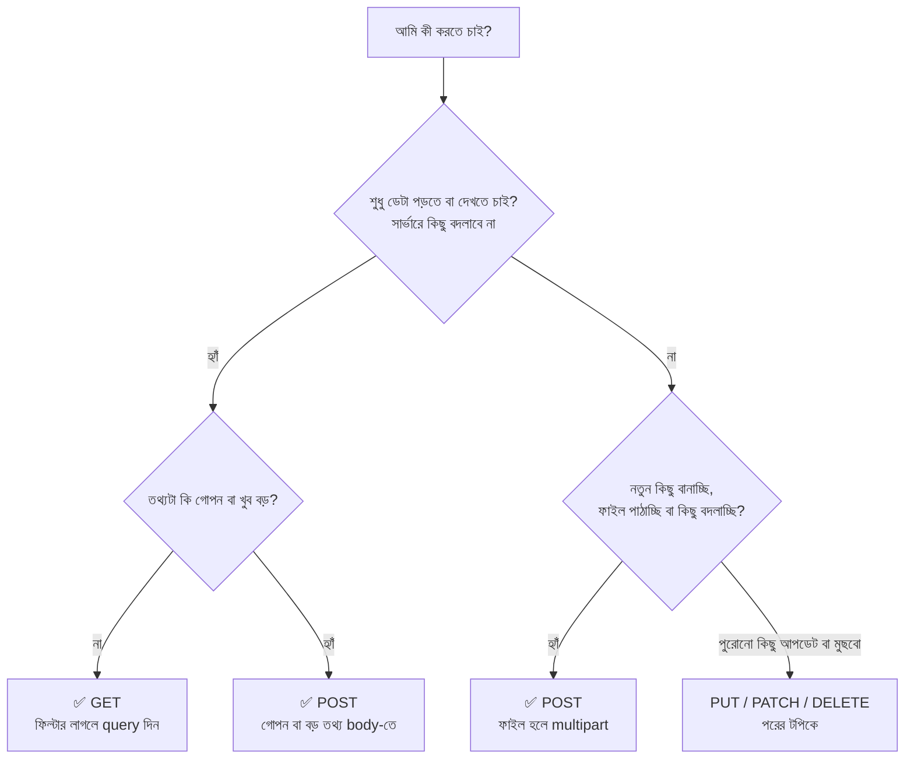

### বাস্তব উদাহরণ

| কাজ | Method | কেন |
|---|---|---|
| মেনু দেখা | `GET /menu` | শুধু পড়ছি |
| ক্যাটাগরি ফিল্টার | `GET /menu?category=main` | পড়ছি, ফিল্টার শেয়ারযোগ্য হওয়া ভালো |
| একটা আইটেম দেখা | `GET /menu/3` | পড়ছি |
| সার্চ | `GET /menu?q=বিরিয়ানি` | পড়ছি, লিংক শেয়ার করা যায় |
| পেজ ২ দেখা | `GET /menu?page=2` | পড়ছি |
| ছবি বা ফাইল ডাউনলোড | `GET /uploads/photo.jpg` | পড়ছি |
| অর্ডার দেওয়া | `POST /orders` | নতুন অর্ডার তৈরি হচ্ছে |
| লগইন | `POST /login` | পাসওয়ার্ড URL-এ যাবে না + সেশন তৈরি হয় |
| রেজিস্ট্রেশন | `POST /register` | নতুন ইউজার তৈরি |
| ছবি আপলোড | `POST /menu` (multipart) | ফাইল পাঠানো — GET-এ সম্ভবই না |
| লাইক দেওয়া | `POST /menu/2/like` | সার্ভারের ডেটা বদলাচ্ছে |
| যোগাযোগ ফর্ম | `POST /contact` | ডেটা জমা দেওয়া |
| লগআউট | `POST /logout` | অবস্থা বদলাচ্ছে |

### ⚠️ যে ভুল কখনো করবেন না — GET দিয়ে ডেটা বদলানো

```
GET /delete?id=5          ❌ ভুল
GET /orders/cancel?id=9   ❌ ভুল
```

কেন? কারণ GET-কে সবাই "নিরাপদ" ধরে নেয়। ব্রাউজারের prefetch, সার্চ ইঞ্জিনের crawler, চ্যাট অ্যাপের লিংক-প্রিভিউ — এরা লিংকে ঢুকে পড়ে, আর আপনার সব ডেটা মুছে যেতে পারে। যা বদলায় তা **POST/PUT/PATCH/DELETE** দিয়েই হবে।

### বোনাস: বাকি HTTP Method গুলো (পরের টপিকের আগাম আভাস)

| Method | কাজ | রেস্টুরেন্টের ভাষায় |
|---|---|---|
| `GET` | পড়া | মেনু দেখা |
| `POST` | নতুন কিছু তৈরি | নতুন অর্ডার দেওয়া |
| `PUT` | পুরোটা বদলে দেওয়া | অর্ডারটা পুরো নতুন করে লিখে দেওয়া |
| `PATCH` | আংশিক বদলানো | অর্ডারে শুধু "ঝাল কম" যোগ করা |
| `DELETE` | মুছে ফেলা | অর্ডার বাতিল করা |

---

## ১৫. সব একসাথে — পুরো Flow, সাধারণ ভুল আর সমাধান

### `server.js` ফাইলের সঠিক সাজানো ক্রম

সব কোড এক ফাইলে জোড়া লাগালে ক্রমটা এমন হবে:

```javascript
// 1. require গুলো ................... express, path, fs, multer
// 2. app, PORT, নকল ডেটা ............ menu, orders
// 3. app.disable("x-powered-by")
// 4. Application Middleware ......... logger → express.json() → express.urlencoded() → express.static (public)
// 5. Multer সেটআপ ................. uploadDir, EXT_BY_MIME, storage, fileFilter, upload
// 6. app.use("/uploads", express.static(uploadDir))
// 7. Route গুলো .................... GET, POST, (Route Middleware সহ)
// 8. ৪০৪ handler ................... app.use((req, res) => ...)
// 9. Error handler ................. app.use((err, req, res, next) => ...)
// 10. app.listen(...)
```

### একটা POST /menu request-এর পুরো যাত্রা

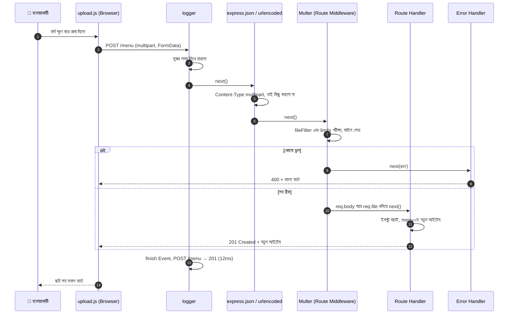

### সাধারণ ভুল ও সমাধান

| লক্ষণ | সম্ভাব্য কারণ | সমাধান |
|---|---|---|
| `Cannot GET /xyz` বা `Cannot POST /xyz` | path বা method মেলেনি | ঠিকানার বানান আর method দেখুন। মনে রাখুন Address Bar সবসময় GET পাঠায় |
| `req.body` হলো `undefined` | `express.json()` নেই, route-এর **পরে** বসেছে, অথবা `Content-Type` ভুল | route-এর আগে বসান আর client-এ `Content-Type: application/json` দিন |
| `Cannot destructure property 'x' of req.body as it is undefined` | ওপরের একই কারণ (Express 5-এ) | `req.body ?? {}` দিন আর কারণটাও ঠিক করুন |
| multipart পাঠালাম, কিন্তু `req.body` **খালি** | multipart-কে `express.json()` পড়তে পারে না | route-এ Multer বসান (`upload.single(...)` বা `upload.none()`) |
| `req.file` হলো `undefined` | `enctype` নেই, বা fetch-এ হাতে `Content-Type` লিখেছেন, বা ফাইল বাছেননি | `enctype="multipart/form-data"` দিন, header হাতে লিখবেন না |
| `MulterError: Unexpected field` | ফর্মের `name` আর `upload.single("...")`-এর নাম আলাদা | দুই জায়গায় নাম **হুবহু** মেলান (বড়-ছোট হাতের অক্ষরসহ) |
| `MulterError: File too large` | `limits.fileSize` পার হয়েছে | ছোট ফাইল দিন বা সীমা বাড়ান। Error handler-এ ভালো বার্তা দিন |
| `ENOENT: no such file or directory, open 'uploads/...'` | `uploads` ফোল্ডার নেই | `fs.mkdirSync(uploadDir, { recursive: true })` |
| Browser শুধু ঘুরতেই থাকে, উত্তর আসে না | middleware-এ `next()` ভুলে গেছেন, বা handler-এ `res.send/json` নেই | প্রতিটা পথে হয় `next()` নয় `res.xxx()` নিশ্চিত করুন |
| `Cannot set headers after they are sent to the client` | একই request-এ দুইবার উত্তর পাঠিয়েছেন | `if` এর ভেতরে `return res...` লিখুন |
| `413 Payload Too Large` | JSON body ১০০kb-র বেশি | `express.json({ limit: "1mb" })` বা ছোট ডেটা পাঠান |
| query-র সংখ্যা যোগ করলে অদ্ভুত ফল (`"10" + 5 = "105"`) | `req.query` আর `req.params`-এর মান সবসময় String | `Number(...)` দিয়ে রূপান্তর করুন |
| `req.query.category` কখনো String, কখনো array | একই key একাধিকবার এসেছে | `[].concat(req.query.category ?? [])` |
| Frontend আলাদা পোর্টে, request আটকে যাচ্ছে | CORS (আগের ফাইলের দারোয়ান) | `cors` middleware বা একই server থেকে frontend চালান |

---

## ১৬. সারসংক্ষেপ ও Practice আইডিয়া

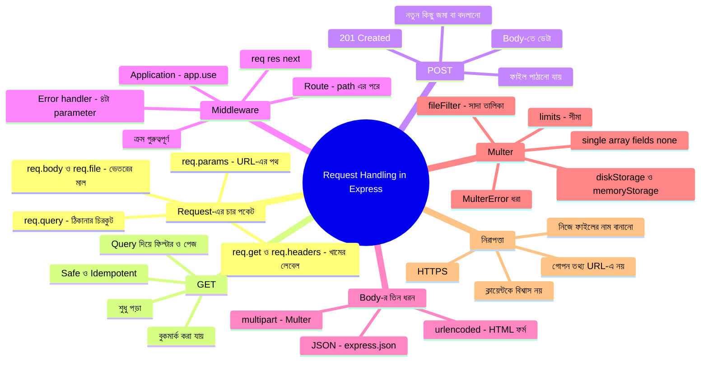

### গল্পের অভিধান — গল্পের কোনটা মানে কী

| গল্পে | টেকনিক্যাল নাম |
|---|---|
| রিসেপশন ডেস্ক | Express (`app`) |
| "মেনুটা দেখান" | GET |
| ঠিকানার ভেতরে টেবিল নম্বর | Route Params (`req.params`) |
| ঠিকানার শেষে চিরকুট | URL Query (`req.query`) |
| খামের গায়ে লেবেল | Header (`req.get`, `req.headers`) |
| চেকপোস্ট | Middleware |
| প্রধান গেটের গার্ড | Application Middleware (`app.use`) |
| VIP ঘরের দরজার গার্ড | Route Middleware |
| "যাও, পরের জনের কাছে" | `next()` |
| অভিযোগ ডেস্ক | Error-handling Middleware |
| "এই নিন আমার অর্ডার" | POST |
| গোছানো ছাপানো ফর্ম | `application/json` + `express.json()` |
| হাতে-লেখা সাধারণ ফর্ম | `x-www-form-urlencoded` + `express.urlencoded()` |
| পার্সেল বাক্স | `multipart/form-data` |
| বাক্সের খোপ আলাদা করার সীমানা-দাগ | `boundary` |
| গুদাম কর্মী | Multer |
| গুদামের তাক | `diskStorage` |
| রিসেপশনের টেবিলে কিছুক্ষণ রাখা | `memoryStorage` |
| পরীক্ষক | `fileFilter` |
| ওজন আর সংখ্যার সীমা | `limits` |
| পোস্টকার্ড | GET |
| সিল করা খাম | POST |
| বুলেটপ্রুফ গাড়ি | HTTPS |

### Practice-এর জন্য আইডিয়া

1. **পুরোটা নিজে হাতে টাইপ করে চালানো** — কপি-পেস্ট নয়, টাইপ করলে মাথায় থাকে। প্রতিটা সেকশনের route আলাদাভাবে Postman-এ টেস্ট করুন।
2. **`express.json()` সরিয়ে দেখুন** — `/orders`-এ POST করলে কী error আসে? তারপর route-এর *পরে* বসিয়ে দেখুন। ক্রমের গুরুত্ব হাতে-কলমে বুঝবেন।
3. **`upload.single("photo")`-এর নাম বদলে `"image"` করুন** — কিন্তু HTML-এ `name="photo"` রাখুন। `Unexpected field` error নিজের চোখে দেখুন, তারপর ঠিক করুন।
4. **`fileSize` ১০০KB করে বড় ছবি দিন** — `LIMIT_FILE_SIZE` এলো? আপনার বাংলা বার্তা দেখা যাচ্ছে?
5. **DevTools → Network ট্যাবে multipart request দেখুন** — `boundary` আর প্রতিটা খোপের `name` চিনে নিন।
6. **নতুন Route Middleware বানান** — `requireJson` (৯ নম্বর সেকশনে দেওয়া) কোনো POST route-এ বসিয়ে ভুল `Content-Type` দিয়ে টেস্ট করুন।
7. **`morgan` ইনস্টল করে** নিজের `logger`-এর সাথে আউটপুট তুলনা করুন।
8. **গ্যালারি ফিচার সম্পূর্ণ করুন** — `/gallery` আর `/restaurant/photos` route-এর জন্য নিজে একটা HTML ফর্ম বানান।
9. **পুরোনো ছবি মোছা** — কোনো আইটেম আপডেট (পরের টপিক) করার সময় পুরোনো ছবি `fs.promises.unlink` দিয়ে মুছে ফেলুন।
10. **আগের ফাইলের AI Recipe Helper-এ** ছবি আপলোড ফিচার জুড়ে দিন — ফ্রিজের ছবি দিলে AI বলবে কী রান্না করা যায়!

---
