# 🎨 স্বাদ-বাড়ির ইন্টেরিয়র ডিজাইনার: CSS-এর প্রথম পাঠ (Introduction থেকে Box Model)

> এই ডকুমেন্টটাও আগের ফাইলগুলোর মতোই **গল্প আকারে** লেখা, যাতে concept গুলো মুখস্থ না হয়ে মাথায় গেঁথে যায়।
> **মডিউল:** [Foundation] শিখে নেই CSS
> **এই ফাইলের টপিক:** CSS Introduction | How to Add CSS | Selectors (id, class, attribute) | Display: Block, Inline-Block, Inline | Background Colors, Height, Width, Min-Height, Min-Width | Box Model | Margin, Padding, Border Properties


## 📚 সূচিপত্র (Table of Contents)

1. [ভূমিকা: খালি ভবন আর ইন্টেরিয়র ডিজাইনারের গল্প](#ভূমিকা-খালি-ভবন-আর-ইন্টেরিয়র-ডিজাইনারের-গল্প)
2. [CSS Introduction — CSS আসলে কী?](#১-css-introduction--css-আসলে-কী)
3. [How to Add CSS — CSS যোগ করার তিন উপায়](#২-how-to-add-css--css-যোগ-করার-তিন-উপায়)
4. [Selectors — কাকে ডাকছি?](#৩-selectors--কাকে-ডাকছি)
5. [Display — কে কতটুকু জায়গা নেবে?](#৪-display--কে-কতটুকু-জায়গা-নেবে)
6. [Background, Height, Width, Min/Max — ঘরের রং ও মাপ](#৫-background-height-width-minmax--ঘরের-রং-ও-মাপ)
7. [Box Model — পিৎজার বক্সের গল্প](#৬-box-model--পিৎজার-বক্সের-গল্প)
8. [Margin, Padding, Border — বক্সের তিন স্তর](#৭-margin-padding-border--বক্সের-তিন-স্তর)
9. [সব একসাথে: মেনু কার্ড প্রজেক্ট](#৮-সব-একসাথে-মেনু-কার্ড-প্রজেক্ট)
10. [সাধারণ ভুল ও সমাধান](#৯-সাধারণ-ভুল-ও-সমাধান)
11. [সারসংক্ষেপ ও Practice আইডিয়া](#১০-সারসংক্ষেপ-ও-practice-আইডিয়া)


---

## ভূমিকা: খালি ভবন আর ইন্টেরিয়র ডিজাইনারের গল্প

কল্পনা করুন, আপনি **"স্বাদ-বাড়ি"** নামে একটা রেস্টুরেন্ট খুলেছেন। ভবন তৈরির কাজ শেষ — ইট-সিমেন্টের দেয়াল, দরজা-জানালা, টেবিল-চেয়ার, মেনু-বোর্ড, সবই আছে। কিন্তু উদ্বোধনের আগের দিন ভেতরে ঢুকে আপনি দেখলেন:

- দেয়াল সব ধূসর, কোথাও কোনো রং নেই
- টেবিলগুলো গায়ে গায়ে লেগে আছে, মাঝখান দিয়ে হাঁটার জায়গা নেই
- মেনু-বোর্ডের লেখা ছোট আর এক কোণে কুঁকড়ে পড়ে আছে

এই খালি ভবনটাই হলো **HTML**। সে শুধু বলতে পারে — *"এখানে একটা টেবিল আছে, ওখানে একটা মেনু আছে।"* কিন্তু সেটা **দেখতে কেমন হবে**, সেটা সে জানে না।

তখন আপনি ডেকে আনলেন একজন **ইন্টেরিয়র ডিজাইনার** — তার নাম **CSS**। সে ভবনের কাঠামো একটুও বদলায় না। শুধু বলে দেয়: *"সব টেবিল হবে কাঠের রঙের", "৭ নম্বর টেবিলের চারপাশে ২ ফুট ফাঁকা থাকবে", "মেনুর লেখা হবে বড় আর লাল"*।

আর তৃতীয়জন হলো **JavaScript** — সে বিদ্যুতের সুইচ আর কলিং-বেল। বাটন টিপলে কী ঘটবে, সেটা সে ঠিক করে।

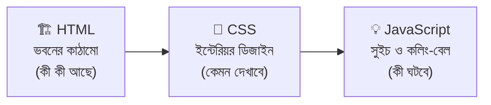

এই ডকুমেন্টে আমরা ডিজাইনারের **৭টা প্রাথমিক দক্ষতা** শিখবো:

| # | দক্ষতা (টপিক) | ডিজাইনারের ভাষায় |
|---|---|---|
| ১ | CSS Introduction | ডিজাইনার আসলে কে, কীভাবে কাজ করে |
| ২ | How to Add CSS | নির্দেশ কীভাবে পৌঁছে দেওয়া হয় |
| ৩ | Selectors | কাকে উদ্দেশ্য করে নির্দেশ দিচ্ছি |
| ৪ | Display | কে কতটুকু জায়গা দখল করে বসবে |
| ৫ | Background, Width, Height | দেয়ালের রং আর ঘরের মাপ |
| ৬ | Box Model | প্রতিটা জিনিস একটা "বক্স" — তার গঠন |
| ৭ | Margin, Padding, Border | বক্সের ভেতর-বাইরের ফাঁকা জায়গা আর দেয়াল |

---

## ১. CSS Introduction — CSS আসলে কী?

**CSS** = **C**ascading **S**tyle **S**heets। শব্দ ভেঙে গল্পে বসাই:

| শব্দ | মানে | ডিজাইনারের ভাষায় |
|---|---|---|
| **Cascading** | ঝরনার মতো ধাপে ধাপে নেমে আসা | একই চেয়ার নিয়ে একাধিক নির্দেশ এলে কোনটা জিতবে, তার নিয়ম আছে (পরের ফাইলে *Specificity*-তে দেখবো) |
| **Style** | সাজ, ধরন | রং, মাপ, দূরত্ব, হরফ |
| **Sheets** | নিয়মের পাতা | ডিজাইনারের নির্দেশ-খাতা |

### কেন CSS লাগে?

- **আলাদা করে রাখা (Separation of Concerns):** কাঠামো (HTML) আর সাজ (CSS) আলাদা থাকলে দুটোই পরিষ্কার থাকে।
- **একবার লিখে সবখানে:** একটা CSS ফাইল বদলালে পুরো সাইটের ১০০টা পেজ একসাথে বদলে যায়।
- **সামঞ্জস্য:** সব বাটন, সব হেডিং একই রকম দেখায়।
- **Responsive:** একই HTML মোবাইল আর ডেস্কটপে আলাদা সাজে দেখানো যায়।

### CSS-এর গঠন (Syntax Anatomy)

```css
h1 {                  /* h1 = Selector: কাকে সাজাবো → পেজের সব <h1> ট্যাগকে */
  color: tomato;      /* color = Property (কী বদলাবো: লেখার রং), tomato = Value (কী দিয়ে বদলাবো) */
  font-size: 32px;    /* প্রতিটা নির্দেশ ; (সেমিকোলন) দিয়ে শেষ — ভুলে গেলে পরের লাইনটা কাজ করবে না */
}                     /* { } = Declaration Block: এক Selector-এর সব নির্দেশের ঝুড়ি */
```

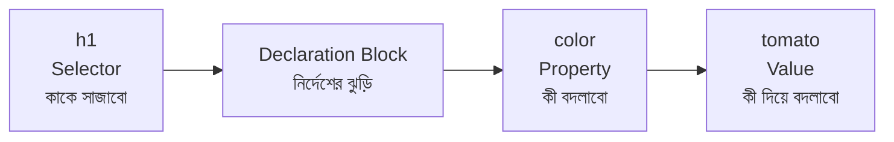

দরকারি ছোট নিয়মগুলো:

| নিয়ম | উদাহরণ | কেন |
|---|---|---|
| Comment লেখা | `/* এটা কমেন্ট */` | CSS-এ `//` চলে না, শুধু `/* */` |
| Property-Value-র মাঝে `:` | `color: red;` | Property আর Value আলাদা করে |
| একাধিক Value | `margin: 10px 20px;` | space দিয়ে আলাদা হয় |
| নাম লেখার ধরন | `.menu-card` (kebab-case) | class/id-র নাম **case-sensitive**, তাই ছোট হাতের অক্ষর আর `-` দিয়ে লেখা নিরাপদ |

### ব্রাউজার CSS-কে কীভাবে কাজে লাগায়?

ডিজাইনারের খাতা আর ভবনের নকশা — ব্রাউজার দুটোই আলাদা করে পড়ে, তারপর মিলিয়ে ছবি আঁকে:

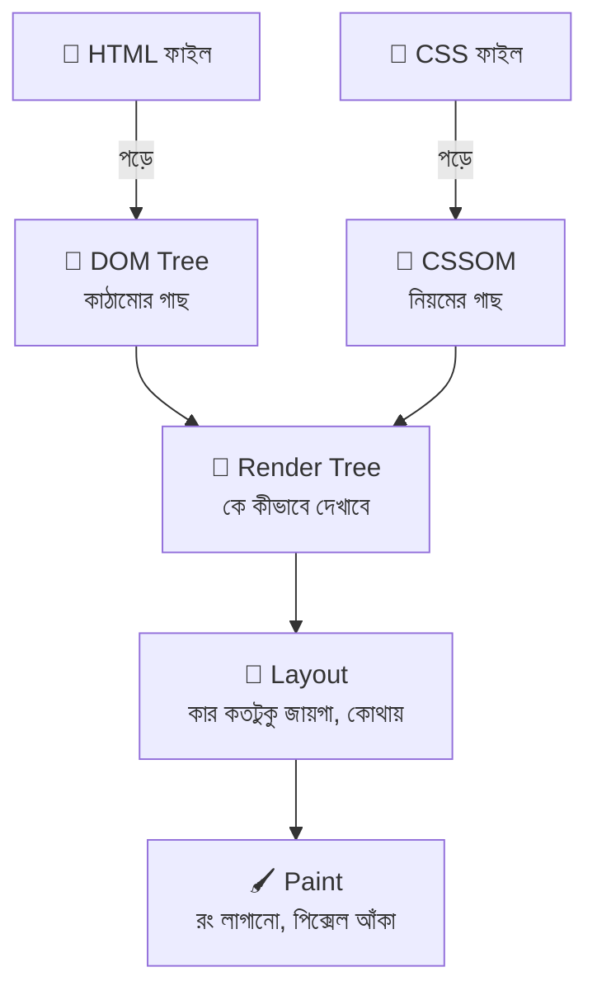

> **একটা মজার তথ্য:** `display: none` দেওয়া জিনিস Render Tree-তেই ঢোকে না — যেন সে ঘরে নেই। আর `visibility: hidden` দিলে সে ঘরে থাকে, জায়গাও নেয়, শুধু অদৃশ্য।

### একই HTML — CSS-এর আগে আর পরে

```html
<!-- HTML: শুধু কাঠামো -->
<h1>স্বাদ-বাড়ি</h1>
<p>ঘরের স্বাদ, বাড়ির মতো যত্ন</p>
```

```css
/* CSS: শুধু সাজ */
h1 {
  color: #e63946;        /* #e63946 = লালচে রং (HEX কোড)। হেডিং যেন দূর থেকেই চোখে পড়ে */
  font-size: 40px;       /* 40px = হেডিং পেজের সবচেয়ে বড় লেখা, তাই সাধারণ লেখার (16px) চেয়ে অনেক বড় */
}

p {
  color: #555;           /* #555 = গাঢ় ধূসর। একদম কালো না দিয়ে ধূসর দিলে চোখে আরাম লাগে */
  font-size: 18px;       /* 18px = পড়তে আরামদায়ক মাপ */
}
```

HTML একটুও বদলায়নি — শুধু CSS যোগ করে চেহারা পাল্টে গেছে। এটাই CSS-এর জাদু ✨

### ইতিহাসের এক ঝলক

| সাল | ঘটনা |
|---|---|
| ১৯৯৪ | Håkon Wium Lie CSS-এর প্রস্তাব দেন |
| ১৯৯৬ | **CSS1** — W3C-র অফিশিয়াল সুপারিশ (Recommendation) হয় |
| ১৯৯৮ | **CSS2** |
| ২০০০-এর দশক থেকে | **CSS3** — এটা এক বিশাল ফাইল নয়, বরং *অনেকগুলো আলাদা মডিউল* (Selectors, Colors, Flexbox, Grid…)। এখন আর "CSS4" নামে ভার্সন হয় না, প্রতিটা মডিউল নিজের গতিতে এগোয় |

---

## ২. How to Add CSS — CSS যোগ করার তিন উপায়

ডিজাইনার তার নির্দেশ তিনভাবে পৌঁছে দিতে পারে:

1. **Inline** — প্রতিটা জিনিসের গায়ে আলাদা **চিরকুট** সেঁটে দেওয়া
2. **Internal** — ম্যানেজারের ঘরের দেয়ালে একটা **নোটিস-বোর্ড** টাঙিয়ে দেওয়া (শুধু ওই ঘরের জন্য)
3. **External** — আলাদা একটা **ডিজাইন-ম্যানুয়াল বই** বানানো, যেটা রেস্টুরেন্টের সব শাখা (সব পেজ) পড়তে পারে

### উপায় ১: Inline CSS — চিরকুট

```html
<h1 style="color: tomato; font-size: 32px;">স্বাদ-বাড়ি</h1>
<!--
  style = HTML attribute। এর ভেতরে সরাসরি CSS লেখা যায়
  color: tomato; font-size: 32px; = property: value; জোড়াগুলো ; দিয়ে আলাদা
  এখানে Selector লাগে না, কারণ চিরকুটটা যে ট্যাগে সাঁটা, নির্দেশ শুধু তার জন্যই
-->
```

### উপায় ২: Internal CSS — নোটিস-বোর্ড

```html
<!DOCTYPE html>
<html lang="bn">
<head>
  <meta charset="UTF-8">
  <title>স্বাদ-বাড়ি</title>

  <style>
    /* <style> ট্যাগ = এই পেজের ভেতরেই CSS লেখার জায়গা। সাধারণত <head>-এর ভেতরে রাখা হয় */
    h1 { color: tomato; }        /* এই পেজের সব h1 */
    p  { line-height: 1.8; }     /* line-height = লাইনের উচ্চতা। 1.8 মানে লেখার সাইজের ১.৮ গুণ, পড়তে আরাম */
  </style>
</head>
<body>
  <h1>স্বাদ-বাড়ি</h1>
  <p>ঘরের স্বাদ, বাড়ির মতো যত্ন</p>
</body>
</html>
```

### উপায় ৩: External CSS — ডিজাইন-ম্যানুয়াল বই ✅

ফোল্ডার সাজানো এমন:

```
📦 swad-bari/
 ┣ 📜 index.html
 ┗ 📂 css/
   ┗ 📜 style.css
```

**`index.html`**

```html
<head>
  <meta charset="UTF-8">
  <title>স্বাদ-বাড়ি</title>

  <link rel="stylesheet" href="css/style.css">
  <!--
    <link> = বাইরের ফাইলের সাথে সংযোগ। এটা self-closing, তাই আলাদা বন্ধ ট্যাগ নেই
    rel="stylesheet" = "এই ফাইলটা আসলে একটা stylesheet" — ব্রাউজারকে সম্পর্কটা বলে দিচ্ছি
    href="css/style.css" = ফাইলটা কোথায় আছে তার ঠিকানা (এই HTML ফাইলের সাপেক্ষে)
  -->
</head>
```

**`css/style.css`**

```css
/* এই ফাইলে <style> ট্যাগ লাগে না — শুধু সরাসরি CSS নিয়ম লিখলেই হয় */
h1 { color: tomato; }
p  { line-height: 1.8; }
```

### তিন উপায়ের তুলনা

| বিষয় | Inline | Internal | External |
|---|---|---|---|
| কোথায় লেখা হয় | ট্যাগের `style` attribute-এ | `<style>` ট্যাগে | আলাদা `.css` ফাইলে |
| কতগুলো পেজে কাজ করে | শুধু ওই একটা ট্যাগে | শুধু ওই একটা পেজে | **যতগুলো পেজ `<link>` করবে** |
| পুনর্ব্যবহার (Reuse) | ❌ নেই | ⚠️ কম | ✅ সবচেয়ে বেশি |
| ব্রাউজার Cache করে? | ❌ | ❌ (HTML-এর সাথে যায়) | ✅ একবার নামালে আবার নামায় না → সাইট দ্রুত |
| Specificity (জোর) | সবচেয়ে বেশি | সাধারণ | সাধারণ |
| কখন ব্যবহার | দ্রুত টেস্ট, ইমেইল টেমপ্লেট, JS দিয়ে ডাইনামিক মান | একপেজের ছোট ডেমো | ✅ **সব বাস্তব প্রজেক্টে** |

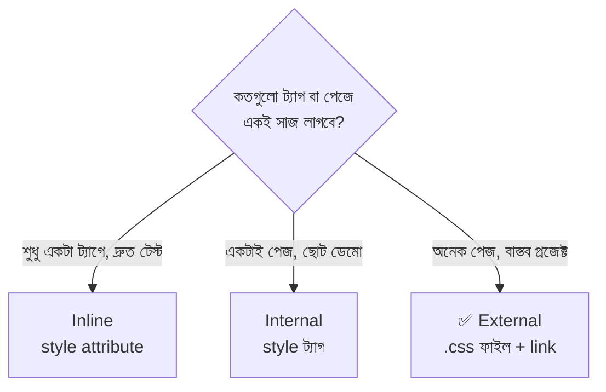

### কার নির্দেশ জিতবে? (ছোট্ট ঝলক)

একই জিনিস নিয়ে দুটো নির্দেশ এলে সাধারণ নিয়ম:

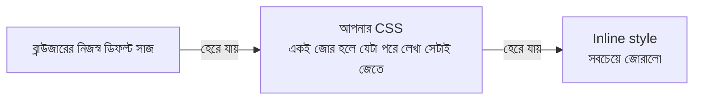

> **গুরুত্বপূর্ণ:** external আর internal-এর মধ্যে "কে বড়" এমন কোনো নিয়ম নেই — যেটা **HTML-এ পরে আসে** সেটাই জেতে (জোর সমান হলে)। তাই `<link>` আগে, `<style>` পরে লিখলে `<style>` জিতবে। বিস্তারিত পরের ফাইলে (Specificity)।

### আরও কিছু জানার মতো জিনিস

**১. একাধিক CSS ফাইল যোগ করা:**

```html
<link rel="stylesheet" href="css/reset.css">   <!-- আগে reset: ব্রাউজারের ডিফল্ট সাজ মুছে ফেলা -->
<link rel="stylesheet" href="css/style.css">   <!-- পরে নিজের সাজ: যাতে reset-এর উপরে জিততে পারে -->
```

**২. ঠিকানা লেখার তিন ধরন:**

```html
<link rel="stylesheet" href="css/style.css">                  <!-- Relative: এই ফাইলের পাশের ফোল্ডার থেকে -->
<link rel="stylesheet" href="/assets/css/style.css">          <!-- Root-relative: ওয়েবসাইটের একদম মূল ফোল্ডার থেকে -->
<link rel="stylesheet" href="https://cdn.example.com/lib.css"> <!-- Absolute: অন্য সার্ভারের (CDN) ফাইল -->
```

**৩. শর্ত দিয়ে লোড (`media` attribute):**

```html
<link rel="stylesheet" href="css/print.css" media="print">
<!-- media="print" = এই ফাইলটা শুধু প্রিন্ট করার সময় কাজ করবে -->
```

**৪. `@import` — CSS-এর ভেতর থেকে অন্য CSS ডাকা:**

```css
@import url("fonts.css");   /* অন্য CSS ফাইল ঢোকানো। অবশ্যই ফাইলের সবার উপরে লিখতে হয় */
```

> `@import` ধীর — ব্রাউজার আগে মূল CSS নামায়, পড়ে দেখে, *তারপর* ভেতরের ফাইল নামাতে যায় (একটার পর একটা)। তাই বাস্তব প্রজেক্টে `<link>` ব্যবহারই ভালো।

**৫. ব্রাউজারের নিজস্ব ডিফল্ট সাজ (User-Agent Stylesheet):**

আপনি কোনো CSS না লিখলেও `<h1>` বড় আর মোটা দেখায়, `<a>` নীল আর আন্ডারলাইন করা, `<body>`-র চারপাশে ৮px ফাঁকা থাকে। কারণ ব্রাউজারের নিজের একটা লুকানো stylesheet আছে। এই কারণে অনেকে শুরুতেই একটা **reset** লেখেন:

```css
* {                        /* * = Universal Selector: পেজের সবকিছু */
  margin: 0;               /* ব্রাউজারের দেওয়া ডিফল্ট বাইরের ফাঁকা মুছে দিলাম, এখন নিজে ঠিক করবো */
  padding: 0;              /* ডিফল্ট ভেতরের ফাঁকা মুছলাম */
  box-sizing: border-box;  /* মাপের হিসাব সহজ করার জন্য — কেন, সেটা Box Model অংশে বুঝবো */
}
```

---

## ৩. Selectors — কাকে ডাকছি?

ডিজাইনার নির্দেশ দেওয়ার আগে ঠিক করে নেয় **কাকে উদ্দেশ্য করে** বলছে। রেস্টুরেন্টে সে হাঁক দেয়:

- 📢 *"সব চেয়ার!"* → **Element (Type) Selector**
- 📢 *"লাল স্টিকার লাগানো সব টেবিল!"* → **Class Selector**
- 📢 *"৭ নম্বর টেবিল!"* (পুরো রেস্টুরেন্টে একটাই) → **ID Selector**
- 📢 *"যে টেবিলে 'রিজার্ভড' কার্ড আছে!"* → **Attribute Selector**
- 📢 *"সবাই!"* → **Universal Selector**

এই অংশের সব উদাহরণে আমরা একটাই HTML ব্যবহার করবো:

```html
<section id="menu" class="menu-box">
  <h2 class="title">আজকের মেনু</h2>
  <p class="note">সব খাবার তাজা</p>
  <ul class="dish-list">
    <li class="dish special">বিরিয়ানি</li>
    <li class="dish">খিচুড়ি</li>
    <li class="dish sold-out">ইলিশ ভাজা</li>
  </ul>
  <a href="https://example.com/order.pdf" target="_blank" data-type="order">অর্ডার করুন</a>
</section>
```

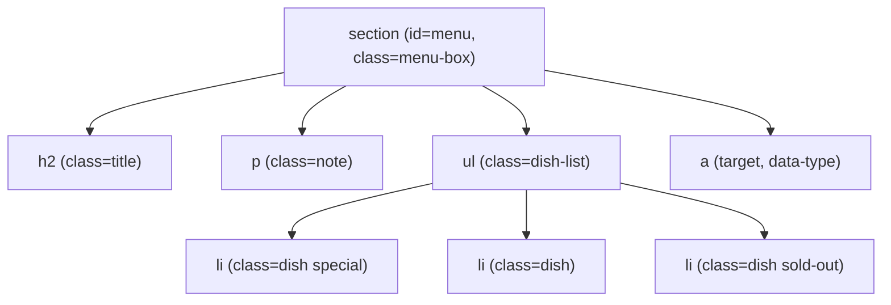

### ৩.১ Universal Selector — `*`

```css
* {
  box-sizing: border-box;   /* * = সব element। যা সবার জন্য একই, সেটা একবারেই বলে দেওয়া যায় */
}
```

### ৩.২ Element (Type) Selector — ট্যাগের নাম দিয়ে

```css
h2 { color: #e63946; }   /* h2 = ট্যাগের নাম, কোনো চিহ্ন লাগে না। পেজের প্রতিটা <h2> এই রং পাবে */
li { list-style: none; } /* list-style: none = <li>-এর আগের ডটটা সরানো */
```

### ৩.৩ Class Selector — `.` (ডট) দিয়ে

Class হলো **স্টিকার**। একই স্টিকার অনেক জিনিসে লাগানো যায়, আবার একটা জিনিসে একাধিক স্টিকারও লাগানো যায়।

```css
.dish {                          /* . = "এটা class-এর নাম"। HTML-এ class="dish", CSS-এ .dish */
  padding: 10px;                 /* সব খাবারের আইটেমেই একই ফাঁকা — তাই class, কারণ এটা একাধিক জায়গায় লাগবে */
}

.special {                       /* একটা আলাদা স্টিকার: শুধু "স্পেশাল" আইটেমের জন্য */
  background-color: #fff3cd;     /* হালকা হলুদ, যাতে স্পেশাল আইটেম আলাদা করে চোখে পড়ে */
}
```

```html
<li class="dish special">বিরিয়ানি</li>
<!-- class="dish special" = দুটো স্টিকার, space দিয়ে আলাদা। বিরিয়ানি .dish আর .special দুটোরই সাজ পাবে -->
```

### ৩.৪ ID Selector — `#` (হ্যাশ) দিয়ে

ID হলো **৭ নম্বর টেবিলের নম্বর-প্লেট** — পুরো পেজে একটাই, দ্বিতীয়বার ব্যবহার করা যাবে না।

```css
#menu {                          /* # = "এটা id-এর নাম"। HTML-এ id="menu", CSS-এ #menu */
  max-width: 600px;              /* পুরো পেজে মেনু-সেকশন একটাই, তাই id ব্যবহার করা যায় */
}
```

| তুলনা | Class (`.`) | ID (`#`) |
|---|---|---|
| একটা পেজে কতবার | যতবার খুশি | ❌ **শুধু একবার** |
| একটা ট্যাগে কয়টা | একাধিক (`class="a b c"`) | একটাই |
| Specificity (জোর) | মাঝারি | **অনেক বেশি** (ফলে পরে override করা কঠিন) |
| অন্য কাজ | শুধু সাজ | `#top` লিংক দিয়ে পেজের ওই জায়গায় লাফ দেওয়া, JS-এ খোঁজা |
| **কোনটা বেছে নেবো?** | ✅ সাজের জন্য সাধারণত **class** | ID দিয়ে সাজ না দেওয়াই ভালো |

> **নামকরণের নিয়ম:** class/id-র নামে space থাকতে পারবে না, সংখ্যা দিয়ে শুরু করা যাবে না, বড়-ছোট হাতের অক্ষর আলাদা ধরা হয় (`Menu` আর `menu` দুটো আলাদা নাম)।

### ৩.৫ Attribute Selector — `[ ]` দিয়ে

HTML ট্যাগের **attribute (বৈশিষ্ট্য)** দেখে খোঁজা। ধরুন ডিজাইনার বলছে: *"যেসব লিংক PDF ফাইলের, শুধু সেগুলোয় আলাদা রং দাও।"*

```css
a[target] { }                  /* [target] = target attribute আছে এমন সব <a>, মান যা-ই হোক */
a[target="_blank"] { }         /* [attr="মান"] = মান হুবহু "_blank" হতে হবে */
a[href^="https"] { }           /* ^= = "এই দিয়ে শুরু": href https দিয়ে শুরু (নিরাপদ লিংক) */
a[href$=".pdf"] { }            /* $= = "এই দিয়ে শেষ": href .pdf দিয়ে শেষ */
a[href*="example"] { }         /* *= = "ভেতরে কোথাও আছে": href-এর যেকোনো জায়গায় example */
[class~="special"] { }         /* ~= = space-দিয়ে-আলাদা শব্দের তালিকায় পুরো শব্দ "special" আছে */
[lang|="en"] { }               /* |= = হুবহু "en" অথবা "en-" দিয়ে শুরু (যেমন en-US) */
a[href$=".PDF" i] { }          /* i = case-insensitive: .pdf, .PDF, .Pdf — সবই ধরবে */
```

| চিহ্ন | মানে | সহজ মনে রাখা |
|---|---|---|
| `[a]` | attribute আছে | "আছে কি নেই" |
| `[a="x"]` | হুবহু `x` | "পুরো মিল" |
| `[a^="x"]` | `x` দিয়ে **শুরু** | `^` = মাথা / শুরু |
| `[a$="x"]` | `x` দিয়ে **শেষ** | `$` = শেষ (regex-এ যেমন) |
| `[a*="x"]` | ভেতরে **কোথাও** `x` | `*` = যেকোনো কিছু |
| `[a~="x"]` | space-তালিকায় শব্দ `x` | তালিকা থেকে খোঁজা |
| `[a\|="x"]` | `x` অথবা `x-…` | ভাষা কোডের জন্য |

```css
/* বাস্তব উদাহরণ */
a[href^="http"]::after {         /* ::after পরের ফাইলে পড়বো। এখানে শুধু দেখুন attribute selector কতটা কাজের */
  content: " ↗";                 /* বাইরের লিংকের পাশে ছোট তীর */
}

input[type="email"] {            /* type="email" এমন input-ই ধরবে। text, password input-এ প্রভাব পড়বে না */
  border: 1px solid #2a9d8f;
}
```

### ৩.৬ Grouping — কমা (`,`) দিয়ে একসাথে ডাকা

```css
h1, h2, h3 {                       /* কমা = "আর"। তিনজনকেই একসাথে ডাকলাম */
  font-family: "Noto Sans Bengali", sans-serif;   /* তিন হেডিংয়ের জন্য একই ফন্ট — তিনবার লিখতে হলো না */
}
```

> ⚠️ কমা দিয়ে লেখা তালিকার **একটা selector ভুল হলে পুরো লাইনটাই বাতিল** হয়ে যায়। তাই কমার পরে ভুল টাইপ করলে বাকিগুলোও কাজ করবে না।

### ৩.৭ Combinators — সম্পর্ক ধরে ডাকা

এবার আত্মীয়তার সম্পর্ক ধরে ডাকার পালা: *"বাড়ির ভেতরের যেকোনো ছেলে", "সরাসরি সন্তান", "ঠিক পরের ভাই"…*

```html
<div class="box">
  <p>১ নং</p>
  <p>২ নং</p>
  <div class="inner">
    <p>৩ নং (নাতি)</p>
  </div>
  <p>৪ নং</p>
</div>
```

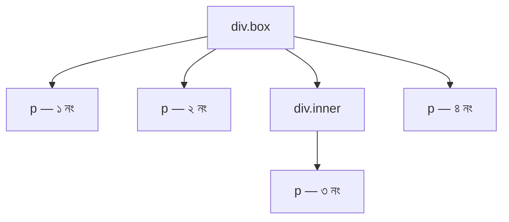

```css
.box p { }       /* Descendant (space): .box-এর ভেতরের সব p — সন্তান, নাতি, যত গভীরেই থাক → ১, ২, ৩, ৪ */
.box > p { }     /* Child (>): শুধু সরাসরি সন্তান p → ১, ২, ৪ (৩ বাদ, কারণ সে নাতি) */
p + p { }        /* Adjacent Sibling (+): যে p-এর ঠিক আগেই আরেকটা p আছে → শুধু ২ */
.inner ~ p { }   /* General Sibling (~): .inner-এর পরে আসা একই স্তরের সব p → ৪ */
```

| Combinator | চিহ্ন | সম্পর্ক | মনে রাখার গল্প |
|---|---|---|---|
| Descendant | ` ` (space) | বংশধর (যত নিচেই হোক) | "এই বাড়ির যেকোনো সদস্য" |
| Child | `>` | সরাসরি সন্তান | "আমার নিজের ছেলে-মেয়ে" |
| Adjacent Sibling | `+` | ঠিক পরের ভাই | "আমার ঠিক পরে জন্মানো ভাই" |
| General Sibling | `~` | পরের সব ভাই | "আমার পরে জন্মানো সব ভাই-বোন" |

### ৩.৮ Compound Selector — একাধিক শর্ত জোড়া লাগানো

মাঝখানে **space নেই** মানে "একই element-এর ওপর সব শর্ত একসাথে মিলতে হবে"।

```css
li.special { }          /* li ট্যাগ এবং তার class special — দুটোই মিলতে হবে */
.dish.sold-out { }      /* একই element-এ .dish এবং .sold-out — দুটো class-ই থাকতে হবে */
a[target="_blank"].btn { }  /* target="_blank" আছে এবং class btn আছে */
```

> ⚠️ `.dish .sold-out` (মাঝে space) মানে সম্পূর্ণ আলাদা — "`.dish`-এর **ভেতরের** `.sold-out`"। এই এক space-এর ভুলে অনেকের সাজ কাজ করে না!

### ৩.৯ Selector চিটশিট

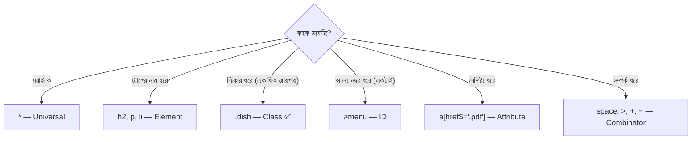

---

## ৪. Display — কে কতটুকু জায়গা নেবে?

স্বাদ-বাড়িতে মেহমানরা বসেন চার রকমে:

- 🛋️ **Block** — এমন VIP মেহমান, যে পুরো সারি একাই দখল করে বসে। পাশে আর কাউকে বসতে দেয় না। তাকে আপনি যত বড় সোফা দিতে চান, দিতে পারেন।
- 🚌 **Inline** — বাসের বেঞ্চে পাশাপাশি বসা যাত্রী। যতটুকু জায়গা লাগে, ঠিক ততটুকুই নেয়। আপনি তাকে বলতে পারবেন না "তুমি ২ ফুট চওড়া হও" — সে নিজের শরীরের মাপেই থাকবে।
- 🪑 **Inline-Block** — পাশাপাশিই বসে, কিন্তু সাথে নিজের একটা **ছোট টেবিল নিয়ে** আসে। তাই টেবিলের মাপ (চওড়া-উচ্চতা) আপনি ঠিক করে দিতে পারেন।
- 👻 **None** — একদম অদৃশ্য। যেন সে রেস্টুরেন্টে আসেইনি, জায়গাও নেয় না।

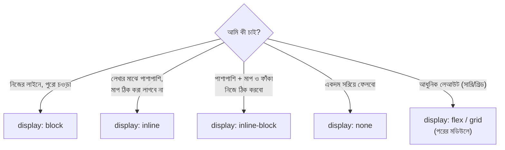

### প্রতিটা ট্যাগের ডিফল্ট Display

প্রতিটা HTML ট্যাগ নিজের সাথে একটা ডিফল্ট `display` নিয়ে জন্মায়:

| ডিফল্ট | কোন কোন ট্যাগ |
|---|---|
| **block** | `div`, `p`, `h1`–`h6`, `ul`, `ol`, `section`, `header`, `footer`, `main`, `form` |
| **inline** | `span`, `a`, `strong`, `em`, `label`, `code` |
| **inline-block (প্রায়)** | `button`, `input`, `select`, `textarea` |
| **list-item** | `li` |
| ⚠️ **বিশেষ: `img`** | দেখতে `inline`, কিন্তু এটা *replaced element* — তাই `width`/`height` মানে |

### তিনটার আচরণ পাশাপাশি

| বৈশিষ্ট্য | block | inline | inline-block |
|---|---|---|---|
| নতুন লাইনে শুরু হয় | ✅ হ্যাঁ | ❌ না | ❌ না |
| ডিফল্ট চওড়া | পুরো পাশের জায়গা | শুধু কন্টেন্টের সমান | শুধু কন্টেন্টের সমান |
| `width` / `height` কাজ করে | ✅ | ❌ (ignore করে) | ✅ |
| উপর-নিচ `margin` | ✅ | ❌ (ignore করে) | ✅ |
| ডান-বাম `margin` | ✅ | ✅ | ✅ |
| উপর-নিচ `padding` | ✅ জায়গা নেয় | ⚠️ আঁকা হয়, কিন্তু আশপাশের লাইন ঠেলে না (উপরে-নিচে চড়ে বসে) | ✅ জায়গা নেয় |

### হাতে-কলমে

```html
<div class="demo block-box">Block</div>
<span class="demo inline-box">Inline ১</span>
<span class="demo inline-box">Inline ২</span>
<span class="demo inline-block-box">Inline-Block ১</span>
<span class="demo inline-block-box">Inline-Block ২</span>
```

```css
.demo {                           /* .demo = তিন রকম বক্সের সবার জন্য যা কমন, সেটা এখানে */
  background-color: #ffd6a5;      /* হালকা কমলা — বক্সের সীমানা চোখে দেখার জন্য */
  border: 2px solid #e76f51;      /* গাঢ় কমলা বর্ডার — কে কতটুকু জায়গা নিলো তা বোঝার জন্য */
  width: 150px;                   /* ১৫০px চওড়া — দেখবো কার ক্ষেত্রে এটা কাজ করে, কার ক্ষেত্রে করে না */
  height: 60px;                   /* ৬০px উচ্চতা — একই পরীক্ষা */
  margin: 10px;                   /* চারদিকে ১০px ফাঁকা — উপর-নিচের margin inline-এ ignore হবে কিনা দেখবো */
}

.block-box { display: block; }               /* width, height কাজ করবে; নতুন লাইনে বসবে */
.inline-box { display: inline; }             /* width, height, উপর-নিচ margin — সব ignore! শুধু লেখার মাপে থাকবে */
.inline-block-box { display: inline-block; } /* পাশাপাশি বসবে + width, height, margin সব কাজ করবে */
```

### ছোট্ট ঝামেলা: Inline-Block-এর মাঝের অদৃশ্য ফাঁক

HTML-এ দুটো ট্যাগের মাঝে যে Enter বা space থাকে, ব্রাউজার সেটাকে একটা **space অক্ষর** হিসেবে ধরে। তাই inline-block বক্সগুলোর মাঝে প্রায় ৪px অদৃশ্য ফাঁক দেখা যায়।

```css
.parent { font-size: 0; }       /* উপায় ১: parent-এর ফন্ট-সাইজ 0 করলে space অক্ষরের চওড়াও 0 হয়ে যায় */
.parent > .item {
  font-size: 16px;              /* কিন্তু সন্তানদের লেখা যেন হারিয়ে না যায়, তাই ফন্ট-সাইজ ফিরিয়ে দিলাম */
  display: inline-block;
}
/* উপায় ২: ট্যাগগুলো মাঝে space ছাড়া লেখা (দেখতে কুৎসিত) */
/* উপায় ৩ (আধুনিক ও সেরা): display: flex ব্যবহার করা — পরের মডিউলে */
```

### `display: none` vs `visibility: hidden` vs `opacity: 0`

তিনটাই জিনিসটাকে অদৃশ্য করে, কিন্তু গল্প আলাদা:

| | `display: none` | `visibility: hidden` | `opacity: 0` |
|---|---|---|---|
| গল্প | মেহমান আসেইনি | মেহমান বসে আছে, কিন্তু অদৃশ্য পোশাকে | মেহমান বসে আছে, কাঁচের মতো স্বচ্ছ |
| জায়গা নেয় | ❌ না | ✅ হ্যাঁ | ✅ হ্যাঁ |
| ক্লিক করা যায় | ❌ | ❌ | ✅ **এখনো যায়!** |
| স্ক্রিন-রিডার পড়ে | ❌ | ❌ | ✅ পড়ে |
| Animation/Transition | ⚠️ সহজে হয় না | ✅ | ✅ |

### `display`-এর অন্যান্য মান (এক নজরে)

| মান | কী করে |
|---|---|
| `flex` / `inline-flex` | সারি বা কলামে সাজানোর আধুনিক লেআউট |
| `grid` / `inline-grid` | সারি ও কলাম — দুই দিকেই সাজানোর লেআউট |
| `list-item` | `<li>`-র মতো আচরণ (ডট/নম্বর সহ) |
| `table`, `table-row`, `table-cell` | HTML `<table>` ছাড়াই টেবিলের মতো আচরণ |
| `contents` | element নিজের বক্স হারায়, শুধু তার সন্তানরা থাকে |
| `flow-root` | নিজের আলাদা "ঘর" বানায় — float আর margin-collapse সমস্যা মেটায় |

---

## ৫. Background, Height, Width, Min/Max — ঘরের রং ও মাপ

ডিজাইনারের এবার দুটো কাজ: (১) **দেয়ালে রং বা ওয়ালপেপার লাগানো**, (২) **ঘরের মাপ ঠিক করা**। আর মাপ ঠিক করতে গিয়ে সে একটা চালাকি শিখলো — **রবারের দেয়াল**: যেটা ছোট-বড় হতে পারে, কিন্তু একটা ন্যূনতম আর একটা সর্বোচ্চ সীমা মেনে চলে।

### ৫.১ Background — দেয়ালের সাজ

```css
.hero {
  background-color: #222;
  /* ছবি লোড না হলেও যেন গাঢ় একটা রং থাকে (ছবির নিচের "ভরসা")। লেখা সাদা হলে অন্তত পড়া যাবে */

  background-image: url("../img/hero.jpg");
  /* url() = ছবির ঠিকানা। ../ = css/ ফোল্ডার থেকে এক ধাপ উপরে উঠে img/ ফোল্ডারে
     ⚠️ ঠিকানাটা CSS ফাইলের সাপেক্ষে ধরা হয়, HTML ফাইলের সাপেক্ষে নয় */

  background-repeat: no-repeat;
  /* ছবি ছোট হলে ডিফল্টে টাইলসের মতো বারবার সাজায়। no-repeat দিয়ে সেটা বন্ধ করলাম */

  background-position: center center;
  /* ছবির কেন্দ্রবিন্দু বক্সের কেন্দ্রে বসাবে (আড়াআড়ি ও লম্বালম্বি দুই দিকেই) */

  background-size: cover;
  /* বক্স পুরো ঢেকে ফেলবে — দরকার হলে ছবির কিছু অংশ কেটে যাবে, কিন্তু ফাঁকা থাকবে না */

  background-attachment: scroll;
  /* scroll (ডিফল্ট) = পেজ স্ক্রল করলে ছবিও বক্সের সাথে নড়ে। fixed দিলে ছবি স্থির থাকে */
}
```

**প্রতিটা background property-র মান একনজরে:**

| Property | গুরুত্বপূর্ণ মান | মানে |
|---|---|---|
| `background-color` | `#fff`, `red`, `transparent` | দেয়ালের রং (ডিফল্ট `transparent`) |
| `background-image` | `url()`, `linear-gradient()` | ওয়ালপেপার বা গ্র্যাডিয়েন্ট |
| `background-repeat` | `repeat` (ডিফল্ট), `repeat-x`, `repeat-y`, `no-repeat`, `space`, `round` | ছবি বারবার সাজানোর ধরন |
| `background-position` | `center`, `top left`, `50% 50%`, `20px 10px` | ছবি বক্সের কোথায় বসবে |
| `background-size` | `auto`, `cover`, `contain`, `200px`, `50%` | ছবির আকার। `cover` = ঢেকে দাও, `contain` = পুরো ছবিটা ঢুকিয়ে দাও (ফাঁক থাকতে পারে) |
| `background-attachment` | `scroll`, `fixed`, `local` | স্ক্রলের সাথে ছবির সম্পর্ক |
| `background-origin` | `padding-box` (ডিফল্ট), `border-box`, `content-box` | ছবির শুরু কোন বাক্স থেকে |
| `background-clip` | `border-box` (ডিফল্ট), `padding-box`, `content-box`, `text` | রং কতদূর পর্যন্ত আঁকা হবে |

**Shorthand — সবকিছু এক লাইনে:**

```css
.hero {
  background: #222 url("../img/hero.jpg") no-repeat center / cover;
  /* এক লাইনেই color, image, repeat, position — এবং "/" দিয়ে আলাদা করে size
     ⚠️ shorthand লিখলে যা লেখেননি সেটা ডিফল্টে ফিরে যায়। আগে আলাদা করে দেওয়া background-size মুছে যেতে পারে! */
}
```

**Gradient — ছবি ছাড়াই ঢালু রং:**

```css
.banner {
  background: linear-gradient(to right, #e63946, #f4a261);
  /* linear-gradient = সরলরেখায় রং বদলানো। to right = বাম থেকে ডানে। তারপর শুরুর রং, শেষের রং */
}

.circle-glow {
  background: radial-gradient(circle, #fff3cd, #f4a261);
  /* radial-gradient = কেন্দ্র থেকে চারদিকে ছড়ানো রং। circle = গোলাকার ছড়ানো */
}
```

**একাধিক background — ছবির উপর কালচে পর্দা (Overlay):**

```css
.hero-dark {
  background:
    linear-gradient(rgba(0, 0, 0, 0.5), rgba(0, 0, 0, 0.5)),  /* উপরের স্তর: ৫০% কালো পর্দা — যাতে ছবির উপর সাদা লেখা পড়া যায় */
    url("../img/hero.jpg") center / cover no-repeat;          /* নিচের স্তর: আসল ছবি */
  /* কমা দিয়ে আলাদা করলে একাধিক background হয়। যেটা আগে লেখা, সেটা উপরে বসে */
}
```

### ৫.২ Width আর Height — ঘরের মাপ

```css
.box {
  width: 300px;    /* চওড়া = ৩০০px (স্থির মাপ) */
  height: 200px;   /* উচ্চতা = ২০০px (স্থির মাপ) */
}
```

| মান | মানে | কখন |
|---|---|---|
| `auto` (ডিফল্ট) | block-এর `width` = parent-এর পুরোটা, `height` = ভেতরের কন্টেন্ট যতটা লাগে | সাধারণত ভালো |
| `300px` | স্থির মাপ | আইকন, ছবি, ছোট কম্পোনেন্ট |
| `50%` | **parent-এর** চওড়ার ৫০% | responsive লেআউট |
| `100vh` / `100vw` | স্ক্রিনের পুরো উচ্চতা / চওড়া | ফুল-স্ক্রিন সেকশন (Units-এ বিস্তারিত পরের ফাইলে) |
| `fit-content` | কন্টেন্ট অনুযায়ী, কিন্তু parent-এর বেশি না | ট্যাগ/ব্যাজ |
| `max-content` | কন্টেন্ট ভাঙা ছাড়া যতটা চওড়া লাগে | লম্বা লেখা এক লাইনে রাখতে |
| `min-content` | সবচেয়ে ছোট যে মাপে কন্টেন্ট আর ভাঙতে পারে না | সবচেয়ে সরু অবস্থা |

> ⚠️ **`height: 50%` অনেক সময় কাজ করে না।** কারণ percentage উচ্চতা কাজ করতে হলে parent-এর উচ্চতা **স্পষ্টভাবে দেওয়া** থাকতে হয়। parent-এর `height: auto` হলে ব্রাউজার বুঝতে পারে না ৫০% কীসের!

```css
.thumb {
  width: 300px;
  aspect-ratio: 16 / 9;   /* aspect-ratio = চওড়া:উচ্চতার অনুপাত। height না লিখেই ব্রাউজার নিজে উচ্চতা বের করে নেয় */
}
```

### ৫.৩ min-width, max-width, min-height, max-height — রবারের দেয়াল

| Property | গল্প |
|---|---|
| `min-width` | "এই দেয়াল এর চেয়ে **সরু** হতে পারবে না" |
| `max-width` | "এই দেয়াল এর চেয়ে **চওড়া** হতে পারবে না" |
| `min-height` | "এই ঘর এর চেয়ে **ছোট** হতে পারবে না, কিন্তু বেশি জিনিস থাকলে নিজে বাড়বে" |
| `max-height` | "এই ঘর এর চেয়ে **উঁচু** হতে পারবে না" |

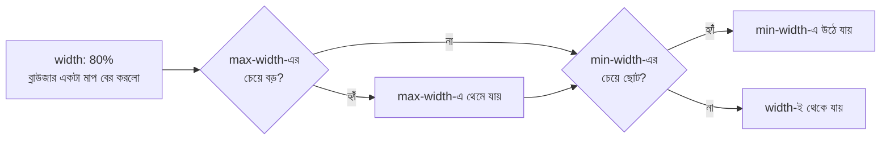

> **নিয়ম মনে রাখুন:** `min-width` আর `max-width`-এ সংঘর্ষ হলে **`min-width` জেতে**। আর দুটোই `width`-কে ছাপিয়ে যায়।

**বাস্তব প্রজেক্টে সবচেয়ে বেশি ব্যবহার হওয়া চারটা প্যাটার্ন:**

```css
.container {
  width: 90%;          /* ছোট স্ক্রিনে parent-এর ৯০% চওড়া, যাতে দুই পাশে একটু ফাঁক থাকে */
  max-width: 1100px;   /* কিন্তু বড় স্ক্রিনে ১১০০px-এর বেশি ছড়াবে না, নাহলে লেখা পড়া কঠিন */
  margin: 0 auto;      /* 0 = উপর-নিচে ফাঁকা নেই, auto = ডান-বাম সমান ফাঁকা → বক্স মাঝখানে বসে */
}

img {
  max-width: 100%;     /* ছবি কখনো parent-এর চেয়ে বড় হবে না — মোবাইলে ছবি উপচে পড়া বন্ধ */
  height: auto;        /* চওড়া কমলে উচ্চতাও অনুপাত ঠিক রেখে কমবে, ছবি চ্যাপ্টা হবে না */
}

.page {
  min-height: 100vh;   /* কন্টেন্ট কম থাকলেও পেজ অন্তত স্ক্রিনের পুরো উচ্চতা নেবে (footer নিচে থাকবে) */
}                      /* কন্টেন্ট বেশি হলে পেজ নিজে থেকেই লম্বা হবে */

.card {
  min-height: 200px;   /* কার্ড ন্যূনতম ২০০px উঁচু, কিন্তু লেখা বেশি হলে নিজে বাড়বে */
}                      /* height: 200px দিলে লেখা বেশি হলে কার্ডের বাইরে উপচে পড়তো! */
```

> **মূল শিক্ষা:** যে বক্সের ভেতরের কন্টেন্ট কতটা হবে জানা নেই, সেখানে `height` না দিয়ে `min-height` দিন। আর যে জিনিস বেশি ছড়াতে দিতে চান না, সেখানে `width`-এর বদলে `max-width`।

---

## ৬. Box Model — পিৎজার বক্সের গল্প

এটা CSS-এর **সবচেয়ে গুরুত্বপূর্ণ ধারণা**। আজ থেকে এভাবে ভাবুন: **পেজের প্রতিটা জিনিস — ছবি, লেখা, বাটন, এমনকি একটা ছোট `<span>`-ও — একটা আয়তক্ষেত্রাকার বক্স।**

স্বাদ-বাড়ি থেকে পিৎজা অর্ডার করলে যে বক্সে আসে, সেটা কল্পনা করুন। সেই বক্সে চারটা স্তর:

| স্তর | পিৎজার গল্পে | CSS Property |
|---|---|---|
| 🍕 **Content** | আসল পিৎজাটা | `width`, `height` |
| 🟨 **Padding** | পিৎজা আর বক্সের দেয়ালের মাঝের ফাঁকা জায়গা (কাগজ/প্যাডিং) | `padding` |
| 🟫 **Border** | কার্ডবোর্ডের বক্সের দেয়ালটা | `border` |
| 🟧 **Margin** | এই বক্স আর পাশের বক্সের মধ্যে দূরত্ব (ডেলিভারি ব্যাগে ফাঁক) | `margin` |

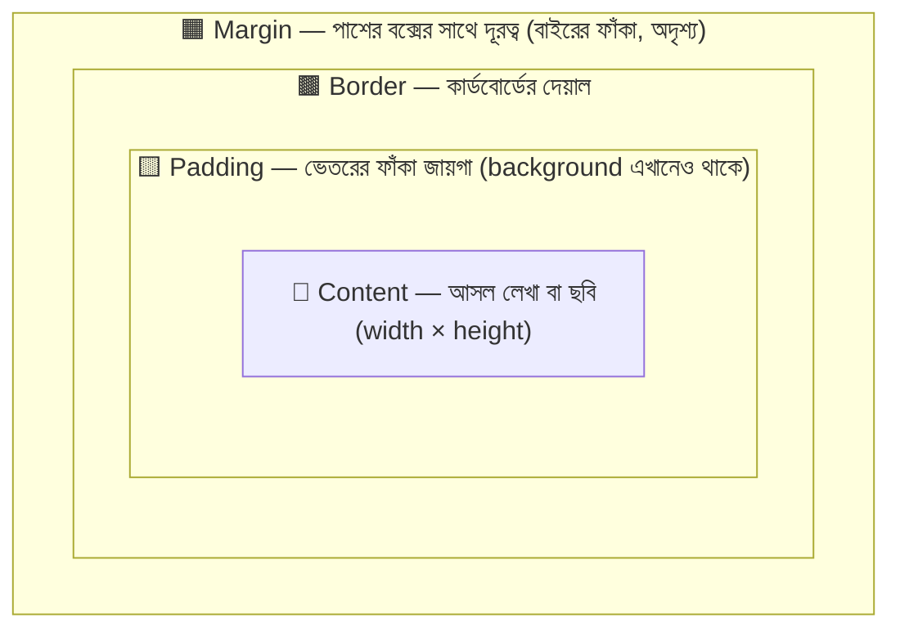

**গুরুত্বপূর্ণ পার্থক্য:**

- **Padding** বক্সের *ভেতরে* — বক্সের `background-color` padding-এর নিচেও ছড়িয়ে থাকে।
- **Margin** বক্সের *বাইরে* — একদম স্বচ্ছ, background পৌঁছায় না।

### বক্সের মোট মাপ কত? — ডিফল্ট হিসাব (`content-box`)

ধরুন:

```css
.pizza-box {
  width: 200px;      /* Content-এর চওড়া */
  padding: 20px;     /* চারদিকে ২০px ভেতরের ফাঁকা */
  border: 5px solid #8d5524;   /* চারদিকে ৫px দেয়াল */
  margin: 10px;      /* চারদিকে ১০px বাইরের দূরত্ব */
}
```

ডিফল্টে `width` মানে **শুধু Content-এর চওড়া**। তাই বাকিগুলো তার সাথে যোগ হয়:

```
Content            = 200px
+ Padding (২০+২০)  =  40px  → 240px
+ Border  (৫+৫)    =  10px  → 250px   ← পর্দায় বক্সটা এতটুকু চওড়া দেখাবে
+ Margin  (১০+১০)  =  20px  → 270px   ← আশপাশের সাথে হিসাবে এতটুকু জায়গা দখল
```

আপনি লিখলেন `width: 200px`, অথচ পর্দায় বক্সটা হলো ২৫০px! এই জন্যই নতুনরা প্রথমে মাথা চুলকান 😅

### সমাধান: `box-sizing: border-box`

`border-box` বলে দেয় — *"`width` মানে বাইরের দেয়াল পর্যন্ত পুরো বক্সের মাপ। ভেতরে Content নিজে ছোট হয়ে খাপ খেয়ে নেবে।"*

```css
.pizza-box {
  box-sizing: border-box;   /* width-এর হিসাবে Padding আর Border-ও ঢুকে যাবে */
  width: 200px;             /* এবার পর্দায় বক্স ঠিক ২০০px চওড়া দেখাবে */
  padding: 20px;            /* Content ছোট হয়ে যাবে: 200 − 40 − 10 = 150px */
  border: 5px solid #8d5524;
}
```

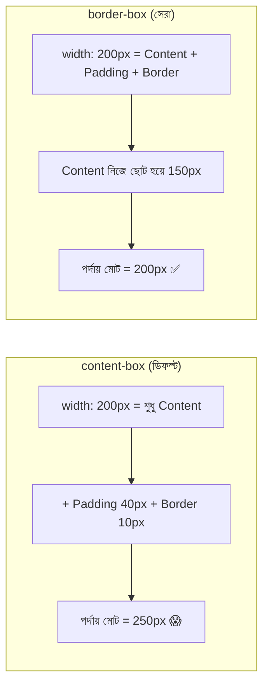

**তাই প্রায় সব প্রজেক্টের শুরুতে এই ৩ লাইন থাকে:**

```css
*,
*::before,
*::after {                 /* ::before আর ::after = element-এর আগে-পরের নকল অংশ (পরের ফাইলে পড়বো)। এদেরও যেন একই নিয়ম হয় */
  box-sizing: border-box;  /* সবার জন্য border-box — মাপের হিসাব সবসময় "যা লিখলাম, তাই দেখলাম" */
}
```

### সবচেয়ে কমন বাগ: `100%` চওড়া + padding = উপচে পড়া

```css
.form-input {
  width: 100%;      /* parent-এর পুরো চওড়া */
  padding: 20px;    /* content-box হলে: ১০০% + ৪০px → parent-এর বাইরে উপচে পড়বে ❌ */
}                   /* box-sizing: border-box দিলে ১০০%-এর ভেতরেই থাকবে ✅ */
```

### Box Model দেখার সহজ উপায়

ব্রাউজারে যেকোনো element-এর উপর ডান-ক্লিক → **Inspect** (বা `F12`) → **Elements** ট্যাবে element বাছুন → নিচে/ডানে **Computed** ট্যাব। সেখানে ঠিক এই ছবির মতো রঙিন বক্স দেখা যায় — কমলা = margin, হলুদ = border, সবুজ = padding, নীল = content। হিসাব না মিললে প্রথমেই এটা খুলে দেখুন।

### বক্সের বাইরে যা থাকে: `outline`

`outline` দেখতে border-এর মতো, কিন্তু **বক্সের মাপে ঢোকে না, জায়গাও নেয় না** — শুধু বাইরে আঁকা হয়। ফোকাস করা লিংক বা ইনপুটে নীল দাগ এটাই। (পরের অংশে বিস্তারিত।)

---

## ৭. Margin, Padding, Border — বক্সের তিন স্তর

পিৎজার বক্সের তিনটা স্তর এবার আলাদা আলাদা করে নিয়ন্ত্রণ করতে শিখবো: বাইরের দূরত্ব (**Margin**), ভেতরের ফাঁকা জায়গা (**Padding**), আর বক্সের দেয়াল (**Border**)।

### ৭.১ Margin — পাশের বক্সের সাথে দূরত্ব

**চার দিক আলাদা করে:**

```css
.box {
  margin-top: 10px;      /* উপরে ১০px দূরত্ব */
  margin-right: 20px;    /* ডানে ২০px */
  margin-bottom: 30px;   /* নিচে ৩০px */
  margin-left: 40px;     /* বামে ৪০px */
}
```

**Shorthand — এক লাইনে:**

```css
.box { margin: 20px; }                  /* ১টা মান → চার দিকেই ২০px */
.box { margin: 10px 30px; }             /* ২টা মান → উপর-নিচ ১০px | ডান-বাম ৩০px */
.box { margin: 10px 30px 20px; }        /* ৩টা মান → উপর ১০px | ডান-বাম ৩০px | নিচ ২০px */
.box { margin: 10px 20px 30px 40px; }   /* ৪টা মান → উপর | ডান | নিচ | বাম */
```

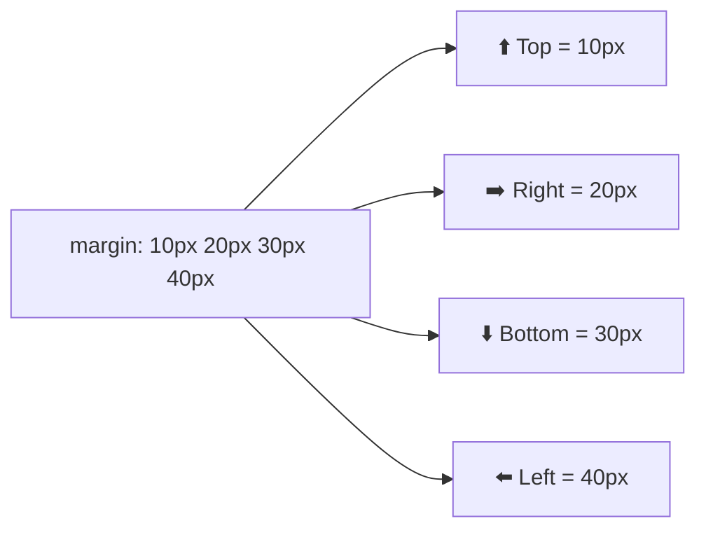

> **মনে রাখার কৌশল — TRouBLe:** **T**op → **R**ight → **B**ottom → **L**eft। উপর থেকে শুরু করে **ঘড়ির কাঁটার দিকে** ঘুরে আসুন। এই একই নিয়ম `padding` আর `border-width`-এর জন্যও খাটে।

**`margin: 0 auto` — বক্সকে মাঝখানে বসানো:**

```css
.card {
  width: 300px;        /* ⚠️ চওড়া (বা max-width) ঠিক করা না থাকলে auto কিছুই করার নেই, কারণ block নিজেই পুরোটা নিয়ে নেয় */
  margin: 0 auto;      /* 0 = উপর-নিচে ফাঁকা নেই; auto = ডান-বামের বাকি জায়গা সমান ভাগ হবে → বক্স ঠিক মাঝখানে */
}
```

`auto` দিয়ে মাঝখানে আনা শুধু **block element**-এ কাজ করে (inline-এ নয়)। আর কাজ করতে হলে চওড়া নির্দিষ্ট (বা `max-width`) থাকতে হবে।

**Margin-এর আরও কিছু নিয়ম:**

| নিয়ম | ব্যাখ্যা |
|---|---|
| Percentage margin | উপর-নিচের margin-ও **parent-এর চওড়ার** শতাংশ ধরে হিসাব হয়, উচ্চতার নয়! |
| Negative margin | দেওয়া যায় (`margin-top: -20px`) — এটা পরের ফাইলে গল্প আকারে আছে |
| আধুনিক Logical property | `margin-inline: auto;` (ডান-বাম), `margin-block: 20px;` (উপর-নিচ) — লেখার দিক বদলালেও ঠিক থাকে |

**⚠️ Margin Collapse — দুটো margin মিলে একটা হয়ে যাওয়া:**

দুটো block উপর-নিচে থাকলে তাদের উপর-নিচের margin **যোগ হয় না** — বড়টাই টিকে থাকে।

```css
.a { margin-bottom: 30px; }   /* A-এর নিচে ৩০px */
.b { margin-top: 20px; }      /* B-এর উপরে ২০px */
/* দুটোর মাঝে ফাঁকা = ৩০px (বড়টা), ৫০px নয়! */
```

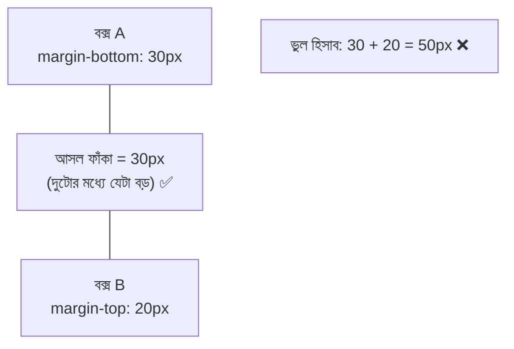

Margin collapse-এর নিয়মগুলো:

- শুধু **উপর-নিচে** হয়; ডান-বাম margin কখনো collapse হয় না
- parent আর তার প্রথম/শেষ সন্তানের margin-ও collapse হতে পারে — যদি parent-এ `padding`, `border` বা কিছু না থাকে (সন্তানের margin যেন parent-কে ঠেলে নামিয়ে দেয়!)
- flex/grid item, `inline-block`, floated বা absolute element-এ collapse হয় না

**Parent-child collapse ঠেকানোর উপায়:**

```css
.parent {
  padding-top: 1px;        /* উপায় ১: সামান্য padding বা border দিলেই collapse থামে */
  overflow: auto;          /* উপায় ২: overflow (visible ছাড়া কিছু) নতুন "ঘর" বানায় */
  display: flow-root;      /* উপায় ৩ (সবচেয়ে পরিষ্কার): কোনো পাশ-প্রভাব ছাড়াই নতুন ঘর বানায় */
}
```

### ৭.২ Padding — বক্সের ভেতরের ফাঁকা জায়গা

```css
.button {
  padding-top: 10px;       /* লেখার উপরে ফাঁকা */
  padding-right: 24px;     /* লেখার ডানে ফাঁকা */
  padding-bottom: 10px;    /* লেখার নিচে ফাঁকা */
  padding-left: 24px;      /* লেখার বামে ফাঁকা */
}

.button { padding: 10px 24px; }   /* shorthand: উপর-নিচ ১০px, ডান-বাম ২৪px — margin-এর মতোই ১/২/৩/৪ মান */
```

**Margin আর Padding-এর মধ্যে পার্থক্য (পরীক্ষায় প্রায়ই আসে):**

| বিষয় | Margin | Padding |
|---|---|---|
| অবস্থান | বক্সের **বাইরে** | বক্সের **ভেতরে** (Content আর Border-এর মাঝে) |
| `background` পৌঁছায়? | ❌ না (স্বচ্ছ) | ✅ হ্যাঁ (background-এর অংশ) |
| Negative মান | ✅ দেওয়া যায় | ❌ **যায় না** |
| `auto` মান | ✅ (মাঝখানে বসাতে) | ❌ নেই |
| Collapse করে? | ✅ উপর-নিচে | ❌ কখনো না |
| ক্লিক করার জায়গা বাড়ায়? | ❌ না | ✅ হ্যাঁ (বাটন বড় করতে দারুণ) |

**কোনটা ব্যবহার করবো?**

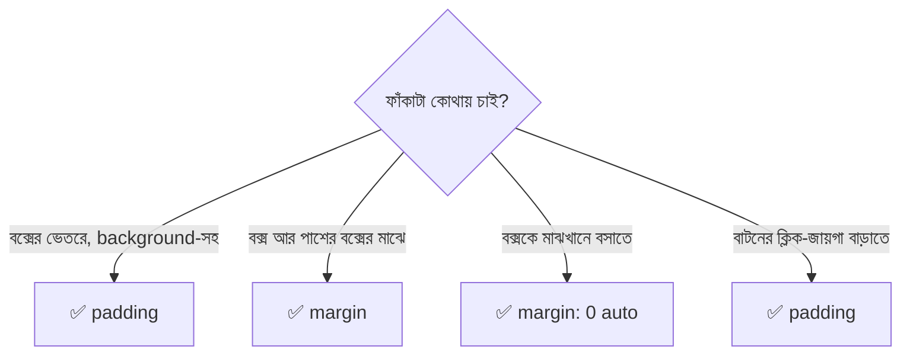

### ৭.৩ Border — বক্সের দেয়াল

Border-এর তিনটা অংশ: **কত মোটা (width)**, **কেমন ধরন (style)**, **কী রং (color)**।

```css
.box {
  border-width: 2px;          /* দেয়াল ২px মোটা (thin, medium, thick কীওয়ার্ডও চলে) */
  border-style: solid;        /* দেয়ালের ধরন — solid = একটানা সরলরেখা। এটা না দিলে কিছুই আঁকা হয় না! */
  border-color: #e63946;      /* দেয়ালের রং */
}

.box { border: 2px solid #e63946; }   /* shorthand: width → style → color। style অবশ্যই দিতে হবে */
```

> ⚠️ `border-style`-এর ডিফল্ট মান `none`। তাই শুধু `border-width: 5px; border-color: red;` লিখলে **কিছুই দেখা যায় না**। নতুনদের এটা খুব কমন ভুল।

**Border-style-এর সব মান:**

| মান | চেহারা | মান | চেহারা |
|---|---|---|---|
| `solid` | ━━━━ একটানা | `dashed` | ╌╌╌╌ ড্যাশ |
| `dotted` | ┈┈┈┈ ফোঁটা | `double` | ═════ দুই লাইন |
| `groove` | খাঁজকাটা (3D) | `ridge` | উঁচু-করা (3D) |
| `inset` | ভেতরে বসা (3D) | `outset` | বাইরে ঠেলা (3D) |
| `none` | কিছুই না (ডিফল্ট) | `hidden` | none-এর মতো (টেবিলে ভিন্ন আচরণ) |

**এক পাশে আলাদা বর্ডার:**

```css
.dish {
  border-bottom: 1px dashed #d9c3ad;   /* শুধু নিচে হালকা ড্যাশ লাইন — মেনু আইটেমের মাঝে বিভাজক */
}

.alert {
  border: 1px solid #ddd;              /* আগে চারদিকে হালকা ধূসর পাতলা বর্ডার */
  border-left: 5px solid #e63946;      /* তারপর শুধু বাঁ পাশটা মোটা লাল দাগ — সতর্কতা-বক্সের পরিচিত ধরন। পরে লেখা তাই জেতে */
}
```

**Border Radius — কোণা গোল করা:**

```css
.card    { border-radius: 12px; }                /* চার কোণাই ১২px গোল */
.avatar  { border-radius: 50%; }                 /* বর্গাকার বক্সে 50% = পুরো গোল বৃত্ত */
.pill    { border-radius: 9999px; }              /* খুব বড় মান = ক্যাপসুল আকৃতি (বাটন/ট্যাগে জনপ্রিয়) */
.leaf    { border-radius: 30px 0 30px 0; }       /* ৪ মান: উপরে-বাম | উপরে-ডান | নিচে-ডান | নিচে-বাম */
.egg     { border-radius: 50% / 60% 60% 40% 40%; }  /* "/" দিয়ে আড়াআড়ি ও লম্বালম্বি ব্যাসার্ধ আলাদা করলে ডিম্বাকার */
```

### Border বনাম Outline বনাম Box-shadow

| | `border` | `outline` | `box-shadow` |
|---|---|---|---|
| বক্সের মাপে যোগ হয়? | ✅ হ্যাঁ | ❌ না | ❌ না |
| জায়গা নেয়? | ✅ | ❌ | ❌ |
| এক পাশ আলাদা করা যায়? | ✅ | ❌ | ⚠️ ঘুরিয়ে |
| গোল কোণা মানে? | ✅ | ✅ (নতুন ব্রাউজারে) | ✅ |
| সাধারণ ব্যবহার | দেয়াল, বিভাজক | ফোকাস-চিহ্ন (accessibility) | ছায়া, glow |

```css
button:focus {
  outline: 3px solid #2a9d8f;    /* ফোকাস হলে ৩px সবুজ আউটলাইন — কীবোর্ড ব্যবহারকারী যেন বুঝতে পারে কোথায় আছে */
  outline-offset: 4px;           /* বক্স থেকে ৪px দূরে আঁকা — বর্ডারের সাথে গায়ে গায়ে লাগে না */
}
```

> ⚠️ `outline: none` দিয়ে ফোকাস-চিহ্ন মুছে দেবেন না, যতক্ষণ না তার বদলে অন্য কোনো দৃশ্যমান চিহ্ন দিচ্ছেন। কীবোর্ডে চলা মানুষ তাহলে হারিয়ে যাবেন।

---

## ৮. সব একসাথে: মেনু কার্ড প্রজেক্ট

এবার আজকের সব দক্ষতা এক জায়গায় জুড়ে বানাবো **স্বাদ-বাড়ির মেনু কার্ড**।

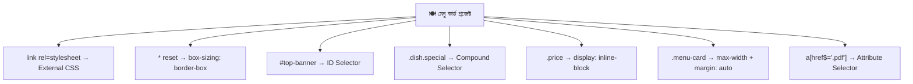

### `index.html`

```html
<!DOCTYPE html>
<html lang="bn">
<!-- lang="bn" = পেজের ভাষা বাংলা। স্ক্রিন-রিডার ও ব্রাউজার সঠিক উচ্চারণ/ফন্ট বেছে নিতে পারে -->
<head>
  <meta charset="UTF-8">
  <!-- UTF-8 না দিলে বাংলা অক্ষর ভেঙে "???" হয়ে যেতে পারে -->
  <meta name="viewport" content="width=device-width, initial-scale=1.0">
  <!-- মোবাইলে পেজ যেন স্ক্রিনের আসল চওড়া ধরে সাজে, ছোট হয়ে না যায় -->
  <title>স্বাদ-বাড়ি — মেনু কার্ড</title>
  <link rel="stylesheet" href="css/style.css">
  <!-- External CSS: ফাইলটা css/ ফোল্ডারে -->
</head>
<body>

  <header id="top-banner">
    <!-- id: পুরো পেজে ব্যানার একটাই, তাই id ঠিক আছে -->
    <h1 class="brand">স্বাদ-বাড়ি</h1>
    <p class="tagline">ঘরের স্বাদ, বাড়ির মতো যত্ন</p>
  </header>

  <main class="menu-card">
    <h2 class="menu-title">আজকের মেনু</h2>

    <ul class="dish-list">
      <li class="dish special">
        <span class="dish-name">কাচ্চি বিরিয়ানি</span>
        <span class="price">৳ ৩২০</span>
      </li>
      <li class="dish">
        <span class="dish-name">ভুনা খিচুড়ি</span>
        <span class="price">৳ ১৮০</span>
      </li>
      <li class="dish sold-out">
        <span class="dish-name">ইলিশ ভাজা</span>
        <span class="price">শেষ</span>
      </li>
    </ul>

    <a class="order-btn" href="https://example.com/menu.pdf" target="_blank">মেনু PDF ডাউনলোড</a>
  </main>

</body>
</html>
```

### `css/style.css`

```css
/* ==========================================================
   style.css — স্বাদ-বাড়ির মেনু কার্ড
   ========================================================== */

/* ---------- ১. Reset + Box Model ---------- */
*,
*::before,
*::after {
  margin: 0;                /* ব্রাউজারের ডিফল্ট বাইরের ফাঁকা মুছে দিলাম, এখন সব নিজের হাতে ঠিক করবো */
  padding: 0;               /* ডিফল্ট ভেতরের ফাঁকাও মুছলাম */
  box-sizing: border-box;   /* width = পুরো বক্সের মাপ (padding + border সহ) — হিসাব সহজ */
}

/* ---------- ২. Element Selector: পেজের ভিত্তি ---------- */
body {
  background-color: #fff8f0;   /* হালকা ক্রিম — সাদার চেয়ে চোখে আরাম, খাবারের সাথে মানানসই */
  color: #333;                 /* একদম কালো (#000) না দিয়ে গাঢ় ধূসর — লেখা নরম দেখায় */
  font-family: "Noto Sans Bengali", "Hind Siliguri", sans-serif;
  /* বাংলা ফন্ট আগে চেষ্টা করবে; কোনোটা না থাকলে ব্রাউজারের যেকোনো sans-serif ফন্ট (fallback) */
  line-height: 1.7;            /* বাংলা লেখায় মাত্রা ও ফলার জন্য লাইনের ফাঁক একটু বেশি লাগে */
}

/* ---------- ৩. ID Selector: ব্যানার ---------- */
#top-banner {
  background: linear-gradient(to right, #e63946, #f4a261);
  /* লাল থেকে কমলা গ্র্যাডিয়েন্ট — ছবি ছাড়াই আকর্ষণীয় ব্যাকগ্রাউন্ড */
  color: #fff;                 /* গাঢ় ব্যাকগ্রাউন্ডে সাদা লেখা পড়া সহজ */
  padding: 40px 20px;          /* উপর-নিচ ৪০px, ডান-বাম ২০px ভেতরের ফাঁকা — ব্যানার যেন দম নেওয়ার জায়গা পায় */
  text-align: center;          /* লেখা মাঝখানে (Typography-র পরের ফাইলে বিস্তারিত) */
}

.brand   { font-size: 40px; }  /* ব্র্যান্ডের নাম সবচেয়ে বড়, তাই আলাদা class */
.tagline { font-size: 18px; }  /* ট্যাগলাইন ছোট, পড়তে আরামদায়ক */

/* ---------- ৪. Class Selector + মাপ + মাঝখানে বসানো ---------- */
.menu-card {
  width: 90%;                  /* ছোট স্ক্রিনে parent-এর ৯০% — দুই পাশে একটু ফাঁক থাকবে */
  max-width: 480px;            /* বড় স্ক্রিনেও ৪৮০px-এর বেশি চওড়া হবে না — কার্ড কার্ডের মতোই থাকবে */
  min-height: 300px;           /* আইটেম কম হলেও কার্ড ন্যূনতম ৩০০px উঁচু; বেশি হলে নিজে বাড়বে */
  margin: 30px auto;           /* উপর-নিচ ৩০px দূরত্ব; ডান-বামে auto → কার্ড মাঝখানে */
  padding: 24px;               /* কার্ডের ভেতরে চারদিকে ২৪px — লেখা কিনারায় ঠেকে থাকবে না */
  background-color: #fff;      /* কার্ড সাদা, পেছনের ক্রিমের উপর আলাদা করে ফুটে উঠবে */
  border: 2px solid #f1d9c5;   /* হালকা বাদামি ২px বর্ডার — কার্ডের সীমানা */
  border-radius: 16px;         /* গোল কোণা — খাবারের কার্ডে নরম অনুভূতি */
}

.menu-title {
  margin-bottom: 16px;              /* শিরোনাম আর তালিকার মাঝে ১৬px দূরত্ব */
  padding-bottom: 8px;              /* লেখা আর নিচের দাগের মাঝে ৮px ফাঁকা */
  border-bottom: 3px solid #e63946; /* শিরোনামের নিচে মোটা লাল দাগ */
  font-size: 26px;
}

/* ---------- ৫. Display: Block ---------- */
.dish-list { list-style: none; }   /* তালিকার ডট সরালাম — নিজের সাজ দেবো */

.dish {
  display: block;                     /* প্রতিটা আইটেম নিজের পুরো লাইনে (li ডিফল্টে list-item, তাই স্পষ্ট করে block) */
  padding: 12px 0;                    /* উপর-নিচ ১২px, ডান-বামে ০ — আইটেমগুলোর মাঝে দম নেওয়ার জায়গা */
  border-bottom: 1px dashed #d9c3ad;  /* প্রতি আইটেমের নিচে হালকা ড্যাশ-বিভাজক */
}

/* ---------- ৬. Compound Selector ---------- */
.dish.special {                        /* মাঝে space নেই = একই li-তে .dish এবং .special দুটোই থাকতে হবে */
  padding-left: 12px;                  /* বাঁ দিকে ১২px ভেতরের ফাঁকা */
  background-color: #fff3cd;           /* হালকা হলুদ — স্পেশাল আইটেম আলাদা করে ফুটিয়ে তুলতে */
  border-left: 4px solid #f4a261;      /* বাঁ পাশে কমলা দাগ — "স্পেশাল" চিহ্ন */
}

.dish.sold-out {
  color: #999;                         /* ধূসর — "এখন নেই" বোঝাতে */
  text-decoration: line-through;       /* লেখার উপর দিয়ে দাগ (Typography-র পরের ফাইলে বিস্তারিত) */
}

/* ---------- ৭. Inline vs Inline-Block ---------- */
.dish-name { font-weight: 600; }       /* span ডিফল্টে inline — শুধু লেখা একটু মোটা করলাম, মাপের দরকার নেই */

.price {
  display: inline-block;   /* span ডিফল্টে inline, কিন্তু আমাদের width/padding/margin লাগবে → inline-block */
  min-width: 64px;         /* "শেষ" (ছোট) আর "৳ ৩২০" (বড়) দুটোই যেন সমান চওড়া ব্যাজ পায় */
  margin-left: 12px;       /* নাম আর দামের মাঝে ১২px দূরত্ব */
  padding: 2px 10px;       /* ব্যাজের ভেতরে উপর-নিচ ২px, ডান-বাম ১০px */
  border: 1px solid #e63946;  /* লাল পাতলা বর্ডার */
  border-radius: 20px;        /* ক্যাপসুল আকৃতি */
  text-align: center;         /* ব্যাজের লেখা মাঝখানে */
  font-size: 14px;            /* দাম নামের চেয়ে একটু ছোট */
}

/* ---------- ৮. Attribute Selector ---------- */
.order-btn {
  display: inline-block;      /* <a> ডিফল্টে inline — padding আর margin-top ঠিকমতো কাজ করাতে inline-block */
  margin-top: 20px;           /* তালিকা আর বাটনের মাঝে ২০px */
  padding: 10px 24px;         /* বাটনের ভেতরে ফাঁকা — ক্লিক করার জায়গাও বাড়ে */
  color: #fff;                /* সাদা লেখা */
  border-radius: 8px;         /* সামান্য গোল কোণা */
  text-decoration: none;      /* লিংকের ডিফল্ট আন্ডারলাইন সরালাম */
  background-color: #e63946;  /* ডিফল্ট বাটনের রং: লাল */
}

a[href$=".pdf"] {             /* href .pdf দিয়ে শেষ হয়েছে এমন সব লিংক */
  background-color: #2a9d8f;  /* PDF লিংক হলে সবুজ — এটা .order-btn-এর লাল রংকে হারিয়ে দেয়
                                 (কারণ: এর "জোর" বেশি — Specificity, পরের ফাইলে বিস্তারিত) */
}
```

### ফোল্ডার স্ট্রাকচার

```
📦 swad-bari-menu-card/
 ┣ 📜 index.html
 ┗ 📂 css/
   ┗ 📜 style.css
```

---

## ৯. সাধারণ ভুল ও সমাধান

| # | লক্ষণ | সম্ভাব্য কারণ | সমাধান |
|---|---|---|---|
| ১ | CSS-এর কোনো প্রভাবই পড়ছে না | `<link>`-এর `href` ঠিকানা ভুল | DevTools → Network ট্যাবে দেখুন CSS ফাইল 404 দিচ্ছে কিনা |
| ২ | একটা নির্দেশের পর পরেরগুলো কাজ করছে না | আগের লাইনে `;` ভুলে গেছেন | প্রতিটা declaration `;` দিয়ে শেষ করুন |
| ৩ | class-এর সাজ লাগছে না | CSS-এ `.` বা HTML-এ নামের বানান ভুল | `.dish` (CSS) ↔ `class="dish"` (HTML) মিলিয়ে দেখুন |
| ৪ | `.dish .sold-out` কাজ করছে না | মাঝে space মানে "ভেতরের সন্তান" | একই element-এ দুটো class হলে space ছাড়া `.dish.sold-out` |
| ৫ | `<span>`-এ `width`/`height` কাজ করছে না | span `inline` | `display: inline-block` করুন |
| ৬ | `margin: 0 auto` মাঝখানে আনছে না | `width` নেই, বা element `inline` | `width` বা `max-width` দিন আর `display: block` নিশ্চিত করুন |
| ৭ | ১০০% চওড়া বক্স পাশে উপচে যাচ্ছে | `content-box` + padding/border | `box-sizing: border-box` |
| ৮ | দুই বক্সের মাঝে ফাঁকা কম দেখাচ্ছে | Margin Collapse (৩০+২০ = ৩০) | একদিকে margin ব্যবহার করুন, বা flex/grid-এর `gap` |
| ৯ | `height: 50%` কাজ করছে না | parent-এর উচ্চতা `auto` | parent-এ স্পষ্ট `height` দিন |
| ১০ | `border` দেখা যাচ্ছে না | `border-style` দেওয়া হয়নি | `border: 1px solid red;` — style অবশ্যই |
| ১১ | `background` shorthand-এ আগের size/position মুছে গেছে | shorthand বাকিগুলো ডিফল্টে ফেরত নেয় | shorthand আগে লিখুন, আলাদা property পরে |
| ১২ | CSS বদলালাম, ব্রাউজারে পুরোনো দেখাচ্ছে | ব্রাউজার Cache | `Ctrl + Shift + R` (Hard Refresh) |

---

## ১০. সারসংক্ষেপ ও Practice আইডিয়া

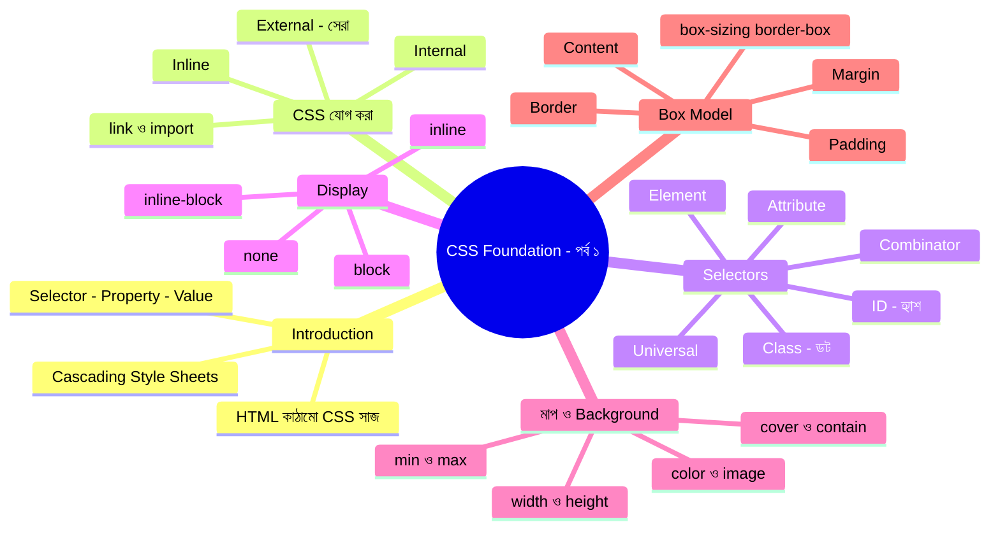

### এক লাইনে মনে রাখার তালিকা

1. **CSS = সাজ**, HTML = কাঠামো। সাজ আলাদা ফাইলে রাখাই বুদ্ধিমানের কাজ (External)।
2. **Class = স্টিকার** (অনেকজনের, `.`), **ID = নম্বর-প্লেট** (একজনের, `#`)।
3. **block** = পুরো সারি, **inline** = লেখার মতো পাশাপাশি (মাপ চলে না), **inline-block** = পাশাপাশি + মাপ চলে।
4. **`width` না দিয়ে `max-width`, `height` না দিয়ে `min-height`** — রবারের দেয়াল বেশি নিরাপদ।
5. **প্রতিটা জিনিস একটা বক্স**: Content → Padding → Border → Margin (ভেতর থেকে বাইরে)।
6. **`box-sizing: border-box`** সবসময় দিন — যা লিখবেন, তা-ই দেখবেন।
7. Shorthand-এর ক্রম **TRouBLe** (উপর → ডান → নিচ → বাম)।
8. **Border দেখতে হলে `style` লাগবেই।**

### Practice-এর জন্য আইডিয়া

1. **মেনু কার্ড নিজে হাতে টাইপ করা** — কপি-পেস্ট নয়, টাইপ করলে মাথায় থাকে।
2. **তিন উপায়ে একই `<h1>` সাজানো** — Inline, Internal, External — তারপর DevTools-এ দেখুন কার নির্দেশ জিতছে।
3. **Inline vs Inline-Block পরীক্ষা** — `<span>`-এ `width: 200px` দিয়ে কিছু হয় না দেখুন, তারপর `display: inline-block` দিয়ে দেখুন।
4. **DevTools-এ `box-sizing` অদল-বদল** — Elements → Styles ট্যাবে `box-sizing`-এর মান `content-box` ↔ `border-box` করে বক্সের মাপ কেমন বদলায় দেখুন।
5. **Margin Collapse নিজ চোখে দেখা** — দুটো `<div>`-এ ৩০px আর ২০px margin দিয়ে মাঝের দূরত্ব মাপুন।
6. **Attribute Selector-এর খেলা** — ৫টা আলাদা লিংক (`.pdf`, `https://`, `mailto:`) বানিয়ে `^=`, `$=`, `*=` দিয়ে আলাদা আলাদা রং দিন।
7. **নিজের একটা কার্ড বানানো** — প্রোফাইল কার্ড: ছবি (`border-radius: 50%`), নাম, ছোট বায়ো, একটা বাটন।

---
