# ✨ স্বাদ-বাড়ির বিশেষ সাজ: CSS-এর দ্বিতীয় পাঠ (Negative Margin থেকে Colors)

> **এই ফাইলের টপিক:** Use of Negative Margin | CSS Specificity and !important | Pseudo-elements (::before, ::after) | Pseudo-classes (:hover, :focus, :not(), :last-child, :last-of-type, :nth-child()) | Transform Properties (translate, scale, skew, rotate, etc.) | Typography Styles (line-height, letter-spacing, text-decoration, text-transform, font-size, color, overflow, etc.) | Units (px, em, rem, %, vw, vh, fr) | Colors (RGB, HEX, HSL, transparency)


## 📚 সূচিপত্র (Table of Contents)

1. [ভূমিকা: উদ্বোধনের আগের শেষ সাজ](#ভূমিকা-উদ্বোধনের-আগের-শেষ-সাজ)
2. [Negative Margin — টেনে কাছে আনার কৌশল](#১-negative-margin--টেনে-কাছে-আনার-কৌশল)
3. [CSS Specificity ও !important — তিন ম্যানেজারের হুকুম](#২-css-specificity-ও-important--তিন-ম্যানেজারের-হুকুম)
4. [Pseudo-elements — চেয়ারের আগে-পরের স্টিকার](#৩-pseudo-elements--চেয়ারের-আগে-পরের-স্টিকার)
5. [Pseudo-classes — অবস্থা বুঝে সাজ](#৪-pseudo-classes--অবস্থা-বুঝে-সাজ)
6. [Transform — ম্যাজিক চশমা](#৫-transform--ম্যাজিক-চশমা)
7. [Typography — মেনু-বোর্ডের লেখা](#৬-typography--মেনু-বোর্ডের-লেখা)
8. [Units — মাপার ফিতার গল্প](#৭-units--মাপার-ফিতার-গল্প)
9. [Colors — রঙের প্যালেট](#৮-colors--রঙের-প্যালেট)
10. [সব একসাথে: অফার কার্ড প্রজেক্ট](#৯-সব-একসাথে-অফার-কার্ড-প্রজেক্ট)
11. [সাধারণ ভুল ও সমাধান](#১০-সাধারণ-ভুল-ও-সমাধান)
12. [সারসংক্ষেপ ও Practice আইডিয়া](#১১-সারসংক্ষেপ-ও-practice-আইডিয়া)


---

## ভূমিকা: উদ্বোধনের আগের শেষ সাজ

গত অধ্যায়ে আমাদের ডিজাইনার স্বাদ-বাড়ির দেয়ালে রং লাগিয়েছে, টেবিলগুলোকে বক্সের মতো করে দূরত্ব দিয়ে সাজিয়েছে। উদ্বোধনের আগের রাতে মালিক সব ঘুরে দেখে বললেন:

> *"সব ঠিকঠাক আছে। কিন্তু প্রাণ নেই। কিছু জিনিস একটু ঘেঁষাঘেঁষি করে থাকুক, একটা ছবি ফ্রেম ছাপিয়ে বেরিয়ে আসুক। মেহমান কাছে এলে চেয়ার যেন সাড়া দেয়। মেনুর লেখা যেন চোখ টানে। আর তিনজন ম্যানেজার তিন রকম হুকুম দিলে শেফ যেন বিভ্রান্ত না হয়!"*

ডিজাইনার খাতা খুলে আটটা "বিশেষ ছোঁয়া"-র তালিকা বানালো:

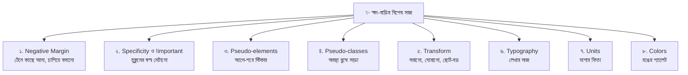

---

## ১. Negative Margin — টেনে কাছে আনার কৌশল

গত অধ্যায়ে `margin` মানে ছিল **ঠেলে দূরে সরানো** — "এই টেবিল আর ওই টেবিলের মাঝে ২ ফুট ফাঁকা রাখো।" এবার ডিজাইনার উল্টো কাজ করে: **টেনে কাছে আনে**, এমনকি একটার উপর আরেকটাকে **চাপিয়ে** বসায়।

ধরুন, স্বাদ-বাড়ির দেয়ালে একটা বড় ব্যানার আছে, আর ব্যানারের ঠিক নিচের কিনারায় শেফের গোল ছবি অর্ধেক ব্যানারের উপর, অর্ধেক নিচে বসে আছে। এই "অর্ধেক উপরে, অর্ধেক নিচে" ভাবটা আনার সহজ উপায়ই **negative margin**।

```css
.avatar { margin-top: -50px; }   /* মান মাইনাস: নিজেকে ৫০px উপরের দিকে টেনে তুললাম */
```

### কোন দিকে Negative Margin দিলে কী হয়?

| Property | Positive (+) | Negative (−) |
|---|---|---|
| `margin-top` | নিজেকে **নিচে** ঠেলে দেয় | নিজেকে **উপরে** টেনে তোলে |
| `margin-bottom` | নিচের জিনিসকে **দূরে** ঠেলে দেয় | নিচের জিনিসকে **কাছে টেনে** এনে নিজের উপর চাপায় |
| `margin-left` | নিজেকে **ডানে** ঠেলে দেয় | নিজেকে **বামে** টেনে সরায় |
| `margin-right` | ডানের জিনিসকে **দূরে** ঠেলে দেয় | ডানের জিনিসকে **কাছে** টেনে আনে |

> **একটা গুরুত্বপূর্ণ সূক্ষ্মতা:** `width: auto` (ডিফল্ট) থাকা কোনো block-এ `margin-left` বা `margin-right` negative দিলে বক্সটা ওই দিকে **চওড়াও হয়ে যায়**। কারণ block-এর ডিফল্ট চওড়া = "parent-এর জায়গা − দুই পাশের margin"। margin negative হলে বিয়োগফল বেড়ে যায়!

### কখন ব্যবহার করবো? — ৪টা বাস্তব উপযোগিতা

**১. Overlap — একটার উপর আরেকটা বসানো (অবতার-ব্যানার):**

```html
<div class="banner"></div>
<div class="avatar">👨‍🍳</div>
```

```css
.banner {
  height: 160px;                 /* ব্যানারের উচ্চতা ১৬০px */
  background-color: #f4a261;     /* কমলা ব্যাকগ্রাউন্ড */
}

.avatar {
  width: 100px;                  /* গোল ছবির চওড়া */
  height: 100px;                 /* উচ্চতা — চওড়ার সমান, তাই বর্গাকার বক্স, যা border-radius: 50%-এ বৃত্ত হবে */
  border: 4px solid #fff;        /* সাদা বর্ডার — ব্যানারের রং থেকে অবতারকে আলাদা করে ফুটিয়ে তোলে */
  border-radius: 50%;            /* ৫০% = পুরো গোল */
  background-color: #fff3cd;     /* ছবি নেই বলে হালকা হলুদ ব্যাকগ্রাউন্ড */
  text-align: center;            /* ইমোজি মাঝখানে */
  font-size: 48px;               /* ইমোজির আকার */
  line-height: 92px;             /* উচ্চতা ১০০ − বর্ডার ৮ = ৯২, তাই লেখা উল্লম্বভাবেও ঠিক মাঝে */

  margin: -50px auto 0;
  /* ৩টা মান: উপর = -50px (নিজের অর্ধেক উচ্চতা ব্যানারের উপর টেনে তুললাম)
              ডান-বাম = auto (মাঝখানে বসলো)
              নিচ = 0 */

  position: relative;            /* ব্যানারের উপরে ভেসে থাকার জন্য "স্তর" পাওয়ার শর্ত */
  z-index: 1;                    /* স্তরের ক্রম — ব্যানারের চেয়ে উপরে (স্পষ্ট করে বলে দিলাম, যাতে চাপা না পড়ে) */
}
```

**২. Full-bleed — padding-এর ভেতরে থেকেও কিনারা ছুঁয়ে যাওয়া:**

কার্ডে `padding: 24px` আছে, কিন্তু কার্ডের উপরের ছবি/রঙিন অংশ চাই একদম কিনারা পর্যন্ত:

```css
.card { padding: 24px; }               /* কার্ডের ভেতরে ২৪px ফাঁকা */

.card .cover {
  height: 140px;
  background-color: #f4a261;
  margin: -24px -24px 16px;
  /* উপর = -24px, ডান-বাম = -24px, নিচ = 16px
     -24px আসলে কার্ডের padding-এর সমান — padding-এর ফাঁকাটুকু "ফেরত টেনে" কিনারা পর্যন্ত পৌঁছালাম
     ডান-বামে negative দেওয়ায় width:auto বক্সটা দুই পাশে ২৪px করে চওড়াও হলো */
}
```

**৩. Gutter মেটানো — কলামের মাঝে ফাঁকা দিয়েও কিনারা সোজা রাখা:**

```html
<div class="row">
  <div class="col">কলাম ক</div>
  <div class="col">কলাম খ</div>
</div>
```

```css
.row {
  display: flex;               /* কলামগুলো পাশাপাশি (flex পরের মডিউলে, এখানে শুধু পাশাপাশি বসানোর জন্য) */
  margin: 0 -10px;             /* ডান-বামে ১০px করে বাইরে টেনে প্রসারিত — কারণ নিচে .col-এ ১০px padding আছে */
}

.col {
  flex: 1;                     /* দুই কলাম সমান জায়গা ভাগ করে নেবে */
  padding: 0 10px;             /* দুই কলামের মাঝে মোট ২০px ফাঁক (১০+১০) তৈরি করলো */
}                              /* সমস্যা: বাইরের কিনারাতেও ১০px ফাঁকা থেকে যেত — .row-এর -10px সেটাকে ফিরিয়ে নিলো */
```

**৪. Hairline — পাশাপাশি বর্ডারের দ্বিগুণ হওয়া ঠেকানো:**

```css
.tab { border: 1px solid #ccc; }       /* প্রতিটা ট্যাবের চারপাশে ১px বর্ডার */
.tab + .tab { margin-left: -1px; }     /* পরের ট্যাবকে ১px বামে টেনে আগের ট্যাবের বর্ডারের উপর বসালাম — মাঝে ২px-এর বদলে ১px দাগ */
```

### কখন ব্যবহার করবো না?

| ❌ ভুল ব্যবহার | কেন সমস্যা | ✅ ভালো বিকল্প |
|---|---|---|
| লেআউট ঠিক করার "জোড়াতালি" হিসেবে (কেন কাজ করছে না বুঝতে না পেরে `-37px` বসানো) | পরে কোনো কিছু বদলালেই ভেঙে যাবে | Flexbox / Grid, বা `gap` |
| লেখার উপর লেখা চাপিয়ে দেওয়া | পড়া যায় না, মোবাইলে এলোমেলো | `position` দিয়ে সচেতনভাবে স্তর ঠিক করা |
| বড় মানের negative `margin-left` / `margin-top` | কন্টেন্ট স্ক্রিনের **বাইরে** চলে যেতে পারে; উপর-বাম দিকে স্ক্রল করে সেটা দেখাও যায় না | `transform: translate()` বা `position: relative` |
| অনেকগুলো element-এ ছড়িয়ে ছিটিয়ে | কোডের অন্য কেউ (বা ৩ মাস পরের আপনি) বুঝতে পারবেন না | একটা জায়গায় স্পষ্ট comment সহ |

> **মনে রাখুন:** `padding` কখনো negative হয় না — শুধু `margin` হয়।

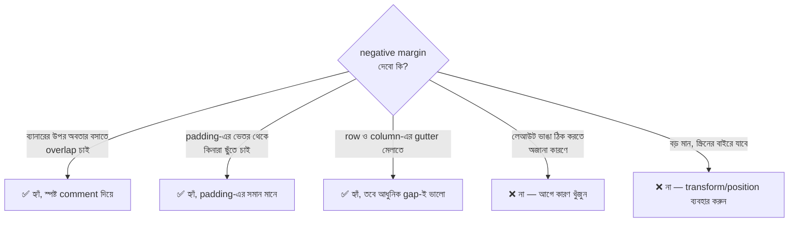

> **Overlap হলে কে উপরে?** নিয়মিত (non-positioned) element-এ কে কার উপরে দেখা যাবে, সেটা একটু জটিল — লেখা আর background আলাদা স্তরে আঁকা হয়। তাই নিশ্চিত হতে চাইলে যেটা উপরে চান, সেটায় `position: relative; z-index: 1;` দিয়ে দিন (উপরের অবতারের মতো)।

---

## ২. CSS Specificity ও !important — তিন ম্যানেজারের হুকুম

স্বাদ-বাড়ির রান্নাঘরে শেফ একটা মুশকিলে পড়েছে। ৭ নম্বর চেয়ারের রং নিয়ে **তিনজন ম্যানেজার তিন রকম হুকুম** দিয়ে গেছেন:

- 👷 **সাধারণ কর্মচারী:** "সব চেয়ারের রং **লাল** হবে।" (`p`-এর মতো element selector)
- 👔 **শাখা-ম্যানেজার:** "VIP চেয়ারের রং **নীল** হবে।" (`.vip`-এর মতো class selector)
- 👑 **মালিক:** "৭ নম্বর চেয়ারের রং **সবুজ** হবে।" (`#chair-7`-এর মতো id selector)

৭ নম্বর চেয়ার একইসাথে চেয়ার, VIP, এবং সাত নম্বর। শেফ কার কথা শুনবে? **যার "ওজন" (Specificity) বেশি।** এই প্রশ্নের উত্তর দেওয়ার নিয়মই **Specificity**।

### Specificity Scoreboard

ব্রাউজার প্রতিটা selector-এর একটা **চার ঘরের স্কোর** বানায়:

```
   ঘর ১        ঘর ২        ঘর ৩                     ঘর ৪
  ┌───────┬───────────┬──────────────────────┬─────────────────────────┐
  │ Inline │ ID (#)    │ Class (.)            │ Element (p, h1)         │
  │ style  │           │ Attribute ([type])   │ Pseudo-element (::)     │
  │        │           │ Pseudo-class (:hover)│                         │
  └───────┴───────────┴──────────────────────┴─────────────────────────┘
   সবচেয়ে ভারী ◄──────────────────────────────────────► সবচেয়ে হালকা
```

**তুলনা কীভাবে হয়?** বাঁ দিকের ঘর থেকে শুরু করে **এক এক ঘর ধরে**। প্রথম যে ঘরে পার্থক্য পাওয়া যায়, সেই ঘরে যার সংখ্যা বেশি সে-ই জেতে — ডান দিকের ঘর যত বড়ই হোক।

> ⚠️ অনেকে শেখায় "১০০০, ১০০, ১০, ১ দিয়ে যোগ করো"। সেটা শুধু ধারণা দেওয়ার জন্য। আসলে ১১টা class মিলেও একটা id-কে হারাতে পারে না, কারণ ঘরগুলো আলাদা।

| Selector | Inline | ID | Class / Attr / Pseudo-class | Element / Pseudo-element | স্কোর |
|---|---|---|---|---|---|
| `*` | 0 | 0 | 0 | 0 | **0-0-0-0** |
| `p` | 0 | 0 | 0 | 1 | **0-0-0-1** |
| `li::before` | 0 | 0 | 0 | 2 | **0-0-0-2** |
| `.dish` | 0 | 0 | 1 | 0 | **0-0-1-0** |
| `li:hover` | 0 | 0 | 1 | 1 | **0-0-1-1** |
| `a[href]` | 0 | 0 | 1 | 1 | **0-0-1-1** |
| `ul.list li.dish` | 0 | 0 | 2 | 2 | **0-0-2-2** |
| `#menu` | 0 | 1 | 0 | 0 | **0-1-0-0** |
| `#menu .dish p` | 0 | 1 | 1 | 1 | **0-1-1-1** |
| `style="..."` (inline) | 1 | 0 | 0 | 0 | **1-0-0-0** |

> **Universal selector `*` আর combinator (`>`, `+`, `~`, space)** স্কোরে কিছু যোগ করে না (০)।

### হাতে-কলমে: কে জিতবে?

```html
<p id="dish-1" class="special" style="color: purple;">বিরিয়ানি</p>
```

```css
p { color: black; }             /* 0-0-0-1 → সাধারণ কর্মচারীর হুকুম */
.special { color: blue; }       /* 0-0-1-0 → শাখা-ম্যানেজার */
p.special { color: green; }     /* 0-0-1-1 → element + class দুটো মিলিয়ে, শুধু .special-এর চেয়ে বেশি */
#dish-1 { color: red; }         /* 0-1-0-0 → মালিক */
/* style="color: purple" → 1-0-0-0 → সবার উপরে */
```

**ফলাফল: 🟣 purple।** একে একে সরিয়ে ফেললে কী হয় দেখুন:

| কী সরালাম | যে জিতলো | কারণ |
|---|---|---|
| (কিছু না) | 🟣 purple | inline = `1-0-0-0` |
| inline `style` মুছলাম | 🔴 red | ID = `0-1-0-0` |
| `#dish-1` নিয়মটাও মুছলাম | 🟢 green | `0-0-1-1` |
| `p.special` মুছলাম | 🔵 blue | `0-0-1-0` |
| `.special` মুছলাম | ⚫ black | `0-0-0-1` |

**স্কোর সমান হলে? → পরে লেখাটা জেতে।**

```css
.title { color: blue; }    /* 0-0-1-0 */
.title { color: green; }   /* 0-0-1-0 — একই স্কোর, কিন্তু পরে লেখা, তাই সবুজ জেতে */
```

### Inheritance আর Specificity-র মজার সম্পর্ক

কিছু property (যেমন `color`, `font-family`) parent থেকে সন্তানে **উত্তরাধিকারসূত্রে** নামে। কিন্তু সেই উত্তরাধিকার একটা **সরাসরি নিয়মের কাছে হেরে যায়** — সেই নিয়মের স্কোর যত কমই হোক।

```css
body { color: red; }    /* p-এর নিজের কোনো color নিয়ম নেই, তাই body থেকে উত্তরাধিকারে লাল পাবে */
* { color: black; }     /* ⚠️ স্কোর 0-0-0-0, তবু এটা p-এর ওপর সরাসরি নিয়ম — তাই p কালো হবে, উত্তরাধিকারের লাল হারবে (body নিজে লালই থাকবে, কারণ তার নিজের নিয়ম 0-0-0-1 > 0-0-0-0) */
```

### Cascade-এর তিন ধাপ (Cascading-এর আসল মানে)

দ্বন্দ্ব বাধলে ব্রাউজার এই তিন ধাপে সিদ্ধান্ত নেয়:

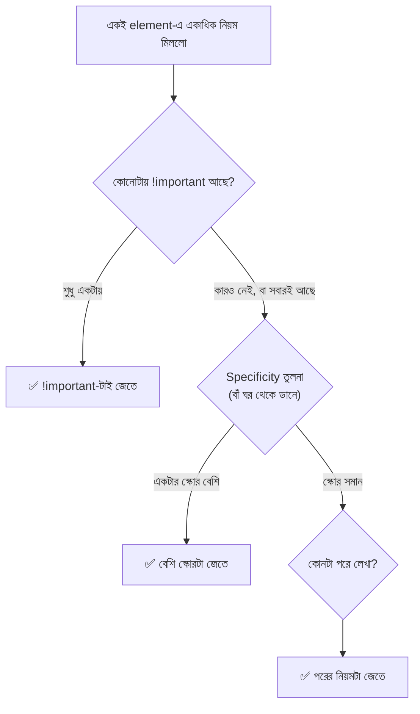

### `!important` — লাল সিলমোহর 🔴

```css
p { color: red !important; }   /* !important = "এই হুকুম আর কেউ কাটতে পারবে না" — inline style-কেও (সাধারণ) হারিয়ে দেয় */
```

- দুটোতেই `!important` থাকলে আবার Specificity দিয়ে ফয়সালা হয়, তারপর ক্রম।
- শুরুতে মনে হয় দারুণ সমাধান, কিন্তু এটা একটা **অস্ত্র-প্রতিযোগিতা**: একজন `!important` দিলে অন্যজনকেও `!important` দিতে হয়, তারপর আরও জোরালো selector… শেষে কেউ কিছু বদলাতে পারে না।

| ✅ যেখানে `!important` ব্যবহার ঠিক আছে | ❌ যেখানে এড়িয়ে চলুন |
|---|---|
| Utility class: `.hidden { display: none !important; }` — এই class যেখানেই লাগুক, কাজ করতেই হবে | নিজের লেখা CSS-এর দ্বন্দ্ব মেটাতে |
| থার্ড-পার্টি CSS বা inline style যেটা আপনি সম্পাদনা করতে পারেন না, সেটা override করতে | "কাজ করছে না" — কারণ না খুঁজেই সব জায়গায় লাগানো |
| ইউজারের নিজস্ব accessibility stylesheet | একটা কম্পোনেন্টের ভেতরের সাধারণ সাজে |

### `!important` ছাড়া বুদ্ধিমান সমাধান

1. **নিয়মটা সামান্য জোরালো করুন:** `.card .title` (0-0-2-0), `.card p.title`…
2. **কোড সাজান:** যে নিয়মটা জেতা দরকার সেটা পরে লিখুন।
3. **DevTools দেখুন:** Elements → Styles ট্যাবে যে নিয়ম হেরে গেছে তার উপর দিয়ে দাগ (strikethrough) টানা থাকে — কে জিতেছে আর কেন, সেটা সেখানেই বোঝা যায়।

### আধুনিক Specificity-সঙ্গী: `:is()`, `:where()`, `:not()`, `:has()`

| Selector | স্কোর কীভাবে হয় |
|---|---|
| `:is(#a, .b)` | ভেতরের সবচেয়ে **ভারী** selector-এর স্কোর (এখানে `#a` → 0-1-0-0) |
| `:where(#a, .b)` | সবসময় **০** — কোনো জোর নেই, তাই সহজেই override করা যায় (লাইব্রেরির ডিফল্ট সাজের জন্য দারুণ) |
| `:not(.x)` | ভেতরের selector-এর স্কোরই (এখানে 0-0-1-0), `:not` নিজে ০ |
| `:has(img)` | ভেতরের selector-এর স্কোর |

```css
:where(.card) p { color: gray; }   /* :where-এর জোর ০, তাই স্কোর শুধু p-এর = 0-0-0-1 — পরে যেকোনো .class সহজে হারিয়ে দেবে */
```

> **আরও আধুনিক:** `@layer` (Cascade Layers) দিয়ে CSS-কে স্তরে ভাগ করা যায়, আর পরে ঘোষণা করা layer আগেরটাকে Specificity যাই হোক হারিয়ে দেয়। এটা এখনই মুখস্থ না করলেও চলবে, শুধু জেনে রাখুন এমন একটা টুল আছে।

---

## ৩. Pseudo-elements — চেয়ারের আগে-পরের স্টিকার

স্বাদ-বাড়ির প্রতিটা প্লেট পরিবেশনের সময় ডিজাইনারের একটা নিয়ম: **প্লেটের আগে একটা ফুল, আর প্লেটের পরে একটা লেবুর টুকরো।** মজার ব্যাপার — সে আসল প্লেটে (HTML) হাত দেয় না। ফুল আর লেবু আলাদা করে "রান্নাঘরে বানানো" নয়, ডিজাইনার এমনি এমনি জুড়ে দেয়।

এই "ফুল" আর "লেবু"-ই হলো **Pseudo-element** — HTML-এ নতুন ট্যাগ না লিখেই CSS দিয়ে element-এর **ভেতরে, আগে বা পরে একটা বানানো অংশ** জুড়ে দেওয়া।

```css
.dish::before { content: "🌸 "; }    /* ::before = element-এর কন্টেন্টের ঠিক আগে একটা অংশ। content = সেই অংশে কী লেখা থাকবে */
.dish::after  { content: " 🍋"; }    /* ::after = কন্টেন্টের ঠিক পরে */
```

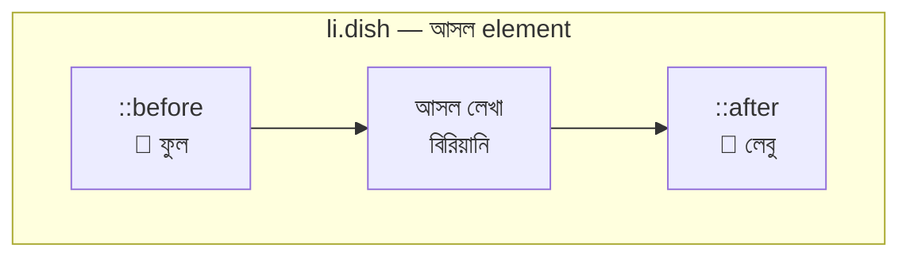

### `::before` আর `::after`-এর নিয়মকানুন

| নিয়ম | ব্যাখ্যা |
|---|---|
| **`content` অবশ্যই লাগবে** | `content` না লিখলে অংশটা আঁকাই হয় না। শুধু সাজের জন্য হলে `content: "";` (ফাঁকা) লিখতে হয় |
| element-এর **ভেতরে** বসে | সে element-এর সন্তান (প্রথম/শেষ), ভাইবোন নয় |
| ডিফল্টে `inline` | মাপ দিতে চাইলে `display: block` / `inline-block` বা `position: absolute` দিতে হয় |
| HTML-এ নেই | JavaScript দিয়ে সরাসরি ধরা যায় না, লেখাটা কপি-সিলেক্ট করাও যায় না |
| Screen reader | কিছু `content` টেক্সট পড়ে শোনাতে পারে — তাই **শুধু সাজের** জন্য ব্যবহার করুন, জরুরি তথ্যের জন্য নয় |
| যেসব ট্যাগে কাজ করে না | `img`, `input`, `br` — যাদের ভেতরে কিছু ঢোকানোর জায়গা নেই (replaced element) |
| `:` না `::`? | Pseudo-element-এ **`::` (ডাবল কোলন)**। পুরোনো কোডে `:before` দেখলেও কাজ করে, কিন্তু নতুন কোডে `::` লিখুন |

### বাস্তব ব্যবহার

**১. জরুরি ফিল্ডে লাল তারা (*):**

```css
.required::after {
  content: " *";          /* লেবেলের শেষে একটা তারা */
  color: #e63946;         /* লাল — মনোযোগ টানতে */
}
```

**২. বাইরের লিংকের পাশে তীর (Attribute Selector-এর সাথে জুটি):**

```css
a[href^="http"]::after {       /* http দিয়ে শুরু হওয়া লিংক */
  content: " ↗";              /* বাইরের লিংক বোঝাতে ছোট তীর */
  font-size: 0.8em;           /* তীরটা লেখার চেয়ে একটু ছোট */
}
```

**৩. Badge/Ribbon — "স্পেশাল" ট্যাগ:**

```html
<li class="dish special">কাচ্চি বিরিয়ানি</li>
```

```css
.dish.special {
  position: relative;          /* ::after-কে absolute বসাবো, তাই এই li-কে "ভিত্তি" বানালাম */
  padding-right: 90px;         /* ট্যাগের জায়গা ছেড়ে রাখলাম, লেখা যেন তার উপর না পড়ে */
}

.dish.special::after {
  content: "স্পেশাল";          /* ট্যাগের লেখা */
  position: absolute;          /* সাধারণ প্রবাহ থেকে বের করে সরাসরি কোণায় বসাবো */
  top: 8px;                    /* parent-এর উপর থেকে ৮px নিচে */
  right: 8px;                  /* parent-এর ডান থেকে ৮px ভেতরে */
  padding: 2px 10px;           /* ট্যাগের ভেতরের ফাঁকা */
  background-color: #e63946;   /* লাল ব্যাকগ্রাউন্ড */
  color: #fff;                 /* সাদা লেখা */
  border-radius: 20px;         /* ক্যাপসুল আকৃতি */
  font-size: 12px;             /* ছোট লেখা */
}
```

**৪. Hover-এ নিচের দাগ বাড়ার Animation:**

```css
.nav-link {
  position: relative;          /* ::after-এর ভিত্তি */
  text-decoration: none;       /* ডিফল্ট আন্ডারলাইন সরালাম, নিজের দাগ বানাবো */
}

.nav-link::after {
  content: "";                 /* ফাঁকা content — শুধু দাগ আঁকার একটা বক্স দরকার */
  position: absolute;
  left: 0;                     /* বাম কিনারা থেকে শুরু */
  bottom: -4px;                /* লেখার ৪px নিচে */
  width: 0;                    /* শুরুতে চওড়া ০ = অদৃশ্য */
  height: 2px;                 /* দাগের মোটা */
  background-color: #e63946;   /* দাগের রং */
  transition: width 0.3s ease; /* width বদলালে ০.৩ সেকেন্ডে ধীরে ধীরে বদলাবে */
}

.nav-link:hover::after { width: 100%; }   /* hover করলে দাগ বাম থেকে ডানে ১০০% ছড়িয়ে যাবে */
```

**৫. Tooltip — `attr()` দিয়ে HTML থেকে লেখা তুলে আনা:**

```html
<span class="tip" data-tip="ঝাল কম">কাচ্চি</span>
```

```css
.tip { position: relative; }        /* tooltip-এর ভিত্তি */

.tip::after {
  content: attr(data-tip);          /* attr() = HTML-এর data-tip attribute-এর মান ("ঝাল কম") তুলে এনে এখানে বসায় */
  position: absolute;
  bottom: 120%;                     /* লেখার উপরে বসবে */
  left: 50%;                        /* parent-এর মাঝখান থেকে শুরু */
  transform: translateX(-50%);      /* নিজের অর্ধেক চওড়া বাঁয়ে সরিয়ে ঠিক মাঝখানে আনলো (Transform অংশে বিস্তারিত) */
  padding: 4px 8px;
  background-color: #333;           /* গাঢ় ধূসর ব্যাকগ্রাউন্ড */
  color: #fff;
  border-radius: 6px;
  font-size: 12px;
  white-space: nowrap;              /* tooltip-এর লেখা এক লাইনেই থাকবে */
  opacity: 0;                       /* শুরুতে অদৃশ্য */
  pointer-events: none;             /* অদৃশ্য অবস্থায় মাউসের ক্লিক আটকাবে না */
  transition: opacity 0.2s;         /* ধীরে ফুটে উঠবে */
}

.tip:hover::after { opacity: 1; }   /* hover করলে দৃশ্যমান */
```

**৬. Clearfix — float করা সন্তানদের parent-কে "ধরে রাখা":**

```css
.clearfix::after {
  content: "";          /* ফাঁকা অংশ */
  display: table;       /* block-এর মতো নিজের জায়গা নেয় */
  clear: both;          /* উপরের float করা সবাইকে নিচে ঠেলে parent-কে তাদের ঘিরে রাখতে বাধ্য করে */
}
```

**৭. স্বয়ংক্রিয় ক্রমিক সংখ্যা (CSS Counter):**

```css
.steps { counter-reset: step; list-style: none; }         /* counter-reset = "step" নামে একটা গণনা ০ থেকে শুরু */
.steps li { counter-increment: step; }                    /* প্রতিটা li-তে গণনা ১ করে বাড়ে */
.steps li::before {
  content: counter(step) ". ";                            /* বর্তমান গণনার মান + ডট */
  font-weight: bold;
}
```

### অন্যান্য Pseudo-element

| Pseudo-element | কী ধরে |
|---|---|
| `::first-letter` | লেখার প্রথম অক্ষর (drop cap-এর জন্য) |
| `::first-line` | লেখার প্রথম লাইন |
| `::selection` | ইউজার মাউস দিয়ে যতটুকু সিলেক্ট করেছে |
| `::placeholder` | `input`-এর ভেতরের ম্লান নির্দেশনা-লেখা |
| `::marker` | তালিকার ডট বা নম্বর |
| `::backdrop` | `<dialog>` বা full-screen-এর পেছনের পর্দা |
| `::file-selector-button` | `input type="file"`-এর বাটন |

```css
p::first-letter {
  float: left;              /* অক্ষরটা বাঁয়ে ভাসিয়ে নিচের লাইনগুলো তার পাশ দিয়ে ঘুরে যাবে */
  font-size: 3em;           /* সাধারণ লেখার ৩ গুণ বড় */
  line-height: 1;           /* বড় অক্ষর যেন অতিরিক্ত লাইন-ফাঁক না নেয় */
  margin-right: 8px;        /* অক্ষর আর বাকি লেখার মাঝে ফাঁকা */
  color: #e63946;
}

::selection {
  background-color: #f4a261;   /* সিলেক্ট করা লেখার ব্যাকগ্রাউন্ড কমলা */
  color: #fff;
}

input::placeholder { color: #999; }   /* placeholder ম্লান ধূসর */
li::marker { color: #e63946; }        /* তালিকার ডটের রং লাল */
```

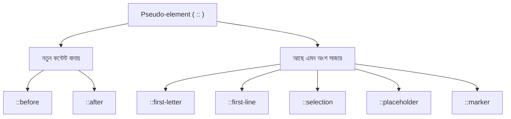

---

## ৪. Pseudo-classes — অবস্থা বুঝে সাজ

স্বাদ-বাড়ির চেয়ারগুলোকে ডিজাইনার একটা বিশেষ ক্ষমতা দিলো: **চেয়ার তার অবস্থা বুঝে নিজের সাজ বদলাবে।**

- কেউ চেয়ারে হাত রাখলে → হালকা উজ্জ্বল (**`:hover`**)
- কেউ চেয়ারের দিকে সরাসরি তাকালে → নীল আলো (**`:focus`**)
- সারির শেষ চেয়ার → নিচে দাগ থাকবে না (**`:last-child`**)
- জোড় নম্বরের চেয়ার → হালকা আলাদা রং (**`:nth-child(even)`**)
- "রিজার্ভড" নয় এমন সব চেয়ার → বসার অনুমতি (**`:not(.reserved)`**)

**Pseudo-class** হলো element-এর **অবস্থা (state)** বা **অবস্থান (position)** ধরে তাকে ডাকার উপায়। এক কোলন (`:`) দিয়ে লেখা হয়।

| | Pseudo-class (`:`) | Pseudo-element (`::`) |
|---|---|---|
| ধরে | element-এর **অবস্থা/অবস্থান** | element-এর একটা **অংশ** বা নতুন বানানো অংশ |
| উদাহরণ | `:hover`, `:first-child` | `::before`, `::first-letter` |
| মনে রাখার কৌশল | এক ফোঁটা = এক **অবস্থা** | দুই ফোঁটা = দুই **অংশ** (আগে-পরে) |

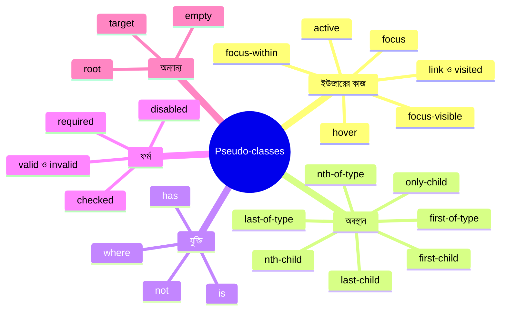

### ৪.১ ইউজারের কাজ: `:hover`, `:active`, `:focus` আর লিংকের অবস্থা

```css
a:link    { color: #e63946; }                          /* :link = যে লিংকে এখনো যাওয়া হয়নি */
a:visited { color: #6a4c93; }                          /* :visited = যে লিংকে আগে গেছেন (বেগুনি) */
a:hover   { color: #c1121f; text-decoration: underline; }  /* :hover = মাউস উপরে থাকলে */
a:active  { color: #780000; }                          /* :active = মাউস চেপে ধরা অবস্থায় (ক্লিকের মুহূর্ত) */
```

> **LVHA নিয়ম — "LoVe HAte":** **L**ink → **V**isited → **H**over → **A**ctive — এই ক্রমেই লিখতে হয়। কারণ চারটার স্কোর সমান (`0-0-1-1`), আর সমান হলে *পরে লেখাটা জেতে*। `:hover`-কে `:visited`-এর আগে লিখলে দেখা লিংকের উপর মাউস আনলে hover-এর রং কাজই করবে না!

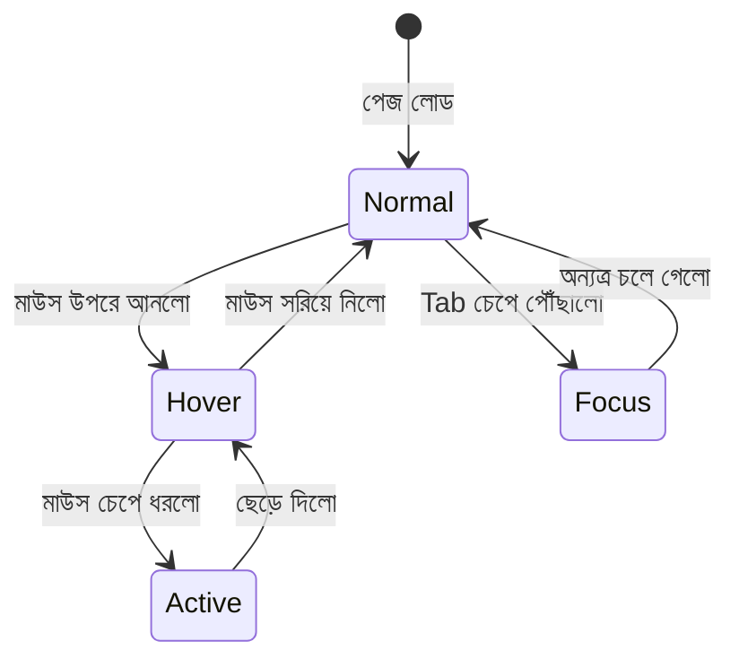

**`:focus` — কে মনোযোগ পাচ্ছে:**

`:focus` লাগে যেসব element-এ ইউজার ক্লিক বা `Tab` চেপে পৌঁছাতে পারে: `input`, `textarea`, `button`, `a`।

```css
input:focus {
  border-color: #2a9d8f;                        /* ফোকাস হলে বর্ডার সবুজ */
  outline: 3px solid rgba(42, 157, 143, 0.3);   /* বর্ডারের বাইরে স্বচ্ছ সবুজ আভা — কোথায় লিখছি তা স্পষ্ট */
}

button:focus-visible {                           /* :focus-visible = শুধু কীবোর্ডে ফোকাস হলে (মাউস ক্লিকে নয়) */
  outline: 3px solid #f4a261;                    /* কীবোর্ড ব্যবহারকারীর জন্য উজ্জ্বল দাগ */
  outline-offset: 3px;                           /* বাটন থেকে ৩px দূরে, যাতে গায়ে গায়ে না লাগে */
}

.form-group:focus-within label {                 /* :focus-within = ভেতরের যেকোনো সন্তান ফোকাসে থাকলে parent-ও সাড়া দেয় */
  color: #2a9d8f;                                /* input-এ লিখলে তার label-এর রং বদলে যাবে */
}
```

> ⚠️ **টাচ স্ক্রিনে `:hover` নেই।** তাই জরুরি তথ্য (যেমন "কিনতে ক্লিক করুন" বাটন) শুধু hover-এ দেখানো বিপজ্জনক। hover-কে সবসময় *বাড়তি সৌন্দর্য* ভাবুন।

### ৪.২ অবস্থান: `:first-child`, `:last-child`, `:nth-child()` ও পরিবার

আমাদের হাতে এই তালিকাটা আছে:

```html
<ul class="dish-list">
  <li>১. বিরিয়ানি</li>
  <li>২. খিচুড়ি</li>
  <li>৩. ইলিশ ভাজা</li>
  <li>৪. পোলাও</li>
  <li>৫. রোস্ট</li>
</ul>
```

```css
li:first-child { font-weight: bold; }                  /* সন্তানদের মধ্যে প্রথমটা (বিরিয়ানি) */
li:last-child  { border-bottom: none; }                /* সন্তানদের মধ্যে শেষটা (রোস্ট) — শেষে বাড়তি দাগ লাগবে না */
li:only-child  { color: gray; }                        /* একমাত্র সন্তান হলে */
li:nth-child(2) { color: #2a9d8f; }                    /* ঠিক ২ নম্বরটা */
li:nth-last-child(2) { color: #e63946; }               /* শেষ থেকে ২ নম্বরটা (পোলাও) */
```

### `:last-child` বনাম `:last-of-type` — সবচেয়ে বড় গোলমাল

একটা পোস্টের গল্প ধরি:

```html
<div class="post">
  <h2>শিরোনাম</h2>
  <p>প্যারা ১</p>
  <p>প্যারা ২</p>
  <p>প্যারা ৩</p>
  <span>লেখক: রাফসুন</span>
</div>
```

```css
.post p:last-child   { color: red; }   /* ❌ কিছুই মিলবে না! */
.post p:last-of-type { color: red; }   /* ✅ "প্যারা ৩" মিলবে */
```

**গল্পে বুঝি:**

- `:last-child` = *"পরিবারের সবচেয়ে ছোট সন্তান — সে **যে-ই হোক**।"* শর্ত দুটো একসাথে: (১) সে পরিবারের সবচেয়ে ছোট, **এবং** (২) সে একজন `p`। এখানে সবচেয়ে ছোট সন্তান `<span>`, `<p>` নয় — তাই কিছুই মেলে না।
- `:last-of-type` = *"একই জাতের (ট্যাগের) সন্তানদের মধ্যে সবচেয়ে ছোট।"* সব `p`-দের মধ্যে শেষটা "প্যারা ৩" — মিলে গেল।

| Pseudo-class | কী দেখে | মনে রাখার কৌশল |
|---|---|---|
| `:first-child` / `:last-child` / `:nth-child()` | **সব ধরনের** ভাইবোনের মধ্যে অবস্থান | সবাইকে গুনি |
| `:first-of-type` / `:last-of-type` / `:nth-of-type()` | **একই ট্যাগের** ভাইবোনের মধ্যে অবস্থান | শুধু নিজের জাতকে গুনি |

`nth-child` বনাম `nth-of-type`-এর পার্থক্যও একই:

```css
.post p:nth-child(2)   { }   /* .post-এর ২য় সন্তান কি একটা p? হ্যাঁ — "প্যারা ১" (কারণ ১ম সন্তান h2) */
.post p:nth-of-type(2) { }   /* p-দের মধ্যে ২য়টা → "প্যারা ২" */
```

### `:nth-child(An+B)` সূত্র — এক ঝলকে বোঝা

সূত্র: **`An + B`** — এখানে `n` শুরু হয় **০ থেকে** (০, ১, ২, ৩…)। প্রতিবার n বসিয়ে যে অবস্থান পাওয়া যায়, সেটাই মিলে যায়। (০ বা ঋণাত্মক অবস্থান বাদ যায়।)

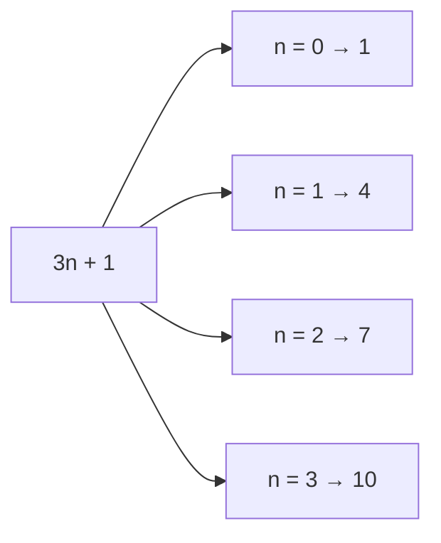

১০টা আইটেমের একটা তালিকায় কোন সূত্র কোনগুলো ধরে (✅ = মিলেছে):

| সূত্র | ১ | ২ | ৩ | ৪ | ৫ | ৬ | ৭ | ৮ | ৯ | ১০ | মানে |
|---|---|---|---|---|---|---|---|---|---|---|---|
| `3` | · | · | ✅ | · | · | · | · | · | · | · | শুধু ৩ নম্বর |
| `odd` | ✅ | · | ✅ | · | ✅ | · | ✅ | · | ✅ | · | বিজোড় (`2n+1`) |
| `even` | · | ✅ | · | ✅ | · | ✅ | · | ✅ | · | ✅ | জোড় (`2n`) |
| `3n` | · | · | ✅ | · | · | ✅ | · | · | ✅ | · | প্রতি ৩য় |
| `3n+1` | ✅ | · | · | ✅ | · | · | ✅ | · | · | ✅ | ১, ৪, ৭… |
| `n+4` | · | · | · | ✅ | ✅ | ✅ | ✅ | ✅ | ✅ | ✅ | ৪র্থ থেকে শেষ পর্যন্ত |
| `-n+3` | ✅ | ✅ | ✅ | · | · | · | · | · | · | · | প্রথম ৩টা |

```css
.dish:nth-child(even) { background-color: #fff3e6; }   /* জোড় নম্বরের সারিতে হালকা রং — "জেব্রা" ডোরাকাটা টেবিলের মতো, পড়তে সুবিধা */
.dish:nth-child(-n+3) { font-weight: bold; }           /* প্রথম ৩টা আইটেম বোল্ড — "টপ ৩" */
.dish:nth-child(3n)   { margin-right: 0; }             /* গ্রিডে প্রতি ৩য় আইটেমের ডান ফাঁকা বাদ */
```

### ৪.৩ `:not()` — "এ ছাড়া সবাই"

```css
.dish:not(.sold-out) { cursor: pointer; }
/* ".sold-out নয় এমন সব .dish" — শেষ হয়ে যাওয়া আইটেমে হাতের কার্সার আসবে না */

li:not(:last-child) { border-bottom: 1px dashed #d9c3ad; }
/* শেষটা ছাড়া সবার নিচে দাগ — শেষ আইটেমের নিচে বাড়তি দাগ না থাকার সবচেয়ে জনপ্রিয় কৌশল */

a:not([href^="http"]) { color: #2a9d8f; }
/* যেসব লিংক http দিয়ে শুরু নয় (মানে অভ্যন্তরীণ লিংক) */

input:not([type="submit"]) { border: 1px solid #ccc; }
/* submit বাটন ছাড়া সব input-এ বর্ডার */
```

### ৪.৪ যুক্তির সঙ্গীরা: `:is()`, `:where()`, `:has()`

```css
:is(h1, h2, h3):hover { color: #e63946; }
/* :is(...) = কমা-দেওয়া তালিকার যেকোনো একটা মিললেই হলো। h1:hover, h2:hover, h3:hover তিনবার লেখার বদলে একবার */

.card:has(img) { padding: 0; }
/* :has() = "parent selector" — যে .card-এর ভেতরে img আছে শুধু সেটাকে ধরে
   (নতুন ব্রাউজারে কাজ করে — সমর্থন যাচাই করে নিন) */
```

### ৪.৫ ফর্মের অবস্থা

```css
input:required { border-left: 3px solid #e63946; }          /* required attribute আছে এমন ইনপুটে বাঁ পাশে লাল দাগ */
input:invalid  { border-color: #e63946; }                   /* ভুল মান (যেমন ভুল ইমেইল) লিখলে লাল বর্ডার */
input:valid    { border-color: #2a9d8f; }                   /* সঠিক হলে সবুজ */
input:checked + label { font-weight: bold; }                /* checkbox বা radio টিক দিলে পাশের label মোটা (+ = ঠিক পরের ভাই) */
button:disabled { opacity: 0.5; cursor: not-allowed; }      /* disabled বাটন ম্লান, কার্সারে "না" চিহ্ন */
input:placeholder-shown { background-color: #fafafa; }      /* placeholder দেখা যাচ্ছে মানে ইনপুট এখনো ফাঁকা */
```

### ৪.৬ আরও কয়েকটা কাজের Pseudo-class

| Pseudo-class | কী ধরে | উদাহরণ |
|---|---|---|
| `:root` | পেজের সবার উপরের element (`<html>`) | `:root { --primary: #e63946; }` (CSS Variable রাখার সবচেয়ে জনপ্রিয় জায়গা) |
| `:empty` | ভেতরে কিছুই নেই এমন element | `p:empty { display: none; }` |
| `:target` | URL-এর `#id` অংশ যে element-কে নির্দেশ করে | `#offer:target { background: #fff3cd; }` |
| `:lang(bn)` | `lang="bn"` ঘোষিত element | `:lang(bn) { line-height: 1.8; }` |

---

## ৫. Transform — ম্যাজিক চশমা

উদ্বোধনের আগের রাতে ডিজাইনার একটা মজার জিনিস আবিষ্কার করলো — একটা **ম্যাজিক চশমা**। এই চশমা পরে কোনো জিনিসের দিকে তাকালে জিনিসটা:

- একটু **সরে** যায় (translate)
- **বড়-ছোট** হয়ে যায় (scale)
- **ঘুরে** যায় (rotate)
- **হেলে** যায় (skew)

কিন্তু আসল মজা হলো — **আসল জিনিসটা কিন্তু নিজের জায়গা থেকে নড়েনি!** শুধু চশমার ভেতর দিয়ে দেখলে মনে হয় নড়েছে। দেয়ালে ছবির ফ্রেম টাঙানো আছে, ফ্রেমের জায়গা ফাঁকা করে ছবিটা "দেখতে" একটু ডানে সরে গেল — কিন্তু ফ্রেমের জন্য বরাদ্দ জায়গা আগের মতোই দখল হয়ে আছে।

> 🔑 **Transform-এর সবচেয়ে বড় সত্য:** Transform করলে **আশেপাশের element-দের লেআউট বদলায় না।** element শুধু চোখে অন্য জায়গায় দেখা যায়, কিন্তু তার "বরাদ্দ জায়গা" আগের জায়গাতেই থেকে যায়।

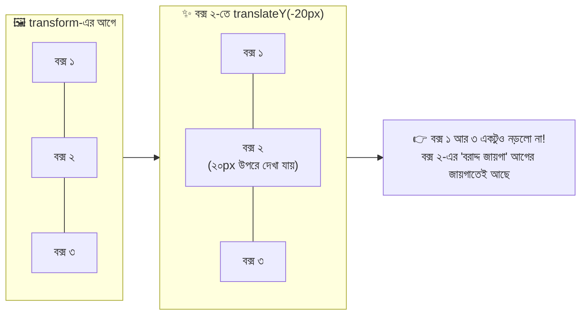

এই কারণেই Transform **অ্যানিমেশনের জন্য সবচেয়ে ভালো** — পুরো পেজের লেআউট বারবার নতুন করে হিসাব করতে হয় না, ব্রাউজার শুধু "চশমাটা" ঘোরায়। ফলে `margin` বা `top` বদলে অ্যানিমেট করার চেয়ে `transform` দিয়ে অ্যানিমেট করা অনেক মসৃণ (smooth) হয়।

### ৫.১ চারটা প্রধান ফাংশন এক নজরে

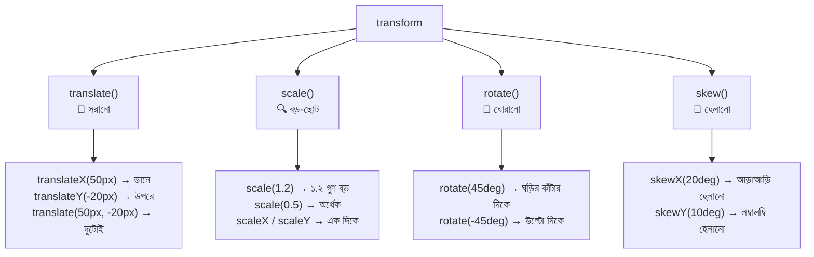

| ফাংশন | কী করে | উদাহরণ | মনে রাখার কৌশল |
|---|---|---|---|
| `translate(x, y)` | element-কে সরায় | `translate(20px, 10px)` | X = ডানে (+) / বামে (−), Y = **নিচে (+)** / উপরে (−) |
| `scale(n)` | মাপ বদলায় | `scale(1.1)` | ১ = আসল মাপ, ১-এর বেশি = বড়, ১-এর কম = ছোট |
| `rotate(angle)` | ঘোরায় | `rotate(90deg)` | পজিটিভ = ঘড়ির কাঁটার দিকে |
| `skew(x, y)` | হেলায় (parallelogram) | `skewX(-15deg)` | চিঠির ইটালিক লেখার মতো হেলে যাওয়া |

> ⚠️ **Y-অক্ষ উল্টো!** গণিতে Y উপরে বাড়ে, কিন্তু CSS-এ **Y নিচে বাড়ে**। তাই `translateY(-20px)` মানে ২০px **উপরে** যাওয়া। বেশিরভাগ নতুনরা এখানেই গুলিয়ে ফেলে।

### ৫.২ `translate` — সরানোর জাদু

```css
.tag {
  transform: translateX(30px);          /* শুধু ডানে ৩০px সরাও (বামে সরাতে -30px) */
}

.tag-up {
  transform: translateY(-10px);         /* ১০px উপরে — ঋণাত্মক মান মানে উল্টো দিক */
}

.tag-both {
  transform: translate(30px, -10px);   /* একসাথে: প্রথম মান X (ডানে ৩০), দ্বিতীয় মান Y (উপরে ১০) */
}
```

#### 🌟 সবচেয়ে বিখ্যাত ব্যবহার: ঠিক মাঝখানে বসানো (Perfect Centering)

`translate`-এ শতাংশ (`%`) দিলে সেটা **element-এর নিজের মাপের** শতাংশ ধরা হয় (parent-এর নয়)। এই বৈশিষ্ট্যটাই বিখ্যাত centering কৌশলের জন্ম দিয়েছে।

```html
<div class="banner">
  <div class="banner-text">অফার চলছে!</div>
</div>
```

```css
.banner {
  position: relative;                    /* ভেতরের absolute element-এর "ঠিকানা"-র মূল ধরা হবে এটাকে */
  height: 200px;                         /* মাঝখান বের করতে হলে parent-এর একটা নির্দিষ্ট উচ্চতা থাকা চাই */
  background-color: #ffe8d6;             /* এলাকাটা চোখে দেখার জন্য হালকা রং */
}

.banner-text {
  position: absolute;                    /* parent-এর ভেতরে যেখানে খুশি বসানোর ক্ষমতা */
  top: 50%;                              /* ওপর থেকে parent-এর উচ্চতার অর্ধেক নামো — কিন্তু এটা element-এর *উপরের কিনারা* বসায় */
  left: 50%;                             /* বাঁ থেকে parent-এর চওড়ার অর্ধেক — এটা element-এর *বাঁ কিনারা* বসায় */
  transform: translate(-50%, -50%);      /* এবার element-এর নিজের চওড়া-উচ্চতার অর্ধেক পিছিয়ে আনো — কিনারা থেকে সরে এখন *কেন্দ্র* ঠিক মাঝখানে */
}
```

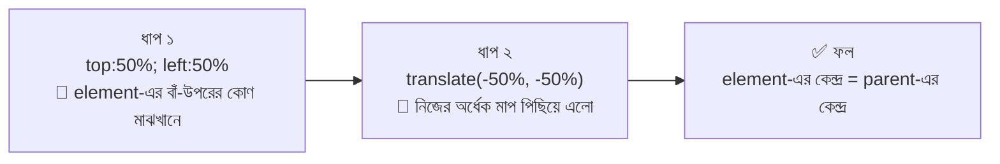

> 💡 **আধুনিক বিকল্প:** এখন Flexbox (`display: flex; justify-content: center; align-items: center;`) বা Grid (`place-items: center`) দিয়ে অনেক সহজে centering করা যায়। কিন্তু `translate(-50%, -50%)` কৌশলটা এখনো ইন্টারভিউতে আর পুরনো কোডে খুব দেখা যায় — তাই জানা জরুরি।

### ৫.৩ `scale` — বড়-ছোট করার জাদু

```css
.dish-card {
  transition: transform 0.3s ease;      /* transform বদলালে ০.৩ সেকেন্ডে মসৃণভাবে বদলাও — না দিলে ঝট করে লাফিয়ে বদলাবে */
}

.dish-card:hover {
  transform: scale(1.05);               /* মাউস রাখলে ৫% বড় — "আমাকে দেখো!" ভাব। 1 = আসল মাপ */
}

.dish-card:active {
  transform: scale(0.97);               /* চাপ দিলে একটু ছোট — বাটন "দেবে যাওয়ার" অনুভূতি */
}

.stretch-x { transform: scaleX(2); }     /* শুধু চওড়ায় দ্বিগুণ, উচ্চতা একই */
.stretch-y { transform: scaleY(0.5); }   /* শুধু উচ্চতায় অর্ধেক */
.flip-h    { transform: scaleX(-1); }    /* ঋণাত্মক মান = আয়নার মতো উল্টে যাওয়া (horizontal flip) */
```

> 💡 **`scale()` বনাম `width/height` বাড়ানো:** `scale` করলে element-এর ভেতরের সবকিছু (লেখা, ছবি, বর্ডার) একসাথে আনুপাতিকভাবে বড় হয় এবং **আশেপাশের element ঠেলা খায় না** (উপরের সত্যটা মনে আছে তো?)। `width` বাড়ালে আশেপাশের element সরে যায়।

### ৫.৪ `rotate` — ঘোরানোর জাদু

```css
.badge {
  transform: rotate(15deg);              /* ১৫° ঘড়ির কাঁটার দিকে — স্টিকার বা "ছাড়" ব্যাজের হালকা হেলা ভাব */
}

.arrow-open {
  transform: rotate(180deg);             /* ১৮০° = উল্টে যাওয়া — dropdown খুললে ▼ তীর ▲ হয়ে যায় */
}

.spinner {
  animation: spin 1s linear infinite;    /* spin নামের অ্যানিমেশন ১ সেকেন্ডে, একই গতিতে, অনন্তকাল চলবে */
}

@keyframes spin {
  from { transform: rotate(0deg); }      /* শুরুতে কোনো ঘূর্ণন নেই */
  to   { transform: rotate(360deg); }    /* শেষে পুরো এক চক্কর — তারপর আবার শুরু (infinite-এর কারণে) */
}
```

কোণ মাপার একক: `deg` (ডিগ্রি, সবচেয়ে প্রচলিত), `turn` (১turn = ৩৬০°, যেমন `0.25turn` = ৯০°), `rad`, `grad` (বিরল)।

### ৫.৫ `skew` — হেলানোর জাদু

```css
.ribbon-btn {
  transform: skewX(-15deg);              /* উপরটা ডানে-নিচটা বামে হেলে "parallelogram" আকৃতি — স্পোর্টি বাটনের চেহারা */
}

.ribbon-btn > span {
  display: inline-block;                 /* inline element-এ transform কাজ করে না, তাই inline-block */
  transform: skewX(15deg);               /* বাটন যতটা হেলেছে, ভেতরের লেখাকে ততটাই উল্টো হেলিয়ে আবার সোজা করা হলো */
}
```

> 🧠 **কৌশল:** parent-কে `skewX(-15deg)` করলে ভেতরের লেখাও হেলে যায়। লেখা সোজা রাখতে ভেতরের element-কে `skewX(15deg)` দিন — দুই হেলা একে অপরকে কেটে দেবে।

### ৫.৬ `transform-origin` — ঘোরার কেন্দ্রবিন্দু

ডিফল্টে সব transform হয় element-এর **ঠিক কেন্দ্র** ধরে (`50% 50%`)। দরজা যেমন কব্জা ধরে ঘোরে, তেমনি ঘোরার "খুঁটি" বদলাতে চাইলে `transform-origin`।

```css
.door {
  transform-origin: left center;         /* খুঁটি = বাঁ দিকের মাঝখান — দরজার কব্জার মতো */
  transition: transform 0.4s ease;       /* খোলা-বন্ধ মসৃণ করার জন্য */
}

.door:hover {
  transform: rotate(-30deg);             /* কব্জা ধরে দরজা খোলার মতো ঘুরবে (কেন্দ্র ধরে ঘুরলে এমন দেখাতো না) */
}

.clock-hand {
  transform-origin: bottom center;       /* ঘড়ির কাঁটার গোড়া ধরে ঘুরবে, মাথা ধরে নয় */
}
```

| মান | মানে |
|---|---|
| `center` (ডিফল্ট) | ঠিক মাঝখান |
| `top left` | বাঁ-উপরের কোণ |
| `bottom right` | ডান-নিচের কোণ |
| `20% 80%` | বাঁ থেকে ২০%, উপর থেকে ৮০% |

### ৫.৭ একাধিক transform একসাথে — ক্রম গুরুত্বপূর্ণ!

একাধিক transform এক লাইনে স্পেস দিয়ে লেখা যায়। কিন্তু **ক্রম বদলালে ফল বদলে যায়।** কারণ প্রতিটা transform আগের transform-এর তৈরি করা "অক্ষ" ধরে কাজ করে।

```css
.box-a { transform: translateX(100px) rotate(45deg); }
/* আগে ১০০px ডানে সরলো, তারপর নিজের জায়গায় ৪৫° ঘুরলো → ডানে গিয়ে ঘুরে গেল */

.box-b { transform: rotate(45deg) translateX(100px); }
/* আগে ৪৫° ঘুরলো (তার সাথে তার অক্ষও ঘুরে গেল), তারপর *ঘোরা অক্ষ বরাবর* ১০০px গেল → কোনাকুনি নিচের দিকে চলে গেল! */
```

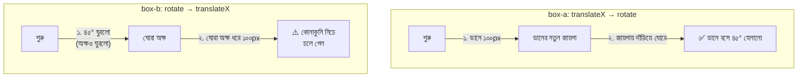

> 📝 **নিয়ম:** সাধারণত `translate → rotate → scale` ক্রমে লেখা নিরাপদ। ফল অদ্ভুত লাগলে ক্রম বদলে দেখুন।

> ⚠️ **সাবধান:** `transform` প্রপার্টি **পুরোটা replace করে।** `.card { transform: rotate(5deg); }` লিখে তারপর `.card:hover { transform: scale(1.1); }` লিখলে hover-এ rotate চলে যাবে! দুটো চাইলে hover-এও দুটোই লিখতে হবে: `transform: rotate(5deg) scale(1.1);`।

### ৫.৮ আধুনিক আলাদা প্রপার্টি: `translate`, `rotate`, `scale`

নতুন ব্রাউজারে transform-এর ফাংশনগুলো আলাদা প্রপার্টি হিসেবেও পাওয়া যায়। এতে উপরের "replace হয়ে যাওয়ার" সমস্যাটা এড়ানো যায়।

```css
.card {
  rotate: 5deg;                          /* আলাদা rotate প্রপার্টি — transform-এর সাথে সংঘর্ষ করে না */
}

.card:hover {
  scale: 1.1;                            /* hover-এ শুধু scale যোগ হলো, আগের rotate টিকে থাকলো */
}
```

> ℹ️ আধুনিক ব্রাউজারে ভালো সমর্থন আছে, তবে পুরনো ব্রাউজারের কথা ভাবলে (বিশেষ করে ক্লায়েন্টের সাইটে) `transform: ...` ফাংশনই এখনো নিরাপদ পছন্দ।

### ৫.৯ ঝলক: 3D transform

```css
.flip-card-wrapper {
  perspective: 800px;                    /* দর্শকের চোখ থেকে দূরত্ব — যত ছোট, 3D প্রভাব তত জোরালো। এটা parent-এ দিতে হয় */
}

.flip-card {
  transition: transform 0.6s;            /* উল্টানোর গতি */
  transform-style: preserve-3d;          /* ভেতরের child-রা যেন 3D স্পেসেই থাকে, চ্যাপ্টা না হয়ে যায় */
}

.flip-card:hover {
  transform: rotateY(180deg);            /* Y-অক্ষ (লম্বালম্বি দণ্ড) ধরে ১৮০° ঘুরবে — কার্ড উল্টে পেছনের পিঠ দেখাবে */
}

.flip-card .back,
.flip-card .front {
  backface-visibility: hidden;           /* কার্ড ঘুরে গেলে যার "পিঠ" আমাদের দিকে, সেটা লুকাও — না হলে দুটো মুখ একসাথে দেখা যায় */
}
```

| 3D ফাংশন | কী করে |
|---|---|
| `rotateX(deg)` | উপর-নিচ দিকে উল্টানো (আড়াআড়ি দণ্ড ধরে) |
| `rotateY(deg)` | ডান-বাম দিকে উল্টানো (লম্বালম্বি দণ্ড ধরে) |
| `translateZ(px)` | দর্শকের দিকে এগিয়ে আনা / পিছিয়ে দেওয়া |
| `perspective(px)` | transform-এর ভেতরেই গভীরতা দেওয়ার ফাংশন |

### ৫.১০ Transform নিয়ে কিছু গুরুত্বপূর্ণ কথা

| বিষয় | ব্যাখ্যা |
|---|---|
| **inline element-এ কাজ করে না** | `<span>`, `<a>` (ডিফল্ট inline) — `display: inline-block` বা `block` করে নিন |
| **নতুন "stacking context" তৈরি করে** | `transform` দিলে element-টা `z-index`-এর দিক থেকে নতুন একটা স্তর হয়ে যায় — কখনো কখনো অপ্রত্যাশিতভাবে অন্য element-এর উপরে/নিচে চলে যায় |
| **`position: fixed` child-এর উপর প্রভাব** | parent-এ `transform` থাকলে ভেতরের `position: fixed` element আর ভিউপোর্টের সাপেক্ষে নয়, ওই parent-এর সাপেক্ষে বসে — modal বা sticky header ভাঙার এক অদ্ভুত কারণ |
| **`overflow` কাটে না** | transform করা element জায়গা ছাপিয়ে গেলে scrollbar আসতে পারে — parent-এ `overflow: hidden` দিয়ে ঠেকানো যায় |
| **অ্যানিমেশনের জন্য সেরা** | `transform` আর `opacity` বদলালে ব্রাউজার সাধারণত GPU ব্যবহার করে — সবচেয়ে মসৃণ |

> 🍰 **WordPress দিকে একটু:** ফিচার্ড ইমেজে hover zoom ইফেক্ট বা WooCommerce প্রোডাক্ট কার্ডে hover-এ `translateY(-5px)` + shadow — এই দুটো `transform` দিয়েই থিমগুলোতে সবচেয়ে বেশি করা হয়। ইমেজ zoom করলে বাইরে ছাপিয়ে যাওয়া আটকাতে ইমেজের wrapper-এ `overflow: hidden` দিতে ভুলবেন না (Typography সেকশনে `overflow` বিস্তারিত আসছে)।

---

## ৬. Typography — মেনু-বোর্ডের লেখা

স্বাদ-বাড়ির সামনে একটা বিশাল মেনু-বোর্ড টাঙানো হবে। মালিক বললেন: *"খাবার যত ভালোই হোক, মেনু পড়তে কষ্ট হলে মেহমান অর্ধেক অর্ডার না দিয়েই চলে যাবে।"*

ডিজাইনার বুঝলো — মেনুর লেখা সাজানো মানে শুধু "সুন্দর" করা নয়, **পড়তে আরাম দেওয়া**। এর জন্য তার ছোট একটা টুলবক্স আছে:

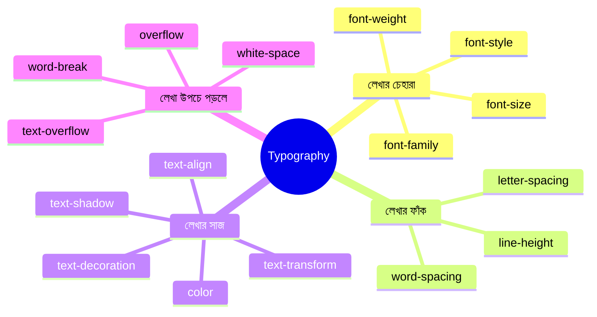

### ৬.১ `font-family` — লেখার "পোশাক"

```css
body {
  font-family: "Hind Siliguri", "Noto Sans Bengali", Arial, sans-serif;
  /* কমা দিয়ে আলাদা করা তালিকা — ব্রাউজার বাঁ থেকে ডানে প্রথম যেটা পায় সেটা ব্যবহার করে (fallback stack)।
     ১. "Hind Siliguri"     → আমাদের পছন্দের বাংলা ফন্ট (Google Fonts থেকে আনলে তবেই কাজ করবে)
     ২. "Noto Sans Bengali" → প্রথমটা না পেলে এটা
     ৩. Arial               → কোনো বাংলা ফন্ট না পেলেও অন্তত ইংরেজি অক্ষর সুন্দর দেখাবে
     ৪. sans-serif          → শেষ ভরসা — "generic family", ডিভাইসের যেকোনো sans-serif ফন্ট */
}
```

- **নামে স্পেস থাকলে** কোটেশন (`" "`) দিতে হয়: `"Hind Siliguri"`।
- **শেষে সবসময় একটা generic family** রাখুন: `serif` (কাঁটাওয়ালা, যেমন Times), `sans-serif` (কাঁটাহীন, যেমন Arial), `monospace` (কোড লেখার জন্য), `cursive`, `system-ui`।

### ৬.২ `font-size`, `font-weight`, `font-style`

```css
h1 {
  font-size: 2rem;                       /* লেখার মাপ। rem ব্যবহার করলে ইউজারের ব্রাউজার-সেটিংস মেনে চলে (rem নিয়ে ৭ নম্বর সেকশনে বিস্তারিত) */
  font-weight: 700;                      /* মোটা-পাতলা: 100 (সবচেয়ে পাতলা) থেকে 900 (সবচেয়ে মোটা)। 400 = normal, 700 = bold */
  font-style: italic;                    /* হেলানো লেখা। normal (সোজা) | italic | oblique */
}
```

| `font-weight` মান | নাম |
|---|---|
| `100` | Thin |
| `300` | Light |
| `400` | Normal (ডিফল্ট) |
| `500` | Medium |
| `600` | Semi-bold |
| `700` | **Bold** |
| `900` | Black |

> ⚠️ কোনো ফন্টের সব weight থাকে না। Google Fonts থেকে ফন্ট আনার সময় শুধু যে weight গুলো লাগবে সেগুলোই আনুন — না হলে ব্রাউজার "নকল bold" বানিয়ে লেখা বিকৃত করে দেখাতে পারে।

### ৬.৩ `line-height` — লাইনের মাঝের ফাঁক

মেনুর দুই লাইন যদি গায়ে গায়ে লেগে থাকে, পড়তে কষ্ট। আবার বেশি ফাঁক থাকলে লাইনগুলো ছিন্নভিন্ন লাগে। `line-height` হলো এক লাইনের ভূমি থেকে পরের লাইনের ভূমির দূরত্ব।

```css
p {
  line-height: 1.6;                      /* ইউনিটহীন সংখ্যা = font-size-এর ১.৬ গুণ। ১৬px লেখায় লাইনের উচ্চতা ২৫.৬px। */
}

/* ❌ px বা em দিলে কী সমস্যা? */
.bad  { line-height: 24px; }             /* font-size পরে বদলালে line-height স্থির থেকে যায় — বড় ফন্টে লাইন চেপে যায় */
.good { line-height: 1.5; }              /* ইউনিটহীন → child element-রা নিজের font-size অনুযায়ী নিজে হিসাব করে নেয় ✅ */
```

| ব্যবহার | সুপারিশ |
|---|---|
| সাধারণ প্যারাগ্রাফ | `1.5` – `1.7` |
| **বাংলা লেখা** | `1.7` – `1.9` (বাংলার মাত্রা, উপর-নিচের চিহ্ন ও যুক্তাক্ষরের জন্য একটু বেশি জায়গা লাগে) |
| বড় শিরোনাম | `1.1` – `1.3` |
| বাটনের লেখা একলাইনে মাঝখানে বসাতে | `line-height` = বাটনের `height` (পুরনো কৌশল) |

### ৬.৪ `letter-spacing` আর `word-spacing`

```css
.logo {
  letter-spacing: 3px;                   /* প্রতিটা অক্ষরের মাঝে ৩px বাড়তি ফাঁক — লোগো/শিরোনামে "ছড়ানো" রাজকীয় ভাব */
  text-transform: uppercase;             /* ইংরেজি অক্ষর বড় হাতের — সাধারণত letter-spacing-এর সাথে যায় */
}

.tight {
  letter-spacing: -0.5px;                /* ঋণাত্মক মান = অক্ষরগুলো কাছাকাছি — বড় শিরোনামে মাঝে মাঝে ব্যবহার হয় */
}

.airy {
  word-spacing: 8px;                     /* শব্দের মাঝের ফাঁক (অক্ষরের মাঝের নয়) */
}
```

> 🔤 **বাংলার জন্য সাবধান:** বাংলা অক্ষর যুক্তাক্ষর ও কার-চিহ্নের মাধ্যমে একসাথে জুড়ে থাকে। `letter-spacing` বেশি দিলে যুক্তাক্ষর ভেঙে বা কারগুলো আলাদা হয়ে গিয়ে পড়তে অসুবিধা হয়। বাংলা লেখায় সাধারণত `letter-spacing` না দেওয়াই ভালো (`normal`)।

### ৬.৫ `text-align` ও `text-indent`

```css
.title    { text-align: center; }        /* লেখা মাঝখানে। অন্য মান: left | right | justify (দুই পাশ সমান) — এটা block element-এর *ভেতরের* inline লেখাকে সাজায়, block-টাকে নয় */
.para     { text-indent: 2em; }          /* প্যারাগ্রাফের প্রথম লাইন ২em ভেতরে — বইয়ের মতো */
```

### ৬.৬ `text-decoration` — দাগ টানা

```css
a {
  text-decoration: none;                 /* লিংকের ডিফল্ট আন্ডারলাইন সরাও — মেনু/নেভবারে প্রায়ই লাগে */
}

a:hover {
  text-decoration: underline;            /* hover করলে আন্ডারলাইন ফিরিয়ে আনো — যে ক্লিক করা যায় তার ইঙ্গিত */
}

.old-price {
  text-decoration: line-through;         /* মাঝ বরাবর কাটা দাগ — পুরনো দাম দেখাতে: ৳৫০০ */
}

.fancy {
  text-decoration: underline wavy #e63946;   /* shorthand: [line] [style] [color] → লাল ঢেউ খেলানো আন্ডারলাইন */
  text-decoration-thickness: 2px;            /* দাগ কত মোটা */
  text-underline-offset: 4px;                /* লেখা থেকে আন্ডারলাইন কতটা নিচে — নিচে নামালে যুক্তাক্ষরের "পা" কাটে না, চেহারাও সুন্দর */
}
```

| `text-decoration-line` | ফল |
|---|---|
| `none` | কোনো দাগ নেই |
| `underline` | নিচে দাগ |
| `overline` | উপরে দাগ |
| `line-through` | মাঝখান দিয়ে কাটা |

| `text-decoration-style` | ফল |
|---|---|
| `solid` | সোজা দাগ |
| `dotted` / `dashed` | বিন্দু / ড্যাশ |
| `double` | দুটো দাগ |
| `wavy` | ঢেউ খেলানো |

### ৬.৭ `text-transform` — অক্ষরের হাত বদল

```css
.shout   { text-transform: uppercase; }    /* "menu" → "MENU" — সব বড় হাতের */
.whisper { text-transform: lowercase; }    /* "MENU" → "menu" — সব ছোট হাতের */
.title   { text-transform: capitalize; }   /* "special beef curry" → "Special Beef Curry" — প্রতি শব্দের প্রথম অক্ষর বড় */
```

> 💡 **মূল লেখা বদলায় না**, শুধু পর্দায় দেখা বদলায়। HTML-এ লেখা "Menu" থাকলে `uppercase` দিলেও সোর্সে "Menu"-ই থাকে। **বাংলা অক্ষরে এগুলোর কোনো প্রভাব নেই** (বাংলায় বড়-ছোট হাতের অক্ষর নেই)।

### ৬.৮ `color` — লেখার রং

```css
p {
  color: #333;                           /* লেখার রং। কালো (#000) না দিয়ে গাঢ় ধূসর দিলে চোখে আরাম বেশি — আসল কালো সাদা ব্যাকগ্রাউন্ডে কড়া লাগে */
}
```

`color` প্রপার্টির রঙের সব ধরন ৮ নম্বর সেকশনে (Colors) আসছে। মনে রাখুন: `color` **inherit হয়** — `body`-তে দিলে ভেতরের প্রায় সব লেখা পেয়ে যায়।

### ৬.৯ `text-shadow` — লেখার ছায়া

```css
.hero-title {
  text-shadow: 2px 2px 4px rgba(0, 0, 0, 0.5);
  /* চারটা মান পরপর:
     ২px → ছায়া ডানে সরবে (X অফসেট)
     ২px → ছায়া নিচে সরবে (Y অফসেট)
     ৪px → ছায়া কতটা ঝাপসা (blur)
     rgba(...) → ছায়ার রং — ৫০% স্বচ্ছ কালো */
}
```

> 🖼️ ছবির উপর লেখা বসালে (hero banner) হালকা `text-shadow` লেখাকে ছবি থেকে আলাদা করে পড়তে সাহায্য করে।

### ৬.১০ `overflow` — উপচে পড়া জিনিসের ভাগ্য

গল্প: মেনু-বোর্ডের ফ্রেম ছোট, কিন্তু লেখা বেশি। উপচে পড়া লেখা নিয়ে কী করবে?

```css
.menu-board {
  width: 300px;                          /* ফ্রেমের চওড়া নির্দিষ্ট */
  height: 100px;                         /* ফ্রেমের উচ্চতা নির্দিষ্ট — ভেতরের লেখা এর চেয়ে বেশি হলে overflow ঘটে */
  overflow: hidden;                      /* কী করবো? ↓ নিচের ছকে মানগুলো দেখুন */
}
```

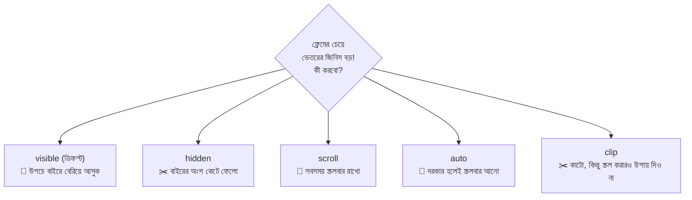

| মান | আচরণ | কোথায় লাগে |
|---|---|---|
| `visible` | উপচে বাইরে বেরোয় (ডিফল্ট) | সাধারণ অবস্থা |
| `hidden` | বাইরের অংশ কেটে লুকিয়ে ফেলে | ছবির hover zoom, গোল ছবি (`border-radius` + `overflow:hidden`), text ellipsis |
| `scroll` | সবসময় স্ক্রলবার দেখায় (দরকার না থাকলেও) | ব্যবহার তুলনামূলক কম |
| `auto` | **দরকার হলেই** স্ক্রলবার দেখায় | চ্যাট বক্স, modal-এর ভেতরের লম্বা কন্টেন্ট, টেবিলের `overflow-x: auto` |

```css
.chat-box   { height: 300px; overflow-y: auto; }    /* শুধু উপর-নিচ স্ক্রল — বেশি মেসেজ এলে স্ক্রলবার */
.wide-table { overflow-x: auto; }                    /* শুধু ডান-বাম স্ক্রল — মোবাইলে চওড়া টেবিল পাশে টেনে দেখার জন্য */
```

> 🎯 **`overflow: hidden`-এর একটা গোপন কাজ:** float করা child-এর জন্য parent-এর উচ্চতা শূন্য হয়ে গেলে (collapse), parent-এ `overflow: hidden` দিলে সে child-দের ধরে রেখে আবার উচ্চতা ফিরে পায়। এটা `clearfix`-এর আরেকটা সহজ বিকল্প।

### ৬.১১ লেখা উপচে পড়া: `text-overflow: ellipsis` (তিনের জাদু)

মেনুতে খাবারের নাম বেশি লম্বা হলে শেষে "..." দিয়ে কেটে দিতে চান? তিনটা প্রপার্টি **একসাথে** লাগবে, একটা বাদ গেলেও কাজ করবে না:

```css
.dish-title {
  white-space: nowrap;                   /* ১. লেখা যেন ভেঙে নতুন লাইনে না যায় — এক লাইনেই থাকুক */
  overflow: hidden;                      /* ২. ফ্রেমের বাইরের অংশ লুকিয়ে ফেলো */
  text-overflow: ellipsis;               /* ৩. লুকানো অংশের জায়গায় "…" বসাও */
  max-width: 220px;                      /* একটা সীমা থাকা চাই — সীমা না থাকলে "উপচে পড়া" ঘটবেই না */
}
```

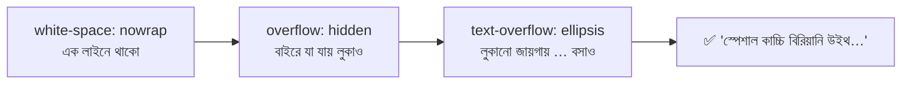

**একাধিক লাইনের পর "..." চান?** (যেমন ব্লগ কার্ডের সংক্ষিপ্ত বিবরণ — ৩ লাইন পর কাটা)

```css
.excerpt {
  display: -webkit-box;                  /* পুরনো flexbox-এর একটা রূপ — line-clamp এই অবস্থার উপর নির্ভর করে */
  -webkit-box-orient: vertical;          /* ভেতরের লাইনগুলো উপর-নিচে সাজানো */
  -webkit-line-clamp: 3;                 /* সর্বোচ্চ ৩ লাইন দেখাও */
  line-clamp: 3;                         /* মানক (standard) নাম — নতুন ব্রাউজারের জন্য */
  overflow: hidden;                      /* ৩ লাইনের পরের অংশ লুকাও */
}
```

> 🍰 **WordPress দিকে একটু:** থিমে "Recent Posts" বা প্রোডাক্ট গ্রিডে লম্বা নামের কারণে কার্ডের উচ্চতা এলোমেলো হলে এই দুটো কৌশলই সাধারণত সমাধান।

### ৬.১২ `white-space`, `word-break`, `overflow-wrap`

| প্রপার্টি ও মান | কী করে | কোথায় লাগে |
|---|---|---|
| `white-space: nowrap` | লাইন ভাঙবে না | ellipsis, বাটনের লেখা |
| `white-space: pre-wrap` | লেখার স্পেস ও Enter সংরক্ষণ করে, তবে লাইন ভাঙে | কোড/কবিতা, textarea-র আউটপুট |
| `overflow-wrap: anywhere` (বা `break-word`) | খুব লম্বা শব্দ/URL দরকারে ভেঙে নতুন লাইনে নেয় | লম্বা লিংক বা ইমেইল কার্ডের বাইরে বেরোলে |
| `word-break: break-all` | যেকোনো অক্ষরের মাঝে ভাঙে (আক্রমণাত্মক) | শেষ ভরসা — বাংলা/ইংরেজি শব্দ ভেঙে যায় বলে সাবধান |

### ৬.১৩ `font` shorthand (এক লাইনে সব)

```css
p {
  font: italic 400 1rem/1.6 "Hind Siliguri", sans-serif;
  /* ক্রম: [style] [weight] [size]/[line-height] [family]
     ⚠️ font-size আর font-family থাকা বাধ্যতামূলক, নইলে পুরো লাইন বাতিল।
     ⚠️ shorthand ব্যবহার করলে যা লেখেননি সেগুলো ডিফল্টে রিসেট হয়ে যায় (যেমন আগে দেওয়া font-weight ফিরে normal হবে) */
}
```

> 📝 নতুনদের জন্য পরামর্শ: shorthand-এর ক্রম মনে না থাকলে আলাদা আলাদা প্রপার্টি (`font-size`, `font-weight`, `line-height`, `font-family`) লিখুন। পড়তে সহজ, ভুল কম।

### ৬.১৪ Google Fonts যোগ করার নিয়ম (HTML ও CSS দুই উপায়ে)

```html
<!-- উপায় ১ (সুপারিশ): HTML-এর <head>-এ <link> দিয়ে -->
<link rel="preconnect" href="https://fonts.googleapis.com">          <!-- ফন্ট সার্ভারের সাথে আগেই "হ্যান্ডশেক" সেরে রাখো — লোড দ্রুত হয় -->
<link rel="preconnect" href="https://fonts.gstatic.com" crossorigin> <!-- ফন্ট ফাইল যে সার্ভারে থাকে, তার সাথেও আগাম সংযোগ -->
<link href="https://fonts.googleapis.com/css2?family=Hind+Siliguri:wght@400;600;700&display=swap" rel="stylesheet">
<!-- wght@400;600;700 → শুধু এই তিন weight আনো (যা লাগবে না তা আনলে পেজ ভারী হয়)
     display=swap     → ফন্ট লোড না হওয়া পর্যন্ত ডিফল্ট ফন্টে লেখা দেখাও, ফাঁকা পর্দা নয় -->
```

```css
/* উপায় ২: CSS ফাইলের একদম উপরে @import (সহজ কিন্তু একটু ধীর — CSS ডাউনলোড শেষ হওয়ার পর ফন্ট আনার কাজ শুরু হয়) */
@import url("https://fonts.googleapis.com/css2?family=Hind+Siliguri:wght@400;600;700&display=swap");
```

> 🧠 **WordPress-এ:** থিমে সাধারণত `wp_enqueue_style()` দিয়ে ফন্টের URL লোড করা হয়। ক্লায়েন্টের সাইটে GDPR বা পারফরম্যান্স নিয়ে ভাবলে ফন্ট ডাউনলোড করে নিজের সার্ভার থেকে দেওয়া (self-hosting) একটা জনপ্রিয় বিকল্প।

---

## ৭. Units — মাপার ফিতার গল্প

স্বাদ-বাড়ির মালিক বললেন: *"টেবিল ২ মিটার লম্বা হবে।"* কাঠমিস্ত্রি বললো: *"কিন্তু স্যার, ঘর যদি ছোট হয়ে যায়? আপনি কি 'ঘরের অর্ধেক' বলছেন, নাকি সত্যিকারের ২ মিটার?"*

ঠিক এই প্রশ্নটাই CSS-এ প্রতিবার আসে — **"মাপটা কীসের সাপেক্ষে?"** এই কারণেই CSS-এ এত রকম ইউনিট (Unit) আছে। ডিজাইনারের ঝোলায় আছে দুই ধরনের ফিতা:

- 📏 **স্থির ফিতা (Absolute):** যা বলা হয়েছে তা-ই। পরিবেশ বদলালেও মাপ বদলায় না। → **`px`**
- 🧵 **রবারের ফিতা (Relative):** অন্য কিছুর সাপেক্ষে মাপে। পরিবেশ বদলালে মাপও বদলায়। → **`em`, `rem`, `%`, `vw`, `vh`, `fr`**

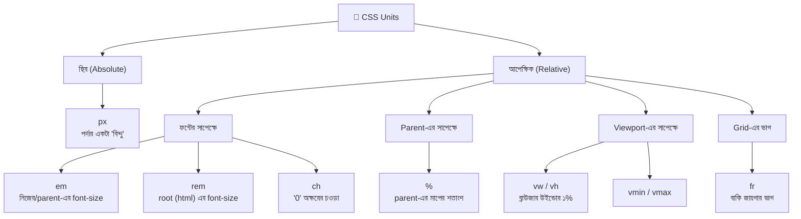

### ৭.১ `px` — স্থির ফিতা

```css
.border-line {
  border: 1px solid #ccc;                /* ১px = পাতলা দাগ। বর্ডার, ছায়া (shadow), ছোট ফাঁক — যেখানে নিখুঁত, স্থির মাপ চাই */
}

.icon {
  width: 24px;                           /* আইকনের মাপ ঠিক ২৪px — ইউজারের ফন্ট-সেটিং বদলালেও যেন আইকন না ফোলে */
  height: 24px;
}
```

**কোথায় `px` ভালো:** বর্ডার, box-shadow, আইকন/ছবির নির্দিষ্ট মাপ, media query-র ব্রেকপয়েন্ট (`@media (min-width: 768px)`)।

**কোথায় সতর্ক:** `font-size`-এ। যদি কেউ ব্রাউজার সেটিংসে "বড় লেখা" বেছে রাখে (যেমন দৃষ্টিশক্তি কম এমন কেউ), `px` দিয়ে লেখা `font-size` সেই সেটিং মানে না। তাই লেখার মাপের জন্য `rem` ভালো।

> ℹ️ `1px` মানে সবসময় ঠিক একটা ফিজিক্যাল পিক্সেল নয়। হাই-রেজোলিউশন (Retina) পর্দায় ১ CSS পিক্সেল = একাধিক ফিজিক্যাল পিক্সেল। এটা ব্রাউজার নিজে সামলে নেয়।

### ৭.২ `em` — "আমার মাপ বা আমার parent-এর মাপ"

`em` হলো **ফন্ট-সাইজের সাপেক্ষে** মাপ। কিন্তু "কার ফন্ট-সাইজ?" — এখানেই ধাঁধা:

| কোথায় `em` লিখলেন | কার `font-size`-এর সাপেক্ষে |
|---|---|
| `font-size` প্রপার্টিতে | **Parent-এর** font-size |
| অন্য যেকোনো প্রপার্টিতে (`padding`, `margin`, `width`...) | **নিজের** font-size |

```css
.button {
  font-size: 20px;                       /* এই বাটনের নিজের লেখার মাপ */
  padding: 0.5em 1em;                    /* উপর-নিচে ০.৫ × ২০ = ১০px, ডানে-বামে ১ × ২০ = ২০px।
                                            সুবিধা: font-size বাড়ালে padding নিজে নিজেই আনুপাতিকভাবে বাড়ে — বাটন সবসময় "ভারসাম্যে" থাকে */
}
```

#### ⚠️ `em`-এর "চক্রবৃদ্ধি" ফাঁদ

`font-size`-এ `em` লিখলে সেটা **parent-এর মাপ ধরে** হিসাব হয়। ভেতরে ভেতরে নেস্ট (nest) করলে প্রতিটা স্তরে গুণ হতে থাকে:

```html
<ul>                          <!-- ধরুন এই স্তরে font-size = 16px -->
  <li>স্তর ১
    <ul>
      <li>স্তর ২
        <ul>
          <li>স্তর ৩</li>
        </ul>
      </li>
    </ul>
  </li>
</ul>
```

```css
li { font-size: 1.2em; }                 /* প্রতিটা li তার parent-এর ১.২ গুণ */
```

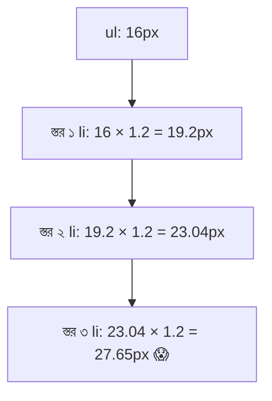

প্রতিটা স্তরে লেখা আরও ফুলে যাচ্ছে — ভুলটা ধরা কঠিন, কারণ প্রতিটা `li`-তে একই `1.2em` লেখা। **এই সমস্যার সমাধান `rem`।**

### ৭.৩ `rem` — "সবার একই মূল মাপ" ✅

`rem` = **r**oot **em**। এটা সবসময় **`<html>` ট্যাগের `font-size`-এর** সাপেক্ষে হিসাব হয় — মাঝখানে কতগুলো nested element থাকলো তাতে কিছু আসে-যায় না।

ব্রাউজারের ডিফল্ট `html { font-size: 16px; }`। তাই:

| লেখা | মান (ডিফল্টে) |
|---|---|
| `1rem` | 16px |
| `1.5rem` | 24px |
| `2rem` | 32px |
| `0.875rem` | 14px |
| `0.5rem` | 8px |

```css
li { font-size: 1.2rem; }                /* সব স্তরের li ঠিক ১.২ × ১৬ = ১৯.২px — চক্রবৃদ্ধি ঝামেলা নেই ✅ */

h1 { font-size: 2.5rem; }                /* ইউজার ব্রাউজারে বড় লেখা বেছে নিলে (ডিফল্ট ১৬px → ২০px), সব rem আনুপাতিকভাবে বাড়বে — accessibility-র জন্য চমৎকার */
```

> 🚫 **`html { font-size: 62.5%; }` কৌশল নিয়ে সাবধান।** অনেক টিউটোরিয়ালে দেখবেন (যাতে `1rem = 10px` হয়ে হিসাব সহজ হয়)। কিন্তু এটা ইউজারের নিজের ফন্ট-সেটিং আংশিকভাবে ভেঙে দিতে পারে, আর WordPress থিমে/প্লাগিনে অন্য কোডের সাথে সংঘর্ষ ঘটাতে পারে। সাধারণ নিয়ম: **`html`-এর `font-size` ঘাঁটবেন না।**

#### `em` বনাম `rem` — কখন কোনটা?

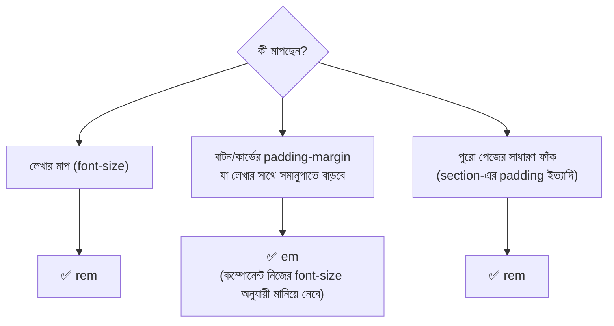

### ৭.৪ `%` — Parent-এর শতাংশ

`%` মানে **"আমার parent-এর মাপের এত শতাংশ"** — কিন্তু কীসের শতাংশ, তা নির্ভর করে কোন প্রপার্টিতে লিখেছেন তার উপর:

| প্রপার্টি | `%` কীসের শতাংশ? |
|---|---|
| `width` | Parent-এর **চওড়ার** |
| `height` | Parent-এর **উচ্চতার** (parent-এর উচ্চতা স্পষ্ট করে দেওয়া না থাকলে কাজ করে না!) |
| `padding` / `margin` (চার দিকেই, উপর-নিচেও) | Parent-এর **চওড়ার** ⚠️ |
| `font-size` | Parent-এর **font-size**-এর |
| `line-height` | **নিজের** font-size-এর |
| `top` / `left` (positioned element) | Containing block-এর উচ্চতা/চওড়ার |
| `translate()` | **নিজের** মাপের (আগের Transform সেকশন মনে আছে?) |

```css
.card-grid {
  width: 100%;                           /* parent যত চওড়া, ততটাই */
}

.card {
  width: 48%;                            /* parent-এর প্রায় অর্ধেক — দুটো পাশাপাশি বসবে; বাকি ৪% দুই কার্ডের মাঝের ফাঁকের জন্য */
  padding: 5%;                           /* ⚠️ এই ৫% হলো parent-এর *চওড়া*-র ৫% — উপর-নিচের padding-ও! (উচ্চতার নয়) */
}

.hero {
  height: 50%;                           /* ⚠️ এটা তখনই কাজ করবে যদি parent-এর height স্পষ্ট করে দেওয়া থাকে (যেমন height: 400px)। parent-এর height 'auto' হলে ৫০% কিছুই করে না */
}
```

> 🧠 **কেন উচ্চতার `%` এত ঝামেলার?** চওড়া সহজে হিসাব হয় (ব্রাউজার উইন্ডোর চওড়া জানা), কিন্তু উচ্চতা নির্ভর করে ভেতরের কন্টেন্টের উপর। "কন্টেন্টের উচ্চতা ঠিক করতে parent-এর উচ্চতা দরকার, parent-এর উচ্চতা ঠিক করতে কন্টেন্টের উচ্চতা দরকার" — এই চক্র এড়াতেই ব্রাউজার auto উচ্চতার `%`-কে উপেক্ষা করে। উচ্চতার জন্য `min-height` আর `vh` বেশি নিরাপদ।

### ৭.৫ `vw`, `vh`, `vmin`, `vmax` — Viewport-এর ইউনিট

**Viewport** = ব্রাউজারের দৃশ্যমান জানালা। এর মাপ থেকে মাপা হয়:

| ইউনিট | মানে |
|---|---|
| `1vw` | Viewport-এর **চওড়ার ১%** |
| `1vh` | Viewport-এর **উচ্চতার ১%** |
| `1vmin` | `vw` আর `vh`-এর মধ্যে **যেটা ছোট** তার ১% |
| `1vmax` | `vw` আর `vh`-এর মধ্যে **যেটা বড়** তার ১% |

```css
.hero-section {
  min-height: 100vh;                     /* কমপক্ষে পুরো স্ক্রিনের সমান উচ্চতা — ল্যান্ডিং পেজের "ফুল-স্ক্রিন" হিরো সেকশন। min- ব্যবহার করলাম যাতে কন্টেন্ট বেশি হলে সেকশন বড় হতে পারে */
}

.sidebar {
  width: 25vw;                           /* সবসময় উইন্ডোর চওড়ার এক-চতুর্থাংশ — parent যা-ই হোক */
}

.big-title {
  font-size: 5vw;                        /* উইন্ডো ছোট-বড় করলে লেখাও ছোট-বড় (fluid typography) — তবে খুব ছোট বা বড় পর্দায় বেমানান হতে পারে, তাই নিচের clamp() দেখুন */
}
```

#### দুটো বিখ্যাত ফাঁদ

1. **`100vw` ও স্ক্রলবার:** `100vw`-এর মধ্যে স্ক্রলবারের চওড়াও গোনা হয়। ফলে পেজে উল্লম্ব স্ক্রলবার থাকলে `width: 100vw` দিলে সামান্য অনুভূমিক স্ক্রল চলে আসে। **সমাধান:** `width: 100%` ব্যবহার করুন।
2. **মোবাইলে `100vh` সমস্যা:** মোবাইল ব্রাউজারের ঠিকানা-বার লুকিয়ে-দেখা যায়, আর `100vh` ধরে নেয় বারটা লুকানো আছে — ফলে আসল দৃশ্যমান জায়গার চেয়ে বেশি উচ্চতা হয়ে নিচের অংশ কেটে যায়। **সমাধান:** নতুন ইউনিট `dvh` (dynamic viewport height), `svh` (smallest), `lvh` (largest)।

```css
.full-screen {
  min-height: 100vh;                     /* পুরনো ব্রাউজারের জন্য fallback (ভরসার জায়গা) */
  min-height: 100dvh;                    /* যে ব্রাউজার dvh বোঝে, সে এটা নেবে (পরে লেখা বলে আগেরটাকে হারিয়ে দেয়) — মোবাইলের ঠিকানা-বারের হিসাব সহ */
}
```

### ৭.৬ `fr` — Grid-এর ভাগাভাগি

`fr` (**fr**action) মূলত **CSS Grid**-এর নিজস্ব ইউনিট। মানে: *"সব ফাঁকা জায়গা ভাগ করে নাও — এত অংশ আমার, এত অংশ ওর।"* যেন পিৎজাকে সমান ভাগে কাটা।

```css
.menu-grid {
  display: grid;                         /* Grid চালু — fr শুধু grid container-এর ভেতরেই মানে রাখে */
  grid-template-columns: 1fr 2fr 1fr;    /* তিনটা কলাম; মোট ভাগ = ১+২+১ = ৪। প্রথম ও শেষ কলাম ১/৪ করে, মাঝেরটা ২/৪ (অর্ধেক) */
  gap: 1rem;                             /* কলামগুলোর মাঝে ফাঁক — fr হিসাবের আগেই এটা বাদ যায়, তাই আলাদা করে % হিসাব করতে হয় না */
}

.product-list {
  display: grid;
  grid-template-columns: repeat(3, 1fr); /* repeat(৩, ১fr) = ১fr ১fr ১fr — তিনটা সমান কলাম। WooCommerce প্রোডাক্ট গ্রিডের মতো */
  gap: 20px;
}

.layout {
  display: grid;
  grid-template-columns: 250px 1fr;      /* বাঁয়ে সাইডবার স্থির ২৫০px, বাকি সবটা জায়গা ডানের মূল কন্টেন্টের — সাইডবার-লেআউটের ক্লাসিক */
}
```

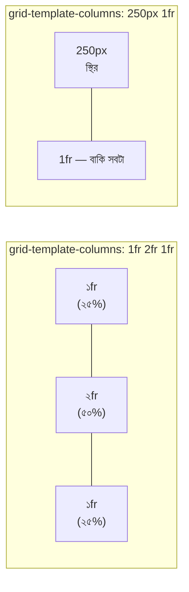

> 💡 **`fr` বনাম `%`:** `%` দিয়ে `gap` থাকলে হিসাবে গোলমাল হয় (৩৩.৩৩% × ৩ + gap = ১০০%-এর বেশি → উপচে পড়ে)। `fr` নিজে gap বাদ দিয়ে বাকিটা ভাগ করে — তাই Grid-এ `fr` অনেক নিরাপদ।

### ৭.৭ অন্যান্য কাজের ইউনিট ও ফাংশন

| ইউনিট/ফাংশন | কী | উদাহরণ |
|---|---|---|
| `ch` | `0` (শূন্য) অক্ষরের চওড়া | `max-width: 65ch;` → এক লাইনে প্রায় ৬৫ অক্ষর — পড়ার জন্য আদর্শ লাইন-দৈর্ঘ্য |
| `pt`, `cm`, `in` | প্রিন্টের ইউনিট | প্রিন্ট স্টাইলশিট (`@media print`) ছাড়া বিরল |
| `calc()` | মিশ্র ইউনিটে হিসাব | `width: calc(100% - 250px);` (পুরো চওড়া থেকে সাইডবার বাদ) — অপারেটরের দুই পাশে স্পেস **বাধ্যতামূলক** |
| `min()` / `max()` | দুটোর মধ্যে ছোট/বড়টা নাও | `width: min(90%, 1100px);` (৯০% অথবা ১১০০px-এর ছোটটা) |
| `clamp(min, ideal, max)` | সীমার মধ্যে বাড়ে-কমে | নিচে দেখুন ⬇️ |

```css
h1 {
  font-size: clamp(1.5rem, 4vw + 0.5rem, 3rem);
  /* clamp(সর্বনিম্ন, পছন্দের, সর্বোচ্চ):
     1.5rem      → শিরোনাম কখনো এর চেয়ে ছোট হবে না (ছোট মোবাইলে সীমা)
     4vw + 0.5rem → উইন্ডো অনুযায়ী মসৃণভাবে বাড়া-কমা
     3rem        → শিরোনাম কখনো এর চেয়ে বড় হবে না (বড় ডেস্কটপে সীমা)
     একটাই লাইনে media query ছাড়াই responsive লেখা ✅ */
}
```

### ৭.৮ কোন কাজে কোন ইউনিট? (চিটশিট)

| কাজ | সেরা পছন্দ | কেন |
|---|---|---|
| লেখার মাপ (`font-size`) | `rem` | ইউজারের সেটিং মানে, চক্রবৃদ্ধি সমস্যা নেই |
| বর্ডার, ছায়া | `px` | নিখুঁত, পাতলা রেখা |
| বাটন/কম্পোনেন্টের ভেতরের padding | `em` (বা `rem`) | লেখা বাড়লে ভারসাম্য বজায় থাকে |
| পেজের ফাঁক (section padding/margin) | `rem` | সব জায়গায় একই স্কেল |
| কন্টেন্টের চওড়া | `%` + `max-width` | রবারের মতো, কিন্তু সীমার মধ্যে |
| ফুল-স্ক্রিন সেকশন | `vh`/`dvh` + `min-height` | Viewport-এর সাপেক্ষে |
| গ্রিড কলাম | `fr` | gap বাদ দিয়ে সুন্দর ভাগ |
| লেখার লাইন-দৈর্ঘ্য | `ch` | অক্ষর-সংখ্যা ধরে |
| Media query ব্রেকপয়েন্ট | `px` বা `em` | প্রচলিত |
| Responsive লেখা | `clamp()` | এক লাইনে fluid |

---

## ৮. Colors — রঙের প্যালেট

স্বাদ-বাড়ির ব্র্যান্ডের রং ঠিক হলো — **গাঢ় লাল-কমলা**। ডিজাইনার এবার রংমিস্ত্রিকে সেটা বোঝাতে চায়। কিন্তু "লাল-কমলা" বললে একেকজন একেক রকম বোঝে! তাই CSS-এ রং বলার আছে **চারটা ভাষা** — একই রংকে চার রকমে বলা যায়:

| ভাষা | কেমন | উদাহরণ (একই রং) |
|---|---|---|
| **নাম** (Named) | ইংরেজি নাম, ~১৪০টা | `tomato` |
| **HEX** | `#` দিয়ে ৬ অক্ষরের কোড | `#ff6347` |
| **RGB** | লাল-সবুজ-নীলের পরিমাণ | `rgb(255, 99, 71)` |
| **HSL** | রঙের চাকায় অবস্থান | `hsl(9, 100%, 64%)` |

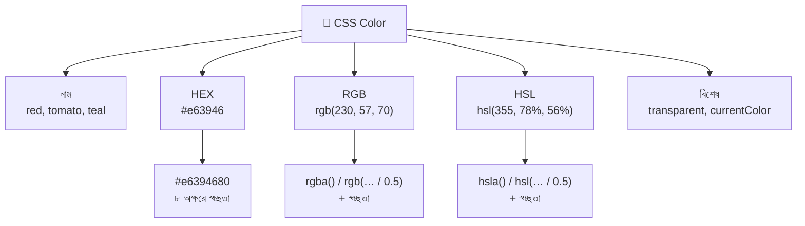

### ৮.১ নামযুক্ত রং (Named Colors)

```css
h1 { color: tomato; }                    /* নাম দিয়ে — মনে রাখা সহজ, দ্রুত পরীক্ষার জন্য ভালো */
p  { background-color: whitesmoke; }     /* প্রায়-সাদা ধূসর */
.a { color: rebeccapurple; }             /* CSS-এর বিখ্যাত রং — এর পেছনে একটা মর্মস্পর্শী গল্প আছে (খুঁজে দেখতে পারেন) */
```

সীমাবদ্ধতা: ব্র্যান্ডের নিখুঁত রং নামে ধরা যায় না। তাই বাস্তব প্রজেক্টে সাধারণত HEX/RGB/HSL ব্যবহার হয়। দুটো বিশেষ মান জানা দরকার:

```css
.ghost-btn {
  background-color: transparent;         /* সম্পূর্ণ স্বচ্ছ — পেছনের রংই দেখা যাবে (আসলে rgba(0,0,0,0)) */
  color: #e63946;                        /* লেখা লাল */
  border: 2px solid currentColor;        /* currentColor = এই element-এর বর্তমান color মানটাই (এখানে #e63946) — লেখার রং বদলালে বর্ডারও নিজে বদলে যাবে */
}
```

### ৮.২ RGB — তিন বাতির খেলা

কল্পনা করুন তিনটা টর্চ — একটা **লাল (R)**, একটা **সবুজ (G)**, একটা **নীল (B)**। প্রতিটার উজ্জ্বলতা ০ (নেভানো) থেকে ২৫৫ (পূর্ণ) পর্যন্ত। তিন আলো একসাথে মিশিয়ে অন্ধকার ঘরের দেয়ালে যেকোনো রং বানানো যায়।

```css
.a { color: rgb(255, 0, 0); }            /* শুধু লাল টর্চ জ্বললো → খাঁটি লাল */
.b { color: rgb(0, 255, 0); }            /* শুধু সবুজ → খাঁটি সবুজ */
.c { color: rgb(255, 255, 0); }          /* লাল + সবুজ → হলুদ! (আলোর মিশ্রণ, রঙের মিশ্রণ নয়) */
.d { color: rgb(0, 0, 0); }              /* সব টর্চ বন্ধ → কালো */
.e { color: rgb(255, 255, 255); }        /* সব টর্চ পূর্ণ → সাদা */
.f { color: rgb(128, 128, 128); }        /* তিনটা সমান, মাঝামাঝি → ধূসর */
```

```mermaid
flowchart LR
    R["🔴 Red<br/>0–255"] --> M(("মিশ্রণ"))
    G["🟢 Green<br/>0–255"] --> M
    B["🔵 Blue<br/>0–255"] --> M
    M --> O["তোমার রং"]
    O --> X1["R+G = হলুদ"]
    O --> X2["G+B = সায়ান (আকাশি)"]
    O --> X3["R+B = ম্যাজেন্টা (বেগুনি-গোলাপি)"]
    O --> X4["R+G+B পূর্ণ = সাদা"]
```

> 💡 ছবির কালারের মতো "লাল আর নীল মেশালে বেগুনি" — এটা রঙের (পিগমেন্ট) মিশ্রণ। পর্দার রং **আলোর** মিশ্রণ, তাই ফল আলাদা।

### ৮.৩ HEX — RGB-র সংক্ষিপ্ত রূপ

HEX আসলে **RGB-ই, শুধু লেখা হয় হেক্সাডেসিমাল (১৬-ভিত্তিক) সংখ্যায়।** দশমিকের ০–২৫৫ হেক্সে হয় `00`–`FF`।

```
#  e6  39  46
   │   │   └── Blue  = 0x46 = ৭০
   │   └────── Green = 0x39 = ৫৭
   └────────── Red   = 0xE6 = ২৩০
                ⇒ rgb(230, 57, 70)
```

```css
.brand   { color: #e63946; }             /* পুরো ৬ অক্ষর: #RRGGBB — ডিজাইনারের কাছ থেকে (Figma থেকে) সবচেয়ে বেশি পাওয়া ফরম্যাট */
.white   { color: #ffffff; }             /* সাদা */
.white-s { color: #fff; }                /* সংক্ষেপে #RGB — প্রতিটা অক্ষর দ্বিগুণ হয়: #fff = #ffffff। শুধু তখনই সম্ভব যখন প্রতিটা জোড়ায় দুই অক্ষর একই */
.black-s { color: #000; }                /* কালো */
.half    { color: #e6394680; }           /* ৮ অক্ষর: শেষের দুটো (80) = স্বচ্ছতা (Alpha) — ~৫০% স্বচ্ছ */
```

**Alpha-র হেক্স কোড (মুখস্থ নয়, দরকারে দেখে নিন):**

| স্বচ্ছতা | হেক্স | স্বচ্ছতা | হেক্স |
|---|---|---|---|
| ১০০% (অস্বচ্ছ) | `FF` | ৫০% | `80` |
| ৮০% | `CC` | ৩০% | `4D` |
| ৭০% | `B3` | ২০% | `33` |
| ৬০% | `99` | ০% (অদৃশ্য) | `00` |

> 🎨 **বাস্তবে:** ব্রাউজারের DevTools-এ কোনো রঙের চৌকো নমুনায় ক্লিক করলে Color Picker খোলে। সেখানে Shift+ক্লিক করলে HEX ↔ RGB ↔ HSL বদলে বদলে দেখা যায়। ডিজাইন থেকে রং তোলার সময় (Figma/Eyedropper) HEX-ই সবচেয়ে বেশি মিলবে।

### ৮.৪ HSL — মানুষের ভাষায় রং

RGB আর HEX কম্পিউটারের ভাষা। **"আরেকটু গাঢ় করো" বা "একটু ফ্যাকাশে করো" — এই কাজ RGB-তে করা খুব কঠিন** (কোন তিন সংখ্যা কতটা বদলাবো?)। HSL তৈরিই হয়েছে মানুষের ভাবনার মতো করে:

| অক্ষর | মানে | পরিসর | সহজ ভাষায় |
|---|---|---|---|
| **H** — Hue | রঙের আসল "জাত" | 0–360° | রঙের চাকায় কোন জায়গা |
| **S** — Saturation | উজ্জ্বলতা/তীব্রতা | 0%–100% | 0% = ধূসর (রংহীন), 100% = পূর্ণ ঝলমলে |
| **L** — Lightness | আলো-আঁধার | 0%–100% | 0% = কালো, **50% = খাঁটি রং**, 100% = সাদা |

**Hue (রঙের চাকা)-র মনে রাখার মতো বিন্দু:**

| Hue | রং |
|---|---|
| `0°` / `360°` | 🔴 লাল |
| `60°` | 🟡 হলুদ |
| `120°` | 🟢 সবুজ |
| `180°` | 🩵 সায়ান |
| `240°` | 🔵 নীল |
| `300°` | 🟣 ম্যাজেন্টা |

```css
.red-pure   { color: hsl(0, 100%, 50%); }     /* Hue 0 = লাল, পূর্ণ তীব্রতা, ঠিক মাঝামাঝি আলো → খাঁটি লাল */
.red-dark   { color: hsl(0, 100%, 30%); }     /* শুধু L কমালাম → গাঢ় লাল (মেরুন-ঘেঁষা) */
.red-light  { color: hsl(0, 100%, 80%); }     /* শুধু L বাড়ালাম → হালকা লাল (গোলাপি-ঘেঁষা) */
.red-dull   { color: hsl(0, 30%, 50%); }      /* শুধু S কমালাম → ফ্যাকাশে, প্রায়-ধূসর লাল */
.blue       { color: hsl(240, 100%, 50%); }   /* শুধু H বদলে ২৪০ → নীল */
```

```mermaid
flowchart LR
    subgraph L["Lightness (আলো)"]
        L0["0%<br/>⬛ কালো"] --> L50["50%<br/>🟥 খাঁটি রং"] --> L100["100%<br/>⬜ সাদা"]
    end
    subgraph S["Saturation (তীব্রতা)"]
        S0["0%<br/>ধূসর"] --> S50["50%<br/>ম্লান"] --> S100["100%<br/>ঝলমলে"]
    end
```

#### 🌟 HSL-এর সুপারপাওয়ার: একই রঙের প্যালেট বানানো

ব্র্যান্ডের এক রঙের হালকা-গাঢ় সব শেড তৈরি করতে **শুধু L বদলান**, H আর S একই রাখুন:

```css
:root {                                          /* :root = পেজের সবার উপরের element — এখানে রাখা CSS Variable পুরো পেজ থেকে ব্যবহার করা যায় */
  --brand-h: 355;                                /* Hue আলাদা ভেরিয়েবলে — ব্র্যান্ডের রং বদলাতে চাইলে শুধু এই একটা সংখ্যা বদলালেই সব শেড বদলে যাবে */

  --brand-100: hsl(var(--brand-h), 78%, 95%);    /* সবচেয়ে হালকা — কার্ডের ব্যাকগ্রাউন্ড */
  --brand-300: hsl(var(--brand-h), 78%, 75%);    /* হালকা — বর্ডার, ডিসেবল্ড অবস্থা */
  --brand-500: hsl(var(--brand-h), 78%, 56%);    /* মূল ব্র্যান্ডের রং (#e63946-এর কাছাকাছি) — বাটন */
  --brand-700: hsl(var(--brand-h), 78%, 38%);    /* গাঢ় — বাটনের hover */
  --brand-900: hsl(var(--brand-h), 78%, 20%);    /* সবচেয়ে গাঢ় — লেখা */
}

.btn        { background-color: var(--brand-500); color: #fff; }   /* var(নাম) দিয়ে ভেরিয়েবলের মান ব্যবহার */
.btn:hover  { background-color: var(--brand-700); }                /* hover-এ একটু গাঢ় — একই রঙের পরিবার বলে মানানসই */
```

> 🍰 **WordPress দিকে একটু:** আধুনিক WordPress থিমের (Block Theme) `theme.json`-এ রঙের প্যালেট দিলে WordPress নিজেই `--wp--preset--color--নাম` নামে CSS Variable বানিয়ে দেয় — একই ধারণা।

### ৮.৫ স্বচ্ছতা (Transparency) — তিনটা আলাদা উপায়

স্বচ্ছতা দেওয়ার তিনটা পথ আছে, আর তাদের আচরণ **এক নয়**:

```css
/* উপায় ১: rgba / hsla — শুধু ওই রঙটাকেই স্বচ্ছ করে */
.overlay {
  background-color: rgba(0, 0, 0, 0.5);         /* কালো, ৫০% স্বচ্ছ — ছবির উপর অন্ধকার পর্দা। শেষ সংখ্যা = alpha (0 = অদৃশ্য, 1 = পুরো অস্বচ্ছ) */
}

/* আধুনিক লেখা (স্ল্যাশ দিয়ে): */
.overlay-new {
  background-color: rgb(0 0 0 / 50%);          /* কমার বদলে স্পেস, আর alpha-র আগে "/" */
  color: hsl(355 78% 56% / 0.8);               /* hsl-এও একই — ৮০% অস্বচ্ছ */
}

/* উপায় ২: opacity — পুরো element-কে স্বচ্ছ করে (ভেতরের সব কিছু সহ!) */
.faded {
  opacity: 0.5;                                 /* পুরো element (লেখা, ছবি, বর্ডার, child) ৫০% স্বচ্ছ */
}

/* উপায় ৩: HEX-এর ৮ অক্ষর */
.hex-alpha {
  background-color: #00000080;                  /* #RRGGBBAA — শেষ ৮০ = ~৫০% স্বচ্ছতা */
}
```

#### ⚠️ সবচেয়ে গুরুত্বপূর্ণ পার্থক্য: `rgba()` বনাম `opacity`

```html
<div class="box-a"><p>এই লেখা পরিষ্কার পড়া যায়</p></div>
<div class="box-b"><p>এই লেখাও আবছা হয়ে গেছে!</p></div>
```

```css
.box-a { background-color: rgba(0, 0, 0, 0.5); }   /* শুধু ব্যাকগ্রাউন্ড আধা-স্বচ্ছ — ভেতরের লেখা পুরো স্পষ্ট ✅ */
.box-b { background-color: #000; opacity: 0.5; }    /* পুরো বক্স আধা-স্বচ্ছ — ভেতরের লেখাও আবছা ⚠️ (child-এর উপর আলাদাভাবে ঠিক করার উপায় নেই) */
```

```mermaid
flowchart TD
    Q{"কাকে স্বচ্ছ করতে চান?"} --> Q1["শুধু ব্যাকগ্রাউন্ড / বর্ডার / লেখার রং"]
    Q --> Q2["পুরো element<br/>(ভেতরের সবকিছু সহ)"]
    Q1 --> A1["✅ rgba() / hsla() / #RRGGBBAA"]
    Q2 --> A2["✅ opacity"]
    A1 --> E1["যেমন: ছবির উপর অন্ধকার পর্দা,<br/>তার উপরে স্পষ্ট সাদা লেখা"]
    A2 --> E2["যেমন: ডিসেবল্ড কার্ড,<br/>fade-in/fade-out অ্যানিমেশন"]
```

> 🧠 **মনে রাখার কৌশল:** `rgba` = "রঙের" স্বচ্ছতা, `opacity` = "পুরো জিনিসের" স্বচ্ছতা। ছবির উপর লেখা বসানোর হিরো ব্যানারে প্রায় সবসময় `rgba` লাগে।

### ৮.৫.১ রং কোথায় কোথায় বসে?

| প্রপার্টি | কী রং করে |
|---|---|
| `color` | লেখা (আর `currentColor` যেখানে ব্যবহার হয়) |
| `background-color` | পেছনের রং |
| `border-color` | বর্ডার |
| `outline-color` | আউটলাইন |
| `box-shadow` | ছায়ার রং (মানের ভেতরে) |
| `text-shadow` | লেখার ছায়ার রং (মানের ভেতরে) |
| `fill` / `stroke` | SVG আইকন |
| `accent-color` | checkbox/radio/range-এর মূল রং (একলাইনে ফর্ম কাস্টমাইজ) |

### ৮.৬ রং ব্যবহারের সচেতনতা: Contrast (বৈপরীত্য)

দুর্দান্ত রং নির্বাচন করেও লেখা পড়া না গেলে সব বৃথা। **হালকা ধূসর লেখা সাদা ব্যাকগ্রাউন্ডে** সবচেয়ে কমন ভুল।

| স্তর | লেখা ও ব্যাকগ্রাউন্ডের Contrast Ratio |
|---|---|
| **AA** (সাধারণ মান) | সাধারণ লেখা ≥ **4.5 : 1**, বড় লেখা ≥ 3 : 1 |
| **AAA** (উঁচু মান) | সাধারণ লেখা ≥ 7 : 1 |

```css
.bad  { color: #bbb; background-color: #fff; }   /* ❌ contrast প্রায় ১.৯:১ — বেশিরভাগ মানুষের পড়তে কষ্ট */
.good { color: #333; background-color: #fff; }   /* ✅ contrast প্রায় ১২.৬:১ — পরিষ্কার */
```

> 🔍 যাচাই: Chrome DevTools-এ কোনো লেখার `color`-এর নমুনায় ক্লিক করলে Contrast Ratio ও পাশ/ফেল দেখায়। এছাড়া অনলাইনে "WebAIM Contrast Checker" আছে।

### ৮.৭ কোন ফরম্যাট কখন?

| পরিস্থিতি | সেরা পছন্দ |
|---|---|
| Figma/ডিজাইন থেকে সরাসরি কপি | **HEX** |
| একই রঙের হালকা-গাঢ় শেড বানানো | **HSL** |
| স্বচ্ছ ওভারলে (ছবির উপর অন্ধকার পর্দা) | **rgba() / `rgb(… / %)`** |
| খুব দ্রুত পরীক্ষা | নাম (`tomato`) |
| বর্ডার/আইকনের রং লেখার সাথে মেলাতে | `currentColor` |
| পুরো প্রজেক্টে একই রং বারবার | CSS Variable (`--brand-500`) |

---

## ৯. সব একসাথে: অফার কার্ড প্রজেক্ট

উদ্বোধনের দিন স্বাদ-বাড়ি চারটা **বিশেষ অফার কার্ড** সাজিয়ে দরজার সামনে রাখবে। ডিজাইনার আজকের শেখা সব কৌশল এই একটা প্রজেক্টে কাজে লাগাবে:

```mermaid
flowchart LR
    P["🍛 অফার কার্ড"] --> A["Negative Margin<br/>ইমোজি-বৃত্ত ব্যানারের উপর উঠে আছে"]
    P --> B["Specificity<br/>.card--hot .card-title দুই class → জেতে"]
    P --> C["Pseudo-elements<br/>✔ চিহ্ন, ৳ চিহ্ন, রিবন, আন্ডারলাইন"]
    P --> D["Pseudo-classes<br/>hover, :not(), :last-child, :nth-child"]
    P --> E["Transform<br/>hover-এ ভেসে ওঠা, ঘোরা রিবন"]
    P --> F["Typography<br/>line-height, line-through, line-clamp"]
    P --> G["Units<br/>rem, fr, clamp(), ch"]
    P --> H["Colors<br/>HSL ভেরিয়েবল, rgba ছায়া"]
```

### `index.html`

```html
<!DOCTYPE html>
<html lang="bn">                                            <!-- lang="bn": ব্রাউজার ও স্ক্রিন-রিডারকে জানানো যে পেজ বাংলায় -->
<head>
  <meta charset="UTF-8">                                    <!-- বাংলা অক্ষর ঠিকঠাক দেখানোর জন্য UTF-8 আবশ্যক -->
  <meta name="viewport" content="width=device-width, initial-scale=1.0">  <!-- মোবাইলে ঠিক মাপে দেখানোর জন্য (responsive-এর ভিত্তি) -->
  <title>স্বাদ-বাড়ি — আজকের বিশেষ অফার</title>

  <!-- Google Fonts: বাংলার জন্য Hind Siliguri (শুধু ৪০০, ৬০০, ৭০০ weight — যা লাগবে তা-ই আনা) -->
  <link rel="preconnect" href="https://fonts.googleapis.com">
  <link rel="preconnect" href="https://fonts.gstatic.com" crossorigin>
  <link href="https://fonts.googleapis.com/css2?family=Hind+Siliguri:wght@400;600;700&display=swap" rel="stylesheet">

  <link rel="stylesheet" href="css/style.css">              <!-- External CSS — আমাদের নিজের সাজ (ফন্টের পরে, যাতে font-family সঠিকভাবে কাজ করে) -->
</head>
<body>

  <header class="page-header">                              <!-- পেজের মাথার অংশ -->
    <h1 class="page-title">আজকের বিশেষ অফার</h1>          <!-- ::after দিয়ে নিচে ছোট লাল দাগ পড়বে -->
    <p class="page-subtitle">উদ্বোধনী সপ্তাহে সব কম্বোতে বিশেষ ছাড়</p>
  </header>

  <main class="offer-grid">                                 <!-- grid container: ভেতরের কার্ডগুলো সাজাবে (fr ইউনিটের কাজ) -->

    <!-- কার্ড ১: হট ডিল — "card--hot" মডিফায়ার দিয়ে আলাদা সাজ -->
    <article class="card card--hot">
      <div class="card-banner"></div>                       <!-- রঙিন গ্রেডিয়েন্ট ব্যানার (ভেতরে কিছু নেই, শুধু সাজ) -->
      <div class="card-emoji" aria-hidden="true">🍛</div>   <!-- aria-hidden: স্ক্রিন-রিডার এই শুধু-সাজের আইকন পড়বে না -->
      <div class="card-body">
        <h2 class="card-title">কাচ্চি কম্বো</h2>
        <p class="card-desc">সুগন্ধি চালের কাচ্চি বিরিয়ানি, সাথে বোরহানি আর মিষ্টি ফিরনি — উদ্বোধনের দিন বিশেষ মূল্যে, পরিবারের সবার জন্য।</p>
        <ul class="offer-list">
          <li>১ প্লেট কাচ্চি বিরিয়ানি</li>
          <li>১ গ্লাস বোরহানি</li>
          <li>১ বাটি ফিরনি</li>
        </ul>
        <p class="card-price"><span class="price-old">৫৫০</span><span class="price-new">৪২০</span></p>  <!-- ৳ চিহ্ন CSS ::before থেকে আসবে, তাই এখানে শুধু সংখ্যা -->
        <a href="#order" class="btn">অর্ডার করুন</a>
      </div>
    </article>

    <!-- কার্ড ২ -->
    <article class="card">
      <div class="card-banner"></div>
      <div class="card-emoji" aria-hidden="true">🐟</div>
      <div class="card-body">
        <h2 class="card-title">ইলিশ ভাত সেট</h2>
        <p class="card-desc">সরষে ইলিশ, ডাল, ভর্তা আর গরম ভাত — বাংলার ঘরোয়া স্বাদ এক থালায়।</p>
        <ul class="offer-list">
          <li>সরষে ইলিশ ২ পিস</li>
          <li>ডাল ও ভর্তা</li>
          <li>সাদা ভাত</li>
        </ul>
        <p class="card-price"><span class="price-old">৬৫০</span><span class="price-new">৫২০</span></p>
        <a href="#order" class="btn">অর্ডার করুন</a>
      </div>
    </article>

    <!-- কার্ড ৩ -->
    <article class="card">
      <div class="card-banner"></div>
      <div class="card-emoji" aria-hidden="true">🥟</div>
      <div class="card-body">
        <h2 class="card-title">ছুটির নাস্তা প্যাকেজ</h2>
        <p class="card-desc">সমুচা, পিঁয়াজু, চপ আর গরম চা — বিকেলের আড্ডার জন্য নিখুঁত।</p>
        <ul class="offer-list">
          <li>৪টা সমুচা</li>
          <li>৬টা পিঁয়াজু</li>
          <li>২ কাপ চা</li>
        </ul>
        <p class="card-price"><span class="price-old">৩৫০</span><span class="price-new">২৯০</span></p>
        <a href="#order" class="btn">অর্ডার করুন</a>
      </div>
    </article>

    <!-- কার্ড ৪: শেষ হয়ে গেছে — "card--sold-out" মডিফায়ার -->
    <article class="card card--sold-out">
      <div class="card-banner"></div>
      <div class="card-emoji" aria-hidden="true">🍗</div>
      <div class="card-body">
        <h2 class="card-title">মোরগ পোলাও</h2>
        <p class="card-desc">দেশি মোরগের রোস্ট আর সুগন্ধি পোলাও — আজকের মতো শেষ।</p>
        <ul class="offer-list">
          <li>মোরগ রোস্ট ১ পিস</li>
          <li>পোলাও ১ প্লেট</li>
        </ul>
        <p class="card-price"><span class="price-old">৪৮০</span><span class="price-new">৩৮০</span></p>
        <span class="btn" aria-disabled="true">স্টক শেষ</span>   <!-- <a> নয়, <span> — কারণ ক্লিক করার মতো গন্তব্য নেই। aria-disabled সাজের জন্য attribute selector-এ ধরা হবে -->
      </div>
    </article>

  </main>
</body>
</html>
```

### `css/style.css`

```css
/* =========================================================
   স্বাদ-বাড়ি — অফার কার্ড
   এই ফাইলের প্রতিটা অংশে বলা আছে কোন টপিক কোথায় কাজে লাগছে
   ========================================================= */

/* ---------- ১. CSS Variable: রঙ ও মাপের কেন্দ্রীয় ভাণ্ডার (Colors + Units) ---------- */
:root {
  /* HSL-এ ব্র্যান্ডের রং। শুধু L বদলে হালকা-গাঢ় শেড বানানো হয়েছে (৮.৪ সেকশনের কৌশল) */
  --brand-h: 355;                                          /* Hue — ব্র্যান্ডের রং বদলাতে হলে শুধু এই এক সংখ্যা বদলালেই হবে */
  --brand-300: hsl(var(--brand-h), 78%, 75%);              /* হালকা — focus outline ও টেক্সট-সিলেকশনে */
  --brand-500: hsl(var(--brand-h), 78%, 56%);              /* মূল রং — বাটন, ব্যানার */
  --brand-700: hsl(var(--brand-h), 78%, 38%);              /* গাঢ় — hover ও দামের লেখায় */
  --brand-900: hsl(var(--brand-h), 78%, 20%);              /* সবচেয়ে গাঢ় — রিবনের ব্যাকগ্রাউন্ড */
  --accent-500: hsl(28, 95%, 55%);                         /* কমলা — লাল ব্যানারের সাথে মিলিয়ে গ্রেডিয়েন্ট বানানোর জন্য */

  --ink: #333;                                             /* লেখার রং: আসল কালো না, গাঢ় ধূসর — চোখে আরাম (ছবিতে ~১২:১ contrast, AA পাস) */
  --paper: hsl(30, 60%, 97%);                              /* পেজের পেছনের রং: প্রায়-সাদা, হালকা উষ্ণ */
  --line: hsl(30, 30%, 80%);                               /* dashed দাগের হালকা রং */

  --radius: 1rem;                                          /* কার্ডের কোণের গোলাকার ভাব — এক জায়গায় রাখলে বদলানো সহজ */
  --gap: 1.5rem;                                           /* কার্ডগুলোর মাঝের ফাঁক (rem: ইউজারের ফন্ট-সেটিং মানে) */
  --shadow: 0 0.5rem 1.5rem rgb(0 0 0 / 12%);              /* ছায়া: কালো, ১২% অস্বচ্ছ (rgba-র আধুনিক লেখা) — ছায়া হালকা না হলে কার্ড "ভারী" লাগে */
}

/* ---------- ২. Reset (আগের ফাইলের box-sizing শিক্ষা + Pseudo-element) ---------- */
*,
*::before,
*::after {                                                 /* *::before ও *::after আলাদা করে লিখতে হয় — কারণ * সিলেক্টর pseudo-element ধরে না! */
  box-sizing: border-box;                                  /* padding-border যেন মোট মাপে যোগ না হয় (Box Model) */
  margin: 0;                                               /* ব্রাউজারের ডিফল্ট margin মুছে ফেলা — এরপর আমরা নিজে ঠিক করে দেবো */
}

/* ---------- ৩. Base: পুরো পেজের সাধারণ সাজ (Typography + Colors) ---------- */
body {
  font-family: "Hind Siliguri", "Noto Sans Bengali", Arial, sans-serif;   /* fallback stack: প্রথমটা না পেলে পরেরটা */
  font-size: 1rem;                                         /* ১rem = ১৬px (ডিফল্ট) — ইউজার-সেটিং মেনে চলে */
  line-height: 1.8;                                        /* ইউনিটহীন — বাংলার উপর-নিচের চিহ্ন ও যুক্তাক্ষরের জন্য বাড়তি জায়গা */
  color: var(--ink);                                       /* inherit হয়ে প্রায় সব লেখা এই রং পাবে */
  background-color: var(--paper);                          /* পেজের পেছনের রং */
}

::selection {                                              /* ইউজার লেখা সিলেক্ট করলে (Pseudo-element) */
  background-color: var(--brand-300);                      /* ব্র্যান্ডের হালকা রং — ছোট্ট এক ব্র্যান্ডিং ছোঁয়া */
  color: var(--brand-900);
}

/* ---------- ৪. পেজ-হেডার ---------- */
.page-header {
  padding: 3rem 1rem 2rem;                                 /* উপরে বেশি, ডানে-বামে ১rem, নিচে কম — TRouBLe ক্রমে (উপর ডান/বাম নিচ) */
  text-align: center;                                      /* ভেতরের লেখা (h1, p) মাঝখানে */
}

.page-title {
  font-size: clamp(1.75rem, 4vw + 0.5rem, 3rem);           /* clamp: ছোট পর্দায় সর্বনিম্ন ১.৭৫rem, বড় পর্দায় সর্বোচ্চ ৩rem, মাঝে উইন্ডো-চওড়ার সাথে মসৃণভাবে বাড়ে — media query ছাড়া responsive */
  line-height: 1.3;                                        /* বড় শিরোনামে লাইন-ফাঁক কম রাখা ভালো (১.৩), প্যারাগ্রাফের ১.৮ এখানে বেশি হয়ে যেত */
  color: var(--brand-700);                                 /* ব্র্যান্ডের গাঢ় শেড — শিরোনামে জোর */
}

.page-title::after {                                       /* Pseudo-element: HTML-এ কিছু না লিখেই শিরোনামের নিচে সাজের দাগ */
  content: "";                                             /* content না থাকলে ::after আঁকাই হয় না — ফাঁকা স্ট্রিং দিয়ে "উপস্থিত" করলাম */
  display: block;                                          /* ডিফল্টে inline — block করলে width/height ও margin auto কাজ করে */
  width: 4rem;                                             /* দাগের চওড়া */
  height: 0.25rem;                                         /* দাগের মোটা */
  margin: 0.5rem auto 0;                                   /* উপরে ০.৫rem ফাঁক, ডানে-বামে auto (দাগ মাঝখানে), নিচে ০ */
  background-color: var(--brand-500);                      /* দাগের রং */
  border-radius: 999px;                                    /* খুব বড় মান = দুই মাথা পুরো গোল (pill আকার) */
}

.page-subtitle {
  margin-top: 0.75rem;                                     /* শিরোনাম থেকে একটু দূরে */
  color: #666;                                             /* ধূসর — উপ-শিরোনাম মূল শিরোনামের চেয়ে কম জোরালো */
}

/* ---------- ৫. কার্ডের গ্রিড (Units: fr, rem, ch) ---------- */
.offer-grid {
  display: grid;                                           /* Grid চালু — fr ও gap এখান থেকেই কাজ করবে */
  grid-template-columns: repeat(auto-fit, minmax(16rem, 1fr));
  /* repeat(auto-fit, …) → যতগুলো ধরে ততগুলো কলাম বানাও (ছোট পর্দায় ১টা, বড়ে ৪টা — media query ছাড়াই)
     minmax(16rem, 1fr) → প্রতিটা কলাম কমপক্ষে ১৬rem, বাকি জায়গা সমান ভাগে (১fr) */
  gap: var(--gap);                                         /* কার্ডের মাঝের ফাঁক — fr হিসাবের আগেই বাদ যায় */
  max-width: 70rem;                                        /* বিশাল পর্দায় গ্রিড যেন অতিরিক্ত চওড়া না হয় (রবারের দেয়াল) */
  margin: 0 auto;                                          /* max-width-এর সীমায় গ্রিডকে পর্দার মাঝখানে বসানো */
  padding: 0 1rem 3rem;                                    /* ডানে-বামে ১rem (পর্দার কিনারায় না ঠেকতে), নিচে ৩rem */
}

/* ---------- ৬. কার্ড (Box Model + Transform + Transition) ---------- */
.card {
  position: relative;                                      /* ভেতরের absolute রিবন (::after)-এর "ঠিকানা"-র মূল হবে এই কার্ড */
  background-color: #fff;                                  /* কার্ডের ভেতরটা সাদা */
  border-radius: var(--radius);                            /* কোণ গোল */
  box-shadow: var(--shadow);                               /* ভাসমান ছায়া */
  overflow: hidden;                                        /* ব্যানার ও রিবন যেন গোল কোণের বাইরে না বেরোয় (overflow: hidden-এর ক্লাসিক ব্যবহার) */
  transition: transform 0.3s ease, box-shadow 0.3s ease;   /* hover-এ transform ও ছায়া ০.৩ সেকেন্ডে মসৃণভাবে বদলাবে — না দিলে ঝট করে লাফাবে */
}

.card:not(.card--sold-out):hover {                         /* Pseudo-class :not() — "শেষ হয়ে যাওয়া নয়" এমন কার্ডে শুধু hover ইফেক্ট */
  transform: translateY(-0.5rem);                          /* ০.৫rem উপরে ভেসে ওঠা (Y ঋণাত্মক = উপরে); লেআউট অন্য কার্ড ঠেলে না — transform-এর সত্য */
  box-shadow: 0 1rem 2rem rgb(0 0 0 / 18%);                /* উপরে উঠলে ছায়া আরও বড় ও গাঢ় — "আরও উঁচুতে" ভাব */
}

/* ব্যানার: কার্ডের উপরের রঙিন অংশ */
.card-banner {
  height: 8rem;                                            /* উচ্চতা স্থির */
  background: linear-gradient(135deg, var(--brand-500), var(--accent-500));   /* লাল থেকে কমলা, কোনাকুনি — ছবির বদলে শুধু CSS-এর রং */
}

.card:nth-child(even) .card-banner {                       /* Pseudo-class :nth-child(even) — জোড় নম্বরের কার্ড (২য়, ৪র্থ) */
  background: linear-gradient(135deg, var(--accent-500), var(--brand-500));   /* গ্রেডিয়েন্ট উল্টো — গ্রিডে একঘেয়েমি ভাঙে */
}

/* ইমোজি-বৃত্ত: ব্যানারের উপর অর্ধেক উঠে থাকা (Negative Margin এর প্রয়োগ) */
.card-emoji {
  position: relative;                                      /* z-index কাজ করার জন্য (static element-এ z-index চলে না) */
  z-index: 1;                                              /* ব্যানারের উপরে আঁকা হবে */
  width: 4.5rem;                                           /* বৃত্তের মাপ — width ও height সমান হলে border-radius: 50% পুরো গোল হয় */
  height: 4.5rem;
  margin: -2.25rem auto 0;                                 /* ⭐ উপরে -২.২৫rem = বৃত্তের উচ্চতার ঠিক অর্ধেক উপরে টেনে তোলা (Negative Margin)। auto = ডানে-বামে মাঝখানে। নিচে ০ */
  display: grid;                                           /* Grid দিয়ে ভেতরের ইমোজিকে মাঝখানে বসানোর সবচেয়ে ছোট পথ */
  place-items: center;                                     /* উপর-নিচ + ডান-বাম — দুই দিকেই মাঝখানে */
  font-size: 2.25rem;                                      /* ইমোজির আকার */
  line-height: 1;                                          /* ইমোজির উপর-নিচে বাড়তি ফাঁক না — বৃত্তের মাঝখানে ঠিকঠাক বসে */
  background-color: #fff;                                  /* সাদা বৃত্ত */
  border-radius: 50%;                                      /* ৫০% = পুরো গোল */
  box-shadow: 0 0.25rem 0.75rem rgb(0 0 0 / 15%);          /* বৃত্ত ভাসছে — হালকা ছায়া */
  transition: transform 0.3s ease;                         /* hover-এ মসৃণ নড়াচড়া */
}

.card:not(.card--sold-out):hover .card-emoji {             /* কার্ডে hover করলে তার ভেতরের ইমোজি-বৃত্ত সাড়া দেবে */
  transform: scale(1.15) rotate(-8deg);                    /* একটু বড় + সামান্য বাঁয়ে ঘোরা (ক্রম: scale তারপর rotate — এখানে ফল একই, তবু ক্রম মাথায় রাখা ভালো) */
}

/* কার্ডের ভেতরের কন্টেন্ট */
.card-body {
  padding: 1rem 1.5rem 1.5rem;                             /* উপরে ১rem (ইমোজির পরে), ডানে-বামে ১.৫rem, নিচে ১.৫rem */
  text-align: center;                                      /* শিরোনাম, দাম, বাটন — সব মাঝখানে (তালিকা নিচে আলাদা করে বাঁয়ে) */
}

.card-title {
  font-size: 1.5rem;                                       /* সেকশন-শিরোনামের চেয়ে ছোট, প্যারাগ্রাফের চেয়ে বড় */
  line-height: 1.4;                                        /* শিরোনাম দুই লাইনে গেলেও চেপে না যায় */
  color: var(--ink);                                       /* সাধারণ কার্ডে গাঢ় ধূসর */
}

.card--hot .card-title {                                   /* Specificity: দুই class = (0,2,0) > .card-title (0,1,0) — !important ছাড়াই জেতে */
  color: var(--brand-700);                                 /* হট কার্ডের শিরোনাম ব্র্যান্ডের রঙে */
}

.card-desc {
  margin: 0.5rem 0 1rem;                                   /* উপরে ০.৫rem, ডানে-বামে ০, নিচে ১rem */
  font-size: 0.95rem;                                      /* শিরোনামের চেয়ে সামান্য ছোট (১৬ × ০.৯৫ = ১৫.২px) */
  color: #555;                                             /* মূল লেখার চেয়ে একটু হালকা — গুরুত্বের ধাপ বোঝায় */
  display: -webkit-box;                                    /* line-clamp চালানোর জন্য ব্রাউজারের পুরনো box মডেল */
  -webkit-box-orient: vertical;                            /* লাইনগুলো উপর-নিচে সাজানো */
  -webkit-line-clamp: 2;                                   /* সর্বোচ্চ ২ লাইন — এরপর "…" (সব কার্ডের উচ্চতা সমান রাখতে) */
  line-clamp: 2;                                           /* মানক নাম — নতুন ব্রাউজারের জন্য */
  overflow: hidden;                                        /* ২ লাইনের পরের অংশ লুকানো */
}

/* অফারের তালিকা: ✔ চিহ্ন Pseudo-element দিয়ে */
.offer-list {
  list-style: none;                                        /* ব্রাউজারের ডিফল্ট বুলেট (•) সরিয়ে নিজের ✔ ব্যবহার করবো */
  padding: 0;                                              /* ul-এর ডিফল্ট বাঁ পাশের padding মুছলাম */
  margin-bottom: 1rem;                                     /* তালিকার নিচে ফাঁক */
  text-align: left;                                        /* কার্ডের সবকিছু মাঝখানে হলেও তালিকা বাঁ দিকে সাজানো — পড়তে সুবিধা */
}

.offer-list li {
  padding: 0.5rem 0;                                       /* প্রতিটা আইটেমের উপর-নিচে ফাঁক */
}

.offer-list li::before {                                   /* Pseudo-element ::before — প্রতিটা li-এর আগে ✔ */
  content: "✔";                                            /* HTML-এ না লিখে CSS থেকে আনা — শুধু সাজ, তথ্য নয় */
  margin-right: 0.5rem;                                    /* ✔ আর লেখার মাঝে ফাঁক */
  color: var(--brand-500);                                 /* ✔ ব্র্যান্ডের রঙে */
  font-weight: 700;                                        /* ✔ একটু মোটা */
}

.offer-list li:not(:last-child) {                          /* Pseudo-class :not(:last-child) — শেষটা বাদে সবার নিচে দাগ */
  border-bottom: 1px dashed var(--line);                   /* ১px (px: বর্ডারে স্থির মাপ) ড্যাশ দাগ; শেষ আইটেমে বাড়তি দাগ পড়ে না */
}

/* দাম */
.card-price {
  display: flex;                                           /* পুরনো ও নতুন দাম পাশাপাশি */
  justify-content: center;                                 /* দুটোকে কার্ডের মাঝখানে */
  align-items: baseline;                                   /* বড়-ছোট লেখা একই "লেখার লাইনে" মিলিয়ে বসানো */
  gap: 0.75rem;                                            /* পুরনো ও নতুন দামের মাঝের ফাঁক */
  margin-bottom: 1rem;                                     /* দামের নিচে ফাঁক, তারপর বাটন */
}

.card-price span::before {                                 /* দুটো span-ই — পুরনো ও নতুন দাম — ৳ চিহ্ন পাবে */
  content: "৳";                                            /* HTML-এ শুধু সংখ্যা রেখে চিহ্ন CSS থেকে — পরে ডলারে বদলালে একজায়গায় বদল */
  margin-right: 0.1em;                                     /* em: চিহ্ন ও সংখ্যার ফাঁক আশেপাশের লেখার মাপ অনুযায়ী আনুপাতিক */
  font-size: 0.7em;                                        /* ৳ সংখ্যার চেয়ে ছোট — দামের মূল সংখ্যাতেই জোর */
}

.price-old {
  color: #888;                                             /* ম্লান — "পুরনো" বোঝাতে */
  text-decoration: line-through;                           /* কাটা দাগ — পুরনো দামের চিরাচরিত চিহ্ন */
}

.price-new {
  font-size: 1.75rem;                                      /* নতুন দাম বড় — সবচেয়ে গুরুত্বপূর্ণ তথ্য */
  font-weight: 700;                                        /* মোটা */
  color: var(--brand-700);                                 /* ব্র্যান্ডের গাঢ় শেড */
}

/* বাটন */
.btn {
  display: inline-block;                                   /* padding-margin পুরোপুরি কাজ করবে + পাশাপাশিও বসতে পারবে */
  padding: 0.75em 1.75em;                                  /* em: বাটনের font-size বদলালে padding আনুপাতিকভাবে বদলাবে */
  font-weight: 600;                                        /* আধা-মোটা লেখা */
  color: #fff;                                             /* সাদা লেখা — ব্র্যান্ডের গাঢ় রঙের উপর স্পষ্ট */
  text-decoration: none;                                   /* <a>-র ডিফল্ট আন্ডারলাইন সরানো */
  background-color: var(--brand-500);                      /* বাটনের মূল রং */
  border-radius: 999px;                                    /* গোল মাথার (pill) বাটন */
  transition: background-color 0.2s ease, transform 0.2s ease;  /* রং ও আকার বদলে মসৃণভাবে */
}

.btn:hover {
  background-color: var(--brand-700);                      /* মাউস রাখলে একটু গাঢ় — একই রঙের পরিবারের শেড */
}

.btn:active {
  transform: scale(0.96);                                  /* চাপ দিলে ৪% ছোট — বাটন "দেবে যাওয়ার" অনুভূতি */
}

.btn:focus-visible {                                       /* :focus-visible — কিবোর্ডে Tab দিয়ে এলে তবেই outline (মাউস-ক্লিকে নয়) */
  outline: 3px solid var(--brand-300);                     /* স্পষ্ট outline — কিবোর্ড-ব্যবহারকারীর জন্য accessibility */
  outline-offset: 3px;                                     /* outline বাটন থেকে একটু দূরে — চেহারা সুন্দর */
}

/* ---------- ৭. "হট ডিল" কোণার রিবন (Pseudo-element + Transform + Positioning) ---------- */
.card--hot::after {
  content: "🔥 হট ডিল";                                    /* রিবনের লেখা — শুধু সাজ, তাই HTML-এ না রেখে CSS-এ */
  position: absolute;                                      /* .card-এর (position: relative) সাপেক্ষে বসবে */
  top: 1.25rem;                                            /* কার্ডের উপর থেকে ১.২৫rem নিচে */
  right: -2.5rem;                                          /* ঋণাত্মক মান = কার্ডের ডান কিনারার বাইরে ঠেলে দেওয়া (Negative offset) */
  z-index: 2;                                              /* ব্যানার ও ইমোজির উপরে */
  width: 10rem;                                            /* রিবনের দৈর্ঘ্য — কোণাকুনি বসলে কোণ ঢাকার মতো লম্বা */
  padding: 0.25rem 0;                                      /* উপর-নিচে সামান্য ফাঁক; ডানে-বামে ০ — কারণ text-align: center */
  font-size: 0.8rem;                                       /* ছোট লেখা */
  font-weight: 700;                                        /* মোটা */
  text-align: center;                                      /* লেখা রিবনের মাঝখানে */
  color: #fff;                                             /* সাদা লেখা */
  background-color: var(--brand-900);                      /* সবচেয়ে গাঢ় শেড — ব্যানারের উজ্জ্বল রঙের উপরে আলাদা করে ফুটে ওঠে */
  transform: rotate(45deg);                                /* ৪৫° ঘড়ির কাঁটার দিকে ঘুরিয়ে কোণাকুনি বসানো — যা overflow: hidden দিয়ে কার্ডের কোণে ছাঁটা পড়বে */
}

/* ---------- ৮. "স্টক শেষ" কার্ড (Attribute selector + opacity + filter) ---------- */
.card--sold-out {
  opacity: 0.6;                                            /* opacity: পুরো কার্ড (ভেতরের সব কিছু সহ) আবছা — এখানে ঠিক এটাই চাই */
  filter: grayscale(0.8);                                  /* ৮০% ধূসর — "নিষ্প্রাণ" চেহারা; ছবি/রঙে বেশ কার্যকর */
}

.btn[aria-disabled="true"] {                               /* Attribute selector — aria-disabled="true" আছে এমন .btn */
  background-color: #999;                                  /* ধূসর — "ক্লিক করা যাবে না" বোঝায় */
  cursor: not-allowed;                                     /* মাউসে "না" চিহ্ন */
}

.btn[aria-disabled="true"]:hover {                         /* Specificity: (0,3,0) — সাধারণ .btn:hover (0,2,0)-কে হারায়, তাই hover-এও ধূসরই থাকবে */
  background-color: #999;                                  /* hover-এও একই রং — গাঢ় লাল হয়ে যাবে না */
}
```

### কোন টপিক কোথায় ব্যবহার হলো?

| টপিক | কোথায় | কী কাজে |
|---|---|---|
| **Negative Margin** | `.card-emoji { margin: -2.25rem auto 0 }` | বৃত্তকে ব্যানারের উপর অর্ধেক তুলে আনা |
| **Specificity** | `.card--hot .card-title`, `.btn[aria-disabled]:hover` | `!important` ছাড়া "কে জিতবে" ঠিক করা |
| **::before** | `.offer-list li::before`, `.card-price span::before` | ✔ ও ৳ চিহ্ন HTML-এ না লিখে |
| **::after** | `.page-title::after`, `.card--hot::after` | সাজের দাগ ও রিবন |
| **::selection** | `::selection` | সিলেক্ট করা লেখার ব্র্যান্ডেড রং |
| **:hover / :active** | `.card:hover`, `.btn:hover`, `.btn:active` | ইউজারের সাথে সাড়া |
| **:focus-visible** | `.btn:focus-visible` | কিবোর্ড-ব্যবহারকারীর outline |
| **:not()** | `.card:not(.card--sold-out):hover` | শেষ হওয়া কার্ডে ইফেক্ট বন্ধ |
| **:last-child** | `.offer-list li:not(:last-child)` | শেষ আইটেমে বাড়তি দাগ না দেওয়া |
| **:nth-child(even)** | `.card:nth-child(even) .card-banner` | জোড় কার্ডে উল্টো গ্রেডিয়েন্ট |
| **Transform** | `translateY`, `scale`, `rotate` | ভেসে ওঠা, বড়-ছোট, রিবন ঘোরানো |
| **Typography** | `line-height`, `line-through`, `line-clamp`, `clamp()` | পড়তে আরাম, দামের কাটা দাগ, সমান উচ্চতা |
| **Units** | `rem`, `em`, `fr`, `vw`, `px` | প্রতিটা কাজে সঠিক ফিতা |
| **Colors** | HSL ভেরিয়েবল, `rgb(… / %)`, `opacity` | ব্র্যান্ডের শেড ও স্বচ্ছতা |

### ফোল্ডার স্ট্রাকচার

```
📦 swad-bari-offer-card
 ┣ 📜 index.html
 ┗ 📂 css
   ┗ 📜 style.css
```

> 🎯 **চ্যালেঞ্জ:** `--brand-h` ভেরিয়েবলের মান `355` থেকে `210` করে দিন (নীল) — পুরো কার্ড কীভাবে এক লাইনে নীল ব্র্যান্ডের হয়ে যায় দেখুন। তারপর কার্ডে `:hover`-এর সময় `.card-emoji`-তে `translateY(-0.25rem)` যোগ করে কী হয় দেখুন।

---

## ১০. সাধারণ ভুল ও সমাধান

| # | লক্ষণ | সম্ভাব্য কারণ | সমাধান |
|---|---|---|---|
| ১ | Negative margin দেওয়া element অন্য element-এর পেছনে লুকিয়ে যাচ্ছে | পরে আঁকা বা positioned element উপরে চলে আসছে | ওই element-এ `position: relative; z-index: 1;` দিন |
| ২ | Negative margin-এ টেনে আনা অংশ কেটে যাচ্ছে | Parent-এ `overflow: hidden` আছে | Parent-এ পর্যাপ্ত `padding` দিন, অথবা `overflow` সরান |
| ৩ | CSS লিখেছি, কিন্তু কাজ করছে না | অন্য নিয়মের Specificity বেশি | DevTools → Styles ট্যাবে কাটা দাগ (~~strikethrough~~) দেখুন, কোন নিয়ম জিতছে বের করুন |
| ৪ | সব জায়গায় `!important` দিতে হচ্ছে | Specificity-র দ্বন্দ্ব মেটানো হয়নি | Selector-কে আরেকটু নির্দিষ্ট করুন (`.card .title`), বা নিয়মের ক্রম ঠিক করুন |
| ৫ | `::before` / `::after` দেখা যাচ্ছে না | `content` প্রপার্টি নেই | `content: "";` অন্তত ফাঁকা স্ট্রিং হলেও দিন |
| ৬ | `` বা `<input>`-এ `::before` কাজ করে না | এগুলো "replaced element", ভেতরে কিছু ধরে না | Wrapper `<div>` বানিয়ে সেটাতে pseudo-element দিন |
| ৭ | `:last-child` কাজ করছে না | শেষ সন্তান অন্য ট্যাগের (যেমন শেষে `<div>`) | `:last-of-type` ব্যবহার করুন, বা ট্যাগ-সহ লিখুন |
| ৮ | Link-এর `:hover` কাজ করছে না | LVHA ক্রম ভাঙা | `:link` → `:visited` → `:hover` → `:active` ক্রমে লিখুন |
| ৯ | `<span>` বা `<a>`-তে `transform` কাজ করছে না | Element `inline` | `display: inline-block` করুন |
| ১০ | Hover-এ আগের `rotate` চলে গেল | `transform` প্রপার্টি পুরোটা replace করে | Hover-এ দুটোই লিখুন (`rotate(5deg) scale(1.1)`), বা আলাদা `rotate`/`scale` প্রপার্টি ব্যবহার করুন |
| ১১ | `position: fixed` element পর্দায় আটকে থাকছে না | কোনো parent-এ `transform` আছে | ওই parent থেকে `transform` সরান, বা fixed element-কে parent-এর বাইরে আনুন |
| ১২ | `text-overflow: ellipsis` কাজ করছে না | তিনটার একটা বাদ, বা `width` নেই | `white-space: nowrap` + `overflow: hidden` + `text-overflow: ellipsis` + একটা `max-width` |
| ১৩ | ছোট ফন্টে লাইন গায়ে গায়ে লেগে যাচ্ছে | `line-height` px-এ দেওয়া | ইউনিটহীন মান দিন (`1.6`) |
| ১৪ | Nested তালিকার লেখা স্তরে স্তরে বড় হচ্ছে | `font-size`-এ `em` চক্রবৃদ্ধি হচ্ছে | `rem` ব্যবহার করুন |
| ১৫ | `width: 100vw` দিতেই পাশে অনুভূমিক স্ক্রল এলো | `100vw`-এ স্ক্রলবারের চওড়াও ধরা হয় | `width: 100%` ব্যবহার করুন |
| ১৬ | মোবাইলে `100vh` সেকশনের নিচের অংশ কেটে যাচ্ছে | ঠিকানা-বারসহ উচ্চতা ধরা হচ্ছে | `min-height: 100dvh` (আগে `100vh` fallback হিসেবে রাখুন) |
| ১৭ | `height: 50%` কাজ করছে না | Parent-এর উচ্চতা `auto` | Parent-এ স্পষ্ট `height` দিন, বা `min-height` ও `vh` ব্যবহার করুন |
| ১৮ | `padding: 5%` দিলে উপর-নিচের ফাঁকা অদ্ভুত বড় | সব দিকের `%` parent-এর **চওড়ার** সাপেক্ষে | উপর-নিচের জন্য `rem` ব্যবহার করুন |
| ১৯ | Grid-এ লম্বা কন্টেন্ট `1fr` কলাম ঠেলে উপচে ফেলছে | `1fr`-এর ন্যূনতম মাপ কন্টেন্টের মাপ | `minmax(0, 1fr)` ব্যবহার করুন |
| ২০ | ব্যাকগ্রাউন্ড আধা-স্বচ্ছ করতেই ভেতরের লেখাও আবছা | `opacity` পুরো element-এ লাগে | `rgba()` / `hsla()` দিয়ে শুধু ব্যাকগ্রাউন্ডের রং স্বচ্ছ করুন |
| ২১ | Google Fonts-এর ফন্ট আসছে না | `<link>` ভুল, বা `font-family`-এর নামে বানান ভুল | Network ট্যাবে ফন্ট লোড হয়েছে কিনা দেখুন, নাম মিলিয়ে নিন |
| ২২ | `calc(100%-250px)` কাজ করছে না | `-` ও `+`-এর দুই পাশে স্পেস লাগে | `calc(100% - 250px)` |

> 🔍 **ডিবাগিংয়ের সোনালি নিয়ম:** কোনো CSS কাজ না করলে আগে DevTools-এ (F12) element-টা Inspect করুন। Styles ট্যাবে দেখুন নিয়মটা **আদৌ পৌঁছাচ্ছে কিনা**, আর পৌঁছালে **কাটা দাগ পড়েছে কিনা**। কাটা দাগ মানে অন্য কোনো নিয়ম জিতেছে (Specificity বা ক্রম)। নিয়মটাই না থাকলে selector বা বানানে ভুল।

---

## ১১. সারসংক্ষেপ ও Practice আইডিয়া

```mermaid
mindmap
  root((CSS দ্বিতীয় পাঠ))
    লেআউটের কৌশল
      Negative Margin
      Transform
      Units
    নিয়মের দ্বন্দ্ব
      Specificity
      important
      Cascade ক্রম
    বিশেষ সাজ
      Pseudo-elements
        before
        after
      Pseudo-classes
        hover ও focus
        not
        nth-child
        last-child
    লেখা ও রং
      Typography
        line-height
        text-overflow
      Colors
        HEX
        RGB
        HSL
        স্বচ্ছতা
```

### এক লাইনে মনে রাখার তালিকা

1. **Negative margin** = element-কে টেনে আনা বা চাপিয়ে বসানো। সঙ্গে `position` ও `z-index` লাগতে পারে। **`padding` কখনো ঋণাত্মক হয় না।**
2. **Specificity স্কোরবোর্ড:** inline > `#id` > `.class`/`[attr]`/`:pseudo-class` > `tag`/`::pseudo-element`। সমান হলে **পরে লেখাটা** জেতে।
3. **`!important` শেষ অস্ত্র**, প্রথম নয়। আগে selector আরও নির্দিষ্ট করুন।
4. **`:` = অবস্থা** (pseudo-class), **`::` = অংশ** (pseudo-element)। `::before`/`::after` কাজ করতে **`content` লাগবেই।**
5. **LVHA ক্রম:** `:link` → `:visited` → `:hover` → `:active`।
6. **`:last-child` ≠ `:last-of-type`।** প্রথমটা "সব ভাইয়ের মধ্যে শেষ", দ্বিতীয়টা "একই ট্যাগের মধ্যে শেষ"।
7. **Transform লেআউট নড়ায় না**, শুধু চোখে সরায়। ক্রম গুরুত্বপূর্ণ: `translate → rotate → scale`। Y-অক্ষ **নিচে বাড়ে।**
8. **`line-height` ইউনিটহীন** দিন (`1.6`, বাংলায় `1.7`–`1.9`)।
9. **Ellipsis-এর তিনের জাদু:** `white-space: nowrap` + `overflow: hidden` + `text-overflow: ellipsis`।
10. **`rem` = root-এর সাপেক্ষে** (লেখা ও পেজের ফাঁক), **`em` = নিজের/parent-এর ফন্টের সাপেক্ষে** (কম্পোনেন্টের ভেতরের padding), **`%` = parent-এর সাপেক্ষে**, **`fr` = grid-এর ভাগ**।
11. **`100vw` নয়, `100%`**; **`100vh` নয়, `100dvh`** (মোবাইলের জন্য)।
12. **HEX = ডিজাইন থেকে কপি, HSL = শেড বানানো, `rgba()` = শুধু রঙের স্বচ্ছতা, `opacity` = পুরো element-এর।**

### Practice-এর জন্য আইডিয়া

1. **অফার কার্ড নিজে টাইপ করা**: কপি-পেস্ট নয়। তারপর `--brand-h` বদলে (`355` থেকে `210`) পুরো থিমের রং বদলে ফেলুন।
2. **Specificity-র পরীক্ষা**: একই `<p>`-কে `p`, `.note`, `#intro`, inline `style`, এই চারটা নিয়মে আলাদা রং দিন। DevTools-এ দেখুন কোনটা জিতলো আর কোনগুলোয় কাটা দাগ পড়লো।
3. **Pure CSS টুলটিপ**: `data-tip` attribute আর `::after { content: attr(data-tip) }` দিয়ে hover-এ ভেসে ওঠা টুলটিপ বানান।
4. **`:nth-child` ল্যাব**: ১২টা `<li>` বানিয়ে `odd`, `even`, `3n`, `3n+1`, `n+4`, `-n+3` আলাদা আলাদা রঙে দেখুন। তারপর শেষে একটা `<div>` ঢুকিয়ে `:last-child` ও `:last-of-type`-এর তফাত নিজের চোখে দেখুন।
5. **Hover কার্ড গ্যালারি**: ছবির wrapper-এ `overflow: hidden`, ভেতরের ছবিতে hover-এ `transform: scale(1.1)`, আর উপরে `rgba` ওভারলে। একদম WooCommerce প্রোডাক্ট গ্রিডের মতো।
6. **Units-এর পরীক্ষা**: একই লেখা `px`, `em`, `rem`-এ তিনবার লিখে ব্রাউজারের ফন্ট-সেটিং বদলে দেখুন কোনটা সাড়া দেয়। তারপর তিন স্তর nested `<ul>`-এ `em` দিয়ে চক্রবৃদ্ধি ফাঁদটা নিজে ঘটান।
7. **HSL শেড জেনারেটর**: একটা ব্র্যান্ড রঙের ৫টা শেড (`100` থেকে `900`) শুধু `L` বদলে বানান। প্রতিটা শেড দিয়ে একটা করে বাটন সাজান।
8. **ব্লগ কার্ডের `line-clamp`**: লম্বা-ছোট বিভিন্ন দৈর্ঘ্যের বিবরণ দিয়ে ৩ কার্ডের গ্রিড বানান। `line-clamp: 3` দিয়ে সব কার্ডের উচ্চতা সমান রাখুন।
9. **নিজের `theme.json`-এর ভাবনা** (WordPress): এই ভেরিয়েবল-প্যালেটটাকে WordPress Block Theme-এর `theme.json`-এর `color.palette`-এ বসালে কেমন দেখাতো, খাতায় লিখে দেখুন।

---

```

সব কোড ব্লক syntax-highlighted, আর সব Mermaid diagram GitHub-এ natively render হবে, কোনো extra সেটআপ লাগবে না।

> 👈 **আগের ফাইল:** [css-introduction-selectors-display-and-box-model.md](./css-introduction-selectors-display-and-box-model.md) — CSS Introduction, Selectors, Display, Box Model, Margin-Padding-Border।
