# 🤖 রেস্টুরেন্টে নতুন পরামর্শদাতা: AI API দিয়ে স্মার্ট ফিচার বানানো

> এই ডকুমেন্টটাও আগের ফাইলগুলোর মতোই **গল্প আকারে** লেখা, যাতে concept গুলো মুখস্থ না হয়ে মাথায় গেঁথে যায়।
> আগের গল্পে আমরা দেখেছিলাম — Node.js হলো রান্নাঘরের প্রধান শেফ, `http` দিয়ে সে কাস্টমারের অর্ডার নেয়, `fs` দিয়ে রেসিপির খাতায় লেখে-পড়ে, আর `events` দিয়ে ঘণ্টা বাজিয়ে সবাইকে জানায়।
> এবার আমাদের রেস্টুরেন্টে যোগ দিচ্ছেন একজন **বিদেশি পরামর্শদাতা শেফ** — যিনি যেকোনো প্রশ্নের উত্তর দিতে পারেন, রেসিপি বানিয়ে দিতে পারেন, লেখা ঠিক করে দিতে পারেন। এই পরামর্শদাতাই হলো **AI API**।
> আজকের গল্পের মূল প্রশ্ন একটাই: **কাস্টমার (Browser) কীভাবে এই পরামর্শদাতার কাছে প্রশ্ন পাঠাবে, আর উত্তরটা কীভাবে ফেরত পাবে?**

---

## 📚 সূচিপত্র (Table of Contents)

1. [ভূমিকা: বিদেশি পরামর্শদাতা শেফের গল্প](#ভূমিকা-বিদেশি-পরামর্শদাতা-শেফের-গল্প)
2. [AI API আসলে কী — একদম সহজ ভাষায়](#১-ai-api-আসলে-কী--একদম-সহজ-ভাষায়)
3. [দুইটা রাস্তা: Browser থেকে সরাসরি, নাকি Server-এর মাধ্যমে?](#২-দুইটা-রাস্তা-browser-থেকে-সরাসরি-নাকি-server-এর-মাধ্যমে)
4. [বিপদ ১: API Key ফাঁস হয়ে যাওয়া](#৩-বিপদ-১-api-key-ফাঁস-হয়ে-যাওয়া)
5. [বিপদ ২: CORS — দারোয়ানের বাধা](#৪-বিপদ-২-cors--দারোয়ানের-বাধা)
6. [সমাধান: Backend Proxy — মাঝখানের ম্যানেজার](#৫-সমাধান-backend-proxy--মাঝখানের-ম্যানেজার)
7. [`fetch()` — ফোন করার যন্ত্র](#৬-fetch--ফোন-করার-যন্ত্র)
8. [প্রজেক্ট সেটআপ: Simple Node.js Website](#৭-প্রজেক্ট-সেটআপ-simple-nodejs-website)
9. [`.env` আর `.gitignore` — গোপন চাবি লুকানোর সিন্দুক](#৮-env-আর-gitignore--গোপন-চাবি-লুকানোর-সিন্দুক)
10. [Backend কোড: `server.js`](#৯-backend-কোড-serverjs)
11. [Frontend কোড: `index.html` + `script.js`](#১০-frontend-কোড-indexhtml--scriptjs)
12. [পুরো Flow একসাথে দেখা](#১১-পুরো-flow-একসাথে-দেখা)
13. [Loading, Error আর ভালো UX](#১২-loading-error-আর-ভালো-ux)
14. [বোনাস: Streaming — উত্তর টাইপ হতে হতে দেখা](#১৩-বোনাস-streaming--উত্তর-টাইপ-হতে-হতে-দেখা)
15. [নিরাপত্তা চেকলিস্ট](#১৪-নিরাপত্তা-চেকলিস্ট)
16. [সারসংক্ষেপ ও Practice আইডিয়া](#১৫-সারসংক্ষেপ-ও-practice-আইডিয়া)
---

## ভূমিকা: বিদেশি পরামর্শদাতা শেফের গল্প

কল্পনা করুন, আপনার রেস্টুরেন্টে একটা নতুন সেবা চালু হলো — কাস্টমার টেবিলে বসেই লিখে পাঠাতে পারবে:

> "আমার কাছে ডিম, পেঁয়াজ আর আলু আছে। ১৫ মিনিটে কী রান্না করতে পারি?"

আর সাথে সাথেই একটা সুন্দর গোছানো উত্তর চলে আসবে। এই উত্তরটা কিন্তু আপনার রান্নাঘরের শেফ বানাচ্ছে না — বানাচ্ছেন **বিদেশে বসে থাকা এক বিশাল অভিজ্ঞ পরামর্শদাতা শেফ (AI Model)**। তাঁর সাথে যোগাযোগের একটাই উপায় — **নির্দিষ্ট একটা ফোন নম্বরে (API Endpoint) কল করা**, আর নিজের পরিচয় দিতে হবে একটা **গোপন সদস্য-কোড (API Key)** দিয়ে।

এখন প্রশ্ন হলো, এই ফোনটা কে করবে?

- **অপশন ক:** কাস্টমারকেই ফোন আর সদস্য-কোড ধরিয়ে দেওয়া → কাস্টমার নিজেই ফোন করবে (Browser থেকে সরাসরি AI API কল)
- **অপশন খ:** কাস্টমার তার প্রশ্নটা ওয়েটারকে বলবে, ওয়েটার ম্যানেজারকে দেবে, ম্যানেজার নিজের সদস্য-কোড দিয়ে ফোন করে উত্তর এনে দেবে (Browser → নিজের Node.js Server → AI API)

এই পুরো ডকুমেন্টের সবচেয়ে বড় শিক্ষা একটাই — **প্রায় সব বাস্তব প্রজেক্টে অপশন "খ"-ই সঠিক**। কেন, সেটাই এখন এক এক করে বুঝবো।

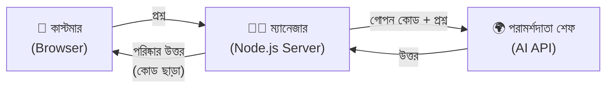

---

## ১. AI API আসলে কী — একদম সহজ ভাষায়

**API** মানে **Application Programming Interface** — দুইটা আলাদা প্রোগ্রামের মধ্যে কথা বলার নিয়ম-কানুন। রেস্টুরেন্টের ভাষায়: **মেনু কার্ড**। মেনুতে লেখা থাকে কী কী অর্ডার করা যাবে, কীভাবে অর্ডার করতে হবে, দাম কত। আপনি রান্নাঘরে ঢুকে নিজে রান্না করতে পারবেন না — মেনু দেখে অর্ডার দেবেন, খাবার চলে আসবে।

**AI API**-ও ঠিক তাই। OpenAI, Google Gemini, Anthropic Claude — এদের বিশাল AI মডেল তাদের নিজেদের সার্ভারে চলে। আপনি সেই মডেল ডাউনলোড করে নিজের পিসিতে চালাবেন না। আপনি শুধু তাদের ঠিকানায় একটা **HTTP Request** পাঠাবেন, আর তারা উত্তর ফেরত দেবে।

একটা AI API কল-এ সাধারণত তিনটা জিনিস লাগে:

| জিনিস | রেস্টুরেন্টের ভাষায় | টেকনিক্যাল নাম |
|---|---|---|
| ঠিকানা | পরামর্শদাতার ফোন নম্বর | **Endpoint URL** |
| পরিচয় | আপনার গোপন সদস্য-কোড | **API Key** (Header-এ পাঠানো হয়) |
| প্রশ্ন | আপনি আসলে কী জানতে চান | **Request Body** (JSON) |

আর উত্তর আসে **JSON** ফরম্যাটে — যেখান থেকে আমাদের দরকারি টেক্সটটা বের করে নিতে হয়।

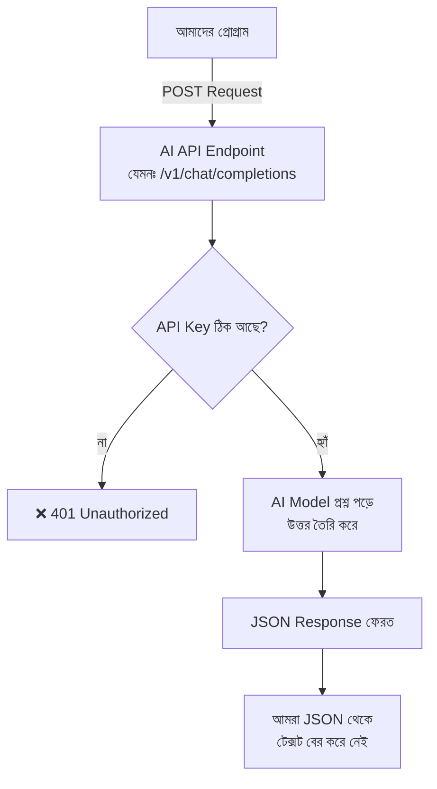

---

## ২. দুইটা রাস্তা: Browser থেকে সরাসরি, নাকি Server-এর মাধ্যমে?

এই টপিকের নামগুলোই এখানে ইঙ্গিত দেয় — *"Calling AI API from Frontend"*, *"Calling AI APIs from the Browser"*। তাই প্রথমে বুঝি, **Frontend থেকে সরাসরি কল করা মানে কী**, তারপর বুঝবো কেন আমরা তার একটু বদলানো রূপ ব্যবহার করি।

### রাস্তা ক — Browser সরাসরি AI API-কে কল করছে

```javascript
// ⚠️ শুধু বোঝার জন্য — বাস্তব প্রজেক্টে এভাবে করবেন না!

// apiKey = গোপন সদস্য-কোড। কিন্তু এটা ব্রাউজারের JS ফাইলে লিখলে
//          যেকোনো ভিজিটর View Source / DevTools-এ দেখে ফেলতে পারবে
const apiKey = "sk-xxxxxxxxxxxxxxxxxxxx";

const response = await fetch("https://api.openai.com/v1/chat/completions", {
  method: "POST",                                  // AI-কে ডেটা পাঠাচ্ছি, তাই GET নয় — POST
  headers: {
    "Content-Type": "application/json",            // বলে দিচ্ছি body-টা JSON ফরম্যাটে
    "Authorization": `Bearer ${apiKey}`,           // ❌ এখানেই চাবিটা ফাঁস হয়ে যাচ্ছে
  },
  body: JSON.stringify({ model: "gpt-4o-mini", messages: [] }),
});
```

### রাস্তা খ — Browser নিজের Server-কে কল করছে, Server AI-কে কল করছে

```javascript
// ✅ সঠিক উপায় — Browser কোনো গোপন চাবি চেনেই না

const response = await fetch("/api/ask", {         // নিজের server-এর ঠিকানা, তাই পুরো URL লাগে না
  method: "POST",
  headers: { "Content-Type": "application/json" }, // Key নেই! শুধু সাধারণ হেডার
  body: JSON.stringify({ question: "১৫ মিনিটে কী রান্না করা যায়?" }),
});
```

দুইটার পার্থক্যটা একনজরে:

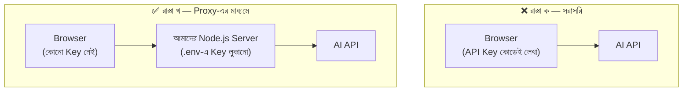

| বিষয় | রাস্তা ক (সরাসরি) | রাস্তা খ (Proxy) |
|---|---|---|
| API Key কোথায় থাকে | ব্রাউজারের কোডে — **সবাই দেখতে পায়** | সার্ভারের `.env`-এ — **কেউ দেখে না** |
| CORS সমস্যা | প্রায়ই হয় | হয় না (server-to-server কলে CORS নেই) |
| খরচ নিয়ন্ত্রণ | কেউ চাবি চুরি করে আপনার টাকায় হাজারবার কল করতে পারবে | সার্ভারে rate limit বসানো যায় |
| Prompt লুকানো | সম্ভব না | সম্ভব — Prompt সার্ভারেই থাকে |
| কখন ব্যবহার করা যায় | শুধু লোকাল শেখা/টেস্টিং বা ব্যবহারকারীর নিজের Key দিয়ে | সব বাস্তব প্রজেক্টে |

> **মনে রাখার এক লাইন:** *Frontend থেকে AI ফিচার কল করা হয় — কিন্তু সেই কলটা যায় নিজের Backend-এ, সরাসরি AI-এর কাছে নয়।*

---

## ৩. বিপদ ১: API Key ফাঁস হয়ে যাওয়া

Browser-এ চলা JavaScript-এর একটা সহজ সত্য আছে: **যা কিছু ব্রাউজারে পৌঁছায়, তার সবই ব্যবহারকারী দেখতে পারে।** মিনিফাই করলেও, ভেরিয়েবলের নাম পাল্টালেও, `btoa()` দিয়ে এনকোড করলেও — কিছুতেই লুকানো যায় না। কারণ ব্রাউজারকে তো ওই চাবিটা দিয়েই ফোন করতে হবে, মানে চাবিটা তার হাতে পৌঁছাতেই হবে।

কেউ চাইলে তিনভাবেই বের করে ফেলবে:

1. **View Source / DevTools → Sources** — JS ফাইলটা পড়ে ফেলবে
2. **DevTools → Network tab** — Request Header-এ `Authorization` দেখে ফেলবে
3. **আপনার GitHub রিপো** — যদি ভুলে key সহ কোড push করে ফেলেন

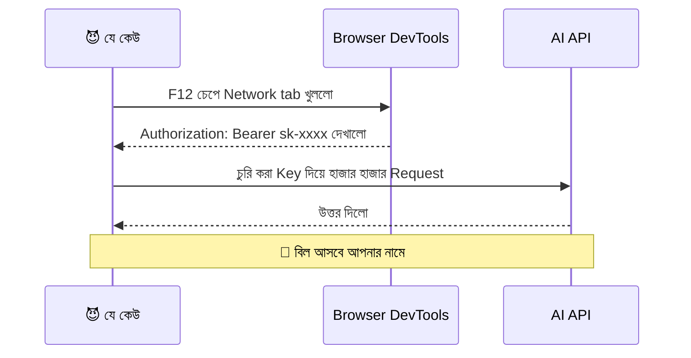

> **গুরুত্বপূর্ণ:** কোনো Key যদি একবার ভুলে GitHub-এ push হয়ে যায়, সেটা মুছে ফেললেও git history-তে থেকে যায়। তখন একমাত্র সঠিক কাজ — **প্রোভাইডারের ড্যাশবোর্ডে গিয়ে ওই Key-টা revoke করে নতুন Key বানানো**।

---

## ৪. বিপদ ২: CORS — দারোয়ানের বাধা

ধরুন আপনার ওয়েবসাইট চলছে `http://localhost:3000`-এ, আর আপনি সেখান থেকে ব্রাউজারের JS দিয়ে `https://api.openai.com`-এ কল করতে চাইলেন। দুইটা **আলাদা origin** (আলাদা ডোমেইন)। ব্রাউজার তখন দারোয়ানের মতো দাঁড়িয়ে যায় আর বলে:

> "তুমি অন্য বাড়ির লোক। ওই বাড়ির মালিক যদি লিখিতভাবে না বলে যে তোমাকে ঢুকতে দেওয়া যাবে, আমি তোমাকে ঢুকতে দেবো না।"

এই নিয়মটার নাম **CORS (Cross-Origin Resource Sharing)**। এটা ব্রাউজারের নিরাপত্তা নিয়ম — **শুধু ব্রাউজারেই প্রযোজ্য**।

আর এখানেই মজার ব্যাপারটা: **Server থেকে Server-এ কল করলে CORS বাধা নেই**, কারণ CORS চেকটা করে ব্রাউজার, Node.js নয়। তাই আমাদের Node.js server নির্দ্বিধায় AI API-কে কল করতে পারে।

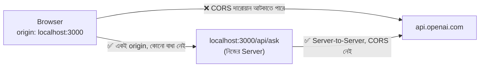

> মনে রাখুন: আমাদের frontend আর backend যদি **একই server** থেকে সার্ভ হয় (যেটা আমরা করবো), তাহলে frontend-এর `fetch("/api/ask")` কলটা same-origin — CORS-এর প্রশ্নই আসে না।

---

## ৫. সমাধান: Backend Proxy — মাঝখানের ম্যানেজার

**Proxy** শব্দটার মানে "প্রতিনিধি"। আমাদের Node.js server এখানে কাস্টমারের প্রতিনিধি হয়ে AI-এর সাথে কথা বলবে। তার কাজ চারটা:

1. Browser থেকে আসা প্রশ্নটা গ্রহণ করা
2. `.env` থেকে গোপন API Key বের করে নেওয়া
3. AI API-কে কল করা
4. AI-এর বড়সড় JSON উত্তর থেকে শুধু দরকারি টেক্সটটা ছেঁকে Browser-এ ফেরত পাঠানো

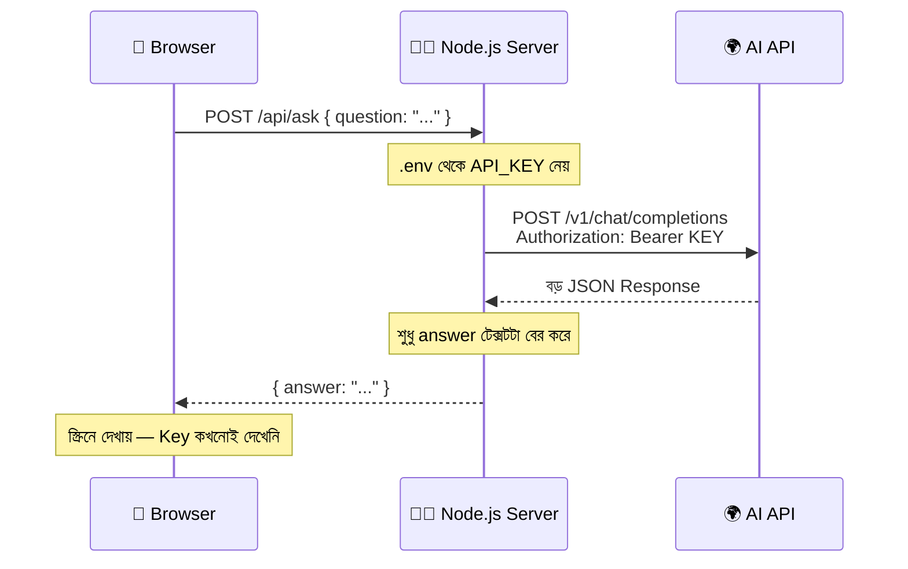

---

## ৬. `fetch()` — ফোন করার যন্ত্র

`fetch()` হলো JavaScript-এর বিল্ট-ইন ফাংশন, যেটা দিয়ে HTTP Request পাঠানো যায়। ভালো খবর — **Node.js 18 বা তার পরের ভার্সনে `fetch()` Node-এর ভেতরেও আছে**, আলাদা করে `axios` বা `node-fetch` ইনস্টল করা লাগে না। মানে একই `fetch()` আমরা Browser-এও লিখবো, Server-এও লিখবো।

`fetch()` একটা **Promise** রিটার্ন করে — মানে "এখনই উত্তর দিচ্ছি না, একটু পরে দেবো" এর প্রতিশ্রুতি। তাই আমরা `async/await` দিয়ে অপেক্ষা করি।

```javascript
// fetch-এর মূল গঠন ভেঙে দেখি

async function askSomething() {
  // response = সার্ভারের পাঠানো পুরো উত্তরের খাম (status, headers, body — সব একসাথে)
  const response = await fetch("/api/ask", {
    method: "POST",                                    // কী ধরনের অনুরোধ — POST মানে ডেটা পাঠাচ্ছি
    headers: {
      "Content-Type": "application/json",              // খামের গায়ে লেখা: ভেতরের চিঠিটা JSON ভাষায়
    },
    body: JSON.stringify({ question: "কেমন আছো?" }),  // JSON.stringify = JS object-কে টেক্সট বানায়, কারণ নেটওয়ার্কে শুধু টেক্সট যায়
  });

  // response.ok = status 200–299 হলে true, নাহলে false
  if (!response.ok) {
    throw new Error("সার্ভার সমস্যা করেছে, status: " + response.status);
  }

  // response.json() = খামের ভেতরের টেক্সটটা আবার JS object-এ রূপান্তর করে (এটাও Promise, তাই await)
  const data = await response.json();

  return data.answer; // আমাদের server যে নামে উত্তর পাঠাচ্ছে, সেই নামেই পড়ছি
}
```

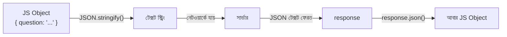

> **একটা সহজ উপমা:** `JSON.stringify()` = চিঠি ভাঁজ করে খামে ভরা। `response.json()` = খাম খুলে চিঠিটা পড়া।

---

## ৭. প্রজেক্ট সেটআপ: Simple Node.js Website

এবার হাতে-কলমে। আমরা বানাবো একটা ছোট্ট ওয়েবসাইট — "🍳 রেসিপি সহায়ক", যেখানে ব্যবহারকারী তার কাছে থাকা উপকরণ লিখবে, আর AI রেসিপি বলে দেবে।

### ফোল্ডার স্ট্রাকচার

```
📦 ai-recipe-helper/
 ┣ 📂 public/               ← Browser যা যা দেখবে (Frontend)
 ┃ ┣ 📜 index.html
 ┃ ┣ 📜 style.css
 ┃ ┗ 📜 script.js
 ┣ 📜 server.js             ← Node.js Server (Backend + Proxy)
 ┣ 📜 .env                  ← গোপন API Key (কখনো GitHub-এ যাবে না)
 ┣ 📜 .env.example          ← নমুনা ফাইল (এটা GitHub-এ যাবে)
 ┣ 📜 .gitignore
 ┗ 📜 package.json
```

### টার্মিনালে কমান্ড

```bash
mkdir ai-recipe-helper && cd ai-recipe-helper   # প্রজেক্ট ফোল্ডার বানিয়ে ভেতরে ঢোকা
npm init -y                                      # package.json বানানো (-y = সব প্রশ্নের ডিফল্ট উত্তর)
npm install express dotenv                       # express = server বানানোর সহজ টুল, dotenv = .env পড়ার টুল
mkdir public                                     # frontend ফাইলগুলো রাখার ফোল্ডার
```

`package.json`-এ একটা ছোট সংযোজন, যাতে `npm start` দিলেই server চালু হয়:

```json
{
  "scripts": {
    "start": "node server.js",
    "dev": "node --watch server.js"
  }
}
```

> `node --watch` = ফাইল সেভ করলেই server নিজে থেকে রিস্টার্ট হবে (Node 18+ এ বিল্ট-ইন, nodemon লাগে না)।

---

## ৮. `.env` আর `.gitignore` — গোপন চাবি লুকানোর সিন্দুক

`.env` ফাইল হলো রেস্টুরেন্টের **ম্যানেজারের ড্রয়ার** — যেখানে গোপন কোড, পাসওয়ার্ড, চাবি রাখা হয়। এই ড্রয়ার কখনো কাস্টমারের সামনে খোলা হয় না, আর কখনো GitHub-এও যায় না।

**`.env`**

```bash
# .env — এই ফাইলটা কখনোই GitHub-এ push হবে না
AI_API_KEY=sk-এখানে-আপনার-আসল-চাবি-বসবে
PORT=3000
```

**`.env.example`** (এটা GitHub-এ থাকবে, যাতে অন্যরা বুঝতে পারে কী কী লাগবে)

```bash
AI_API_KEY=your_api_key_here
PORT=3000
```

**`.gitignore`**

```bash
node_modules/     # ইনস্টল করা প্যাকেজ — Git-এ রাখার দরকার নেই, npm install দিলেই ফিরে আসে
.env              # ⚠️ সবচেয়ে গুরুত্বপূর্ণ লাইন — গোপন চাবি যেন GitHub-এ না যায়
.DS_Store
```

কোডে এটা পড়ি এভাবে:

```javascript
require("dotenv").config();
// dotenv .env ফাইলটা পড়ে ভেতরের প্রতিটা লাইনকে process.env-এর ভেতর ঢুকিয়ে দেয়

const apiKey = process.env.AI_API_KEY;
// apiKey = গোপন চাবি। লক্ষ্য করুন — কোডের ভেতরে চাবিটা লেখা নেই, শুধু "কোথায় আছে" লেখা আছে
```

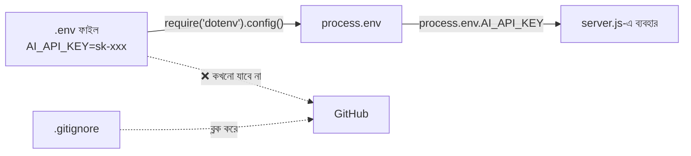

---

## ৯. Backend কোড: `server.js`

এটাই আমাদের ম্যানেজার। প্রতিটা লাইনের পাশে কমেন্টে লেখা আছে — **কোন ভেরিয়েবল কেন ব্যবহার করা হলো**।

```javascript
// server.js — রেস্টুরেন্টের ম্যানেজার (Backend + AI Proxy)

require("dotenv").config();
// সবার আগে .env পড়ে নিলাম, যাতে নিচের কোডে process.env কাজ করে

const express = require("express");
// express = http module-এর উপরে বসানো সহজ একটা লেয়ার, routing অনেক কম কোডে হয়

const path = require("path");
// path = ফোল্ডার/ফাইলের ঠিকানা এমনভাবে বানায় যা Windows, Mac, Linux — সবখানে ঠিক কাজ করে

const app = express();
// app = আমাদের পুরো server অ্যাপ্লিকেশনটা। এর উপরেই সব route বসবে

const PORT = process.env.PORT || 3000;
// PORT = server কোন দরজায় বসে অপেক্ষা করবে।
// || 3000 রাখলাম fallback হিসেবে — .env-এ PORT না থাকলেও যেন server চালু হয়

const API_KEY = process.env.AI_API_KEY;
// API_KEY = গোপন চাবি, শুধু এই server-এর মেমোরিতে থাকে — Browser কখনো পায় না

const AI_ENDPOINT = "https://api.openai.com/v1/chat/completions";
// AI_ENDPOINT = পরামর্শদাতার "ফোন নম্বর"। আলাদা ভেরিয়েবলে রাখলাম,
// যাতে ভবিষ্যতে অন্য প্রোভাইডারে যেতে হলে শুধু এই এক লাইন বদলালেই হয়

const MODEL = "gpt-4o-mini";
// MODEL = কোন মডেলকে জিজ্ঞেস করবো। ছোট মডেল = সস্তা ও দ্রুত, শেখার জন্য যথেষ্ট

// ---------- Middleware ----------

app.use(express.json());
// express.json() = Browser থেকে আসা JSON body-কে পড়ে req.body নামের object বানিয়ে দেয়।
// এটা না লিখলে req.body হবে undefined

app.use(express.static(path.join(__dirname, "public")));
// public ফোল্ডারের ভেতরের index.html, style.css, script.js সরাসরি Browser-কে দিয়ে দেবে।
// __dirname = এই server.js ফাইলটা যে ফোল্ডারে আছে তার পূর্ণ ঠিকানা

// ---------- AI Route ----------

app.post("/api/ask", async (req, res) => {
  // POST ব্যবহার করলাম, কারণ ব্যবহারকারীর প্রশ্নটা body-তে পাঠাতে হবে (GET-এ body পাঠানো যায় না)

  const { question } = req.body;
  // question = Browser-এর পাঠানো আসল প্রশ্ন।
  // object destructuring দিয়ে সরাসরি বের করে নিলাম

  // ---- ধাপ ১: Input যাচাই (কখনোই ব্যবহারকারীর ইনপুটকে অন্ধভাবে বিশ্বাস করবেন না) ----
  if (!question || typeof question !== "string" || question.trim() === "") {
    // খালি প্রশ্ন পাঠালে অযথা AI কল করে টাকা নষ্ট করার দরকার নেই
    return res.status(400).json({ error: "প্রশ্ন খালি রাখা যাবে না।" });
  }

  if (question.length > 500) {
    // দৈর্ঘ্য সীমা = কেউ যেন বিশাল টেক্সট পাঠিয়ে খরচ বাড়িয়ে না দেয়
    return res.status(400).json({ error: "প্রশ্ন ৫০০ অক্ষরের বেশি হতে পারবে না।" });
  }

  try {
    // ---- ধাপ ২: AI API-কে কল করা ----
    const aiResponse = await fetch(AI_ENDPOINT, {
      method: "POST",
      headers: {
        "Content-Type": "application/json",     // আমাদের body-টা JSON
        "Authorization": `Bearer ${API_KEY}`,   // এখানেই পরিচয় দেওয়া হচ্ছে। এই লাইনটা শুধু server-এ আছে ✅
      },
      body: JSON.stringify({
        model: MODEL,
        messages: [
          {
            role: "system",
            // system = AI-কে তার "চরিত্র" বুঝিয়ে দেওয়া।
            // এটা server-এ রাখার আরেকটা সুবিধা — আমাদের prompt কেউ চুরি করতে পারবে না
            content: "তুমি একজন সহায়ক রন্ধন-পরামর্শদাতা। উত্তর বাংলায়, সংক্ষেপে আর ধাপে ধাপে দাও।",
          },
          {
            role: "user",
            content: question, // ব্যবহারকারীর আসল প্রশ্ন
          },
        ],
        max_tokens: 400,   // max_tokens = উত্তর সর্বোচ্চ কত লম্বা হবে — খরচ নিয়ন্ত্রণের লাগাম
        temperature: 0.7,  // temperature = সৃজনশীলতার মাত্রা। 0 = ধরাবাঁধা, 1 = বেশি কল্পনাপ্রবণ
      }),
    });

    // ---- ধাপ ৩: AI সার্ভার নিজেই কোনো সমস্যা জানালো কিনা দেখা ----
    if (!aiResponse.ok) {
      // যেমন 401 = চাবি ভুল, 429 = অনেক বেশি request পাঠানো হয়েছে
      const errorText = await aiResponse.text();
      console.error("AI API Error:", aiResponse.status, errorText);
      // ⚠️ লক্ষ্য করুন: আসল error শুধু server console-এ লিখলাম,
      // Browser-কে একটা সাধারণ মেসেজ পাঠাচ্ছি — যাতে ভেতরের তথ্য ফাঁস না হয়
      return res.status(502).json({ error: "AI সার্ভিস থেকে উত্তর আনা যায়নি।" });
    }

    // ---- ধাপ ৪: উত্তর থেকে দরকারি টেক্সট বের করা ----
    const data = await aiResponse.json();
    // data = AI-এর পাঠানো পুরো JSON — এতে id, usage, choices সব থাকে

    const answer = data.choices[0].message.content;
    // answer = আমাদের আসলে যেটা দরকার — শুধু লেখাটুকু।
    // choices একটা array, কারণ চাইলে একাধিক উত্তর চাওয়া যায়; আমরা প্রথমটাই নিচ্ছি

    // ---- ধাপ ৫: Browser-কে পরিষ্কার-ছোট উত্তর পাঠানো ----
    res.json({ answer });
    // পুরো AI JSON পাঠাচ্ছি না — শুধু answer। কম ডেটা = দ্রুত + নিরাপদ

  } catch (err) {
    // এখানে আসবে নেটওয়ার্ক সমস্যা, ইন্টারনেট না থাকা ইত্যাদি
    console.error("Server Error:", err.message);
    res.status(500).json({ error: "সার্ভারে সমস্যা হয়েছে, একটু পরে আবার চেষ্টা করুন।" });
  }
});

// ---------- Server চালু ----------

app.listen(PORT, () => {
  console.log(`✅ রান্নাঘর খুলে গেলো → http://localhost:${PORT}`);
});
```

### Express ছাড়া, শুধু `http` module দিয়ে করতে চাইলে?

আগের মডিউলে শেখা `http` module দিয়েও একই কাজ হয় — শুধু কোড একটু বেশি লিখতে হয়:

```javascript
const http = require("http");

const server = http.createServer(async (req, res) => {
  if (req.method === "POST" && req.url === "/api/ask") {
    let body = "";
    // body = ব্রাউজার থেকে আসা ডেটা টুকরো টুকরো (chunk) করে আসে, তাই জোড়া লাগাতে হয়
    req.on("data", (chunk) => { body += chunk; });   // "data" Event — নতুন টুকরো এলো
    req.on("end", async () => {                       // "end" Event — সব টুকরো আসা শেষ
      const { question } = JSON.parse(body);          // টেক্সটকে আবার object বানালাম
      // ... এখানে AI API কল করার কোড (উপরের মতোই)
      res.writeHead(200, { "Content-Type": "application/json" });
      res.end(JSON.stringify({ answer: "..." }));
    });
  }
});

server.listen(3000);
```

> দেখুন, Express আসলে জাদু কিছু না — এই `req.on("data")`, `req.on("end")` ঝামেলাগুলোই সে `express.json()` দিয়ে করে দেয়। আর Event-এর ব্যবহারটা আগের মডিউলে শেখা সেই একই "ঘণ্টা সিস্টেম"।

---

## ১০. Frontend কোড: `index.html` + `script.js`

### `public/index.html`

```html
<!DOCTYPE html>
<html lang="bn">
<head>
  <meta charset="UTF-8" />
  <meta name="viewport" content="width=device-width, initial-scale=1.0" />
  <title>🍳 রেসিপি সহায়ক</title>
  <link rel="stylesheet" href="style.css" />
</head>
<body>
  <main class="container">
    <h1>🍳 রেসিপি সহায়ক</h1>
    <p>আপনার কাছে কী কী আছে লিখুন, AI রেসিপি বলে দেবে।</p>

    <!-- id গুলো খুব জরুরি — JS এই id ধরেই এলিমেন্টগুলো খুঁজে নেবে -->
    <textarea id="questionInput" rows="3"
      placeholder="যেমনঃ ডিম, পেঁয়াজ, আলু — ১৫ মিনিটে কী বানাবো?"></textarea>

    <button id="askBtn">জিজ্ঞেস করুন</button>

    <!-- শুরুতে খালি থাকবে, উত্তর এলে JS এখানে লিখে দেবে -->
    <div id="answerBox" class="answer"></div>
  </main>

  <!-- defer = HTML পুরো লোড হওয়ার পরে স্ক্রিপ্ট চলবে,
       তাই getElementById কখনো null পাবে না -->
  <script src="script.js" defer></script>
</body>
</html>
```

### `public/script.js`

```javascript
// script.js — কাস্টমারের টেবিল (Browser-এ চলে)
// ⚠️ মনে রাখুন: এই ফাইলের প্রতিটা লাইন যেকোনো ভিজিটর পড়তে পারে।
//    তাই এখানে কোনো গোপন কিছু (API Key) কখনোই রাখা যাবে না।

// ---- HTML এলিমেন্টগুলো ধরে রাখার ভেরিয়েবল ----
const questionInput = document.getElementById("questionInput");
// questionInput = ব্যবহারকারী যেখানে লিখবে, সেই textarea

const askBtn = document.getElementById("askBtn");
// askBtn = যে বাটনে ক্লিক করলে কাজ শুরু হবে

const answerBox = document.getElementById("answerBox");
// answerBox = যেখানে উত্তর (বা error, বা loading) দেখানো হবে

// ---- মূল ফাংশন ----
async function askAI() {
  // async ব্যবহার করলাম কারণ ভেতরে await লাগবে — নেটওয়ার্কের উত্তরের জন্য অপেক্ষা করতে হবে

  const question = questionInput.value.trim();
  // question = ব্যবহারকারীর লেখা টেক্সট।
  // .trim() দিয়ে আগে-পরের অপ্রয়োজনীয় স্পেস বাদ দিলাম

  if (!question) {
    answerBox.textContent = "⚠️ আগে কিছু লিখুন।";
    return; // খালি হলে সার্ভারে গিয়ে অযথা কল করার দরকার নেই
  }

  // ---- Loading অবস্থা দেখানো ----
  askBtn.disabled = true;
  // disabled = true করলাম যাতে উত্তর আসার আগেই বারবার ক্লিক করে
  // একগাদা request পাঠিয়ে না ফেলে (এতে খরচও বাড়ে)

  askBtn.textContent = "ভাবছি...";
  answerBox.textContent = "⏳ পরামর্শদাতা শেফ ভাবছেন...";

  try {
    const response = await fetch("/api/ask", {
      // "/api/ask" = আমাদের নিজের server-এর route।
      // পুরো URL লিখিনি, কারণ frontend আর backend একই server থেকে আসছে (same origin)
      method: "POST",
      headers: { "Content-Type": "application/json" },
      body: JSON.stringify({ question }),
      // { question } = { question: question } এর শর্টকাট (ES6 shorthand)
    });

    const data = await response.json();
    // data = server-এর পাঠানো object — হয় { answer: "..." } নয়তো { error: "..." }

    if (!response.ok) {
      // response.ok মিথ্যা মানে status 400/500 ইত্যাদি এসেছে
      throw new Error(data.error || "কিছু একটা সমস্যা হয়েছে।");
    }

    answerBox.textContent = data.answer;
    // উত্তরটা স্ক্রিনে বসিয়ে দিলাম।
    // textContent ব্যবহার করলাম innerHTML-এর বদলে — কারণ innerHTML হলে
    // উত্তরের ভেতর কোনো HTML/স্ক্রিপ্ট থাকলে তা চলে যেতে পারে (XSS ঝুঁকি)

  } catch (err) {
    answerBox.textContent = "❌ " + err.message;
    // ব্যবহারকারীকে সরল ভাষায় জানালাম কী হয়েছে

  } finally {
    // finally = সফল হোক বা ব্যর্থ, এই অংশ সবসময় চলবে
    askBtn.disabled = false;   // বাটন আবার ব্যবহারযোগ্য করে দিলাম
    askBtn.textContent = "জিজ্ঞেস করুন";
  }
}

// ---- Event Listener ----
askBtn.addEventListener("click", askAI);
// আগের মডিউলের সেই "ঘণ্টা সিস্টেম"-ই — তবে এবার ব্রাউজারে।
// "click" নামের ঘটনা ঘটলেই askAI ফাংশনটা চলবে

questionInput.addEventListener("keydown", (e) => {
  // e = event object — কোন কী চাপা হয়েছে সেই তথ্য এতে থাকে
  if (e.key === "Enter" && !e.shiftKey) {
    // Enter চাপলে পাঠাবে, কিন্তু Shift+Enter চাপলে নতুন লাইন হবে
    e.preventDefault(); // textarea-র ডিফল্ট "নতুন লাইন" আচরণ থামালাম
    askAI();
  }
});
```

### `public/style.css` (সংক্ষিপ্ত)

```css
body { font-family: system-ui, sans-serif; background: #f4f6f8; margin: 0; padding: 24px; }
.container { max-width: 640px; margin: 0 auto; background: #fff; padding: 24px; border-radius: 12px; }
textarea { width: 100%; padding: 12px; font-size: 16px; border: 1px solid #ccc; border-radius: 8px; }
button { margin-top: 12px; padding: 10px 20px; font-size: 16px; border: 0; border-radius: 8px; background: #2563eb; color: #fff; cursor: pointer; }
button:disabled { background: #94a3b8; cursor: not-allowed; }
.answer { margin-top: 20px; white-space: pre-wrap; line-height: 1.7; }
```

> `white-space: pre-wrap` দিলাম, কারণ AI-এর উত্তরে ধাপ ধাপ করে নতুন লাইন (`\n`) থাকে — এটা না দিলে সব একসাথে লেপ্টে যায়।

---

## ১১. পুরো Flow একসাথে দেখা

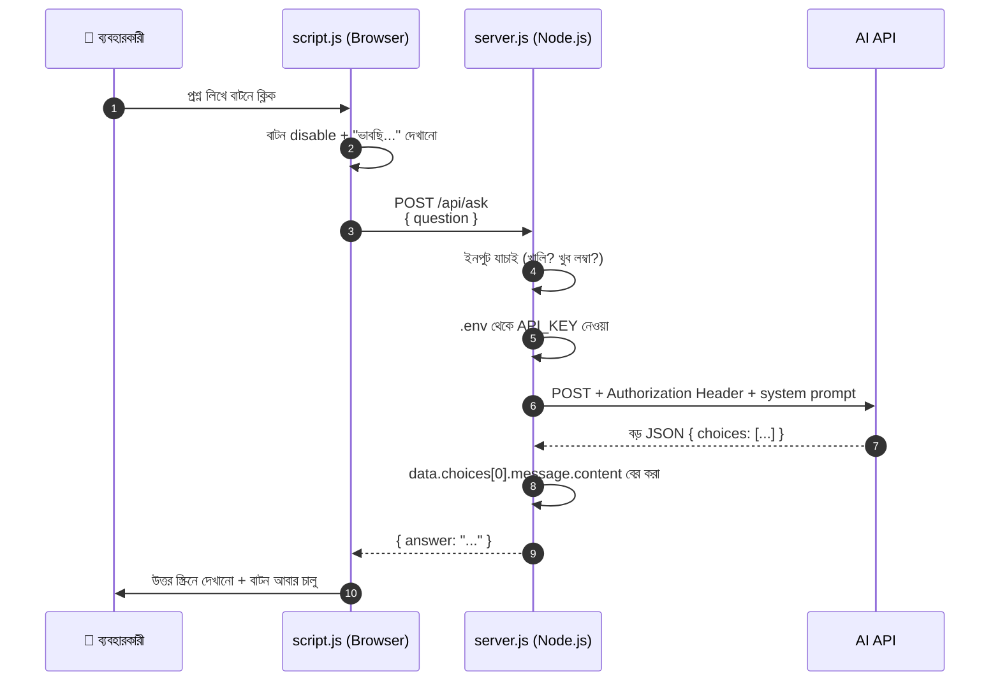

এখানে খেয়াল করার বিষয় — **API Key কখনোই ডানদিকের দুইটা অংশের বাইরে যায়নি।** ব্যবহারকারী আর Browser দুজনেই চাবিটার অস্তিত্বই জানে না।

---

## ১২. Loading, Error আর ভালো UX

AI API-এর উত্তর আসতে ২–১০ সেকেন্ড লাগতে পারে। এই সময়টুকুতে ব্যবহারকারী যদি কিছুই না দেখে, সে ভাববে সাইটটা নষ্ট। তাই তিনটা অবস্থা সবসময় সামলাতে হবে:

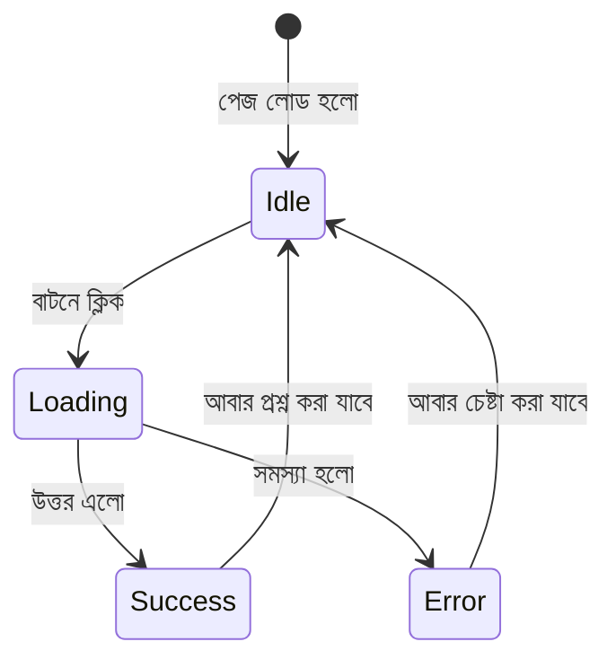

| অবস্থা | কী করতে হবে | কেন |
|---|---|---|
| **Loading** | বাটন disable, "ভাবছি..." দেখানো | বারবার ক্লিক = একাধিক request = বাড়তি খরচ |
| **Success** | উত্তর `textContent` দিয়ে বসানো | `innerHTML` এড়ানো → XSS ঝুঁকি কমে |
| **Error** | সরল ভাষায় মেসেজ + বাটন আবার চালু | ব্যবহারকারী যেন আটকে না থাকে |

আর একটা ছোট কিন্তু কাজের ট্রিক — একই প্রশ্ন বারবার করলে সেটা মনে রাখা (caching):

```javascript
const cache = new Map();
// cache = প্রশ্ন → উত্তর জোড়া রাখার ছোট মেমোরি।
// Map ব্যবহার করলাম, কারণ এতে key হিসেবে যেকোনো স্ট্রিং রাখা যায় আর খোঁজা দ্রুত

if (cache.has(question)) {
  answerBox.textContent = cache.get(question); // একই প্রশ্নে আবার API কল = অযথা খরচ
  return;
}
// ... API কল করার পর:
cache.set(question, data.answer);
```

---

## ১৩. বোনাস: Streaming — উত্তর টাইপ হতে হতে দেখা

ChatGPT-তে দেখেছেন, উত্তর এক ঝটকায় আসে না — অক্ষর অক্ষর করে টাইপ হতে থাকে। একে বলে **Streaming**। রেস্টুরেন্টের ভাষায় — পরামর্শদাতা পুরো রেসিপি লিখে শেষ করে পাঠাচ্ছেন না, বরং **বলতে বলতেই ফোনে শোনাচ্ছেন**, আর ম্যানেজার শুনতে শুনতেই কাস্টমারকে বলে যাচ্ছেন।

```javascript
// server.js-এ: AI-কে বললাম stream চাই
body: JSON.stringify({
  model: MODEL,
  messages: [...],
  stream: true,  // stream = true মানে উত্তর টুকরো টুকরো করে পাঠাও
})

// তারপর AI-এর উত্তরের স্রোতটা সরাসরি Browser-এর দিকে ঢেলে দিলাম
res.setHeader("Content-Type", "text/event-stream"); // ব্রাউজারকে বললাম: এটা একটানা স্রোত
for await (const chunk of aiResponse.body) {
  // chunk = উত্তরের এক একটা ছোট টুকরো
  res.write(chunk); // পেলাম আর সাথে সাথে পাঠিয়ে দিলাম
}
res.end(); // স্রোত শেষ
```

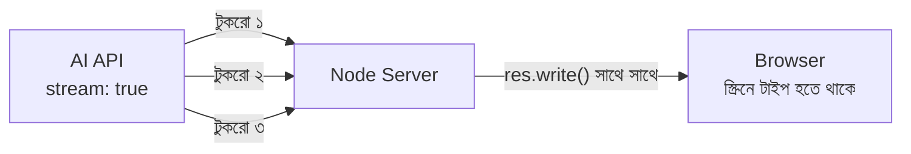

> মনে আছে আগের মডিউলের Stream আর Event? এটা সেই একই ধারণা — `"data"` Event এলেই টুকরোটা পরের জনকে পাঠিয়ে দেওয়া। শুরুতে এটা না করলেও চলবে, আগে সাধারণ ভার্সনটা কাজ করুক।

---

## ১৪. নিরাপত্তা চেকলিস্ট

প্রজেক্ট GitHub-এ তোলার আগে বা লাইভ করার আগে এই তালিকাটা একবার মিলিয়ে নিন:

- [ ] `.env` ফাইলটা `.gitignore`-এ আছে তো? (সবচেয়ে জরুরি)
- [ ] কোডের কোথাও হার্ডকোড করা API Key নেই তো? (`git grep "sk-"` দিয়ে খুঁজে দেখুন)
- [ ] `public/` ফোল্ডারের কোনো ফাইলে গোপন কিছু নেই তো? (এই ফোল্ডারের সবকিছু ব্রাউজারে যায়)
- [ ] ইনপুটের দৈর্ঘ্য সীমা বসানো আছে? (`max_tokens` + `question.length` চেক)
- [ ] AI API-এর আসল error message সরাসরি Browser-এ পাঠাচ্ছেন না তো? (শুধু `console.error`-এ)
- [ ] Rate limit আছে? (লাইভে দিলে `express-rate-limit` দিয়ে, যেমন প্রতি IP-তে মিনিটে ৫টা)
- [ ] `innerHTML`-এর বদলে `textContent` ব্যবহার করেছেন?

```javascript
// লাইভে দেওয়ার আগে rate limit বসানোর সহজ উপায়
const rateLimit = require("express-rate-limit");

const aiLimiter = rateLimit({
  windowMs: 60 * 1000, // windowMs = কত সময়ের হিসাব — এখানে ৬০ সেকেন্ড
  max: 5,              // max = ওই সময়ে একটা IP সর্বোচ্চ কয়টা request পাঠাতে পারবে
  message: { error: "একটু ধীরে! এক মিনিট পরে আবার চেষ্টা করুন।" },
});

app.use("/api/ask", aiLimiter); // শুধু এই একটা route-এ লাগালাম, পুরো সাইটে নয়
```

---

## ১৫. সারসংক্ষেপ ও Practice আইডিয়া

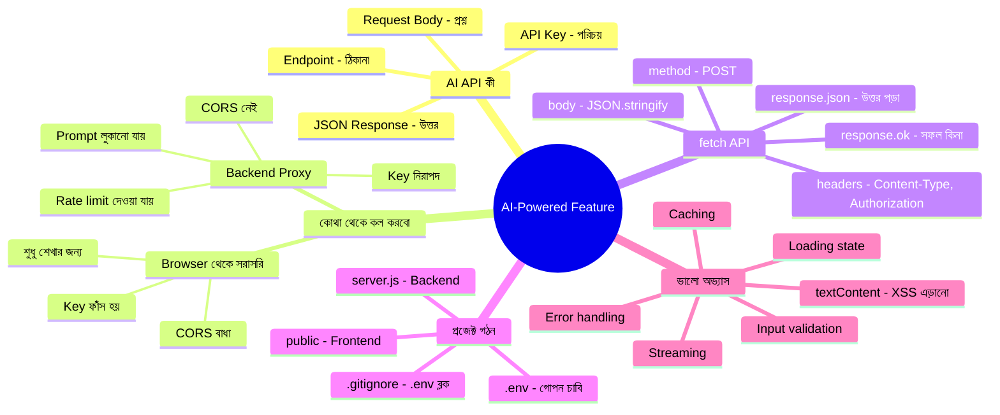

### Practice-এর জন্য আইডিয়া

1. **রেসিপি সহায়ক বানানো** — এই ফাইলের পুরো প্রজেক্টটা নিজে হাতে টাইপ করে চালানো (কপি-পেস্ট নয়, টাইপ করলে মাথায় থাকে)।
2. **Prompt বদলে নতুন অ্যাপ** — `system` prompt বদলে একে বানান "বাংলা বানান সংশোধক" বা "ইংরেজি→বাংলা অনুবাদক"। কোড একই থাকবে, শুধু একটা লাইন বদলাবে।
3. **DevTools পরীক্ষা** — নিজের অ্যাপ চালিয়ে Network tab খুলে দেখুন `/api/ask` request-এ কোথাও API Key দেখা যাচ্ছে কিনা। না দেখা গেলে বুঝবেন আপনি সঠিকভাবে বানিয়েছেন ✅
4. **History যোগ করা** — আগের প্রশ্ন-উত্তরগুলো একটা array-তে রেখে `messages`-এ পাঠান, যাতে AI আগের কথা মনে রাখতে পারে (multi-turn chat)।
5. **fs দিয়ে লগ রাখা** — আগের মডিউলের `fs.appendFile()` দিয়ে প্রতিটা প্রশ্ন-উত্তর একটা `chat-log.txt`-এ সেভ করুন।
6. **Streaming চালু করা** — শেষের বোনাস অংশটা পুরোপুরি কাজ করানোর চেষ্টা করুন।

---
