# ⚙️ রান্নাঘরের ইঞ্জিন: আপনার লেখা রেসিপি কীভাবে আসল রান্নায় পরিণত হয় (V8 Engine & Execution)

> এই ডকুমেন্টটাও আগের ফাইলগুলোর মতোই **গল্প আকারে** লেখা, যাতে concept গুলো মুখস্থ না হয়ে মাথায় গেঁথে যায়।
>
> আগের গল্পে আমরা শিখেছিলাম — Node.js হলো রেস্টুরেন্টের **রান্নাঘর**, `http` দিয়ে কাস্টমারের অর্ডার নেওয়া হয়, `fs` দিয়ে রেসিপির খাতায় লেখা-পড়া হয়, আর `events` দিয়ে ঘণ্টা বাজিয়ে সবাইকে জানানো হয়।
>
> কিন্তু একটা প্রশ্ন আমরা এতদিন এড়িয়ে গেছি — **শেফ যে রেসিপিটা বাংলায় (JavaScript-এ) লিখলো, সেটা তো চুলা-ওভেন-মেশিন কেউই বোঝে না। ওরা তো শুধু 0 আর 1 বোঝে!** তাহলে রেসিপি থেকে আসল রান্নাটা হয় কীভাবে?
>
> আজকের পুরো গল্পটা এই একটা প্রশ্নের উত্তর — **V8 Engine**।

---

## 📚 সূচিপত্র (Table of Contents)

1. [ভূমিকা: রেসিপি আর যন্ত্রের ভাষার দূরত্ব](#ভূমিকা-রেসিপি-আর-যন্ত্রের-ভাষার-দূরত্ব)
2. [How Programs Are Executed — একটা প্রোগ্রাম আসলে কীভাবে চলে](#১-how-programs-are-executed--একটা-প্রোগ্রাম-আসলে-কীভাবে-চলে)
3. [Compiler — আগেই পুরো বই অনুবাদ করে ফেলা অনুবাদক](#২-compiler--আগেই-পুরো-বই-অনুবাদ-করে-ফেলা-অনুবাদক)
4. [Interpreter — পাশে দাঁড়ানো লাইভ দোভাষী](#৩-interpreter--পাশে-দাঁড়ানো-লাইভ-দোভাষী)
5. [Compiler vs Interpreter — আর JavaScript কোনটা?](#৪-compiler-vs-interpreter--আর-javascript-কোনটা)
6. [Byte Code আর Machine Code — মাঝের ভাষা আর যন্ত্রের ভাষা](#৫-byte-code-আর-machine-code--মাঝের-ভাষা-আর-যন্ত্রের-ভাষা)
7. [JavaScript Engine কী — আর V8 কেন বিখ্যাত](#৬-javascript-engine-কী--আর-v8-কেন-বিখ্যাত)
8. [Deep Dive into V8 — ভেতরের পুরো পাইপলাইন](#৭-deep-dive-into-v8--ভেতরের-পুরো-পাইপলাইন)
9. [Memory Management — Call Stack আর Memory Heap](#৮-memory-management--call-stack-আর-memory-heap)
10. [Garbage Collection — রান্নাঘরের পরিচ্ছন্নতাকর্মী](#৯-garbage-collection--রান্নাঘরের-পরিচ্ছন্নতাকর্মী)
11. [Node.js-এর ভেতরে V8 কোথায় বসে আছে](#১০-nodejs-এর-ভেতরে-v8-কোথায়-বসে-আছে)
12. [Simple Node.js Website — আর সেই কোডের পুরো যাত্রা](#১১-simple-nodejs-website--আর-সেই-কোডের-পুরো-যাত্রা)
13. [দ্রুত কোড লেখার ব্যবহারিক নিয়ম (V8-Friendly Code)](#১২-দ্রুত-কোড-লেখার-ব্যবহারিক-নিয়ম-v8-friendly-code)
14. [সারসংক্ষেপ ও Practice আইডিয়া](#১৩-সারসংক্ষেপ-ও-practice-আইডিয়া)

---

## ভূমিকা: রেসিপি আর যন্ত্রের ভাষার দূরত্ব

কল্পনা করুন, আপনি রেস্টুরেন্টের প্রধান শেফ। আপনি একটা রেসিপি লিখলেন সুন্দর বাংলায়:

> "পেঁয়াজ কুচি করো, তেল গরম করো, তারপর ১০ মিনিট ভাজো।"

এখন সমস্যা হলো — আপনার রান্নাঘরের **যন্ত্রগুলো** (চুলা, ব্লেন্ডার, ওভেন) বাংলা তো দূরের কথা, কোনো মানুষের ভাষাই বোঝে না। ওরা শুধু বোঝে **সুইচ অন / সুইচ অফ** — অর্থাৎ **1 আর 0**।

কম্পিউটারের ক্ষেত্রেও ঠিক এটাই ঘটে:

- আপনি লেখেন **JavaScript** — এটা মানুষের পড়ার উপযোগী ভাষা, একে বলে **High-Level Language**।
- কম্পিউটারের CPU বোঝে শুধু **Machine Code** — 0 আর 1-এর সারি, একে বলে **Low-Level Language**।

এই দুইয়ের মাঝখানে একটা **অনুবাদক** দরকার। সেই অনুবাদকের নামই — **JavaScript Engine**। আর Chrome ও Node.js যেই অনুবাদক ব্যবহার করে, তার নাম **V8**।

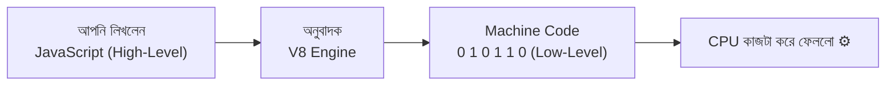

পুরো ডকুমেন্টে আমরা এই **অনুবাদক**-কেই এক এক করে খুলে দেখবো।

---

## ১. How Programs Are Executed — একটা প্রোগ্রাম আসলে কীভাবে চলে

### গল্পটা আগে

আপনি রেসিপির খাতাটা (Source Code) লিখে রাখলেন। এখন রান্না শুরু হওয়া পর্যন্ত খাতাটাকে কয়েকটা ধাপ পার হতে হয়:

1. **খাতাটা পড়া হয়** — কে কী লিখেছে, বানান ঠিক আছে কিনা, নিয়ম মেনে লেখা হয়েছে কিনা (**Parsing**)।
2. **খাতাটাকে একটা কাঠামোতে সাজানো হয়** — কোন কাজটা কোন কাজের ভেতরে, কোনটা আগে-পরে (**AST — Abstract Syntax Tree**)।
3. **কাঠামোটাকে অনুবাদ করা হয়** যন্ত্রের বোঝার মতো ভাষায় (**Byte Code / Machine Code**)।
4. **তারপর যন্ত্র কাজটা করে** (**Execution**)।

### টেকনিক্যালি

যেকোনো প্রোগ্রাম চলার সাধারণ ধাপগুলো:

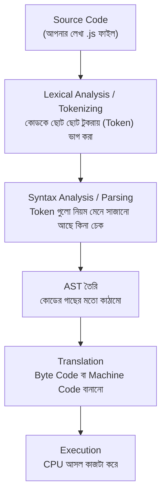

একটা ছোট কোড দিয়ে দেখি Tokenizing আসলে কী:

```javascript
// একদম সাধারণ একটা লাইন
const total = 10 + 20;
```

এই লাইনটাকে Engine প্রথমে ভেঙে ফেলে এরকম Token-এ:

| Token | ধরন | মানে |
|---|---|---|
| `const` | Keyword | ভেরিয়েবল ঘোষণার নির্দেশ |
| `total` | Identifier | ভেরিয়েবলের নাম |
| `=` | Operator | মান বসানোর চিহ্ন |
| `10` | Numeric Literal | সংখ্যা |
| `+` | Operator | যোগ চিহ্ন |
| `20` | Numeric Literal | সংখ্যা |
| `;` | Punctuator | লাইন শেষ |

তারপর সেই Token গুলো দিয়ে **AST** বানায় — কোডের একটা গাছের মতো ছবি:

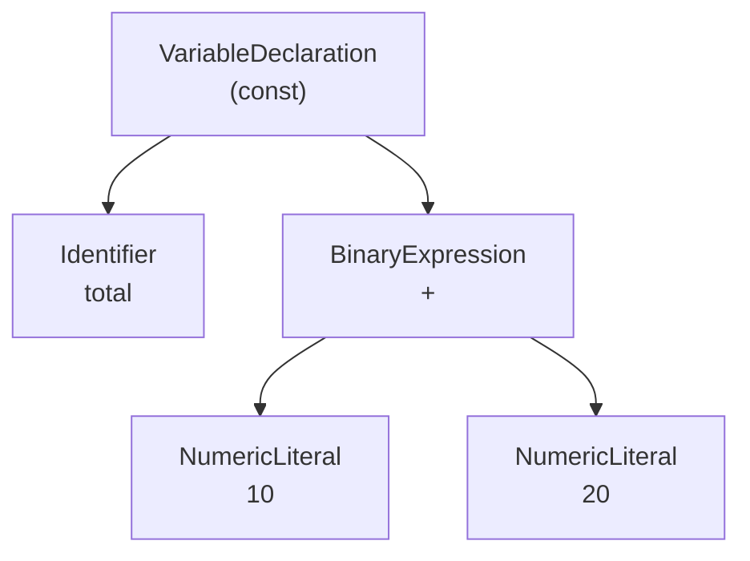

> **মনে রাখার কথা:** AST হলো আপনার কোডের "মানে" বোঝার জন্য Engine-এর নিজের নোট। Prettier, ESLint, Babel — এরা সবাই এই একই AST ব্যবহার করে আপনার কোড ফরম্যাট/চেক/রূপান্তর করে।

### High-Level vs Low-Level Language

| বিষয় | High-Level (JavaScript, Python, PHP) | Low-Level (Assembly, Machine Code) |
|---|---|---|
| কে সহজে পড়তে পারে | মানুষ | কম্পিউটার |
| Memory নিজে সামলাতে হয় | না (Engine সামলায়) | হ্যাঁ |
| Portable (যেকোনো মেশিনে চলে) | হ্যাঁ | না, CPU-নির্ভর |
| গতি | তুলনামূলক ধীর | সবচেয়ে দ্রুত |

---

## ২. Compiler — আগেই পুরো বই অনুবাদ করে ফেলা অনুবাদক

### গল্পটা

ধরুন, আপনার রেস্টুরেন্টে একজন **জাপানি শেফ** আসবেন, কিন্তু রেসিপির খাতাটা বাংলায় লেখা। আপনি কী করলেন? আপনি খাতাটা একজন **অনুবাদকের** কাছে দিলেন, তিনি **পুরো বইটা আগে থেকেই** জাপানিতে অনুবাদ করে একটা নতুন ছাপা বই বানিয়ে দিলেন।

এখন জাপানি শেফ সেই অনুবাদ করা বই নিয়ে সরাসরি রান্নায় নামতে পারেন — মাঝখানে আর কাউকে লাগবে না। এই অনুবাদকই হলো **Compiler**।

### টেকনিক্যালি

**Compiler** পুরো Source Code-টা একবারে পড়ে, পুরোটা অনুবাদ করে একটা আলাদা ফাইল (Executable / Machine Code) বানায়। তারপর সেই ফাইলটা চালানো হয়।


**সুবিধা**

- রান করার সময় খুব **দ্রুত**, কারণ অনুবাদ আগেই শেষ।
- কম্পাইল করার সময়ই **সব Error ধরা পড়ে** (রান করার আগেই জানা যায় ভুল আছে)।
- অনুবাদের সময় Compiler হাতে অনেক সময় পায়, তাই সে **Optimize** করতে পারে।

**অসুবিধা**

- প্রতিবার কোড বদলালে **পুরোটা আবার কম্পাইল** করতে হয় — শুরুতে সময় লাগে।
- এক OS/CPU-এর জন্য বানানো ফাইল অন্যটায় সবসময় চলে না।

**উদাহরণ ভাষা:** C, C++, Rust, Go

---

## ৩. Interpreter — পাশে দাঁড়ানো লাইভ দোভাষী

### গল্পটা

এবার অন্য পরিস্থিতি। জাপানি শেফ হুট করে চলে এসেছেন, অনুবাদ করার সময় নেই। তাই আপনি একজন **দোভাষী**-কে পাশে দাঁড় করিয়ে দিলেন। শেফ রান্না শুরু করলেন, আর দোভাষী **লাইন ধরে ধরে** বলতে লাগলেন —

> "প্রথম লাইন: পেঁয়াজ কাটো।" ... (শেফ কাটলেন) ... "দ্বিতীয় লাইন: তেল গরম করো।" ...

এখানে অনুবাদ আর রান্না **একসাথে** চলছে। এটাই **Interpreter**।

### টেকনিক্যালি

**Interpreter** কোডটা **লাইন বাই লাইন** পড়ে, সাথে সাথেই অনুবাদ করে এবং সাথে সাথেই চালায়। আলাদা কোনো ফাইল বানায় না।

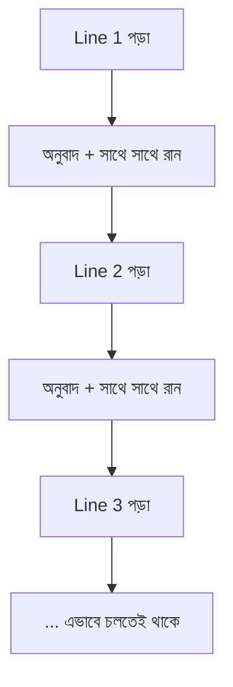

**সুবিধা**

- **সাথে সাথেই শুরু হয়ে যায়** — কম্পাইল হওয়ার জন্য অপেক্ষা করতে হয় না (দ্রুত Startup)।
- কোড বদলে সাথে সাথে টেস্ট করা যায় — ডেভেলপমেন্টে খুব আরামদায়ক।
- Platform-independent — একই কোড বিভিন্ন মেশিনে চলে।

**অসুবিধা**

- **ধীর**, কারণ একই লাইন লুপে ১০০০ বার চললে **১০০০ বারই আবার অনুবাদ** করতে হয়।
- Error ধরা পড়ে রান করার সময়, আগে নয় — অর্থাৎ ৫০ নম্বর লাইনে ভুল থাকলে ৪৯ লাইন চলার পর সেটা জানা যায়।

**উদাহরণ ভাষা:** Python, Ruby, PHP (ঐতিহ্যগতভাবে), JavaScript (শুরুর দিকে)

---

## ৪. Compiler vs Interpreter — আর JavaScript কোনটা?

### পাশাপাশি তুলনা

| বিষয় | Compiler | Interpreter |
|---|---|---|
| অনুবাদ করে | একবারে পুরো কোড | এক লাইন করে |
| আউটপুট | আলাদা Machine Code ফাইল | আলাদা কোনো ফাইল নেই |
| Startup গতি | ধীর (আগে কম্পাইল লাগে) | দ্রুত (সাথে সাথে শুরু) |
| রান করার গতি | দ্রুত | ধীর |
| Error দেখায় | রান করার আগেই, একসাথে | রান করার সময়, যেখানে ভুল সেখানে |
| Memory ব্যবহার | বেশি (Object Code রাখতে হয়) | কম |
| উদাহরণ | C, C++, Go, Rust | Python, Ruby |

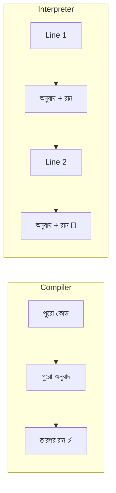

### তাহলে JavaScript কোনটা?

এখানেই মজার মোড়। **আধুনিক JavaScript আসলে দুইটাই!**

শুরুতে (১৯৯৫-এর দিকে) JavaScript ছিল খাঁটি Interpreted ভাষা — মানে খুব ধীর। কিন্তু ওয়েব যত ভারী হতে লাগলো, ততই দরকার হলো গতি। তাই Engine-রা একটা চালাকি বের করলো:

> **"শুরুতে দোভাষী দিয়ে চালাও (যাতে সাথে সাথে শুরু হয়), কিন্তু যে অংশটা বারবার লাগছে সেটা দেখে ফেলে অনুবাদক দিয়ে ছাপিয়ে রাখো (যাতে পরেরবার থেকে দ্রুত হয়)।"**

এই মিশ্র পদ্ধতির নামই **JIT — Just-In-Time Compilation**।

গল্পের ভাষায়: রান্নাঘরে দোভাষী পাশে দাঁড়িয়ে লাইন বাই লাইন বলছেন। কিন্তু তিনি খেয়াল করলেন — "পেঁয়াজ ভাজার" অংশটা শেফ দিনে ৫০ বার করছেন। তখন তিনি বললেন, "থাক, এই অংশটা আমি একবারে অনুবাদ করে কার্ডে লিখে দেয়ালে টাঙিয়ে দিচ্ছি। এরপর থেকে আমাকে আর জিজ্ঞেস করতে হবে না।"

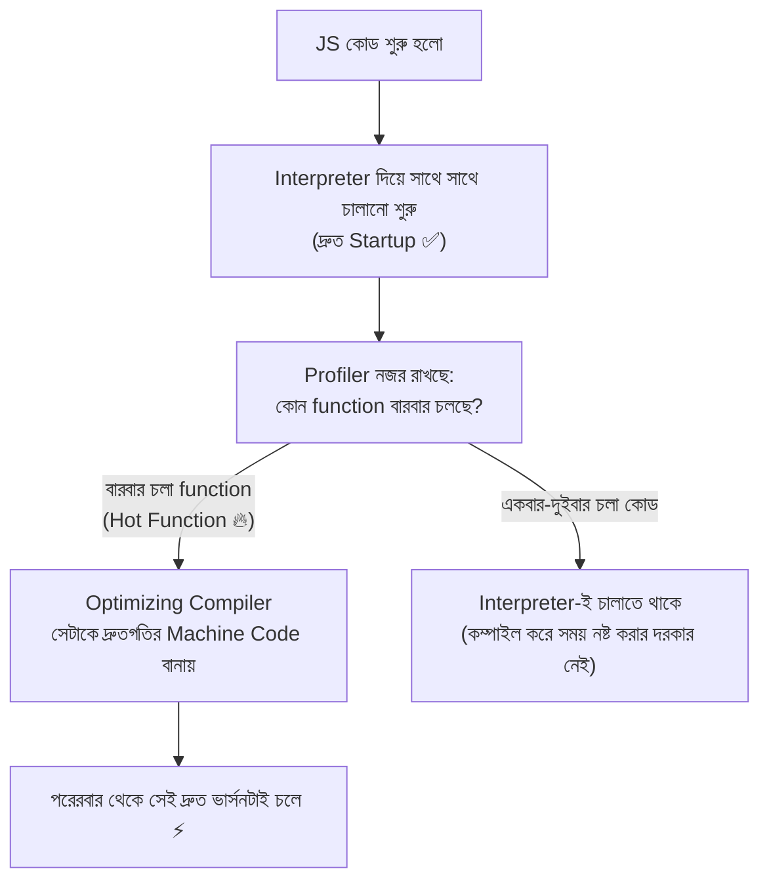

---

## ৫. Byte Code আর Machine Code — মাঝের ভাষা আর যন্ত্রের ভাষা

### গল্পটা

দোভাষী যখন লাইন বাই লাইন অনুবাদ করেন, তখন তিনি প্রতিবার পুরো বাক্যটা মনে রাখেন না। তিনি ছোট ছোট **সাংকেতিক নোট** বানিয়ে নেন — যেমন `কাটা → পেঁয়াজ`, `গরম → তেল`, `ভাজা → ১০মিনিট`। এই সংক্ষিপ্ত সাংকেতিক নোটই হলো **Byte Code**।

আর রান্নাঘরের মেশিন যেই ভাষায় আসলে চলে — মোটর ঘুরবে কত RPM-এ, কোন সুইচ কখন অন হবে — সেটা হলো **Machine Code**।

### Byte Code

- এটা Source Code আর Machine Code-এর **মাঝামাঝি একটা ভাষা** — একে বলে **Intermediate Representation (IR)**।
- মানুষের পড়ার জন্য নয়, কিন্তু Machine Code-এর মতো একেবারে CPU-নির্ভরও নয়।
- **Portable** — মানে একই Byte Code বিভিন্ন CPU-এর মেশিনে Virtual Machine চালাতে পারে।
- JavaScript-এ V8-এর **Ignition** নামের Interpreter এই Byte Code বানায় এবং চালায়।

একটা উদাহরণ দেখি (শুধু ধারণার জন্য — আসল ফরম্যাট আরও ভিন্ন):

```javascript
// আমাদের সাধারণ JS কোড
function add(a, b) {
  return a + b;
}
add(5, 10);
```

V8 এটাকে মোটামুটি এই ধরনের Byte Code-এ রূপ দেয়:

```text
LdaSmi [5]          // Load করো ছোট সংখ্যা 5 → Accumulator-এ
Star r0             // Accumulator-এর মান store করো register r0-তে
LdaSmi [10]         // Load করো 10
Star r1             // store করো r1-তে
Ldar r0             // r0 আবার Accumulator-এ আনো
Add r1              // r1-এর সাথে যোগ করো
Return              // ফলাফল ফেরত দাও
```

> নিজের চোখে দেখতে চাইলে টার্মিনালে চালান:
> ```bash
> node --print-bytecode your-file.js
> ```

### Machine Code

- CPU-এর **নিজের ভাষা** — শুধু 0 আর 1।
- একেবারেই **CPU Architecture নির্ভর** (x86, ARM ইত্যাদির জন্য আলাদা)।
- সবচেয়ে দ্রুত, কারণ অনুবাদের আর কিছুই বাকি নেই।

মাঝে আরেকটা স্তর আছে — **Assembly**, যেটা Machine Code-এর মানুষের-পড়ার-উপযোগী রূপ (`MOV`, `ADD`, `JMP` ইত্যাদি)।

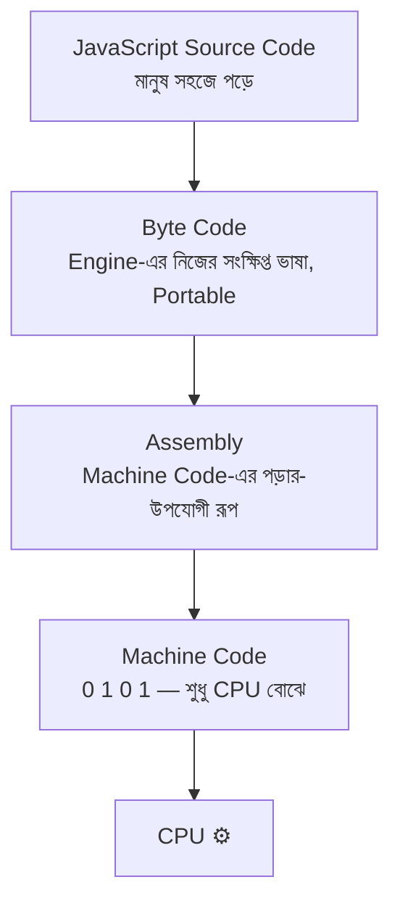

| বিষয় | Byte Code | Machine Code |
|---|---|---|
| কে চালায় | Virtual Machine / Engine | সরাসরি CPU |
| CPU নির্ভর? | না (Portable) | হ্যাঁ |
| গতি | মাঝামাঝি | সবচেয়ে দ্রুত |
| উদাহরণ | V8 Ignition Bytecode, Java Bytecode (`.class`), Python `.pyc` | `.exe` ফাইলের ভেতরের বাইনারি |

---

## ৬. JavaScript Engine কী — আর V8 কেন বিখ্যাত

**JavaScript Engine** হলো সেই প্রোগ্রাম, যেটা আপনার JS কোড পড়ে, বোঝে, অনুবাদ করে এবং চালায়। প্রতিটা ব্রাউজারের নিজস্ব Engine আছে:

| Engine | কে বানিয়েছে | কোথায় ব্যবহার হয় |
|---|---|---|
| **V8** | Google | Chrome, Edge, Opera, **Node.js**, Deno, Electron |
| SpiderMonkey | Mozilla | Firefox |
| JavaScriptCore (Nitro) | Apple | Safari, Bun |
| Chakra | Microsoft | পুরনো Edge (এখন আর নয়) |

### V8 কেন গুরুত্বপূর্ণ

- এটা **C++** দিয়ে লেখা, **Open Source**।
- ২০০৮ সালে Chrome-এর সাথে আসে, আর JavaScript-এর গতিকে একেবারে বদলে দেয়।
- **সবচেয়ে বড় কথা:** Ryan Dahl ২০০৯ সালে এই V8-কে ব্রাউজার থেকে **বের করে এনে** তার সাথে ফাইল সিস্টেম, নেটওয়ার্ক ইত্যাদির ক্ষমতা জুড়ে দিয়ে বানালেন **Node.js** — আর সেই কারণেই আজ আমরা সার্ভারে JavaScript লিখতে পারি।

> **এখানেই আগের গল্পের সাথে মিল:** আগের ফাইলে বলেছিলাম Browser-এ File System access নেই, কিন্তু Node.js-এ আছে। কারণটা এখন পরিষ্কার — V8 শুধু **JavaScript চালাতে** জানে, ফাইল পড়তে জানে না। ফাইল পড়ার ক্ষমতাটা Node.js আলাদা করে (libuv + C++ bindings দিয়ে) V8-এর সাথে জুড়ে দিয়েছে।

---

## ৭. Deep Dive into V8 — ভেতরের পুরো পাইপলাইন

এবার আসল অংশ। V8-এর ভেতরে ঢুকে দেখি — গল্পের রান্নাঘরে এটা একটা **পুরো অনুবাদক টিম**, যেখানে প্রত্যেকের আলাদা দায়িত্ব।

### টিমের সদস্যরা

| V8-এর অংশ | রান্নাঘরের ভাষায় | কাজ |
|---|---|---|
| **Parser** | খাতা পড়ে বানান-নিয়ম চেক করা কেরানি | কোড পড়ে Token আর AST বানায় |
| **Ignition** | পাশে দাঁড়ানো দোভাষী | AST থেকে Byte Code বানায় ও চালায় (Interpreter) |
| **Profiler** | পর্যবেক্ষক, যে নোট রাখে কোন কাজটা বারবার হচ্ছে | Hot Function খুঁজে বের করে |
| **Sparkplug** | দ্রুত হাতের সাধারণ অনুবাদক | Byte Code থেকে দ্রুত কিন্তু সাধারণ Machine Code বানায় |
| **Maglev** | মাঝারি মানের দক্ষ অনুবাদক | মাঝামাঝি পর্যায়ের optimization করে |
| **TurboFan** | সবচেয়ে দক্ষ, সময় নিয়ে কাজ করা অনুবাদক | সর্বোচ্চ optimized Machine Code বানায় |
| **Orinoco (GC)** | রান্নাঘরের পরিচ্ছন্নতাকর্মী | অব্যবহৃত মেমোরি পরিষ্কার করে |

### পুরো পাইপলাইন এক নজরে

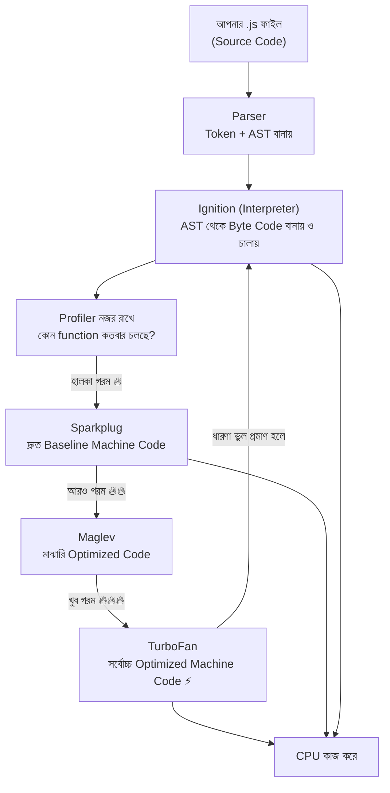

লক্ষ্য করুন — শেষে একটা তীর **TurboFan থেকে আবার Ignition-এ ফিরে গেছে**। এটাই **Deoptimization**, নিচে ব্যাখ্যা করছি।

### ধাপ ১: Parser → AST

```javascript
// Parser এই কোডটা পড়ে বুঝবে: একটা function ঘোষণা হচ্ছে, যার ভেতরে একটা return আছে
function greet(name) {
  return "হ্যালো " + name;
}
```

Parser দুইভাবে কাজ করতে পারে:

- **Eager Parsing (পূর্ণ পার্সিং)** — এখনই লাগবে এমন কোড পুরোপুরি পড়ে ফেলে।
- **Lazy Parsing (আলস্য পার্সিং)** — যে function এখনই ডাকা হচ্ছে না, তার ভেতরটা আপাতত **স্কিপ** করে যায়, শুধু দেখে নেয় যে গঠনটা ঠিক আছে। পরে যখন সত্যিই ডাকা হবে, তখন ভেতরটা পড়বে।

> **গল্পে:** কেরানি পুরো রেসিপির বইটা এক বসায় পড়ে না। আজকের মেনুতে যেগুলো আছে, শুধু সেগুলো মন দিয়ে পড়ে; বাকি পৃষ্ঠাগুলো উল্টে দেখে নেয় যে ছেঁড়া নেই — ব্যস। এতে শুরুর সময়টা অনেক বাঁচে।

### ধাপ ২: Ignition → Byte Code (Interpreter)

**Ignition** হলো V8-এর Interpreter। এটা AST থেকে **Byte Code** বানায় এবং সাথে সাথে চালাতে শুরু করে।

কেন সরাসরি Machine Code বানায় না? কারণ —

- সাথে সাথে শুরু করা যায় (দ্রুত Startup)।
- Byte Code, Machine Code-এর চেয়ে **অনেক কম মেমোরি** নেয়। মোবাইল ডিভাইসে এটা বিরাট ব্যাপার।
- যে কোড একবারই চলবে, তার জন্য দামি অনুবাদ করে লাভ নেই।

### ধাপ ৩: Profiler → Hot Function খোঁজা

```javascript
// এই function-টা লুপে ১০ লাখ বার চলবে — এটাই "Hot Function"
function square(n) {
  // n = যেই সংখ্যাটার বর্গ করতে চাই
  return n * n;
}

let sum = 0; // sum = সব বর্গের যোগফল জমা রাখার জন্য

// i = লুপের কাউন্টার, কতবার চললো তা গোনার জন্য
for (let i = 0; i < 1000000; i++) {
  sum += square(i); // প্রতিবার square() ডাকা হচ্ছে — Profiler এটা খেয়াল করে ফেলবে
}

console.log(sum);
```

Profiler দেখলো `square` লাখ লাখ বার চলছে, আর প্রতিবারই `n` একটা **Number** হিসেবে আসছে। তখন সে TurboFan-কে বলে: "এটাকে অনুবাদ করে ফেলো, আর ধরে নাও `n` সবসময় Number হবে।"

### ধাপ ৪: Sparkplug, Maglev, TurboFan — তিন স্তরের অনুবাদক

V8 এখন **Tiering** নীতিতে চলে — মানে কোড যত বেশি চলে, তত ভালো অনুবাদকের কাছে যায়:

| স্তর | নাম | অনুবাদের সময় | কোডের গতি |
|---|---|---|---|
| ০ | Ignition (Interpreter) | সবচেয়ে কম | ধীর |
| ১ | Sparkplug (Baseline Compiler) | কম | মোটামুটি |
| ২ | Maglev (Mid-tier Compiler) | মাঝারি | ভালো |
| ৩ | TurboFan (Optimizing Compiler) | বেশি | সবচেয়ে দ্রুত ⚡ |


### ধাপ ৫: Deoptimization — ধারণা ভুল হলে কী হয়

TurboFan যে দ্রুত কোড বানায়, সেটা কিছু **ধারণার (Assumption) উপর** দাঁড়িয়ে থাকে। ধারণা ভাঙলে সেই অনুবাদ বাতিল করে আবার দোভাষীর কাছে ফিরতে হয়।

```javascript
// ধরুন এই function-টা ১০ হাজার বার সংখ্যা দিয়ে ডাকা হলো
function add(a, b) {
  // a, b = যেই দুইটা মান যোগ হবে
  return a + b;
}

// প্রথম ১০,০০০ বার — সবসময় Number
for (let i = 0; i < 10000; i++) {
  add(i, i + 1); // TurboFan ধরে নিলো: "a আর b সবসময় Number"
}

// হঠাৎ একটা String পাঠালাম — ধারণাটা ভেঙে গেলো!
add("হ্যালো", "বিশ্ব");
// → V8 এখন Deoptimize করবে: optimized Machine Code বাতিল করে
//   আবার Ignition-এর Byte Code-এ ফিরে যাবে
```

> **গল্পে:** অনুবাদক কার্ডে লিখে দেয়ালে টাঙিয়ে দিয়েছিলেন — "পেঁয়াজ এলে ভাজো"। কিন্তু একদিন পেঁয়াজের বদলে বরফ চলে এলো! কার্ডটা এখন অচল। কার্ড নামিয়ে ফেলতে হলো, দোভাষীকে আবার ডাকতে হলো। এতেই সময় নষ্ট হয়।
>
> **শিক্ষা:** একই ভেরিয়েবল বা প্যারামিটারে বারবার **ডেটা টাইপ বদলাবেন না** — এটা কোডকে ধীর করে দেয়।

### ধাপ ৬: Hidden Class ও Inline Cache — V8-এর গোপন কৌশল

JavaScript-এ object-এ যেকোনো সময় নতুন property যোগ করা যায়, তাই V8-এর পক্ষে জানা কঠিন — কোন property মেমোরিতে ঠিক কোথায় আছে। এই সমস্যা সমাধানে V8 প্রতিটা object-এর জন্য গোপনে একটা **Hidden Class (Shape / Map)** বানায় — যেটা মূলত property গুলোর একটা **নকশা**।

```javascript
// নকশা ঠিক রাখা কোড ✅
// দুইটা object-ই একই ক্রমে একই property পেয়েছে → একই Hidden Class
const user1 = { name: "রফসান", age: 25 }; // name আগে, age পরে
const user2 = { name: "তানিশা", age: 22 }; // একই ক্রম → V8 খুশি ⚡

// নকশা ভাঙা কোড ❌
const user3 = { age: 30, name: "সুয়াইব" }; // ক্রম উল্টে গেলো → নতুন Hidden Class
const user4 = { name: "করিম" };
user4.age = 28; // পরে property যোগ করা হলো → আরেকটা নতুন Hidden Class
```

আর **Inline Cache** হলো — V8 মনে রাখে, "গতবার এই একই জায়গা থেকে `user.name` পড়েছিলাম, নকশাটা একই ছিল, তাই এবারও একই জায়গা থেকে সরাসরি পড়ে ফেলি।" এতে খোঁজার সময়টা বেঁচে যায়।

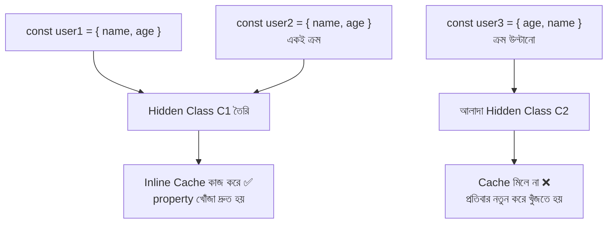

---

## ৮. Memory Management — Call Stack আর Memory Heap

Garbage Collection বোঝার আগে জানা দরকার — V8 মেমোরিটা কোথায় কীভাবে রাখে। V8 মেমোরিকে দুই ভাগে ভাগ করে।

### গল্পটা

- **Call Stack** = রান্নাঘরের **অর্ডার স্লিপের খোঁচা (spike)**। নতুন অর্ডার এলে উপরে গেঁথে দেওয়া হয়, শেষ হলে উপর থেকেই খোলা হয় — **শেষে এসে প্রথমে যায় (LIFO)**। এটা ছোট, দ্রুত, আর গোছানো।
- **Memory Heap** = রান্নাঘরের **বড় স্টোর রুম**। বড় বড় জিনিস (object, array, function) এখানে ছড়িয়ে-ছিটিয়ে রাখা হয়। জায়গা অনেক, কিন্তু গোছানো নয়।

### টেকনিক্যালি

| বিষয় | Call Stack | Memory Heap |
|---|---|---|
| কী রাখা হয় | Primitive value (number, string, boolean), function call-এর তথ্য | Object, Array, Function — সব Reference type |
| আকার | ছোট, নির্দিষ্ট | বড়, নমনীয় |
| গতি | খুব দ্রুত | তুলনামূলক ধীর |
| পরিষ্কার হয় | function শেষ হলে নিজে নিজেই | **Garbage Collector** এসে পরিষ্কার করে |

```javascript
// primitive value — সরাসরি Stack-এ বসে
const age = 25; // age = একটা সংখ্যা, তাই এটা Stack-এ থাকে

// object — আসল ডেটা Heap-এ থাকে, Stack-এ শুধু ঠিকানাটা (reference) থাকে
const user = { name: "রফসান", city: "ঢাকা" };
// user = Stack-এ থাকা একটা ঠিকানা, যেটা Heap-এর আসল object-টাকে দেখিয়ে দেয়
```

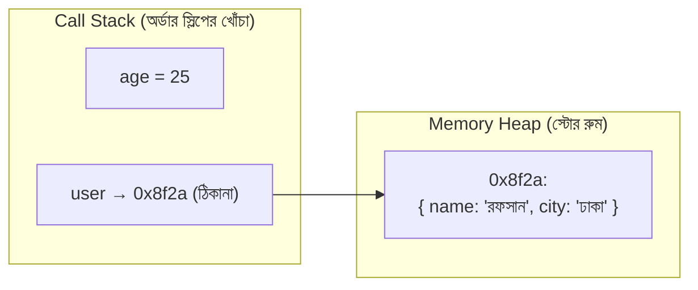

### Stack Overflow

Stack ছোট। একটা function যদি নিজেকে অসীমবার ডাকতে থাকে, খোঁচাটা ভরে উপচে পড়ে:

```javascript
// এই function নিজেকেই আবার ডাকছে, থামার কোনো শর্ত নেই
function callMe() {
  callMe(); // প্রতিবার Stack-এ নতুন একটা স্লিপ গাঁথা হচ্ছে
}
callMe(); // ❌ RangeError: Maximum call stack size exceeded
```

---

## ৯. Garbage Collection — রান্নাঘরের পরিচ্ছন্নতাকর্মী

### গল্পটা

সারাদিন রান্না হচ্ছে। এঁটো প্লেট, ব্যবহৃত বাটি, খালি প্যাকেট — স্টোর রুম আর টেবিল ভরে যাচ্ছে। কেউ যদি এগুলো সরিয়ে না ফেলে, একসময় **নতুন রান্নার জন্য জায়গাই থাকবে না**।

তাই রান্নাঘরে একজন **পরিচ্ছন্নতাকর্মী** আছেন। তিনি ঘুরে ঘুরে দেখেন — কোন জিনিসটা এখনো কেউ ব্যবহার করছে, আর কোনটা আর কারও কাজে লাগছে না। **যেটার সাথে আর কারও কোনো সম্পর্ক নেই, সেটাই ফেলে দেন।**

এই পরিচ্ছন্নতাকর্মীই **Garbage Collector (GC)**।

### কেন দরকার

C বা C++-এ প্রোগ্রামারকে **নিজে হাতে** মেমোরি নিতে (`malloc`) আর ছাড়তে (`free`) হয়। ভুলে গেলেই **Memory Leak**। JavaScript-এ এই কাজটা **স্বয়ংক্রিয়** — V8-এর GC নিজেই সামলায়। একে বলে **Automatic Memory Management**।

### GC কীভাবে বোঝে কোনটা "আবর্জনা"

মূল নিয়মটার নাম **Reachability (নাগাল পাওয়া যায় কিনা)**।

V8-এর হাতে কিছু **Root** থাকে — যেমন Global Object (`globalThis`), বর্তমানে চলতে থাকা function-গুলোর ভেরিয়েবল। GC এই Root থেকে শুরু করে সব reference ধরে ধরে হাঁটে। **যেসব object-এ পৌঁছানো যায়, সেগুলো জীবিত। যেগুলোতে পৌঁছানো যায় না, সেগুলোই আবর্জনা।**

```javascript
let user = { name: "রফসান" };
// এখন Heap-এর object-টায় "user" ভেরিয়েবল দিয়ে পৌঁছানো যায় → জীবিত ✅

user = null;
// "user" এখন আর object-টাকে দেখাচ্ছে না
// Heap-এর object-টায় পৌঁছানোর আর কোনো রাস্তা নেই → আবর্জনা ❌
// পরের GC সাইকেলে এটা মুছে যাবে
```

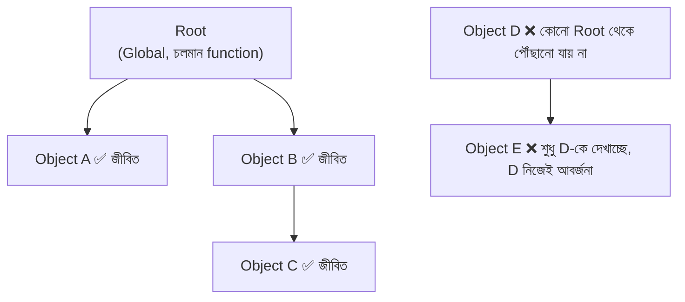

> **গুরুত্বপূর্ণ:** দুইটা object যদি শুধু **একে অপরকে** দেখায়, কিন্তু Root থেকে তাদের কারও কাছে পৌঁছানো না যায় — তাহলে দুইটাই আবর্জনা। এই কারণেই V8-এর GC পুরনো "Reference Counting" পদ্ধতির চেয়ে ভালো।

### Mark-Sweep-Compact — তিন ধাপের পরিষ্কার


**Compact** কেন দরকার? স্টোর রুমে এখানে-ওখানে ছোট ছোট ফাঁকা জায়গা পড়ে থাকলে বড় জিনিস রাখার জায়গা মেলে না। একে বলে **Fragmentation**। তাই জীবিত জিনিসগুলো এক পাশে সরিয়ে বড় একটা ফাঁকা জায়গা বানানো হয়।

### Generational GC — নতুন আর পুরনোদের আলাদা ভাগ

V8 একটা খুব বাস্তব পর্যবেক্ষণের উপর ভিত্তি করে কাজ করে, যাকে বলে **The Generational Hypothesis**:

> **"বেশিরভাগ object-ই খুব অল্প সময় বাঁচে।"**

গল্পে: রান্নাঘরে যে কাগজের ন্যাপকিন আর কাটা খোসা — এগুলো কয়েক মিনিটেই আবর্জনা হয়ে যায়। কিন্তু কড়াই, চুলা, মশলার কৌটা — এগুলো মাসের পর মাস টেকে। তাই পরিচ্ছন্নতাকর্মী **প্রতিবার পুরো রান্নাঘর ঘাঁটেন না** — তিনি বারবার শুধু **নতুন জিনিসের টেবিলটা** পরিষ্কার করেন, আর অনেকদিন পরপর একবার পুরো স্টোর রুমে হাত দেন।

তাই V8 Heap-কে দুই ভাগে ভাগ করে:

| এলাকা | কী থাকে | কে পরিষ্কার করে | কতবার চলে |
|---|---|---|---|
| **New Space (Young Generation)** | সদ্য তৈরি object | **Scavenger** (Minor GC) | খুব ঘন ঘন, খুব দ্রুত |
| **Old Space (Old Generation)** | যেসব object কয়েকবার GC-তে বেঁচে গেছে | **Mark-Sweep-Compact** (Major GC) | কম, তুলনামূলক ধীর |

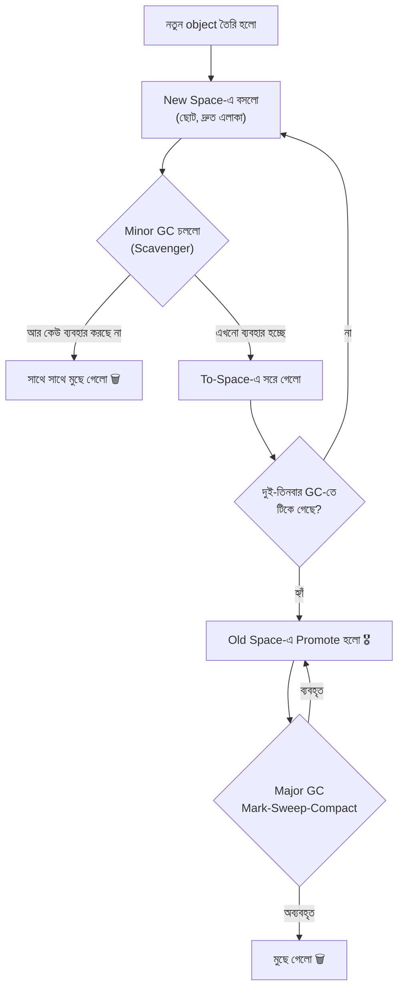

**Scavenger কীভাবে কাজ করে:** New Space আবার দুই ভাগে ভাগ — **From-Space** আর **To-Space**। নতুন object বসে From-Space-এ। GC এলে সে শুধু **জীবিত object গুলো তুলে To-Space-এ সাজিয়ে নেয়**, তারপর From-Space-টা পুরো মুছে ফেলে, আর দুইটার নাম অদল-বদল করে দেয়। যেহেতু জীবিত object সাধারণত খুব কম, এই কাজটা চোখের পলকে হয়ে যায়।

### Orinoco — GC যাতে রান্না থামিয়ে না দেয়

আগে GC চললে পুরো প্রোগ্রাম **থেমে যেতো** — একে বলে **Stop-The-World**। গল্পে: পরিচ্ছন্নতাকর্মী ঝাড়ু দেওয়ার সময় সব শেফকে দাঁড়িয়ে থাকতে বলতেন!

V8 এটা ঠিক করতে **Orinoco** নামে একটা প্রকল্প চালায়, যার তিনটা কৌশল:

- **Incremental** — একবারে পুরোটা না করে **অল্প অল্প করে** ভাগে ভাগে পরিষ্কার করা।
- **Concurrent** — মূল কাজের **পাশাপাশি** আলাদা Thread-এ পরিষ্কার করা।
- **Parallel** — একাধিক পরিচ্ছন্নতাকর্মী **একসাথে** ভাগ করে কাজ করা।

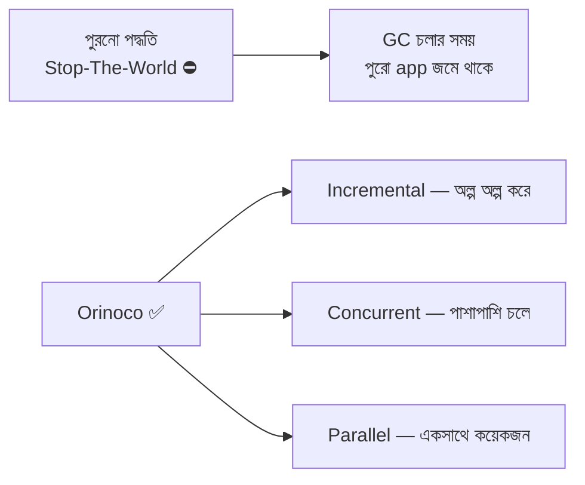

### সাধারণ Memory Leak — যেখানে GC-ও অসহায়

GC শুধু **অপ্রাপ্য (unreachable)** জিনিস মুছতে পারে। আপনি যদি ভুল করে কোনো reference ধরে রাখেন, GC সেটা "জীবিত" ভেবে রেখে দেবে।

```javascript
// ❌ Leak ১: Global ভেরিয়েবলে জমতেই থাকা
const allRequests = []; // allRequests = সব request জমা রাখার array (কখনো খালি করা হয় না!)

function handleRequest(req) {
  allRequests.push(req); // প্রতিটা request চিরকাল ধরে রাখা হচ্ছে → Heap ভরে যাবে
}

// ❌ Leak ২: Listener সরানো না হলে
const EventEmitter = require("events");
const bell = new EventEmitter(); // bell = আগের গল্পের সেই রান্নাঘরের ঘণ্টা

function attachListener() {
  bell.on("order", () => console.log("অর্ডার এলো"));
  // প্রতিবার এই function ডাকলে নতুন listener যোগ হচ্ছে, পুরনোগুলো সরছে না
}

// ✅ সমাধান: কাজ শেষে reference ছেড়ে দেওয়া
bell.removeAllListeners("order"); // আর দরকার না থাকলে listener সরিয়ে দিন
```

> **Node.js-এ Heap-এর সীমা দেখতে/বাড়াতে:**
> ```bash
> node --max-old-space-size=4096 app.js   # Old Space-এর সীমা 4GB করা
> ```

---

## ১০. Node.js-এর ভেতরে V8 কোথায় বসে আছে

এতক্ষণে একটা প্রশ্ন মনে আসা স্বাভাবিক — V8 যদি শুধু JavaScript চালাতেই জানে, তাহলে `fs.readFile()` কাজ করে কীভাবে?

উত্তর: **Node.js = V8 + libuv + C++ Bindings + Core Modules**

| অংশ | রান্নাঘরের ভাষায় | কাজ |
|---|---|---|
| **V8** | অনুবাদক টিম | JS কোড বুঝে চালায় |
| **libuv** | সহকারীদের দল | ফাইল, নেটওয়ার্ক, Event Loop, Thread Pool সামলায় |
| **C++ Bindings** | দুই দলের মধ্যে যোগাযোগের সেতু | JS থেকে C++ ফাংশন ডাকতে দেয় |
| **Core Modules** | সাজানো রেসিপির তাক | `fs`, `http`, `path`, `events` ইত্যাদি |

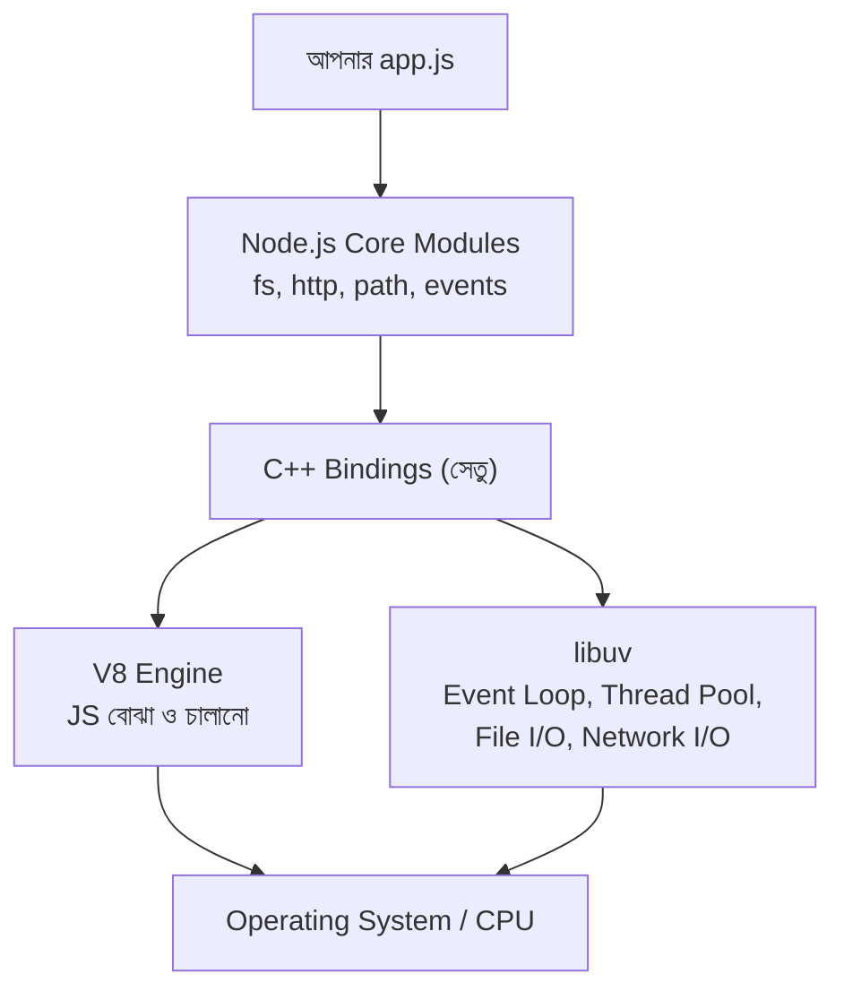

> **আগের গল্পের সাথে জোড়া:** `fs.readFile()` লেখা মাত্রই V8 কোডটা বুঝে নেয়, তারপর C++ Bindings-এর মাধ্যমে কাজটা **libuv-এর হাতে** তুলে দেয়। libuv ব্যাকগ্রাউন্ডে ফাইলটা পড়ে, শেষ হলে Event Loop-এর মাধ্যমে আপনার callback-টা আবার V8-এ ফেরত পাঠায়। এই কারণেই এটা **Non-blocking**।

---

## ১১. Simple Node.js Website — আর সেই কোডের পুরো যাত্রা

এবার সব জ্ঞান এক জায়গায় এনে একটা ছোট্ট Node.js ওয়েবসাইট বানাই, আর দেখি — এই কোডটা V8-এর ভেতরে কোন পথে যায়।

### কোড

```javascript
// server.js — একদম সাধারণ একটা Node.js ওয়েবসাইট

const http = require("http"); // http = বিল্ট-ইন module, সার্ভার বানানোর জন্য (রান্নাঘরের দরজা)

const PORT = 3000;            // PORT = সার্ভারটা কোন দরজায় (পোর্টে) কাস্টমারের অপেক্ষা করবে
const HOST = "localhost";     // HOST = কোন ঠিকানায় সার্ভারটা চলবে

// visitCount = কতজন ভিজিটর এলো তা গোনার জন্য
// এটা একটা Number, তাই V8 এটাকে Stack-এ রাখবে আর টাইপ স্থির থাকায় দ্রুত থাকবে
let visitCount = 0;

// pageTemplate = HTML বানানোর function
// name প্যারামিটার সবসময় String আসবে — টাইপ স্থির রাখলে TurboFan এটাকে optimize করতে পারে
function pageTemplate(name, count) {
  // name = ভিজিটরের নাম, count = মোট ভিজিট সংখ্যা
  return `
    <h1>স্বাগতম, ${name}!</h1>
    <p>আপনি এই পেজের ${count} নম্বর ভিজিটর।</p>
  `;
}

// server = আমাদের বানানো HTTP সার্ভার object (Heap-এ থাকবে)
const server = http.createServer((req, res) => {
  // req = কাস্টমারের পাঠানো অর্ডার (Request)
  // res = আমরা যেটা ফেরত পাঠাবো (Response)

  visitCount++; // প্রতিবার কেউ এলে গণনা এক বাড়ছে

  res.writeHead(200, { "Content-Type": "text/html; charset=utf-8" });
  // 200 = সব ঠিক আছে (OK)
  // charset=utf-8 = বাংলা লেখা ঠিকভাবে দেখানোর জন্য জরুরি

  res.end(pageTemplate("রফসান", visitCount)); // পেজটা পাঠিয়ে Response শেষ করা
});

// listen = সার্ভারটা চালু করে দরজা খুলে বসে থাকা
server.listen(PORT, HOST, () => {
  console.log(`✅ সার্ভার চলছে: http://${HOST}:${PORT}`);
});
```

চালানোর কমান্ড:

```bash
node server.js
```

### এই কোডটার V8-যাত্রা

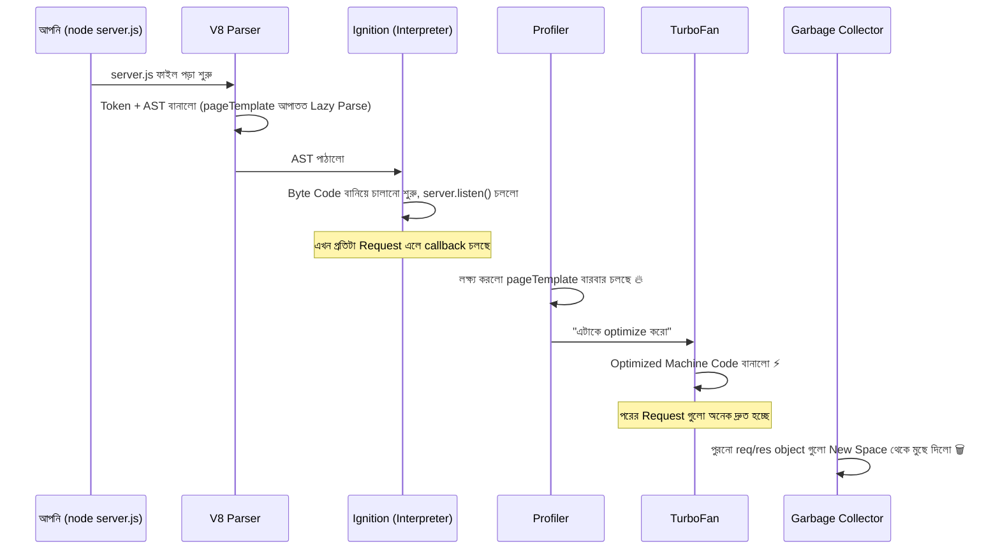

### কী কী মিলিয়ে দেখলাম

- প্রতিটা Request-এ নতুন `req` আর `res` object তৈরি হয় → এগুলো **New Space**-এ বসে → Request শেষ হলেই অপ্রাপ্য হয়ে যায় → **Scavenger** মুহূর্তেই সেগুলো মুছে দেয়।
- `server` object-টা পুরো সময় জীবিত থাকে → কয়েকবার GC-তে টিকে গিয়ে **Old Space**-এ promote হয়।
- `pageTemplate` হাজার হাজার বার চলে → **Hot Function** → TurboFan সেটাকে দ্রুত Machine Code বানিয়ে দেয়।
- `visitCount` সবসময় Number থাকে → কোনো Deoptimization হয় না → দ্রুত থাকে।

---

## ১২. দ্রুত কোড লেখার ব্যবহারিক নিয়ম (V8-Friendly Code)

এই পুরো ব্যাখ্যাটা শুধু তত্ত্ব নয় — এর সরাসরি কিছু ব্যবহারিক ফল আছে:

```javascript
// ✅ ১. ভেরিয়েবলের টাইপ স্থির রাখুন (Deoptimization এড়াতে)
let count = 0;        // সবসময় Number থাকবে
count = count + 1;    // ঠিক আছে
// count = "পাঁচ";    // ❌ এটা করলে optimize করা কোড বাতিল হয়ে যাবে

// ✅ ২. object-এর property একই ক্রমে দিন (একই Hidden Class পেতে)
const a = { id: 1, name: "রফসান" };
const b = { id: 2, name: "তানিশা" }; // একই ক্রম → একই Hidden Class ⚡

// ✅ ৩. Constructor বা object literal-এই সব property দিয়ে দিন
function User(id, name) {
  this.id = id;     // শুরুতেই ঠিক করা
  this.name = name; // পরে this.email = ... যোগ করলে নতুন Hidden Class হবে
}

// ✅ ৪. Array-তে একই ধরনের ডেটা রাখুন
const scores = [10, 20, 30];          // সব Number → V8 এটাকে দ্রুত ফরম্যাটে রাখে
// const mixed = [10, "বিশ", {a: 1}]; // ❌ মিশ্র টাইপ → ধীর

// ✅ ৫. আর দরকার না থাকলে reference ছেড়ে দিন (Memory Leak এড়াতে)
let bigData = { /* বিশাল ডেটা */ };
bigData = null; // এখন GC এটা মুছে ফেলতে পারবে
```

---

## ১৩. সারসংক্ষেপ ও Practice আইডিয়া

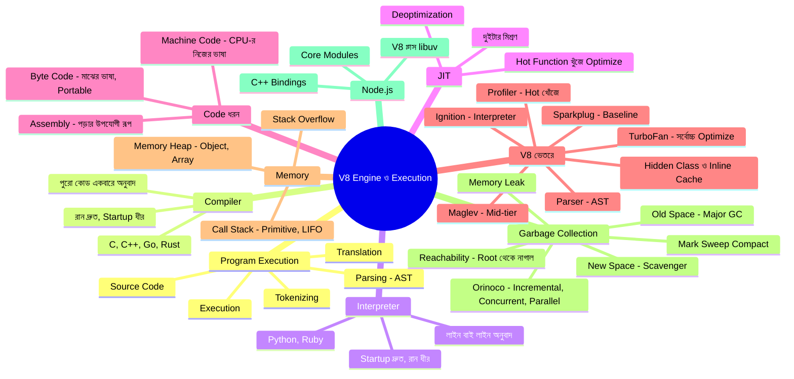

### Practice-এর জন্য আইডিয়া

1. **Bytecode দেখা** — একটা ছোট `add.js` ফাইল বানিয়ে `node --print-bytecode add.js` চালিয়ে দেখুন V8 আসলে কী Byte Code বানাচ্ছে।
2. **Deoptimization ধরা** — একটা function-কে ১০ হাজার বার Number দিয়ে ডেকে, তারপর String দিয়ে ডেকে `node --trace-deopt file.js` চালিয়ে দেখুন V8 কী বলে।
3. **Interpreter vs Compiler তুলনা** — একই লজিক (যেমন ১০ লাখ সংখ্যার যোগ) JavaScript আর C দিয়ে লিখে সময় মেপে দেখুন পার্থক্যটা।
4. **Memory মাপা** — `process.memoryUsage()` দিয়ে `heapUsed` আর `heapTotal` প্রিন্ট করুন, তারপর একটা বড় array বানিয়ে আবার প্রিন্ট করে পার্থক্য দেখুন।
5. **Leak বানানো ও ধরা** — ইচ্ছা করে একটা Global array-তে লুপে ডেটা জমিয়ে Heap বাড়তে দেখুন, তারপর reference মুছে দিয়ে দেখুন GC কমায় কিনা।
6. **Website Extend** — উপরের `server.js`-এ আগের গল্পের `fs` module জুড়ে দিন — প্রতিটা ভিজিট `visit-log.txt`-এ লিখুন, আর `events` দিয়ে লেখা শেষ হলে কনসোলে জানান।

### এক লাইনে মূল কথাগুলো

| শব্দ | এক লাইনে মানে |
|---|---|
| Compiler | পুরো কোড আগে অনুবাদ করে, তারপর চালায় |
| Interpreter | লাইন বাই লাইন অনুবাদ করে সাথে সাথেই চালায় |
| JIT | দুইটার মিশ্রণ — শুরুতে interpret, পরে hot অংশ compile |
| Byte Code | Engine-এর নিজের সংক্ষিপ্ত, Portable মাঝের ভাষা |
| Machine Code | শুধু CPU-র বোঝার 0/1 ভাষা |
| V8 | Google-এর বানানো JS Engine — Chrome আর Node.js চালায় |
| Ignition | V8-এর Interpreter, Byte Code বানায় ও চালায় |
| TurboFan | V8-এর সর্বোচ্চ Optimizing Compiler |
| Deoptimization | ধারণা ভুল হলে optimized কোড বাতিল করে ফিরে আসা |
| Garbage Collection | অপ্রাপ্য object মুছে মেমোরি ফাঁকা করা |
| Scavenger | New Space-এর দ্রুত, ঘন ঘন চলা Minor GC |

---
