# 🏭 কনভেয়ার বেল্টের গল্প: MongoDB Aggregation ও Join

> এই ডকুমেন্টটা আগের ফাইলগুলোর মতোই **গল্প আকারে** লেখা, যাতে concept গুলো মুখস্থ না হয়ে মাথায় গেঁথে যায়।
> আগের মডিউলগুলোতে আমরা MongoDB-র **গুদামঘরে** মাল রাখা (Insert), খুঁজে আনা (`find`), বদলানো (Update) আর ফেলে দেওয়া (Delete) শিখেছি। কিন্তু `find()` দিয়ে শুধু **একটা একটা বাক্স** তুলে আনা যায়।
> এই ফাইলে গুদামঘরের ভেতরে বসছে একটা পুরো **কনভেয়ার বেল্ট কারখানা — Aggregation Pipeline**। মাল বেল্টে ওঠে, একের পর এক স্টেশন পার হয় (বাছাই, ছাঁটাই, ভাগ, গোনা, জোড়া), আর শেষে বেরিয়ে আসে একটা **তৈরি রিপোর্ট**।
> আজকের গল্পের মূল প্রশ্ন: **ডেটা থেকে যোগফল, গড়, সর্বোচ্চ, সর্বনিম্ন, গ্রুপ-ভিত্তিক হিসাব আর একাধিক collection-এর Join কীভাবে বের করবো?**
> 📌 এই ফাইলের কোডগুলো `mongosh` (MongoDB Shell)-এ সরাসরি চালানো যাবে। শেষে **Mongoose** (Node.js) থেকে চালানোর অংশও আছে।

---

## 📚 সূচিপত্র (Table of Contents)

0. [ভূমিকা: `find()` কেন যথেষ্ট নয়? + গল্পের চরিত্র + নমুনা ডেটা](#ভূমিকা-find-কেন-যথেষ্ট-নয়)
1. [Aggregation — কনভেয়ার বেল্টের পরিচয়](#১-aggregation--কনভেয়ার-বেল্টের-পরিচয়)
2. [Limiting — "প্রথম কয়েকটা নাও"](#২-limiting--প্রথম-কয়েকটা-নাও)
3. [First and Last — প্রথম আর শেষ বাক্স](#৩-first-and-last--প্রথম-আর-শেষ-বাক্স)
4. [Match Condition — বাছাই স্টেশন](#৪-match-condition--বাছাই-স্টেশন)
5. [Like — নামের অংশ ধরে খোঁজা](#৫-like--নামের-অংশ-ধরে-খোঁজা)
6. [Projection — ছাঁটাই ও লেবেল স্টেশন](#৬-projection--ছাঁটাই-ও-লেবেল-স্টেশন)
7. [Skip and Limit — পাতা উল্টানো (Pagination)](#৭-skip-and-limit--পাতা-উল্টানো-pagination)
8. [Group By — ঝুড়িতে ভাগ করা](#৮-group-by--ঝুড়িতে-ভাগ-করা)
9. [Group By SUM — ঝুড়ির যোগফল](#৯-group-by-sum--ঝুড়ির-যোগফল)
10. [Group By AVG — ঝুড়ির গড়](#১০-group-by-avg--ঝুড়ির-গড়)
11. [Max Min — সবচেয়ে বড় আর ছোট](#১১-max-min--সবচেয়ে-বড়-আর-ছোট)
12. [Without Group By — Sum, Avg, Max, Min](#১২-without-group-by--sum-avg-max-min)
13. [Group By Multiple — একাধিক চাবিতে ভাগ](#১৩-group-by-multiple--একাধিক-চাবিতে-ভাগ)
14. [Join By Lookup — পাশের গুদামের তথ্য জোড়া](#১৪-join-by-lookup--পাশের-গুদামের-তথ্য-জোড়া)
15. [Facet — তিন-মুখো কনভেয়ার বেল্ট](#১৫-facet--তিন-মুখো-কনভেয়ার-বেল্ট)
16. [Projection After Join — জোড়ার পর ছাঁটাই](#১৬-projection-after-join--জোড়ার-পর-ছাঁটাই)
17. [Add New Field With Result — নতুন স্টিকার লাগানো](#১৭-add-new-field-with-result--নতুন-স্টিকার-লাগানো)
18. [Arithmetic Aggregation Operators — হিসাবের যন্ত্র](#১৮-arithmetic-aggregation-operators--হিসাবের-যন্ত্র)
19. [String Aggregation Operators — লেখা কাটাছেঁড়ার যন্ত্র](#১৯-string-aggregation-operators--লেখা-কাটাছেঁড়ার-যন্ত্র)
20. [Date Aggregation Operators — ক্যালেন্ডার যন্ত্র](#২০-date-aggregation-operators--ক্যালেন্ডার-যন্ত্র)
21. [Comparison Aggregation Operators — তুলনার দাঁড়িপাল্লা](#২১-comparison-aggregation-operators--তুলনার-দাঁড়িপাল্লা)
22. [Boolean Aggregation Operators — হ্যাঁ/না-র সুইচ](#২২-boolean-aggregation-operators--হ্যাঁনা-র-সুইচ)
23. [Conditional Aggregation Operators — "যদি... তাহলে..." স্টেশন](#২৩-conditional-aggregation-operators--যদি-তাহলে-স্টেশন)
24. [বোনাস: আরও যা যা আছে — Unwind, Sort, Bucket, Window ইত্যাদি](#২৪-বোনাস-আরও-যা-যা-আছে--unwind-sort-bucket-window-ইত্যাদি)
25. [Mongoose দিয়ে Node.js থেকে চালানো](#২৫-mongoose-দিয়ে-nodejs-থেকে-চালানো)
26. [Performance টিপস, সাধারণ ভুল আর সমাধান](#২৬-performance-টিপস-সাধারণ-ভুল-আর-সমাধান)
27. [সারসংক্ষেপ ও Practice আইডিয়া](#২৭-সারসংক্ষেপ-ও-practice-আইডিয়া)

---

## ভূমিকা: `find()` কেন যথেষ্ট নয়?

কল্পনা করুন, আপনি **"মেঘনা মেগা-স্টোর"**-এর ম্যানেজার। গুদামে হাজার হাজার বাক্স (Document) তাকে (Collection) সাজানো। এতদিন আপনি `find()` দিয়ে বাক্স খুলে খুলে দেখতেন। কিন্তু মালিক এসে এমন প্রশ্ন করলেন:

- "গত মাসে **কোন payment method** দিয়ে কত টাকা বিক্রি হলো?"
- "**কোন ক্যাটাগরির** পণ্যের গড় দাম কত?"
- "**কোন কাস্টমার** সবচেয়ে বেশি কিনেছে — আর তার নামটা কী? (নাম তো অন্য তাকে আছে!)"
- "সবচেয়ে বেশি বেতন পাচ্ছে কে, প্রতিটা বিভাগে?"

`find()` দিয়ে এগুলো করতে গেলে সব ডেটা Node.js-এ এনে `for` লুপে হিসাব করতে হতো — ধীর, মেমরি-খেকো, কষ্টের। তাই MongoDB-র ভেতরেই বসানো হলো একটা **কনভেয়ার বেল্ট কারখানা** — **Aggregation Pipeline**।

### 🎭 গল্পের চরিত্র (পুরো ফাইলে এগুলোই ঘুরবে)

| গল্পে | টেকনিক্যাল নাম |
|---|---|
| গুদামঘর | Database |
| গুদামের তাক | Collection (`products`, `orders`...) |
| তাকের একেকটা বাক্স | Document |
| কনভেয়ার বেল্ট কারখানা | Aggregation Pipeline (`db.collection.aggregate([...])`) |
| বেল্টের একেকটা স্টেশন | Stage (`$match`, `$group`...) |
| স্টেশনের ভেতরের যন্ত্র | Operator / Expression (`$sum`, `$add`...) |
| তৈরি রিপোর্ট | Aggregation Result |

### 🔁 SQL জানা থাকলে এক নজরে মিলিয়ে নিন

| SQL | MongoDB Aggregation | গল্পে |
|---|---|---|
| `WHERE` | `$match` | বাছাই স্টেশন |
| `SELECT col AS x` | `$project` | ছাঁটাই ও লেবেল স্টেশন |
| `GROUP BY` | `$group` | ঝুড়িতে ভাগ করার স্টেশন |
| `HAVING` | `$group`-এর **পরে** `$match` | ঝুড়ি ভাগের পরে আবার বাছাই |
| `ORDER BY` | `$sort` | সাজানোর স্টেশন |
| `LIMIT` | `$limit` | "প্রথম N টা নাও" |
| `OFFSET` | `$skip` | "প্রথম N টা ছেড়ে দাও" |
| `JOIN` (LEFT) | `$lookup` | পাশের গুদামে গিয়ে তথ্য এনে জোড়া |
| `COUNT(*)` | `{ $sum: 1 }` বা `$count` | প্রতি বাক্সে ১ করে গোনা |
| `LIKE '%abc%'` | `$regex` | নামের অংশ ধরে খোঁজা |
| `CASE WHEN` | `$cond` / `$switch` | "যদি... তাহলে..." স্টেশন |

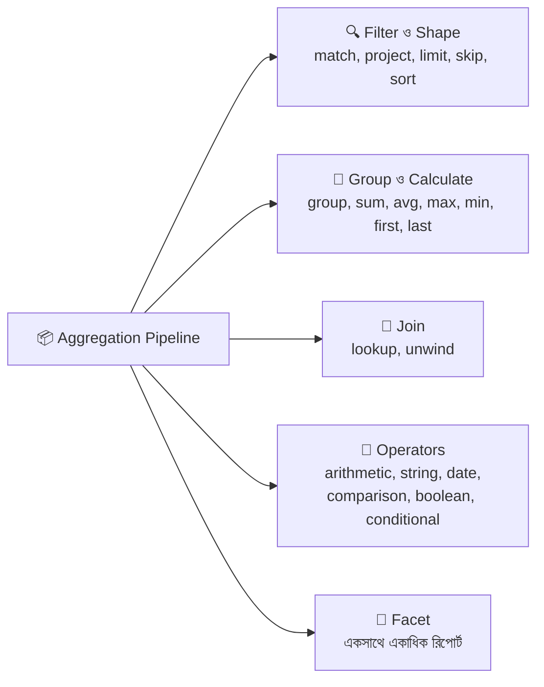

---

### 🗃️ নমুনা ডেটা (Seed Data) — আগে এটা বসিয়ে নিন

গল্পের সব উদাহরণ এই ৪টা তাকের ডেটার উপর চলবে। `mongosh`-এ গিয়ে একবার চালিয়ে নিন:

```javascript
use meghna_store;
// use = ডাটাবেস বেছে নেওয়া (না থাকলে প্রথম insert-এর সময় নিজে তৈরি হবে)
// meghna_store = আমাদের গল্পের স্টোরের ডাটাবেসের নাম

// ---------- ১) products তাক: পণ্যের তালিকা ----------
db.products.insertMany([
  // _id = প্রতিটা বাক্সের ইউনিক পরিচয়। এখানে সহজ রাখতে সংখ্যা দিচ্ছি (আসল প্রজেক্টে সাধারণত ObjectId থাকে)
  // name = পণ্যের নাম, category = ধরন (গ্রুপ করার জন্য কাজে লাগবে)
  // brand = ব্র্যান্ড, price = দাম (টাকায়), stock = গুদামে কয়টা আছে
  // rating = ক্রেতার রেটিং, tags = লেবেলের তালিকা (Array), createdAt = কবে তালিকায় যোগ হয়েছে (Date)
  { _id: 1, name: "Miniket Rice 5kg",     category: "Grocery",     brand: "Teer",   price: 480,  stock: 120, rating: 4.5, tags: ["rice", "staple"],        createdAt: ISODate("2025-01-10T08:00:00Z") },
  { _id: 2, name: "Soybean Oil 2L",       category: "Grocery",     brand: "Teer",   price: 360,  stock: 80,  rating: 4.2, tags: ["oil", "staple"],         createdAt: ISODate("2025-02-05T09:30:00Z") },
  { _id: 3, name: "Mango Juice 1L",       category: "Beverage",    brand: "Pran",   price: 120,  stock: 200, rating: 4.0, tags: ["juice", "cold"],         createdAt: ISODate("2025-03-18T10:15:00Z") },
  { _id: 4, name: "Orange Drink 500ml",   category: "Beverage",    brand: "Pran",   price: 60,   stock: 0,   rating: 3.8, tags: ["drink", "cold"],         createdAt: ISODate("2025-04-02T11:00:00Z") },
  { _id: 5, name: "Bluetooth Speaker",    category: "Electronics", brand: "Xiaomi", price: 2500, stock: 15,  rating: 4.6, tags: ["audio", "wireless"],     createdAt: ISODate("2025-05-20T12:00:00Z") },
  { _id: 6, name: "Power Bank 10000mAh",  category: "Electronics", brand: "Xiaomi", price: 1800, stock: 30,  rating: 4.4, tags: ["charger", "portable"],   createdAt: ISODate("2025-06-11T13:20:00Z") },
  { _id: 7, name: "Cotton Panjabi",       category: "Fashion",     brand: "Aarong", price: 1500, stock: 40,  rating: 4.7, tags: ["cotton", "eid"],         createdAt: ISODate("2025-07-01T07:45:00Z") },
  { _id: 8, name: "Rice Cooker",          category: "Electronics", brand: "Walton", price: 3200, stock: 10,  rating: 4.1, tags: ["kitchen", "rice"],       createdAt: ISODate("2025-07-25T15:10:00Z") }
]);

// ---------- ২) customers তাক: কাস্টমারদের খাতা ----------
db.customers.insertMany([
  // city = শহর (গ্রুপ করার জন্য), email = ইমেইল, joinedAt = কবে সদস্য হয়েছে
  { _id: 101, name: "Karim Uddin",  city: "Dhaka",      email: "karim@example.com",  joinedAt: ISODate("2024-11-05T00:00:00Z") },
  { _id: 102, name: "Salma Akter",  city: "Chattogram", email: "salma@example.com",  joinedAt: ISODate("2024-12-12T00:00:00Z") },
  { _id: 103, name: "Rafiq Hasan",  city: "Dhaka",      email: "rafiq@example.com",  joinedAt: ISODate("2025-01-20T00:00:00Z") },
  { _id: 104, name: "Nusrat Jahan", city: "Sylhet",     email: "nusrat@example.com", joinedAt: ISODate("2025-02-14T00:00:00Z") },
  { _id: 105, name: "Tanvir Ahmed", city: "Dhaka",      email: "tanvir@example.com", joinedAt: ISODate("2025-03-03T00:00:00Z") } // ইচ্ছে করেই এর কোনো অর্ডার নেই (Join-এ কাজে লাগবে)
]);

// ---------- ৩) orders তাক: বিক্রির রসিদ ----------
db.orders.insertMany([
  // customerId = কোন কাস্টমার কিনেছে (customers._id-এর সাথে মিলবে)  ← Join-এর চাবি #১
  // productId  = কোন পণ্য কিনেছে (products._id-এর সাথে মিলবে)      ← Join-এর চাবি #২
  // qty = কয়টা কিনেছে, unitPrice = কেনার সময়ের দাম (পরে দাম বদলালেও পুরোনো রসিদ ঠিক থাকে)
  // status = অর্ডারের অবস্থা, payment = পেমেন্টের মাধ্যম, orderDate = অর্ডারের তারিখ
  { _id: 1001, customerId: 101, productId: 1, qty: 2,  unitPrice: 480,  status: "delivered", payment: "cash",  orderDate: ISODate("2025-08-01T10:00:00Z") },
  { _id: 1002, customerId: 102, productId: 3, qty: 6,  unitPrice: 120,  status: "delivered", payment: "bKash", orderDate: ISODate("2025-08-03T11:30:00Z") },
  { _id: 1003, customerId: 101, productId: 5, qty: 1,  unitPrice: 2500, status: "delivered", payment: "card",  orderDate: ISODate("2025-08-10T09:15:00Z") },
  { _id: 1004, customerId: 103, productId: 2, qty: 3,  unitPrice: 360,  status: "pending",   payment: "cash",  orderDate: ISODate("2025-08-12T14:00:00Z") },
  { _id: 1005, customerId: 104, productId: 7, qty: 2,  unitPrice: 1500, status: "delivered", payment: "bKash", orderDate: ISODate("2025-09-01T16:20:00Z") },
  { _id: 1006, customerId: 102, productId: 6, qty: 1,  unitPrice: 1800, status: "cancelled", payment: "card",  orderDate: ISODate("2025-09-05T12:00:00Z") },
  { _id: 1007, customerId: 103, productId: 1, qty: 1,  unitPrice: 480,  status: "delivered", payment: "cash",  orderDate: ISODate("2025-09-14T10:40:00Z") },
  { _id: 1008, customerId: 101, productId: 3, qty: 12, unitPrice: 120,  status: "delivered", payment: "bKash", orderDate: ISODate("2025-09-20T18:00:00Z") },
  { _id: 1009, customerId: 104, productId: 8, qty: 1,  unitPrice: 3200, status: "pending",   payment: "card",  orderDate: ISODate("2025-10-02T13:30:00Z") },
  { _id: 1010, customerId: 103, productId: 5, qty: 2,  unitPrice: 2500, status: "delivered", payment: "bKash", orderDate: ISODate("2025-10-15T11:10:00Z") }
]);

// ---------- ৪) employees তাক: স্টোরের কর্মী ----------
db.employees.insertMany([
  // department = বিভাগ, designation = পদবি, salary = মূল বেতন, bonus = বোনাস
  // gender = লিঙ্গ, isActive = এখনো চাকরিতে আছে কি না (Boolean), joinDate = যোগদানের তারিখ
  // scores = তিন কোয়ার্টারের পারফরম্যান্স স্কোর (Array)
  { _id: 1, name: "Anika",   department: "Sales",   designation: "Executive", salary: 30000, bonus: 3000,  gender: "F", isActive: true,  joinDate: ISODate("2022-03-01T00:00:00Z"), scores: [80, 90, 70] },
  { _id: 2, name: "Babul",   department: "Sales",   designation: "Manager",   salary: 55000, bonus: 8000,  gender: "M", isActive: true,  joinDate: ISODate("2020-01-15T00:00:00Z"), scores: [88, 92, 95] },
  { _id: 3, name: "Chitra",  department: "Support", designation: "Executive", salary: 28000,                gender: "F", isActive: true,  joinDate: ISODate("2023-07-10T00:00:00Z"), scores: [78, 82, 75] }, // ইচ্ছে করে bonus ফিল্ড নেই!
  { _id: 4, name: "Dipu",    department: "Support", designation: "Lead",      salary: 42000, bonus: 5000,  gender: "M", isActive: true,  joinDate: ISODate("2021-06-10T00:00:00Z"), scores: [75, 80, 85] },
  { _id: 5, name: "Eshita",  department: "IT",      designation: "Developer", salary: 60000, bonus: 7000,  gender: "F", isActive: true,  joinDate: ISODate("2023-02-20T00:00:00Z"), scores: [95, 98, 90] },
  { _id: 6, name: "Faisal",  department: "IT",      designation: "Developer", salary: 52000, bonus: 4000,  gender: "M", isActive: false, joinDate: ISODate("2019-09-09T00:00:00Z"), scores: [70, 65, 80] },
  { _id: 7, name: "Gita",    department: "IT",      designation: "Manager",   salary: 90000, bonus: 12000, gender: "F", isActive: true,  joinDate: ISODate("2018-05-05T00:00:00Z"), scores: [92, 89, 97] },
  { _id: 8, name: "Hasib",   department: "Sales",   designation: "Executive", salary: 32000, bonus: 2500,  gender: "M", isActive: true,  joinDate: ISODate("2024-01-10T00:00:00Z"), scores: [60, 72, 68] }
]);
```

আমাদের তাকগুলোর সম্পর্ক (পরে Join-এ এই ছবিটা মনে রাখবেন):

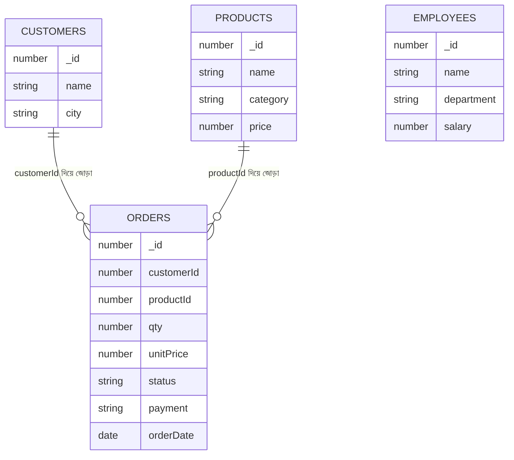

> 💡 **মনে রাখুন:** `employees` তাকটা কারও সাথে জোড়া নয়। এটা দিয়ে আমরা Group, Arithmetic, Conditional এসবের খেলা খেলবো।

---

## ১. Aggregation — কনভেয়ার বেল্টের পরিচয়

### গল্প

মালিক জানতে চাইলেন: **"প্রতিটা payment method দিয়ে কয়টা অর্ডার হয়েছে?"**

`find()` শুধু বাক্স তুলে আনতে পারে। কিন্তু আপনি বাক্সগুলো **একটা বেল্টে চাপিয়ে** বিভিন্ন স্টেশনে পাঠাতে পারেন। প্রতিটা স্টেশন আগের স্টেশনের **আউটপুটকে নিজের ইনপুট** হিসেবে নেয়, নিজের কাজ করে, আর পরের স্টেশনে পাঠায়।

```
বাক্স-ভর্তি তাক  →  [স্টেশন ১]  →  [স্টেশন ২]  →  [স্টেশন ৩]  →  তৈরি রিপোর্ট
   (Collection)       $match         $group          $sort           (Result)
```

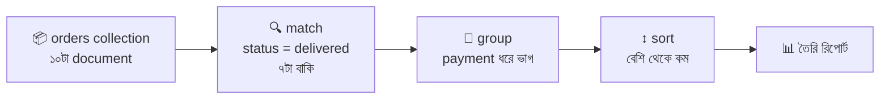

### সিনট্যাক্স

```javascript
db.collectionName.aggregate([   // aggregate() = কনভেয়ার বেল্ট চালু করার ফাংশন
  { $stage1: { ... } },         // [ ] এর ভেতরের Array = বেল্টের স্টেশনের ক্রম (উপর থেকে নিচে চলে)
  { $stage2: { ... } },         // প্রতিটা স্টেশন একটা Object, যার key টা ($ দিয়ে শুরু) স্টেশনের নাম
  { $stage3: { ... } }
]);
```

### প্রথম পাইপলাইন

```javascript
db.orders.aggregate([
  // স্টেশন ১: $match = বাছাই। শুধু যাদের status "delivered" তারাই পরের স্টেশনে যাবে
  { $match: { status: "delivered" } },

  // স্টেশন ২: $group = ঝুড়িতে ভাগ
  {
    $group: {
      _id: "$payment",        // _id = ঝুড়ির চাবি। "$payment" মানে প্রতিটা বাক্সের payment ফিল্ডের মান (cash/bKash/card)। একই মান = একই ঝুড়ি
      totalOrders: { $sum: 1 } // totalOrders = আমাদের দেওয়া নতুন নাম। $sum: 1 মানে ঝুড়িতে প্রতিটা বাক্সের জন্য ১ করে যোগ = গণনা
    }
  },

  // স্টেশন ৩: $sort = সাজানো। -1 = বড় থেকে ছোট (descending), 1 = ছোট থেকে বড় (ascending)
  { $sort: { totalOrders: -1 } }
]);
```

আউটপুট:

```javascript
[
  { _id: "bKash", totalOrders: 4 },
  { _id: "cash",  totalOrders: 2 },
  { _id: "card",  totalOrders: 1 }
]
```

### 🔑 তিনটা সোনালি নিয়ম

| নিয়ম | মানে |
|---|---|
| **১. ক্রম গুরুত্বপূর্ণ** | স্টেশনগুলো উপর থেকে নিচে চলে। আগের স্টেশনের আউটপুটই পরেরটার ইনপুট |
| **২. `$` এর দুই রূপ** | `$match`, `$group` (স্টেশনের নাম/Stage) আর `"$payment"` (ফিল্ডের মান পড়া — **Field Path**) — দুটো আলাদা জিনিস |
| **৩. মূল collection বদলায় না** | Aggregation শুধু পড়ে (read)। `$out` / `$merge` ছাড়া আসল ডেটা অক্ষত থাকে |

### Pipeline-এর প্রধান স্টেশনগুলোর তালিকা (পুরো ফাইলে এগুলোই আসবে)

| Stage | কাজ | গল্পে |
|---|---|---|
| `$match` | শর্ত মেলানো | বাছাই |
| `$project` | ফিল্ড বাছা/বাদ/বদল | ছাঁটাই ও লেবেল |
| `$addFields` / `$set` | নতুন ফিল্ড যোগ | স্টিকার লাগানো |
| `$group` | গ্রুপ করে হিসাব | ঝুড়িতে ভাগ |
| `$sort` | সাজানো | লাইনে দাঁড় করানো |
| `$limit` / `$skip` | কত নেব / কত ছাড়বো | গুনে নেওয়া / ছেড়ে দেওয়া |
| `$lookup` | অন্য collection-এর সাথে Join | পাশের গুদামে তথ্য আনা |
| `$unwind` | Array ভেঙে আলাদা document | প্যাকেট খুলে জিনিস আলাদা করা |
| `$facet` | একই ইনপুটে একাধিক pipeline | তিন-মুখো বেল্ট |
| `$count` | মোট কয়টা | গোনার মিটার |

### সোজা কাজে `find` আর জটিল কাজে `aggregate`

| কাজ | কী ব্যবহার করবেন |
|---|---|
| শর্ত মেলানো, কয়েকটা ফিল্ড দেখা | `find()` যথেষ্ট |
| গ্রুপ, যোগ-গড়, Join, নতুন ফিল্ড বানানো, রিপোর্ট | `aggregate()` |

> `find({ status: "delivered" })` আর `aggregate([{ $match: { status: "delivered" } }])` — ফলাফল একই। কিন্তু `aggregate`-এ এর পরে আরও স্টেশন জুড়ে দেওয়া যায়।

### `$count` — সবচেয়ে ছোট স্টেশন

```javascript
db.orders.aggregate([
  { $match: { status: "pending" } },   // শুধু pending অর্ডার বাছাই
  { $count: "pendingOrders" }          // $count = ঢোকা বাক্স গুনে এক বাক্সের রিপোর্ট বানায়। "pendingOrders" = ওই রিপোর্টের ফিল্ডের নাম
]);
// আউটপুট: [ { pendingOrders: 2 } ]
```

---

## ২. Limiting — "প্রথম কয়েকটা নাও"

### গল্প

মালিক বললেন: **"সবচেয়ে দামি ৩টা পণ্য দেখাও।"** বেল্টে সব মাল আছে। আপনি দাম অনুযায়ী লাইনে দাঁড় করালেন, তারপর বেল্টের শেষে একজন দাঁড়িয়ে বললো — **"শুধু প্রথম ৩টা ছাড়ো, বাকিগুলো সরাও!"** ওই লোকটাই `$limit`।

```javascript
db.products.aggregate([
  { $sort: { price: -1 } },  // আগে দাম অনুযায়ী বড় → ছোট সাজানো। (সাজানো ছাড়া limit দিলে "প্রথম ৩টা" কোনটা সেটা অনির্দিষ্ট!)
  { $limit: 3 },             // $limit: 3 = শুধু প্রথম ৩টা document পরের স্টেশনে যাবে, বাকিরা বাদ
  { $project: { _id: 0, name: 1, price: 1 } } // শুধু নাম আর দাম দেখাবো, _id বাদ
]);
```

আউটপুট:

```javascript
[
  { name: "Rice Cooker",       price: 3200 },
  { name: "Bluetooth Speaker", price: 2500 },
  { name: "Power Bank 10000mAh", price: 1800 }
]
```

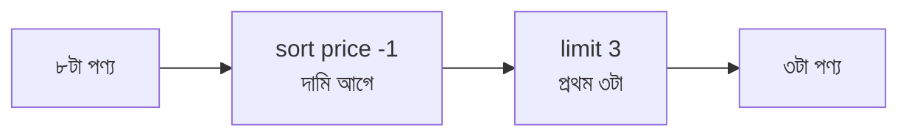

> ⚠️ **ফাঁদ:** `$limit` কে `$sort`-এর **আগে** বসালে প্রথমে যেকোনো ৩টা কেটে নিয়ে তারপর সাজাবে — অর্থাৎ ভুল উত্তর! সবসময় `$sort → $limit`।

> 💡 `$limit`-এ সংখ্যা অবশ্যই ধনাত্মক পূর্ণসংখ্যা (> 0) হতে হবে।

---

## ৩. First and Last — প্রথম আর শেষ বাক্স

### গল্প

মালিক জানতে চাইলেন: **"প্রতিটা কাস্টমার আমাদের কাছ থেকে প্রথমবার কবে কিনেছিল আর সর্বশেষ কবে?"**

প্রতিটা কাস্টমারের ঝুড়িতে বাক্সগুলো ঢুকছে। ঝুড়ির **প্রথম বাক্স** আর **শেষ বাক্স** চাইলে `$first` আর `$last`।

> 🚨 **সবচেয়ে বড় সতর্কতা:** "প্রথম" আর "শেষ" মানে **বেল্টে যে ক্রমে বাক্স এসেছে সেই ক্রম**। তাই `$first`/`$last` ঠিকমতো কাজ করাতে হলে **`$group`-এর আগে `$sort`** লাগবেই। নাহলে ক্রম অনির্ধারিত।

### (ক) Group-এর ভেতরে `$first` ও `$last`

```javascript
db.orders.aggregate([
  { $sort: { orderDate: 1 } },       // আগে তারিখ অনুযায়ী পুরোনো → নতুন সাজাচ্ছি, যাতে "প্রথম" মানে সবচেয়ে পুরোনো আর "শেষ" মানে সবচেয়ে নতুন হয়
  {
    $group: {
      _id: "$customerId",            // কাস্টমার ধরে ঝুড়ি (একেক কাস্টমার = একেক ঝুড়ি)
      firstOrderDate: { $first: "$orderDate" },  // firstOrderDate = ঝুড়ির প্রথম বাক্সের orderDate (সবচেয়ে পুরোনো অর্ডার)
      lastOrderDate:  { $last:  "$orderDate" },  // lastOrderDate  = ঝুড়ির শেষ বাক্সের orderDate (সবচেয়ে নতুন অর্ডার)
      firstOrderId:   { $first: "$_id" },        // firstOrderId   = প্রথম অর্ডারের আইডি
      lastOrderId:    { $last:  "$_id" }         // lastOrderId    = শেষ অর্ডারের আইডি
    }
  },
  { $sort: { _id: 1 } }              // রিপোর্টটা কাস্টমার আইডি অনুযায়ী সাজালাম, পড়তে সুবিধা
]);
```

আউটপুটের একটা অংশ:

```javascript
{ _id: 101, firstOrderDate: ISODate("2025-08-01T10:00:00Z"), lastOrderDate: ISODate("2025-09-20T18:00:00Z"), firstOrderId: 1001, lastOrderId: 1008 }
```

### (খ) পুরো collection-এর প্রথম বা শেষ document

```javascript
// সবচেয়ে পুরোনো অর্ডার (প্রথম অর্ডার)
db.orders.aggregate([
  { $sort: { orderDate: 1 } },   // পুরোনো আগে
  { $limit: 1 }                  // শুধু ১টা = সবচেয়ে পুরোনো
]);

// সবচেয়ে নতুন অর্ডার (শেষ অর্ডার)
db.orders.aggregate([
  { $sort: { orderDate: -1 } },  // নতুন আগে
  { $limit: 1 }                  // শুধু ১টা = সবচেয়ে নতুন
]);
```

### (গ) Array-র প্রথম ও শেষ উপাদান (`$first` / `$last` Array Operator)

> MongoDB **4.4+**-এ `$first` আর `$last` Array-র উপরেও চলে। (Group accumulator আর Array operator — একই নাম, আলাদা কাজ।)

```javascript
db.products.aggregate([
  {
    $project: {
      _id: 0,
      name: 1,                          // নামটা দেখানোর জন্য রাখলাম
      firstTag: { $first: "$tags" },    // firstTag = tags Array-র প্রথম উপাদান (যেমন "rice")
      lastTag:  { $last:  "$tags" }     // lastTag  = tags Array-র শেষ উপাদান (যেমন "staple")
    }
  }
]);
```

### (ঘ) নতুন ভার্সনের সহজ উপায়: `$top` ও `$bottom` (MongoDB 5.2+)

```javascript
db.orders.aggregate([
  {
    $group: {
      _id: "$customerId",
      biggestOrder: {
        $top: {                          // $top = sortBy অনুযায়ী সবার উপরে যে আছে তাকে বাছে (আলাদা $sort স্টেশন লাগে না)
          sortBy: { qty: -1 },           // sortBy = কোন ফিল্ড ধরে সাজিয়ে "উপরের জন" বাছবো (qty বেশি যার)
          output: ["$_id", "$qty"]       // output = বাছা বাক্স থেকে কোন কোন মান রিপোর্টে আসবে
        }
      }
    }
  }
]);
```

| চাই | উপায় |
|---|---|
| গ্রুপের প্রথম/শেষ | `$sort` + `$group` + `$first` / `$last` |
| গ্রুপের সবার উপরের / নিচের (৫.২+) | `$top` / `$bottom` (এবং একাধিক চাইলে `$topN` / `$bottomN`) |
| পুরো collection-এর প্রথম/শেষ | `$sort` + `$limit: 1` |
| Array-র প্রথম/শেষ | `$first` / `$last` (Array operator, ৪.৪+) অথবা `$arrayElemAt: ["$arr", 0]` / `[..., -1]` |

---

## ৪. Match Condition — বাছাই স্টেশন

### গল্প

বেল্টের শুরুতেই একজন বাছাইকারী বসে আছে। তার হাতে শর্তের তালিকা: **"যে বাক্স এই শর্ত মেলাবে সে যাবে, বাকিরা বাদ।"** এই স্টেশনের নাম `$match`। এর ভাষা ঠিক `find()`-এর filter-এর মতোই।

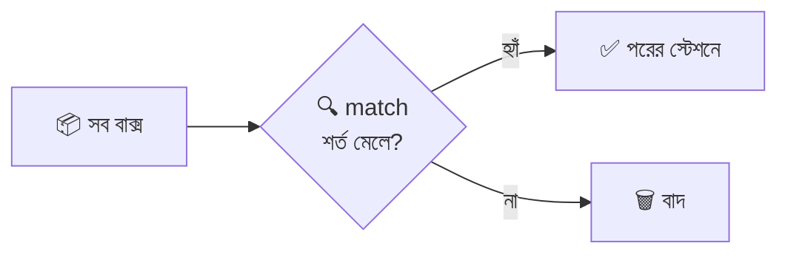

### ১) সরল ও একাধিক শর্ত

```javascript
db.orders.aggregate([
  {
    $match: {
      status: "delivered",   // status অবশ্যই "delivered" হতে হবে
      payment: "bKash"       // আর payment অবশ্যই "bKash" হতে হবে। (একই object-এ দুটো শর্ত = দুটোই লাগবে = AND)
    }
  }
]);
```

### ২) তুলনার query operator (`$gt`, `$gte`, `$lt`, `$lte`, `$ne`, `$in`, `$nin`)

```javascript
db.products.aggregate([
  {
    $match: {
      price: { $gte: 400, $lte: 2000 },        // দাম ৪০০ থেকে ২০০০ এর মধ্যে ($gte = বড় বা সমান, $lte = ছোট বা সমান)
      category: { $in: ["Grocery", "Fashion"] }, // category এই তালিকার যেকোনো একটা হলেই চলবে ($in = তালিকায় আছে)
      brand: { $ne: "Walton" },                 // brand "Walton" হওয়া চলবে না ($ne = সমান নয়)
      stock: { $gt: 0 }                         // গুদামে অন্তত ১টা আছে ($gt = বড়)
    }
  }
]);
```

### ৩) `$or`, `$and`, `$nor`, `$not`

```javascript
db.orders.aggregate([
  {
    $match: {
      $or: [                                   // $or = যেকোনো একটা শর্ত মিললেই চলবে
        { status: "pending" },                 // হয় pending অর্ডার
        { qty: { $gte: 10 } }                  // নয়তো ১০ বা তার বেশি পরিমাণ কেনা অর্ডার
      ]
    }
  }
]);

db.orders.aggregate([
  {
    $match: {
      $and: [                                  // $and = সব শর্ত একসাথে লাগবে (একই ফিল্ডে দুবার শর্ত দিতে হলে $and লাগে)
        { orderDate: { $gte: ISODate("2025-09-01") } },  // ১ সেপ্টেম্বর বা তার পরে
        { orderDate: { $lt:  ISODate("2025-10-01") } }   // ১ অক্টোবরের আগে = পুরো সেপ্টেম্বর মাস
      ]
    }
  }
]);
```

### ৪) `$exists` আর `null`

```javascript
db.employees.aggregate([
  { $match: { bonus: { $exists: false } } }   // $exists: false = যে বাক্সে bonus ফিল্ডটাই নেই (আমাদের Chitra)
]);
```

### ৫) Array আর নেস্টেড ফিল্ডে match

```javascript
db.products.aggregate([
  { $match: { tags: "rice" } },                 // tags Array-তে "rice" আছে এমন পণ্য (Array-তে সরাসরি মান দিলে "যেকোনো একটা মিললেই" ধরা হয়)
  { $match: { tags: { $all: ["rice", "staple"] } } } // $all = দুটো ট্যাগই থাকতে হবে
]);
```

### ৬) `$expr` — দুটো ফিল্ডের মধ্যে তুলনা

সাধারণ `$match`-এ এক ফিল্ডকে আরেক ফিল্ডের সাথে তুলনা করা যায় না। তখন `$expr` (Aggregation expression ঢোকানোর দরজা):

```javascript
db.employees.aggregate([
  {
    $match: {
      $expr: { $gt: ["$bonus", { $multiply: ["$salary", 0.1] }] }
      // $expr    = ভেতরে aggregation expression লেখার অনুমতি
      // $gt: [A, B] = A > B কিনা। এখানে A = "$bonus" (ফিল্ডের মান), B = salary-র ১০%
      // মানে: যাদের বোনাস বেতনের ১০% এর চেয়ে বেশি
    }
  }
]);
```

### 🚀 সোনালি টিপ: `$match` যত আগে, তত ভালো

`$match` পাইপলাইনের **একদম শুরুতে** থাকলে MongoDB **index** ব্যবহার করতে পারে এবং বাকি স্টেশনে কম বাক্স যায়। তাই "আগে ছেঁকে নাও, পরে ভারী কাজ করো।"

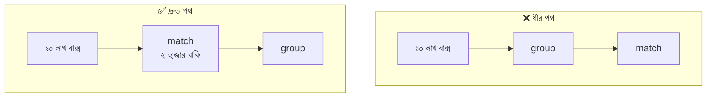

---

## ৫. Like — নামের অংশ ধরে খোঁজা

### গল্প

SQL-এ `LIKE '%rice%'` লিখে নামের অংশ ধরে খোঁজা যায়। MongoDB-তে `LIKE` নামে কিছু নেই — এর বদলে আছে **`$regex`** (Regular Expression)। এটা একটা **প্যাটার্ন-মেলানো ম্যাগনিফাইং গ্লাস**।

### SQL `LIKE` ↔ MongoDB `$regex` অনুবাদ-তালিকা

| SQL | মানে | MongoDB |
|---|---|---|
| `LIKE 'Mango%'` | "Mango" দিয়ে **শুরু** | `{ $regex: "^Mango" }` |
| `LIKE '%Cooker'` | "Cooker" দিয়ে **শেষ** | `{ $regex: "Cooker$" }` |
| `LIKE '%rice%'` | নামের **ভেতরে কোথাও** "rice" | `{ $regex: "rice" }` |
| `ILIKE` (case-insensitive) | বড়/ছোট হাতের অক্ষর গুরুত্বহীন | `{ $regex: "rice", $options: "i" }` |
| `NOT LIKE '%rice%'` | "rice" **নেই** | `{ $not: /rice/i }` |

### উদাহরণ

```javascript
// ১) নামের ভেতরে কোথাও "rice" আছে, বড়/ছোট হাতের অক্ষর যা-ই হোক
db.products.aggregate([
  {
    $match: {
      name: {
        $regex: "rice",   // $regex = কোন প্যাটার্ন খুঁজবো ("rice" শব্দটা)
        $options: "i"     // $options: "i" = case-insensitive (Rice, RICE, rice সব ধরবে)
      }
    }
  },
  { $project: { _id: 0, name: 1 } }
]);
// আউটপুট: "Miniket Rice 5kg", "Rice Cooker"

// ২) "Mango" দিয়ে শুরু হওয়া পণ্য
db.products.aggregate([
  { $match: { name: { $regex: "^Mango" } } }   // ^ = শুরু বোঝায়। আউটপুট: "Mango Juice 1L"
]);

// ৩) JavaScript regex literal দিয়েও লেখা যায় (mongosh ও Node.js দুটোতেই)
db.products.aggregate([
  { $match: { name: /cooker$/i } }             // /.../ = regex literal, $ = শেষ বোঝায়, i = case-insensitive
]);

// ৪) একাধিক ফিল্ডে খোঁজা (নাম অথবা ব্র্যান্ডে "teer")
db.products.aggregate([
  {
    $match: {
      $or: [
        { name:  { $regex: "teer", $options: "i" } },  // নামে খোঁজা
        { brand: { $regex: "teer", $options: "i" } }   // ব্র্যান্ডে খোঁজা
      ]
    }
  }
]);
```

### 🔎 `$expr`-এর ভেতরে regex: `$regexMatch` (৪.২+)

`$match`-এর ভেতরে `$regex` সরাসরি লেখা যায়, কিন্তু `$project`/`$addFields`/`$expr`-এর ভেতরে লাগে `$regexMatch`, যা **true/false** ফেরত দেয়:

```javascript
db.products.aggregate([
  {
    $project: {
      _id: 0,
      name: 1,
      isRiceItem: {
        $regexMatch: {
          input: "$name",     // input = কোন ফিল্ডের লেখায় খুঁজবো
          regex: /rice/i,     // regex = কোন প্যাটার্ন খুঁজবো
        }
      }                       // ফলাফল: true অথবা false — isRiceItem নামের নতুন ফিল্ডে
    }
  }
]);
```

> ⚠️ **পারফরম্যান্স সতর্কতা:** `"^abc"` (শুরু থেকে মেলানো) index ব্যবহার করতে পারে। কিন্তু `"abc"` বা `".*abc"` (মাঝখানে) পুরো collection স্ক্যান করে। বড় ডেটায় full-text search-এর জন্য `$text` index অথবা Atlas Search ব্যবহার করুন।
> ⚠️ ইউজারের ইনপুট সরাসরি regex-এ বসানোর আগে special character (`.`, `*`, `(` ...) escape করুন, নাহলে খারাপ প্যাটার্নে সার্ভার ধীর হয়ে যেতে পারে।

---

## ৬. Projection — ছাঁটাই ও লেবেল স্টেশন

### গল্প

বাক্সে অনেক কিছু থাকে, কিন্তু কাস্টমারের রিপোর্টে সব তথ্য লাগে না। বেল্টের একটা স্টেশনে একজন কাঁচি হাতে বসে আছে: **"এই ফিল্ড রাখো, ওটা ফেলো, আর ওটার নাম বদলে ওই নাম দাও!"** এই স্টেশনই `$project`।

### নিয়ম

| লিখলাম | ফল |
|---|---|
| `field: 1` (বা `true`) | ফিল্ডটা **রাখো** |
| `field: 0` (বা `false`) | ফিল্ডটা **বাদ দাও** |
| `_id` | ডিফল্টে **থাকে**; না চাইলে `_id: 0` |
| `newName: "$oldField"` | পুরোনো ফিল্ডের মান নতুন নামে নাও (**Rename**) |
| `newName: { expression }` | হিসাব করে নতুন ফিল্ড বানাও (**Computed**) |

> 🚨 **নিয়ম:** একই `$project`-এ `1` আর `0` মেশানো যায় না — শুধু `_id: 0` ছাড়া। হয় "কী রাখবো" বলুন, নয় "কী ফেলবো" বলুন।

```javascript
// (ক) শুধু যা রাখবো সেগুলো বলা (Include)
db.products.aggregate([
  {
    $project: {
      _id: 0,       // _id বাদ (এটাই একমাত্র ব্যতিক্রম যেটা 1-এর সাথে মেশানো যায়)
      name: 1,      // name রাখো
      price: 1      // price রাখো
    }
  }
]);

// (খ) শুধু যা ফেলবো সেগুলো বলা (Exclude)
db.products.aggregate([
  { $project: { tags: 0, createdAt: 0, stock: 0 } }   // এই তিনটা বাদে বাকি সব ফিল্ড থাকবে
]);

// (গ) নাম বদলানো (Rename) ও হিসাব করা ফিল্ড (Computed)
db.products.aggregate([
  {
    $project: {
      _id: 0,
      productName: "$name",                          // productName = নতুন নাম; "$name" = পুরোনো name ফিল্ডের মান কপি
      priceInTaka: "$price",                         // দামের ফিল্ডটা priceInTaka নামে
      priceWithVat: { $multiply: ["$price", 1.15] }, // priceWithVat = দাম × ১.১৫ (১৫% ভ্যাটসহ)। এটা নতুন বানানো ফিল্ড
      stockValue: { $multiply: ["$price", "$stock"] } // stockValue = দাম × মজুদ = গুদামে পড়ে থাকা মালের মোট মূল্য
    }
  }
]);

// (ঘ) নেস্টেড (ভেতরের) ফিল্ড বানানো
db.products.aggregate([
  {
    $project: {
      _id: 0,
      name: 1,
      info: {                  // info = নতুন একটা ভেতরের object (embedded document)
        brand: "$brand",       // info.brand ← brand ফিল্ডের মান
        cat: "$category"       // info.cat   ← category ফিল্ডের মান
      }
    }
  }
]);
```

### `$unset` — "শুধু ফেলো" স্টেশন (৪.২+)

```javascript
db.products.aggregate([
  { $unset: ["tags", "createdAt"] }   // $unset = Array-তে লেখা ফিল্ডগুলো মুছে ফেলে। ফিল্ড একটা হলে শুধু "tags" লিখলেও চলে
]);
```

### `$project` বনাম `$addFields`

| | `$project` | `$addFields` / `$set` |
|---|---|---|
| যা উল্লেখ করেননি | সাধারণত **হারিয়ে যায়** (Include মোডে) | **থেকে যায়** |
| কাজ | ছাঁটাই + নতুন ফিল্ড | শুধু নতুন ফিল্ড যোগ/বদল |
| কখন | রিপোর্টের শেষ আকার ঠিক করতে | বেল্টের মাঝখানে হিসাবের ফিল্ড বাড়াতে |

---

## ৭. Skip and Limit — পাতা উল্টানো (Pagination)

### গল্প

স্টোরের ওয়েবসাইটে ৮টা পণ্য, কিন্তু একপাতায় দেখাবেন মাত্র ৩টা। এখন "পাতা ২" চাইলে আপনাকে **প্রথম ৩টা ছেড়ে দিয়ে (skip)** পরের ৩টা **নিতে (limit)** হবে।

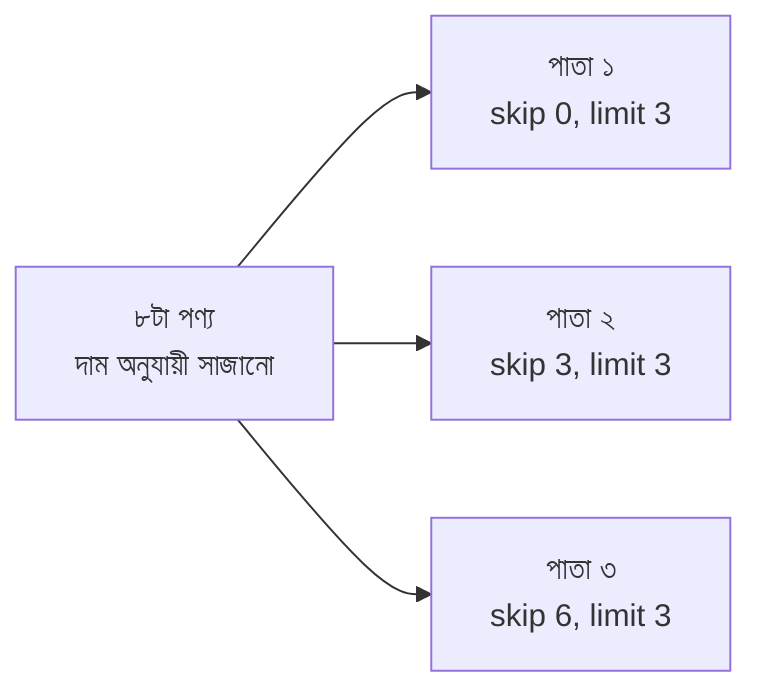

### সূত্র

```
skip  = (page - 1) × limit
```

| page | limit | skip |
|---|---|---|
| ১ | ৩ | `(1-1)×3 = 0` |
| ২ | ৩ | `(2-1)×3 = 3` |
| ৩ | ৩ | `(3-1)×3 = 6` |

```javascript
const page = 2;                      // page = এখন কত নম্বর পাতা দেখাতে চাই (ইউজার পাঠায়, সাধারণত req.query.page থেকে)
const limit = 3;                     // limit = এক পাতায় কয়টা আইটেম দেখাবো
const skip = (page - 1) * limit;     // skip = আগের পাতাগুলোর মোট আইটেম, যেগুলো ছেড়ে যেতে হবে

db.products.aggregate([
  { $sort: { price: 1, _id: 1 } },   // সাজানো আবশ্যক! price সমান হলে যাতে ক্রম এলোমেলো না হয় তাই _id দিয়ে "টাই-ব্রেক"
  { $skip: skip },                   // প্রথম skip সংখ্যক document ছেড়ে দাও
  { $limit: limit },                 // তারপর limit সংখ্যক document নাও
  { $project: { _id: 0, name: 1, price: 1 } }
]);
```

পাতা ২-এর আউটপুট:

```javascript
[
  { name: "Miniket Rice 5kg",    price: 480 },
  { name: "Cotton Panjabi",      price: 1500 },
  { name: "Power Bank 10000mAh", price: 1800 }
]
```

### 🔑 স্টেশনের ক্রম: `$sort → $skip → $limit`

| ক্রম | ফল |
|---|---|
| `$sort → $skip → $limit` | ✅ ঠিক |
| `$limit → $skip` | ❌ ভুল: আগে কেটে ফেলে পরে ছাড়ে, ফলে কম বা খালি রেজাল্ট |

> 💡 MongoDB নিজেই `$skip` আর `$limit`-এর ক্রম বুঝে optimize করে, তবুও আপনি সবসময় `$skip` আগে, `$limit` পরে লিখুন — পড়তেও পরিষ্কার।
> ⚠️ লাখ লাখ ডেটায় বড় `skip` ধীর (MongoDB ওই পর্যন্ত সব গুনে ছাড়ে)। বড় ডেটায় **cursor-based pagination** ব্যবহার করুন: `{ $match: { _id: { $gt: lastSeenId } } }` + `$limit`।
> 📌 মোট পাতার সংখ্যাও লাগলে `$facet` ([১৫ নম্বর সেকশন](#১৫-facet--তিন-মুখো-কনভেয়ার-বেল্ট)) দিয়ে একই query-তে ডেটা আর মোট গণনা আনা যায়।

---

## ৮. Group By — ঝুড়িতে ভাগ করা

### গল্প

বেল্টে ১০টা অর্ডারের বাক্স আসছে। মালিক বললেন: **"payment method অনুযায়ী ভাগ করো।"** আপনি তিনটা ঝুড়ি রাখলেন — `cash`, `bKash`, `card`। প্রতিটা বাক্সের payment দেখে সেটা সঠিক ঝুড়িতে ফেলতে লাগলেন। এই স্টেশনই `$group`।

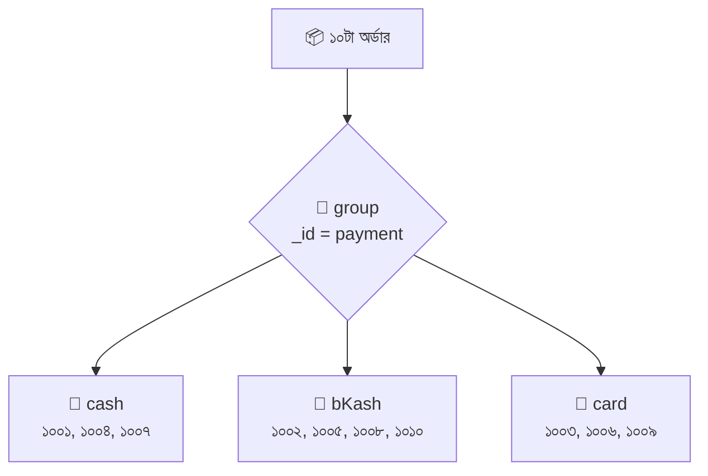

### `$group`-এর গঠন

```javascript
{
  $group: {
    _id: <ঝুড়ির চাবি>,              // বাধ্যতামূলক! এই মান ধরে বাক্সগুলো ভাগ হয়
    <নতুনফিল্ড1>: { <accumulator>: <expression> },   // প্রতিটা ঝুড়ির জন্য হিসাব
    <নতুনফিল্ড2>: { <accumulator>: <expression> }
  }
}
```

> `_id`-এর মানে এখানে **"ডকুমেন্টের আইডি" নয়, "গ্রুপের চাবি"**। আউটপুটে প্রতিটা group-এর `_id` হবে সেই চাবির মান।

### ১) শুধু ঝুড়ি বানানো (distinct মান বের করা)

```javascript
db.products.aggregate([
  { $group: { _id: "$category" } }   // _id: "$category" = category-র প্রতিটা আলাদা মান একবার করে আসবে (Distinct)
]);
// আউটপুট: Grocery, Beverage, Electronics, Fashion (ক্রম নিশ্চিত নয়)
```

### ২) ঝুড়িতে কয়টা বাক্স (Count)

```javascript
db.orders.aggregate([
  {
    $group: {
      _id: "$status",              // status ধরে ভাগ: delivered / pending / cancelled
      orderCount: { $sum: 1 }      // orderCount = প্রতি ঝুড়িতে বাক্সের সংখ্যা। $sum: 1 = প্রতিটা বাক্সের জন্য ১ যোগ
    }
  }
]);
// আউটপুট: { _id: "delivered", orderCount: 7 }, { _id: "pending", orderCount: 2 }, { _id: "cancelled", orderCount: 1 }
```

### ৩) ঝুড়ির ভেতরের জিনিস জমানো: `$push` ও `$addToSet`

```javascript
db.products.aggregate([
  {
    $group: {
      _id: "$category",
      productNames: { $push: "$name" },       // productNames = ঝুড়ির সব পণ্যের নাম Array-তে (ডুপ্লিকেটসহ)
      brands: { $addToSet: "$brand" }         // brands = ঝুড়ির ব্র্যান্ডগুলো Array-তে কিন্তু ডুপ্লিকেট ছাড়া (Set)
    }
  }
]);
// Electronics → productNames: ["Bluetooth Speaker", "Power Bank 10000mAh", "Rice Cooker"], brands: ["Xiaomi", "Walton"]
```

### ৪) `$$ROOT` — পুরো বাক্সটাই ঝুড়িতে রাখা

```javascript
db.orders.aggregate([
  {
    $group: {
      _id: "$customerId",
      allOrders: { $push: "$$ROOT" }   // $$ROOT = বর্তমান পুরো document। দুটো $ কারণ এটা System Variable (ফিল্ড নয়)। মানে প্রতিটা অর্ডারের সম্পূর্ণ বাক্স Array-তে জমবে
    }
  }
]);
```

### ৫) সব বাক্স একটাই ঝুড়িতে: `_id: null`

```javascript
db.orders.aggregate([
  {
    $group: {
      _id: null,                  // null = কোনো ভাগ নেই, সব বাক্স একই বিশাল ঝুড়িতে। পুরো collection-এর সারাংশ বের করার কৌশল
      totalOrders: { $sum: 1 }    // সব মিলিয়ে ১০টা
    }
  }
]);
```

### ৬) `HAVING`-এর মতো: group-এর **পরে** `$match`

```javascript
db.orders.aggregate([
  { $group: { _id: "$customerId", orders: { $sum: 1 } } },  // প্রথমে কাস্টমার-ভিত্তিক অর্ডার গোনা
  { $match: { orders: { $gte: 3 } } }                       // তারপর যাদের অন্তত ৩টা অর্ডার (এটাই SQL-এর HAVING)। এখানে orders হলো group-এর নতুন ফিল্ড
]);
```

### $group-এর Accumulator তালিকা (সব এক জায়গায়)

| Accumulator | কাজ |
|---|---|
| `$sum` | যোগফল / গণনা |
| `$avg` | গড় |
| `$min`, `$max` | সর্বনিম্ন, সর্বোচ্চ |
| `$first`, `$last` | প্রথম, শেষ (ক্রম অনুযায়ী) |
| `$push` | সব মান Array-তে (ডুপ্লিকেটসহ) |
| `$addToSet` | সব আলাদা মান Array-তে |
| `$count` | গণনা (৫.০+; `{ $sum: 1 }`-এর সংক্ষিপ্ত রূপ) |
| `$stdDevPop`, `$stdDevSamp` | Standard Deviation |
| `$top`, `$bottom`, `$topN`, `$bottomN`, `$firstN`, `$lastN`, `$maxN`, `$minN` | ৫.২+/৫.০+ নতুন সংযোজন |

> 🚨 `$group`-এর বাইরে আর ভেতরে কী ফিল্ড থাকবে তা আপনি **নিজে** ঠিক করেন। গ্রুপের পর পুরোনো ফিল্ডগুলো (`qty`, `price` ইত্যাদি) আর থাকে না — শুধু `_id` আর আপনার দেওয়া নতুন ফিল্ডগুলো বাঁচে।

---

## ৯. Group By SUM — ঝুড়ির যোগফল

### গল্প

প্রতিটা ঝুড়িতে এখন একজন ক্যাশিয়ার বসে বললো: **"আমি ঝুড়ির সব বাক্সের সংখ্যা/টাকা যোগ করবো!"** — এই ক্যাশিয়ারের নাম `$sum`।

`$sum` তিন ভাবে চলে:

| লেখা | মানে |
|---|---|
| `{ $sum: 1 }` | প্রতি বাক্সে ১ করে যোগ → **গণনা (Count)** |
| `{ $sum: "$qty" }` | প্রতি বাক্সের `qty` ফিল্ডের মান যোগ |
| `{ $sum: { $multiply: ["$qty", "$unitPrice"] } }` | প্রতি বাক্সে হিসাব করে সেই ফলাফল যোগ |

### ১) payment ভিত্তিক মোট বিক্রির টাকা (Delivered অর্ডার)

```javascript
db.orders.aggregate([
  { $match: { status: "delivered" } },     // শুধু ডেলিভারি হওয়া অর্ডারের টাকাই বিক্রি হিসেবে ধরবো
  {
    $group: {
      _id: "$payment",                     // payment ধরে ঝুড়ি
      totalQty: { $sum: "$qty" },          // totalQty = ঝুড়ির সব অর্ডারের qty-র যোগফল (কতগুলো পণ্য বিক্রি হলো)
      totalRevenue: {                      // totalRevenue = ঝুড়ির মোট বিক্রির টাকা
        $sum: { $multiply: ["$qty", "$unitPrice"] }
        // $multiply: ["$qty", "$unitPrice"] = প্রতিটা অর্ডারের লাইন-টোটাল (qty × unitPrice)
        // $sum = সেই লাইন-টোটালগুলোর ঝুড়ি-ভিত্তিক যোগফল
      },
      orderCount: { $sum: 1 }              // orderCount = ঝুড়িতে কয়টা অর্ডার
    }
  },
  { $sort: { totalRevenue: -1 } }          // সবচেয়ে বেশি বিক্রি যে মাধ্যমে, সেটা আগে
]);
```

আউটপুট:

```javascript
[
  { _id: "bKash", totalQty: 22, totalRevenue: 10160, orderCount: 4 },
  { _id: "card",  totalQty: 1,  totalRevenue: 2500,  orderCount: 1 },
  { _id: "cash",  totalQty: 3,  totalRevenue: 1440,  orderCount: 2 }
]
```

### ২) কাস্টমার ভিত্তিক মোট খরচ

```javascript
db.orders.aggregate([
  { $match: { status: "delivered" } },
  {
    $group: {
      _id: "$customerId",                                         // কাস্টমার আইডি ধরে ঝুড়ি
      totalSpent: { $sum: { $multiply: ["$qty", "$unitPrice"] } } // totalSpent = কাস্টমার মোট কত টাকা খরচ করেছে
    }
  },
  { $sort: { totalSpent: -1 } }
]);
// আউটপুট: 103 → 5480, 101 → 4900, 104 → 3000, 102 → 720
```

### ৩) পুরো স্টোরের মোট বিক্রি (`_id: null`)

```javascript
db.orders.aggregate([
  { $match: { status: "delivered" } },
  {
    $group: {
      _id: null,                                                    // কোনো ভাগ নেই, সব এক ঝুড়িতে
      grandTotal: { $sum: { $multiply: ["$qty", "$unitPrice"] } }   // grandTotal = পুরো স্টোরের মোট delivered বিক্রি (১৪১০০)
    }
  }
]);
```

> 💡 `$sum` শুধু **সংখ্যা** যোগ করে। ফিল্ড না থাকলে বা সংখ্যা না হলে (যেমন স্ট্রিং, null) সেটাকে **০ ধরে** — তাই `{ $sum: "$bonus" }` লিখলে Chitra-র মতো `bonus`-বিহীন বাক্স সমস্যা করবে না।

---

## ১০. Group By AVG — ঝুড়ির গড়

### গল্প

ঝুড়িতে এখন বসলো হিসাবরক্ষক: **"আমি সবার সংখ্যা যোগ করে বাক্সের সংখ্যা দিয়ে ভাগ করবো!"** — `$avg`।

```javascript
db.products.aggregate([
  {
    $group: {
      _id: "$category",                 // category ধরে ঝুড়ি
      avgPrice: { $avg: "$price" },     // avgPrice = ঝুড়ির সব পণ্যের দামের গড়
      avgRating: { $avg: "$rating" },   // avgRating = ঝুড়ির রেটিংয়ের গড়
      productCount: { $sum: 1 }         // productCount = ঝুড়িতে কয়টা পণ্য (গড় কত জনের উপর বের হলো বোঝার জন্য)
    }
  },
  {
    $project: {
      avgPrice: { $round: ["$avgPrice", 2] },    // $round: [সংখ্যা, দশমিকের পরে কত ঘর] = গড়টা দুই দশমিকে গোল করা
      avgRating: { $round: ["$avgRating", 1] },  // রেটিং এক দশমিকে গোল
      productCount: 1                            // productCount যেমন আছে তেমন রাখো
    }
  },
  { $sort: { avgPrice: -1 } }
]);
```

আউটপুট:

```javascript
[
  { _id: "Electronics", avgPrice: 2500, avgRating: 4.4, productCount: 3 },
  { _id: "Fashion",     avgPrice: 1500, avgRating: 4.7, productCount: 1 },
  { _id: "Grocery",     avgPrice: 420,  avgRating: 4.4, productCount: 2 },
  { _id: "Beverage",    avgPrice: 90,   avgRating: 3.9, productCount: 2 }
]
```

### বিভাগ-ভিত্তিক গড় বেতন

```javascript
db.employees.aggregate([
  { $match: { isActive: true } },                        // শুধু বর্তমান কর্মীরা
  {
    $group: {
      _id: "$department",
      avgSalary: { $avg: "$salary" },                    // avgSalary = বিভাগের গড় বেতন
      headCount: { $sum: 1 }                             // headCount = বিভাগে কর্মী সংখ্যা
    }
  }
]);
```

> ⚠️ **`$avg` যা এড়িয়ে যায়:** ফিল্ড না থাকলে, `null` হলে বা সংখ্যা না হলে সেই বাক্স গড়ের হিসাবেই ধরে না (হর বাড়ে না)। অর্থাৎ ৪টা বাক্সের মধ্যে ১টায় `bonus` না থাকলে গড় হবে ৩টার উপর। সবাইকে ধরতে চাইলে `{ $avg: { $ifNull: ["$bonus", 0] } }` লিখুন — `$ifNull` ফিল্ড না থাকলে ০ বসিয়ে দেবে।

---

## ১১. Max Min — সবচেয়ে বড় আর ছোট

### গল্প

ঝুড়িতে বসলো দুইজন প্রহরী: **`$max`** — "আমি সবচেয়ে বড়টা মনে রাখবো", আর **`$min`** — "আমি সবচেয়ে ছোটটা মনে রাখবো।" (সংখ্যা, তারিখ, এমনকি স্ট্রিং-এর উপরেও চলে।)

```javascript
db.products.aggregate([
  {
    $group: {
      _id: "$category",
      maxPrice: { $max: "$price" },        // maxPrice = ঝুড়ির সবচেয়ে বেশি দাম
      minPrice: { $min: "$price" },        // minPrice = ঝুড়ির সবচেয়ে কম দাম
      newest:   { $max: "$createdAt" },    // newest   = সবচেয়ে নতুন তারিখ (তারিখের $max = সর্বশেষ)
      oldest:   { $min: "$createdAt" }     // oldest   = সবচেয়ে পুরোনো তারিখ
    }
  }
]);
```

### বিভাগের সর্বোচ্চ ও সর্বনিম্ন বেতন

```javascript
db.employees.aggregate([
  {
    $group: {
      _id: "$department",
      highestSalary: { $max: "$salary" },   // highestSalary = বিভাগে সবচেয়ে বেশি বেতন
      lowestSalary:  { $min: "$salary" }    // lowestSalary  = বিভাগে সবচেয়ে কম বেতন
    }
  }
]);
// IT → highest 90000, lowest 52000
```

### 🧩 প্রশ্ন: "সর্বোচ্চ বেতনটা কত" নয়, "**কে** পাচ্ছে সর্বোচ্চ বেতন?"

`$max` শুধু **মান** (৯০০০০) বলে, **বাক্সটা** (Gita) বলে না। বাক্সটা পেতে হলে `$sort` + `$first`:

```javascript
db.employees.aggregate([
  { $sort: { salary: -1 } },                  // বেতন বেশি থেকে কম সাজাও
  {
    $group: {
      _id: "$department",
      topEarnerName: { $first: "$name" },      // topEarnerName = ঝুড়ির প্রথম (অর্থাৎ সবচেয়ে বেশি বেতনের) কর্মীর নাম
      topSalary: { $first: "$salary" }         // topSalary = তার বেতন
    }
  }
]);
// IT → Gita, 90000 | Sales → Babul, 55000 | Support → Dipu, 42000
```

(MongoDB 5.2+ হলে `$top: { sortBy: { salary: -1 }, output: "$name" }` দিয়ে `$sort` ছাড়াই করা যায়।)

---

## ১২. Without Group By — Sum, Avg, Max, Min

### গল্প

এতক্ষণ `$sum`, `$avg`, `$max`, `$min` কে আমরা ঝুড়ির (`$group`) ভেতরে ব্যবহার করেছি। কিন্তু **`$group` ছাড়াও** এরা কাজ করে — দুইটা জায়গায়:

1. **এক বাক্সের ভেতরের Array-র উপর** (`$project` / `$addFields`-এ) — প্রতিটা বাক্স নিজের Array নিজে হিসাব করবে।
2. **পুরো collection একটাই ঝুড়ি** (`$group` + `_id: null`) — আগেই দেখেছি, এখানে আরেকবার একসাথে।

### (ক) বাক্সের ভেতরের Array-তে (কোনো group ছাড়া)

আমাদের কর্মীদের `scores: [Q1, Q2, Q3]` আছে। প্রত্যেকের নিজস্ব যোগ-গড়-সর্বোচ্চ-সর্বনিম্ন চাই:

```javascript
db.employees.aggregate([
  {
    $project: {
      _id: 0,
      name: 1,                                   // নাম রাখলাম, কার হিসাব বোঝার জন্য
      totalScore: { $sum: "$scores" },           // totalScore = এই কর্মীর scores Array-র সব সংখ্যার যোগফল (Array দিলে $sum নিজেই ভেতরের সংখ্যা যোগ করে)
      avgScore:   { $round: [{ $avg: "$scores" }, 1] }, // avgScore = Array-র গড়, এক দশমিকে গোল
      bestScore:  { $max: "$scores" },           // bestScore  = Array-র সবচেয়ে বড় সংখ্যা
      worstScore: { $min: "$scores" }            // worstScore = Array-র সবচেয়ে ছোট সংখ্যা
    }
  }
]);
```

আউটপুটের অংশ:

```javascript
{ name: "Anika", totalScore: 240, avgScore: 80,   bestScore: 90, worstScore: 70 }
{ name: "Babul", totalScore: 275, avgScore: 91.7, bestScore: 95, worstScore: 88 }
```

> 🔑 **মূল পার্থক্য:** `$group`-এর ভেতরে `$sum: "$field"` = **অনেক বাক্সের** একই ফিল্ড যোগ। `$project`-এ `$sum: "$arrayField"` = **একটা বাক্সের** Array-র ভেতরের উপাদান যোগ।

### (খ) একাধিক ফিল্ড একসাথে যোগ (Array ছাড়াই)

`$project`/`$addFields`-এ `$sum`-কে একাধিক expression-এর তালিকা দেওয়া যায়:

```javascript
db.employees.aggregate([
  {
    $project: {
      _id: 0,
      name: 1,
      totalPay: { $sum: ["$salary", "$bonus"] }
      // totalPay = বেতন + বোনাস। $sum তালিকার সংখ্যা-নয় এমন মান (যেমন Chitra-র না-থাকা bonus) ০ ধরে নেয়, তাই এখানে Chitra-র totalPay = 28000 আসবে, null নয়
    }
  }
]);
```

### (গ) পুরো collection-এর হিসাব (`_id: null`)

```javascript
db.employees.aggregate([
  {
    $group: {
      _id: null,                           // null = সবাই এক ঝুড়িতে
      totalSalary: { $sum: "$salary" },    // totalSalary = সব কর্মীর বেতন যোগ (৩৮৯০০০)
      avgSalary:   { $avg: "$salary" },    // avgSalary   = সবার গড় বেতন (৪৮৬২৫)
      maxSalary:   { $max: "$salary" },    // maxSalary   = সর্বোচ্চ বেতন (৯০০০০)
      minSalary:   { $min: "$salary" },    // minSalary   = সর্বনিম্ন বেতন (২৮০০০)
      employeeCount: { $sum: 1 }           // employeeCount = কর্মী সংখ্যা (৮)
    }
  },
  { $project: { _id: 0 } }                 // _id: null দেখতে খারাপ লাগে, তাই বাদ দিলাম
]);
```

### (ঘ) `$setWindowFields` — Group না ভেঙে হিসাব (MongoDB 5.0+)

`$group` করলে বাক্সগুলো ভেঙে যায়। কিন্তু **প্রতিটা বাক্স রেখেই** তার পাশে গড়/যোগফল বসাতে চাইলে `$setWindowFields`:

```javascript
db.employees.aggregate([
  {
    $setWindowFields: {
      partitionBy: "$department",             // partitionBy = কোন ফিল্ড ধরে "জানালা" ভাগ হবে (এখানে বিভাগ)। ভাগ হলেও বাক্স ভাঙে না
      output: {
        deptAvgSalary: { $avg: "$salary" }    // deptAvgSalary = প্রতিটা কর্মীর বাক্সের পাশে তার বিভাগের গড় বেতন বসে যাবে
      }
    }
  },
  { $project: { _id: 0, name: 1, department: 1, salary: 1, deptAvgSalary: 1 } }
]);
```

| চাই | ব্যবহার করুন |
|---|---|
| ঝুড়ি-ভিত্তিক একটাই রিপোর্ট-লাইন | `$group` |
| একটা বাক্সের Array-র হিসাব | `$project` / `$addFields` + `$sum/$avg/$max/$min` |
| সব বাক্স রেখে পাশে গ্রুপের হিসাব | `$setWindowFields` |
| পুরো collection-এর একটা সারাংশ | `$group` + `_id: null` |

---

## ১৩. Group By Multiple — একাধিক চাবিতে ভাগ

### গল্প

মালিক জটিল প্রশ্ন করলেন: **"প্রতিটা বিভাগে, ছেলে ও মেয়ে আলাদা — কতজন আছে আর গড় বেতন কত?"**

এখন ঝুড়ির চাবি একটা ফিল্ড নয় — **দুটো ফিল্ডের জোড়া** (`department` + `gender`)। অর্থাৎ ঝুড়ির গায়ে লেবেল: **"Sales + M"**, **"Sales + F"**, **"IT + F"**...

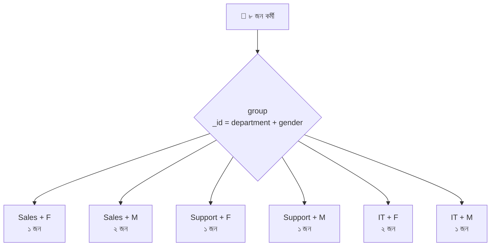

### কৌশল: `_id`-কে একটা **object** বানান

```javascript
db.employees.aggregate([
  {
    $group: {
      _id: {                               // _id এখন একটা object = "যৌগিক চাবি" (Compound Key)
        department: "$department",         // চাবির প্রথম অংশ: বিভাগ (নাম আমরা যা ইচ্ছে দিতে পারি)
        gender: "$gender"                  // চাবির দ্বিতীয় অংশ: লিঙ্গ
      },
      headCount: { $sum: 1 },              // headCount = এই জোড়ার কর্মী সংখ্যা
      avgSalary: { $avg: "$salary" },      // avgSalary = এই জোড়ার গড় বেতন
      names: { $push: "$name" }            // names = এই জোড়ার সবার নাম Array-তে
    }
  },
  { $sort: { "_id.department": 1, "_id.gender": 1 } }
  // "_id.department" = dot notation, _id object-এর ভেতরের department-কে ধরার উপায়। কোটেশন (" ") আবশ্যক
]);
```

আউটপুটের অংশ:

```javascript
{ _id: { department: "IT", gender: "F" }, headCount: 2, avgSalary: 75000, names: ["Eshita", "Gita"] }
{ _id: { department: "IT", gender: "M" }, headCount: 1, avgSalary: 52000, names: ["Faisal"] }
```

### আউটপুট সুন্দর করা: `_id` ভেঙে ফেলা

```javascript
db.employees.aggregate([
  { $group: { _id: { department: "$department", gender: "$gender" }, headCount: { $sum: 1 } } },
  {
    $project: {
      _id: 0,                              // জটিল _id বাদ
      department: "$_id.department",       // _id-র ভেতরের department-কে সোজা ফিল্ড বানালাম
      gender: "$_id.gender",               // _id-র ভেতরের gender-কেও
      headCount: 1
    }
  }
]);
```

### তিন চাবির উদাহরণ: বছর + মাস + payment

```javascript
db.orders.aggregate([
  {
    $group: {
      _id: {
        year:  { $year:  "$orderDate" },   // year  = অর্ডারের বছর (তারিখ থেকে বছর বের করার যন্ত্র)
        month: { $month: "$orderDate" },   // month = অর্ডারের মাস (১–১২)
        payment: "$payment"                // payment = পেমেন্টের মাধ্যম
      },
      revenue: { $sum: { $multiply: ["$qty", "$unitPrice"] } }  // revenue = ওই বছর-মাস-মাধ্যমের মোট বিক্রি
    }
  },
  { $sort: { "_id.year": 1, "_id.month": 1 } }
]);
```

> 💡 **নিয়ম:** `_id`-তে যত ফিল্ড দেবেন, গ্রুপ তত সূক্ষ্ম হবে। দুটো বাক্সের **সবগুলো চাবি-অংশ** একই হলে তবেই তারা এক ঝুড়িতে যাবে।

---

## ১৪. Join By Lookup — পাশের গুদামের তথ্য জোড়া

### গল্প

আমাদের `orders` তাকের রসিদে শুধু `customerId: 101` আর `productId: 1` লেখা — কিন্তু কাস্টমারের **নাম** আর পণ্যের **নাম** তো অন্য দুটো তাকে!

মালিক বললেন: **"রসিদে নাম দেখাতে চাই।"** আপনি বেল্টে এক **বিশেষ কর্মী** বসালেন: প্রতিটা রসিদ হাতে নিয়ে সে পাশের গুদামে (`products`) দৌড়ায়, মিলিয়ে দেখে — **"এই `productId`-র সাথে ওখানকার কোন `_id` মেলে?"** — মিললে পুরো বাক্সটার ফটোকপি এনে রসিদে স্টেপল করে দেয়। ওই কর্মীর নাম `$lookup`।

> SQL-এর ভাষায়: **LEFT OUTER JOIN**।

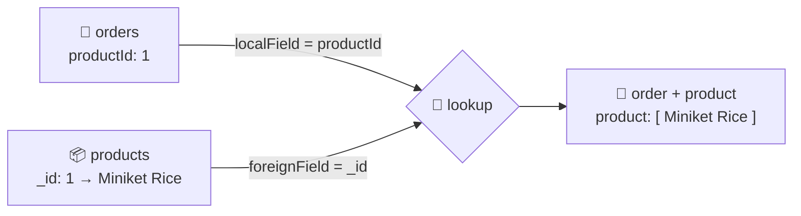

### ১) প্রাথমিক Join (`localField` / `foreignField`)

```javascript
db.orders.aggregate([
  {
    $lookup: {
      from: "products",           // from = কোন তাক (collection) থেকে তথ্য আনবো। অবশ্যই একই database-এর collection
      localField: "productId",    // localField = এই (orders) বাক্সের কোন ফিল্ড দিয়ে মেলাবো
      foreignField: "_id",        // foreignField = ওই (products) বাক্সের কোন ফিল্ডের সাথে মেলাবো
      as: "product"               // as = মিলে যাওয়া বাক্সগুলো কোন নতুন ফিল্ডে বসবে (সবসময় ARRAY হয়ে বসে!)
    }
  },
  { $limit: 2 }
]);
```

আউটপুটের একটা:

```javascript
{
  _id: 1001, customerId: 101, productId: 1, qty: 2, unitPrice: 480, status: "delivered", payment: "cash", orderDate: ISODate("..."),
  product: [                          // ← Array! মিললো ১টা বাক্স, তবুও Array-র ভেতরে
    { _id: 1, name: "Miniket Rice 5kg", category: "Grocery", brand: "Teer", price: 480, stock: 120, ... }
  ]
}
```

> 🚨 **সবচেয়ে বেশি হওয়া ভুল:** `as` সবসময় **Array** দেয়, ১টা মিললেও। তাই পরে `product.name` সরাসরি পাওয়া যায় না — Array খুলতে হয়।

### ২) Array সরলীকরণ: `$unwind` অথবা `$arrayElemAt`

```javascript
// উপায় ১: $unwind — Array ভেঙে প্রতিটা উপাদান আলাদা document বানায়
db.orders.aggregate([
  { $lookup: { from: "products", localField: "productId", foreignField: "_id", as: "product" } },
  { $unwind: "$product" }   // "$product" = কোন Array ভাঙবো। এখন product আর Array নয়, সরাসরি object (product.name এভাবে পড়া যাবে)
]);

// উপায় ২: $addFields + $arrayElemAt (শুধু প্রথম উপাদান নেওয়া)
db.orders.aggregate([
  { $lookup: { from: "products", localField: "productId", foreignField: "_id", as: "product" } },
  { $addFields: { product: { $arrayElemAt: ["$product", 0] } } }
  // $arrayElemAt: [Array, index] = Array-র নির্দিষ্ট ঘর থেকে একটা উপাদান। 0 = প্রথম ঘর
  // এখানে "product" ফিল্ডটাকেই নতুন মান দিয়ে নিজেই বদলে ফেলছি (Array → ১টা object)
]);

// উপায় ৩: $first Array operator (৪.৪+)
db.orders.aggregate([
  { $lookup: { from: "products", localField: "productId", foreignField: "_id", as: "product" } },
  { $set: { product: { $first: "$product" } } }   // $set = $addFields-এর ছোট নাম; $first = Array-র প্রথমটা
]);
```

| উপায় | ফিল্ড মিললো না হলে (Array খালি `[]`) |
|---|---|
| `$unwind: "$product"` | ওই রসিদ **বাদ পড়ে যায়** (INNER JOIN-এর মতো) |
| `$unwind: { path: "$product", preserveNullAndEmptyArrays: true }` | রসিদ **থাকে**, product ফিল্ড থাকে না (LEFT JOIN-এর মতো) |
| `$arrayElemAt` / `$first` | রসিদ **থাকে**, product ফিল্ড থাকে না |

### ৩) দুই-ধাপ Join: কাস্টমার + পণ্য একসাথে

```javascript
db.orders.aggregate([
  // ধাপ ১: পণ্যের তথ্য জোড়া
  { $lookup: { from: "products",  localField: "productId",  foreignField: "_id", as: "product"  } },
  { $unwind: "$product" },                       // product Array → সরাসরি object

  // ধাপ ২: কাস্টমারের তথ্য জোড়া
  { $lookup: { from: "customers", localField: "customerId", foreignField: "_id", as: "customer" } },
  { $unwind: "$customer" }                       // customer Array → সরাসরি object
]);
```

### ৪) উল্টো দিক থেকে Join: কাস্টমার → তার অর্ডারগুলো

```javascript
db.customers.aggregate([
  {
    $lookup: {
      from: "orders",             // এবার orders তাক থেকে তথ্য আনছি
      localField: "_id",          // customers-এর _id
      foreignField: "customerId", // orders-এর customerId-র সাথে মেলাবো
      as: "orders"                // ওই কাস্টমারের সব অর্ডার orders নামের Array-তে
    }
  },
  { $project: { _id: 0, name: 1, orderCount: { $size: "$orders" } } }
  // $size = Array-তে কয়টা উপাদান। orderCount = কাস্টমারের অর্ডার সংখ্যা
]);
// Tanvir Ahmed (১০৫) এর orders = [] , তাই orderCount: 0 (LEFT JOIN-এর বৈশিষ্ট্য)
```

### ৫) যাদের কোনো অর্ডার নেই (Unmatched খোঁজা)

```javascript
db.customers.aggregate([
  { $lookup: { from: "orders", localField: "_id", foreignField: "customerId", as: "orders" } },
  { $match: { orders: { $size: 0 } } },   // $size: 0 = orders Array খালি = কোনো অর্ডার মেলেনি
  { $project: { _id: 0, name: 1, city: 1 } }
]);
// আউটপুট: { name: "Tanvir Ahmed", city: "Dhaka" }
```

### ৬) উন্নত রূপ: `let` + `pipeline` (শর্তসহ Join)

সোজা `localField/foreignField` শুধু **সমান-সমান** মেলায়। কিন্তু "পণ্যের তথ্য আনো, শুধু যে পণ্যের stock > ০ — আর শুধু দুটো ফিল্ড দাও" — এমন চাইলে `pipeline` রূপ:

```javascript
db.orders.aggregate([
  {
    $lookup: {
      from: "products",
      let: { pid: "$productId", orderedQty: "$qty" },
      // let = এই (orders) বাক্সের কিছু মান পাশের গুদামের pipeline-এ পাঠানোর "ডাকবাক্স"
      //   pid        = orders.productId-এর মান (ভেতরে $$pid লিখে পাবো)
      //   orderedQty = orders.qty-র মান (ভেতরে $$orderedQty লিখে পাবো)
      pipeline: [                                  // pipeline = পাশের গুদামে ঢুকে ওই গুদামের বাক্সগুলোর উপর চালানো ছোট কনভেয়ার
        {
          $match: {
            $expr: {                               // $expr আবশ্যক, কারণ ভেতরে বাইরের (let) ভেরিয়েবল ব্যবহার করছি
              $and: [
                { $eq: ["$_id", "$$pid"] },        // "$_id" = products-এর নিজের _id; "$$pid" = let থেকে আসা orders.productId। দুটো সমান কিনা
                { $gte: ["$stock", "$$orderedQty"] } // products.stock >= orders.qty (মজুদ কি যথেষ্ট ছিল?)
              ]
            }
          }
        },
        { $project: { _id: 0, name: 1, price: 1 } } // পাশের গুদাম থেকে শুধু name ও price আনবো
      ],
      as: "product"
    }
  }
]);
```

> 🔑 **চিহ্নের হিসাব মনে রাখুন:**
> - `"$field"` → **বর্তমান বাক্সের** ফিল্ড (pipeline-এর ভেতরে মানে **products** বাক্সের)
> - `"$$variable"` → `let`-এ বানানো ভেরিয়েবল বা System Variable (`$$ROOT`, `$$NOW`)

### ৭) Array-ফিল্ডের উপর Join

`localField` যদি Array হয়, MongoDB তার প্রতিটা উপাদান ধরে ধরে মেলায়। যেমন `order.productIds: [1, 3]` হলে দুটো পণ্যই `as` Array-তে চলে আসবে।

### Join-এর ৫টা সাবধানতা

| সাবধানতা | কেন |
|---|---|
| ডেটা **টাইপ মিলতে হবে** | `101` (Number) আর `"101"` (String) মেলে না। ObjectId আর String-ও মেলে না |
| `foreignField`-এ **index** দিন | নাহলে প্রতিটা বাক্সের জন্য পুরো collection স্ক্যান |
| `$lookup`-এর আগে `$match` | যত কম বাক্স, তত কম Join |
| `as` ফিল্ড আগের ফিল্ডের নাম হলে **মুছে ওভাররাইট** হয় | নতুন নাম দিন |
| Sharded collection-এ `from` collection সীমাবদ্ধ হতে পারে | ভার্সন ডকুমেন্ট দেখুন |

---

## ১৫. Facet — তিন-মুখো কনভেয়ার বেল্ট

### গল্প

মালিক একটা ড্যাশবোর্ড চান, যেখানে **একসাথে** দেখা যাবে:

1. ক্যাটাগরি অনুযায়ী পণ্যের সংখ্যা
2. দামের সর্বনিম্ন–সর্বোচ্চ–গড়
3. সবচেয়ে দামি ৩টা পণ্য
4. দামের পরিসর ধরে ভাগ (সস্তা / মাঝারি / দামি)

এগুলো আলাদা আলাদা ৪ বার query করলে ৪ বার ডেটাবেস ঘোরা। বুদ্ধিমান আপনি বেল্টের মাঝে এক **তিন-মুখো (চার-মুখো) শাখা** বসালেন: একই মাল চারটা আলাদা কনভেয়ারে **একসাথে** ঢুকবে, প্রত্যেকটা নিজের মতো কাজ করে নিজের রিপোর্ট বানাবে। এই শাখার নাম `$facet`।

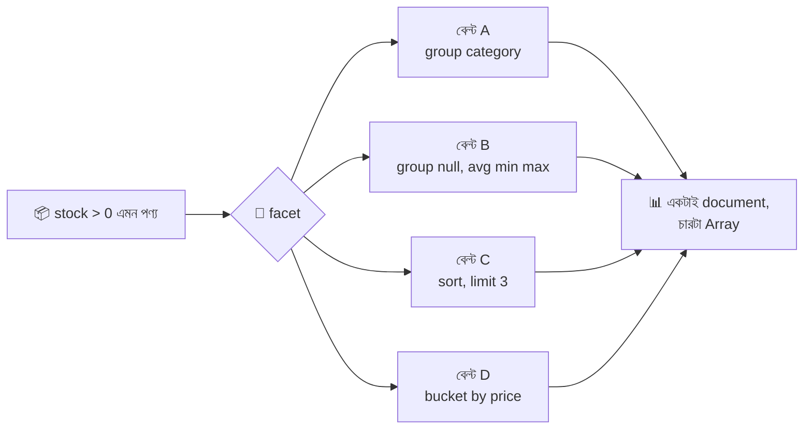

### উদাহরণ: দোকানের ড্যাশবোর্ড

```javascript
db.products.aggregate([
  { $match: { stock: { $gt: 0 } } },           // facet-এর আগে একবার ছেঁকে নিলাম: শুধু মজুদ আছে এমন পণ্য (ছেঁকে নেওয়া মালই সব শাখায় যাবে)

  {
    $facet: {                                  // $facet = প্রতিটা key একেকটা আলাদা বেল্ট (sub-pipeline), সবগুলো একই ইনপুট পায়

      byCategory: [                            // byCategory = বেল্ট A-র আউটপুট ফিল্ডের নাম
        { $group: { _id: "$category", count: { $sum: 1 } } }   // ক্যাটাগরি ধরে গোনা
      ],

      priceStats: [                            // priceStats = বেল্ট B
        {
          $group: {
            _id: null,                         // সব এক ঝুড়িতে
            avgPrice: { $avg: "$price" },      // গড় দাম
            minPrice: { $min: "$price" },      // সর্বনিম্ন দাম
            maxPrice: { $max: "$price" }       // সর্বোচ্চ দাম
          }
        }
      ],

      top3Expensive: [                         // top3Expensive = বেল্ট C
        { $sort: { price: -1 } },
        { $limit: 3 },
        { $project: { _id: 0, name: 1, price: 1 } }
      ],

      priceBuckets: [                          // priceBuckets = বেল্ট D
        {
          $bucket: {                           // $bucket = সংখ্যা-পরিসর ধরে ভাগ করার বিশেষ স্টেশন
            groupBy: "$price",                 // groupBy = কোন ফিল্ডের মান দিয়ে ভাগ
            boundaries: [0, 500, 2000, 10000], // boundaries = সীমারেখা: [0–৫০০), [৫০০–২০০০), [২০০০–১০০০০)। প্রথম সীমা অন্তর্ভুক্ত, শেষ সীমা বাদ
            default: "Other",                  // default = কোনো পরিসরে না পড়লে এই নামের ঝুড়িতে
            output: {                          // output = প্রতি পরিসরের ঝুড়িতে কী কী হিসাব হবে
              count: { $sum: 1 },              // কয়টা পণ্য
              names: { $push: "$name" }        // কোন কোন পণ্য
            }
          }
        }
      ]
    }
  }
]);
```

আউটপুট: **একটাই document**, যার ভেতরে চারটা Array:

```javascript
[
  {
    byCategory:    [ { _id: "Grocery", count: 2 }, { _id: "Beverage", count: 1 }, ... ],
    priceStats:    [ { _id: null, avgPrice: 1495.7, minPrice: 120, maxPrice: 3200 } ],
    top3Expensive: [ { name: "Rice Cooker", price: 3200 }, ... ],
    priceBuckets:  [ { _id: 0, count: 3, names: [...] }, { _id: 500, count: 2, names: [...] }, ... ]
  }
]
```

### 🔥 সবচেয়ে বহুল ব্যবহৃত: Pagination + মোট গণনা, একই query-তে

```javascript
const page = 2;                            // page = কোন পাতা
const limit = 3;                           // limit = প্রতি পাতায় কয়টা

db.products.aggregate([
  { $match: { stock: { $gt: 0 } } },       // ফিল্টার (পাতা-ভাগের আগে)
  { $sort: { price: 1, _id: 1 } },         // সাজানো (আবশ্যক)
  {
    $facet: {
      metadata: [ { $count: "total" } ],   // metadata = বেল্ট ১: মোট কয়টা পণ্য ফিল্টারে মিললো (পাতার সংখ্যা বের করতে লাগবে)
      data: [                              // data = বেল্ট ২: শুধু এই পাতার পণ্যগুলো
        { $skip: (page - 1) * limit },     // আগের পাতাগুলো ছেড়ে দাও
        { $limit: limit }                  // এই পাতার limit টা নাও
      ]
    }
  }
]);
// আউটপুট: [ { metadata: [ { total: 7 } ], data: [ ...৩টা পণ্য... ] } ]
```

### আরও দুটো ভাই-স্টেশন

```javascript
// $sortByCount = $group (গোনা) + $sort (বেশি আগে) একসাথে
db.products.aggregate([
  { $sortByCount: "$category" }       // প্রতিটা category-র সংখ্যা গুনে বেশি আগে সাজিয়ে দেয়: { _id: "Electronics", count: 3 } ...
]);

// $bucketAuto = সীমারেখা নিজে ঠিক না করে MongoDB-কে বলা "N টা সমান ভাগ করে দাও"
db.products.aggregate([
  { $bucketAuto: { groupBy: "$price", buckets: 3 } }   // buckets: 3 = দামের হিসাবে প্রায় সমান সংখ্যার ৩টা ঝুড়ি
]);
```

### ⚠️ `$facet`-এর সীমাবদ্ধতা

| সীমাবদ্ধতা | মানে |
|---|---|
| আউটপুট **একটাই document** | সব sub-pipeline-এর ফলাফল মিলিয়ে ১৬ MB ছাড়ালে error |
| `$facet`-এর **ভেতরে** index কাজ করে না | তাই `$match` কে `$facet`-এর **আগে** রাখুন |
| ভেতরে `$facet`, `$out`, `$merge`, `$geoNear`, `$indexStats` ইত্যাদি চলে না | |
| সব sub-pipeline একই ইনপুট পায় | একটার আউটপুট আরেকটার ইনপুট নয় |

---

## ১৬. Projection After Join — জোড়ার পর ছাঁটাই

### গল্প

`$lookup`-এর পর রসিদটা ফুলে ঢোল: ভেতরে পুরো `product` বাক্স, পুরো `customer` বাক্স, সব ফিল্ড। কিন্তু মালিক শুধু চান — **"কে, কী কিনলো, কত টাকার"**। তাই Join-এর ঠিক পরেই ছাঁটাইওয়ালা কাঁচি হাতে বসে যায়।

### ১) Join + ছাঁটাই (সম্পূর্ণ উদাহরণ)

```javascript
db.orders.aggregate([
  { $match: { status: "delivered" } },                     // আগে ছেঁকে নিলাম (Join-এর আগে বাক্স কমানো = দ্রুত)

  // Join ১: পণ্য
  { $lookup: { from: "products",  localField: "productId",  foreignField: "_id", as: "product"  } },
  { $unwind: "$product" },                                 // product Array → object, যাতে "product.name" লেখা যায়

  // Join ২: কাস্টমার
  { $lookup: { from: "customers", localField: "customerId", foreignField: "_id", as: "customer" } },
  { $unwind: "$customer" },                                // customer Array → object

  // ছাঁটাই ও সাজানো
  {
    $project: {
      _id: 0,                                              // অর্ডারের _id বাদ
      orderId: "$_id",                                     // orderId = অর্ডারের আইডি, যা এখন সুন্দর নামে (পুরোনো _id কে নতুন নামে রাখলাম)
      customerName: "$customer.name",                      // customerName = কাস্টমারের নাম। dot notation দিয়ে ভেতরের object-এর ফিল্ড
      city: "$customer.city",                              // city = কাস্টমারের শহর
      productName: "$product.name",                        // productName = পণ্যের নাম (products তাক থেকে আসা তথ্য!)
      category: "$product.category",                       // category = পণ্যের ধরন
      qty: 1,                                              // qty যেমন আছে
      lineTotal: { $multiply: ["$qty", "$unitPrice"] }     // lineTotal = qty × unitPrice (এই অর্ডারের মোট টাকা)
    }
  }
]);
```

আউটপুটের একটা:

```javascript
{ orderId: 1001, customerName: "Karim Uddin", city: "Dhaka", productName: "Miniket Rice 5kg", category: "Grocery", qty: 2, lineTotal: 960 }
```

### ২) `$unwind` ছাড়াই ছাঁটাই (Array থেকে সরাসরি তোলা)

```javascript
db.orders.aggregate([
  { $lookup: { from: "products", localField: "productId", foreignField: "_id", as: "product" } },
  {
    $project: {
      _id: 0,
      qty: 1,
      productName: { $arrayElemAt: ["$product.name", 0] }
      // "$product.name" = product Array-র প্রতিটা object-এর name নিয়ে একটা Array ["Miniket Rice 5kg"]
      // $arrayElemAt: [..., 0] = সেই Array-র প্রথম মান। ফলে সরাসরি "Miniket Rice 5kg" পাই
    }
  }
]);
```

### ৩) `$mergeObjects` — দুটো object এক করা (Flatten)

```javascript
db.orders.aggregate([
  { $lookup: { from: "products", localField: "productId", foreignField: "_id", as: "product" } },
  { $unwind: "$product" },
  {
    $replaceRoot: {                           // $replaceRoot = পুরো বাক্সের বদলে অন্য একটা object-কেই নতুন বাক্স বানিয়ে ফেলে
      newRoot: {
        $mergeObjects: [                      // $mergeObjects = একাধিক object একটাতে মেশায় (একই key থাকলে পরেরটা জেতে)
          "$product",                         // প্রথমে পণ্যের সব ফিল্ড (name, price, category ...)
          { orderId: "$_id", qty: "$qty" }    // তারপর অর্ডারের দুটো ফিল্ড মিশিয়ে দিলাম (নতুন object literal)
        ]
      }
    }
  }
]);
```

### ৪) `$lookup`-এর ভেতরেই ছাঁটাই (সবচেয়ে দক্ষ)

`pipeline` রূপে ভেতরেই `$project` দিলে অপ্রয়োজনীয় ফিল্ড কখনো orders বাক্সে ঢোকেই না — মেমরি বাঁচে:

```javascript
db.orders.aggregate([
  {
    $lookup: {
      from: "products",
      localField: "productId",
      foreignField: "_id",
      pipeline: [ { $project: { _id: 0, name: 1, category: 1 } } ],
      // MongoDB ৫.০+ : localField/foreignField এর সাথে pipeline একসাথে দেওয়া যায়
      // pipeline = পাশের গুদাম থেকে আসার সময়ই শুধু name ও category রাখো
      as: "product"
    }
  },
  { $unwind: "$product" }
]);
```

| কোথায় ছাঁটাই | কখন ভালো |
|---|---|
| `$lookup`-এর ভেতরের `pipeline`-এ | বড় বড় document জোড়ার সময় — মেমরি কম লাগে |
| `$lookup`-এর পরে `$project` | ছোট ডেটা বা সহজ কাজে |
| সবশেষে একবার | রিপোর্টের চূড়ান্ত আকার ঠিক করতে |

---

## ১৭. Add New Field With Result — নতুন স্টিকার লাগানো

### গল্প

কনভেয়ারে চলতে থাকা বাক্সে আপনি **নতুন স্টিকার** লাগাতে চান — যেমন "লাইন-টোটাল", "ভ্যাটসহ দাম", "অর্ডার সংখ্যা" — কিন্তু **পুরোনো লেবেলগুলো যেন না হারায়**। এই স্টেশনের নাম `$addFields` (ছোট নাম `$set`)।

> `$project` রাখা/ফেলার কাজ করে (বাকি ফিল্ড হারাতে পারে)। `$addFields` **শুধু যোগ করে**, বাকি সব অক্ষত রাখে।

### ১) সোজা হিসাব থেকে নতুন ফিল্ড

```javascript
db.orders.aggregate([
  {
    $addFields: {
      lineTotal: { $multiply: ["$qty", "$unitPrice"] },   // lineTotal = নতুন ফিল্ড = qty × unitPrice (প্রতিটা অর্ডারের মোট)
      isBulk: { $gte: ["$qty", 10] }                      // isBulk = নতুন ফিল্ড = qty ১০ বা বেশি হলে true নয়তো false
    }
  }
]);
// প্রতিটা বাক্সে আগের সব ফিল্ড + lineTotal + isBulk
```

### ২) Join-এর ফলাফল থেকে নতুন ফিল্ড

```javascript
db.customers.aggregate([
  { $lookup: { from: "orders", localField: "_id", foreignField: "customerId", as: "orders" } },
  {
    $addFields: {
      totalOrders: { $size: "$orders" },                  // totalOrders = Join করে আনা orders Array-তে কয়টা উপাদান
      totalSpent: {                                       // totalSpent = ওই কাস্টমারের সব অর্ডারের টাকার যোগফল
        $sum: {
          $map: {                                         // $map = Array-র প্রতিটা উপাদানের উপর একটা হিসাব চালিয়ে নতুন Array বানায়
            input: "$orders",                             // input = কোন Array-র উপর চালাবো
            as: "o",                                      // as = ভেতরে প্রতিটা উপাদানকে যে নামে ডাকবো (এখানে "o", ব্যবহার করবো $$o লিখে)
            in: { $multiply: ["$$o.qty", "$$o.unitPrice"] } // in = প্রতিটা উপাদানে কী হিসাব হবে: qty × unitPrice
          }
        }                                                 // $sum তখন ওই নতুন Array-র সংখ্যাগুলো যোগ করে
      }
    }
  },
  { $project: { _id: 0, name: 1, totalOrders: 1, totalSpent: 1 } }
]);
```

### ৩) Group-এর পরে নতুন ফিল্ড (শতাংশ বের করা)

```javascript
db.orders.aggregate([
  { $match: { status: "delivered" } },
  { $group: { _id: "$payment", revenue: { $sum: { $multiply: ["$qty", "$unitPrice"] } } } },
  // ধাপ ১: payment-ভিত্তিক revenue পেলাম (bKash 10160, card 2500, cash 1440)

  {
    $setWindowFields: {                          // সব ঝুড়ির মোট বের করার জন্য জানালা (৫.০+)
      output: { grandTotal: { $sum: "$revenue" } }  // grandTotal = সব ঝুড়ির revenue-র যোগফল, প্রতিটা ঝুড়ির পাশে বসবে
    }
  },
  {
    $addFields: {
      percent: {                                 // percent = এই ঝুড়ি মোট বিক্রির কত শতাংশ
        $round: [{ $multiply: [{ $divide: ["$revenue", "$grandTotal"] }, 100] }, 1]
        // ভেতর থেকে: revenue ÷ grandTotal → × ১০০ → এক দশমিকে গোল
      }
    }
  },
  { $project: { grandTotal: 0 } }                // grandTotal আর দরকার নেই, ফেলে দিলাম
]);
```

### ৪) বিদ্যমান ফিল্ডের মান বদলানো ও নেস্টেড ফিল্ডে যোগ

```javascript
db.products.aggregate([
  {
    $addFields: {
      price: { $round: [{ $multiply: ["$price", 1.1] }, 0] },  // বিদ্যমান "price" ফিল্ডের নামেই নতুন মান দিলে সেটা ওভাররাইট হয় (১০% দাম বাড়ালাম)
      "meta.priceUpdated": true                                 // "meta.priceUpdated" = dot notation দিয়ে meta নামের ভেতরের object-এ নতুন ফিল্ড (meta না থাকলে নিজেই তৈরি)
    }
  }
]);
```

### ৫) শর্তসাপেক্ষ নতুন ফিল্ড

```javascript
db.products.aggregate([
  {
    $addFields: {
      priceTag: {                                              // priceTag = দাম অনুযায়ী লেবেল
        $switch: {
          branches: [
            { case: { $lt: ["$price", 500] },  then: "Budget" },   // দাম < ৫০০ হলে "Budget"
            { case: { $lt: ["$price", 2000] }, then: "Standard" }  // দাম < ২০০০ হলে "Standard"
          ],
          default: "Premium"                                        // বাকি সবার জন্য "Premium"
        }
      }
    }
  }
]);
```

> 📌 `$set` আর `$addFields` **হুবহু একই কাজ করে**। `$set` ছোট ও আপডেট-কমান্ডের সাথে পরিচিত নাম, `$addFields` বেশি বর্ণনামূলক। দুটোর যেকোনো একটা বেছে নিন, তবে একই প্রজেক্টে একটাই ধরে রাখুন।

---

## ১৮. Arithmetic Aggregation Operators — হিসাবের যন্ত্র

### গল্প

বেল্টের প্রতিটা স্টেশনে একটা **ক্যালকুলেটর যন্ত্র** লাগানো আছে। যন্ত্রগুলো `$project`, `$addFields`, `$group`-এর ভেতরে `{ $যন্ত্র: [ইনপুট১, ইনপুট২] }` আকারে বসে।

### যন্ত্র তালিকা

| Operator | কাজ | উদাহরণ | ফল |
|---|---|---|---|
| `$add` | যোগ | `{ $add: [10, 5] }` | `15` |
| `$subtract` | বিয়োগ (প্রথম − দ্বিতীয়) | `{ $subtract: [10, 4] }` | `6` |
| `$multiply` | গুণ | `{ $multiply: [3, 4] }` | `12` |
| `$divide` | ভাগ (প্রথম ÷ দ্বিতীয়) | `{ $divide: [10, 4] }` | `2.5` |
| `$mod` | ভাগশেষ | `{ $mod: [10, 3] }` | `1` |
| `$abs` | পরম মান | `{ $abs: -7 }` | `7` |
| `$ceil` | উপরের পূর্ণসংখ্যা | `{ $ceil: 2.1 }` | `3` |
| `$floor` | নিচের পূর্ণসংখ্যা | `{ $floor: 2.9 }` | `2` |
| `$round` | গোল করা | `{ $round: [3.14159, 2] }` | `3.14` |
| `$trunc` | দশমিক কেটে ফেলা | `{ $trunc: [3.99, 0] }` | `3` |
| `$pow` | ঘাত | `{ $pow: [2, 3] }` | `8` |
| `$sqrt` | বর্গমূল | `{ $sqrt: 16 }` | `4` |
| `$exp` | e-র ঘাত | `{ $exp: 1 }` | `2.718...` |
| `$ln` | স্বাভাবিক লগ | `{ $ln: 1 }` | `0` |
| `$log` | যেকোনো ভিত্তির লগ | `{ $log: [100, 10] }` | `2` |
| `$log10` | ১০-ভিত্তিক লগ | `{ $log10: 1000 }` | `3` |

### কর্মীদের বেতনের হিসাব

```javascript
db.employees.aggregate([
  {
    $project: {
      _id: 0,
      name: 1,
      salary: 1,
      bonus: { $ifNull: ["$bonus", 0] },
      // $ifNull: [মান, বিকল্প] = মান না থাকলে (null/অনুপস্থিত) বিকল্প ০ বসাও। কারণ Chitra-র bonus নেই; $add-এ null পড়লে পুরো ফল null হয়ে যেত

      totalPay: { $add: ["$salary", { $ifNull: ["$bonus", 0] }] },
      // totalPay = বেতন + বোনাস (বোনাস না থাকলে ০)

      bonusPercent: {
        $round: [
          { $multiply: [{ $divide: [{ $ifNull: ["$bonus", 0] }, "$salary"] }, 100] },
          1
        ]
      },
      // bonusPercent = (বোনাস ÷ বেতন) × ১০০ = বোনাস বেতনের কত শতাংশ, এক দশমিকে গোল
      // ভেতর থেকে পড়ুন: $divide → $multiply → $round

      annualSalary: { $multiply: ["$salary", 12] },        // annualSalary = ১২ মাসের বেতন
      afterTax: { $subtract: ["$salary", { $multiply: ["$salary", 0.05] }] }
      // afterTax = বেতন − ৫% কর। $subtract: [A, B] = A − B
    }
  }
]);
```

### বেজোড়/জোড় বের করা (`$mod`)

```javascript
db.orders.aggregate([
  {
    $project: {
      _id: 1,
      parity: { $mod: ["$_id", 2] }   // parity = _id কে ২ দিয়ে ভাগ করলে ভাগশেষ: ০ হলে জোড়, ১ হলে বেজোড়
    }
  }
]);
```

### তারিখের সাথে যোগ-বিয়োগ (বিশেষ নিয়ম)

```javascript
db.orders.aggregate([
  {
    $project: {
      _id: 1,
      deliveryDue: { $add: ["$orderDate", 3 * 24 * 60 * 60 * 1000] },
      // তারিখের সাথে $add করলে সংখ্যাটাকে মিলিসেকেন্ড ধরা হয়। এখানে ৩ দিন = ৩ × ২৪ ঘণ্টা × ৬০ মিনিট × ৬০ সেকেন্ড × ১০০০ মিলিসেকেন্ড
      // (পরিষ্কার উপায় আছে — $dateAdd, ২০ নম্বর সেকশনে)

      ageMs: { $subtract: ["$$NOW", "$orderDate"] }
      // $$NOW = এখনকার সময় (System Variable)। তারিখ − তারিখ = পার্থক্য মিলিসেকেন্ডে
    }
  }
]);
```

### ⚠️ সাবধানতা

| ফাঁদ | সমাধান |
|---|---|
| ফিল্ড না থাকলে / `null` হলে ফল `null` | `$ifNull` দিয়ে ডিফল্ট দিন |
| ০ দিয়ে ভাগ (`$divide: [x, 0]`) → error | আগে `$cond` দিয়ে হর ০ কিনা যাচাই করুন |
| `$add` এ String দিলে error | `$toInt`, `$toDouble` দিয়ে রূপান্তর করুন |
| `$sum` আর `$add` গুলিয়ে ফেলা | `$sum` অ-সংখ্যাকে ০ ধরে; `$add`-এ null পড়লে ফলই null |
| দশমিকের ভাসমান-বিন্দুর ত্রুটি (`0.1 + 0.2`) | টাকা-পয়সার হিসাবে `Decimal128` অথবা পয়সায় (পূর্ণসংখ্যায়) রাখুন, শেষে `$round` |

---

## ১৯. String Aggregation Operators — লেখা কাটাছেঁড়ার যন্ত্র

### গল্প

কিছু বাক্সে নাম আছে, ইমেইল আছে — ওগুলো **কাটা, জোড়া, বড়-ছোট হাতের করা** দরকার। এজন্য স্টেশনে বসানো হলো **লেখা-কাটাছেঁড়া যন্ত্র** — String Operators।

### যন্ত্র তালিকা

| Operator | কাজ | উদাহরণ | ফল |
|---|---|---|---|
| `$concat` | জোড়া লাগানো | `{ $concat: ["Mr. ", "$name"] }` | `"Mr. Karim Uddin"` |
| `$toUpper` | বড় হাতের | `{ $toUpper: "dhaka" }` | `"DHAKA"` |
| `$toLower` | ছোট হাতের | `{ $toLower: "DHAKA" }` | `"dhaka"` |
| `$substrCP` | অংশ কাটা (Unicode-নিরাপদ) | `{ $substrCP: ["Karim", 0, 3] }` | `"Kar"` |
| `$substrBytes` | অংশ কাটা (বাইট হিসাবে) | — | — |
| `$strLenCP` | অক্ষর সংখ্যা | `{ $strLenCP: "Karim" }` | `5` |
| `$trim` / `$ltrim` / `$rtrim` | দুই পাশ / বাঁ / ডান থেকে ফাঁকা বাদ | `{ $trim: { input: "  hi  " } }` | `"hi"` |
| `$split` | ভাগ করে Array | `{ $split: ["a@b.com", "@"] }` | `["a", "b.com"]` |
| `$indexOfCP` | কোথায় আছে (index) | `{ $indexOfCP: ["a@b.com", "@"] }` | `1` |
| `$replaceOne` | প্রথম মিল বদলানো (৪.৪+) | — | — |
| `$replaceAll` | সব মিল বদলানো (৪.৪+) | — | — |
| `$regexMatch` / `$regexFind` / `$regexFindAll` | regex মেলানো (৪.২+) | — | — |
| `$strcasecmp` | case-insensitive তুলনা | `{ $strcasecmp: ["abc", "ABC"] }` | `0` |
| `$toString` | অন্য টাইপ → String | `{ $toString: "$_id" }` | `"101"` |

### কাস্টমার-তালিকা সাজানো

```javascript
db.customers.aggregate([
  {
    $project: {
      _id: 0,

      displayName: { $concat: ["Mr/Ms. ", "$name"] },
      // displayName = "Mr/Ms. " + নাম। $concat শুধু String জোড়ে; কোনো মান null হলে পুরো ফল null

      cityUpper: { $toUpper: "$city" },                 // cityUpper = শহরের নাম বড় হাতের অক্ষরে ("DHAKA")

      emailLower: { $toLower: "$email" },               // emailLower = ইমেইল ছোট হাতের অক্ষরে (সার্চ ও তুলনা সহজ করার জন্য)

      initials: { $substrCP: ["$name", 0, 1] },
      // initials = নামের প্রথম অক্ষর। $substrCP: [লেখা, শুরুর index (০ থেকে), কয়টা অক্ষর]

      nameLength: { $strLenCP: "$name" },               // nameLength = নামে মোট কয়টা অক্ষর (ফাঁকাসহ)

      emailDomain: {                                    // emailDomain = ইমেইলের @ এর পরের অংশ
        $arrayElemAt: [{ $split: ["$email", "@"] }, 1]
        // $split: ["karim@example.com", "@"] → ["karim", "example.com"]
        // $arrayElemAt: [Array, 1] → index ১ = "example.com"
      },

      firstName: { $arrayElemAt: [{ $split: ["$name", " "] }, 0] }
      // firstName = নামকে ফাঁকা (স্পেস) দিয়ে ভেঙে প্রথম অংশ ("Karim")
    }
  }
]);
```

### বদলানো (Replace) আর পরিষ্কার (Trim)

```javascript
db.products.aggregate([
  {
    $project: {
      _id: 0,
      slug: {                                                   // slug = URL-এ ব্যবহারের উপযোগী নাম
        $replaceAll: {                                          // $replaceAll = input-এর সব find মিলকে replacement দিয়ে বদলাও
          input: { $toLower: "$name" },                         // input = আগে নামকে ছোট হাতের করলাম
          find: " ",                                            // find = যা খুঁজবো (স্পেস)
          replacement: "-"                                      // replacement = যা বসাবো (হাইফেন) → "miniket-rice-5kg"
        }
      },
      cleanBrand: { $trim: { input: "$brand" } }                // cleanBrand = brand-এর দুই পাশের বাড়তি ফাঁকা মুছে ফেলা
    }
  }
]);
```

### `$regexFind` — প্যাটার্ন ধরে অংশ বের করা

```javascript
db.products.aggregate([
  {
    $project: {
      _id: 0,
      name: 1,
      weight: {
        $regexFind: {
          input: "$name",                  // input = কোন লেখায় খুঁজবো
          regex: /\d+(kg|L|ml)/i           // regex = সংখ্যা + একক (যেমন "5kg", "2L", "500ml")
        }
        // ফলাফল object: { match: "5kg", idx: 14, captures: [...] } অথবা না মিললে null
      }
    }
  }
]);
```

### 🚨 মনে রাখুন

| ফাঁদ | সমাধান |
|---|---|
| `$concat`-এ `null` পড়লে পুরো ফল `null` | `$ifNull: ["$field", ""]` দিয়ে ফাঁকা String বসান |
| `$concat`-এ সংখ্যা দিলে error | `{ $toString: "$price" }` দিয়ে আগে String করুন |
| বাংলা/ইউনিকোড অক্ষর কাটতে `$substr` (বাইট) | **`$substrCP`** ব্যবহার করুন (Code Point গোনে) |
| `$toUpper` বাংলায় কিছু করে না | বাংলায় বড়/ছোট হাতের ধারণা নেই — ইংরেজি/ল্যাটিনে কাজ করে |

---

## ২০. Date Aggregation Operators — ক্যালেন্ডার যন্ত্র

### গল্প

রসিদে `orderDate: ISODate("2025-09-20T18:00:00Z")` লেখা। মালিক জানতে চান **"মাস ভিত্তিক বিক্রি"**, **"কোন বারে সবচেয়ে বেশি অর্ডার"**, **"কর্মী কত বছর ধরে আছে"**। স্টেশনে বসানো হলো **ক্যালেন্ডার যন্ত্র** — Date Operators।

### যন্ত্র তালিকা

| Operator | কী দেয় | উদাহরণ ফল (`2025-09-20T18:00Z`) |
|---|---|---|
| `$year` | বছর | `2025` |
| `$month` | মাস (১–১২) | `9` |
| `$dayOfMonth` | মাসের কত তারিখ (১–৩১) | `20` |
| `$dayOfWeek` | সপ্তাহের কত নম্বর দিন (**১ = রবিবার**, ৭ = শনিবার) | `7` (শনিবার) |
| `$dayOfYear` | বছরের কত তম দিন (১–৩৬৬) | `263` |
| `$hour` / `$minute` / `$second` / `$millisecond` | সময়ের অংশ | `18` / `0` / `0` / `0` |
| `$week` | সপ্তাহ নম্বর (রবিবার থেকে শুরু) | — |
| `$isoWeek` / `$isoWeekYear` / `$isoDayOfWeek` | ISO সপ্তাহ (সোমবার থেকে; সোম = ১) | — |
| `$dateToString` | Date → String (ফরম্যাটসহ) | `"2025-09-20"` |
| `$dateFromString` | String → Date | — |
| `$dateToParts` / `$dateFromParts` | Date ↔ অংশের object | — |
| `$dateAdd` / `$dateSubtract` | তারিখে যোগ/বিয়োগ (৫.০+) | — |
| `$dateDiff` | দুই তারিখের ফারাক (৫.০+) | — |
| `$dateTrunc` | তারিখ ছাঁটা (মাসের শুরু ইত্যাদি) (৫.০+) | — |
| `$toDate` | যেকোনো কিছু → Date | — |
| `$$NOW` | এখনকার সময় (System Variable) | — |

> 🕒 **টাইমজোন সাবধানতা:** MongoDB তারিখ সবসময় **UTC**-তে রাখে। আমরা ঢাকায় (UTC+৬) — রাত ১১টার পর অর্ডার UTC-তে পরদিনের তারিখ দেখাতে পারে। তাই গ্রুপ করার সময় `timezone: "Asia/Dhaka"` দিন।

### ১) মাস-ভিত্তিক বিক্রির রিপোর্ট

```javascript
db.orders.aggregate([
  { $match: { status: "delivered" } },
  {
    $group: {
      _id: {
        $dateToString: {                    // $dateToString = Date কে ফরম্যাট করা String বানায়
          format: "%Y-%m",                  // format = কেমন চেহারা চাই: %Y = ৪ অঙ্কের বছর, %m = ২ অঙ্কের মাস → "2025-09"
          date: "$orderDate",               // date = কোন Date ফিল্ডকে ফরম্যাট করবো
          timezone: "Asia/Dhaka"            // timezone = কোন সময়-অঞ্চলে তারিখ বের করবো (বাংলাদেশ)
        }
      },
      monthlyRevenue: { $sum: { $multiply: ["$qty", "$unitPrice"] } },  // monthlyRevenue = ওই মাসের মোট বিক্রি
      orders: { $sum: 1 }                                              // orders = ওই মাসে কয়টা অর্ডার
    }
  },
  { $sort: { _id: 1 } }                     // _id-তে "2025-08" ধরনের লেখা, তাই সাজালে মাস-ক্রমে আসে
]);
```

### ২) তারিখের আলাদা অংশ

```javascript
db.orders.aggregate([
  {
    $project: {
      _id: 1,
      year: { $year: "$orderDate" },                                  // year = বছর
      month: { $month: "$orderDate" },                                // month = মাস (১–১২)
      day: { $dayOfMonth: "$orderDate" },                             // day = মাসের তারিখ
      weekday: { $dayOfWeek: "$orderDate" },                          // weekday = ১ (রবি) থেকে ৭ (শনি)
      hour: { $hour: { date: "$orderDate", timezone: "Asia/Dhaka" } } // hour = ঢাকার সময়ে ঘণ্টা (timezone দিতে হলে object রূপে লিখতে হয়)
    }
  }
]);
```

### ৩) কোন বারে সবচেয়ে বেশি অর্ডার?

```javascript
db.orders.aggregate([
  {
    $group: {
      _id: { $dayOfWeek: "$orderDate" },       // দিন-নম্বর ধরে ঝুড়ি (১ = রবি ... ৭ = শনি)
      orders: { $sum: 1 }
    }
  },
  { $sort: { orders: -1 } }
]);
```

### ৪) `$dateAdd`, `$dateSubtract`, `$dateDiff` (৫.০+)

```javascript
db.orders.aggregate([
  {
    $project: {
      _id: 1,
      deliveryDue: {
        $dateAdd: {
          startDate: "$orderDate",   // startDate = কোন তারিখ থেকে শুরু
          unit: "day",               // unit = কোন একক (year, quarter, month, week, day, hour, minute, second)
          amount: 3                  // amount = কত একক যোগ → অর্ডারের ৩ দিন পর ডেলিভারির শেষ তারিখ
        }
      },
      returnDeadline: {
        $dateSubtract: { startDate: "$$NOW", unit: "day", amount: 7 }
        // $dateSubtract = বিয়োগ। এখন থেকে ৭ দিন আগের তারিখ (এখানে অর্ডারের সাথে সম্পর্ক নেই, কেবল ব্যবহার দেখাচ্ছি)
      },
      daysSinceOrder: {
        $dateDiff: {
          startDate: "$orderDate",   // startDate = শুরুর তারিখ (অর্ডারের দিন)
          endDate: "$$NOW",          // endDate   = শেষের তারিখ (আজ)
          unit: "day"                // unit      = ফলাফল কোন এককে চাই → অর্ডারের পর কত দিন কেটেছে
        }
      }
    }
  }
]);
```

### ৫) কর্মী কত বছর ধরে আছে (Tenure)

```javascript
db.employees.aggregate([
  {
    $project: {
      _id: 0,
      name: 1,
      yearsWorked: {
        $dateDiff: { startDate: "$joinDate", endDate: "$$NOW", unit: "year" }
        // yearsWorked = যোগদানের তারিখ থেকে আজ পর্যন্ত কত পূর্ণ বছর
      }
    }
  }
]);
```

### ৬) `$dateTrunc` — মাসের শুরুর তারিখে নামিয়ে আনা (৫.০+)

```javascript
db.orders.aggregate([
  {
    $group: {
      _id: { $dateTrunc: { date: "$orderDate", unit: "month", timezone: "Asia/Dhaka" } },
      // $dateTrunc = তারিখকে নির্দিষ্ট এককের শুরুতে ছাঁটে। এখানে unit: "month" → প্রতিটা তারিখ হয়ে যায় ওই মাসের ১ তারিখ ০০:০০
      // ফলে _id একটা আসল Date থাকে (String নয়), তাই পরে Date হিসেবেই সাজানো/ব্যবহার করা যায়
      revenue: { $sum: { $multiply: ["$qty", "$unitPrice"] } }
    }
  },
  { $sort: { _id: 1 } }
]);
```

### ৭) String ↔ Date রূপান্তর

```javascript
db.orders.aggregate([
  {
    $project: {
      _id: 0,
      parsed: {
        $dateFromString: {
          dateString: "2025-12-25",     // dateString = যে লেখাকে Date বানাবো
          format: "%Y-%m-%d",           // format = লেখাটা কোন ছাঁদে লেখা (বছর-মাস-দিন)
          timezone: "Asia/Dhaka"        // timezone = লেখার সময় কোন অঞ্চলের
        }
      },
      partsObj: { $dateToParts: { date: "$orderDate" } }
      // $dateToParts → { year: 2025, month: 8, day: 1, hour: 10, minute: 0, second: 0, millisecond: 0 }
    }
  }
]);
```

### Format চিহ্নের চিটশিট (`$dateToString`)

| চিহ্ন | মানে | উদাহরণ |
|---|---|---|
| `%Y` | বছর | `2025` |
| `%m` | মাস (০১–১২) | `09` |
| `%d` | দিন (০১–৩১) | `20` |
| `%H` | ঘণ্টা (০০–২৩) | `18` |
| `%M` | মিনিট | `05` |
| `%S` | সেকেন্ড | `30` |
| `%j` | বছরের দিন-নম্বর | `263` |
| `%w` | সপ্তাহের দিন (১ = রবি) | `7` |
| `%U` | সপ্তাহ নম্বর | `37` |
| `%b` | মাসের সংক্ষিপ্ত নাম (৮.০+) | `Sep` |

---

## ২১. Comparison Aggregation Operators — তুলনার দাঁড়িপাল্লা

### গল্প

দুটো জিনিস **দাঁড়িপাল্লায়** চাপিয়ে দেখা — কোনটা ভারী? পাল্লা শুধু **`true` বা `false`** (অথবা `-1/0/1`) বলে দেয়। Aggregation-এ এগুলোই Comparison Operators।

### তালিকা

| Operator | মানে | `{ $op: [A, B] }` কখন `true` |
|---|---|---|
| `$eq` | সমান | A = B |
| `$ne` | সমান নয় | A ≠ B |
| `$gt` | বড় | A > B |
| `$gte` | বড় বা সমান | A ≥ B |
| `$lt` | ছোট | A < B |
| `$lte` | ছোট বা সমান | A ≤ B |
| `$cmp` | তুলনা করে সংখ্যা দেয় | A < B → `-1`, A = B → `0`, A > B → `1` |

### 🔑 দুই রকম `$gt`: **Query Operator** বনাম **Aggregation Operator**

| | Query Operator | Aggregation Operator |
|---|---|---|
| কোথায় | `$match`-এর ফিল্টারে | `$project`, `$addFields`, `$group`, `$expr`-এর ভেতরে |
| লেখার ধরন | `{ price: { $gt: 1000 } }` | `{ $gt: ["$price", 1000] }` |
| ফিল্ড কীভাবে | ফিল্ডের নাম সরাসরি (`price`) | `"$price"` (Field Path, ডলারসহ) |
| দুটো ফিল্ড তুলনা | ❌ পারে না | ✅ পারে |
| কী ফেরত দেয় | বাক্স ফিল্টার করে | `true`/`false` মান (নতুন ফিল্ডে বসানো যায়) |

### উদাহরণ

```javascript
// ১) নতুন Boolean ফিল্ড বানানো
db.products.aggregate([
  {
    $project: {
      _id: 0,
      name: 1,
      price: 1,
      isExpensive: { $gt: ["$price", 1000] },       // isExpensive = দাম ১০০০-এর বেশি হলে true
      isOutOfStock: { $eq: ["$stock", 0] },         // isOutOfStock = মজুদ ঠিক ০ হলে true
      isNotElectronics: { $ne: ["$category", "Electronics"] }, // electronics নয় হলে true
      comparedToAvg: { $cmp: ["$price", 1500] }     // comparedToAvg = ১৫০০-এর সাথে তুলনা: -১ (কম), ০ (সমান), ১ (বেশি)
    }
  }
]);

// ২) $expr-এর ভেতরে দুটো ফিল্ডের তুলনা (সবচেয়ে কাজের ব্যবহার)
db.employees.aggregate([
  {
    $match: {
      $expr: { $gt: ["$salary", { $multiply: ["$bonus", 8] }] }
      // $expr দিয়ে $match-এর ভেতরে aggregation operator চালালাম
      // বেতন > বোনাস × ৮ কিনা (এক ফিল্ড অন্য ফিল্ডের সাথে তুলনা)
    }
  }
]);

// ৩) দুই ফিল্ড তুলনা করে জানা: অর্ডারের qty ≤ মজুদ ছিল কিনা (Join-এর পর)
db.orders.aggregate([
  { $lookup: { from: "products", localField: "productId", foreignField: "_id", as: "p" } },
  { $unwind: "$p" },
  {
    $project: {
      _id: 1,
      qty: 1,
      currentStock: "$p.stock",                        // currentStock = পণ্যের বর্তমান মজুদ (products তাক থেকে আনা)
      canRepeat: { $lte: ["$qty", "$p.stock"] }        // canRepeat = আবার একই পরিমাণ অর্ডার এলে মজুদ কুলাবে কি না
    }
  }
]);
```

### 🧠 জেনে রাখুন

- **ভিন্ন টাইপের তুলনা:** MongoDB-তে BSON টাইপের একটা নির্দিষ্ট ক্রম আছে (`null < সংখ্যা < String < Object < Array < ... < Date`)। তাই `"5"` আর `5` সমান নয়।
- **`$max`/`$min` vs `$gt`:** `$max: [a, b]` (Array আকারে, `$project`-এ) দুটোর বড়টা দেয় — এটা তুলনা-সংক্রান্ত আরেকটা সহজ উপায়।
- **`null` তুলনা:** অনুপস্থিত ফিল্ড (`missing`) আর `null` তুলনায় আলাদা আচরণ করতে পারে। `$ifNull` দিয়ে আগে ডিফল্ট বসান।

---

## ২২. Boolean Aggregation Operators — হ্যাঁ/না-র সুইচ

### গল্প

কিছু স্টেশনে **সুইচবোর্ড** বসানো — একাধিক "হ্যাঁ/না" ইনপুট মিলিয়ে একটা চূড়ান্ত "হ্যাঁ/না" বের করে। তিনটা সুইচ আছে: **AND**, **OR**, **NOT**।

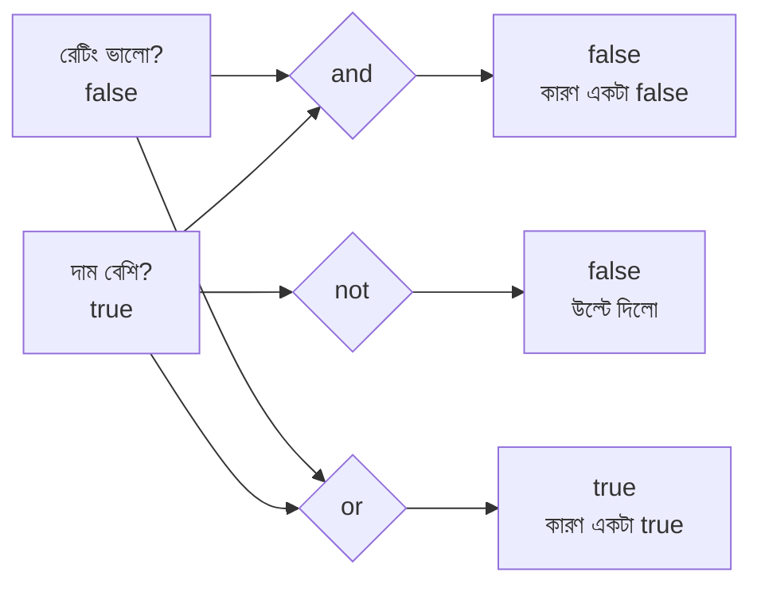

### তালিকা

| Operator | মানে | কখন `true` | উদাহরণ |
|---|---|---|---|
| `$and` | সবগুলো সত্য | **সব** ইনপুট true | `{ $and: [A, B, C] }` |
| `$or` | যেকোনো একটা সত্য | **অন্তত একটা** true | `{ $or: [A, B] }` |
| `$not` | উল্টে দাও | ইনপুট false হলে | `{ $not: [A] }` (Array-র ভেতরে একটাই expression) |

> 🚨 **`$not` লেখার নিয়ম:** Aggregation-এ `$not` সবসময় **Array** চায়: `{ $not: [ expression ] }`। Query-তে যেটা `{ field: { $not: ... } }`, সেটা আলাদা জিনিস।

### উদাহরণ

```javascript
db.products.aggregate([
  {
    $project: {
      _id: 0,
      name: 1,

      isPremium: {
        $and: [                                  // $and = সবগুলো শর্ত সত্য হলে তবেই true
          { $gt: ["$price", 1000] },             // শর্ত ১: দাম ১০০০-এর বেশি
          { $gte: ["$rating", 4.4] }             // শর্ত ২: রেটিং ৪.৪ বা বেশি
        ]
      },                                         // isPremium = দামি এবং ভালো রেটিংয়ের পণ্য

      needsAttention: {
        $or: [                                   // $or = যেকোনো একটা শর্ত সত্য হলেই true
          { $eq: ["$stock", 0] },                // শর্ত ১: মজুদ শেষ
          { $lt: ["$rating", 4.0] }              // শর্ত ২: রেটিং ৪.০-এর কম
        ]
      },                                         // needsAttention = ম্যানেজারের নজর দরকার এমন পণ্য

      isAvailable: { $not: [{ $eq: ["$stock", 0] }] }
      // isAvailable = মজুদ শূন্য নয়। (মজুদ == ০) এর উল্টো
    }
  }
]);
```

### `$match`-এর ভেতরে `$expr` দিয়ে

```javascript
db.employees.aggregate([
  {
    $match: {
      $expr: {
        $and: [
          { $eq: ["$isActive", true] },                      // এখনো চাকরিতে আছে
          { $or: [                                           // এবং
              { $eq: ["$department", "IT"] },                // IT বিভাগে
              { $gte: ["$salary", 50000] }                   // অথবা বেতন ৫০০০০ বা বেশি
          ] }
        ]
      }
    }
  }
]);
```

### 🧠 Truthiness — কোনটা `true`, কোনটা `false`?

Boolean operators-এ Boolean ছাড়া অন্য মান দিলে MongoDB এভাবে বোঝে:

| মান | ফল |
|---|---|
| `false`, `null`, `0`, `undefined` / অনুপস্থিত | **false** |
| `true`, যেকোনো **অ-শূন্য** সংখ্যা, যেকোনো String (এমনকি `""`), যেকোনো Array/Object | **true** |

> ⚠️ ফাঁদ: ফাঁকা String `""` এবং ফাঁকা Array `[]` — দুটোই **true**!

### আরও Boolean-সংশ্লিষ্ট যন্ত্র (Set Operators)

| Operator | কাজ |
|---|---|
| `$anyElementTrue: [Array]` | Array-র যেকোনো একটা উপাদান true হলে true |
| `$allElementsTrue: [Array]` | Array-র সব উপাদান true হলে true |
| `$in: [মান, Array]` | মান Array-তে আছে কি না (Aggregation রূপ) |
| `$toBool` | যেকোনো মান → Boolean |

```javascript
db.products.aggregate([
  { $project: { _id: 0, name: 1, hasRiceTag: { $in: ["rice", "$tags"] } } }
  // $in: [খুঁজবো কী, কোন Array-তে] = "rice" শব্দটা tags Array-তে আছে কি না → true/false
]);
```

---

## ২৩. Conditional Aggregation Operators — "যদি... তাহলে..." স্টেশন

### গল্প

বেল্টের শেষ প্রান্তে **সিদ্ধান্ত-নেওয়া স্টেশন**: "যদি এই শর্ত মেলে, তাহলে এই লেবেল লাগাও; নইলে ওই লেবেল।" তিন রকম সিদ্ধান্ত-যন্ত্র:

| Operator | কাজ | প্রোগ্রামিং-এ সমতুল্য |
|---|---|---|
| `$cond` | দুই-মুখী সিদ্ধান্ত | `if / else` বা `? :` |
| `$switch` | বহু-মুখী সিদ্ধান্ত | `switch / case` বা `else if` চেইন |
| `$ifNull` | মান না থাকলে বিকল্প | `value ?? fallback` |

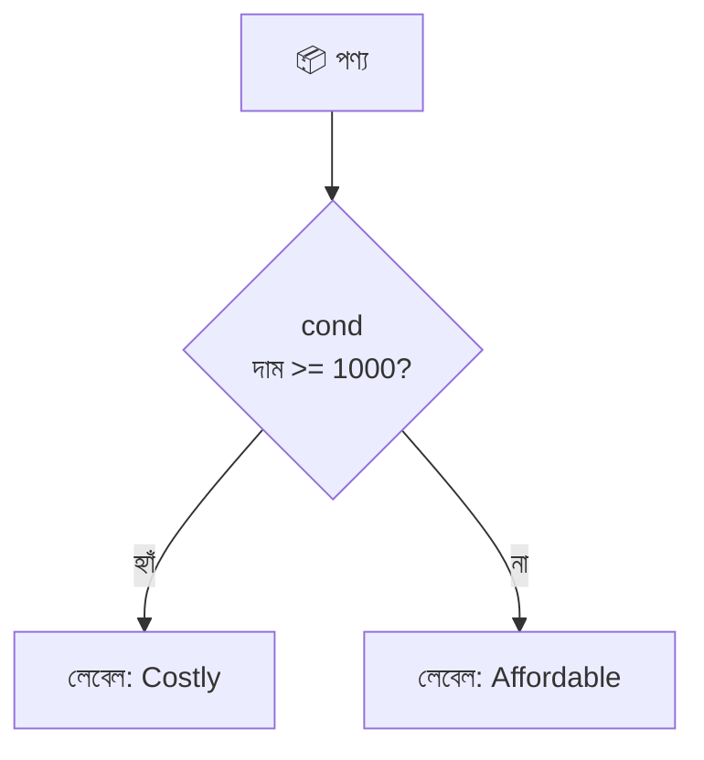

### ১) `$cond` — দুটো রূপ

```javascript
db.products.aggregate([
  {
    $project: {
      _id: 0,
      name: 1,

      // রূপ ১: Array রূপ — [শর্ত, হলে, না হলে]
      tag1: { $cond: [{ $gte: ["$price", 1000] }, "Costly", "Affordable"] },
      // শর্ত: দাম >= ১০০০ ? হলে "Costly" : নইলে "Affordable"

      // রূপ ২: Object রূপ — বেশি পরিষ্কার, সুপারিশযোগ্য
      stockStatus: {
        $cond: {
          if: { $eq: ["$stock", 0] },     // if   = শর্ত (মজুদ ০ কি না)
          then: "Out of Stock",           // then = শর্ত সত্য হলে যে মান
          else: "In Stock"                // else = শর্ত মিথ্যা হলে যে মান
        }
      }
    }
  }
]);
```

### ২) `$cond` ভেতরে `$cond` (নেস্টেড)

```javascript
db.products.aggregate([
  {
    $project: {
      _id: 0, name: 1,
      level: {
        $cond: {
          if: { $gte: ["$price", 2000] }, then: "High",         // দাম ≥ ২০০০ → "High"
          else: {
            $cond: {                                             // না হলে আবার আরেকটা প্রশ্ন (নেস্টেড)
              if: { $gte: ["$price", 500] }, then: "Medium",     // দাম ≥ ৫০০ → "Medium"
              else: "Low"                                        // নইলে "Low"
            }
          }
        }
      }
    }
  }
]);
```

> তিনের বেশি ধাপ হলে `$cond` গাদাগাদি না করে **`$switch`** ব্যবহার করুন।

### ৩) `$switch` — একাধিক শর্ত

```javascript
db.employees.aggregate([
  {
    $project: {
      _id: 0,
      name: 1,
      salary: 1,
      grade: {
        $switch: {
          branches: [                                             // branches = (case, then) জোড়ার তালিকা; উপর থেকে নিচে চেক হয়, প্রথম যেটা সত্য সেটাই জেতে
            { case: { $gte: ["$salary", 80000] }, then: "A" },    // বেতন ≥ ৮০০০০ → গ্রেড A
            { case: { $gte: ["$salary", 50000] }, then: "B" },    // বেতন ≥ ৫০০০০ → গ্রেড B
            { case: { $gte: ["$salary", 30000] }, then: "C" }     // বেতন ≥ ৩০০০০ → গ্রেড C
          ],
          default: "D"                                            // default = কোনো case না মিললে এই মান (না দিলে এবং কোনোটাই না মিললে error হয়!)
        }
      }
    }
  }
]);
```

### ৪) `$ifNull` — ডিফল্ট মান বসানো

```javascript
db.employees.aggregate([
  {
    $project: {
      _id: 0,
      name: 1,
      bonus: { $ifNull: ["$bonus", 0] },
      // $ifNull: [মান, বিকল্প] = bonus না থাকলে বা null হলে ০ দেখাবে (Chitra-র ক্ষেত্রে ০ আসবে)

      note: { $ifNull: ["$remarks", "No remarks"] }
      // remarks ফিল্ড কারোরই নেই, তাই সবার জন্য "No remarks"
    }
  }
]);
```

### ৫) 🌟 সবচেয়ে শক্তিশালী ব্যবহার: `$group`-এর ভেতরে শর্তসহ গণনা/যোগ

SQL-এর `SUM(CASE WHEN ...)` বা `COUNT(CASE WHEN ...)`:

```javascript
db.orders.aggregate([
  {
    $group: {
      _id: "$customerId",                                          // কাস্টমার ধরে ঝুড়ি

      totalOrders: { $sum: 1 },                                    // totalOrders = সব অর্ডার

      deliveredCount: {
        $sum: { $cond: [{ $eq: ["$status", "delivered"] }, 1, 0] }
        // deliveredCount = শুধু delivered অর্ডার গোনা। প্রতিটা বাক্সে status delivered হলে ১, নয়তো ০ যোগ হয়
      },

      cancelledCount: {
        $sum: { $cond: [{ $eq: ["$status", "cancelled"] }, 1, 0] } // cancelledCount = বাতিল অর্ডার সংখ্যা
      },

      deliveredRevenue: {
        $sum: {
          $cond: [
            { $eq: ["$status", "delivered"] },                     // শর্ত: delivered কি?
            { $multiply: ["$qty", "$unitPrice"] },                 // হ্যাঁ হলে অর্ডারের টাকা যোগ করো
            0                                                      // না হলে ০ যোগ করো
          ]
        }                                                          // deliveredRevenue = কাস্টমারের শুধু delivered অর্ডারের মোট টাকা
      }
    }
  },
  {
    $addFields: {
      successRate: {                                               // successRate = সফল অর্ডারের শতাংশ
        $round: [{ $multiply: [{ $divide: ["$deliveredCount", "$totalOrders"] }, 100] }, 0]
      }
    }
  }
]);
```

> 💡 এই কৌশলে **একটাই `$group`-এ** পুরো ড্যাশবোর্ড হয়ে যায় — আলাদা আলাদা `$match` + `$group` করতে হয় না।

### তিনটা যন্ত্র কখন কোনটা?

| পরিস্থিতি | যন্ত্র |
|---|---|
| দুটো পথ (হ্যাঁ/না) | `$cond` |
| তিন বা তার বেশি পথ | `$switch` |
| মান না থাকলে ডিফল্ট | `$ifNull` |
| গ্রুপের ভেতরে শর্তসাপেক্ষ গণনা/যোগ | `$sum` + `$cond` |

---

## ২৪. বোনাস: আরও যা যা আছে — Unwind, Sort, Bucket, Window ইত্যাদি

> সূচির ২৩টা টপিকের বাইরে MongoDB Aggregation-এর আরও কিছু গুরুত্বপূর্ণ জিনিস, যেগুলো ছাড়া বাস্তব প্রজেক্টে আটকে যাবেন। সংক্ষেপে দেখে নিন।

### ১) `$unwind` — প্যাকেট খুলে জিনিস আলাদা করা

**গল্প:** একটা বাক্সের ভেতরে `tags: ["rice", "staple"]` — দুটো জিনিসের প্যাকেট। `$unwind` প্যাকেট খুলে **প্রতিটা জিনিসকে আলাদা বাক্সে** ভরে।

```javascript
db.products.aggregate([
  { $unwind: "$tags" },                     // "$tags" = কোন Array খুলবো। ["rice","staple"] হলে একই পণ্যের ২টা বাক্স হবে: একটায় tags:"rice", আরেকটায় tags:"staple"
  { $group: { _id: "$tags", productCount: { $sum: 1 } } },   // এখন ট্যাগ ধরে গোনা যায়: কোন ট্যাগে কয়টা পণ্য
  { $sort: { productCount: -1 } }
]);

// Array খালি বা না থাকলেও বাক্স রাখতে চাইলে:
db.products.aggregate([
  {
    $unwind: {
      path: "$tags",                         // path = কোন Array
      includeArrayIndex: "tagIndex",         // includeArrayIndex = উপাদানটা Array-র কত নম্বর ঘরে ছিল, সেটা এই ফিল্ডে রাখো
      preserveNullAndEmptyArrays: true       // true = Array খালি/null/অনুপস্থিত হলেও বাক্সটা ফেলে দিও না
    }
  }
]);
```

### ২) `$sort` — সাজানো

```javascript
db.employees.aggregate([
  { $sort: { department: 1, salary: -1 } }
  // একাধিক ফিল্ডে: প্রথমে department (A→Z), একই department-এ salary (বড় → ছোট)
  // 1 = ascending (ছোট → বড়), -1 = descending (বড় → ছোট)
]);
```

### ৩) `$sample` — এলোমেলো কয়েকটা

```javascript
db.products.aggregate([{ $sample: { size: 3 } }]);   // size = কয়টা র‍্যান্ডম বাক্স চাই (৩টা)
```

### ৪) `$unionWith` — দুই তাকের বাক্স এক বেল্টে (UNION ALL)

```javascript
db.orders.aggregate([
  { $project: { _id: 0, type: { $literal: "order" }, date: "$orderDate" } },
  // $literal = ভেতরের মানকে হুবহু ধ্রুব মান ধরো ("order" লেখাটাই বসুক, $ দেখে ফিল্ড ভেবো না)
  {
    $unionWith: {
      coll: "customers",                                            // coll = যে তাকের বাক্স জুড়ে দেবো
      pipeline: [ { $project: { _id: 0, type: { $literal: "customer" }, date: "$joinedAt" } } ]
      // pipeline = ওই তাকের বাক্সগুলোকে আগে একই আকারে সাজিয়ে নিলাম
    }
  },
  { $sort: { date: 1 } }                                            // এখন দুই তাকের ঘটনা একটা সময়-রেখায়
]);
```

### ৫) `$replaceRoot` / `$replaceWith`

```javascript
db.orders.aggregate([
  { $lookup: { from: "products", localField: "productId", foreignField: "_id", as: "p" } },
  { $unwind: "$p" },
  { $replaceWith: "$p" }   // $replaceWith = পুরো বাক্সের জায়গায় শুধু p object-টাকে নতুন বাক্স বানায়। (এখানে ফল শুধু পণ্যগুলো)
]);
```

### ৬) Array operators — Array-র ভেতরে কাজ

| Operator | কাজ | উদাহরণ |
|---|---|---|
| `$size` | উপাদান সংখ্যা | `{ $size: "$tags" }` |
| `$arrayElemAt` | নির্দিষ্ট ঘরের মান | `{ $arrayElemAt: ["$tags", 0] }` |
| `$slice` | অংশ কাটা | `{ $slice: ["$tags", 2] }` (প্রথম ২টা) |
| `$filter` | শর্ত মেলানো উপাদান রাখা | নিচে |
| `$map` | প্রতিটাতে হিসাব চালানো | ১৭ নম্বর সেকশনে |
| `$reduce` | Array → একটা মান | নিচে |
| `$concatArrays` | Array জোড়া | `{ $concatArrays: ["$a", "$b"] }` |
| `$in` | আছে কি না | ২২ নম্বর সেকশনে |
| `$isArray` | Array কি না | `{ $isArray: "$tags" }` |
| `$reverseArray` | উল্টে দেওয়া | `{ $reverseArray: "$tags" }` |
| `$arrayToObject` / `$objectToArray` | Array ↔ Object | — |

```javascript
db.employees.aggregate([
  {
    $project: {
      _id: 0,
      name: 1,
      goodScores: {
        $filter: {
          input: "$scores",             // input = কোন Array ছাঁকবো
          as: "s",                      // as = প্রতিটা উপাদানকে যে নামে ডাকবো (ব্যবহার: $$s)
          cond: { $gte: ["$$s", 85] }   // cond = কোন শর্তে উপাদান থাকবে (স্কোর ≥ ৮৫)
        }
      },
      totalScoreByReduce: {
        $reduce: {
          input: "$scores",             // input = কোন Array-কে ভাঁজ করবো
          initialValue: 0,              // initialValue = শুরুতে জমা-মান ০
          in: { $add: ["$$value", "$$this"] }
          // in = প্রতি ধাপে কী করবো। $$value = এ পর্যন্ত জমা মান, $$this = এখনকার উপাদান
          // তাই প্রতিবার জমা-মানের সাথে নতুন উপাদান যোগ → শেষে মোট যোগফল
        }
      }
    }
  }
]);
```

### ৭) `$out` ও `$merge` — রিপোর্ট নতুন তাকে সংরক্ষণ

```javascript
db.orders.aggregate([
  { $match: { status: "delivered" } },
  { $group: { _id: "$customerId", totalSpent: { $sum: { $multiply: ["$qty", "$unitPrice"] } } } },
  { $merge: { into: "customer_summary", whenMatched: "replace", whenNotMatched: "insert" } }
  // $merge = ফলাফলকে customer_summary নামের collection-এ লেখে (এটাই একমাত্র stage যা ডেটা লেখে)
  //   into        = কোন collection-এ লিখবো
  //   whenMatched = আগে থেকে একই _id থাকলে কী করবো ("replace" = বদলে দাও)
  //   whenNotMatched = না থাকলে কী করবো ("insert" = নতুন বসাও)
  // ($out সরলতর কিন্তু পুরো collection কে মুছে নতুন করে বানায়; $merge পুরোনোর সাথে মিশিয়ে আপডেট করতে পারে)
]);
```

### ৮) Type রূপান্তর

| Operator | কাজ |
|---|---|
| `$toInt`, `$toLong`, `$toDouble`, `$toDecimal` | সংখ্যা রূপান্তর |
| `$toString` | String-এ |
| `$toObjectId` | String → ObjectId |
| `$toDate` | Date-এ |
| `$toBool` | Boolean-এ |
| `$convert` | `onError`/`onNull` সহ নিরাপদ রূপান্তর |
| `$type` / `$isNumber` | টাইপ যাচাই |

```javascript
db.orders.aggregate([
  {
    $project: {
      safeQty: { $convert: { input: "$qty", to: "int", onError: 0, onNull: 0 } }
      // $convert = ভুল ঘটলে error না দিয়ে বিকল্প মান দেয়
      //   input = কী রূপান্তর করবো, to = কোন টাইপে, onError = রূপান্তর ব্যর্থ হলে, onNull = মান null হলে
    }
  }
]);
```

### ৯) `$graphLookup` — পরম্পরাগত (Recursive) Join

কর্মী → তার ম্যানেজার → ম্যানেজারের ম্যানেজার... এই ধরনের **গাছের মতো সম্পর্ক** (Hierarchy) খুঁজতে `$graphLookup` (বিস্তারিত এই ফাইলে নয়; জানা থাকা যথেষ্ট যে এটা আছে)।

### ১০) পরিসংখ্যান accumulator

`$stdDevPop`, `$stdDevSamp` (Standard Deviation), `$median` ও `$percentile` (৭.০+) — ডেটা বিশ্লেষণে লাগে।

### সব Stage-এর পূর্ণাঙ্গ তালিকা (Reference)

| ধরন | Stage |
|---|---|
| ছাঁকা ও আকার | `$match`, `$project`, `$unset`, `$addFields`/`$set`, `$replaceRoot`/`$replaceWith`, `$redact` |
| সাজানো ও কাটা | `$sort`, `$limit`, `$skip`, `$sample` |
| গ্রুপ ও গণনা | `$group`, `$count`, `$sortByCount`, `$bucket`, `$bucketAuto`, `$setWindowFields`, `$densify`, `$fill` |
| জোড়া | `$lookup`, `$graphLookup`, `$unionWith`, `$unwind` |
| একাধিক বেল্ট | `$facet` |
| লেখা | `$out`, `$merge` |
| বিশেষ | `$geoNear`, `$search` (Atlas), `$indexStats`, `$collStats`, `$currentOp`, `$documents` |

---

## ২৫. Mongoose দিয়ে Node.js থেকে চালানো

### গল্প

এতক্ষণ আমরা সরাসরি `mongosh` কনসোলে বেল্ট চালিয়েছি। কিন্তু আসল প্রজেক্টে **Express অ্যাপ (রিসেপশনিস্ট)** বেল্ট চালায়, Mongoose-এর মাধ্যমে।

### বেসিক

```javascript
const Order = require("./models/Order");       // Order = Mongoose Model (orders collection-এর প্রতিনিধি)

async function revenueByPayment() {
  const result = await Order.aggregate([       // Model.aggregate([...]) = সেই একই pipeline Array, শুধু JavaScript-এ
    { $match: { status: "delivered" } },
    {
      $group: {
        _id: "$payment",
        revenue: { $sum: { $multiply: ["$qty", "$unitPrice"] } }
      }
    },
    { $sort: { revenue: -1 } }
  ]);
  return result;                               // result = সাধারণ JavaScript object-এর Array (Mongoose Document নয়)
}
```

### 🚨 Mongoose-এর ৩টা বিশেষ ফাঁদ

| ফাঁদ | ব্যাখ্যা | সমাধান |
|---|---|---|
| **Auto-casting হয় না** | `find()`-এ Mongoose `"64f..."` String-কে নিজে ObjectId বানায়, কিন্তু `aggregate()`-এ **বানায় না** | `new mongoose.Types.ObjectId(id)` নিজে লিখুন |
| **Collection-এর নাম** | `$lookup`-এর `from` এ **MongoDB collection-এর আসল নাম** দিতে হয় (Model-এর নাম নয়) | `Product.collection.name` ব্যবহার করুন (সাধারণত `products` বহুবচন, ছোট হাতের) |
| **Virtuals / getters নেই** | ফলাফল সাধারণ object, schema-র virtual কাজ করে না | দরকারে `$addFields` দিয়ে নিজে বানান |

### ObjectId দিয়ে Match

```javascript
const mongoose = require("mongoose");

async function ordersOfCustomer(customerId) {
  return Order.aggregate([
    {
      $match: {
        customerId: new mongoose.Types.ObjectId(customerId)
        // customerId = URL বা req.params থেকে আসা String। aggregate-এ সেটা নিজে ObjectId-তে রূপান্তর করতে হয়
        // না করলে String আর ObjectId মেলে না, ফলাফল খালি আসবে!
      }
    },
    {
      $lookup: {
        from: Product.collection.name,   // from = Product মডেলের আসল collection নাম (ভুল বানানের ঝুঁকি নেই)
        localField: "productId",
        foreignField: "_id",
        as: "product"
      }
    },
    { $unwind: "$product" }
  ]);
}
```

### Express route-এ Pagination + মোট গণনা (`$facet`)

```javascript
const express = require("express");
const router = express.Router();
const Product = require("../models/Product");

// GET /products?page=2&limit=3&category=Grocery
router.get("/products", async (req, res) => {
  try {
    const page = Math.max(parseInt(req.query.page) || 1, 1);       // page = কোন পাতা (সংখ্যা না হলে বা ০ হলে ১)
    const limit = Math.min(parseInt(req.query.limit) || 10, 50);   // limit = প্রতি পাতায় কয়টা (সর্বোচ্চ ৫০, যাতে কেউ বিশাল সংখ্যা চেয়ে সার্ভার না ভোগায়)
    const skip = (page - 1) * limit;                               // skip = আগের পাতাগুলোর আইটেম সংখ্যা

    const match = {};                                              // match = $match-এ যাবে এমন শর্তের object (খালি থাকলে সব)
    if (req.query.category) match.category = req.query.category;   // category দিলে তবেই ফিল্টার বসবে

    const [result] = await Product.aggregate([                     // [result] = ফল Array-র প্রথম (একমাত্র) উপাদান
      { $match: match },
      { $sort: { price: 1, _id: 1 } },
      {
        $facet: {
          metadata: [{ $count: "total" }],                         // metadata = মোট কয়টা মিললো
          data: [{ $skip: skip }, { $limit: limit }]               // data = শুধু এই পাতার আইটেম
        }
      }
    ]);

    const total = result.metadata[0]?.total || 0;                  // total = মোট আইটেম (কিছু না মিললে metadata খালি, তাই ?. আর || 0)
    res.json({
      page, limit, total,
      totalPages: Math.ceil(total / limit),                        // totalPages = মোট পাতা (আইটেম ÷ প্রতি পাতার আইটেম, উপরের পূর্ণসংখ্যায়)
      data: result.data
    });
  } catch (err) {
    res.status(500).json({ error: err.message });                  // সার্ভারের ভুল হলে ৫০০ + বার্তা
  }
});

module.exports = router;
```

---

## ২৬. Performance টিপস, সাধারণ ভুল আর সমাধান

### 🚀 Performance — বেল্ট দ্রুত রাখার ৮ নিয়ম

| # | নিয়ম | কারণ |
|---|---|---|
| ১ | **`$match` সবার আগে** | Index কাজ করে, বাকি স্টেশনে কম বাক্স যায় |
| ২ | `$match` এর ফিল্ডে **index** দিন | `db.orders.createIndex({ status: 1, orderDate: 1 })` |
| ৩ | `$sort + $limit` একসাথে রাখুন | MongoDB তখন শুধু সেরা N টা মেমরিতে রাখে |
| ৪ | অপ্রয়োজনীয় ফিল্ড `$project` দিয়ে আগেই ফেলুন | মেমরি কম লাগে |
| ৫ | `$lookup`-এর `foreignField`-এ **index** দিন | নাহলে প্রতিবার পুরো স্ক্যান |
| ৬ | `$group`-এ `$push: "$$ROOT"` এড়ান | সব বাক্স একটা Array-তে ঢুকলে ১৬ MB সীমা ছাড়ায় |
| ৭ | বড় ডেটায় `{ allowDiskUse: true }` | প্রতি স্টেশনে ১০০ MB মেমরি-সীমা পেরোলে ডিস্ক ব্যবহার করে |
| ৮ | `explain()` দিয়ে পরীক্ষা করুন | `db.orders.explain("executionStats").aggregate([...])` |

```javascript
db.orders.aggregate(
  [ /* ... pipeline ... */ ],
  { allowDiskUse: true }     // দ্বিতীয় আর্গুমেন্ট = options। allowDiskUse = মেমরি কম পড়লে ডিস্কে অস্থায়ী ফাইল ব্যবহারের অনুমতি
);
```

### ❌ সাধারণ ভুল ও সমাধান

| লক্ষণ | সম্ভাব্য কারণ | সমাধান |
|---|---|---|
| `$group` এর পর ফিল্ড হারিয়ে গেছে | `$group` শুধু `_id` আর নতুন ফিল্ড রাখে | যা চাই তা `$first`/`$push` দিয়ে গ্রুপের ভেতরেই তুলে রাখুন |
| `$first`/`$last` উল্টোপাল্টা মান দিচ্ছে | `$group`-এর আগে `$sort` নেই | `$sort` বসান |
| `$lookup`-এ `product: []` (খালি) | টাইপ মেলেনি (`String` vs `Number` vs `ObjectId`) বা ভুল ফিল্ড-নাম | দুই ফিল্ডের টাইপ `$type` দিয়ে যাচাই করুন |
| `product.name` পাচ্ছি না | `$lookup`-এর ফল Array | `$unwind` বা `$arrayElemAt` |
| Mongoose-এ `$match` খালি ফেরত দিচ্ছে | ObjectId String হিসেবে গেছে | `new mongoose.Types.ObjectId(id)` |
| `$sum`/`$avg` `null` বা ভুল গড় আসছে | ফিল্ড অনুপস্থিত/অ-সংখ্যা; `$avg` তাদের উপেক্ষা করে | `$ifNull` দিয়ে ০ বসান |
| `$add`/`$concat`-এ ফল `null` | একটা ইনপুট `null`/অনুপস্থিত | `$ifNull: ["$f", 0 বা ""]` |
| `Unrecognized expression '$xyz'` | অক্ষর-ভুল বা পুরোনো MongoDB ভার্সনে নেই | বানান ও ভার্সন দেখুন (`db.version()`) |
| `$project`-এ "Cannot do exclusion on field X in inclusion projection" | `1` আর `0` মিশিয়েছেন (`_id` ছাড়া) | হয় শুধু include, নয় শুধু exclude |
| `$facet`-এ "document too large" | সব ফলাফল মিলে ১৬ MB-এর বেশি | `$facet`-এর আগে বাক্স কমান, `$limit` দিন |
| `"field names may not start with '$'"` | `_id: "payment"` (ডলার ছাড়া) লিখেছেন, ফলে সব একই ঝুড়িতে | ফিল্ড পড়তে `"$payment"` — ডলার আবশ্যক |
| `$group` চাবি হিসেবে সব একই ঝুড়িতে | `_id: "payment"` (ডলার ছাড়া) = ধ্রুব লেখা | `_id: "$payment"` |
| মাস/বার ভুল আসছে | UTC বনাম স্থানীয় সময় | `timezone: "Asia/Dhaka"` |
| `$dayOfWeek`-এ রবিবার ১ | MongoDB-র নিয়ম রবিবার = ১ | সোমবার = ১ চাইলে `$isoDayOfWeek` |
| `$switch`-এ "No default and no case matched" | কোনো case না মিলে, default-ও নেই | `default` দিন |
| `$regex` ধীর | মাঝখানে খোঁজা বা case-insensitive | শুরু-থেকে (`^`) প্যাটার্ন, অথবা text index / Atlas Search |

> 🔑 **দুটো `$`-এর মনে-রাখার-ছড়া:**
> - **একটা `$`** → হয় stage/operator (`$match`, `$sum`) নয় ফিল্ডের মান পড়া (`"$price"`)
> - **দুটো `$$`** → ভেরিয়েবল (`$$ROOT`, `$$NOW`, `$$pid`, `$$this`)
> - **ডলার ছাড়া লেখা** → হুবহু ধ্রুব লেখা (`"payment"` মানে ওই শব্দটাই)

---

## ২৭. সারসংক্ষেপ ও Practice আইডিয়া

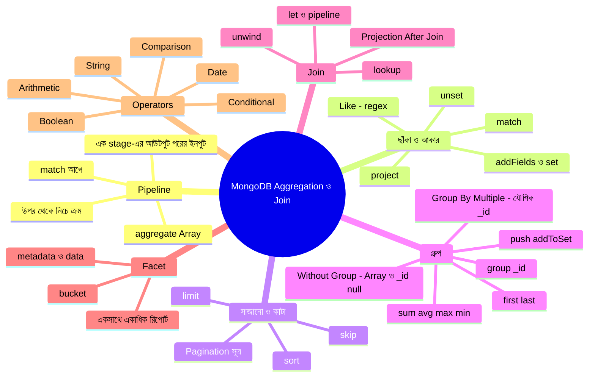

### গল্পের অভিধান — গল্পের কোনটা মানে কী

| গল্পে | টেকনিক্যাল নাম |
|---|---|
| মেঘনা মেগা-স্টোর | Database |
| গুদামের তাক | Collection |
| তাকের বাক্স | Document |
| কনভেয়ার বেল্ট কারখানা | Aggregation Pipeline |
| বেল্টের একেকটা স্টেশন | Stage |
| স্টেশনের ভেতরের যন্ত্র | Operator / Expression |
| বাছাই স্টেশন | `$match` |
| নামের অংশ ধরার ম্যাগনিফাইং গ্লাস | `$regex` (Like) |
| ছাঁটাই ও লেবেল স্টেশন | `$project` |
| নতুন স্টিকার লাগানো | `$addFields` / `$set` |
| "প্রথম N টা ছাড়ো" | `$limit` |
| "প্রথম N টা ছেড়ে দাও" | `$skip` |
| ঝুড়িতে ভাগ করা | `$group` |
| ঝুড়ির গায়ের লেবেল | `_id` of group (Group Key) |
| ঝুড়ির ক্যাশিয়ার / হিসাবরক্ষক | `$sum` / `$avg` |
| ঝুড়ির প্রহরী | `$max` / `$min` |
| ঝুড়ির প্রথম আর শেষ বাক্স | `$first` / `$last` |
| ঝুড়িতে জিনিস জমানো | `$push` / `$addToSet` |
| পুরো বাক্স ঝুড়িতে রাখা | `$$ROOT` |
| পাশের গুদামে গিয়ে তথ্য আনা কর্মী | `$lookup` |
| প্যাকেট খুলে জিনিস আলাদা করা | `$unwind` |
| তিন-মুখো বেল্ট | `$facet` |
| সংখ্যা-পরিসর ধরে ঝুড়ি | `$bucket` |
| হিসাবের যন্ত্র | Arithmetic Operators |
| লেখা-কাটাছেঁড়ার যন্ত্র | String Operators |
| ক্যালেন্ডার যন্ত্র | Date Operators |
| তুলনার দাঁড়িপাল্লা | Comparison Operators |
| হ্যাঁ/না-র সুইচ | Boolean Operators |
| "যদি... তাহলে..." স্টেশন | `$cond` / `$switch` / `$ifNull` |
| ঝুড়ি না ভেঙে পাশে হিসাব | `$setWindowFields` |
| রিপোর্ট নতুন তাকে রাখা | `$out` / `$merge` |

### Practice-এর জন্য আইডিয়া

১. **পুরোটা নিজে হাতে টাইপ করে চালানো** — কপি-পেস্ট নয়, টাইপ করলে মাথায় থাকে। আগে Seed Data বসিয়ে নিন।
২. **ক্রমের খেলা:** `$limit` কে `$sort`-এর আগে আর পরে বসিয়ে ফলের পার্থক্য দেখুন।
৩. **Like:** নামে "rice" আছে এমন পণ্য — একবার `i` option সহ, একবার ছাড়া চালিয়ে ফল মেলান।
৪. **Pagination:** `page = 1, 2, 3` দিয়ে তিনবার চালান; শেষ পাতায় কয়টা আইটেম আসে দেখুন।
৫. **First/Last:** `$sort` ছাড়া `$first` চালিয়ে দেখুন, তারপর `$sort` সহ — কী বদলালো?
৬. **Group By SUM:** কোন **শহরের** কাস্টমাররা সবচেয়ে বেশি টাকা খরচ করেছে? (ইঙ্গিত: `orders → customers` Join করে `customer.city` ধরে `$group`)
৭. **Max/Min:** প্রতিটা category-র **সবচেয়ে দামি পণ্যের নাম** বের করুন (`$sort` + `$first`)।
৮. **Without Group By:** `employees`-এর `scores` থেকে প্রত্যেকের গড় বের করে `$match` দিয়ে যাদের গড় ৮৫-এর বেশি তাদের বাছুন।
৯. **Group By Multiple:** `department` + `designation` ধরে কর্মী সংখ্যা ও গড় বেতন।
১০. **Lookup:** যেসব **পণ্য** একবারও বিক্রি হয়নি সেগুলো বের করুন (`products → orders` Join, `$size: 0`)।
১১. **Facet:** একটা query-তে ডেটা + মোট গণনা + category-ভিত্তিক সংখ্যা আনুন।
১২. **Projection After Join:** orders-কে products ও customers-এর সাথে Join করে শুধু `customerName`, `productName`, `lineTotal` দেখান।
১৩. **Add Field:** প্রতিটা কাস্টমারের পাশে `totalOrders`, `totalSpent`, আর `avgOrderValue` বসান।
১৪. **Arithmetic:** কর্মীদের `bonusPercent` বের করুন এবং যার সবচেয়ে বেশি তাকে খুঁজুন।
১৫. **String:** কাস্টমারের ইমেইল থেকে ডোমেইন বের করে ডোমেইন-ভিত্তিক গোনা।
১৬. **Date:** মাস-ভিত্তিক বিক্রির রিপোর্টে `timezone` দিয়ে আর না দিয়ে — দুইবার চালান, কোনো পার্থক্য আসে কি না দেখুন।
১৭. **Comparison/Boolean:** এমন পণ্য বের করুন যেগুলো `দাম > ১০০০` **এবং** `stock < ৩০`।
১৮. **Conditional:** একটা `$group`-এর ভেতরে `$cond` দিয়ে প্রতি payment method-এর `delivered` আর `cancelled` গণনা আলাদা ফিল্ডে আনুন।
১৯. **Mongoose:** একটা Express route বানিয়ে `/reports/revenue-by-month` থেকে ২০ নম্বর সেকশনের মাস-ভিত্তিক রিপোর্ট JSON আকারে ফেরত দিন।
২০. **এরপর:** আরও গভীরে যেতে `$setWindowFields`, `$graphLookup`, `$merge` আর Atlas Search নিয়ে পড়ুন।

---
