# 🔐 জ্ঞানকুটির পাঠাগারের গল্প: Thinking with MongoDB ও User Authentication

> **১) MongoDB-তে "ভাবতে" হয় কীভাবে? (Thinking with MongoDB: Data Modeling)**
> **২) কে ঢুকছে সেটা কীভাবে নিশ্চিত করবো? (User Authentication: Register, Login, JWT, Protected Route)**
> 📎 **Module:** MongoDB Beginner-Advanced Aggregation Query Writing → লাইভ ক্লাস: *Thinking with MongoDB, implementing user authentication*। রেফারেন্স ফাইল: MongoDB CRUD Operations।

---

## 📚 এই ফাইলে যা যা আছে (সূচিপত্র)

০. ভূমিকা: দরজা খোলা পাঠাগারের বিপদ
১. Authentication বনাম Authorization: "তুমি কে?" আর "তুমি কী পারো?"
২. Thinking with MongoDB: ডেটা নিয়ে ভাবার পদ্ধতি (Data Modeling)
৩. `users` collection-এর নকশা: কার্ডে কোন কোন ঘর থাকবে
৪. Index: ইউনিক ইমেইলের পাহারাদার
৫. Password Hashing: পাসওয়ার্ড কেন কখনো সরাসরি রাখতে নেই
৬. প্রজেক্ট সেটআপ, ফোল্ডার আর Database সংযোগ
৭. Register API: সদস্যপদ নেওয়া
৮. Login API: গেটে পরিচয় দেখানো
৯. JWT: প্রবেশপত্রের গল্প (Access Token আর Refresh Token)
১০. Middleware: গেটের দারোয়ান (`requireAuth`, `authorize`)
১১. Refresh, Logout আর Session-এর গল্প
১২. Aggregation দিয়ে ব্যবহারকারীর ডেটা বিশ্লেষণ (এই মডিউলের মূল বিষয়)
১৩. পাসওয়ার্ড বদল, Profile Update, Account বন্ধ, Forgot Password
১৪. নিরাপত্তার চেকলিস্ট (NoSQL Injection সহ)
১৫. একই কাজ Mongoose দিয়ে
১৬. Postman দিয়ে পরীক্ষা, সাধারণ ভুল আর সমাধান
১৭. সারসংক্ষেপ, গল্পের অভিধান ও Practice আইডিয়া

---

## ০. ভূমিকা: দরজা খোলা পাঠাগারের বিপদ

জ্ঞানকুটির পাঠাগার এখন বেশ জনপ্রিয়। কিন্তু কিছুদিন ধরে **মৌসুমী আপা** দেখছেন উল্টাপাল্টা কাণ্ড:

- কেউ একজন বইয়ের **দাম বদলে ১ টাকা** করে দিয়েছে।
- কেউ **অন্যের নামে বই ধার** নিয়ে ফেরত দেয়নি।
- কেউ এসে বলছে, *"আমি তো রহিম, আমার কার্ডটা দিন"*, অথচ সে রহিম নয়।

আপা সিদ্ধান্ত নিলেন: **"এখন থেকে সদস্য না হলে ভেতরে ঢোকা নিষেধ।"** এর জন্য তিনটা জিনিস বানাতে হবে:

1. **সদস্যপদ** (Register): নতুন লোকের নাম, ইমেইল, একটা গোপন পাসওয়ার্ড নিয়ে একটা **সদস্য-কার্ড** বানানো।
2. **পরিচয় যাচাই** (Login): গেটে এসে পরিচয় দেখালে যাচাই করে একটা **প্রবেশপত্র** দেওয়া।
3. **দারোয়ান** (Middleware): প্রতিটা দরজায় দাঁড়িয়ে প্রবেশপত্র দেখে ঠিক করা ঢুকতে দেবে কি না।

এই তিনটা কাজের জন্য MongoDB-তে একটা `users` collection লাগবে। আর সেই collection **কেমন করে বানাবো, কী কী রাখবো, কী কখনো রাখবো না**, এই ভাবনাটাই হলো **"Thinking with MongoDB"**।

### পুরো ফাইলের রোডম্যাপ

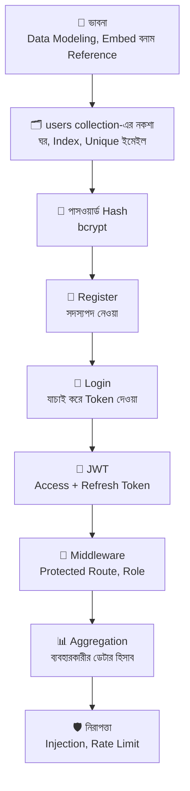
```mermaid
flowchart TB
    A["🧠 ভাবনা<br/>Data Modeling, Embed বনাম Reference"] --> B["🗂️ users collection-এর নকশা<br/>ঘর, Index, Unique ইমেইল"]
    B --> C["🔑 পাসওয়ার্ড Hash<br/>bcrypt"]
    C --> D["📝 Register<br/>সদস্যপদ নেওয়া"]
    D --> E["🚪 Login<br/>যাচাই করে Token দেওয়া"]
    E --> F["🎫 JWT<br/>Access + Refresh Token"]
    F --> G["💂 Middleware<br/>Protected Route, Role"]
    G --> H["📊 Aggregation<br/>ব্যবহারকারীর ডেটার হিসাব"]
    H --> I["🛡️ নিরাপত্তা<br/>Injection, Rate Limit"]
```

### 🎭 গল্পের চরিত্র আর টেকনিক্যাল নাম: শুরুতেই মিলিয়ে নিই

| গল্পে | টেকনিক্যাল নাম |
|---|---|
| সদস্য-কার্ড | `users` collection-এর **Document** |
| সদস্যপদের ফর্ম জমা দেওয়া | **Register / Sign up** (`POST /auth/register`) |
| গেটে পরিচয় দেখানো | **Login / Sign in** (`POST /auth/login`) |
| পাসওয়ার্ডের গোপন সিল (আসল পাসওয়ার্ড কেউ দেখে না) | **Password Hash** (bcrypt) |
| প্রতিজনের জন্য আলাদা গোপন মশলা | **Salt** |
| গলায় ঝোলানো প্রবেশপত্র (২০ মিনিট চলে) | **Access Token** (JWT) |
| দীর্ঘদিনের "নবায়ন-স্লিপ" | **Refresh Token** |
| গেটের দারোয়ান রহিম চাচা | **Middleware** (`requireAuth`) |
| সদস্য / গ্রন্থাগারিক / প্রধান | **Role** (`member` / `librarian` / `admin`) |
| একই ইমেইলে দুইটা কার্ড বানানো নিষেধ | **Unique Index** |
| মৌসুমী আপা | `mongosh` / Driver / আপনার Express code |

> 💡 এই ফাইলের সব কোড **Node.js + Express 5 + MongoDB Driver** (CommonJS) দিয়ে, আগের ফাইলের মতো। শেষে সেকশন ১৫-তে একই কাজ **Mongoose** দিয়ে দেখানো আছে, কারণ আসল প্রজেক্টে অনেকেই Mongoose ব্যবহার করে।

---

## ১. Authentication বনাম Authorization: "তুমি কে?" আর "তুমি কী পারো?"

### গল্প

পাঠাগারের গেটে রহিম চাচা দুইটা আলাদা প্রশ্ন করেন, আর দুইটাকে গুলিয়ে ফেললে সব গোলমাল হয়ে যায়:

- **প্রথম প্রশ্ন: "তুমি কে?"** → সদস্য-কার্ড আর গোপন পাসওয়ার্ড দেখে পরিচয় নিশ্চিত করা। এটা **Authentication (AuthN)**।
- **দ্বিতীয় প্রশ্ন: "তুমি এখানে কী করতে পারো?"** → সাধারণ সদস্য বই ধার নিতে পারে, কিন্তু বইয়ের দাম বদলাতে পারে শুধু **গ্রন্থাগারিক**, আর সদস্য মুছতে পারে শুধু **প্রধান (admin)**। এটা **Authorization (AuthZ)**।

| | Authentication | Authorization |
|---|---|---|
| প্রশ্ন | তুমি কে? | তুমি কী করতে পারো? |
| কখন হয় | আগে (Login-এর সময়) | পরে (প্রতিটা সুরক্ষিত request-এ) |
| কী দিয়ে | ইমেইল + পাসওয়ার্ড → Token | Token-এর ভেতরের `role` |
| ব্যর্থ হলে HTTP status | **401 Unauthorized** (আসলে মানে "পরিচয় অজানা") | **403 Forbidden** ("চিনি, কিন্তু অনুমতি নেই") |
| গল্পে | কার্ড আর পাসওয়ার্ড মেলানো | "এই দরজা শুধু গ্রন্থাগারিকের" |

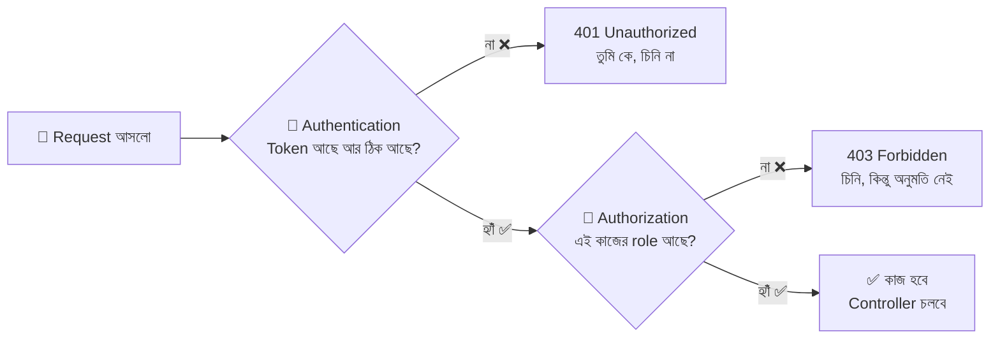
```mermaid
flowchart LR
    R["📨 Request আসলো"] --> A{"🔐 Authentication<br/>Token আছে আর ঠিক আছে?"}
    A -->|"না ❌"| E1["401 Unauthorized<br/>তুমি কে, চিনি না"]
    A -->|"হ্যাঁ ✅"| B{"🛂 Authorization<br/>এই কাজের role আছে?"}
    B -->|"না ❌"| E2["403 Forbidden<br/>চিনি, কিন্তু অনুমতি নেই"]
    B -->|"হ্যাঁ ✅"| OK["✅ কাজ হবে<br/>Controller চলবে"]
```

> 🧠 **মনে রাখার সহজ উপায়:** AuthN = **N**ame (নাম/পরিচয়), AuthZ = **Z**one (কোন এলাকায় ঢোকার অনুমতি)।

### একনজরে: আজকের authentication-এর পুরো ছবি

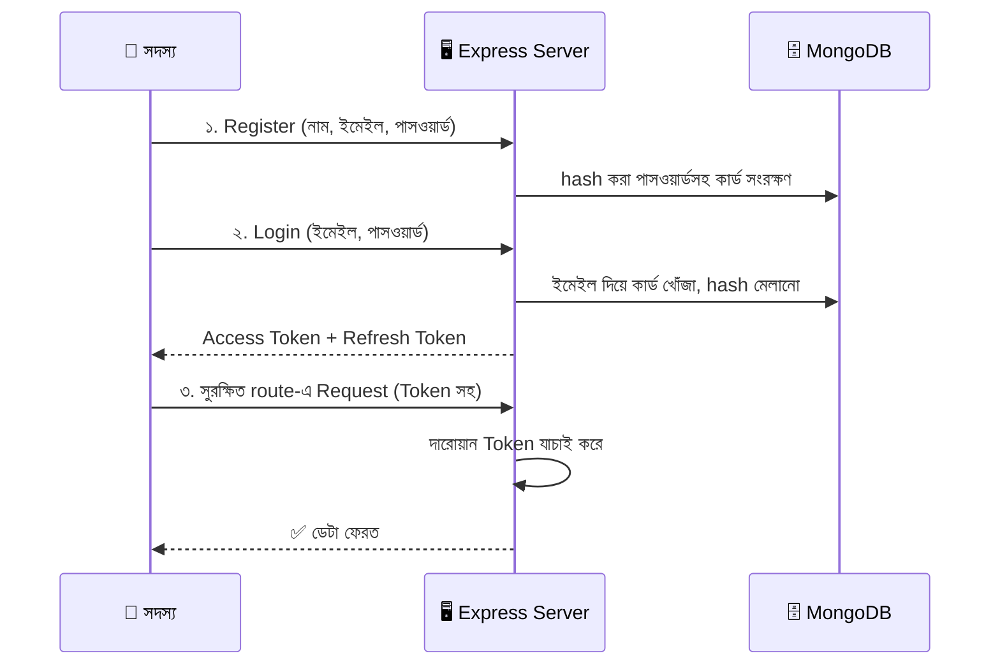
```mermaid
sequenceDiagram
    participant U as 👤 সদস্য
    participant S as 🖥️ Express Server
    participant DB as 🗄️ MongoDB
    U->>S: ১. Register (নাম, ইমেইল, পাসওয়ার্ড)
    S->>DB: hash করা পাসওয়ার্ডসহ কার্ড সংরক্ষণ
    U->>S: ২. Login (ইমেইল, পাসওয়ার্ড)
    S->>DB: ইমেইল দিয়ে কার্ড খোঁজা, hash মেলানো
    S-->>U: Access Token + Refresh Token
    U->>S: ৩. সুরক্ষিত route-এ Request (Token সহ)
    S->>S: দারোয়ান Token যাচাই করে
    S-->>U: ✅ ডেটা ফেরত
```

---

## ২. Thinking with MongoDB: ডেটা নিয়ে ভাবার পদ্ধতি

### গল্প

আগের ফাইলে আপনি শিখেছেন MongoDB-তে **ছক ছাড়াই** কার্ড রাখা যায়। কিন্তু "ছক নেই" মানে "ভাবনা নেই" নয়! বরং উল্টো: SQL-এ আমরা আগে **ডেটার গড়ন** ভাবি (কোন table, কোন column), আর MongoDB-তে আগে ভাবি **"এই ডেটা দিয়ে আমি কোন কোন কাজ করবো?"**

মৌসুমী আপা নতুন আলমারি বানানোর আগে একটা খাতায় লিখলেন:

```
আমার সবচেয়ে বেশি কোন কোন কাজ হবে?
১. লগইনের সময় ইমেইল দিয়ে সদস্য খোঁজা          → খুব বেশি, দ্রুত হতে হবে
২. সদস্যের নিজের প্রোফাইল দেখানো                  → বেশি
৩. সদস্য কোন কোন বই ধার নিয়েছে দেখানো             → মাঝারি
৪. প্রধানের জন্য সব সদস্যের তালিকা, রোল অনুযায়ী    → কম
```

এই তালিকাটাই হলো **Access Pattern** (কীভাবে ডেটা ব্যবহৃত হবে)। MongoDB-র সোনালি নিয়ম হলো:

> 🏆 **"যে ডেটা একসাথে পড়া হয়, তা একসাথে রাখো। আর যা আলাদাভাবে বাড়ে বা বদলায়, তা আলাদা রাখো।"**

### ভাবনার ধাপগুলো

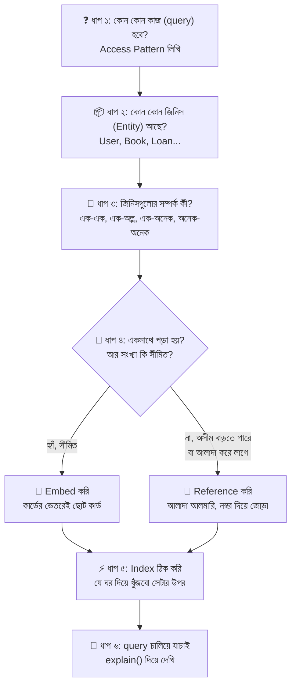
```mermaid
flowchart TD
    A["❓ ধাপ ১: কোন কোন কাজ (query) হবে?<br/>Access Pattern লিখি"] --> B["📦 ধাপ ২: কোন কোন জিনিস (Entity) আছে?<br/>User, Book, Loan..."]
    B --> C["🔗 ধাপ ৩: জিনিসগুলোর সম্পর্ক কী?<br/>এক-এক, এক-অল্প, এক-অনেক, অনেক-অনেক"]
    C --> D{"🤔 ধাপ ৪: একসাথে পড়া হয়?<br/>আর সংখ্যা কি সীমিত?"}
    D -->|"হ্যাঁ, সীমিত"| E["📎 Embed করি<br/>কার্ডের ভেতরেই ছোট কার্ড"]
    D -->|"না, অসীম বাড়তে পারে<br/>বা আলাদা করে লাগে"| F["🔗 Reference করি<br/>আলাদা আলমারি, নম্বর দিয়ে জোড়া"]
    E --> G["⚡ ধাপ ৫: Index ঠিক করি<br/>যে ঘর দিয়ে খুঁজবো সেটার উপর"]
    F --> G
    G --> H["🧪 ধাপ ৬: query চালিয়ে যাচাই<br/>explain() দিয়ে দেখি"]
```

### সম্পর্কের চার রকম

| সম্পর্ক | উদাহরণ | সাধারণ সমাধান |
|---|---|---|
| **এক-এক** (One-to-One) | একজন সদস্য ↔ তাঁর প্রোফাইল (ফোন, ঠিকানা) | **Embed** (`profile: { ... }`) |
| **এক-অল্প** (One-to-Few) | একজন সদস্য ↔ ২-৩টা ঠিকানা | **Embed array** (`addresses: [ ... ]`) |
| **এক-অনেক** (One-to-Many) | একজন সদস্য ↔ তাঁর শত শত ধার নেওয়ার ইতিহাস | **Reference** (`loans` আলাদা collection, প্রতিটায় `userId`) |
| **অনেক-অনেক** (Many-to-Many) | অনেক সদস্য ↔ অনেক বই (ধার নেওয়ার মাধ্যমে) | মাঝখানে একটা **জোড়া collection** (`loans`) |

### Embed বনাম Reference, কোনটা কখন?

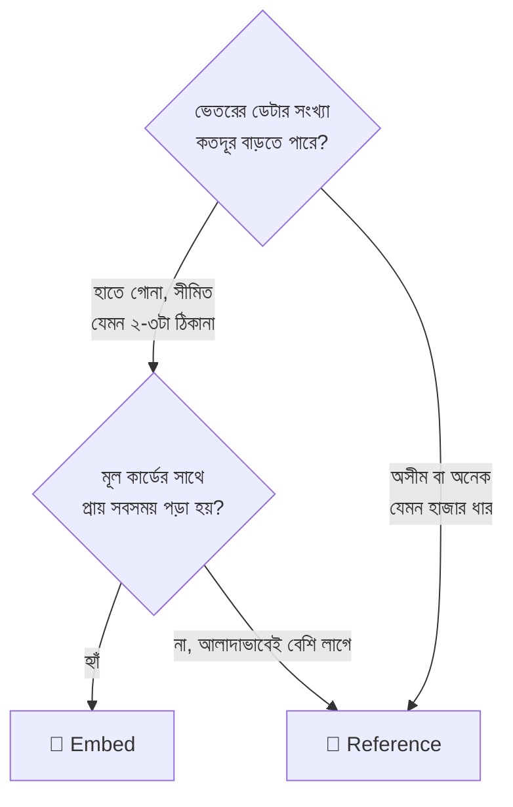
```mermaid
flowchart TD
    Q{"ভেতরের ডেটার সংখ্যা<br/>কতদূর বাড়তে পারে?"}
    Q -->|"হাতে গোনা, সীমিত<br/>যেমন ২-৩টা ঠিকানা"| P{"মূল কার্ডের সাথে<br/>প্রায় সবসময় পড়া হয়?"}
    Q -->|"অসীম বা অনেক<br/>যেমন হাজার ধার"| REF["🔗 Reference"]
    P -->|"হ্যাঁ"| EMB["📎 Embed"]
    P -->|"না, আলাদাভাবেই বেশি লাগে"| REF
```

| | 📎 Embed (ভেতরে রাখা) | 🔗 Reference (নম্বর দিয়ে জোড়া) |
|---|---|---|
| পড়া | ✅ এক query-তে সব চলে আসে | ⚠️ দুই query বা `$lookup` লাগে |
| লেখা | ⚠️ বড় হলে পুরো কার্ড ভারী হয় | ✅ আলাদা কার্ডে আলাদা লেখা |
| আকারের সীমা | ⚠️ কার্ড সর্বোচ্চ **১৬ MB** | ✅ সীমাহীন |
| একই ডেটা বারবার | ⚠️ কপি হতে পারে (বদলালে সবখানে বদলাতে হয়) | ✅ একটাই আসল কপি |
| উদাহরণ (আমাদের গল্পে) | `profile`, `addresses` | `loans`, `refresh_tokens` |

> ⚠️ **বিপজ্জনক ভুল: "Unbounded Array"।** যদি `users` কার্ডের ভেতরে `loans: [ ... ]` রাখি আর সদস্য বছরের পর বছর ধার নিতেই থাকেন, কার্ড ফুলতে ফুলতে ১৬ MB পেরিয়ে যাবে, আর প্রতিবার পুরো কার্ড টানতে হবে। **যা অসীম বাড়ে, তা কখনো array হিসেবে embed করবেন না।**

### আমাদের পাঠাগারের পুরো নকশা

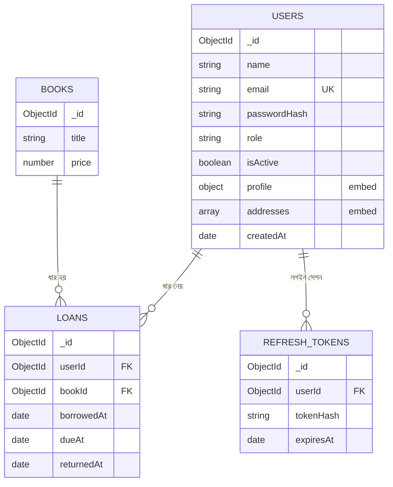
```mermaid
erDiagram
    USERS ||--o{ LOANS : "ধার নেয়"
    BOOKS ||--o{ LOANS : "ধার হয়"
    USERS ||--o{ REFRESH_TOKENS : "লগইন সেশন"
    USERS {
        ObjectId _id
        string name
        string email UK
        string passwordHash
        string role
        boolean isActive
        object profile "embed"
        array addresses "embed"
        date createdAt
    }
    BOOKS {
        ObjectId _id
        string title
        number price
    }
    LOANS {
        ObjectId _id
        ObjectId userId FK
        ObjectId bookId FK
        date borrowedAt
        date dueAt
        date returnedAt
    }
    REFRESH_TOKENS {
        ObjectId _id
        ObjectId userId FK
        string tokenHash
        date expiresAt
    }
```

### "ভাবা"-র আরও কয়েকটা সোনালি নিয়ম

| নিয়ম | ব্যাখ্যা | আমাদের উদাহরণ |
|---|---|---|
| **১. Query-র জন্য ডিজাইন করো** | ডেটা কেমন, তার চেয়ে জরুরি ডেটা কীভাবে পড়া হবে | লগইনে ইমেইল দিয়ে খোঁজা হয়, তাই `email`-এর উপর Index |
| **২. সংবেদনশীল জিনিস সাবধানে** | কোন ঘর কখনোই client-কে ফেরত যাবে না, আগে থেকে ঠিক করো | `passwordHash` কখনো response-এ না |
| **৩. `_id` ছাড়াও ইউনিক কী লাগলে Unique Index** | `_id` ছাড়া অন্য ঘর ইউনিক রাখার একমাত্র নিরাপদ উপায় Index | `email` |
| **৪. Type ঠিক রাখো** | `userId` সবসময় `ObjectId`, কোথাও String নয় (নাহলে `$lookup` মিলবে না) | `loans.userId` |
| **৫. সময় রাখো** | `createdAt`, `updatedAt` প্রায় সব collection-এ কাজে লাগে | `users`-এ থাকছে |
| **৬. মোছার বদলে চিহ্ন** | সদস্য বন্ধ করতে Soft Delete (`isActive: false`) | `isActive` |
| **৭. যা আপনি পড়েন না, তা রাখবেন না** | অপ্রয়োজনীয় ঘর কার্ড ভারী করে | `users`-এ শুধু দরকারি ঘর |

---

## ৩. `users` collection-এর নকশা: কার্ডে কোন কোন ঘর থাকবে

### গল্প

মৌসুমী আপা সদস্য-কার্ডের নকশা করতে বসলেন। প্রতিটা ঘরের জন্য তিনি নিজেকে প্রশ্ন করলেন: *"এই ঘরটা কেন লাগবে? না থাকলে কী সমস্যা?"*

### একটা `users` Document

```javascript
{
  _id: ObjectId("66f200000000000000000001"),
  // _id = সদস্য-কার্ডের ইউনিক নম্বর। MongoDB নিজে বানায়। পরে Token-এর ভেতরে এটাই সদস্যের পরিচয়

  name: "রাফসুন জানি",
  // name = সদস্যের নাম (String)। প্রোফাইলে দেখানোর জন্য

  email: "rafsun@example.com",
  // email = লগইনের "ইউজারনেম"। সবসময় ছোট হাতের অক্ষরে সংরক্ষণ (lowercase), আর সারা collection-এ ইউনিক

  passwordHash: "$2b$10$N9qo8uLOickgx2ZMRZoMyeIjZAgcfl7p92ldGxad68LJZdL17lhWy",
  // passwordHash = আসল পাসওয়ার্ড নয়! bcrypt-এর বানানো এলোমেলো দেখতে সিল। আসল পাসওয়ার্ড কোথাও রাখা হয় না

  role: "member",
  // role = অনুমতির স্তর: "member" | "librarian" | "admin"। নতুন সদস্য সবসময় "member" দিয়ে শুরু

  isActive: true,
  // isActive = কার্ড চালু আছে কি না। false হলে লগইন বন্ধ (কার্ড মুছি না, শুধু বন্ধ করি: Soft Delete)

  profile: { phone: "01700000000", bio: "বই পড়ুয়া" },
  // profile = এক-এক সম্পর্ক, তাই embed। প্রায় সবসময় সদস্যের সাথেই পড়া হয়

  addresses: [{ label: "বাসা", city: "ঢাকা" }],
  // addresses = এক-অল্প সম্পর্ক, তাই embed array (সংখ্যা সীমিত)

  createdAt: ISODate("2026-09-01T10:00:00Z"),
  // createdAt = কবে সদস্য হয়েছেন (Date type, String নয়, তাহলে তারিখের হিসাব করা যায়)

  updatedAt: ISODate("2026-09-01T10:00:00Z"),
  // updatedAt = কার্ড শেষবার কবে বদলেছে

  lastLoginAt: null
  // lastLoginAt = শেষ লগইনের সময়। এখনো লগইন করেননি, তাই null
}
```

### কোন ঘর কেন? আর কী রাখবো না?

| ঘর | কেন লাগে | সতর্কতা |
|---|---|---|
| `email` | লগইনের পরিচয় | `trim()` আর `toLowerCase()` করে রাখুন, নাহলে `A@x.com` আর `a@x.com` দুইজন হয়ে যায় |
| `passwordHash` | পাসওয়ার্ড মেলানো | ঘরের নাম `password` না দিয়ে `passwordHash` দিলে ভুল করে plain text বসানোর সম্ভাবনা কমে |
| `role` | Authorization | 🚨 **কখনোই `req.body` থেকে নেবেন না** (নিচে "Mass Assignment" দেখুন) |
| `isActive` | কার্ড বন্ধ করা | login আর প্রতিটা request-এ দেখতে হবে |
| `createdAt`/`updatedAt` | ইতিহাস, রিপোর্ট | সবসময় `new Date()` |

**যা কখনো `users`-এ রাখবেন না:**

| ❌ রাখবেন না | কেন |
|---|---|
| আসল পাসওয়ার্ড (plain text) | ডেটাবেস ফাঁস হলে সবার পাসওয়ার্ড চলে যাবে, আর মানুষ একই পাসওয়ার্ড অন্য জায়গায়ও ব্যবহার করে |
| কার্ডের নম্বর, NID-র মতো সংবেদনশীল ডেটা (দরকার ছাড়া) | রাখলে আইনি ও নিরাপত্তা দায় বাড়ে |
| ধার নেওয়ার তালিকা (`loans: [...]` array) | অসীম বাড়ে, আলাদা collection-এ রাখুন |
| Refresh Token-এর আসল মান | ফাঁস হলে যে কেউ সদস্য সেজে ঢুকবে, শুধু hash রাখুন |

### 🎯 ফাঁদ: Mass Assignment (`role` চুরি)

```javascript
// ❌ ভুল: req.body-র সব কিছু সরাসরি কার্ডে বসানো
await users.insertOne({ ...req.body, createdAt: new Date() });
// কেউ যদি JSON-এ { "name": "হ্যাকার", "email": "...", "password": "...", "role": "admin" } পাঠায়
// তাহলে সে নিজেই admin হয়ে যাবে!

// ✅ ঠিক: শুধু যে ঘরগুলো চাই সেগুলো আলাদা করে তুলি, role আমরা নিজে বসাই
const { name, email, password } = req.body;
await users.insertOne({ name, email, role: "member", createdAt: new Date() });
```

> 🧠 নিয়ম: **client-এর কাছ থেকে নেওয়া যায় শুধু সেটুকু, যা client-এর দেওয়ার অধিকার আছে।** `role`, `isActive`, `_id`, `createdAt` সবসময় server ঠিক করে।

### mongosh-এ আমাদের নমুনা ডেটা (পরের সেকশনগুলোর উদাহরণ এর উপর চলবে)

```javascript
use library
// library = আমাদের নতুন database। আগের bookshop-এর মতোই, প্রথম ডেটা বসালে তৈরি হবে

db.users.insertMany([
  { _id: ObjectId("66f200000000000000000001"), name: "রাফসুন জানি", email: "rafsun@example.com",
    role: "admin", isActive: true, createdAt: new Date("2026-08-01"), lastLoginAt: new Date("2026-09-20") },
  { _id: ObjectId("66f200000000000000000002"), name: "মৌসুমী আপা", email: "mousumi@example.com",
    role: "librarian", isActive: true, createdAt: new Date("2026-08-05"), lastLoginAt: new Date("2026-09-25") },
  { _id: ObjectId("66f200000000000000000003"), name: "করিম", email: "karim@example.com",
    role: "member", isActive: true, createdAt: new Date("2026-08-20"), lastLoginAt: null },
  { _id: ObjectId("66f200000000000000000004"), name: "সালমা", email: "salma@example.com",
    role: "member", isActive: true, createdAt: new Date("2026-09-02"), lastLoginAt: new Date("2026-09-18") },
  { _id: ObjectId("66f200000000000000000005"), name: "নাসির", email: "nasir@example.com",
    role: "member", isActive: false, createdAt: new Date("2026-09-10"), lastLoginAt: null }
]);
// এই ৫টা কার্ডে passwordHash দিইনি, কারণ এগুলো শুধু Aggregation (সেকশন ১২) দেখার জন্য। আসল সদস্য বানাবে Register API

db.books.insertMany([
  { _id: ObjectId("66f100000000000000000001"), title: "পথের পাঁচালী", price: 320 },
  { _id: ObjectId("66f100000000000000000002"), title: "MongoDB Guide", price: 650 },
  { _id: ObjectId("66f100000000000000000003"), title: "লালসালু", price: 280 }
]);
// books = আগের ফাইলের মতোই বই, তবে এখানে সংক্ষেপে ৩টা। _id নিজে দিলাম যাতে loans-এ মিলিয়ে বসানো যায়

db.loans.insertMany([
  { userId: ObjectId("66f200000000000000000003"), bookId: ObjectId("66f100000000000000000001"),
    borrowedAt: new Date("2026-09-03"), dueAt: new Date("2026-09-17"), returnedAt: new Date("2026-09-15") },
  { userId: ObjectId("66f200000000000000000003"), bookId: ObjectId("66f100000000000000000002"),
    borrowedAt: new Date("2026-09-20"), dueAt: new Date("2026-10-04"), returnedAt: null },
  { userId: ObjectId("66f200000000000000000004"), bookId: ObjectId("66f100000000000000000002"),
    borrowedAt: new Date("2026-09-11"), dueAt: new Date("2026-09-25"), returnedAt: null },
  { userId: ObjectId("66f200000000000000000004"), bookId: ObjectId("66f100000000000000000003"),
    borrowedAt: new Date("2026-09-12"), dueAt: new Date("2026-09-26"), returnedAt: new Date("2026-09-24") }
]);
// loans = ধার নেওয়ার খাতা। userId আর bookId দুটোই ObjectId, String নয়। নাহলে $lookup কিছুই মেলাবে না
// returnedAt: null = এখনো ফেরত দেননি
```

---

## ৪. Index: ইউনিক ইমেইলের পাহারাদার

### গল্প

আপা দেখলেন, একই ইমেইল দিয়ে দুইবার সদস্যপদ নেওয়া যাচ্ছে! আজ `karim@example.com` দিয়ে একটা কার্ড, কাল আবার ওই ইমেইলে আরেকটা। তখন লগইনের সময় কোন কার্ডটা ধরবেন?

প্রথম বুদ্ধি: *"কার্ড বানানোর আগে খুঁজে দেখি ওই ইমেইল আছে কি না।"*

```javascript
const exists = await users.findOne({ email });
if (exists) return res.status(409).json({ error: "ইমেইল আগে থেকেই আছে" });
await users.insertOne({ email, ... });
```

কিন্তু এতে একটা লুকানো ফাঁক আছে। **Race Condition:** দুইজন ঠিক একই মুহূর্তে একই ইমেইল দিয়ে ফর্ম জমা দিলে, দুজনেরই `findOne` বলবে "নেই", তারপর দুজনেই `insertOne` করবে। ফলে দুটো কার্ড!

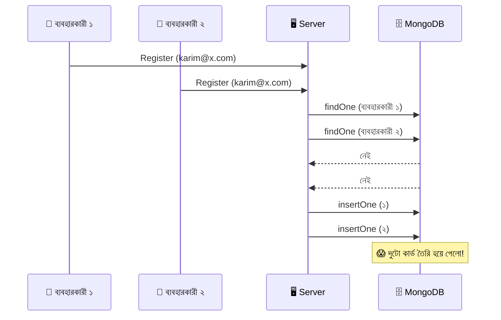
```mermaid
sequenceDiagram
    participant A as 👤 ব্যবহারকারী ১
    participant B as 👤 ব্যবহারকারী ২
    participant S as 🖥️ Server
    participant DB as 🗄️ MongoDB
    A->>S: Register (karim@x.com)
    B->>S: Register (karim@x.com)
    S->>DB: findOne (ব্যবহারকারী ১)
    S->>DB: findOne (ব্যবহারকারী ২)
    DB-->>S: নেই
    DB-->>S: নেই
    S->>DB: insertOne (১)
    S->>DB: insertOne (২)
    Note over DB: 😱 দুটো কার্ড তৈরি হয়ে গেলো!
```

**সমাধান: Unique Index।** database নিজেই পাহারা দেবে। একই মানের দ্বিতীয় কার্ড ঢোকাতে গেলেই সে **E11000 duplicate key error** দিয়ে ফিরিয়ে দেবে, দুইজন একসাথে এলেও।

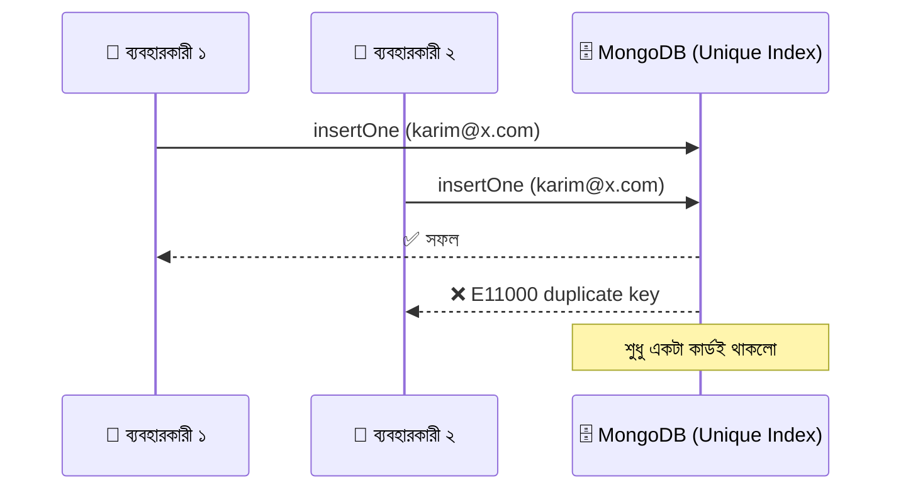
```mermaid
sequenceDiagram
    participant A as 👤 ব্যবহারকারী ১
    participant B as 👤 ব্যবহারকারী ২
    participant DB as 🗄️ MongoDB (Unique Index)
    A->>DB: insertOne (karim@x.com)
    B->>DB: insertOne (karim@x.com)
    DB-->>A: ✅ সফল
    DB-->>B: ❌ E11000 duplicate key
    Note over DB: শুধু একটা কার্ডই থাকলো
```

### Index বানানোর কোড

```javascript
db.users.createIndex({ email: 1 }, { unique: true });
// { email: 1 } = email ঘরের উপর ছোট থেকে বড় ক্রমে Index (1 = ascending, -1 = descending)
// { unique: true } = এই ঘরের মান পুরো collection-এ ইউনিক হতে হবে
// দুটো কাজ একসাথে: (১) ইমেইলে খোঁজা দ্রুত হয় (লগইনে কাজে লাগে), (২) ডুপ্লিকেট আটকায়

db.users.getIndexes();
// এখন কোন কোন Index আছে দেখি। _id_ আগে থেকেই থাকে, আর নতুন email_1
```

### এই ফাইলের সব Index একনজরে

| Collection | Index | কেন |
|---|---|---|
| `users` | `{ email: 1 }` **unique** | ডুপ্লিকেট আটকানো + লগইনে দ্রুত খোঁজা |
| `refresh_tokens` | `{ tokenHash: 1 }` | Token দিয়ে দ্রুত খোঁজা |
| `refresh_tokens` | `{ expiresAt: 1 }` + `expireAfterSeconds: 0` | **TTL Index:** মেয়াদ শেষ হলে কার্ড নিজে নিজে মুছে যায় |
| `loans` | `{ userId: 1 }` | সদস্যের ধারের তালিকা দ্রুত আনা / `$lookup` দ্রুত করা |

### TTL Index: নিজে নিজে মুছে যাওয়া কার্ড

গল্পে: **"এই কার্ডে একটা মেয়াদ লেখা থাকবে; মেয়াদ ফুরালে গ্রন্থাগারের ঝাড়ুদার নিজেই কার্ডটা ফেলে দেবে।"**

```javascript
db.refresh_tokens.createIndex({ expiresAt: 1 }, { expireAfterSeconds: 0 });
// expiresAt = কার্ডের ভেতরের একটা Date ঘর (কখন মেয়াদ শেষ)
// expireAfterSeconds: 0 = expiresAt-এর সময় পার হওয়া মাত্র মুছে দাও (০ সেকেন্ড অপেক্ষা)
// ⚠️ MongoDB-র ঝাড়ুদার প্রতি ~৬০ সেকেন্ডে একবার আসে, তাই মুছতে একটু দেরি হতে পারে
// ⚠️ ঘরটা অবশ্যই Date type হতে হবে, String হলে কাজ করবে না
```

> 💡 তাই কোডেও মেয়াদ **নিজে যাচাই** করবো (`expiresAt < new Date()`), কারণ TTL ঝাড়ুদার আসার আগেই মেয়াদ-শেষ কার্ড কিছুক্ষণ থেকে যেতে পারে।

### Duplicate error ধরার নিয়ম

```javascript
try {
  await users.insertOne(newUser);
} catch (err) {
  if (err.code === 11000) {
    // 11000 = MongoDB-র "duplicate key" error code
    // err.keyPattern = কোন ঘরে সমস্যা হলো, যেমন { email: 1 }
    return res.status(409).json({ error: "এই ইমেইলে আগেই সদস্যপদ নেওয়া হয়েছে।" });
    // 409 Conflict = "যা করতে চাইছো, তা আগের কিছুর সাথে সংঘর্ষ করছে"
  }
  throw err;
  // অন্য কোনো error হলে চেপে না গিয়ে আবার ছুড়ে দিই, যেন Express-এর error handler ধরে
}
```

---

## ৫. Password Hashing: পাসওয়ার্ড কেন কখনো সরাসরি রাখতে নেই

### গল্প

আপার এক বন্ধু জানতে চাইলেন: *"সদস্যদের পাসওয়ার্ড কোথায় রাখেন?"* আপা বললেন: *"রাখি না তো!"*

তিনি ব্যাখ্যা করলেন, এটা **সিল-মোহর** পদ্ধতির মতো: পাসওয়ার্ড শুনে একটা **একমুখী মেশিনে** ঢুকাই, সেখান থেকে একটা অদ্ভুত সিল বেরোয়। শুধু সিলটা কার্ডে রাখি। পরে কেউ পাসওয়ার্ড বললে আবার মেশিনে ঢুকিয়ে সিল বানাই, আর দুই সিল মিললেই "ঠিক আছে"। **সিল দেখে পাসওয়ার্ড উদ্ধার করার কোনো উপায় নেই।** চোর ডেটাবেস চুরি করলেও শুধু সিল পাবে।

### তিনটা ভুল-বোঝা শব্দ

| | Encoding | Encryption | Hashing |
|---|---|---|---|
| কাজ | ডেটার চেহারা বদলানো | গোপন করা, **চাবি দিয়ে ফেরানো যায়** | গোপন করা, **ফেরানো যায় না** |
| উদাহরণ | Base64 | AES | bcrypt, argon2 |
| পাসওয়ার্ডের জন্য? | ❌ কেউ ফেরাতে পারে | ❌ চাবি চুরি হলে সব শেষ | ✅ **এটাই ঠিক** |

### bcrypt কীভাবে কাজ করে

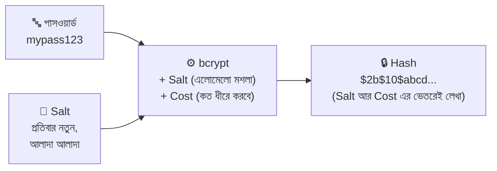
```mermaid
flowchart LR
    P["🔤 পাসওয়ার্ড<br/>mypass123"] --> M["⚙️ bcrypt<br/>+ Salt (এলোমেলো মশলা)<br/>+ Cost (কত ধীরে করবে)"]
    S["🧂 Salt<br/>প্রতিবার নতুন,<br/>আলাদা আলাদা"] --> M
    M --> H["🔒 Hash<br/>$2b$10$abcd...<br/>(Salt আর Cost এর ভেতরেই লেখা)"]
```

bcrypt-এর দুটো সুপারপাওয়ার:

1. **Salt (গোপন মশলা):** প্রতিবার আলাদা এলোমেলো মান মেশানো হয়। তাই **দুইজন একই পাসওয়ার্ড দিলেও তাদের hash আলাদা** দেখায়। চোর "আগে থেকে বানানো তালিকা" (Rainbow Table) দিয়ে কিছু করতে পারে না।
2. **Cost / Salt Rounds (ইচ্ছাকৃত ধীর):** hash বানাতে ইচ্ছা করে সময় লাগানো হয় (সাধারণত ১০-১২)। একজন সদস্যের কাছে ০.১ সেকেন্ড কিছুই নয়, কিন্তু চোরের কাছে কোটি কোটি চেষ্টা করতে গেলে **অনন্তকাল**।

Hash-এর গঠন: `$2b$10$N9qo8uLOickgx2ZMRZoMye...`

| অংশ | মানে |
|---|---|
| `$2b$` | bcrypt-এর সংস্করণ |
| `10` | Cost (salt rounds) |
| পরের ২২ অক্ষর | Salt |
| বাকিটা | আসল hash |

> 🔎 তাই যাচাই করার সময় আলাদা করে salt সংরক্ষণ করতে হয় না, সবকিছু hash-এর ভেতরেই আছে।

### কেন MD5 বা SHA-256 নয়?

MD5/SHA-256 বানানো হয়েছে **দ্রুত** হওয়ার জন্য (ফাইলের মিল দেখতে)। কিন্তু পাসওয়ার্ডের জন্য "দ্রুত" মানেই চোরের সুবিধা: একটা সাধারণ কম্পিউটার সেকেন্ডে কোটি কোটি SHA-256 চেষ্টা করতে পারে। bcrypt, scrypt, argon2 বানানোই হয়েছে **ইচ্ছাকৃত ধীর** করে।

### কোড: hash করা আর মেলানো

```bash
npm install bcrypt
# bcrypt = পাসওয়ার্ড hash করার লাইব্রেরি
# (Windows-এ বা build সমস্যা হলে বিকল্প: npm install bcryptjs, ব্যবহার একই, শুধু require("bcryptjs"))
```

```javascript
const bcrypt = require("bcrypt");
// bcrypt = hash আর compare করার ফাংশন এখানে আছে

const SALT_ROUNDS = 10;
// SALT_ROUNDS = cost। ১০ মানে 2^10 = ১০২৪ বার ভেতরের কাজ। বাড়ালে নিরাপত্তা বাড়ে কিন্তু login ধীর হয়
// ১০-১২ সাধারণ প্রজেক্টের জন্য ঠিক আছে

async function demo() {
  const plain = "mypass123";
  // plain = ব্যবহারকারীর দেওয়া আসল পাসওয়ার্ড। এটা শুধু মেমোরিতে মুহূর্তের জন্য থাকে, database-এ যায় না

  const hash1 = await bcrypt.hash(plain, SALT_ROUNDS);
  // hash1 = আসল সিল। bcrypt.hash নিজে নতুন salt বানিয়ে মিশিয়ে দেয়। await লাগে কারণ কাজটা ভারী
  const hash2 = await bcrypt.hash(plain, SALT_ROUNDS);
  // hash2 = একই পাসওয়ার্ড, কিন্তু salt আলাদা, তাই hash1 আর hash2 আলাদা দেখাবে
  console.log(hash1 === hash2);
  // false: কারণ salt আলাদা

  const ok = await bcrypt.compare("mypass123", hash1);
  // ok = true। compare hash1-এর ভেতর থেকে salt আর cost বের করে, নিজে আবার hash বানিয়ে মেলায়
  const bad = await bcrypt.compare("wrongpass", hash1);
  // bad = false
  console.log(ok, bad);
  // ⚠️ পাসওয়ার্ডের hash কখনো === দিয়ে মেলাবেন না। সবসময় bcrypt.compare ব্যবহার করুন
}
```

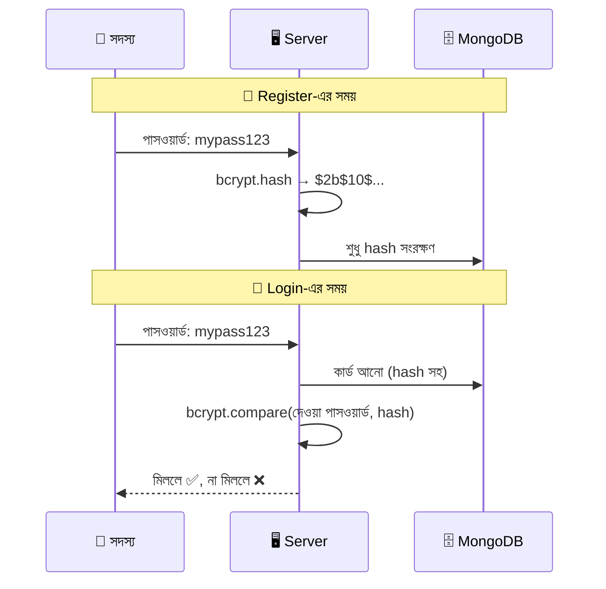
```mermaid
sequenceDiagram
    participant U as 👤 সদস্য
    participant S as 🖥️ Server
    participant DB as 🗄️ MongoDB
    Note over U,DB: 📝 Register-এর সময়
    U->>S: পাসওয়ার্ড: mypass123
    S->>S: bcrypt.hash → $2b$10$...
    S->>DB: শুধু hash সংরক্ষণ
    Note over U,DB: 🚪 Login-এর সময়
    U->>S: পাসওয়ার্ড: mypass123
    S->>DB: কার্ড আনো (hash সহ)
    S->>S: bcrypt.compare(দেওয়া পাসওয়ার্ড, hash)
    S-->>U: মিললে ✅, না মিললে ❌
```

### ⚠️ ছোট কিন্তু গুরুত্বপূর্ণ কথা

| বিষয় | ব্যাখ্যা |
|---|---|
| পাসওয়ার্ড কত লম্বা | bcrypt **প্রথম ৭২ বাইট** পর্যন্ত দেখে। তাই সর্বোচ্চ দৈর্ঘ্য (যেমন ৭২ বা ১২৮ অক্ষর) নিয়ম করে দিন |
| পাসওয়ার্ড কখনোই log করবেন না | `console.log(req.body)` করলে পাসওয়ার্ড টার্মিনালে/লগ-ফাইলে চলে যায় |
| পাসওয়ার্ড `trim()` করবেন না | স্পেসও পাসওয়ার্ডের অংশ হতে পারে |
| আধুনিক বিকল্প | `argon2` আরও নতুন ও শক্তিশালী, তবে bcrypt এখনো বহুল ব্যবহৃত ও যথেষ্ট ভালো |

---

## ৬. প্রজেক্ট সেটআপ, ফোল্ডার আর Database সংযোগ

### ফোল্ডার কাঠামো

```
📦 library-auth/
 ┣ 📂 src/
 ┃ ┣ 📜 server.js                  ← Express চালু, middleware বসানো, route জোড়া
 ┃ ┣ 📜 db.js                      ← MongoDB সংযোগ + Index তৈরি
 ┃ ┣ 📂 routes/
 ┃ ┃ ┣ 📜 auth.routes.js           ← register, login, refresh, logout, me, change-password
 ┃ ┃ ┗ 📜 admin.routes.js          ← শুধু admin/librarian-এর route
 ┃ ┣ 📂 middleware/
 ┃ ┃ ┗ 📜 auth.js                  ← requireAuth, authorize (দারোয়ান)
 ┃ ┗ 📂 utils/
 ┃   ┗ 📜 tokens.js                ← Token বানানোর সাহায্যকারী ফাংশন
 ┣ 📜 .env                         ← ⚠️ গোপন, কখনো push করবেন না
 ┣ 📜 .gitignore
 ┗ 📜 package.json
```

### প্যাকেজ ইনস্টল

```bash
npm init -y
npm install express mongodb bcrypt jsonwebtoken cookie-parser cors dotenv
# express        = server আর route
# mongodb        = MongoDB-র অফিসিয়াল driver (আগের ফাইলে যা শিখেছেন)
# bcrypt         = পাসওয়ার্ড hash (সেকশন ৫)
# jsonwebtoken   = JWT বানানো ও যাচাই (সেকশন ৯)
# cookie-parser  = request-এর Cookie পড়া (Refresh Token-এর জন্য)
# cors           = আলাদা origin-এর frontend (React) থেকে request আসতে দেওয়া
# dotenv         = .env ফাইল থেকে গোপন মান পড়া
```

### `.env` ফাইল

```bash
PORT=5000
# PORT = server কোন port-এ চলবে

MONGODB_URI=mongodb://localhost:27017
# MONGODB_URI = connection string (Atlas হলে mongodb+srv://... ঠিকানা)

DB_NAME=library
# DB_NAME = কোন database ব্যবহার করবো

JWT_ACCESS_SECRET=এখানে_খুব_লম্বা_এলোমেলো_গোপন_মান
# JWT_ACCESS_SECRET = Access Token-এ "সই" করার গোপন চাবি। ফাঁস হলে যে কেউ নকল Token বানাতে পারবে!
# বানানোর উপায়: node -e "console.log(require('crypto').randomBytes(64).toString('hex'))"

ACCESS_TOKEN_EXPIRES=15m
# ACCESS_TOKEN_EXPIRES = Access Token কতক্ষণ চলবে (15m = ১৫ মিনিট)। ছোট রাখা নিরাপদ

REFRESH_TOKEN_DAYS=7
# REFRESH_TOKEN_DAYS = Refresh Token কত দিন চলবে

CLIENT_ORIGIN=http://localhost:5173
# CLIENT_ORIGIN = frontend-এর ঠিকানা (CORS-এর জন্য)। React (Vite) সাধারণত 5173-এ চলে

NODE_ENV=development
# NODE_ENV = development বা production। production-এ Cookie "secure" হবে
```

`.gitignore`-এ অবশ্যই থাকবে:

```
node_modules/
.env
```

### `src/db.js`: সংযোগ আর Index

```javascript
// src/db.js: MongoDB-র সাথে একবারই সংযোগ, বাকি সব ফাইল এখান থেকে db নিয়ে ব্যবহার করবে

const { MongoClient } = require("mongodb");
// MongoClient = database সংযোগের ক্লাস

let db;
// db = সংযোগ হয়ে গেলে এখানে database-এর হাতল রাখবো। শুরুতে খালি (undefined)
// ফাইলের ভেতরে (module-level) রাখা হলো, যাতে যতবার require করি একটাই db পাই (একটাই সংযোগ)

async function connectDB() {
  // async, কারণ connect আর createIndex দুটোই সময় নেয়

  const client = new MongoClient(process.env.MONGODB_URI);
  // client এখানে (ফাংশনের ভেতরে) বানালাম, যাতে dotenv আগে চালু হয়ে গেলে তবেই process.env পড়ি
  // (ফাইলের উপরে বানালে dotenv চালুর আগেই MONGODB_URI পড়তে গিয়ে undefined পাওয়ার ভয় থাকে)

  await client.connect();
  // server-এর সাথে সংযোগ

  db = client.db(process.env.DB_NAME);
  // db = আমাদের database-এর হাতল

  await db.collection("users").createIndex({ email: 1 }, { unique: true });
  // ইমেইল ইউনিক Index (সেকশন ৪)। ইতিমধ্যে থাকলে MongoDB চুপচাপ কিছু করে না (idempotent), তাই বারবার চালানো নিরাপদ

  const tokens = db.collection("refresh_tokens");
  // tokens = refresh_tokens collection-এর হাতল

  await tokens.createIndex({ tokenHash: 1 });
  // tokenHash দিয়ে দ্রুত খোঁজার Index

  await tokens.createIndex({ expiresAt: 1 }, { expireAfterSeconds: 0 });
  // TTL Index: মেয়াদ ফুরালে কার্ড নিজে মুছে যাবে

  await db.collection("loans").createIndex({ userId: 1 });
  // সদস্যের ধারের তালিকা দ্রুত আনার Index

  console.log("✅ MongoDB সংযুক্ত");
  return db;
}

function getDB() {
  if (!db) throw new Error("আগে connectDB() চালাতে হবে");
  // সংযোগ হওয়ার আগে কেউ getDB ডাকলে স্পষ্ট বার্তায় থামাই, রহস্যময় error না
  return db;
}

module.exports = { connectDB, getDB };
// connectDB = server চালুর সময় একবার। getDB = অন্য সব ফাইলে db দরকার হলে
```

### `src/server.js`: Express চালু

```javascript
// src/server.js

require("dotenv").config();
// ⚠️ সবার আগে! .env-এর মান process.env-এ ঢোকায়। এর আগে অন্য কিছু process.env পড়লে undefined পাবে

const express = require("express");
const cookieParser = require("cookie-parser");
const cors = require("cors");
const { connectDB } = require("./db");
const authRoutes = require("./routes/auth.routes");
const adminRoutes = require("./routes/admin.routes");

async function start() {
  await connectDB();
  // আগে database সংযোগ হোক, তারপর server চালু। সংযোগ ছাড়া route চালু করলে প্রথম request-এই ভেঙে পড়বে

  const app = express();
  // app = আমাদের Express অ্যাপ (আগের Express ফাইলের মতোই)

  app.use(cors({ origin: process.env.CLIENT_ORIGIN, credentials: true }));
  // origin = শুধু আমাদের frontend থেকে আসা request গ্রহণ করবো ("*" নয়)
  // credentials: true = Cookie (Refresh Token) আদান-প্রদান করতে দেওয়া। frontend-এও credentials: "include" লাগবে

  app.use(express.json());
  // JSON body পড়ার middleware। এটা না থাকলে req.body হবে undefined

  app.use(cookieParser());
  // Cookie পড়ার middleware। এটা থাকলে req.cookies.refreshToken পাওয়া যাবে

  app.use("/auth", authRoutes);
  // /auth/register, /auth/login... সব এখানে
  app.use("/admin", adminRoutes);
  // /admin/... শুধু বিশেষ role-এর জন্য

  app.use((req, res) => res.status(404).json({ error: "এই ঠিকানা পাওয়া যায়নি" }));
  // 404 handler: কোনো route না মিললে

  app.use((err, req, res, next) => {
    // ৪ আর্গুমেন্টের ফাংশন = Express-এর error handler। Express 5-এ async handler-এর error নিজে এখানে আসে
    console.error(err);
    // ভেতরের আসল error শুধু server-এর লগে
    res.status(500).json({ error: "সার্ভারে সমস্যা হয়েছে" });
    // client-কে ভেতরের কিছু ফাঁস করি না (stack trace, query ইত্যাদি)
  });

  const port = process.env.PORT || 5000;
  app.listen(port, () => console.log(`🚀 http://localhost:${port}`));
}

start();
// server চালু
```

---

## ৭. Register API: সদস্যপদ নেওয়া

### গল্প

নতুন সদস্য **করিম** পাঠাগারে এসে ফর্ম ভরলেন: নাম, ইমেইল, পাসওয়ার্ড। মৌসুমী আপা একটা নির্দিষ্ট ক্রমে কাজ করেন, আর প্রতিটা ধাপ কেন আছে তা জানা জরুরি:

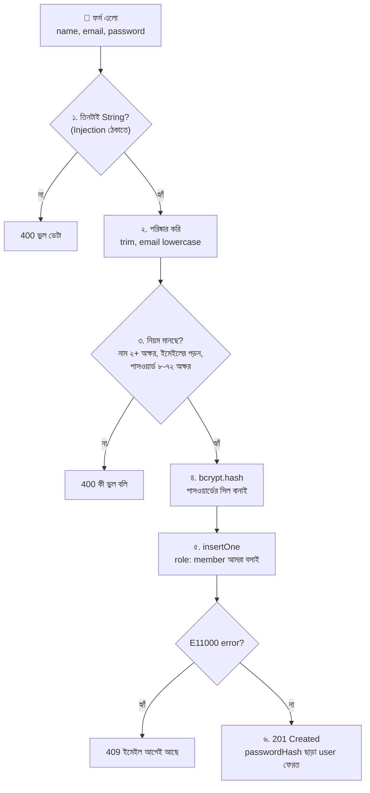
```mermaid
flowchart TD
    A["📨 ফর্ম এলো<br/>name, email, password"] --> B{"১. তিনটাই String?<br/>(Injection ঠেকাতে)"}
    B -->|"না"| E1["400 ভুল ডেটা"]
    B -->|"হ্যাঁ"| C["২. পরিষ্কার করি<br/>trim, email lowercase"]
    C --> D{"৩. নিয়ম মানছে?<br/>নাম ২+ অক্ষর, ইমেইলের গড়ন,<br/>পাসওয়ার্ড ৮-৭২ অক্ষর"}
    D -->|"না"| E2["400 কী ভুল বলি"]
    D -->|"হ্যাঁ"| F["৪. bcrypt.hash<br/>পাসওয়ার্ডের সিল বানাই"]
    F --> G["৫. insertOne<br/>role: member আমরা বসাই"]
    G --> H{"E11000 error?"}
    H -->|"হ্যাঁ"| E3["409 ইমেইল আগেই আছে"]
    H -->|"না"| I["৬. 201 Created<br/>passwordHash ছাড়া user ফেরত"]
```

### `src/routes/auth.routes.js`, প্রথম অংশ: শুরু আর Register

```javascript
// src/routes/auth.routes.js

const express = require("express");
const bcrypt = require("bcrypt");
const crypto = require("crypto");
const { ObjectId } = require("mongodb");
const { getDB } = require("../db");
const { signAccessToken, issueRefreshToken, REFRESH_COOKIE, cookieOptions, sha256 } = require("../utils/tokens");
const { requireAuth } = require("../middleware/auth");

const router = express.Router();
// router = ছোট Express অ্যাপ, শুধু /auth-এর route রাখার জন্য (server.js-এ app.use("/auth", ...) দিয়ে জোড়া)

const SALT_ROUNDS = 10;
// SALT_ROUNDS = bcrypt-এর cost (সেকশন ৫)

const DUMMY_HASH = bcrypt.hashSync("dummy-password-for-timing", SALT_ROUNDS);
// DUMMY_HASH = একটা নকল hash, server চালুর সময় একবার বানানো। Login-এ ইমেইল না মিললেও compare চালাতে কাজে লাগবে (কারণ সেকশন ৮-এ)

const EMAIL_REGEX = /^[^\s@]+@[^\s@]+\.[^\s@]+$/;
// EMAIL_REGEX = ইমেইলের মোটামুটি গড়ন: কিছু@কিছু.কিছু, ভেতরে ফাঁকা নয়। (আসল যাচাই হলো ইমেইলে লিংক পাঠিয়ে যাচাই করা)

const users = () => getDB().collection("users");
// users() = ফাংশন, কারণ getDB() শুধু connectDB-র পরে কাজ করে। ফাইল লোডের সময় সরাসরি লিখলে তখনো db তৈরি হয়নি

// ============ 📝 REGISTER ============
router.post("/register", async (req, res) => {
  // async handler। Express 5-এ ভেতরের error নিজে error handler-এ যায়

  const { name, email, password } = req.body;
  // req.body থেকে শুধু ৩টা ঘর তুললাম। role, isActive এসব ইচ্ছা করেই তুলিনি (Mass Assignment থেকে বাঁচতে)

  if (typeof name !== "string" || typeof email !== "string" || typeof password !== "string") {
    return res.status(400).json({ error: "name, email, password তিনটাই লেখা (string) হতে হবে।" });
    // typeof যাচাই: কেউ email-এ { "$gt": "" } অবজেক্ট পাঠালে এখানেই আটকে যাবে (NoSQL Injection, সেকশন ১৪)
  }

  const cleanName = name.trim();
  // cleanName = আগে-পরের ফাঁকা বাদ দেওয়া নাম
  const cleanEmail = email.trim().toLowerCase();
  // cleanEmail = ছোট হাতের, ফাঁকাহীন ইমেইল। সংরক্ষণেও এটাই যাবে, খোঁজার সময়ও এটাই ব্যবহার করবো

  if (cleanName.length < 2 || cleanName.length > 60) {
    return res.status(400).json({ error: "নাম ২ থেকে ৬০ অক্ষরের হতে হবে।" });
  }
  if (!EMAIL_REGEX.test(cleanEmail)) {
    return res.status(400).json({ error: "ইমেইলের ফরম্যাট ঠিক নয়।" });
  }
  if (password.length < 8 || password.length > 72) {
    return res.status(400).json({ error: "পাসওয়ার্ড ৮ থেকে ৭২ অক্ষরের হতে হবে।" });
    // ৭২ কারণ bcrypt এর বেশি দেখে না (সেকশন ৫)। পাসওয়ার্ডে trim করি না
  }

  const passwordHash = await bcrypt.hash(password, SALT_ROUNDS);
  // passwordHash = পাসওয়ার্ডের সিল। এরপর থেকে আসল password ভেরিয়েবলটা আর ব্যবহার হবে না

  const now = new Date();
  // now = createdAt আর updatedAt একই মুহূর্তের হোক, তাই একবারই বানালাম

  const newUser = {
    name: cleanName,
    email: cleanEmail,
    passwordHash,
    role: "member",
    // role আমরা নিজে "member" বসালাম, client-এর কথায় নয়
    isActive: true,
    createdAt: now,
    updatedAt: now,
    lastLoginAt: null,
  };

  try {
    const result = await users().insertOne(newUser);
    // result.insertedId = MongoDB-র বানানো নতুন _id

    return res.status(201).json({
      message: "সদস্যপদ সফল হয়েছে।",
      user: { _id: result.insertedId, name: cleanName, email: cleanEmail, role: "member" },
      // ⚠️ response-এ passwordHash দিইনি। কোন কোন ঘর ফেরত যাবে তা আমরা হাতে বেছে দিচ্ছি (newUser পুরোটা নয়)
    });
    // 201 Created = নতুন কিছু তৈরি হয়েছে
  } catch (err) {
    if (err.code === 11000) {
      return res.status(409).json({ error: "এই ইমেইলে আগেই সদস্যপদ নেওয়া হয়েছে।" });
      // Unique Index-এর কাজ (সেকশন ৪)। দুইজন একসাথে এলেও একজনই ঢুকতে পারবে
    }
    throw err;
  }
});
```

> 🔍 **নোট:** Register-এ "ইমেইল আগেই আছে" বলা মানে কারও ইমেইল আছে কি না জানিয়ে দেওয়া (**User Enumeration**)। বড় সাইটে এই তথ্য ফাঁস এড়াতে অনেকে "ভেরিফিকেশন ইমেইল পাঠানো হয়েছে" বলেন সবসময়। শেখার প্রজেক্টে স্পষ্ট বার্তা দেওয়াই সুবিধাজনক।

---

## ৮. Login API: গেটে পরিচয় দেখানো

### গল্প

কিছুদিন পর করিম আবার এলেন। গেটে নাম-পাসওয়ার্ড বললেন। আপা এবার:

1. ইমেইল দিয়ে আলমারি থেকে **করিমের কার্ড** খোঁজেন।
2. কার্ড থেকে **সিল (hash)** বের করে, করিমের বলা পাসওয়ার্ড দিয়ে **নতুন সিল** বানিয়ে **মেলান**।
3. মিললে একটা **প্রবেশপত্র (Token)** গলায় ঝুলিয়ে দেন।

কিন্তু আপার দুটো বিশেষ সতর্কতা আছে:

| সতর্কতা | কেন |
|---|---|
| ভুল হলে শুধু বলেন **"ইমেইল বা পাসওয়ার্ড ভুল"**, কোনটা ভুল বলেন না | নাহলে চোর জেনে যাবে কোন ইমেইল আমাদের সদস্যের (User Enumeration) |
| ইমেইল না মিললেও একটা **নকল hash-এর সাথে compare** চালান | নাহলে "ইমেইল নেই" উত্তর দ্রুত আসে আর "পাসওয়ার্ড ভুল" উত্তর ধীরে, সেই সময়ের পার্থক্য দেখে চোর ইমেইল আন্দাজ করতে পারে (Timing Attack) |

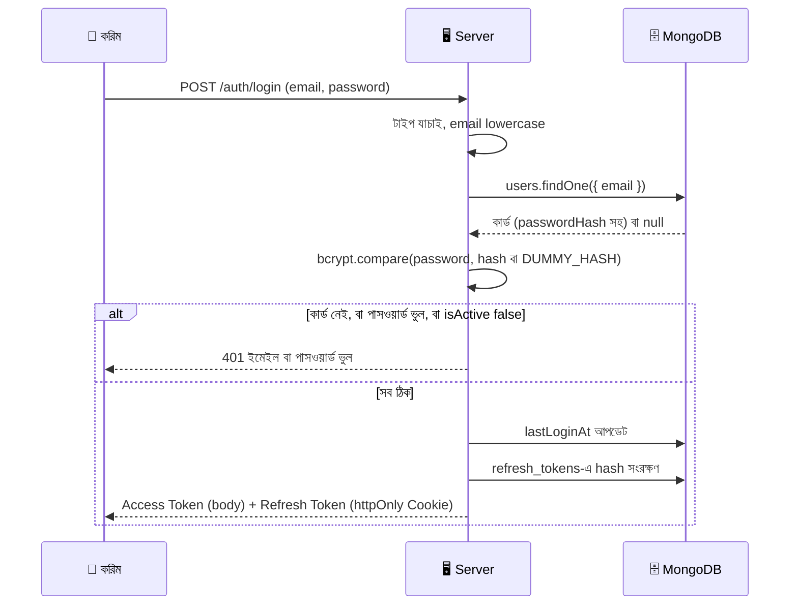
```mermaid
sequenceDiagram
    participant U as 👤 করিম
    participant S as 🖥️ Server
    participant DB as 🗄️ MongoDB
    U->>S: POST /auth/login (email, password)
    S->>S: টাইপ যাচাই, email lowercase
    S->>DB: users.findOne({ email })
    DB-->>S: কার্ড (passwordHash সহ) বা null
    S->>S: bcrypt.compare(password, hash বা DUMMY_HASH)
    alt কার্ড নেই, বা পাসওয়ার্ড ভুল, বা isActive false
        S-->>U: 401 ইমেইল বা পাসওয়ার্ড ভুল
    else সব ঠিক
        S->>DB: lastLoginAt আপডেট
        S->>DB: refresh_tokens-এ hash সংরক্ষণ
        S-->>U: Access Token (body) + Refresh Token (httpOnly Cookie)
    end
```

### `auth.routes.js`, দ্বিতীয় অংশ: Login

```javascript
// ============ 🚪 LOGIN ============
router.post("/login", async (req, res) => {
  const { email, password } = req.body;

  if (typeof email !== "string" || typeof password !== "string") {
    return res.status(400).json({ error: "email আর password লেখা (string) হতে হবে।" });
    // ⚠️ এই যাচাই ছাড়া { "email": "x", "password": { "$ne": "" } } দিয়ে ঢোকার চেষ্টা চলতো (সেকশন ১৪)
  }

  const user = await users().findOne({ email: email.trim().toLowerCase() });
  // user = ইমেইল মেলা কার্ড, না মিললে null। Register-এর মতোই trim + lowercase, নাহলে মিলবে না
  // ইমেইলের উপর Unique Index আছে, তাই এই খোঁজা দ্রুত

  const hashToCompare = user ? user.passwordHash : DUMMY_HASH;
  // কার্ড থাকলে আসল hash, না থাকলে নকল hash। যাতে দুই ক্ষেত্রেই bcrypt.compare সমান সময় নেয় (Timing Attack ঠেকানো)

  const passwordOk = await bcrypt.compare(password, hashToCompare);
  // passwordOk = দেওয়া পাসওয়ার্ডের সিল, কার্ডের সিলের সাথে মিলেছে কি না (true/false)

  if (!user || !passwordOk || !user.isActive) {
    return res.status(401).json({ error: "ইমেইল বা পাসওয়ার্ড ভুল।" });
    // তিন ক্ষেত্রেই একই বার্তা: কার্ড নেই / পাসওয়ার্ড ভুল / কার্ড বন্ধ। কোনটা, তা বাইরে বলি না
  }

  await users().updateOne({ _id: user._id }, { $set: { lastLoginAt: new Date() } });
  // lastLoginAt আপডেট: প্রধানের রিপোর্টে "কে কবে শেষ ঢুকেছে" দেখাতে কাজে লাগবে

  const accessToken = signAccessToken(user);
  // accessToken = ছোট মেয়াদের প্রবেশপত্র (JWT), সেকশন ৯

  await issueRefreshToken(res, user._id);
  // refresh token বানিয়ে database-এ (hash করে) রাখে আর Cookie-তে বসায়, সেকশন ১১

  return res.json({
    message: "লগইন সফল।",
    accessToken,
    // accessToken response body-তে যায়। frontend এটা মেমোরিতে রাখবে আর প্রতি request-এ পাঠাবে
    user: { _id: user._id, name: user.name, email: user.email, role: user.role },
    // আবারও শুধু বেছে নেওয়া ঘর, passwordHash বাদ
  });
});
```

---

## ৯. JWT: প্রবেশপত্রের গল্প

### গল্প

লগইন সফল হলে আপা করিমকে একটা **রঙিন ব্যাজ (প্রবেশপত্র)** দেন। ব্যাজে লেখা:

> *"করিম, সদস্য, আজ বিকেল ৪টা পর্যন্ত বৈধ। ইতি: জ্ঞানকুটির পাঠাগার"*
> আর তার নিচে আপার **গোপন সই**।

এখন করিম প্রতিটা দরজায় শুধু এই ব্যাজ দেখায়। দারোয়ান রহিম চাচা **আপাকে জিজ্ঞেস না করেই** শুধু সই মিলিয়ে বুঝে ফেলেন: ব্যাজ আসল কি নকল, মেয়াদ আছে কি না, আর ভেতরে কী লেখা (কে, কোন role)। এতে আপাকে বারবার আলমারি ঘেঁটে দেখতে হয় না। এটাই **JWT (JSON Web Token)**, আর এই ধরনের পদ্ধতিকে বলে **Stateless Authentication** (server কোনো সেশন মনে রাখে না)।

### JWT-এর তিন ভাগ

`xxxxx.yyyyy.zzzzz`, তিনটা অংশ ডট (`.`) দিয়ে জোড়া:

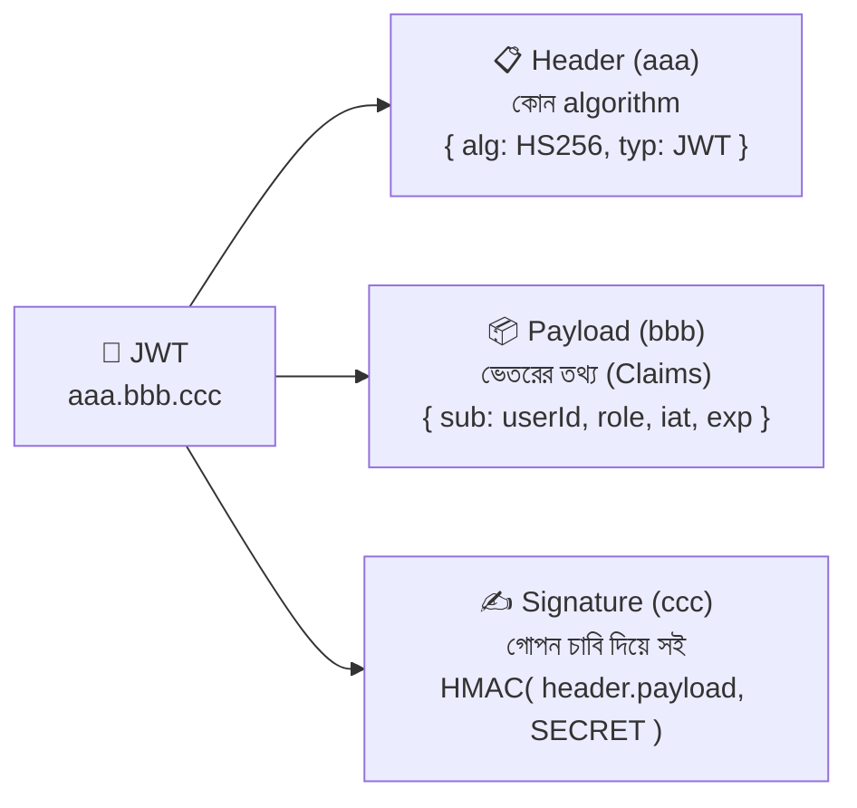
```mermaid
flowchart LR
    T["🎫 JWT<br/>aaa.bbb.ccc"] --> H["📋 Header (aaa)<br/>কোন algorithm<br/>{ alg: HS256, typ: JWT }"]
    T --> P["📦 Payload (bbb)<br/>ভেতরের তথ্য (Claims)<br/>{ sub: userId, role, iat, exp }"]
    T --> SG["✍️ Signature (ccc)<br/>গোপন চাবি দিয়ে সই<br/>HMAC( header.payload, SECRET )"]
```

| অংশ | গল্পে | কী থাকে |
|---|---|---|
| **Header** | ব্যাজের ধরন | কোন algorithm-এ সই হয়েছে (`HS256`) |
| **Payload** | ব্যাজে লেখা তথ্য | `sub` (subject = কার ব্যাজ, এখানে userId), `role`, `iat` (কখন বানানো), `exp` (কখন মেয়াদ শেষ) |
| **Signature** | আপার গোপন সই | Header + Payload + **গোপন চাবি** মিলিয়ে বানানো। কেউ Payload বদলালে সই আর মিলবে না |

> 🚨 **সবচেয়ে বড় ভুল-ধারণা:** JWT-এর Payload **এনক্রিপ্ট করা নয়**, শুধু Base64 করা। যে কেউ ডিকোড করে পড়তে পারে (jwt.io-তে পেস্ট করলেই দেখা যায়)। সই থাকে শুধু **বদল ঠেকাতে**, **গোপন রাখতে নয়**। তাই Payload-এ **পাসওয়ার্ড, ফোন নম্বর বা গোপন কিছু কখনো রাখবেন না।** শুধু `sub` আর `role`-এর মতো ন্যূনতম তথ্য।

### Token যাচাই কীভাবে হয়

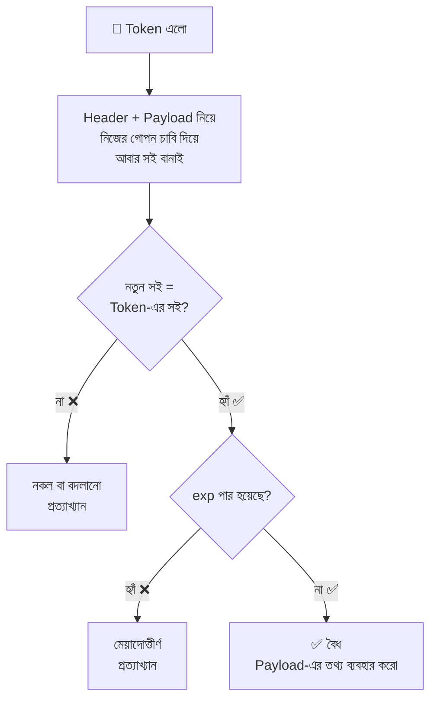
```mermaid
flowchart TD
    A["🎫 Token এলো"] --> B["Header + Payload নিয়ে<br/>নিজের গোপন চাবি দিয়ে<br/>আবার সই বানাই"]
    B --> C{"নতুন সই =<br/>Token-এর সই?"}
    C -->|"না ❌"| D["নকল বা বদলানো<br/>প্রত্যাখ্যান"]
    C -->|"হ্যাঁ ✅"| E{"exp পার হয়েছে?"}
    E -->|"হ্যাঁ ❌"| F["মেয়াদোত্তীর্ণ<br/>প্রত্যাখ্যান"]
    E -->|"না ✅"| G["✅ বৈধ<br/>Payload-এর তথ্য ব্যবহার করো"]
```

### দুই ধরনের Token কেন?

আপা ভাবলেন: *"ব্যাজের মেয়াদ যদি ৩০ দিন করি আর কেউ চুরি করে, ৩০ দিন সে ঢুকতে পারবে। আর মেয়াদ যদি ১৫ মিনিট করি, করিমকে প্রতি ১৫ মিনিটে পাসওয়ার্ড বলতে হবে, বিরক্তিকর!"*

সমাধান: **দুটো আলাদা কার্ড**।

| | 🎫 Access Token | 🔄 Refresh Token |
|---|---|---|
| গল্পে | গলায় ঝোলানো ব্যাজ | আপার কাছ থেকে নেওয়া **নবায়ন-স্লিপ** |
| মেয়াদ | **ছোট** (১৫ মিনিট) | **লম্বা** (৭ দিন) |
| কাজ | প্রতিটা সুরক্ষিত request-এ দেখানো | শুধু নতুন Access Token চাইতে দেখানো |
| কোথায় রাখে | frontend-এর **মেমোরিতে** (JS ভেরিয়েবল) | **httpOnly Cookie** (JS পড়তে পারে না) |
| database-এ | ❌ না (stateless) | ✅ **hash করে** রাখি (বাতিল করা যায়) |
| চুরি গেলে ক্ষতি | ১৫ মিনিটের মধ্যে শেষ | বাতিল করে দেওয়া যায় (database থেকে মুছে) |

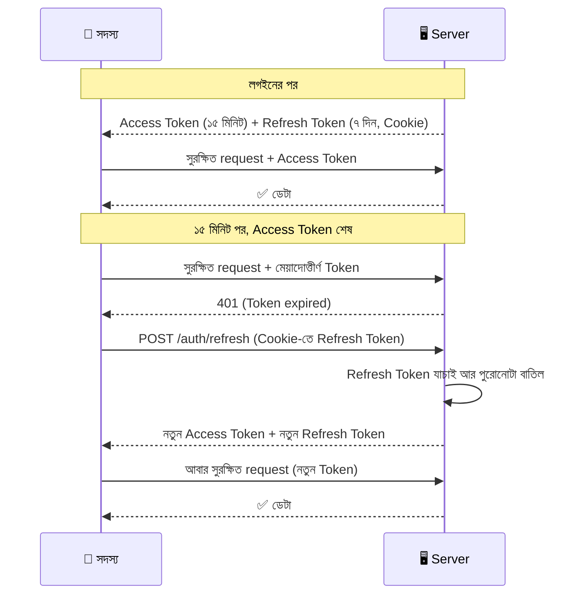
```mermaid
sequenceDiagram
    participant U as 👤 সদস্য
    participant S as 🖥️ Server
    Note over U,S: লগইনের পর
    S-->>U: Access Token (১৫ মিনিট) + Refresh Token (৭ দিন, Cookie)
    U->>S: সুরক্ষিত request + Access Token
    S-->>U: ✅ ডেটা
    Note over U,S: ১৫ মিনিট পর, Access Token শেষ
    U->>S: সুরক্ষিত request + মেয়াদোত্তীর্ণ Token
    S-->>U: 401 (Token expired)
    U->>S: POST /auth/refresh (Cookie-তে Refresh Token)
    S->>S: Refresh Token যাচাই আর পুরোনোটা বাতিল
    S-->>U: নতুন Access Token + নতুন Refresh Token
    U->>S: আবার সুরক্ষিত request (নতুন Token)
    S-->>U: ✅ ডেটা
```

### Token কোথায় রাখবো: localStorage বনাম Cookie

| | localStorage | httpOnly Cookie |
|---|---|---|
| JavaScript পড়তে পারে? | ✅ পারে | ❌ পারে না |
| XSS (দূষিত script) দিয়ে চুরি? | 🚨 সহজে চুরি যায় | ✅ কঠিন (JS দিয়ে ধরা যায় না) |
| CSRF (অন্য সাইট থেকে জাল request)? | ✅ নেই | ⚠️ ঝুঁকি আছে (`sameSite` দিয়ে ঠেকাই) |
| আমাদের সিদ্ধান্ত | ❌ ব্যবহার করছি না | ✅ **Refresh Token** এখানে, **Access Token** মেমোরিতে |

> 🧠 এই মিশ্র পদ্ধতিটাই আজকাল বেশি সুপারিশ করা হয়: দীর্ঘমেয়াদি Refresh Token থাকে **httpOnly Cookie**-তে (চুরি করা কঠিন), আর স্বল্পমেয়াদি Access Token থাকে মেমোরিতে।

### `src/utils/tokens.js`

```javascript
// src/utils/tokens.js: Token বানানোর সব কাজ এক জায়গায়

const jwt = require("jsonwebtoken");
const crypto = require("crypto");
const { getDB } = require("../db");

const REFRESH_COOKIE = "refreshToken";
// REFRESH_COOKIE = Cookie-র নাম। এক জায়গায় লিখে রাখলাম যাতে বানানো, পড়া আর মোছায় বানান ভুল না হয়

const REFRESH_DAYS = Number(process.env.REFRESH_TOKEN_DAYS) || 7;
// REFRESH_DAYS = .env থেকে পড়া (String), Number() দিয়ে সংখ্যা। না থাকলে ডিফল্ট ৭

const isProd = process.env.NODE_ENV === "production";
// isProd = production-এ চলছে কি না

const cookieOptions = {
  httpOnly: true,
  // httpOnly = ব্রাউজারের JavaScript এই Cookie পড়তে পারবে না (XSS থেকে সুরক্ষা)
  secure: isProd,
  // secure = production-এ শুধু HTTPS-এ পাঠাবে। লোকাল (http) এ false, নাহলে Cookie বসবেই না
  sameSite: "lax",
  // sameSite = অন্য সাইট থেকে আসা জাল request-এ Cookie পাঠাবে না (CSRF-এর বিরুদ্ধে)
  // ⚠️ frontend আর backend আলাদা ডোমেইনে হলে "none" + secure: true লাগে
  path: "/auth",
  // path = শুধু /auth/... ঠিকানায় Cookie যাবে, বাকি request-এ অকারণে যাবে না
};

function sha256(text) {
  return crypto.createHash("sha256").update(text).digest("hex");
  // sha256 = Refresh Token-কে database-এ রাখার আগে hash করার ফাংশন
  // এখানে bcrypt না, SHA-256 চলে, কারণ Refresh Token নিজেই ৮০ অক্ষরের এলোমেলো (অনুমান করা অসম্ভব), আর দ্রুত খোঁজা দরকার
}

function signAccessToken(user) {
  return jwt.sign(
    { sub: user._id.toString(), role: user.role },
    // payload: sub = কার Token (userId, String করে), role = অনুমতির স্তর। এর বেশি কিছু নয়
    process.env.JWT_ACCESS_SECRET,
    // গোপন চাবি দিয়ে সই
    { expiresIn: process.env.ACCESS_TOKEN_EXPIRES || "15m" }
    // expiresIn = মেয়াদ। JWT নিজে exp ঘর যোগ করে
  );
}

async function issueRefreshToken(res, userId) {
  const rawToken = crypto.randomBytes(40).toString("hex");
  // rawToken = ৪০ বাইটের এলোমেলো মান, hex-এ ৮০ অক্ষর। এটাই ব্যবহারকারীর Cookie-তে যাবে

  const expiresAt = new Date(Date.now() + REFRESH_DAYS * 24 * 60 * 60 * 1000);
  // expiresAt = এখন + ৭ দিন (মিলিসেকেন্ডে)। Date type, তাই TTL Index কাজ করবে

  await getDB().collection("refresh_tokens").insertOne({
    userId,
    // userId = কোন সদস্যের (ObjectId)
    tokenHash: sha256(rawToken),
    // ⚠️ database-এ শুধু hash। database ফাঁস হলেও আসল Token কেউ পাবে না
    createdAt: new Date(),
    expiresAt,
  });

  res.cookie(REFRESH_COOKIE, rawToken, { ...cookieOptions, maxAge: REFRESH_DAYS * 24 * 60 * 60 * 1000 });
  // Cookie-তে বসালাম আসল rawToken। maxAge = ব্রাউজার কতক্ষণ Cookie রাখবে (মিলিসেকেন্ড)
}

module.exports = { signAccessToken, issueRefreshToken, sha256, REFRESH_COOKIE, cookieOptions };
```

---

## ১০. Middleware: গেটের দারোয়ান

### গল্প

পাঠাগারের প্রতিটা দরজায় **রহিম চাচা** দাঁড়িয়ে। কেউ ঢুকতে চাইলে তিনি:

1. **ব্যাজ চান** (`Authorization` header থেকে Token পড়েন)।
2. **ব্যাজ যাচাই করেন** (সই মেলান, মেয়াদ দেখেন)।
3. ঠিক থাকলে **সদস্যের তথ্য একটা কাগজে টুকে** ভেতরে পাঠান (`req.user`)।
4. ভুল হলে **দরজা থেকেই ফিরিয়ে দেন** (401), ভেতরে আপার কাছে পৌঁছাতেই দেন না।

এই "দারোয়ান"-ই Express-এর **Middleware**: `(req, res, next)` ফাংশন, যা request-কে controller-এ পৌঁছানোর আগে আটকে পরীক্ষা করে। `next()` ডাকা মানে "যাও ভেতরে"।

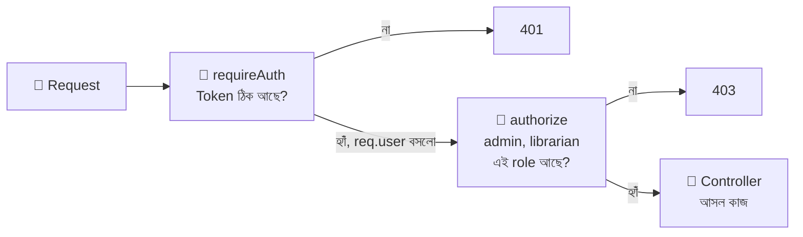
```mermaid
flowchart LR
    R["📨 Request"] --> M1["💂 requireAuth<br/>Token ঠিক আছে?"]
    M1 -->|"না"| X1["401"]
    M1 -->|"হ্যাঁ, req.user বসলো"| M2["🛂 authorize<br/>admin, librarian<br/>এই role আছে?"]
    M2 -->|"না"| X2["403"]
    M2 -->|"হ্যাঁ"| C["🎯 Controller<br/>আসল কাজ"]
```

### `src/middleware/auth.js`

```javascript
// src/middleware/auth.js

const jwt = require("jsonwebtoken");
const { ObjectId } = require("mongodb");
const { getDB } = require("../db");

async function requireAuth(req, res, next) {
  // requireAuth = "লগইন করা আছে কি না" যাচাইয়ের দারোয়ান। যে route সুরক্ষিত রাখতে চাই সেখানে বসাবো

  const header = req.headers.authorization;
  // header = "Bearer eyJhbGciOi..." এই ধরনের String, বা undefined

  if (!header || !header.startsWith("Bearer ")) {
    return res.status(401).json({ error: "Token দেওয়া হয়নি।" });
    // Bearer = "যার কাছে এই Token, তাকেই ঢুকতে দাও" ধরনের প্রচলিত লেখার নিয়ম
  }

  const token = header.split(" ")[1];
  // token = "Bearer " এর পরের অংশ। split(" ") দিয়ে ["Bearer", "eyJ..."], ১ নম্বর ঘরটা

  let payload;
  // payload = Token-এর ভেতরের তথ্য। try-এর বাইরে declare, যাতে নিচেও ব্যবহার করা যায়
  try {
    payload = jwt.verify(token, process.env.JWT_ACCESS_SECRET);
    // verify = সই মেলায় আর মেয়াদ দেখে। ভুল হলে error ছোঁড়ে, ঠিক হলে payload ফেরত দেয়
  } catch (err) {
    const expired = err.name === "TokenExpiredError";
    // expired = মেয়াদ শেষ হওয়ার ভুল কি না। frontend এটা দেখে /auth/refresh ডাকবে
    return res.status(401).json({
      error: expired ? "Token-এর মেয়াদ শেষ।" : "Token সঠিক নয়।",
      code: expired ? "TOKEN_EXPIRED" : "TOKEN_INVALID",
      // code = frontend-এর জন্য মেশিন-পাঠযোগ্য কারণ
    });
  }

  const user = await getDB().collection("users").findOne(
    { _id: new ObjectId(payload.sub) },
    // payload.sub = Token-এর ভেতরের userId (String), ObjectId-তে বদলে খুঁজছি
    { projection: { passwordHash: 0 } }
    // projection { passwordHash: 0 } = পুরো কার্ড আনো, শুধু passwordHash বাদ (আগের ফাইলের Projection!)
  );
  // এই database দেখাটা কেন? JWT stateless, তাই কার্ড বন্ধ (isActive: false) বা মোছা হলেও Token ১৫ মিনিট চলতো।
  // প্রতিবার কার্ড দেখে নিলে সেই ফাঁক বন্ধ হয়, আর role বদলালে সাথে সাথে ধরা পড়ে।
  // (বাড়তি একটা query-র দাম দিয়ে নিরাপত্তা কেনা। খুব বড় সিস্টেমে cache ব্যবহার হয়)

  if (!user || !user.isActive) {
    return res.status(401).json({ error: "এই অ্যাকাউন্ট আর সক্রিয় নেই।" });
  }

  req.user = user;
  // req.user = দারোয়ানের কাগজে টোকা সদস্যের তথ্য। পরের সব middleware/controller এটা পড়তে পারবে
  next();
  // next() = "যাও ভেতরে"। না ডাকলে request ঝুলে থাকবে
}

function authorize(...allowedRoles) {
  // authorize = Higher-order function: role-এর তালিকা নিয়ে একটা নতুন middleware ফেরত দেয়
  // ব্যবহার: authorize("admin", "librarian"), ...allowedRoles = সবগুলো আর্গুমেন্ট একটা array

  return (req, res, next) => {
    if (!req.user || !allowedRoles.includes(req.user.role)) {
      return res.status(403).json({ error: "এই কাজের অনুমতি আপনার নেই।" });
      // 403 = চিনি কিন্তু অনুমতি নেই (401 নয়!)
    }
    next();
  };
}

module.exports = { requireAuth, authorize };
```

### সুরক্ষিত route বসানো

```javascript
// auth.routes.js-এর ভেতরে

router.get("/me", requireAuth, (req, res) => {
  // requireAuth = এই route-এ ঢুকতে হলে আগে দারোয়ান পেরোতে হবে
  res.json({ user: req.user });
  // req.user দারোয়ান আগেই বসিয়ে দিয়েছে (passwordHash ছাড়া)। আলাদা database query লাগলো না
});
```

```javascript
// src/routes/admin.routes.js

const express = require("express");
const { getDB } = require("../db");
const { requireAuth, authorize } = require("../middleware/auth");

const router = express.Router();

router.use(requireAuth);
// router.use = এই ফাইলের সব route-এর আগে দারোয়ান বসলো। লগইন ছাড়া কিছুই না

router.get("/users", authorize("admin", "librarian"), async (req, res) => {
  // authorize("admin", "librarian") = শুধু এই দুই role ঢুকতে পারবে
  const list = await getDB().collection("users")
    .find({}, { projection: { passwordHash: 0 } })
    // এখানেও passwordHash বাদ। সদস্যের তালিকায় কখনো hash যাবে না
    .sort({ createdAt: -1 })
    // নতুন সদস্য আগে
    .limit(50)
    // limit = একবারে সর্বোচ্চ ৫০ জন (Pagination আগের ফাইলের সেকশন ১২)
    .toArray();
  res.json({ count: list.length, users: list });
});

router.patch("/users/:id/role", authorize("admin"), async (req, res) => {
  // শুধু admin-ই কারও role বদলাতে পারে। এটাই একমাত্র জায়গা যেখানে role বদলানো যায়
  const { ObjectId } = require("mongodb");
  const { role } = req.body;
  const allowed = ["member", "librarian", "admin"];
  // allowed = বৈধ role-এর তালিকা (whitelist)। এর বাইরের কিছু মানি না

  if (!ObjectId.isValid(req.params.id) || !allowed.includes(role)) {
    return res.status(400).json({ error: "id বা role ভুল।" });
  }
  const result = await getDB().collection("users").updateOne(
    { _id: new ObjectId(req.params.id) },
    { $set: { role, updatedAt: new Date() } }
  );
  if (result.matchedCount === 0) return res.status(404).json({ error: "সদস্য পাওয়া যায়নি।" });
  res.json({ message: "role বদলানো হয়েছে।" });
});

module.exports = router;
```

---

## ১১. Refresh, Logout আর Session-এর গল্প

### গল্প: Refresh, নবায়ন-স্লিপ দিয়ে নতুন ব্যাজ

করিমের ব্যাজের মেয়াদ (১৫ মিনিট) শেষ। তিনি আবার পাসওয়ার্ড না বলে আপার কাছে নবায়ন-স্লিপ (Refresh Token) নিয়ে গেলেন। আপা:

1. স্লিপের **hash** বানিয়ে আলমারিতে খোঁজেন।
2. পেলে **ওই স্লিপ ছিঁড়ে ফেলেন** (এক স্লিপ একবারই চলে), মেয়াদ দেখেন।
3. করিমের কার্ড দেখে ঠিক থাকলে **নতুন ব্যাজ + নতুন স্লিপ** দেন।

স্লিপ প্রতিবার বদলে দেওয়ার এই পদ্ধতির নাম **Refresh Token Rotation**। কেউ পুরোনো স্লিপ চুরি করে আনলে, সেটা আগেই ছেঁড়া, তাই আর কাজ করবে না।

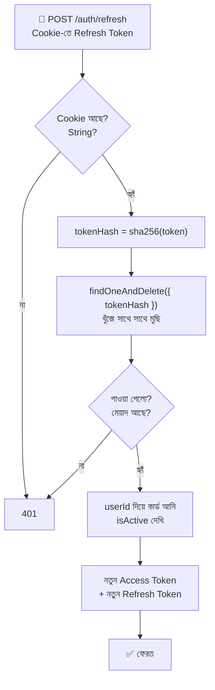
```mermaid
flowchart TD
    A["🔄 POST /auth/refresh<br/>Cookie-তে Refresh Token"] --> B{"Cookie আছে?<br/>String?"}
    B -->|"না"| X["401"]
    B -->|"হ্যাঁ"| C["tokenHash = sha256(token)"]
    C --> D["findOneAndDelete({ tokenHash })<br/>খুঁজে সাথে সাথে মুছি"]
    D --> E{"পাওয়া গেলো?<br/>মেয়াদ আছে?"}
    E -->|"না"| X
    E -->|"হ্যাঁ"| F["userId দিয়ে কার্ড আনি<br/>isActive দেখি"]
    F --> G["নতুন Access Token<br/>+ নতুন Refresh Token"]
    G --> H["✅ ফেরত"]
```

### `auth.routes.js`, তৃতীয় অংশ: Refresh আর Logout

```javascript
// ============ 🔄 REFRESH ============
router.post("/refresh", async (req, res) => {
  const rawToken = req.cookies[REFRESH_COOKIE];
  // rawToken = ব্রাউজার Cookie থেকে আসা Refresh Token। cookie-parser না থাকলে req.cookies undefined হতো

  if (typeof rawToken !== "string") {
    return res.status(401).json({ error: "Refresh Token নেই।" });
  }

  const tokens = getDB().collection("refresh_tokens");
  const stored = await tokens.findOneAndDelete({ tokenHash: sha256(rawToken) });
  // findOneAndDelete = খুঁজে মুছে ফেলা কার্ডটা ফেরত দেয় (আগের ফাইলের সেকশন ১৬)। "খোঁজা আর মোছা" একটাই ধাপে, তাই দুজন একসাথে একই স্লিপ ব্যবহার করতে পারবে না
  // stored = মোছা কার্ড, না পেলে null (MongoDB Driver ৬+ এ সরাসরি document ফেরত আসে)

  if (!stored || stored.expiresAt < new Date()) {
    res.clearCookie(REFRESH_COOKIE, cookieOptions);
    return res.status(401).json({ error: "সেশন শেষ, আবার লগইন করুন।" });
    // TTL ঝাড়ুদার আসার আগে মেয়াদ-শেষ কার্ড থেকে যেতে পারে, তাই নিজেও মেয়াদ দেখলাম
  }

  const user = await users().findOne({ _id: stored.userId });
  if (!user || !user.isActive) {
    return res.status(401).json({ error: "অ্যাকাউন্ট সক্রিয় নেই।" });
  }

  await issueRefreshToken(res, user._id);
  // নতুন Refresh Token (Rotation): পুরোনোটা ইতিমধ্যে মুছে গেছে
  return res.json({ accessToken: signAccessToken(user) });
  // নতুন Access Token
});

// ============ 🚪 LOGOUT ============
router.post("/logout", async (req, res) => {
  const rawToken = req.cookies[REFRESH_COOKIE];
  if (typeof rawToken === "string") {
    await getDB().collection("refresh_tokens").deleteOne({ tokenHash: sha256(rawToken) });
    // এই ডিভাইসের Refresh Token database থেকে মুছলাম। ফলে আর নতুন Access Token পাওয়া যাবে না
  }
  res.clearCookie(REFRESH_COOKIE, cookieOptions);
  // clearCookie-তে একই options (বিশেষ করে path) দিতে হয়, নাহলে ব্রাউজার Cookie মোছে না
  return res.json({ message: "লগআউট হয়েছে।" });
});

// ============ 🚪🚪 সব ডিভাইস থেকে LOGOUT ============
router.post("/logout-all", requireAuth, async (req, res) => {
  const result = await getDB().collection("refresh_tokens").deleteMany({ userId: req.user._id });
  // userId মেলা সব Refresh Token মুছলাম: ফোন, ল্যাপটপ, সবখান থেকে লগআউট
  res.clearCookie(REFRESH_COOKIE, cookieOptions);
  return res.json({ message: "সব ডিভাইস থেকে লগআউট।", revoked: result.deletedCount });
});

module.exports = router;
// ফাইলের একদম শেষে (সেকশন ১৩-র change-password route-ও module.exports-এর আগে বসবে)
```

### লগআউটের সত্যিকারের অর্থ

| প্রশ্ন | উত্তর |
|---|---|
| লগআউট করলে Access Token কি বাতিল হয়? | ❌ না। JWT stateless, ১৫ মিনিট পর্যন্ত বৈধ থাকে। তাই frontend নিজের মেমোরি থেকে Access Token **মুছে ফেলবে** |
| তাহলে লগআউটের কাজ কী? | **Refresh Token** বাতিল, যাতে নতুন Access Token আর পাওয়া না যায় |
| এই ১৫ মিনিটের ঝুঁকি কমাতে? | Access Token-এর মেয়াদ ছোট রাখা + `requireAuth`-এ `isActive` দেখা (আমরা তাই করেছি) |

---

## ১২. Aggregation দিয়ে ব্যবহারকারীর ডেটা বিশ্লেষণ

> 📎 এই লাইভ ক্লাস **Aggregation মডিউলের অংশ**, তাই "MongoDB-তে ভাবা" মানে শুধু `find` নয়, **pipeline-এ ভাবাও**। এই সেকশনে সেকশন ৩-এর নমুনা ডেটা (`users`, `books`, `loans`) ব্যবহার হবে।

### গল্প

প্রধান (রাফসুন) একদিন আপাকে বললেন: *"বলুন তো, কোন role-এ কতজন? কারা একবারও লগইন করেনি? কার হাতে কোন বই? কে দেরি করছে?"*

`find` দিয়ে এক কার্ড এক কার্ড করে খুঁজে এসব বের করা যায় না; লাগে **কারখানার সারি (Pipeline)**। কার্ডগুলো একটা **কনভেয়ার বেল্টে** ওঠে, প্রতিটা **স্টেশনে (Stage)** একটা করে কাজ হয় (ছাঁকা, জোড়া লাগানো, গোনা, সাজানো), আর এক স্টেশনের ফল পরের স্টেশনে যায়।

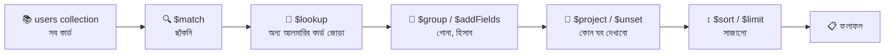
```mermaid
flowchart LR
    A["📚 users collection<br/>সব কার্ড"] --> B["🔍 $match<br/>ছাঁকনি"]
    B --> C["🔗 $lookup<br/>অন্য আলমারির কার্ড জোড়া"]
    C --> D["🧮 $group / $addFields<br/>গোনা, হিসাব"]
    D --> E["🎨 $project / $unset<br/>কোন ঘর দেখাবো"]
    E --> F["↕️ $sort / $limit<br/>সাজানো"]
    F --> G["📋 ফলাফল"]
```

### প্রধান Stage-গুলো (এই ক্লাসে যা লাগে)

| Stage | গল্পে | কাজ |
|---|---|---|
| `$match` | ছাঁকনি | শর্তে মেলা কার্ড রাখে (`find`-এর filter-এর মতোই) |
| `$group` | ঝুড়িতে ভাগ করে গোনা | কোনো ঘরের মান ধরে দলে ভাগ করে যোগ/গোনা/গড় |
| `$project` | ঘর বাছা | কোন ঘর থাকবে, কোনটা নতুন বানাবো |
| `$unset` | ঘর ফেলা | নির্দিষ্ট ঘর (যেমন `passwordHash`) বাদ |
| `$addFields` | নতুন ঘর জোড়া | হিসাব করা নতুন ঘর যোগ (বাকি ঘর থাকে) |
| `$lookup` | অন্য আলমারির কার্ড জোড়া (SQL-এর JOIN) | অন্য collection থেকে মিলে যাওয়া কার্ড আনে |
| `$unwind` | array ভেঙে আলাদা কার্ড | `[a,b]`-কে দুটো কার্ডে ভাগ |
| `$sort`, `$limit`, `$skip` | সাজানো, কাটা | আগের ফাইলের সেকশন ১২-র মতোই |
| `$count` | গোনা | কয়টা কার্ড এলো |

> 🏆 **সোনালি নিয়ম:** `$match` যতটা সম্ভব **শুরুতে** বসান। এতে অল্প কার্ড পরের স্টেশনে যায় (দ্রুত), আর শুরুর `$match` Index ব্যবহার করতে পারে।

### ১) কোন role-এ কতজন? (`$group`)

```javascript
db.users.aggregate([
  { $group: { _id: "$role", total: { $sum: 1 } } },
  // $group = দলে ভাগ। _id: "$role" = role-এর মান ধরে ঝুড়ি (admin, librarian, member)
  // "$role" এর $ চিহ্ন মানে "কার্ডের role ঘরের মান"
  // total: { $sum: 1 } = প্রতিটা কার্ডের জন্য ১ যোগ, মানে গোনা
  { $sort: { total: -1 } }
  // total অনুযায়ী বড় থেকে ছোট
]);
// ফল: { _id: "member", total: 3 }, { _id: "admin", total: 1 }, { _id: "librarian", total: 1 }
```

### ২) কে কয়টা বই ধার নিয়েছে? (`$lookup` + `$addFields`)

```javascript
db.users.aggregate([
  { $match: { isActive: true } },
  // চালু কার্ডগুলোই শুধু। শুরুতে ছাঁকলাম (নাসির বাদ)

  {
    $lookup: {
      from: "loans",
      // from = কোন আলমারি থেকে জোড়া লাগাবো
      localField: "_id",
      // localField = users কার্ডের যে ঘর দিয়ে মেলাবো (সদস্যের নম্বর)
      foreignField: "userId",
      // foreignField = loans কার্ডের যে ঘরের সাথে মেলাবো। ⚠️ দুটোর type একই (ObjectId) হতে হবে
      as: "loans"
      // as = মিলে যাওয়া সব loans কার্ড এই নামের array-তে বসবে
    }
  },
  { $addFields: { loanCount: { $size: "$loans" } } },
  // $size = array-তে কয়টা জিনিস। loanCount = নতুন ঘর
  { $project: { _id: 0, name: 1, email: 1, loanCount: 1 } },
  // loans array আর বাকি ঘর বাদ। শুধু নাম, ইমেইল আর সংখ্যা
  { $sort: { loanCount: -1 } }
]);
// ফল: করিম ২, সালমা ২, রাফসুন ০, মৌসুমী ০
```

### ৩) এখন কোন বই কার হাতে? (দুইবার `$lookup` + `$unwind`)

```javascript
db.loans.aggregate([
  { $match: { returnedAt: null } },
  // returnedAt: null = এখনো ফেরত দেয়নি (এই ঘর null বা ঘরটাই না থাকলে ধরা পড়ে)

  { $lookup: { from: "users", localField: "userId", foreignField: "_id", as: "user" } },
  // প্রতিটা loan-এ সদস্যের কার্ড জোড়া। ফল array (কারণ lookup সবসময় array দেয়)
  { $lookup: { from: "books", localField: "bookId", foreignField: "_id", as: "book" } },
  // একইভাবে বইয়ের কার্ড

  { $unwind: "$user" },
  { $unwind: "$book" },
  // array থেকে একক অবজেক্ট বানালাম। ([x] → x), নাহলে user.name না লিখে user[0].name লিখতে হতো

  { $project: { _id: 0, member: "$user.name", book: "$book.title", dueAt: 1 } },
  // member = নতুন ঘর, মান user.name। book = নতুন ঘর, মান book.title
  // 🔒 user-এর passwordHash এখানে ঢুকলেও $project এ বাছা হয়নি, তাই বাইরে যাচ্ছে না
]);
// ফল: { member: "করিম", book: "MongoDB Guide", dueAt: 2026-10-04 }, { member: "সালমা", book: "MongoDB Guide", dueAt: 2026-09-25 }
```

### ৪) কে দেরি করছে? (`$$NOW` আর `$expr`)

```javascript
db.loans.aggregate([
  { $match: { returnedAt: null, $expr: { $lt: ["$dueAt", "$$NOW"] } } },
  // $expr = একই কার্ডের দুই ঘরের তুলনা (আগের ফাইলের সেকশন ১০)
  // $$NOW = এই মুহূর্তের সময় (দুটো $ কারণ এটা সিস্টেম ভেরিয়েবল)
  // মানে: ফেরত দেয়নি আর নির্ধারিত তারিখ পার হয়ে গেছে
  { $lookup: { from: "users", localField: "userId", foreignField: "_id", as: "user" } },
  { $unwind: "$user" },
  { $project: { _id: 0, member: "$user.name", dueAt: 1 } }
]);
// ফল (২৯ সেপ্টেম্বর ২০২৬-এ): সালমা, নির্ধারিত ২৫ সেপ্টেম্বর
```

### ৫) প্রতি মাসে কতজন নতুন সদস্য? (`$dateToString`)

```javascript
db.users.aggregate([
  {
    $group: {
      _id: { $dateToString: { format: "%Y-%m", date: "$createdAt" } },
      // $dateToString = Date-কে লেখায় বদলায়। "%Y-%m" = বছর-মাস, যেমন "2026-08"
      // এই কারণেই createdAt Date type রাখা জরুরি ছিল (String হলে কাজ করতো না)
      newMembers: { $sum: 1 }
    }
  },
  { $sort: { _id: 1 } }
  // মাস অনুযায়ী পুরোনো থেকে নতুন
]);
// ফল: { _id: "2026-08", newMembers: 3 }, { _id: "2026-09", newMembers: 2 }
```

### ৬) কে কে একবারও লগইন করেনি?

```javascript
db.users.aggregate([
  { $match: { lastLoginAt: null } },
  // null মেলানো মানে "ঘরের মান null" এবং "ঘরটাই নেই", দুই ক্ষেত্রই ধরে (আগের ফাইলের সেকশন ৭)
  { $project: { _id: 0, name: 1, email: 1, createdAt: 1 } }
]);
// ফল: করিম আর নাসির
```

### ৭) এক সদস্যের প্রোফাইল, সাথে বর্তমান ধার (Pipeline `$lookup`)

```javascript
db.users.aggregate([
  { $match: { _id: ObjectId("66f200000000000000000003") } },
  // করিমের কার্ড
  {
    $lookup: {
      from: "loans",
      let: { uid: "$_id" },
      // let = users কার্ডের _id-কে uid নামে ভেতরের pipeline-এ পাঠানো (ভেতরে $$uid হিসেবে পড়বো)
      pipeline: [
        { $match: { $expr: { $eq: ["$userId", "$$uid"] }, returnedAt: null } },
        // ভেতরের ছাঁকনি: এই সদস্যের loan এবং এখনো ফেরত হয়নি। ("$$uid" = বাইরের let ভেরিয়েবল)
        { $lookup: { from: "books", localField: "bookId", foreignField: "_id", as: "book" } },
        { $unwind: "$book" },
        { $project: { _id: 0, title: "$book.title", dueAt: 1 } }
      ],
      as: "currentLoans"
    }
  },
  { $project: { name: 1, email: 1, role: 1, currentLoans: 1 } }
  // 🔒 এখানে $project নিজেই passwordHash ঠেকিয়ে দিলো। (বিকল্প: { $unset: "passwordHash" })
]);
// ফল: { name: "করিম", ..., currentLoans: [{ title: "MongoDB Guide", dueAt: 2026-10-04 }] }
```

### Aggregation-এর নিরাপত্তার নিয়ম

| নিয়ম | কারণ |
|---|---|
| `users` থেকে আসা যেকোনো pipeline-এর শেষে `$project` বা `$unset: "passwordHash"` | `$lookup` করলে অন্য collection-এর ভেতরে `user` অবজেক্ট হিসেবে hash ঢুকে যেতে পারে |
| `$match`-এ ব্যবহারকারীর ইনপুট বসালে আগে type যাচাই | `$match: { email: req.query.email }` এ অবজেক্ট এলে Injection (সেকশন ১৪) |
| `$lookup`-এর `foreignField`-এ Index | নাহলে প্রতিটা কার্ডের জন্য পুরো আলমারি ঘাঁটতে হয় (আমরা `loans.userId`-এ Index দিয়েছি) |

### Express-এ কীভাবে চালাবো (প্রধানের রিপোর্ট route)

```javascript
// admin.routes.js-এ যোগ হবে
router.get("/reports/role-summary", authorize("admin"), async (req, res) => {
  const summary = await getDB().collection("users").aggregate([
    { $group: { _id: "$role", total: { $sum: 1 } } },
    { $sort: { total: -1 } }
  ]).toArray();
  // aggregate() Cursor ফেরত দেয়, তাই .toArray() (আগের ফাইলের Cursor-এর গল্প)
  res.json(summary);
});
```

---

## ১৩. পাসওয়ার্ড বদল, Profile Update, Account বন্ধ, Forgot Password

### ১) পাসওয়ার্ড বদল, আগেরটা জেনে

গল্প: করিম পাসওয়ার্ড বদলাতে চান। আপা আগে **পুরোনো পাসওয়ার্ড** চেয়ে নেন, কারণ কেউ করিমের খোলা ফোন পেয়ে পাসওয়ার্ড বদলে ফেললে ক্ষতি বড়।

```javascript
// auth.routes.js-এ যোগ হবে (module.exports-এর আগে)

router.patch("/change-password", requireAuth, async (req, res) => {
  const { currentPassword, newPassword } = req.body;
  // currentPassword = এখনকার পাসওয়ার্ড (পরিচয় নিশ্চিত করতে), newPassword = নতুনটা

  if (typeof currentPassword !== "string" || typeof newPassword !== "string") {
    return res.status(400).json({ error: "দুটো পাসওয়ার্ডই লেখা (string) হতে হবে।" });
  }
  if (newPassword.length < 8 || newPassword.length > 72) {
    return res.status(400).json({ error: "নতুন পাসওয়ার্ড ৮ থেকে ৭২ অক্ষরের হতে হবে।" });
  }
  if (newPassword === currentPassword) {
    return res.status(400).json({ error: "নতুন পাসওয়ার্ড আগেরটার মতো হতে পারবে না।" });
  }

  const me = await users().findOne({ _id: req.user._id });
  // me = আবার আনলাম, কারণ requireAuth-এর req.user-এ passwordHash বাদ ছিল (ইচ্ছা করেই)

  const ok = await bcrypt.compare(currentPassword, me.passwordHash);
  if (!ok) return res.status(400).json({ error: "বর্তমান পাসওয়ার্ড ভুল।" });
  // এখানে 401 দিইনি, কারণ frontend 401 দেখলে ভাববে Token শেষ আর /auth/refresh ডাকবে

  const newHash = await bcrypt.hash(newPassword, SALT_ROUNDS);
  await users().updateOne(
    { _id: me._id },
    { $set: { passwordHash: newHash, updatedAt: new Date() } }
    // $set = শুধু এই দুই ঘর বদলাবে। বাকি ঘর ছোঁবে না (আগের ফাইলের সেকশন ১৫)
  );

  await getDB().collection("refresh_tokens").deleteMany({ userId: me._id });
  // পাসওয়ার্ড বদলালে সব পুরোনো সেশন বাতিল: চোর আগে ঢুকে থাকলে এখন বেরিয়ে যাবে
  await issueRefreshToken(res, me._id);
  // শুধু এই ডিভাইসের জন্য নতুন Refresh Token, যাতে করিমকে আবার লগইন করতে না হয়

  return res.json({ message: "পাসওয়ার্ড বদলানো হয়েছে।" });
});
```

### ২) Profile Update, "শুধু অনুমোদিত ঘর" নীতি

```javascript
router.patch("/me", requireAuth, async (req, res) => {
  const { name, profile } = req.body;
  // শুধু name আর profile নিলাম। role, email, passwordHash, isActive ইচ্ছা করেই বাদ

  const changes = { updatedAt: new Date() };
  // changes = যা যা $set হবে তার অবজেক্ট। updatedAt সবসময় থাকবে

  if (typeof name === "string" && name.trim().length >= 2) changes.name = name.trim();
  // শুধু ঠিকঠাক থাকলেই তুলি

  if (profile && typeof profile === "object" && !Array.isArray(profile)) {
    if (typeof profile.phone === "string") changes["profile.phone"] = profile.phone.trim();
    if (typeof profile.bio === "string") changes["profile.bio"] = profile.bio.trim().slice(0, 200);
    // "profile.phone" = Dot Notation (আগের ফাইলের সেকশন ৫): profile-এর ভেতরের শুধু phone বদলাবে, পুরো profile নয়
  }

  await users().updateOne({ _id: req.user._id }, { $set: changes });
  // ❌ কখনো { $set: req.body } লিখবেন না, নাহলে role: "admin" পাঠালেই admin (Mass Assignment)
  return res.json({ message: "প্রোফাইল হালনাগাদ হয়েছে।" });
});
```

### ৩) Account বন্ধ করা (Soft Delete)

```javascript
// admin.routes.js-এ
router.patch("/users/:id/deactivate", authorize("admin"), async (req, res) => {
  const { ObjectId } = require("mongodb");
  if (!ObjectId.isValid(req.params.id)) return res.status(400).json({ error: "id ভুল।" });
  const id = new ObjectId(req.params.id);

  await getDB().collection("users").updateOne({ _id: id }, { $set: { isActive: false, updatedAt: new Date() } });
  // কার্ড মুছলাম না, শুধু isActive: false। ধারের ইতিহাস অক্ষত থাকে (loans-এ userId এখনো বৈধ)

  await getDB().collection("refresh_tokens").deleteMany({ userId: id });
  // আর নতুন Access Token পাবে না। পুরোনোটা ১৫ মিনিটের মধ্যে অকেজো, কারণ requireAuth isActive দেখে

  res.json({ message: "অ্যাকাউন্ট বন্ধ করা হয়েছে।" });
});
```

### ৪) Forgot Password: পাসওয়ার্ড ভুলে গেলে

গল্প: করিম পাসওয়ার্ড ভুলে গেছেন। আপা তাঁকে পাসওয়ার্ড **বলে দিতে পারেন না** (তাঁর কাছে আসল পাসওয়ার্ড নেই, শুধু সিল!)। তাই তিনি করিমের ইমেইলে একটা **এক-বারের গোপন লিংক (১৫ মিনিটের মেয়াদ)** পাঠান। লিংকে ঢুকে করিম নতুন পাসওয়ার্ড দেন।

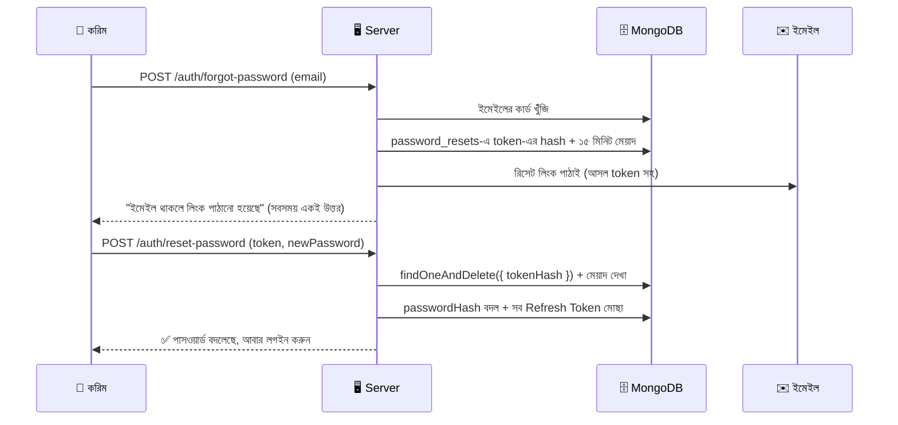
```mermaid
sequenceDiagram
    participant U as 👤 করিম
    participant S as 🖥️ Server
    participant DB as 🗄️ MongoDB
    participant M as ✉️ ইমেইল
    U->>S: POST /auth/forgot-password (email)
    S->>DB: ইমেইলের কার্ড খুঁজি
    S->>DB: password_resets-এ token-এর hash + ১৫ মিনিট মেয়াদ
    S->>M: রিসেট লিংক পাঠাই (আসল token সহ)
    S-->>U: "ইমেইল থাকলে লিংক পাঠানো হয়েছে" (সবসময় একই উত্তর)
    U->>S: POST /auth/reset-password (token, newPassword)
    S->>DB: findOneAndDelete({ tokenHash }) + মেয়াদ দেখা
    S->>DB: passwordHash বদল + সব Refresh Token মোছা
    S-->>U: ✅ পাসওয়ার্ড বদলেছে, আবার লগইন করুন
```

```javascript
// db.js-এ connectDB এর ভেতরে যোগ করুন:
// await db.collection("password_resets").createIndex({ expiresAt: 1 }, { expireAfterSeconds: 0 });
// await db.collection("password_resets").createIndex({ tokenHash: 1 });

router.post("/forgot-password", async (req, res) => {
  const { email } = req.body;
  const genericReply = { message: "এই ইমেইলে সদস্যপদ থাকলে রিসেট লিংক পাঠানো হয়েছে।" };
  // genericReply = ইমেইল থাকুক বা না থাকুক, একই উত্তর। নাহলে কার ইমেইল আছে তা ফাঁস (User Enumeration)

  if (typeof email !== "string") return res.status(400).json({ error: "email লেখা হতে হবে।" });

  const user = await users().findOne({ email: email.trim().toLowerCase() });
  if (!user || !user.isActive) return res.json(genericReply);
  // কার্ড না থাকলে কিছু না করেই একই উত্তর

  const rawToken = crypto.randomBytes(32).toString("hex");
  // rawToken = ৬৪ অক্ষরের এলোমেলো গোপন মান। এটাই ইমেইলের লিংকে যাবে
  await getDB().collection("password_resets").insertOne({
    userId: user._id,
    tokenHash: sha256(rawToken),
    // database-এ শুধু hash: database ফাঁস হলেও রিসেট লিংক বানানো যাবে না
    expiresAt: new Date(Date.now() + 15 * 60 * 1000),
    // ১৫ মিনিট পর মেয়াদ শেষ (আর TTL Index ঝাড়ু দেবে)
  });

  const link = `${process.env.CLIENT_ORIGIN}/reset-password?token=${rawToken}`;
  // link = frontend-এর পাতার ঠিকানা, token সহ
  console.log("📧 (পরীক্ষার জন্য) রিসেট লিংক:", link);
  // আসল প্রজেক্টে এখানে Nodemailer / SendGrid / Resend দিয়ে ইমেইল পাঠাবেন। কখনো response-এ link ফেরত দেবেন না!

  return res.json(genericReply);
});

router.post("/reset-password", async (req, res) => {
  const { token, newPassword } = req.body;
  if (typeof token !== "string" || typeof newPassword !== "string" || newPassword.length < 8 || newPassword.length > 72) {
    return res.status(400).json({ error: "token আর ৮-৭২ অক্ষরের নতুন পাসওয়ার্ড দিন।" });
  }

  const record = await getDB().collection("password_resets").findOneAndDelete({ tokenHash: sha256(token) });
  // খুঁজে মুছলাম: এক লিংক একবারই চলবে
  if (!record || record.expiresAt < new Date()) {
    return res.status(400).json({ error: "লিংকটি ভুল বা মেয়াদোত্তীর্ণ।" });
  }

  const newHash = await bcrypt.hash(newPassword, SALT_ROUNDS);
  await users().updateOne({ _id: record.userId }, { $set: { passwordHash: newHash, updatedAt: new Date() } });
  await getDB().collection("refresh_tokens").deleteMany({ userId: record.userId });
  // সব ডিভাইস থেকে লগআউট: কেউ পাসওয়ার্ড চুরি করে থাকলে সেও বাদ

  return res.json({ message: "পাসওয়ার্ড বদলানো হয়েছে। এখন লগইন করুন।" });
});
```

### ৫) আরও যা আসল প্রজেক্টে থাকে (সংক্ষেপে)

| ফিচার | কীভাবে |
|---|---|
| **ইমেইল ভেরিফিকেশন** | Register-এ `emailVerified: false`; ইমেইলে এক-বারের token (Forgot Password-এর মতো); লিংকে ক্লিক করলে `true`; না হলে লগইনে আটকানো |
| **Account Lock** | `failedLoginCount` আর `lockedUntil` ঘর; ৫ বার ভুলের পর ১৫ মিনিট বন্ধ |
| **2FA (দুই ধাপে যাচাই)** | পাসওয়ার্ডের পর OTP / Authenticator অ্যাপ |
| **Social Login** | Google / Facebook (OAuth); `users`-এ `googleId` ঘর |
| **লগইন ইতিহাস** | আলাদা `login_logs` collection (IP, সময়, ডিভাইস)। এটাও Aggregation-এর ভালো উদাহরণ |

---

## ১৪. নিরাপত্তার চেকলিস্ট (NoSQL Injection সহ)

### 🎯 NoSQL Injection: MongoDB-র বিশেষ বিপদ

গল্প: এক দুষ্টু লোক গেটে এসে বললেন: *"আমার ইমেইল হলো 'যেকোনো কিছু', আর পাসওয়ার্ড হলো 'ফাঁকা নয় এমন যেকোনো কিছু'।"* আপা বোকার মতো তা-ই কার্ড খুঁজতে শুরু করলেন, আর এমন কার্ড পেয়ে গেলেন যেখানে পাসওয়ার্ড "ফাঁকা নয়"।

```javascript
// ❌ বিপজ্জনক কোড
const user = await users.findOne({ email: req.body.email, password: req.body.password });
```

JSON-এ কেউ পাঠালো:

```json
{ "email": { "$ne": null }, "password": { "$ne": null } }
```

MongoDB এটা পড়ে: **"email null নয় এবং password null নয় এমন প্রথম কার্ড আনো"**, অর্থাৎ যেকোনো একজনের কার্ড, পাসওয়ার্ড ছাড়াই!

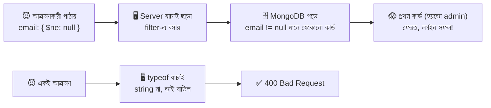
```mermaid
flowchart LR
    A["😈 আক্রমণকারী পাঠায়<br/>email: { $ne: null }"] --> B["🖥️ Server যাচাই ছাড়া<br/>filter-এ বসায়"]
    B --> C["🗄️ MongoDB পড়ে<br/>email != null মানে যেকোনো কার্ড"]
    C --> D["😱 প্রথম কার্ড (হয়তো admin)<br/>ফেরত, লগইন সফল!"]
    A2["😈 একই আক্রমণ"] --> B2["🖥️ typeof যাচাই<br/>string না, তাই বাতিল"] --> E["✅ 400 Bad Request"]
```

**প্রতিরোধ (আমাদের কোডে ইতিমধ্যে আছে):**

```javascript
if (typeof email !== "string" || typeof password !== "string") {
  return res.status(400).json({ error: "..." });
}
// সবচেয়ে সহজ ও কার্যকর প্রতিরোধ: অবজেক্ট ঢুকতেই দেব না। String হলে { $ne: null } অবজেক্ট আর হতে পারে না
```

আরও সুরক্ষা: আমরা পাসওয়ার্ড কখনো database-এর filter-এ পাঠাই না, শুধু `email` দিয়ে কার্ড এনে **আলাদাভাবে `bcrypt.compare`** করি। তাই `password: { $ne: null }` চালাকি টিকতোই না। ইনপুট যাচাইয়ের জন্য `zod` বা `joi` লাইব্রেরিও ভালো।

> ⚠️ কিছু পুরোনো "sanitize" প্যাকেজ (যেমন `express-mongo-sanitize`) Express 5-এ ঠিকমতো কাজ নাও করতে পারে। নিজের হাতে `typeof` যাচাই আর যাচাই-লাইব্রেরি নির্ভরযোগ্য পথ।

### পুরো নিরাপত্তার চেকলিস্ট

| # | কী করবেন | কেন | এই ফাইলে |
|---|---|---|---|
| ১ | পাসওয়ার্ড **hash** (bcrypt/argon2) | database ফাঁসে সুরক্ষা | সেকশন ৫ |
| ২ | সব ইনপুটে **`typeof` যাচাই** | NoSQL Injection | সেকশন ৭, ৮ |
| ৩ | **Unique Index** ইমেইলে | Race Condition | সেকশন ৪ |
| ৪ | ভুল উত্তরে **একই বার্তা** | User Enumeration | সেকশন ৮ |
| ৫ | `role` **কখনো client থেকে নয়** | Mass Assignment | সেকশন ৩, ১৩ |
| ৬ | **Access Token ছোট মেয়াদ** (১৫ মিনিট) | চুরি হলে ক্ষতি সীমিত | সেকশন ৯ |
| ৭ | **Refresh Token** httpOnly Cookie + database-এ hash | XSS-এ চুরি কঠিন | সেকশন ৯, ১১ |
| ৮ | **JWT secret** লম্বা, `.env`-এ, GitHub-এ নয় | ফাঁস হলে নকল Token | সেকশন ৬ |
| ৯ | response-এ **`passwordHash` কখনো নয়** | ফাঁস রোধ | সর্বত্র |
| ১০ | **HTTPS** (production-এ) | নেটওয়ার্কে পাসওয়ার্ড চুরি রোধ | Cookie-র `secure` |
| ১১ | **Rate Limiting** | পাসওয়ার্ড আন্দাজের আক্রমণ (Brute Force) | নিচে |
| ১২ | **CORS** শুধু নিজের frontend | অন্য সাইট থেকে জাল request | সেকশন ৬ |
| ১৩ | **helmet** | নিরাপত্তা-সংক্রান্ত HTTP header | নিচে |
| ১৪ | ভেতরের error client-কে না দেখানো | তথ্য ফাঁস | সেকশন ৬ |
| ১৫ | পাসওয়ার্ড বদলালে **সব সেশন বাতিল** | পুরোনো চোর বের | সেকশন ১৩ |
| ১৬ | পাসওয়ার্ড / Token **log না করা** | log ফাঁসে বিপদ | সর্বত্র |

### Rate Limiting: গেটে লাইন সীমা

```bash
npm install express-rate-limit helmet
```

```javascript
const rateLimit = require("express-rate-limit");

const loginLimiter = rateLimit({
  windowMs: 15 * 60 * 1000,
  // windowMs = সময়ের জানালা, ১৫ মিনিট (মিলিসেকেন্ডে)
  limit: 10,
  // limit = এই ১৫ মিনিটে একই IP থেকে সর্বোচ্চ ১০ বার
  standardHeaders: true,
  // standardHeaders = বাকি সুযোগ কতগুলো, তা response header-এ জানায়
  legacyHeaders: false,
  message: { error: "অনেকবার চেষ্টা করেছেন। ১৫ মিনিট পর আবার চেষ্টা করুন।" },
});

router.post("/login", loginLimiter, async (req, res) => { /* আগের login কোড */ });
// loginLimiter আগে বসেছে, তাই ১০ বারের বেশি হলে login কোড পর্যন্ত request পৌঁছায়ই না
```

```javascript
// server.js-এ, const app = express(); এর ঠিক পরে
const helmet = require("helmet");
app.use(helmet());
// helmet = একগুচ্ছ নিরাপত্তা HTTP header নিজে বসিয়ে দেয় (ক্লিকজ্যাকিং, MIME sniffing ইত্যাদি ঠেকায়)
```

---

## ১৫. একই কাজ Mongoose দিয়ে

### গল্প

এতক্ষণ আমরা আপাকে **সরাসরি চিঠি (Driver)** লিখে কাজ করিয়েছি। আসল প্রজেক্টে অনেকে মাঝখানে একজন **সহকারী (Mongoose)** রাখেন, যে আগে থেকেই কার্ডের নকশা (Schema) জানে, ভুল ঘর ফিরিয়ে দেয়, আর পাসওয়ার্ড hash-এর মতো কাজ নিজেই করে দেয়। ভেতরে কিন্তু সহকারীও MongoDB-কে একই ভাষায় হুকুম দেয়, তাই এই ফাইলের সব ধারণা এখানেও কাজে লাগে।

| | MongoDB Driver | Mongoose |
|---|---|---|
| নকশা (Schema) | ❌ নেই, আপনি নিজে যাচাই করেন | ✅ Schema দিয়ে ঘরের type, required, enum ঠিক করা |
| যাচাই (Validation) | নিজে লিখতে হয় | Schema-তেই (`required`, `minlength`, `enum`) |
| পাসওয়ার্ড hash | route-এ | `pre("save")` hook-এ, একবার লিখলেই সব জায়গায় |
| ইউনিক ইমেইল | `createIndex` নিজে | Schema-তে `unique: true` (এটাও Index-ই বানায়, validator নয়) |
| `passwordHash` লুকানো | `projection` | `select: false` |
| সংযোগ | `MongoClient` | `mongoose.connect()` |

```bash
npm install mongoose
```

### `models/User.js`

```javascript
// models/User.js

const mongoose = require("mongoose");
const bcrypt = require("bcrypt");

const userSchema = new mongoose.Schema(
  {
    name: { type: String, required: true, trim: true, minlength: 2, maxlength: 60 },
    // type = ঘরের ধরন। required = না দিলে error। trim = আগে-পরের ফাঁকা কাটা। minlength/maxlength = দৈর্ঘ্যের সীমা

    email: { type: String, required: true, unique: true, lowercase: true, trim: true },
    // lowercase: true = সংরক্ষণের আগে নিজে ছোট হাতের করে দেয় (আমরা Driver-এ হাতে করেছিলাম)
    // unique: true = Unique Index বানায় (E11000 error তখনও আসে, তাই catch করা লাগে)

    password: { type: String, required: true, minlength: 8, select: false },
    // এখানে ঘরের নাম password, কিন্তু ভেতরে থাকবে hash (নিচের hook বদলে দেবে)
    // select: false = কোনো query-তে ডিফল্টভাবে এই ঘর আসবে না। লাগলে .select("+password") বলতে হবে

    role: { type: String, enum: ["member", "librarian", "admin"], default: "member" },
    // enum = শুধু এই তিন মান। default = না দিলে "member"

    isActive: { type: Boolean, default: true },
    lastLoginAt: { type: Date, default: null },
  },
  { timestamps: true }
  // timestamps: true = createdAt আর updatedAt নিজে বসায় ও হালনাগাদ করে
);

userSchema.pre("save", async function () {
  // pre("save") = কার্ড database-এ সংরক্ষণের ঠিক আগে এই ফাংশন চলে
  // function () ব্যবহার করেছি (তীর-ফাংশন নয়), কারণ ভেতরে this লাগবে

  if (!this.isModified("password")) return;
  // this = যে কার্ড সংরক্ষণ হচ্ছে। isModified = এই ঘর কি নতুন/বদলানো? না হলে (যেমন শুধু নাম বদলেছে) আবার hash নয়, নাহলে hash-এর hash হয়ে যাবে!

  this.password = await bcrypt.hash(this.password, 10);
  // সাদা পাসওয়ার্ডকে hash দিয়ে বদলে ফেললাম
});

userSchema.methods.comparePassword = function (plain) {
  return bcrypt.compare(plain, this.password);
  // এই কার্ডের hash-এর সাথে দেওয়া পাসওয়ার্ড মেলানো। ব্যবহার: await user.comparePassword("...")
};

userSchema.set("toJSON", {
  transform: (doc, ret) => {
    delete ret.password;
    delete ret.__v;
    return ret;
  },
  // toJSON = res.json(user) করলে যে চেহারায় যাবে। password আর __v (Mongoose-এর সংস্করণ ঘর) বাদ দিলাম
});

module.exports = mongoose.model("User", userSchema);
// "User" মডেল থেকে Mongoose নিজে collection-এর নাম বানায় "users" (ছোট হাতের + বহুবচন)
```

### Register আর Login (Mongoose)

```javascript
const User = require("./models/User");

// REGISTER
router.post("/register", async (req, res) => {
  const { name, email, password } = req.body;
  if ([name, email, password].some((v) => typeof v !== "string")) {
    return res.status(400).json({ error: "সব ঘর লেখা (string) হতে হবে।" });
    // Mongoose-ও Injection থেকে পুরো বাঁচায় না। typeof যাচাই এখানেও লাগবে
  }
  try {
    const user = await User.create({ name, email, password });
    // create = নতুন কার্ড বানিয়ে সংরক্ষণ। pre("save") hook নিজে password hash করে দিলো
    // role পাঠাইনি, তাই default "member" (এখানেও Mass Assignment এড়াতে req.body পুরোটা দিইনি)
    res.status(201).json({ user });
    // toJSON transform-এর কারণে password যাবে না
  } catch (err) {
    if (err.code === 11000) return res.status(409).json({ error: "ইমেইল আগেই আছে।" });
    if (err.name === "ValidationError") return res.status(400).json({ error: err.message });
    // ValidationError = Schema-র নিয়ম ভাঙলে (যেমন minlength)
    throw err;
  }
});

// LOGIN
router.post("/login", async (req, res) => {
  const { email, password } = req.body;
  if (typeof email !== "string" || typeof password !== "string") return res.status(400).json({ error: "ভুল ইনপুট।" });

  const user = await User.findOne({ email: email.trim().toLowerCase() }).select("+password");
  // .select("+password") = ডিফল্টে লুকানো password ঘরটা এই একবার আনো (hash মেলাতে লাগবে)

  const ok = user ? await user.comparePassword(password) : false;
  if (!user || !ok || !user.isActive) return res.status(401).json({ error: "ইমেইল বা পাসওয়ার্ড ভুল।" });

  // এরপর Token বানানো একই (signAccessToken, issueRefreshToken): শুধু user._id আর user.role লাগে
  res.json({ message: "লগইন সফল।", user });
});
```

> 🧠 **কোনটা কখন?** শেখার সময় Driver ভালো (ভেতরে কী হচ্ছে দেখা যায়)। বড় প্রজেক্টে Mongoose সুবিধাজনক (Schema, Validation, hook)। দুটোই একই MongoDB, একই query-র ভাষা। Aggregation দুটোতেই একইভাবে (`User.aggregate([...])`) চলে।

---

## ১৬. Postman দিয়ে পরীক্ষা, সাধারণ ভুল আর সমাধান

### পরীক্ষার ক্রম

```mermaid
flowchart TD
    A["১. POST /auth/register<br/>নতুন সদস্য বানাই"] --> B["২. একই ইমেইলে আবার<br/>409 আসছে কি না দেখি"]
    B --> C["৩. POST /auth/login<br/>accessToken কপি করি<br/>(Cookie নিজে জমা হয়)"]
    C --> D["৪. GET /auth/me<br/>Header: Authorization Bearer TOKEN"]
    D --> E["৫. Token ছাড়া GET /auth/me<br/>401 আসছে কি না"]
    E --> F["৬. GET /admin/users<br/>member Token দিয়ে: 403"]
    F --> G["৭. mongosh-এ role admin করে<br/>আবার লগইন, এবার 200"]
    G --> H["৮. POST /auth/refresh<br/>নতুন accessToken"]
    H --> I["৯. POST /auth/logout<br/>তারপর refresh: 401"]
```

### `curl` দিয়ে দ্রুত পরীক্ষা

```bash
# ১) Register
curl -X POST http://localhost:5000/auth/register \
  -H "Content-Type: application/json" \
  -d '{"name":"করিম","email":"Karim@Example.com","password":"mypass123"}'
# -X POST = মেথড। -H = header (JSON পাঠাচ্ছি বলে)। -d = body
# ইমেইলে ইচ্ছা করে বড় হাতের অক্ষর দিলাম: database-এ ছোট হাতের হয়ে বসবে কি না দেখতে

# ২) Login (Cookie সংরক্ষণ করতে -c cookies.txt)
curl -X POST http://localhost:5000/auth/login \
  -H "Content-Type: application/json" \
  -c cookies.txt \
  -d '{"email":"karim@example.com","password":"mypass123"}'
# -c cookies.txt = server যে Cookie পাঠালো (Refresh Token) তা ফাইলে রাখো

# ৩) সুরক্ষিত route (TOKEN জায়গায় আসল accessToken)
curl http://localhost:5000/auth/me -H "Authorization: Bearer TOKEN"

# ৪) Refresh (-b cookies.txt = জমানো Cookie পাঠাও)
curl -X POST http://localhost:5000/auth/refresh -b cookies.txt -c cookies.txt
```

**mongosh-এ কাউকে admin বানানো (প্রথম admin বানানোর একমাত্র নিরাপদ পথ):**

```javascript
db.users.updateOne({ email: "karim@example.com" }, { $set: { role: "admin" } });
// প্রথম admin API দিয়ে বানানো যায় না (কারণ role কেউ নিজে ঠিক করতে পারে না), তাই database থেকে হাতে
```

### Frontend (React) থেকে সংক্ষেপে

```javascript
const res = await fetch("http://localhost:5000/auth/login", {
  method: "POST",
  headers: { "Content-Type": "application/json" },
  credentials: "include",
  // credentials: "include" = Cookie পাঠাতে ও নিতে দাও। এটা না থাকলে Refresh Token Cookie বসবেই না
  body: JSON.stringify({ email, password }),
});
const { accessToken } = await res.json();
// accessToken JS ভেরিয়েবলে/state-এ রাখুন (localStorage-এ নয়)। পরের request-এ: headers: { Authorization: `Bearer ${accessToken}` }
```

### সাধারণ ভুল ও সমাধান

| লক্ষণ / error | সম্ভাব্য কারণ | সমাধান |
|---|---|---|
| `E11000 duplicate key error` | ইমেইল আগেই আছে (Unique Index কাজ করছে!) | 409 দিয়ে ব্যবহারকারীকে জানান, `err.code === 11000` ধরুন |
| `req.body` `undefined` | `app.use(express.json())` নেই, বা Postman-এ body ধরন JSON নয় | middleware বসান, Header `Content-Type: application/json` |
| `Cannot read properties of undefined (reading 'refreshToken')` | `cookieParser()` বসাননি | `app.use(cookieParser())` |
| `secretOrPrivateKey must have a value` | `.env` পড়া হয়নি বা `JWT_ACCESS_SECRET` নেই | `require("dotenv").config()` **সবার আগে**, `.env`-এর নাম ঠিক |
| `jwt malformed` / `invalid signature` | ভুল Token, বা অন্য secret দিয়ে বানানো | Header `Bearer ` সহ ঠিকঠাক কপি; secret বদলে থাকলে আবার লগইন |
| `jwt expired` (`TOKEN_EXPIRED`) | ১৫ মিনিট পার | `/auth/refresh` ডেকে নতুন Token |
| Refresh-এ সবসময় 401 | Cookie যাচ্ছে না: `credentials: "include"` নেই, CORS `credentials: true` নেই, বা `path: "/auth"` মেলেনি | frontend আর CORS দুটোই ঠিক করুন; Cookie `path` দেখুন |
| Cookie বসছে না (লোকালে) | `secure: true` অথচ `http` | লোকালে `NODE_ENV=development` (secure false) |
| লগইন সবসময় "ভুল", অথচ পাসওয়ার্ড ঠিক | Register-এ ইমেইল lowercase হলেও Login-এ হয়নি; বা hash-এর আগে পাসওয়ার্ডে `trim` | দুই জায়গায় একই পরিষ্কারকরণ |
| `bcrypt.compare` সবসময় `false` | database-এ hash-এর জায়গায় সাদা পাসওয়ার্ড গেছে, বা hash করা পাসওয়ার্ডকে আবার hash | `passwordHash` `$2b$` দিয়ে শুরু কি না দেখুন; Mongoose-এ `isModified` |
| `$lookup` খালি array দিচ্ছে | `localField` আর `foreignField`-এর type আলাদা (ObjectId বনাম String) | `loans.userId` `ObjectId` হিসেবে রাখুন (`typeof` নয়, `$type` দিয়ে দেখুন) |
| `find({ _id: "66f..." })` কিছু দেয় না | `_id` String দিয়ে খুঁজছেন | `new ObjectId(id)` |
| `BSONError: input must be a 24 character hex string` | ভুল id `new ObjectId()`-এ | আগে `ObjectId.isValid(id)` |
| `ECONNREFUSED 127.0.0.1:27017` | MongoDB server চালু নেই | `mongod` চালু করুন / Atlas URI ঠিক করুন |
| সদস্য বন্ধ করেছি, তবু ঢুকছে | `requireAuth` `isActive` দেখছে না | সেকশন ১০-র কোড দেখুন; Refresh Token মুছুন |
| `password` response-এ চলে যাচ্ছে | `res.json(user)` সরাসরি | ঘর বেছে পাঠান / `projection` / Mongoose `select: false` + `toJSON` |
| যে কেউ `role: "admin"` পাঠিয়ে admin হচ্ছে | `req.body` সরাসরি insert/`$set` | শুধু অনুমোদিত ঘর তুলুন (সেকশন ৩) |

---

## ১৭. সারসংক্ষেপ, গল্পের অভিধান ও Practice আইডিয়া

```mermaid
mindmap
  root((Thinking with MongoDB এবং Authentication))
    ভাবনা
      Access Pattern আগে
      Embed বনাম Reference
      Unbounded Array এড়ানো
      এক-এক এক-অল্প এক-অনেক অনেক-অনেক
    users collection
      name email passwordHash
      role isActive
      createdAt updatedAt
      Unique Index email
      TTL Index token
    পাসওয়ার্ড
      Hash নয় Encrypt
      bcrypt Salt Cost
      compare দিয়ে মেলানো
    API
      Register 201 409
      Login 401 একই বার্তা
      Refresh Rotation
      Logout
    Token
      JWT Header Payload Signature
      Access ছোট মেয়াদ
      Refresh httpOnly Cookie
    Middleware
      requireAuth 401
      authorize 403
      req.user
    Aggregation
      match group project
      lookup unwind
      addFields sort
    নিরাপত্তা
      NoSQL Injection typeof
      Mass Assignment
      Rate Limit helmet
      HTTPS CORS
```

### গল্পের অভিধান: গল্পের কোনটা মানে কী

| গল্পে | টেকনিক্যাল নাম |
|---|---|
| জ্ঞানকুটির পাঠাগার | আমাদের Express + MongoDB অ্যাপ |
| সদস্য-কার্ড | `users` collection-এর Document |
| সদস্যপদ নেওয়ার ফর্ম | Register (`POST /auth/register`) |
| গেটে পরিচয় দেখানো | Login (`POST /auth/login`) |
| "তুমি কে?" | Authentication |
| "তুমি কী পারো?" | Authorization |
| পাসওয়ার্ডের গোপন সিল | Password Hash (bcrypt) |
| প্রতিজনের আলাদা গোপন মশলা | Salt |
| সিল বানাতে ইচ্ছাকৃত দেরি | Cost / Salt Rounds |
| একই ইমেইলে দুই কার্ড নিষেধ | Unique Index (E11000) |
| মেয়াদ ফুরালে নিজে ফেলে দেওয়া কার্ড | TTL Index |
| গলার রঙিন ব্যাজ (১৫ মিনিট) | Access Token (JWT) |
| আপার গোপন সই | JWT Signature / `JWT_ACCESS_SECRET` |
| নবায়ন-স্লিপ (৭ দিন) | Refresh Token |
| প্রতিবার নতুন স্লিপ, পুরোনো ছেঁড়া | Refresh Token Rotation |
| স্লিপ রাখার তালা-দেওয়া বাক্স | httpOnly Cookie |
| দারোয়ান রহিম চাচা | Middleware (`requireAuth`) |
| "এই দরজা শুধু গ্রন্থাগারিকের" | `authorize("librarian")` |
| ব্যাজ চাওয়ার নিয়ম "Bearer ..." | `Authorization` header |
| কার্ডের ভেতরে ছোট কার্ড | Embedded Document |
| কার্ডে অন্য কার্ডের নম্বর | Reference (`userId`) |
| ধার নেওয়ার খাতা | `loans` collection |
| কারখানার সারি ও স্টেশন | Aggregation Pipeline ও Stage |
| অন্য আলমারির কার্ড জোড়া | `$lookup` |
| ঝুড়িতে ভাগ করে গোনা | `$group` |
| চোরের চালাকি `{ $ne: null }` | NoSQL Injection |
| ফর্মে লুকিয়ে `role: admin` পাঠানো | Mass Assignment |
| গেটে লাইন সীমা | Rate Limiting |
| কার্ড ফেলার বদলে "বন্ধ" চিহ্ন | Soft Delete (`isActive: false`) |

### একনজরে: কোন কাজে কোন HTTP status

| ঘটনা | Status |
|---|---|
| Register সফল | **201** |
| Login/Refresh/Logout সফল | **200** |
| ভুল ইনপুট (ফাঁকা, ভুল type, ছোট পাসওয়ার্ড) | **400** |
| Token নেই / ভুল / মেয়াদ শেষ / পাসওয়ার্ড ভুল | **401** |
| Token আছে, কিন্তু role যথেষ্ট নয় | **403** |
| ইমেইল আগেই আছে | **409** |
| কার্ড বা route পাওয়া যায়নি | **404** |
| অনেকবার চেষ্টা (Rate Limit) | **429** |
| server-এর ভেতরের সমস্যা | **500** |

### নিজে চেষ্টা করার Practice আইডিয়া

**ভাবনা (Data Modeling)**
1. `users` কার্ডে `addresses` array না রেখে আলাদা `addresses` collection বানালে কী কী লাভ-ক্ষতি? কোন অবস্থায় আলাদা করা ঠিক হবে, নিজের ভাষায় লিখুন।
2. পাঠাগারে "বইয়ের রিভিউ" যোগ হলে (একটা বইয়ের হাজারো রিভিউ), `books`-এর ভেতরে `reviews: []` রাখবেন, না আলাদা collection? কেন?

**Register / Login**
3. Register API-তে ফোন নম্বর (`profile.phone`) নেওয়ার নিয়ম যোগ করুন (শুধু ১১ ডিজিট)।
4. `failedLoginCount` আর `lockedUntil` ঘর যোগ করে ৫ বার ভুলের পর ১৫ মিনিট লগইন বন্ধ করুন (`$inc` ও `$set` লাগবে)।
5. `email`-এ Unique Index না থাকলে দুইজন একসাথে register করলে কী হয়, কিছু সময়ে দুটো request পাঠিয়ে দেখুন। তারপর Index বসিয়ে আবার।

**JWT / Middleware**
6. jwt.io-তে নিজের Access Token পেস্ট করে Payload পড়ুন। কী কী দেখা যাচ্ছে? গোপন কিছু আছে কি?
7. `ACCESS_TOKEN_EXPIRES=30s` করে Token শেষ হওয়া দেখুন; তারপর `/auth/refresh` ডাকুন।
8. `authorize`-এর মতো `requireSelfOrAdmin` middleware বানান: সদস্য শুধু নিজের `:id` দেখতে পারবে, admin সবার।

**Aggregation**
9. প্রতিটা বই কতবার ধার হয়েছে, বইয়ের নামসহ, বেশি থেকে কম (`loans` → `$group` → `$lookup` → `$sort`)।
10. গত ৩০ দিনে কতজন লগইন করেছে (`$match` + `$gte` + `$count`)।
11. সদস্যদের role অনুযায়ী ভাগ করে প্রতি ভাগে সবচেয়ে সাম্প্রতিক সদস্যের নাম (`$sort` + `$group` + `$first`)।

**নিরাপত্তা**
12. Login-এ `{ "email": {"$ne": null}, "password": "x" }` পাঠিয়ে দেখুন `typeof` যাচাই আটকাচ্ছে কি না। তারপর যাচাই সরিয়ে কী হয় (শুধু নিজের লোকাল প্রজেক্টে!)।
13. `login_logs` collection বানিয়ে প্রতি লগইনে (সফল/ব্যর্থ) IP আর সময় রাখুন; তারপর Aggregation দিয়ে "কোন IP থেকে সবচেয়ে বেশি ব্যর্থ চেষ্টা" বের করুন।

> 🔜 **পরের ধাপ:** পুরো `library-auth` প্রজেক্টকে React frontend-এর সাথে জুড়ুন: লগইন ফর্ম, Access Token state-এ রাখা, মেয়াদ শেষে `/auth/refresh` ডেকে request আবার চালানো (Axios interceptor), আর `Protected Route` কম্পোনেন্ট।

---
