# 📚 জ্ঞানকুটির পাঠাগারের গল্প: MongoDB CRUD Operations ও Query Writing

> আজকের গল্পের মূল প্রশ্ন: **ডেটা স্থায়ীভাবে কোথায় আর কীভাবে রাখবো? আর কীভাবে সেই ডেটা খুঁজবো (Read), নতুন রাখবো (Create), বদলাবো (Update), মুছবো (Delete)?**
> 📎 **Module:** MongoDB Query Writing — MongoDB CRUD Operations (এই ফাইল), পরের ধাপ: MongoDB Beginner-Advanced Aggregation Query Writing।

---

## 📚 এই ফাইলে যা যা আছে (সূচিপত্র)

০. ভূমিকা: খাতা ছেড়ে ফাইল-কার্ডে আসার গল্প
১. Meet MongoDB, Terminology আর Data Model
২. Data Types আর Sample Documents বোঝা
৩. MongoDB Tools — Atlas, Compass, VS Code Extension, Community Server
৪. Database-related Methods আর Insert Query (`insertOne` / `insertMany`)
৫. Find Query — `find` আর `findOne`
৬. Projection — কার্ডের কোন কোন ঘর দেখবো
৭. Comparison Query Operators
৮. Logical Query Operators
৯. Element Query Operators
১০. Evaluation Query Operators
১১. বোনাস: Array আর Embedded Document-এ Query
১২. Sort, Limit (আর Skip)
১৩. Distinct
১৪. Row Count (Document গোনা)
১৫. Update One or Many
১৬. Delete One or Many
১৭. Node.js থেকে MongoDB (Driver-এর সাথে পরিচয়)
১৮. সব একসাথে — পুরো Flow, সাধারণ ভুল আর সমাধান
১৯. সারসংক্ষেপ, গল্পের অভিধান ও Practice আইডিয়া

---

## ০. ভূমিকা: খাতা ছেড়ে ফাইল-কার্ডে আসার গল্প

জ্ঞানকুটির পাঠাগারের গ্রন্থাগারিক **মৌসুমী আপা** প্রথমে একটা **মোটা রেজিস্টার খাতা** ব্যবহার করতেন। খাতার প্রতিটা পাতায় **ছক কাটা** — বইয়ের নাম, লেখক, দাম, পৃষ্ঠা সংখ্যা। প্রতিটা লাইনে **সব ঘর ভরতেই হবে**।

কিছুদিন পর নতুন জিনিস আসতে শুরু করলো:

- **উপন্যাসের** আছে লেখক, প্রকাশের সাল, ট্যাগ (ক্লাসিক, গ্রাম...)
- **পাঠ্যবইয়ের** আছে সংস্করণ, ডিসকাউন্ট
- **মাসিক ম্যাগাজিনের** লেখক নেই, আছে "সংখ্যা নম্বর" (issue)

ছক-কাটা খাতায় ম্যাগাজিনের "লেখক" ঘরটা ফাঁকা থাকে, আবার "সংখ্যা নম্বর" এর জন্য নতুন ঘর বানাতে গেলে **পুরো খাতার ছক বদলাতে হয়**। ঝামেলা!

তখন আপা সিদ্ধান্ত নিলেন: **"প্রতিটা জিনিসের জন্য আলাদা একটা ফাইল-কার্ড বানাবো। কার্ডে যা যা দরকার শুধু সেটাই লিখবো।"** এই ফাইল-কার্ড পদ্ধতিই হলো **MongoDB**।

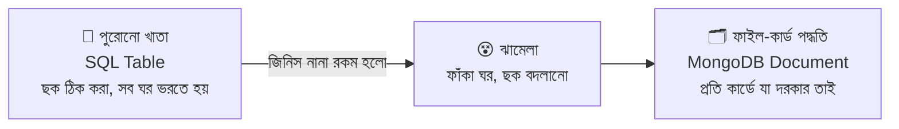

### পুরো ফাইলের রোডম্যাপ

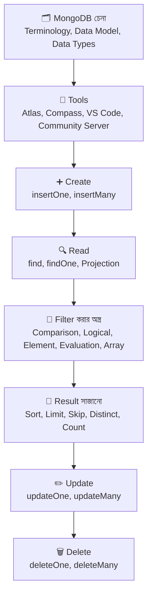

### 🎭 গল্পের চরিত্র আর টেকনিক্যাল নাম — শুরুতেই মিলিয়ে নিই

| গল্পে | টেকনিক্যাল নাম |
|---|---|
| জ্ঞানকুটির পাঠাগারের পুরো ভবন আর তার ব্যবস্থাপনা | **MongoDB Server** (`mongod`) |
| পাঠাগারের একটা শাখা (যেমন "বইয়ের শাখা") | **Database** (যেমন `bookshop`) |
| শাখার ভেতরের একটা আলমারি (যেমন "বইয়ের আলমারি") | **Collection** (যেমন `books`) |
| আলমারির ভেতরের একটা ফাইল-কার্ড | **Document** |
| কার্ডের একটা ঘর (নাম, দাম...) | **Field** (key-value জোড়া) |
| কার্ডের ইউনিক নম্বর | **`_id`** |
| মৌসুমী আপা, যাঁকে আমরা হুকুম করি | **`mongosh`** বা Driver |
| আপাকে বলা হুকুম (যেমন "৫০০ টাকার বেশি দামি বইগুলো আনো") | **Query** |

> 💡 এই ফাইলের সব উদাহরণ একটাই ডেটা নিয়ে চলবে: `bookshop` database-এর `books` collection (মোট ১০টা কার্ড)। সেকশন ৪-এ ডেটাটা বসানো হবে, তারপর সেকশন ৫ থেকে ১৬ পর্যন্ত সব query ওটার উপরেই চালাবেন।

---

## ১. Meet MongoDB, Terminology আর Data Model

### গল্প

MongoDB হলো এমন এক ধরনের গুদাম, যেখানে তথ্য **টেবিলের ছকে নয়, JSON-এর মতো দেখতে ফাইল-কার্ডে** রাখা হয়। এই ধরনের database-কে বলে **Document Database**, আর বৃহত্তর পরিবারের নাম **NoSQL** ("Not Only SQL")।

MongoDB নামটা এসেছে ইংরেজি **"humongous"** (বিশাল) শব্দ থেকে, কারণ এটা বিশাল পরিমাণ ডেটা সামলাতে বানানো হয়েছে।

### MongoDB-র মূল বৈশিষ্ট্য

| বৈশিষ্ট্য | গল্পে | মানে |
|---|---|---|
| **Document-based** | প্রতিটা জিনিসের একটা ফাইল-কার্ড | ডেটা JSON-এর মতো object হিসেবে থাকে |
| **Flexible Schema** | কার্ডে যার যা ঘর দরকার শুধু সেটা | একই collection-এর দুই document-এর field আলাদা হতে পারে |
| **Scalable** | পাঠাগার বড় হলে নতুন ভবন যোগ করা যায় | Sharding ও Replication দিয়ে বড় ডেটা সামলানো যায় |
| **Rich Query Language** | আপাকে নানা রকম হুকুম দেওয়া যায় | filter, sort, group, search সব করা যায় |
| **Fast for Reads/Writes** | কার্ড সরাসরি হাতে পাওয়া যায় | Index দিয়ে খোঁজা দ্রুত হয় |

### Terminology — SQL-এর সাথে মিলিয়ে

আপনি যদি আগে MySQL/PostgreSQL দেখে থাকেন, এই তুলনাটা মাথায় গেঁথে রাখুন:

| SQL (RDBMS) | MongoDB | গল্পে |
|---|---|---|
| Database | **Database** | পাঠাগারের শাখা |
| Table | **Collection** | আলমারি |
| Row / Record | **Document** | একটা ফাইল-কার্ড |
| Column | **Field** | কার্ডের একটা ঘর |
| Primary Key | **`_id`** | কার্ড নম্বর |
| JOIN | `$lookup` (Aggregation) বা embedding | কার্ড জোড়া লাগানো |
| Index | **Index** | আলমারির সূচিপত্র |
| `SELECT` | `find()` | খুঁজে আনো |
| `INSERT` | `insertOne()` / `insertMany()` | নতুন কার্ড রাখো |
| `UPDATE` | `updateOne()` / `updateMany()` | কার্ড সংশোধন করো |
| `DELETE` | `deleteOne()` / `deleteMany()` | কার্ড ফেলে দাও |

### সবকিছু কে কার ভেতরে থাকে

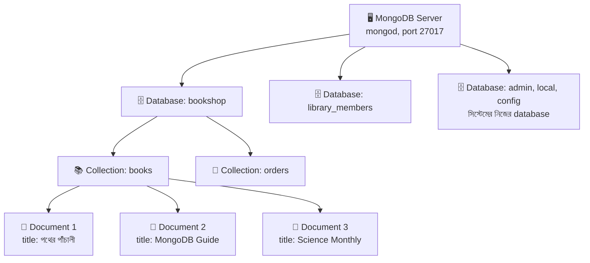

### একটা Document দেখতে কেমন

```javascript
{
  _id: ObjectId("66f1a2b3c4d5e6f7a8b9c0d1"),
  // _id = এই কার্ডের ইউনিক নম্বর। আমরা না দিলে MongoDB নিজেই বানিয়ে দেয়
  title: "MongoDB Guide",
  // title = বইয়ের নাম (String)
  price: 650,
  // price = দাম (সংখ্যা)
  tags: ["database", "programming", "nosql"],
  // tags = একটা array, একাধিক মান একসাথে রাখার জন্য
  author: { name: "Karim Hasan", country: "BD" }
  // author = একটা embedded document (কার্ডের ভেতরে ছোট কার্ড)
}
```

### Document আর Collection-এর নিয়মকানুন

| নিয়ম | ব্যাখ্যা |
|---|---|
| Field-এর নাম **String** | `title`, `price`... (বড়-ছোট হাতের অক্ষর আলাদা: `Price` আর `price` দুটো আলাদা field) |
| Field-এর **ক্রম** মনে রাখা হয় | যে ক্রমে লিখেছেন সেই ক্রমেই থাকে |
| একটা Document-এর **সর্বোচ্চ আকার ১৬ MB** | এর বেশি ডেটা এক কার্ডে ঢোকানো যায় না |
| `_id` **বাধ্যতামূলক** এবং collection-এ **ইউনিক** | দিতে ভুলে গেলে MongoDB নিজে `ObjectId` বসিয়ে দেয় |
| Collection-এ **নির্দিষ্ট ছক নেই** | একই আলমারিতে ভিন্ন ভিন্ন গড়নের কার্ড রাখা যায় |
| Database/Collection **আগে থেকে বানাতে হয় না** | প্রথম ডেটা বসানোর সময় নিজে থেকেই তৈরি হয় |
| Collection-এর নামে `$` থাকতে পারে না, আর `system.` দিয়ে শুরু করা যায় না | এগুলো MongoDB-র নিজের জন্য সংরক্ষিত |

### BSON — MongoDB আসলে কী ভাষায় ডেটা রাখে

আমরা লিখি JSON-এর মতো, কিন্তু ভেতরে MongoDB ডেটা রাখে **BSON (Binary JSON)** ফরম্যাটে। কেন?

| | JSON | BSON |
|---|---|---|
| ফরম্যাট | টেক্সট | বাইনারি (কম্পিউটারের জন্য দ্রুত) |
| Date | ❌ নেই (String হিসেবে রাখতে হয়) | ✅ আছে |
| ObjectId, Decimal128, Binary | ❌ নেই | ✅ আছে |
| Int আর Double আলাদা | ❌ সবই "number" | ✅ আলাদা type |

> **মনে রাখুন:** আপনি লেখেন JSON-এর মতো, MongoDB গুছিয়ে রাখে BSON-এ, আর ফেরত দেওয়ার সময় আবার JSON-এর মতো করে দেখায়।

### Data Model — কার্ড কীভাবে সাজাবো

SQL-এ ডেটা ভেঙে ভেঙে আলাদা table-এ রাখা হয় (Normalization)। MongoDB-তে দুটো পথ আছে:

**পথ ১ — Embedding (কার্ডের ভেতরে ছোট কার্ড গুঁজে দেওয়া)**

```javascript
{
  title: "পথের পাঁচালী",
  author: { name: "বিভূতিভূষণ বন্দ্যোপাধ্যায়", country: "IN" }
  // author আলাদা collection-এ না রেখে বইয়ের কার্ডের ভেতরেই রাখলাম
}
```

**পথ ২ — Referencing (কার্ডে অন্য কার্ডের নম্বর লিখে রাখা)**

```javascript
{
  _id: ObjectId("...101"),
  title: "পথের পাঁচালী",
  authorId: ObjectId("...555")
  // authorId = authors collection-এর একটা document-এর _id। নাম-ঠিকানা এখানে নেই, শুধু নম্বর
}
```

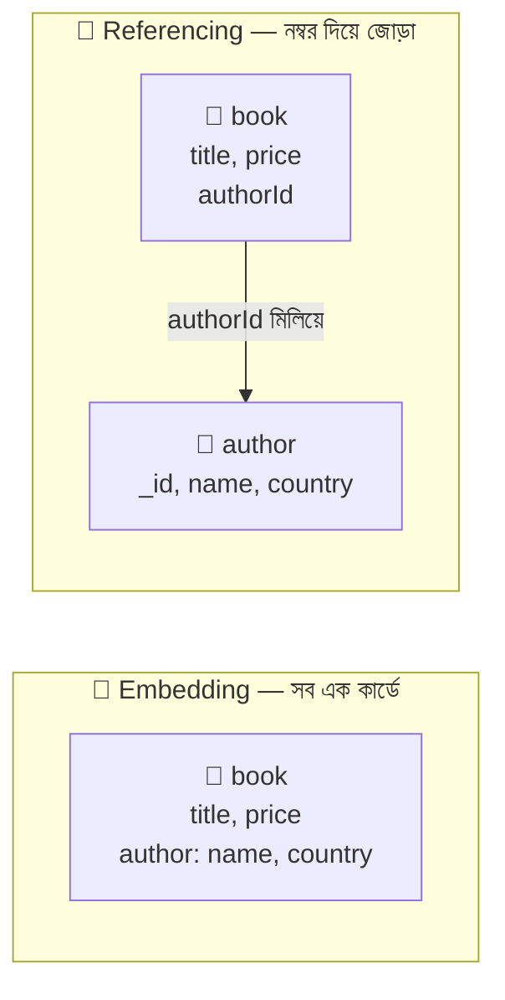

| | Embedding | Referencing |
|---|---|---|
| **কখন ভালো** | ডেটা সবসময় একসাথে পড়া হয়, আর অল্প থাকে (এক বইয়ের ২-৩ জন লেখক) | ডেটা অনেক বেশি, বা অনেক জায়গা থেকে ব্যবহার হয় (একজন লেখকের ৫০০ বই) |
| **পড়া (Read)** | ⚡ একবারেই সব পাওয়া যায় | দুইবার খুঁজতে হয় (বা `$lookup`) |
| **বদলানো (Update)** | একই তথ্য অনেক কার্ডে থাকলে সব জায়গায় বদলাতে হয় | একটা জায়গায় বদলালেই হয় |
| **ঝুঁকি** | Document ১৬ MB পার হয়ে যেতে পারে | ডেটা ঠিক আছে কি না নিজে দেখতে হয় |

> **সোনালী নিয়ম:** *"যে ডেটা একসাথে পড়া হয়, সেটা একসাথে রাখুন।"* MongoDB-তে design হয় **আপনি কীভাবে query করবেন** সেটা ভেবে, আগে-ভাগে table ভাঙার নিয়ম ভেবে নয়।

---

## ২. Data Types আর Sample Documents বোঝা

### গল্প

কার্ডের প্রতিটা ঘরে যা লেখা হয় তার একটা **ধরন** আছে: কোনোটা নাম (লেখা), কোনোটা দাম (সংখ্যা), কোনোটা তারিখ, কোনোটা হ্যাঁ/না। MongoDB প্রতিটা ঘরের ধরন মনে রাখে। ধরনটা ঠিক না হলে পরে **খুঁজতে গিয়ে ঠকতে হয়** (যেমন `"500"` আর `500` MongoDB-র কাছে সম্পূর্ণ আলাদা জিনিস)।

### MongoDB-র প্রধান Data Type-গুলো

| Type | উদাহরণ (mongosh-এ) | `$type` alias | নম্বর | কখন ব্যবহার |
|---|---|---|---|---|
| **String** | `"MongoDB Guide"` | `"string"` | 2 | নাম, লেখা, বাংলা-ইংরেজি সবই (UTF-8) |
| **Int32** | `NumberInt(25)` | `"int"` | 16 | ছোট পূর্ণ সংখ্যা |
| **Int64 (Long)** | `NumberLong("9007199254740993")` | `"long"` | 18 | অনেক বড় পূর্ণ সংখ্যা |
| **Double** | `4.8` | `"double"` | 1 | দশমিক সংখ্যা (mongosh-এ দশমিক লিখলে এটাই হয়; `320`-এর মতো ছোট পূর্ণসংখ্যা সাধারণত Int32 হিসেবে জমা হয়) |
| **Decimal128** | `NumberDecimal("19.99")` | `"decimal"` | 19 | **টাকা-পয়সার হিসাব** (যেখানে দশমিকের ভুল চলবে না) |
| **Boolean** | `true`, `false` | `"bool"` | 8 | হ্যাঁ/না (যেমন `inStock`) |
| **Date** | `new Date()`, `ISODate("2026-09-28")` | `"date"` | 9 | তারিখ ও সময় (সবসময় UTC হিসেবে জমা হয়) |
| **ObjectId** | `ObjectId("66f1...")` | `"objectId"` | 7 | `_id`-র ডিফল্ট type |
| **Array** | `["a", "b"]` | `"array"` | 4 | একাধিক মান |
| **Embedded Document** | `{ name: "Karim" }` | `"object"` | 3 | কার্ডের ভেতরে ছোট কার্ড |
| **Null** | `null` | `"null"` | 10 | "মান নেই" বোঝাতে |
| **Regular Expression** | `/^Mongo/i` | `"regex"` | 11 | প্যাটার্ন দিয়ে খোঁজা |
| **Binary Data** | `BinData(...)` | `"binData"` | 5 | ছোট ফাইল, UUID |
| **Timestamp** | `Timestamp(...)` | `"timestamp"` | 17 | MongoDB-র নিজের ভেতরের ব্যবহার (replication) |
| **MinKey / MaxKey** | `MinKey()`, `MaxKey()` | `"minKey"`, `"maxKey"` | -1 / 127 | তুলনায় সবচেয়ে ছোট/বড় মান বোঝাতে |

> ⚠️ **দুটো জরুরি সতর্কতা:**
> - **টাকার হিসাবে `Double` ব্যবহার করবেন না।** `0.1 + 0.2` কম্পিউটারে ঠিক `0.3` হয় না। সঠিক হিসাব চাইলে `Decimal128` অথবা "পয়সায় পূর্ণসংখ্যা" (৫০.২৫ টাকা = `5025` পয়সা) রাখুন।
> - **তারিখ String-এ রাখবেন না** (`"2026-09-28"`)। `new Date("2026-09-28")` দিয়ে রাখলে তারিখের তুলনা, sort আর `$gte`/`$lte` ঠিকভাবে কাজ করে।

### ObjectId — কার্ডের নম্বরের ভেতরের গল্প

`ObjectId("66f1a2b3c4d5e6f7a8b9c0d1")` দেখতে এলোমেলো মনে হলেও এটা ১২ বাইটের একটা গোছানো নম্বর:

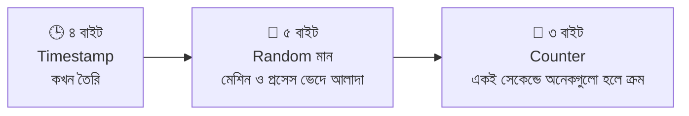

```javascript
const id = new ObjectId();
// id = একটা নতুন ObjectId object (mongosh-এ new ObjectId() বা ObjectId() দুটোই চলে)

id.getTimestamp();
// getTimestamp() = ওই ObjectId-র ভেতর লুকানো তৈরির সময় বের করে দেয়। তাই _id দিয়েই মোটামুটি "কার্ড কখন বানানো" জানা যায়

id.toString();
// toString() = ObjectId-কে সাধারণ String করে (URL-এ বা Express-এর req.params-এ যেটা আসে)
```

> 💡 **Express-এর সাথে যোগসূত্র:** URL থেকে `req.params.id` আসে **String** হিসেবে (আগের ফাইলে শিখেছেন)। কিন্তু database-এ `_id` আছে **ObjectId** হিসেবে। তাই `{ _id: "66f1..." }` দিয়ে খুঁজলে **কিছুই মিলবে না**। খুঁজতে হবে `{ _id: new ObjectId("66f1...") }` দিয়ে।

### Sample Document — একটা কার্ড লাইন ধরে ধরে পড়ি

```javascript
{
  _id: ObjectId("66f1a2b3c4d5e6f7a8b9c0d1"),   // ObjectId — অটো তৈরি ইউনিক নম্বর
  title: "MongoDB Guide",                       // String — বইয়ের নাম
  genre: "textbook",                            // String — ধরন (novel / textbook / magazine)
  price: 650,                                   // Int32 বা Double — দাম
  pages: 380,                                   // সংখ্যা — পৃষ্ঠা সংখ্যা
  rating: 4.9,                                  // Double — পাঠকের রেটিং
  publishedYear: 2023,                          // সংখ্যা — প্রকাশের সাল
  inStock: true,                                // Boolean — স্টকে আছে কি না
  discount: 20,                                 // সংখ্যা — শতকরা ছাড় (সব বইয়ে নেই, শুধু যাদের আছে)
  tags: ["database", "programming", "nosql"],   // Array of String — একাধিক ট্যাগ
  author: { name: "Karim Hasan", country: "BD" }, // Embedded Document — লেখকের তথ্য
  addedAt: ISODate("2026-01-10T00:00:00Z")      // Date — পাঠাগারে কবে যোগ হলো
}
```

### Atlas-এর বিল্ট-ইন Sample Dataset

MongoDB Atlas-এ একটা বোতাম আছে **"Load Sample Dataset"**। ক্লিক করলে নিজে থেকেই কয়েকটা তৈরি database এসে যায়, যা দিয়ে হাতে-কলমে practice করা যায়:

| Sample Database | কী নিয়ে | কোন query শেখার জন্য ভালো |
|---|---|---|
| `sample_mflix` | সিনেমা, রিভিউ, ইউজার | `find`, filter, sort, text search |
| `sample_restaurants` | রেস্টুরেন্ট ও তাদের গ্রেড | nested field, array, geo query |
| `sample_airbnb` | বাসার তালিকা | comparison, range, array |
| `sample_training` | কোম্পানি, ট্রিপ, জিপ কোড | aggregation practice |
| `sample_analytics` | গ্রাহক, অ্যাকাউন্ট, লেনদেন | reference ও `$lookup` |
| `sample_supplies` | দোকানের বিক্রির তথ্য | array of embedded documents |
| `sample_geospatial` | জাহাজডুবির তথ্য | geospatial query |
| `sample_weatherdata` | আবহাওয়ার রিডিং | nested document, `$gt`/`$lt` |

```javascript
// sample_mflix.movies collection-এর একটা document-এর মোটামুটি গড়ন (সংক্ষেপে)
{
  _id: ObjectId("..."),
  title: "The Godfather",
  year: 1972,                         // Number
  genres: ["Crime", "Drama"],         // Array of String
  imdb: { rating: 9.2, votes: 1000000 }, // Embedded document (ভেতরে rating আর votes)
  released: ISODate("1972-03-24"),    // Date
  cast: ["Marlon Brando", "Al Pacino"] // Array
}
// লক্ষ্য করুন: একটা কার্ডেই লেখা, সংখ্যা, তারিখ, array, embedded — সব ধরন একসাথে
```

> এই ফাইলে আমরা নিজেদের `books` ডেটা দিয়েই কাজ করবো। তবে কাজ শেষে `sample_mflix.movies`-এ একই query চালিয়ে দেখলে হাত আরও পাকা হবে।

---

## ৩. MongoDB Tools — মৌসুমী আপার সাথে কথা বলার চার উপায়

### গল্প

আপার সাথে কথা বলার একাধিক পথ আছে:

- ☁️ **Atlas** — আপা বসেন **মেঘের দেশের** এক বিশাল ভবনে। আপনি ইন্টারনেট দিয়ে কথা বলেন, ভবনের রক্ষণাবেক্ষণ MongoDB কোম্পানি করে।
- 🧭 **Compass** — আপার সামনে একটা **ছবিওয়ালা ড্যাশবোর্ড**। মাউস দিয়ে ক্লিক করে কার্ড দেখা, খোঁজা, বদলানো যায়।
- 🧩 **VS Code Extension** — আপনি **কোড লেখার ঘর (VS Code)** থেকেই না বেরিয়ে আপাকে হুকুম দিতে পারেন।
- 🏠 **Community Server** — পাঠাগারের ভবনটা বানানো হলো **আপনার নিজের কম্পিউটারেই**। ইন্টারনেট ছাড়াও চলে।

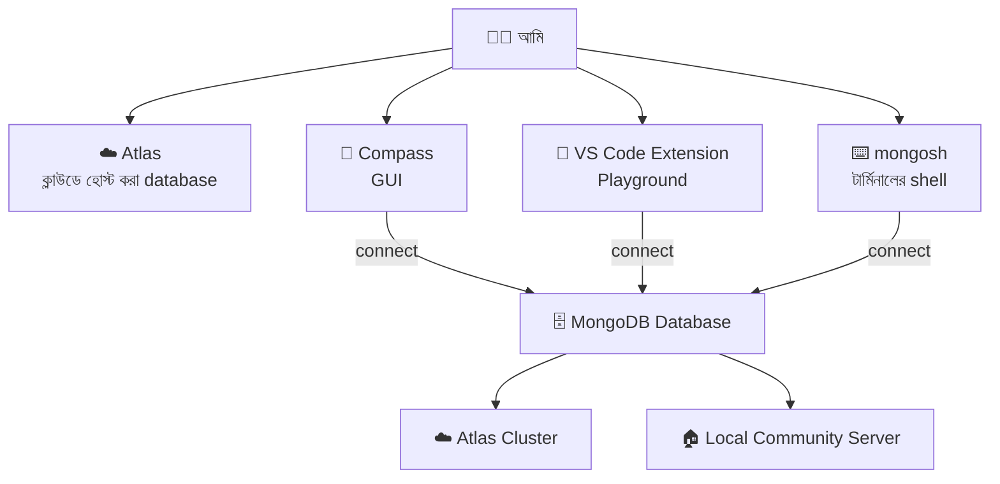

### ১. MongoDB Atlas — ক্লাউডের database

Atlas হলো MongoDB-র **নিজস্ব ক্লাউড সেবা (DBaaS — Database as a Service)**। নিজের কম্পিউটারে কিছু install না করেই database পাওয়া যায়, আর একটা **বিনামূল্যের ছোট tier (M0)** আছে শেখার জন্য।

**Atlas-এ প্রথম database বানানোর ধাপ:**

| ধাপ | কী করবেন | কেন |
|---|---|---|
| ১ | atlas-এ account খুলুন (`mongodb.com/atlas`) | সেবা ব্যবহারের অনুমতি |
| ২ | **Create a Cluster** → Free (M0) বেছে নিন, region দিন | এটাই আপনার database-এর ঘর |
| ৩ | **Database Access** → নতুন **Database User** বানান (username + password) | কে ঢুকতে পারবে |
| ৪ | **Network Access** → আপনার IP যোগ করুন | কোন কম্পিউটার থেকে ঢোকা যাবে |
| ৫ | **Connect** → **Drivers/Compass/Shell** থেকে **connection string** কপি করুন | ঠিকানা + চাবি |
| ৬ | (ঐচ্ছিক) **Load Sample Dataset** | practice ডেটা |

**Connection String-এর গঠন:**

```
mongodb+srv://<username>:<password>@cluster0.abcde.mongodb.net/?retryWrites=true&w=majority
   │              │          │              │
   │              │          │              └── cluster-এর ঠিকানা (Atlas দেয়)
   │              │          └── Database User-এর পাসওয়ার্ড
   │              └── Database User-এর নাম
   └── "+srv" = ঠিকানা DNS দিয়ে নিজে খুঁজে নেওয়া (Atlas-এর জন্য)
```

> ⚠️ **নিরাপত্তা:**
> - Network Access-এ শেখার সময় `0.0.0.0/0` (সবার জন্য খোলা) দিলে সুবিধা হয়, কিন্তু **আসল প্রজেক্টে কখনো নয়**। শুধু নির্দিষ্ট IP দিন।
> - Connection string-এ **পাসওয়ার্ড থাকে**, তাই এটা কোডে লিখে GitHub-এ push করবেন না। `.env` ফাইলে `MONGODB_URI=...` রেখে `.gitignore`-এ `.env` যোগ করুন (আগের ফাইলে `COOKIE_SECRET`-এর মতোই)।
> - পাসওয়ার্ডে `@`, `:`, `/` এর মতো বিশেষ অক্ষর থাকলে সেটা URL-encode করতে হয় (যেমন `@` → `%40`)।

### ২. MongoDB Compass — ছবিওয়ালা ড্যাশবোর্ড

Compass হলো MongoDB-র **অফিসিয়াল GUI (Graphical User Interface)** অ্যাপ। টার্মিনালে কমান্ড না লিখে মাউস দিয়ে কাজ করা যায়।

| Compass দিয়ে যা যা করা যায় | বিবরণ |
|---|---|
| Database/Collection দেখা ও বানানো | বাম পাশের তালিকায় গাছের মতো সাজানো |
| Document দেখা, খোঁজা | **Filter** বারে `{ price: { $gt: 500 } }` লিখে **Find** চাপা |
| Document যোগ, বদলানো, মোছা | Insert Document বোতাম, পেন্সিল আইকন, ডাস্টবিন আইকন |
| Schema বিশ্লেষণ | **Schema** ট্যাবে কোন field-এ কোন type কতগুলো আছে দেখা যায় |
| Index দেখা ও বানানো | **Indexes** ট্যাব |
| Query কতটা দ্রুত হলো দেখা | **Explain Plan** ট্যাব |
| Aggregation pipeline বানানো | **Aggregations** ট্যাব, ধাপে ধাপে ফলাফল দেখা যায় |
| JSON/CSV import-export | Collection-এর **Add Data** ও **Export** |
| Terminal-এর মতো কমান্ড চালানো | নিচে বিল্ট-ইন **`mongosh`** প্যানেল |

**Compass-এ connect করার উপায়:** Compass খুলে **New Connection** → Atlas থেকে কপি করা connection string বসিয়ে **Connect**। লোকাল হলে সরাসরি `mongodb://localhost:27017`।

### ৩. MongoDB for VS Code Extension

VS Code-এর Extension Marketplace থেকে **"MongoDB for VS Code"** ইনস্টল করলে আপনার কোড এডিটরেই একটা MongoDB প্যানেল আসে।

| সুবিধা | বিবরণ |
|---|---|
| **Connection** | connection string দিয়ে Atlas বা লোকাল server-এ connect |
| **Playground** | `.mongodb` বা `.mongodb.js` ফাইলে query লিখে ▶ চাপলে পাশেই ফলাফল দেখা যায় |
| **Database Explorer** | সাইডবারে database → collection → document গাছ |
| **Autocomplete** | `db.books.` লিখলেই মেথডের নাম সাজেস্ট করে |
| **কোডের ইতিহাস** | Playground ফাইল Git-এ রাখা যায়, তাই query গুলো সংরক্ষিত থাকে |

```javascript
// একটা Playground ফাইলের উদাহরণ (books.mongodb.js)

use("bookshop");
// use("নাম") = Playground-এ কোন database-এ কাজ করবো তা ঠিক করা।
// (Playground-এ use লিখতে হয় ফাংশনের মতো, বন্ধনী আর quote সহ)

db.getCollection("books").find({ price: { $gt: 500 } });
// db.getCollection("books") = books collection ধরা। ▶ চাপলে ফলাফল পাশের প্যানেলে আসবে
```

### ৪. MongoDB Community Server — নিজের কম্পিউটারেই database

Community Server হলো MongoDB-র **বিনামূল্যের, সোর্স-আভেইলেবল version**, যা নিজের কম্পিউটারে বা সার্ভারে চালানো যায়।

| বিষয় | বিবরণ |
|---|---|
| Server প্রোগ্রামের নাম | `mongod` (d = daemon, মানে পর্দার আড়ালে চলা প্রোগ্রাম) |
| ডিফল্ট Port | `27017` |
| লোকাল connection string | `mongodb://localhost:27017` |
| ডেটা কোথায় জমা হয় | ডিফল্টে Linux/macOS-এ সাধারণত `/data/db` বা প্যাকেজ ম্যানেজারের ঠিক করা ফোল্ডারে, Windows-এ ইনস্টলারে ঠিক করা `data` ফোল্ডারে |
| Windows/Linux/macOS | ✅ তিনটাতেই চলে |

**ইনস্টল করার তিনটা পথ:**

```bash
# পথ ১: অফিসিয়াল ইনস্টলার (Windows-এ সবচেয়ে সহজ)
# mongodb.com/try/download/community থেকে নামিয়ে "Install as a Service" বেছে নিন,
# তাহলে কম্পিউটার চালু হলেই MongoDB নিজে থেকে চলবে

# পথ ২: macOS-এ Homebrew দিয়ে
brew tap mongodb/brew                       # MongoDB-র নিজস্ব প্যাকেজ তালিকা যোগ করা
brew install mongodb-community              # Community Server ইনস্টল
brew services start mongodb-community       # ব্যাকগ্রাউন্ডে server চালু

# পথ ৩: Docker দিয়ে (কোনো কিছু ইনস্টল না করে)
docker run -d --name my-mongo -p 27017:27017 -v mongo-data:/data/db mongo
# -d = ব্যাকগ্রাউন্ডে চালাও
# --name my-mongo = container-এর নাম
# -p 27017:27017 = আমার কম্পিউটারের 27017 port-কে container-এর 27017 port-এর সাথে জোড়া
# -v mongo-data:/data/db = ডেটা একটা volume-এ রাখো, যাতে container মুছলেও ডেটা না যায়
# mongo = যে image চালাবো (Docker Hub-এর অফিসিয়াল MongoDB image)
```

### `mongosh` — টার্মিনালের shell

`mongosh` হলো MongoDB-র **আধুনিক কমান্ড-লাইন shell**। এটা আলাদাভাবে ইনস্টল করতে হয় (Community Server-এর সাথে আজকাল বান্ডেল থাকে না), আর এটা **JavaScript বোঝে**।

```bash
mongosh                                          # লোকাল server-এ connect (localhost:27017)
mongosh "mongodb://localhost:27017"              # একই জিনিস, ঠিকানা স্পষ্ট করে
mongosh "mongodb+srv://cluster0.abcde.mongodb.net/" --username myUser
# Atlas-এ connect। --username দিলে পাসওয়ার্ড আলাদা করে জিজ্ঞেস করবে (কমান্ডে পাসওয়ার্ড লেখা নিরাপদ নয়)
```

### কোনটা কখন?

| | Atlas | Compass | VS Code Extension | Community Server |
|---|---|---|---|---|
| ধরন | ক্লাউড database | GUI অ্যাপ | এডিটর প্লাগইন | নিজের মেশিনের database |
| কাজ | database **হোস্ট** করে | database **দেখা ও চালানো** | কোডের সাথে query **লেখা** | database **হোস্ট** করে |
| ইন্টারনেট লাগে? | ✅ | Atlas হলে ✅ | Atlas হলে ✅ | ❌ |
| কার জন্য | প্রোডাকশন, টিমের কাজ, শেখা | ভিজ্যুয়ালি দেখতে চাইলে | ডেভেলপারের রোজকার কাজ | অফলাইন ডেভেলপমেন্ট |

> **মনে রাখার উপায়:** Atlas আর Community Server হলো **ভবন** (database কোথায় থাকে)। Compass আর VS Code Extension হলো **রিমোট কন্ট্রোল** (ভবনকে হুকুম দেওয়ার যন্ত্র)। একটা ভবন থাকলে যেকোনো রিমোট দিয়েই চালানো যায়।

### এই ফাইলের বাকি অংশে আমরা কী ধরে নিচ্ছি

- আপনি `mongosh` (বা Compass-এর নিচের shell, বা VS Code Playground) দিয়ে কাজ করছেন।
- Database-এর নাম `bookshop`, collection-এর নাম `books`।
- কোডে `//` দিয়ে লেখা কমেন্ট শুধু বোঝার জন্য, কপি করার সময় বাদ দিলেও চলবে।

---

## ৪. Database-related Methods আর Insert Query

### গল্প

আপনি পাঠাগারে ঢুকে প্রথমেই মৌসুমী আপাকে জিজ্ঞেস করবেন: *"কয়টা শাখা আছে? আমি কোন শাখায় দাঁড়িয়ে আছি? আলমারিগুলো কোথায়?"* এগুলো **Database-related methods**। তারপর নতুন কার্ড রাখার হুকুম দেবেন: **Insert Query**।

### Database আর Collection-এর কমান্ড

```javascript
show dbs
// সার্ভারে যতগুলো database আছে তার তালিকা। (⚠️ যে database-এ এখনো কোনো ডেটা নেই সেটা এখানে দেখায় না)

db
// db = mongosh-এর একটা বিশেষ ভেরিয়েবল, যেটা এখন যে database-এ আছি তাকে ধরে রাখে। শুধু "db" লিখলে নাম দেখায়

use bookshop
// use = "bookshop database-এ যাও"। না থাকলে ব্যবহারের জন্য প্রস্তুত করে,
// কিন্তু আসল database তৈরি হয় প্রথম ডেটা বসানোর সময়

show collections
// বর্তমান database-এর সব collection-এর তালিকা (show tables-এর MongoDB সংস্করণ)

db.getCollectionNames()
// একই কাজ, তবে ফলাফল array হিসেবে দেয় (কোডে ব্যবহারের সুবিধা)

db.createCollection("members")
// "members" নামে একটা খালি collection আগে থেকেই বানানো। সাধারণত দরকার হয় না,
// কারণ প্রথম insert-এ collection নিজে বানায়। লাগে যখন বিশেষ option দিতে হয় (capped, validation)

db.books.renameCollection("library_books")
// books collection-এর নাম বদলে library_books করা

db.members.drop()
// members collection পুরোটা (ডেটা + index সহ) মুছে ফেলা। ফেরত আসে true বা false

db.getName()
// বর্তমান database-এর নাম String হিসেবে

db.stats()
// বর্তমান database-এর পরিসংখ্যান: কয়টা collection, কতগুলো document, কত সাইজ

db.books.stats()
// শুধু books collection-এর পরিসংখ্যান

db.version()
// MongoDB server-এর version

db.help()
// database-এর কমান্ডের সাহায্য-তালিকা। db.books.help() দিলে collection-এর মেথডের তালিকা আসে

db.dropDatabase()
// ⚠️ বর্তমান database পুরোটা মুছে ফেলা। কোনো সতর্কবার্তা ছাড়াই! use দিয়ে ঠিক database-এ আছেন কি না আগে নিশ্চিত হোন

cls
// mongosh-এর স্ক্রিন পরিষ্কার করা

exit
// mongosh থেকে বেরিয়ে আসা
```

> **`db.books` আসলে কী?** `db` = বর্তমান database। `.books` = ওই database-এর `books` নামের collection। তাই `db.books.find()` মানে *"বর্তমান শাখার `books` আলমারিতে খোঁজো"*। Collection-এর নামে `-` বা space থাকলে `db.getCollection("my-books")` লিখতে হয়।

### Insert-এর গল্প: নতুন কার্ড আলমারিতে রাখা

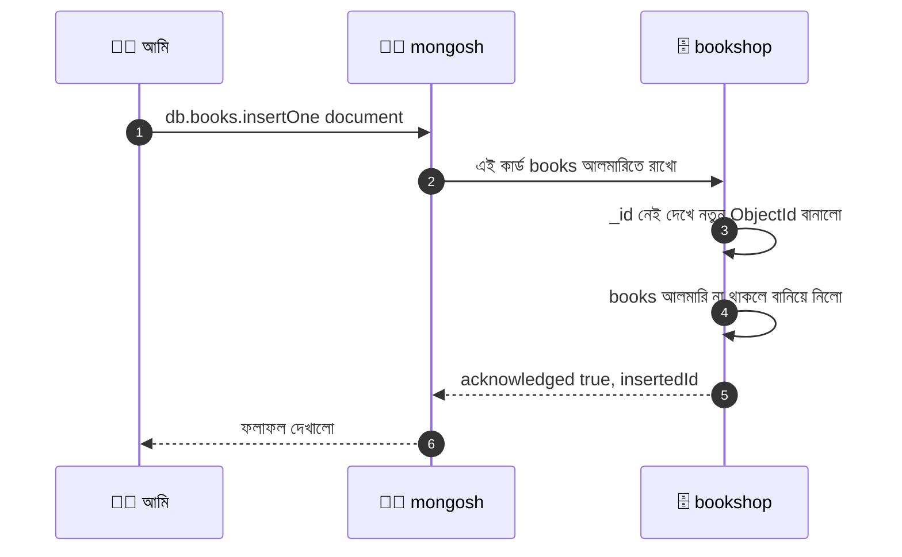

### `insertOne()` — একটা কার্ড রাখা

```javascript
db.books.insertOne({
  title: "পথের পাঁচালী",
  // title = বইয়ের নাম (String)
  author: { name: "বিভূতিভূষণ বন্দ্যোপাধ্যায়", country: "IN" },
  // author = embedded document। country = লেখকের দেশের কোড
  genre: "novel",
  // genre = বইয়ের ধরন। এটা দিয়ে পরে filter করবো
  price: 320,
  // price = বইয়ের দাম (টাকায়)
  pages: 280,
  // pages = পৃষ্ঠা সংখ্যা
  rating: 4.8,
  // rating = পাঠকদের গড় রেটিং (৫ এর মধ্যে)
  publishedYear: 1929,
  // publishedYear = কোন সালে প্রকাশ হয়েছিল
  inStock: true,
  // inStock = এখন পাঠাগারে আছে কি না (true/false)
  tags: ["classic", "village", "childhood"]
  // tags = বইকে চেনানোর একাধিক শব্দ (array)
});
// ফলাফল (সাধারণত):
// { acknowledged: true, insertedId: ObjectId("66f1a2b3c4d5e6f7a8b9c0d1") }
// acknowledged = server জানালো "কাজ পেয়েছি"
// insertedId   = _id আমরা না দেওয়ায় MongoDB যে নতুন ObjectId বানিয়েছে
```

### `insertMany()` — একসাথে অনেকগুলো কার্ড রাখা

এবার বাকি ৯টা কার্ড একসাথে রাখি। **একটা array-র ভেতরে একাধিক object** দিতে হয়:

```javascript
db.books.insertMany([
  // insertMany-এর আর্গুমেন্ট = document-এর একটা array [ {...}, {...}, ... ]
  {
    title: "পদ্মা নদীর মাঝি", author: { name: "মানিক বন্দ্যোপাধ্যায়", country: "IN" },
    genre: "novel", price: 250, pages: 200, rating: 4.6, publishedYear: 1936,
    inStock: true, tags: ["river", "village"]
  },
  {
    title: "লালসালু", author: { name: "সৈয়দ ওয়ালীউল্লাহ", country: "BD" },
    genre: "novel", price: 200, pages: 160, rating: 4.7, publishedYear: 1948,
    inStock: true, tags: ["classic", "society"]
  },
  {
    title: "শঙ্খনীল কারাগার", author: { name: "হুমায়ূন আহমেদ", country: "BD" },
    genre: "novel", price: 280, pages: 240, rating: 4.5, publishedYear: 1973,
    inStock: false, discount: 10, tags: ["family", "drama"]
    // discount = শতকরা ছাড়। এই কার্ডে আছে, কিন্তু সব কার্ডে নেই (flexible schema-র নমুনা)
  },
  {
    title: "দেবদাস", author: { name: "শরৎচন্দ্র চট্টোপাধ্যায়", country: "IN" },
    genre: "novel", price: 180, pages: 150, rating: 4.2, publishedYear: 1917,
    inStock: true, tags: ["classic", "romance"]
  },
  {
    title: "JavaScript Basics", author: { name: "Rahim Uddin", country: "BD" },
    genre: "textbook", price: 550, pages: 400, rating: 4.4, publishedYear: 2021,
    inStock: true, discount: 15, tags: ["programming", "web"]
  },
  {
    title: "MongoDB Guide", author: { name: "Karim Hasan", country: "BD" },
    genre: "textbook", price: 650, pages: 380, rating: 4.9, publishedYear: 2023,
    inStock: true, discount: 20, tags: ["database", "programming", "nosql"]
  },
  {
    title: "Node.js Cookbook", author: { name: "Rahim Uddin", country: "BD" },
    genre: "textbook", price: 600, pages: 420, rating: 4.3, publishedYear: 2022,
    inStock: false, tags: ["programming", "backend"]
  },
  {
    title: "কিশোর ভারতী", genre: "magazine", price: 60, pages: 48, publishedYear: 2024,
    inStock: true, issue: 12, tags: ["kids", "monthly"]
    // ম্যাগাজিনে author নেই, rating নেই, কিন্তু issue (সংখ্যা নম্বর) আছে — ইচ্ছে করেই আলাদা গড়ন
  },
  {
    title: "Science Monthly", genre: "magazine", price: 80, pages: 64, rating: "4",
    publishedYear: 2024, inStock: true, issue: 7, tags: ["science", "monthly"]
    // ⚠️ rating এখানে ইচ্ছে করেই String ("4")। পরে $type শেখার সময় এটা ধরবো
  }
]);
// ফলাফল (সাধারণত):
// { acknowledged: true,
//   insertedIds: { '0': ObjectId("..."), '1': ObjectId("..."), ... '8': ObjectId("...") } }
// insertedIds = কোন ক্রমের document-এর কোন _id হলো তার তালিকা
```

এখন `db.books.countDocuments()` চালালে **১০** পাওয়া উচিত। ✅ আমাদের ডেটা তৈরি।

### `_id` নিজে দেওয়া যায়, কিন্তু ইউনিক হতে হবে

```javascript
db.demo.insertOne({ _id: "BOOK-001", title: "নিজের দেওয়া আইডি" });
// _id হিসেবে নিজের বানানো String দিলাম। ObjectId ছাড়াও যেকোনো type (String, Number...) চলে,
// শুধু সেটা collection-এর ভেতরে ইউনিক হতে হবে

db.demo.insertOne({ _id: "BOOK-001", title: "একই আইডি আবার" });
// ❌ MongoServerError: E11000 duplicate key error collection: bookshop.demo index: _id_ dup key: { _id: "BOOK-001" }
// একই _id দ্বিতীয়বার রাখা যায় না — এটাই E11000 (duplicate key) error
```

### `ordered` option — একটা ভুল হলে বাকিগুলো কী হবে

```javascript
db.demo.insertMany([
  { _id: 1, name: "A" },
  { _id: 1, name: "B (ডুপ্লিকেট)" },   // ❌ এটাতে error হবে
  { _id: 2, name: "C" }
]);
// ডিফল্ট ordered: true → ১ম কার্ড বসলো, ২য়তে error হলো, আর তখনই থেমে গেলো।
// তাই ৩য় কার্ড (C) বসলোই না

db.demo.insertMany(
  [
    { _id: 10, name: "A" },
    { _id: 10, name: "B (ডুপ্লিকেট)" },
    { _id: 11, name: "C" }
  ],
  { ordered: false }
  // ordered: false = "একটায় ভুল হলেও বাকিগুলো বসিয়ে যাও"।
  // এবার A আর C বসবে, শুধু ডুপ্লিকেট B বাদ পড়বে এবং শেষে error-এর তালিকা দেখাবে
);
```

| `ordered` | আচরণ | কখন |
|---|---|---|
| `true` (ডিফল্ট) | প্রথম error-এ থেমে যায় | ক্রম গুরুত্বপূর্ণ, একটা ভুল মানে সব ভুল |
| `false` | error পেলেও বাকিগুলো চেষ্টা করে | বড় ডেটা import, কিছু ডুপ্লিকেট থাকতে পারে |

### Insert-এর আরও কিছু জরুরি কথা

| বিষয় | ব্যাখ্যা |
|---|---|
| `insertOne` ফেরত দেয় | `{ acknowledged, insertedId }` |
| `insertMany` ফেরত দেয় | `{ acknowledged, insertedIds }` |
| পুরোনো `db.books.insert()` | ⚠️ **deprecated** (বাদের পথে)। এর বদলে সবসময় `insertOne`/`insertMany` |
| একসাথে কতগুলো? | driver নিজে থেকে বড় লিস্টকে ছোট ছোট ব্যাচে ভেঙে পাঠায়, তবু অনেক বেশি হলে `bulkWrite` বা `mongoimport` ভালো |
| Collection না থাকলে | insert-এর সময়ই নিজে থেকে তৈরি হয় |
| Date বসাতে | `new Date()` বা `ISODate("...")`, String নয় |
| `bulkWrite()` | insert, update, delete একসাথে এক ব্যাচে পাঠানোর মেথড (নিচে সংক্ষেপে) |

```javascript
db.demo.bulkWrite([
  // bulkWrite = "কয়েক ধরনের কাজ একসাথে এক ঝাঁকে পাঠাও"। প্রতিটা কাজ একটা object।
  // (আমাদের books ডেটা যেন অক্ষত থাকে, তাই এখানে demo collection ব্যবহার করলাম)
  { insertOne: { document: { _id: 500, title: "নতুন বই", price: 100 } } },
  // insertOne অপারেশন: document = যে কার্ড রাখবো
  { updateOne: { filter: { _id: 500 }, update: { $set: { price: 120 } } } },
  // updateOne অপারেশন: filter = কোন কার্ড, update = কী বদলাবো ($set এর গল্প সেকশন ১৫-তে)
  { deleteOne: { filter: { _id: 999 } } }
  // deleteOne অপারেশন: filter = কোন কার্ড মুছবো (এখানে ৯৯৯ নম্বর কার্ড নেই, তাই কিছুই মুছবে না)
]);
// ফলাফলে দেখাবে: insertedCount, matchedCount, modifiedCount, deletedCount ইত্যাদির সারাংশ
```

---

## ৫. Find Query — কার্ড খুঁজে আনা

### গল্প

এবার সবচেয়ে বেশি ব্যবহার হওয়া হুকুম: **"আপা, আমার কার্ডটা খুঁজে দিন!"** আপা আলমারির তাকে তাকে দেখেন। আপনি যত নির্দিষ্ট করে বলবেন, আপা তত দ্রুত খুঁজে দেবেন। কিছু না বললে **সব কার্ড** এনে দেবেন।

`find()` মেথডের গঠন:

```
db.COLLECTION.find( FILTER , PROJECTION )
                      │          └── কার্ডের কোন কোন ঘর দেখতে চাই (সেকশন ৬)
                      └── কোন কোন কার্ড চাই (শর্ত)
```

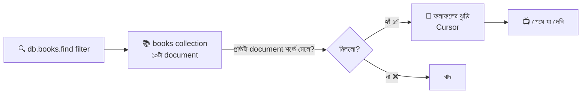

### `find()` — সব কার্ড

```javascript
db.books.find();
// filter না দিলে collection-এর সব document ফেরত দেয়।
// db.books.find({}) লিখলেও একই কাজ ({} = খালি শর্ত, মানে "সবাইকে আনো")
// mongosh একসাথে সর্বোচ্চ ২০টা দেখায়। আরও দেখতে "it" টাইপ করে Enter চাপুন
```

### `findOne()` — শুধু প্রথম মিলে যাওয়া কার্ডটা

```javascript
db.books.findOne({ title: "লালসালু" });
// findOne = শর্তে মেলে এমন প্রথম document-টা সরাসরি ফেরত দেয় (array বা cursor নয়, সরাসরি object)
// কিছুই না মিললে ফেরত দেয় null

db.books.findOne();
// কোনো শর্ত ছাড়া প্রথম document (প্রাকৃতিক ক্রমে প্রথমটা)
```

### `find()` বনাম `findOne()`

| | `find()` | `findOne()` |
|---|---|---|
| ফেরত দেয় | **Cursor** (mongosh-এ দেখতে array-র মতো) | **একটা document** অথবা `null` |
| কয়টা মেলে | সব মিলে যাওয়া | শুধু প্রথমটা |
| কখন | তালিকা দেখাতে | নির্দিষ্ট একটা জিনিস চাই (যেমন id দিয়ে) |
| Node.js driver-এ | `.toArray()` লাগে | `await` করলেই object পাওয়া যায় |

### শর্ত (Filter) লেখার নিয়ম

Filter হলো একটা **object**, যেখানে `{ field: মান }` লিখলে বোঝায় *"এই field-এর মান এই হতে হবে"*:

```javascript
db.books.find({ genre: "novel" });
// genre ঠিক "novel" এমন সব কার্ড → ৫টা (পথের পাঁচালী, পদ্মা নদীর মাঝি, লালসালু, শঙ্খনীল কারাগার, দেবদাস)

db.books.find({ genre: "novel", inStock: true });
// ⚠️ কমা দিয়ে একাধিক শর্ত মানে AND: genre novel-ও হতে হবে এবং inStock true-ও হতে হবে
// ফলাফল ৪টা (শঙ্খনীল কারাগার বাদ, কারণ ওটা inStock: false)

db.books.find({ price: 320 });
// price ঠিক 320 → পথের পাঁচালী

db.books.find({ price: "320" });
// ❌ কিছুই মিলবে না! কারণ database-এ price সংখ্যা (Number), আর এখানে খুঁজছি String "320"
// MongoDB-তে 320 আর "320" সম্পূর্ণ আলাদা। type মিলতে হবে
```

### Embedded Document-এ খোঁজা — Dot Notation

`author` একটা কার্ডের ভেতরে ছোট কার্ড। ভেতরের ঘর ধরতে `"author.country"` লিখতে হয় (**quote সহ**):

```javascript
db.books.find({ "author.country": "BD" });
// dot notation: "বাইরের-field.ভেতরের-field"। quote লাগবেই, কারণ dot থাকা নাম কোটেশন ছাড়া লেখা যায় না
// ফলাফল ৫টা: লালসালু, শঙ্খনীল কারাগার, JavaScript Basics, MongoDB Guide, Node.js Cookbook

db.books.find({ author: { name: "Karim Hasan", country: "BD" } });
// ⚠️ এটা "exact match": author object পুরোপুরি হুবহু এমন হতে হবে (field-এর ক্রম সহ)
// কম বা বেশি field থাকলে, বা ক্রম আলাদা হলে মিলবে না।
// তাই ভেতরের একটা field ধরতে সবসময় dot notation-ই সহজ ও নিরাপদ
```

### Array-তে খোঁজা (সংক্ষেপে; পুরো গল্প সেকশন ১১-এ)

```javascript
db.books.find({ tags: "classic" });
// tags একটা array। কোনো এলিমেন্ট "classic" হলেই মিলে যায় → পথের পাঁচালী, লালসালু, দেবদাস (৩টা)
// পুরো array-র সাথে মেলাতে হয় না, শুধু ভেতরের একটা মান থাকলেই হয়
```

### `_id` দিয়ে খোঁজা

```javascript
db.books.findOne({ _id: ObjectId("66f1a2b3c4d5e6f7a8b9c0d1") });
// _id ObjectId হিসেবে জমা আছে, তাই খোঁজার সময়ও ObjectId(...) দিয়ে মুড়ে দিতে হয়
// ObjectId("...") ছাড়া শুধু String দিলে কিছুই মিলবে না
```

### Cursor — ফলাফলের ঝুড়ি

`find()` সরাসরি সব ডেটা এনে দেয় না, দেয় একটা **Cursor** — যেন **ঝুড়ির হাতল**। ঝুড়িতে কার্ডগুলো ধীরে ধীরে ভরা হয়, আপনি চাইলে একটা একটা করে তুলে নেন। এতে লাখ লাখ কার্ডেও মেমরি ভরে যায় না।

```javascript
const cursor = db.books.find({ genre: "textbook" });
// cursor = find()-এর ফলাফলের হাতল। এখনো সব ডেটা আসেনি, আসছে ধাপে ধাপে

cursor.hasNext();
// hasNext() = আরও কার্ড বাকি আছে কি না (true/false)

cursor.next();
// next() = পরের একটা কার্ড তুলে আনা

cursor.forEach((book) => print(book.title));
// forEach = বাকি প্রতিটা কার্ডের জন্য ভেতরের ফাংশন চালানো। book = প্রতিবারের একটা document
// print() = mongosh-এর নিজস্ব "পর্দায় লেখো" ফাংশন (console.log-ও চলে)

db.books.find({ genre: "textbook" }).toArray();
// toArray() = ঝুড়ির সব কার্ড একসাথে একটা JavaScript array বানিয়ে দেয়।
// ⚠️ কম ডেটায় সুবিধা, কিন্তু বিশাল collection-এ সব মেমরিতে ঢুকিয়ে ফেলে, তাই সাবধান
```

> **`.pretty()` নিয়ে ধোঁকা:** পুরোনো টিউটোরিয়ালে `db.books.find().pretty()` দেখবেন। আধুনিক `mongosh` নিজে থেকেই সুন্দর করে সাজিয়ে দেখায়, তাই `.pretty()` এখন আর লাগে না (লিখলেও সমস্যা নেই)।

### Query কেমন দ্রুত হলো — `explain()`

```javascript
db.books.find({ price: { $gt: 500 } }).explain("executionStats");
// explain = "আপা, তুমি এই খোঁজাটা কীভাবে করলে সেটা বলো"
// "executionStats" = কতগুলো document পরীক্ষা করলো, কত সময় লাগলো, index ব্যবহার করলো কি না
// COLLSCAN = পুরো আলমারি ঘেঁটে দেখেছে (ধীর), IXSCAN = সূচিপত্র (index) ধরে সোজা গেছে (দ্রুত)
```

---

## ৬. Projection — কার্ডের কোন কোন ঘর দেখবো

### গল্প

কাস্টমার শুধু জানতে চায় বইয়ের **নাম আর দাম**। মৌসুমী আপা যদি পুরো কার্ড (লেখক, ট্যাগ, পৃষ্ঠা, রেটিং...) ফটোকপি করে হাতে ধরিয়ে দেন, তাহলে **কাগজ নষ্ট, সময় নষ্ট, ব্যান্ডউইথ নষ্ট**। তাই আপনি বলে দিতে পারেন: *"শুধু নাম আর দাম দেখান।"* এটাই **Projection**।

Projection হলো `find()`-এর **দ্বিতীয় আর্গুমেন্ট**।

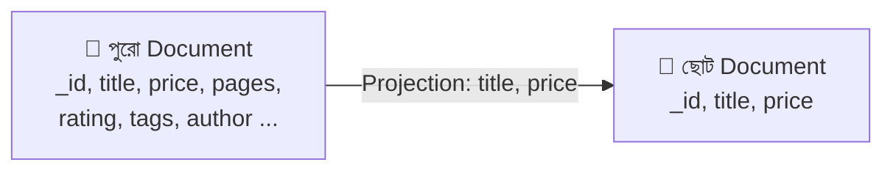

### Include — যেগুলো চাই সেগুলো `1` দিয়ে

```javascript
db.books.find({}, { title: 1, price: 1 });
// প্রথম {} = filter (সব কার্ড)। দ্বিতীয় object = projection
// title: 1 আর price: 1 = "এই দুটো ঘর দেখাও" (1 = দেখাও)
// ফলাফল: { _id: ObjectId("..."), title: "পথের পাঁচালী", price: 320 } এভাবে
// ⚠️ _id সবসময় নিজে থেকে আসে, বন্ধ করতে না বললে

db.books.find({}, { title: 1, price: 1, _id: 0 });
// _id: 0 = "_id দেখিও না"। _id একমাত্র field যেটা include করার সময়ও বাদ দেওয়া যায়
// ফলাফল: { title: "পথের পাঁচালী", price: 320 }
```

### Exclude — যেগুলো চাই না সেগুলো `0` দিয়ে

```javascript
db.books.find({}, { tags: 0, pages: 0 });
// tags: 0, pages: 0 = "এই দুটো বাদে বাকি সব দেখাও" (0 = লুকাও)
// কার্ডে অনেক ঘর, শুধু দু-একটা বাদ দিতে চাইলে এটা সুবিধাজনক
```

### 🎯 গুরুত্বপূর্ণ নিয়ম: `1` আর `0` মেশানো যাবে না

```javascript
db.books.find({}, { title: 1, tags: 0 });
// ❌ MongoServerError: Cannot do exclusion on field tags in inclusion projection
// একই projection-এ include (1) আর exclude (0) মেশানো নিষেধ।
// ✅ ব্যতিক্রম: শুধু _id: 0 যেকোনো projection-এর সাথে মেশানো যায়
```

| Projection ধরন | লেখা | ফল |
|---|---|---|
| Include | `{ title: 1, price: 1 }` | শুধু এই দুটো (+ `_id`) |
| Exclude | `{ tags: 0 }` | এটা বাদে বাকি সব |
| `_id` বাদ | `{ title: 1, _id: 0 }` | শুধু `title` |
| ❌ মেশানো | `{ title: 1, tags: 0 }` | error |

### Embedded field-এর projection

```javascript
db.books.find({}, { title: 1, "author.name": 1, _id: 0 });
// "author.name" = author-এর ভেতরের শুধু name ঘরটা। dot notation-এ quote লাগে
// ফলাফল: { title: "লালসালু", author: { name: "সৈয়দ ওয়ালীউল্লাহ" } }
// (author-এর ভেতরে country আসবে না)
```

### Filter আর Projection একসাথে

```javascript
db.books.find(
  { genre: "textbook", inStock: true },
  // ১ম আর্গুমেন্ট = filter: শুধু স্টকে থাকা পাঠ্যবই
  { title: 1, price: 1, _id: 0 }
  // ২য় আর্গুমেন্ট = projection: শুধু নাম আর দাম
);
// ফলাফল: [ { title: "JavaScript Basics", price: 550 }, { title: "MongoDB Guide", price: 650 } ]
```

### Array-র জন্য বিশেষ Projection: `$slice` আর `$elemMatch`

```javascript
db.books.find({}, { title: 1, tags: { $slice: 2 }, _id: 0 });
// $slice: 2 = tags array-র শুধু প্রথম ২টা এলিমেন্ট দেখাও
// পথের পাঁচালীর tags ["classic","village","childhood"] থেকে আসবে ["classic","village"]

db.books.find({}, { title: 1, tags: { $slice: -1 }, _id: 0 });
// $slice: -1 = শেষ ১টা এলিমেন্ট (নেগেটিভ মানে পেছন থেকে গোনা)

db.books.find({}, { title: 1, tags: { $slice: [1, 2] }, _id: 0 });
// $slice: [skip, limit] = প্রথম ১টা বাদ দিয়ে তারপর ২টা এলিমেন্ট
```

> `$elemMatch` projection আর positional `$` projection array-of-objects-এর জন্য কাজে লাগে (সেকশন ১১-এ পাবেন)।

### `find()`-এর পরে `.project()` দিয়েও লেখা যায়

```javascript
db.books.find({ genre: "novel" }).project({ title: 1, price: 1, _id: 0 });
// .project() = cursor-এর মেথড, দ্বিতীয় আর্গুমেন্টে যা লিখতাম এখানে সেটাই লেখা।
// মেথড চেইনে পড়তে সুবিধা লাগে। Node.js driver-এ এটাই বেশি ব্যবহার হয়
```

### Projection কেন জরুরি

| কারণ | ব্যাখ্যা |
|---|---|
| **গতি** | কম ডেটা network-এ যায়, তাই দ্রুত |
| **নিরাপত্তা** | `password`, `secretCost`-এর মতো ঘর `0` দিয়ে কখনোই ফেরত না পাঠানো |
| **পরিষ্কার উত্তর** | frontend যা দরকার শুধু তাই পায় |

> 💡 **Express-এর সাথে যোগসূত্র:** আগের ফাইলে `toJSON()` দিয়ে গোপন ঘর লুকিয়েছিলাম। Database থেকে আনার সময়ই projection দিয়ে লুকিয়ে ফেলা আরও ভালো, কারণ ঘরটা তখন server-এর মেমরিতেই আসে না।

---

## ৭. Comparison Query Operators — তুলনার অস্ত্র

### গল্প

এতক্ষণ আমরা শুধু *"ঠিক এটাই"* খুঁজেছি (`price: 320`)। কিন্তু কাস্টমার তো বলে: *"৫০০ টাকার **বেশি** দামি বই দেখান"*, *"২০০ থেকে ৩০০-র **মধ্যে** দেখান"*, *"শুধু novel অথবা magazine দেখান"*। এই ধরনের তুলনার জন্য MongoDB-র হাতে আছে **Operator** — যেগুলো সবসময় **`$` চিহ্ন দিয়ে** শুরু হয়।

**Operator লেখার গঠন:**

```
{ field: { $operator: মান } }
          └── এই "ভেতরের object"-টাই তুলনার নিয়ম
```

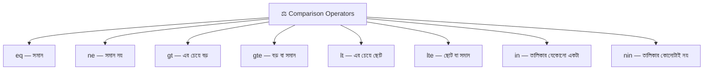

### সব Comparison Operator-এর তালিকা

| Operator | মানে | গল্পে | উদাহরণ |
|---|---|---|---|
| `$eq` | সমান (equal) | "ঠিক এটাই" | `{ price: { $eq: 320 } }` (সাধারণ `{ price: 320 }`-এর মতোই) |
| `$ne` | সমান নয় (not equal) | "এটা ছাড়া বাকি" | `{ genre: { $ne: "novel" } }` |
| `$gt` | বড় (greater than) | "এর চেয়ে বেশি" | `{ price: { $gt: 500 } }` |
| `$gte` | বড় বা সমান | "এর সমান বা বেশি" | `{ rating: { $gte: 4.5 } }` |
| `$lt` | ছোট (less than) | "এর চেয়ে কম" | `{ price: { $lt: 100 } }` |
| `$lte` | ছোট বা সমান | "এর সমান বা কম" | `{ pages: { $lte: 200 } }` |
| `$in` | তালিকার যেকোনো একটার সাথে মেলে | "এগুলোর যেকোনো একটা হলেই চলবে" | `{ genre: { $in: ["novel", "magazine"] } }` |
| `$nin` | তালিকার কোনোটার সাথেই মেলে না | "এগুলোর কোনোটাই চাই না" | `{ genre: { $nin: ["novel"] } }` |

> **মনে রাখার ছড়া:** **g**reater **t**han = `gt`, **l**ess **t**han = `lt`, আর শেষে **e** মানে **e**qual-ও (`gte`, `lte`)।

### কোড, সাথে ফলাফল

```javascript
db.books.find({ price: { $gt: 500 } });
// price 500-এর বেশি: JavaScript Basics (550), MongoDB Guide (650), Node.js Cookbook (600) → ৩টা
// { price: { $gt: 500 } } পড়বেন: "price ফিল্ডের মান, যেটা 500-এর চেয়ে বড়"

db.books.find({ price: { $gte: 200, $lte: 300 } });
// 🎯 রেঞ্জ (মধ্যে): একই field-এ দুটো operator পাশাপাশি রাখলে দুটোই একসাথে খাটে (AND)
// price 200 থেকে 300 (দুই প্রান্ত সহ): পদ্মা নদীর মাঝি (250), লালসালু (200), শঙ্খনীল কারাগার (280) → ৩টা

db.books.find({ rating: { $gte: 4.5 } });
// rating ৪.৫ বা তার বেশি: পথের পাঁচালী (4.8), পদ্মা নদীর মাঝি (4.6), লালসালু (4.7),
// শঙ্খনীল কারাগার (4.5), MongoDB Guide (4.9) → ৫টা
// ("Science Monthly"-র rating String "4", আর কিশোর ভারতীর rating-ই নেই, তাই এরা আসবে না — নিচে কারণ দেখুন)

db.books.find({ publishedYear: { $lt: 1950 } });
// 1950 সালের আগে প্রকাশিত: পথের পাঁচালী (1929), পদ্মা নদীর মাঝি (1936), লালসালু (1948), দেবদাস (1917) → ৪টা

db.books.find({ genre: { $ne: "novel" } });
// novel ছাড়া বাকি সব → ৫টা (তিনটা textbook + দুটো magazine)

db.books.find({ genre: { $in: ["textbook", "magazine"] } });
// genre textbook অথবা magazine → ৫টা। $in-এর ভেতরে সবসময় একটা array [ ... ] দিতে হয়

db.books.find({ genre: { $nin: ["novel", "textbook"] } });
// genre novel-ও নয়, textbook-ও নয় → শুধু দুটো magazine (কিশোর ভারতী, Science Monthly)
```

### 🎯 ফাঁদ ১: একই key দুইবার লিখলে

```javascript
db.books.find({ price: { $gt: 100 }, price: { $lt: 300 } });
// ❌ এটা ভুল! JavaScript object-এ একই key (price) দুইবার লিখলে পরেরটা আগেরটাকে মুছে দেয়।
// ফলে শুধু { price: { $lt: 300 } } টাই কাজ করে, $gt: 100 হারিয়ে যায়

db.books.find({ price: { $gt: 100, $lt: 300 } });
// ✅ সঠিক: একটা price key-র ভেতরে দুটো operator
```

### 🎯 ফাঁদ ২: `$ne` আর `$nin` যাদের field-ই নেই তাদেরও ধরে ফেলে

```javascript
db.books.find({ discount: { $ne: 10 } });
// ফলাফল ৯টা! কারণ: discount: 10 শুধু "শঙ্খনীল কারাগার"-এ। বাকি ৯টার discount হয় অন্য মান, নয়তো ঘরটাই নেই।
// $ne বলে "10 নয়", আর যার ঘরই নেই সেও তো "10 নয়" — তাই সে-ও ঢুকে যায়

db.books.find({ discount: { $exists: true, $ne: 10 } });
// ✅ শুধু যাদের discount আছে এবং সেটা 10 নয়: JavaScript Basics (15), MongoDB Guide (20) → ২টা
// $exists এর গল্প সেকশন ৯-এ
```

### 🎯 ফাঁদ ৩: Type মিলতে হবে (Type Bracketing)

```javascript
db.books.find({ rating: { $gte: 4 } });
// "Science Monthly"-র rating আছে String "4"। কিন্তু এই query সংখ্যার সাথে তুলনা করছে,
// আর MongoDB সাধারণত শুধু একই ধরনের মানের সাথে তুলনা করে। তাই String "4" এখানে আসবে না
// (comparison operator-এ সংখ্যা শুধু সংখ্যার সাথে, String শুধু String-এর সাথে মেলে)
// এই ডেটার ভুলটা ধরতে সেকশন ৯-এর $type কাজে লাগবে
```

### `null` আর "ঘর নেই" — আলাদা কিন্তু একসাথে ধরা পড়ে

```javascript
db.books.find({ author: null });
// author: null দিয়ে খুঁজলে দুই ধরনের কার্ড আসে: (১) যেখানে author-এর মান null, (২) যেখানে author ঘরটাই নেই
// আমাদের ডেটায় দুটো magazine-এ author নেই, তাই ২টা আসবে
// শুধু "ঘর নেই" চাইলে $exists: false ব্যবহার করুন
```

### তারিখের তুলনা

```javascript
db.books.find({ addedAt: { $gte: new Date("2026-01-01"), $lt: new Date("2027-01-01") } });
// ২০২৬ সালে যোগ হওয়া কার্ড। তারিখ অবশ্যই Date object দিয়ে তুলনা করতে হবে, String দিয়ে নয়
// ($lt: ২০২৭-০১-০১ মানে ২০২৬-এর শেষ মুহূর্ত পর্যন্ত। এই "শুরু থেকে পরের বছরের শুরু পর্যন্ত" পদ্ধতিটাই নিরাপদ)
// (আমাদের প্রাথমিক ডেটায় addedAt ঘরটা নেই, তাই ফলাফল ফাঁকা আসবে। নিজে addedAt যোগ করে চালিয়ে দেখুন)
```

---

## ৮. Logical Query Operators — শর্ত জোড়ার অস্ত্র

### গল্প

কাস্টমারের হুকুম এখন জটিল: *"আমার **novel-ও** চাই, **আবার** স্টকে থাকতে হবে"*, *"বা **সস্তা** হলেই চলবে, **অথবা** রেটিং ভালো হলেই চলবে"*, *"এই দুটো শর্তের **কোনোটাই** চাই না"*। একাধিক শর্ত জোড়ার এই কাজ করে **Logical Operator**।

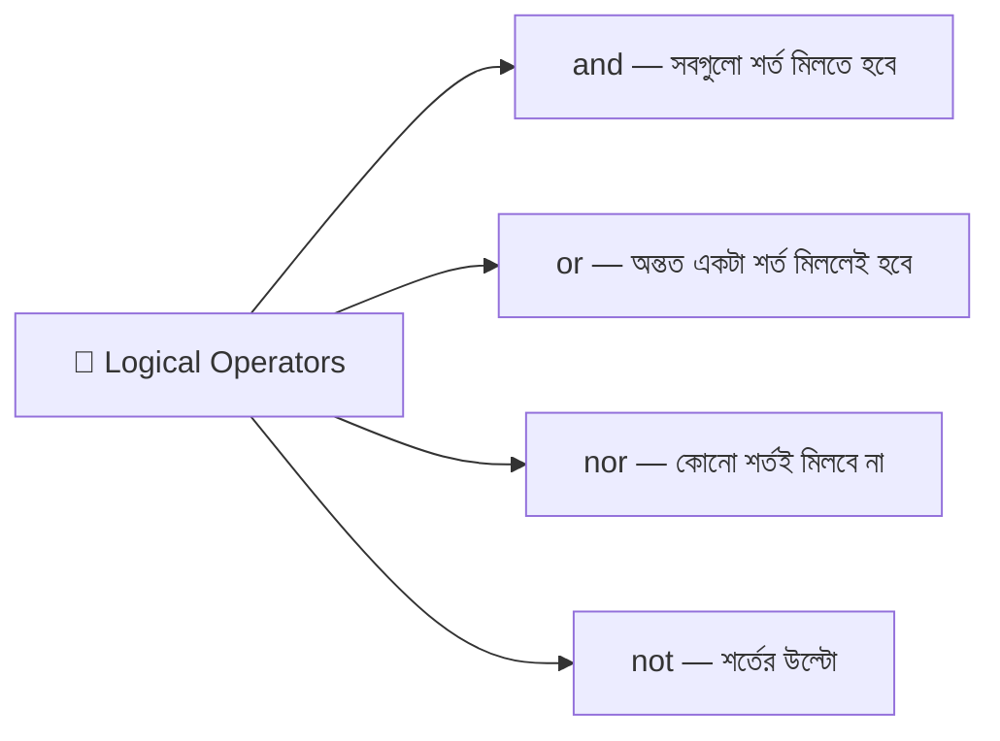

| Operator | মানে | গল্পে | গঠন |
|---|---|---|---|
| `$and` | সব শর্ত সত্য হতে হবে | "এটাও চাই, ওটাও চাই" | `{ $and: [ শর্ত১, শর্ত২ ] }` |
| `$or` | অন্তত একটা শর্ত সত্য | "এটা অথবা ওটা, যেকোনো একটা হলেই চলবে" | `{ $or: [ শর্ত১, শর্ত২ ] }` |
| `$nor` | কোনো শর্তই সত্য নয় | "এটাও না, ওটাও না" | `{ $nor: [ শর্ত১, শর্ত২ ] }` |
| `$not` | একটা operator-এর উল্টো ফল | "এই নিয়মে মেলে না এমন" | `{ field: { $not: { $gt: 300 } } }` |

> ⚠️ `$and`, `$or`, `$nor` তিনটার ভেতরেই **array** [ ... ] দিতে হয়, আর array-র প্রতিটা এলিমেন্ট একটা **সম্পূর্ণ শর্ত object**।

### `$and` — সবগুলো মিলতে হবে

```javascript
db.books.find({
  $and: [
    { genre: "textbook" },
    // ১ম শর্ত: genre textbook হতে হবে
    { inStock: true }
    // ২য় শর্ত: inStock true হতে হবে
  ]
});
// দুটোই মিলতে হবে → JavaScript Basics, MongoDB Guide (২টা। Node.js Cookbook বাদ, কারণ inStock: false)
```

**আগেই আমরা জেনেছি, কমা দিয়ে লিখলে নিজে থেকেই AND হয়:**

```javascript
db.books.find({ genre: "textbook", inStock: true });
// উপরের $and-এর সমান ফল। সাধারণত এটাই ছোট আর পরিষ্কার
```

**তাহলে `$and` কখন লাগে?** যখন **একই field বা একই operator দুইবার** দরকার (আগের সেকশনের "একই key দুইবার" ফাঁদের কারণে):

```javascript
db.books.find({
  $and: [
    { $or: [{ genre: "novel" }, { genre: "textbook" }] },
    // ১ম $or: novel অথবা textbook
    { $or: [{ price: { $lt: 300 } }, { rating: { $gte: 4.8 } }] }
    // ২য় $or: দাম ৩০০-র কম অথবা রেটিং ৪.৮-এর বেশি বা সমান
  ]
});
// একই key ($or) দুইবার দরকার বলে $and-এর ভেতরে না রাখলে একটা আরেকটাকে মুছে ফেলতো
```

### `$or` — অন্তত একটা মিললেই চলবে

```javascript
db.books.find({
  $or: [
    { price: { $lt: 100 } },
    // ১ম শর্ত: দাম ১০০-র কম (সস্তা)
    { rating: { $gte: 4.8 } }
    // ২য় শর্ত: রেটিং ৪.৮ বা তার বেশি (দারুণ বই)
  ]
});
// যেকোনো একটা শর্ত মিললেই আসবে: কিশোর ভারতী (৬০), Science Monthly (৮০), পথের পাঁচালী (৪.৮), MongoDB Guide (৪.৯) → ৪টা
```

**`$or` আর কমা মেশালে:**

```javascript
db.books.find({
  $or: [{ genre: "novel" }, { genre: "textbook" }],
  // (novel অথবা textbook)
  price: { $lt: 300 },
  // এবং দাম ৩০০-র কম
  inStock: true
  // এবং স্টকে আছে
});
// কমা-র শর্তগুলো আর $or — সব একসাথে AND হয়। ফলাফল: পদ্মা নদীর মাঝি, লালসালু, দেবদাস → ৩টা
```

> 💡 একই field-এ অনেকগুলো মান হলে `$or`-এর বদলে **`$in`** ব্যবহার করুন — ছোট আর দ্রুত: `{ genre: { $in: ["novel", "textbook"] } }`।

### `$nor` — কোনোটাই মিলবে না

```javascript
db.books.find({
  $nor: [
    { genre: "novel" },
    // novel চাই না
    { inStock: false }
    // স্টকহীনও চাই না
  ]
});
// দুটো শর্তের কোনোটাই সত্য নয় এমন: JavaScript Basics, MongoDB Guide, কিশোর ভারতী, Science Monthly → ৪টা
// $nor = NOT (শর্ত১ OR শর্ত২)
```

### `$not` — একটা operator-এর উল্টো

```javascript
db.books.find({ price: { $not: { $gt: 300 } } });
// "price > 300" এই শর্তটা যাদের বেলায় সত্য নয়, তারা আসবে
// ফলাফল ৬টা: পদ্মা নদীর মাঝি, লালসালু, শঙ্খনীল কারাগার, দেবদাস, কিশোর ভারতী, Science Monthly
// $not সেই কার্ডগুলোকেও ধরে যাদের price ঘরই নেই (একই "ঘর নেই" ফাঁদ)

db.books.find({ price: { $lte: 300 } });
// ✅ প্রায় একই ফল, তবে যাদের price নেই তাদের বাদ দেয়। সাধারণত সরাসরি $lte লেখাই ভালো
```

> ⚠️ `$not` শুধু **একটা operator expression**-এর উপর কাজ করে (`{ $gt: 300 }`), সরাসরি মানের উপর নয়। তাই `{ price: { $not: 300 } }` ভুল। উল্টো করতে চাইলে `$ne`।

### কোনটা কখন?

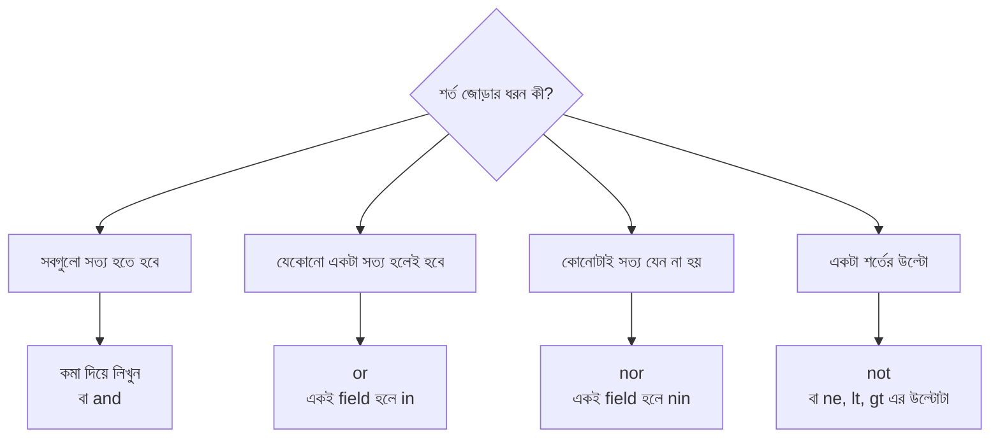

---

## ৯. Element Query Operators — ঘর আছে কি না, আর কোন ধরনের

### গল্প

আমাদের পাঠাগারের কার্ডগুলো একরকম নয়। কারো `discount` ঘর আছে, কারো নেই। ম্যাগাজিনে `author` নেই। একটা কার্ডে `rating` লেখা হয়েছে সংখ্যায়, আরেকটাতে ভুল করে লেখায়। কাস্টমার এখন জানতে চায়: *"কোন কোন বইয়ের **ডিসকাউন্টের ঘর** আছে?"* বা *"কোন কার্ডে rating **ভুল ধরনে** (লেখায়) লেখা?"* এই প্রশ্নের উত্তর দেয় **Element Operators** — এরা **ঘর আছে কি না** আর **ঘরের ধরন কী** এই দুটো জানে।

| Operator | কাজ | গল্পে |
|---|---|---|
| `$exists` | field আছে কি না | "কার্ডে এই ঘরটা আছে?" |
| `$type` | field-এর data type কী | "ঘরের ভেতরে সংখ্যা না লেখা?" |

### `$exists`

```javascript
db.books.find({ discount: { $exists: true } });
// যে কার্ডে discount ঘরটা আছে: শঙ্খনীল কারাগার, JavaScript Basics, MongoDB Guide → ৩টা

db.books.find({ author: { $exists: false } });
// যে কার্ডে author ঘরটাই নেই: কিশোর ভারতী, Science Monthly → ২টা (দুটোই ম্যাগাজিন)

db.books.find({ rating: { $exists: false } });
// rating ঘর নেই: শুধু কিশোর ভারতী → ১টা

db.books.find({ issue: { $exists: true } });
// issue (সংখ্যা নম্বর) আছে এমন: ম্যাগাজিন দুটো
```

> ⚠️ **`$exists: true` মানে "ঘরটা আছে"**, মানটা `null` হলেও সে ধরা পড়বে। ঘর আছে **এবং** মান `null` নয়, এটা চাইলে: `{ discount: { $exists: true, $ne: null } }`।

### `$type`

```javascript
db.books.find({ rating: { $type: "string" } });
// rating-এর ধরন String: Science Monthly → ১টা (ডেটায় আমরা ইচ্ছে করে ভুল ঢুকিয়েছিলাম)
// এখন সেকশন ৭-এর "ফাঁদ ৩"-এর রহস্য পরিষ্কার: ওই ডেটা সংখ্যার তুলনায় ধরা পড়েনি, কারণ ওটা লেখা

db.books.find({ rating: { $type: "double" } });
// rating Double (দশমিক সংখ্যা): ৮টা (পথের পাঁচালী থেকে Node.js Cookbook পর্যন্ত সব)

db.books.find({ rating: { $type: "number" } });
// "number" = একটা বিশেষ alias, যা int, long, double, decimal — সব ধরনের সংখ্যাকে একসাথে ধরে

db.books.find({ rating: { $type: ["double", "string"] } });
// array দিলে "এই তালিকার যেকোনো একটা type" — এখানে ৯টা আসবে (ম্যাগাজিন কিশোর ভারতী বাদ, তার rating-ই নেই)

db.books.find({ author: { $type: "object" } });
// author একটা embedded document: ৮টা কার্ড

db.books.find({ tags: { $type: "array" } });
// tags একটা array: সব ১০টা কার্ড
```

### `$exists` আর `$type` একসাথে — ডেটা পরিষ্কারের কাজে

```javascript
db.books.find({
  rating: { $exists: true, $not: { $type: "number" } }
  // rating ঘর আছে, কিন্তু সংখ্যা নয় → ভুল ধরনের ডেটা ধরার জন্য
});
// ফলাফল: Science Monthly (rating: "4" String)

db.books.updateOne({ title: "Science Monthly" }, { $set: { rating: 4.0 } });
// ধরা পড়া ভুলটা ঠিক করলাম: String "4"-কে সংখ্যা 4 বানালাম (updateOne-র গল্প সেকশন ১৫-তে)
```

> ⚠️ এই আপডেটটা চালালে পরের কিছু উদাহরণের ফলাফল একটু বদলে যাবে (`rating >= 4.5` ইত্যাদি অবশ্য বদলাবে না)। তাই আপাতত শুধু বুঝে নিন, ডেটা অক্ষত রাখতে চাইলে এটা পরে চালাবেন।

---

## ১০. Evaluation Query Operators — কার্ডের লেখা বা হিসাব "যাচাই" করে খোঁজা

### গল্প

কাস্টমার এবার আরও চতুর: *"যে বইয়ের নাম 'Node' দিয়ে শুরু হয়"*, *"যে বইয়ের প্রতি পৃষ্ঠার দাম ১.৫ টাকার বেশি"*, *"প্রকাশের সাল জোড় সংখ্যা"*। এখানে সরাসরি মান মেলানো যাচ্ছে না, আপাকে **লেখা পরীক্ষা করতে**, **হিসাব কষতে** হবে। এই কাজের অস্ত্রগুলোই **Evaluation Operators**।

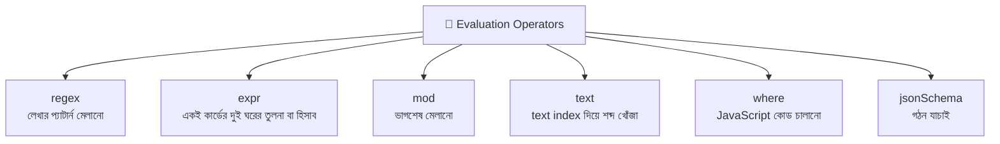

| Operator | কাজ | গল্পে |
|---|---|---|
| `$regex` | লেখা কোনো প্যাটার্নের সাথে মেলে কি না | "নাম 'Node' দিয়ে শুরু?" |
| `$expr` | একই document-এর দুই field-এর তুলনা বা হিসাব | "দাম ÷ পৃষ্ঠা > ১.৫?" |
| `$mod` | ভাগশেষ মেলানো | "সাল জোড় (২ দিয়ে ভাগ করলে ০ বাকি)?" |
| `$text` | Text Index দিয়ে শব্দ ধরে খোঁজা | "নামে 'mongodb' শব্দ আছে?" |
| `$where` | JavaScript কোড চালিয়ে যাচাই | "নিজের বানানো শর্ত" (⚠️ সাবধান) |
| `$jsonSchema` | Document-এর গড়ন কোনো schema-র সাথে মেলে কি না | "কার্ডের ছক ঠিক আছে?" |

### `$regex` — লেখার প্যাটার্ন

```javascript
db.books.find({ title: { $regex: "^Node" } });
// ^ = "শুরুতে"। title যেটা "Node" দিয়ে শুরু: Node.js Cookbook → ১টা

db.books.find({ title: { $regex: "script", $options: "i" } });
// $options: "i" = ছোট-বড় হাতের অক্ষর উপেক্ষা করো (i = ignore case)
// "JavaScript Basics"-এ "Script" (বড় S) আছে, তবু "i"-র জন্য মিলে গেলো → ১টা

db.books.find({ title: /Guide$/ });
// /.../ = সরাসরি regex লেখার ছোট রূপ (JavaScript-এর মতো)। $ = "শেষে"
// title যেটা "Guide" দিয়ে শেষ: MongoDB Guide → ১টা

db.books.find({ title: { $regex: "নদী" } });
// বাংলা লেখাতেও কাজ করে। নামের ভেতরে "নদী" আছে: পদ্মা নদীর মাঝি → ১টা

db.books.find({ title: /^পথ/ });
// title "পথ" দিয়ে শুরু: পথের পাঁচালী → ১টা
```

**Regex-এর কয়েকটা দরকারি চিহ্ন:**

| চিহ্ন | মানে | উদাহরণ |
|---|---|---|
| `^` | লেখার শুরু | `^Node` |
| `$` | লেখার শেষ | `Guide$` |
| `.` | যেকোনো একটা অক্ষর | `N.de` |
| `.*` | যেকোনো কিছু, যত খুশি লম্বা | `Mongo.*Guide` |
| `i` (option) | বড়-ছোট হাত উপেক্ষা | `/guide/i` |

> ⚠️ **কর্মদক্ষতার কথা:**
> - `^` দিয়ে শুরু আর case-sensitive regex হলে **index** কাজে লাগতে পারে (দ্রুত)।
> - মাঝখান থেকে খোঁজা (`/script/`) বা `i` option দিলে সাধারণত **সব document ঘেঁটে** দেখতে হয় (ধীর)। বিশাল collection-এ তাই এড়িয়ে `$text` বা Atlas Search ভাবুন।
> - ব্যবহারকারীর দেওয়া লেখা সরাসরি regex-এ বসাবেন না। `.`, `*`, `(` এর মতো বিশেষ অক্ষর থাকলে ভুল বা ধীর query হতে পারে। আগে escape করে নিন।

### `$expr` — একই কার্ডের দুই ঘরের তুলনা বা হিসাব

সাধারণ filter-এ শুধু **ঘর বনাম নির্দিষ্ট মান** তুলনা করা যায় (`price > 500`)। কিন্তু **ঘর বনাম আরেকটা ঘর**, বা হিসাব-করা মান চাইলে লাগে `$expr`। এর ভেতরে field-এর নামের আগে **`$` বসিয়ে** লিখতে হয় (`"$price"`) — মানে "ওই ঘরের মান"।

```javascript
db.books.find({
  $expr: { $gt: [{ $divide: ["$price", "$pages"] }, 1.5] }
  // $expr = "ভেতরের অংশটা aggregation-এর ভাষায় হিসাব করো"
  // $divide: ["$price", "$pages"] = দাম ÷ পৃষ্ঠা (প্রতি পৃষ্ঠার দাম)
  // "$price" আর "$pages" = ওই কার্ডেরই price ও pages ঘরের মান
  // $gt: [ক, খ] = ক > খ। ⚠️ $expr-এর ভেতরে $gt লেখার নিয়ম আলাদা: array [বাম, ডান]
  // পুরো মানে: প্রতি পৃষ্ঠার দাম ১.৫ টাকার বেশি
});
// ফলাফল: MongoDB Guide (৬৫০ ÷ ৩৮০ ≈ ১.৭১) → ১টা

db.books.find({
  $expr: { $eq: ["$genre", "textbook"] }
});
// $expr-এর ভেতরে সাধারণ মান মেলানোও চলে, তবে এর আসল শক্তি দুই ঘরের তুলনায়
```

| | সাধারণ filter | `$expr` |
|---|---|---|
| তুলনা | ঘর বনাম **নির্দিষ্ট মান** | ঘর বনাম **আরেক ঘর** বা হিসাবের ফল |
| Field-এর নাম | `price` | `"$price"` (আগে `$`) |
| `$gt` লেখার ধরন | `{ price: { $gt: 500 } }` | `{ $gt: ["$price", 500] }` |

### `$mod` — ভাগশেষ

```javascript
db.books.find({ publishedYear: { $mod: [2, 0] } });
// $mod: [ভাজক, ভাগশেষ] = "ভাজক দিয়ে ভাগ করলে ভাগশেষ এই হবে"
// এখানে [2, 0] = ২ দিয়ে ভাগ করলে ০ বাকি থাকে, মানে জোড় সাল
// ফলাফল: পদ্মা নদীর মাঝি (1936), লালসালু (1948), Node.js Cookbook (2022), কিশোর ভারতী (2024), Science Monthly (2024) → ৫টা
// $mod শুধু সংখ্যার ঘরে কাজ করে
```

### `$text` — শব্দ ধরে ধরে খোঁজা (Text Index লাগে)

`$regex` লেখার প্যাটার্ন মেলায়, `$text` **শব্দ** খোঁজে। এর জন্য আগে collection-এ একটা **text index** বানাতে হয়।

```javascript
db.books.createIndex({ title: "text" });
// createIndex = আলমারির নতুন সূচিপত্র বানানো। { title: "text" } = title ঘরের লেখাকে শব্দে ভেঙে সূচিপত্র বানাও
// ⚠️ একটা collection-এ সর্বোচ্চ একটা text index থাকতে পারে (তবে সেই index অনেকগুলো field জুড়ে হতে পারে)

db.books.find({ $text: { $search: "mongodb guide" } });
// $search = খোঁজার শব্দ। একাধিক শব্দ দিলে যেকোনো একটা মিললেই আসে (OR-এর মতো)
// ফলাফল: MongoDB Guide → ১টা। ছোট-বড় হাতের অক্ষর নিয়ে ভাবতে হয় না

db.books.find({ $text: { $search: "\"MongoDB Guide\"" } });
// শব্দগুলোকে " " (ডবল quote) দিয়ে ঘিরলে পুরো বাক্যাংশ হুবহু মেলানো হয়

db.books.find({ $text: { $search: "javascript -mongodb" } });
// -mongodb = "title-এ mongodb শব্দ থাকলে সেই কার্ড বাদ দাও" (শব্দের সামনে - চিহ্ন মানে বাদ)
// ফলাফল: JavaScript Basics → ১টা

db.books.find(
  { $text: { $search: "mongodb" } },
  { title: 1, score: { $meta: "textScore" }, _id: 0 }
  // $meta: "textScore" = কার্ড কতটা প্রাসঙ্গিক তার স্কোর। projection-এ score নামে দেখালাম
).sort({ score: { $meta: "textScore" } });
// স্কোর অনুযায়ী বেশি প্রাসঙ্গিক আগে সাজানো (sort-এ একই $meta লিখতে হয়)
```

> ⚠️ বাংলা নিয়ে সাবধান: text index-এর ভাষা-সহায়তা (stemming ইত্যাদি) সীমিত কিছু ভাষার জন্য। বাংলা লেখায় শব্দ-ধরে খোঁজার ফল আশানুরূপ না-ও হতে পারে। বাংলা লেখার জন্য প্রয়োজনে `$regex` ব্যবহার করুন, বা `default_language: "none"` দিয়ে index বানিয়ে পরীক্ষা করুন। বড় প্রজেক্টে **Atlas Search** আছে, যা এর চেয়ে অনেক শক্তিশালী।

### `$where` — নিজের JavaScript কোড (সাবধান!)

```javascript
db.books.find({
  $where: "this.pages > 300 && this.inStock"
  // $where-এ JavaScript এক্সপ্রেশন String হিসেবে লেখা যায়। this = প্রতিটা কার্ড নিজে
  // অর্থ: পৃষ্ঠা ৩০০-র বেশি এবং স্টকে আছে
});
// ফলাফল: JavaScript Basics, MongoDB Guide → ২টা
```

> 🚫 **`$where` প্রায় কখনোই ব্যবহার করবেন না:**
> - প্রতিটা কার্ড ধরে ধরে JavaScript চালায়, **index কাজে লাগে না**, তাই **খুবই ধীর**।
> - কোডটা String হওয়ায় ব্যবহারকারীর ইনপুট ঢুকলে **injection**-এর ঝুঁকি।
> - Atlas-এর কিছু tier-এ server-side JavaScript বন্ধ থাকতে পারে।
> - `$where`-এর সব কাজ সাধারণত **`$expr`** দিয়ে (দ্রুত ও নিরাপদে) করা যায়। উপরের উদাহরণটা লিখুন:
>   `{ pages: { $gt: 300 }, inStock: true }`।

### `$jsonSchema` — কার্ডের গড়ন যাচাই

```javascript
db.books.find({
  $jsonSchema: {
    required: ["title", "price"],
    // required = এই দুটো ঘর থাকতেই হবে
    properties: {
      price: { bsonType: "number", minimum: 0 }
      // price-এর ধরন সংখ্যা এবং ০ বা তার বেশি হতে হবে
    }
  }
});
// যে document-গুলো এই গড়নের সাথে মেলে সেগুলো ফেরত দেয়
// ($jsonSchema আসলে বেশি কাজে লাগে collection-এর validator হিসেবে — ভুল গড়নের কার্ড ঢুকতেই না দেওয়ার জন্য)
```

### কোন Evaluation Operator কখন?

| চাই | ব্যবহার করুন |
|---|---|
| নামের শুরু/শেষ/মাঝ থেকে খোঁজা | `$regex` |
| শব্দ ধরে ধরে (বড় ডেটায়, index সহ) | `$text` (বা Atlas Search) |
| একই কার্ডের দুই ঘরের তুলনা, হিসাব | `$expr` |
| ভাগশেষ (জোড়/বিজোড়, প্রতি ৫ম ইত্যাদি) | `$mod` |
| কার্ডের গড়ন ঠিক আছে কি না | `$jsonSchema` |
| নিজের JS লজিক | ~~`$where`~~ → `$expr` ব্যবহার করুন |

---

## ১১. বোনাস: Array আর Embedded Document-এ Query

MongoDB-র অফিসিয়াল operator তালিকায় Comparison, Logical, Element, Evaluation-এর পাশে আছে **Array Operators**। আমাদের `tags` array আছে, তাই এগুলো না শিখলে কাহিনী অসম্পূর্ণ থেকে যায়।

### গল্প

`tags` হলো কার্ডের গায়ে লাগানো **রঙিন স্টিকারের সারি**। কাস্টমার বলতে পারে: *"যে বইয়ের স্টিকারে 'classic' আছে"*, *"যার স্টিকারে 'programming' আর 'web' দুটোই আছে"*, *"যার ঠিক ৩টা স্টিকার"*।

| Operator | কাজ | গল্পে |
|---|---|---|
| (সরাসরি মান) | array-তে মানটা আছে কি না | "স্টিকারের মধ্যে 'classic' আছে?" |
| `$all` | তালিকার **সবগুলো** মান array-তে আছে | "দুটো স্টিকারই চাই" |
| `$in` | তালিকার **যেকোনো একটা** আছে | "এগুলোর একটা থাকলেই চলবে" |
| `$size` | array-তে ঠিক এতগুলো এলিমেন্ট | "ঠিক ৩টা স্টিকার" |
| `$elemMatch` | একই এলিমেন্টের ভেতরে একসাথে সব শর্ত মেলে | "একই রিভিউতে ইউজার রিমা এবং ৪ স্টার" |
| `"array.0"` | নির্দিষ্ট ক্রমের এলিমেন্ট | "প্রথম স্টিকারটা কী" |

```javascript
db.books.find({ tags: "classic" });
// tags-এর কোনো এলিমেন্ট "classic" হলেই মেলে → পথের পাঁচালী, লালসালু, দেবদাস (৩টা)

db.books.find({ tags: { $all: ["programming", "web"] } });
// $all = দুটোই থাকতে হবে (ক্রম গুরুত্বপূর্ণ নয়) → শুধু JavaScript Basics

db.books.find({ tags: { $in: ["nosql", "science"] } });
// "nosql" অথবা "science" যেকোনো একটা থাকলেই → MongoDB Guide, Science Monthly (২টা)

db.books.find({ tags: { $size: 3 } });
// $size = array-র দৈর্ঘ্য ঠিক ৩ → পথের পাঁচালী, MongoDB Guide (২টা)
// ⚠️ $size-এ "৩-এর বেশি" বলা যায় না, শুধু ঠিক একটা সংখ্যা। বেশি/কম চাইলে $expr বা aggregation

db.books.find({ "tags.0": "classic" });
// "tags.0" = tags array-র ০ নম্বর (প্রথম) এলিমেন্ট। গণনা শুরু হয় ০ থেকে
// প্রথম স্টিকার "classic" → পথের পাঁচালী, লালসালু, দেবদাস

db.books.find({ tags: ["classic", "society"] });
// ⚠️ পুরো array দিলে হুবহু মেলানো হয়: এলিমেন্ট, সংখ্যা আর ক্রম একদম এক হতে হবে → শুধু লালসালু
```

### Array of Objects — `$elemMatch` কেন দরকার

মনে করুন প্রতিটা বইয়ের একটা `reviews` array আছে, যার প্রতিটা এলিমেন্ট **একটা object**। আলাদা একটা ছোট collection-এ পরীক্ষা করি:

```javascript
db.reviewsDemo.insertMany([
  { book: "MongoDB Guide", reviews: [{ user: "rima", stars: 5 }, { user: "sabbir", stars: 3 }] },
  // reviews = রিভিউয়ের array। প্রতিটা এলিমেন্টে user (কে দিলো) আর stars (কত তারা)
  { book: "JavaScript Basics", reviews: [{ user: "tania", stars: 4 }, { user: "rafi", stars: 2 }] }
]);

db.reviewsDemo.find({ "reviews.user": "sabbir", "reviews.stars": { $gte: 4 } });
// 😵 প্রশ্ন ছিল: "সাব্বির নিজে ৪ বা তার বেশি তারা দিয়েছে?"
// ফলাফলে MongoDB Guide চলে এলো! কারণ: দুটো শর্ত আলাদা আলাদা এলিমেন্টে মিললেও চলে
// (সাব্বির আছে ২য় রিভিউয়ে, আর ৫ তারা আছে রিমার ১ম রিভিউয়ে) — এটা আমাদের চাওয়া নয়

db.reviewsDemo.find({
  reviews: { $elemMatch: { user: "sabbir", stars: { $gte: 4 } } }
  // $elemMatch = "একটাই এলিমেন্টের ভেতরে সবগুলো শর্ত একসাথে মিলতে হবে"
});
// ✅ ফলাফল: কিছুই না। কারণ সাব্বিরের একমাত্র রিভিউতে stars 3 (৪-এর কম)

db.reviewsDemo.find({ reviews: { $elemMatch: { user: "rima", stars: { $gte: 4 } } } });
// ✅ ফলাফল: MongoDB Guide (রিমার রিভিউতেই stars 5, তাই একই এলিমেন্টে দুটো শর্ত মিলেছে)
```

> **সোনালী নিয়ম:** array-র ভেতরের **object-এর একাধিক শর্ত একই এলিমেন্টে** মেলাতে চাইলে সবসময় **`$elemMatch`**।

### Array-র জন্য Projection: `$elemMatch` আর `$`

```javascript
db.reviewsDemo.find(
  {},
  { book: 1, reviews: { $elemMatch: { stars: { $gte: 4 } } }, _id: 0 }
  // projection-এর ভেতরে $elemMatch = reviews array থেকে শর্তে মেলে এমন প্রথম এলিমেন্টটাই শুধু দেখাও
);
// ফলাফল: MongoDB Guide → reviews: [ { user: "rima", stars: 5 } ]
//         JavaScript Basics → reviews: [ { user: "tania", stars: 4 } ]

db.reviewsDemo.find(
  { "reviews.user": "rafi" },
  { book: 1, "reviews.$": 1, _id: 0 }
  // "reviews.$" = positional projection: filter-এ যে এলিমেন্ট মিলেছে শুধু সেটাই দেখাও
);
// ফলাফল: JavaScript Basics → reviews: [ { user: "rafi", stars: 2 } ]
```

### সব Operator-এর মানচিত্র

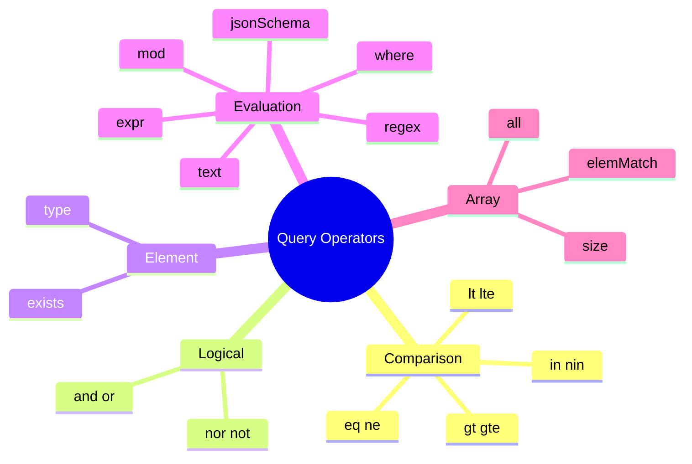

---

## ১২. Sort, Limit (আর Skip) — ফলাফল সাজানো ও ছোট করা

### গল্প

কাস্টমার বললো: *"সবচেয়ে দামি ৩টা বই দেখান।"* মৌসুমী আপা তিনটা কাজ করেন: (১) সব কার্ড **দাম অনুযায়ী সাজান** (**Sort**), (২) সেখান থেকে **প্রথম ৩টা** রাখেন (**Limit**)। আর পরের পাতা চাইলে **প্রথম ৩টা ডিঙিয়ে** পরের ৩টা দেন (**Skip**)।

এই তিনটা `find()`-এর পরে **cursor-এর মেথড** হিসেবে জোড়া লাগে:

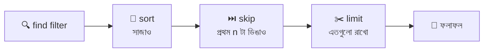

> 🎯 **জরুরি:** আপনি চেইনে `.limit().skip().sort()` যে ক্রমেই লিখুন, MongoDB **সবসময় সাজায় → ডিঙায় → সীমা দেয়**। এই ক্রম বদলানো যায় না।

### `sort()` — সাজানো

```javascript
db.books.find({}, { title: 1, price: 1, _id: 0 }).sort({ price: -1 });
// sort({ field: দিক }) — দিক: 1 = ছোট থেকে বড় (Ascending), -1 = বড় থেকে ছোট (Descending)
// price: -1 = সবচেয়ে দামি আগে
// ফলাফলের ক্রম: MongoDB Guide (650), Node.js Cookbook (600), JavaScript Basics (550), পথের পাঁচালী (320),
//   শঙ্খনীল কারাগার (280), পদ্মা নদীর মাঝি (250), লালসালু (200), দেবদাস (180), Science Monthly (80), কিশোর ভারতী (60)

db.books.find({}, { title: 1, price: 1, _id: 0 }).sort({ price: 1 });
// price: 1 = সবচেয়ে সস্তা আগে
```

> **মনে রাখার উপায়:** `1` = ১, ২, ৩ এভাবে **বাড়ছে** (Ascending)। `-1` = ৩, ২, ১ এভাবে **কমছে** (Descending)।

### একাধিক field দিয়ে সাজানো

```javascript
db.books.find({}, { title: 1, genre: 1, price: 1, _id: 0 })
  .sort({ genre: 1, price: -1 });
// আগে genre অনুযায়ী (A-Z), একই genre-র ভেতরে দাম বেশি থেকে কম
// sort object-এ field-এর লেখার ক্রমই অগ্রাধিকারের ক্রম: প্রথমে genre, তারপর price
// ফলাফল: magazine (Science Monthly 80, কিশোর ভারতী 60), novel (320, 280, 250, 200, 180), textbook (650, 600, 550)
```

### `limit()` — সংখ্যা সীমিত করা

```javascript
db.books.find({}, { title: 1, price: 1, _id: 0 }).sort({ price: -1 }).limit(3);
// limit(3) = শুধু প্রথম ৩টা। সাজানোর পরে সীমা দেওয়া হয়, তাই এটা "সবচেয়ে দামি ৩টা"
// ফলাফল: MongoDB Guide (650), Node.js Cookbook (600), JavaScript Basics (550)

db.books.find({ genre: "novel", inStock: true }).sort({ price: 1 }).limit(2);
// স্টকে থাকা novel-দের মধ্যে সবচেয়ে সস্তা ২টা: দেবদাস (180), লালসালু (200)

db.books.find().sort({ price: -1 }).limit(1);
// সবচেয়ে দামি ১টা বই। "সর্বোচ্চ/সর্বনিম্ন" বের করার সবচেয়ে প্রচলিত কৌশল
```

> `limit(0)` মানে "কোনো সীমা নেই" (সব ফেরত দাও)। আর নেগেটিভ সংখ্যা না দেওয়াই ভালো।

### `skip()` — প্রথম কিছু ডিঙানো (Pagination)

```javascript
db.books.find({}, { title: 1, price: 1, _id: 0 })
  .sort({ price: -1 })
  .skip(3)
  .limit(3);
// skip(3) = প্রথম ৩টা ডিঙিয়ে যাও, তারপর limit(3) = পরের ৩টা দাও। এটা "পাতা ২" (প্রতি পাতায় ৩টা)
// ফলাফল: পথের পাঁচালী (320), শঙ্খনীল কারাগার (280), পদ্মা নদীর মাঝি (250)
```

**Pagination-এর সূত্র:**

```javascript
const page = 2;
// page = কোন পাতা দেখতে চাই (১ থেকে শুরু)
const pageSize = 3;
// pageSize = প্রতি পাতায় কয়টা কার্ড
const skipCount = (page - 1) * pageSize;
// skipCount = কয়টা ডিঙাবো। পাতা ১ হলে (1-1)*3 = 0, পাতা ২ হলে (2-1)*3 = 3, পাতা ৩ হলে 6

db.books.find().sort({ price: -1 }).skip(skipCount).limit(pageSize);
```

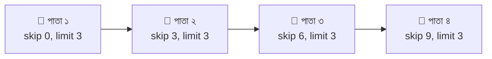

> ⚠️ **`skip()`-এর দুর্বলতা:** skip(১০০০০০) মানে MongoDB-কে আগের ১ লাখ কার্ড **পেরিয়ে যেতে হয়** (গুনে গুনে), তাই পাতা যত এগোয়, তত ধীর। বিশাল ডেটায় "শেষ দেখা `_id`-র পরে থেকে দাও" পদ্ধতি (range-based pagination) ভালো: `find({ _id: { $gt: lastId } }).sort({ _id: 1 }).limit(20)`।

### Sort-এর কিছু সূক্ষ্ম কথা

| বিষয় | ব্যাখ্যা |
|---|---|
| **ঘর নেই এমন কার্ড** | sort-এ `null`-এর মতো ধরা হয়, তাই ascending-এ সবার **আগে** আসে |
| **মিশ্র type** | একই field-এ সংখ্যা আর String থাকলে BSON-এর নির্দিষ্ট ক্রমে সাজায় (সংখ্যা → String)। তাই Science Monthly-র String `"4"` rating **descending-এ সবার আগে** চলে আসতে পারে! ডেটা পরিষ্কার না থাকলে sort-ও ভুল ফল দেয় |
| **বড়-ছোট হাতের অক্ষর** | ডিফল্টে বড় হাতের (`Z`) সব ছোট হাতের (`a`)-এর **আগে** আসে। ভাষাভিত্তিক ক্রম চাইলে `.collation({ locale: "en", strength: 2 })` |
| **Index না থাকলে** | বড় ডেটায় memory-তে সাজাতে গিয়ে সীমা (প্রায় ১০০ MB) পার হলে error আসে। sort-এর field-এ **index** বানানো ভালো |
| **সমান মান হলে** | ক্রম নিশ্চিত নয়। পাতা ভাগ করার সময় দ্বিতীয় একটা ইউনিক field (যেমন `_id`) দিয়ে সাজান: `sort({ price: -1, _id: 1 })` |

---

## ১৩. Distinct — আলাদা আলাদা মানের তালিকা

### গল্প

আপনি জানতে চাইলেন: *"আমাদের পাঠাগারে **কী কী ধরনের** বই আছে?"* সব কার্ড পড়ে একই ধরন বারবার দেখার দরকার নেই। মৌসুমী আপা তাকে তাকে ঘুরে শুধু **আলাদা আলাদা ধরনের নামের তালিকা** লিখে দিলেন: *novel, textbook, magazine*। এটাই **`distinct()`**: একটা field-এর **ইউনিক মানগুলো** (পুনরাবৃত্তি ছাড়া) একটা array-তে ফেরত।

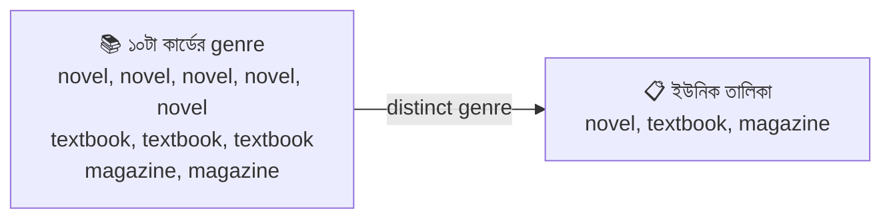

### কোড

```javascript
db.books.distinct("genre");
// distinct("field-এর নাম") = ওই field-এর সব আলাদা মান
// ফলাফল: [ 'magazine', 'novel', 'textbook' ] (ক্রম নিশ্চিত নয়, তাই সাজানো চাইলে .sort() লাগাবেন)

db.books.distinct("genre", { inStock: true });
// ২য় আর্গুমেন্ট = filter। শুধু স্টকে থাকা বইগুলোর মধ্যে আলাদা genre
// ফলাফল: [ 'magazine', 'novel', 'textbook' ] (তিন ধরনেরই স্টকে বই আছে)

db.books.distinct("author.country");
// embedded field-এর জন্য dot notation। ফলাফল: [ 'BD', 'IN' ]
// যাদের author-ই নেই (দুটো ম্যাগাজিন) তারা স্বাভাবিকভাবেই বাদ

db.books.distinct("tags");
// ⚠️ field একটা array হলে distinct প্রতিটা array-র এলিমেন্ট ভেঙে ভেঙে ইউনিক করে
// ফলাফল ১৬টা আলাদা ট্যাগ: classic, village, childhood, river, society, family, drama, romance,
//   programming, web, database, nosql, backend, kids, monthly, science

db.books.distinct("tags", { genre: "textbook" });
// শুধু পাঠ্যবইয়ের আলাদা ট্যাগ: programming, web, database, nosql, backend → ৫টা

db.books.distinct("publishedYear", { genre: "magazine" });
// ম্যাগাজিনগুলোর আলাদা প্রকাশ-সাল: [ 2024 ] (দুটোই ২০২৪, তাই একটা মান)

db.books.distinct("genre").length;
// distinct একটা সাধারণ JavaScript array ফেরত দেয়, তাই .length দিয়ে "কতগুলো আলাদা ধরন" গুনে ফেলা যায় → ৩
```

### `distinct()`-এর বৈশিষ্ট্য

| বৈশিষ্ট্য | ব্যাখ্যা |
|---|---|
| ফেরত দেয় | একটা **array** (Cursor নয়, তাই `.sort()`/`.limit()` জোড়া যায় না) |
| Array field | ভেতরের এলিমেন্ট আলাদা করে ইউনিক করে |
| ফলাফলের আকার | পুরো ফলাফল একটা document-এর সীমা (১৬ MB)-র ভেতরে ধরতে হয়। মান বিশাল হলে aggregation ব্যবহার করুন |
| ক্রম | নিশ্চিত নয় |
| field না থাকলে | ফাঁকা array `[]` |
| গণনা চাইলে | `.length` (বা aggregation-এর `$group`) |

> **বড় ডেটায় বিকল্প:** কে কতগুলো করে আছে সেটাও জানতে চাইলে `aggregate([{ $group: { _id: "$genre", total: { $sum: 1 } } }])`। এটা পরের মডিউলের (Aggregation) বিষয়।

---

## ১৪. Row Count — কার্ড গোনা

### গল্প

SQL-এ যেটা "row count", MongoDB-তে সেটা আসলে **document count** (কারণ এখানে row নেই, আছে document)। কাস্টমার জিজ্ঞেস করলো: *"মোট কয়টা বই আছে? আর ৫০০ টাকার বেশি দামি কয়টা?"* মৌসুমী আপা গুনে বললেন। এখানে দুটো পদ্ধতি: **প্রতিটা কার্ড গুনে গুনে** (নির্ভুল, শর্ত দেওয়া যায়) অথবা **আলমারির গায়ে লেখা মোট সংখ্যা দেখে** (দ্রুত, কিন্তু শর্ত দেওয়া যায় না)।

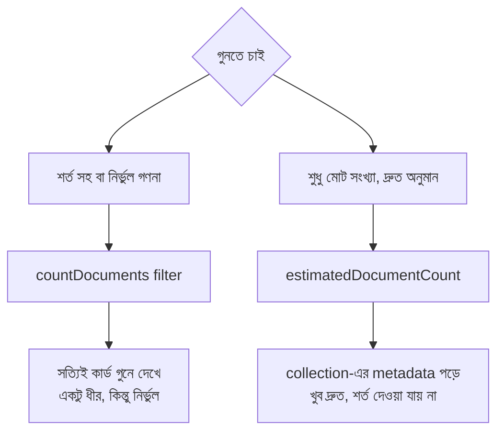

### `countDocuments()` — শর্ত সহ গণনা

```javascript
db.books.countDocuments();
// filter না দিলে collection-এর সব document গোনে → 10
// countDocuments() আর countDocuments({}) একই

db.books.countDocuments({ genre: "novel" });
// genre novel এমন কার্ড কয়টা → 5

db.books.countDocuments({ price: { $gt: 500 } });
// দাম ৫০০-র বেশি কয়টা → 3
// filter হুবহু find()-এর filter-এর মতোই, যেকোনো operator চলে

db.books.countDocuments({ inStock: false });
// স্টকহীন বই কয়টা → 2 (শঙ্খনীল কারাগার, Node.js Cookbook)

db.books.countDocuments({ price: { $gt: 100 } }, { limit: 5 });
// ২য় আর্গুমেন্ট = option। limit: 5 = "৫ গোনার পরে আর গুনতে যেও না" (অনেক বড় ডেটায় সময় বাঁচায়)
// শুধু "অন্তত একটা আছে কি না" জানতে চাইলে { limit: 1 } দেওয়া যায়
```

### `estimatedDocumentCount()` — দ্রুত মোট সংখ্যা

```javascript
db.books.estimatedDocumentCount();
// collection-এর নিজের হিসাব-খাতা (metadata) থেকে মোট document সংখ্যা পড়ে → 10
// কোনো filter নেওয়া যায় না, শুধু পুরো collection-এর সংখ্যা
// ⚠️ "estimated" (আনুমানিক) কারণ: server হঠাৎ বন্ধ হয়ে গেলে বা sharded cluster-এ সংখ্যা সামান্য অসঠিক হতে পারে
```

### দুইটার তুলনা

| | `countDocuments(filter)` | `estimatedDocumentCount()` |
|---|---|---|
| Filter দেওয়া যায় | ✅ হ্যাঁ | ❌ না |
| নির্ভুল | ✅ | ⚠️ প্রায় নির্ভুল |
| গতি | ধীর (document/index ঘেঁটে দেখে) | ⚡ খুব দ্রুত |
| কখন | শর্ত সহ গণনা, নির্ভুল সংখ্যা | ড্যাশবোর্ডে "মোট কত" দেখানো |

### পুরোনো পদ্ধতি — এড়িয়ে চলুন

```javascript
db.books.count();
// ⚠️ পুরোনো, deprecated (বাদের পথে)। আধুনিক driver ও mongosh-এ countDocuments/estimatedDocumentCount ব্যবহার করুন

db.books.find({ genre: "novel" }).count();
// ⚠️ cursor-এ .count() একইভাবে পুরোনো। এর বদলে countDocuments({ genre: "novel" })

db.books.find({ genre: "novel" }).itcount();
// itcount() = cursor ঘুরে ঘুরে গুনে দেখা। সব ডেটা client পর্যন্ত টেনে আনে, তাই ধীর। শুধু শেখার সময় দেখে রাখুন

db.books.find({ genre: "novel" }).toArray().length;
// array বানিয়ে .length নেওয়া — কম ডেটায় চলে, বিশাল ডেটায় মেমরি ভরে যেতে পারে। countDocuments-ই ভালো
```

### কার্ড আছে কি না — অস্তিত্ব যাচাই

```javascript
const exists = db.books.findOne({ title: "MongoDB Guide" }) !== null;
// exists = কার্ডটা আছে কি না (true/false)। findOne কিছু না পেলে null দেয়, তাই null-এর সাথে তুলনা

const hasAny = db.books.countDocuments({ inStock: false }, { limit: 1 }) > 0;
// hasAny = স্টকহীন অন্তত একটা বই আছে কি না। limit: 1 দিয়ে প্রথম পেলেই থেমে যায়, তাই দ্রুত
```

---

## ১৫. Update One or Many — কার্ড সংশোধন

### গল্প

কাস্টমার বললো: *"লালসালুর দাম কমিয়ে ২২০ টাকা করুন"*, *"সব পাঠ্যবইয়ের দাম ২০ টাকা বাড়ান"*, *"এই বইয়ের ডিসকাউন্টের ঘরটা মুছে ফেলুন"*। মৌসুমী আপা **পুরো কার্ড নতুন করে লেখেন না**। তিনি শুধু **যে ঘরটা বদলাতে হবে** সেখানে কলমের কালি ঘষেন, বাকিটা যেমন আছে তেমনই থাকে। এই কাজের গঠন হলো:

```
db.books.updateOne( FILTER , UPDATE , OPTIONS )
                      │        │         └── বাড়তি নিয়ম (যেমন upsert)
                      │        └── কী বদলাবো ($set, $inc ... operator দিয়ে)
                      └── কোন কার্ড (find-এর filter-এর মতোই)
```

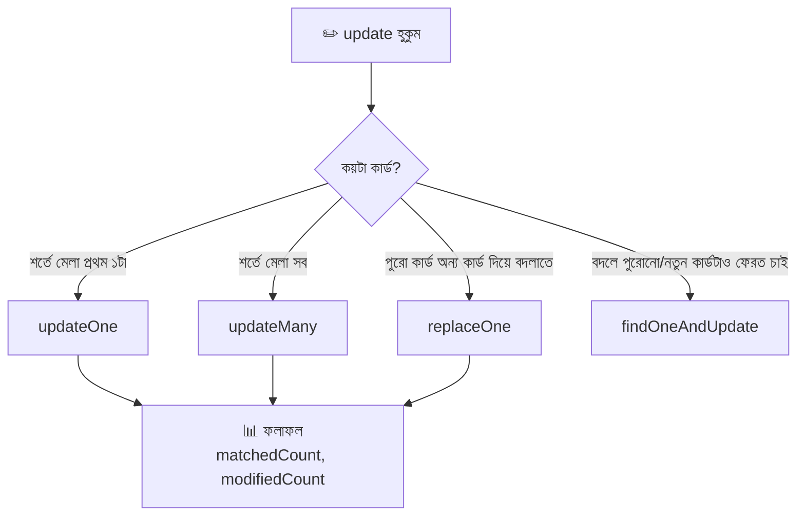

> 💾 **সাবধানতা:** এখন থেকে আমরা ডেটা বদলাবো। ভুল হলে যেন ফেরত পাওয়া যায়, তাই আগে একটা **কপি** বানিয়ে রাখুন:
> ```javascript
> db.books.aggregate([{ $match: {} }, { $out: "books_backup" }]);
> // $match: {} = সব কার্ড ধরো, $out: "books_backup" = সেগুলো books_backup নামের নতুন collection-এ লিখে দাও
> // (aggregate নিয়ে বিস্তারিত পরের মডিউলে, এখন শুধু ব্যাকআপ নেওয়ার কৌশল হিসেবে দেখুন)
> ```

### 🔑 সবচেয়ে গুরুত্বপূর্ণ নিয়ম: Update Operator লাগবেই

```javascript
db.books.updateOne({ title: "লালসালু" }, { price: 220 });
// ❌ Error: Update document requires atomic operators
// update-এর দ্বিতীয় আর্গুমেন্টে সরাসরি { price: 220 } লেখা যায় না।
// $set-এর মতো একটা operator লাগবেই, নাহলে MongoDB ধরে নেয় ভুল করছেন
```

### `$set` — ঘরের মান বদলানো (বা নতুন ঘর যোগ)

```javascript
db.books.updateOne(
  { title: "লালসালু" },
  // ১ম আর্গুমেন্ট (filter) = কোন কার্ড বদলাবো
  { $set: { price: 220 } }
  // ২য় আর্গুমেন্ট (update) = $set দিয়ে price ঘরটা ২২০ করো। ঘরটা না থাকলে নতুন বানিয়ে ফেলে
);
// ফলাফল: { acknowledged: true, insertedId: null, matchedCount: 1, modifiedCount: 1, upsertedCount: 0 }
// matchedCount  = filter-এ কয়টা কার্ড মিললো
// modifiedCount = আসলে কয়টা কার্ডে পরিবর্তন হলো
// (একই মান আবার বসালে matchedCount: 1 কিন্তু modifiedCount: 0 হয়, কারণ বদলানোর কিছু ছিল না)

db.books.updateOne(
  { title: "MongoDB Guide" },
  { $set: { edition: 2, inStock: true, "author.country": "BD" } }
  // একসাথে একাধিক ঘর বদলানো যায়। edition নতুন ঘর, বাকিগুলো আগে থেকেই আছে
  // "author.country" = embedded document-এর ভেতরের একটা ঘর শুধু বদলানো (বাকি author.name অক্ষত)
);
```

> ⚠️ **`updateOne` শুধু মিলে যাওয়া প্রথম কার্ডটাই বদলায়।** শর্তে একাধিক কার্ড মিললে বাকিগুলো যেমন ছিল তেমনই থাকে। নির্দিষ্ট একটা কার্ড বদলাতে চাইলে ইউনিক কিছু (যেমন `_id`) দিয়ে filter করুন।

### সব Update Operator-এর তালিকা

**ঘরের (Field) জন্য:**

| Operator | কাজ | গল্পে | উদাহরণ |
|---|---|---|---|
| `$set` | মান বসায় (না থাকলে বানায়) | "এই ঘরে এটা লেখো" | `{ $set: { price: 220 } }` |
| `$unset` | ঘরটা পুরো মুছে ফেলে | "এই ঘরটা কার্ড থেকে কেটে দাও" | `{ $unset: { discount: "" } }` |
| `$inc` | সংখ্যা বাড়ায় বা কমায় | "৫০ টাকা বাড়াও" | `{ $inc: { price: 50 } }` |
| `$mul` | সংখ্যাকে গুণ করে | "দাম ১০% বাড়াও (×১.১)" | `{ $mul: { price: 1.1 } }` |
| `$rename` | ঘরের নাম বদলায় | "pages নামটা totalPages করো" | `{ $rename: { pages: "totalPages" } }` |
| `$min` | নতুন মান **ছোট** হলেই বসায় | "কমই রাখো" | `{ $min: { price: 150 } }` |
| `$max` | নতুন মান **বড়** হলেই বসায় | "বেশিই রাখো" | `{ $max: { rating: 5 } }` |
| `$currentDate` | এই মুহূর্তের তারিখ বসায় | "আজকের তারিখ লিখে দাও" | `{ $currentDate: { updatedAt: true } }` |
| `$setOnInsert` | শুধু **নতুন** তৈরি হলে বসায় (upsert-এর সাথে) | "প্রথমবার হলেই লেখো" | `{ $setOnInsert: { createdAt: new Date() } }` |

**Array-র জন্য:**

| Operator | কাজ | উদাহরণ |
|---|---|---|
| `$push` | array-র শেষে এলিমেন্ট যোগ | `{ $push: { tags: "new" } }` |
| `$addToSet` | আগে না থাকলেই যোগ (ডুপ্লিকেট নয়) | `{ $addToSet: { tags: "classic" } }` |
| `$pull` | শর্তে মেলে এমন এলিমেন্ট সরায় | `{ $pull: { tags: "village" } }` |
| `$pullAll` | তালিকার সব মান সরায় | `{ $pullAll: { tags: ["a", "b"] } }` |
| `$pop` | প্রথম (`-1`) বা শেষ (`1`) এলিমেন্ট সরায় | `{ $pop: { tags: 1 } }` |
| `$each` | `$push`/`$addToSet`-এর সাথে একাধিক মান একসাথে | `{ $push: { tags: { $each: ["x", "y"] } } }` |
| `$` / `$[]` / `$[id]` | array-র নির্দিষ্ট (বা সব) এলিমেন্ট বদলানো | নিচে |

### ঘরের operator-গুলোর কোড

```javascript
db.books.updateOne({ title: "শঙ্খনীল কারাগার" }, { $unset: { discount: "" } });
// $unset = ঘরটাই কার্ড থেকে সরিয়ে ফেলা। মান হিসেবে "" (ফাঁকা) দিতে হয়, মানটা আসলে কোনো কাজে লাগে না

db.books.updateMany({ genre: "textbook" }, { $inc: { price: 20 } });
// $inc = বর্তমান মানের সাথে যোগ। সব পাঠ্যবইয়ের দাম ২০ টাকা করে বাড়লো
// কমাতে চাইলে নেগেটিভ: { $inc: { price: -20 } }
// ঘরটা না থাকলে $inc ঘরটা বানিয়ে ওই মানই বসিয়ে দেয় (যেমন views: 1 দিয়ে গণনা শুরু)

db.books.updateOne({ title: "পথের পাঁচালী" }, { $inc: { views: 1 } });
// views ঘর আগে ছিল না, নতুন বানিয়ে 1 বসালো। প্রতিবার চালালে 1 করে বাড়বে (কাউন্টারের কাজে ভালো)

db.books.updateMany({ genre: "novel" }, { $mul: { price: 0.9 } });
// $mul = গুণ। novel-দের দাম ১০% কমলো (× ০.৯)। ঘর না থাকলে ০ বসায়

db.books.updateOne({ title: "দেবদাস" }, { $rename: { pages: "totalPages" } });
// $rename = ঘরের নাম বদলানো (মান একই থাকে)। এই একটা কার্ডে pages এখন totalPages হয়ে গেলো
// ⚠️ নাম বদলালে বাকি কার্ডের সাথে গড়ন মিলবে না, তাই সাধারণত updateMany({}, ...) দিয়ে সবগুলোতে একসাথে বদলাতে হয়

db.books.updateOne({ title: "MongoDB Guide" }, { $min: { price: 500 } });
// $min = বর্তমান মানের চেয়ে ৫০০ ছোট হলেই বসাবে, নাহলে কিছু বদলাবে না
// বর্তমান দাম ৬৭০ (৬৫০+২০), ৫০০ ছোট, তাই দাম হয়ে গেলো ৫০০

db.books.updateOne({ title: "MongoDB Guide" }, { $max: { rating: 5 } });
// $max = বর্তমান মানের চেয়ে ৫ বড় হলেই বসাবে। বর্তমান 4.9, তাই rating হয়ে গেলো 5

db.books.updateMany({ genre: "magazine" }, { $currentDate: { updatedAt: true } });
// $currentDate: { ঘর: true } = ঘরে এই মুহূর্তের তারিখ-সময় (Date type) বসিয়ে দাও
// ম্যাগাজিন দুটোয় updatedAt ঘর যোগ হলো
```

### Array operator-গুলোর কোড

```javascript
db.books.updateOne({ title: "লালসালু" }, { $push: { tags: "bangla" } });
// $push = tags array-র শেষে "bangla" যোগ। আগে থেকে থাকলেও আবার যোগ করে (ডুপ্লিকেট হতে পারে)

db.books.updateOne({ title: "লালসালু" }, { $push: { tags: { $each: ["award", "school"] } } });
// $each = একসাথে একাধিক এলিমেন্ট যোগ। $each ছাড়া array দিলে পুরো array-টাই একটা এলিমেন্ট হয়ে ঢুকবে (ভুল!)

db.books.updateOne({ title: "লালসালু" }, { $addToSet: { tags: "classic" } });
// $addToSet = "classic" আগে থেকেই আছে, তাই কিছু বদলালো না (modifiedCount: 0)। নেই হলে যোগ করতো
// ডুপ্লিকেট এড়াতে চাইলে $push-এর বদলে $addToSet

db.books.updateOne({ title: "লালসালু" }, { $pull: { tags: "school" } });
// $pull = tags থেকে "school" এলিমেন্ট সরিয়ে দিলো

db.books.updateOne({ title: "লালসালু" }, { $pop: { tags: 1 } });
// $pop: 1 = শেষ এলিমেন্ট সরাও, $pop: -1 = প্রথম এলিমেন্ট সরাও
```

**Array-র নির্দিষ্ট এলিমেন্ট বদলানো (`reviewsDemo` দিয়ে):**

```javascript
db.reviewsDemo.updateOne(
  { book: "MongoDB Guide", "reviews.user": "sabbir" },
  // filter-এ array-র যে এলিমেন্ট মিলছে (user: sabbir), MongoDB সেটার জায়গা মনে রাখে
  { $set: { "reviews.$.stars": 4 } }
  // "reviews.$.stars" = positional operator $ — filter-এ মেলা এলিমেন্টটার stars ঘর বদলাও
);

db.reviewsDemo.updateMany({}, { $inc: { "reviews.$[].stars": 1 } });
// $[] = array-র প্রতিটা এলিমেন্ট। সব রিভিউয়ের stars ১ করে বাড়লো

db.reviewsDemo.updateMany(
  {},
  { $set: { "reviews.$[r].verified": true } },
  { arrayFilters: [{ "r.stars": { $gte: 4 } }] }
  // $[r] = নাম-দেওয়া placeholder। arrayFilters বলে দেয় r কোন কোন এলিমেন্টকে বোঝাবে
  // এখানে: যেসব রিভিউয়ে stars ৪ বা তার বেশি শুধু তাদের verified: true বসাও
);
```

### `updateMany()` — একসাথে অনেকগুলো

```javascript
db.books.updateMany({ genre: "magazine" }, { $set: { frequency: "monthly" } });
// শর্তে মেলা সবগুলো কার্ড বদলায়। ফলাফল: matchedCount: 2, modifiedCount: 2

db.books.updateMany({}, { $set: { library: "জ্ঞানকুটির" } });
// {} = ফাঁকা filter = সব কার্ড। ⚠️ এক লাইনে পুরো collection বদলে যায়, তাই আগে filter ঠিক আছে কি না নিশ্চিত হোন

db.books.updateMany({ inStock: false }, { $set: { reorderRequested: true }, $inc: { reorderCount: 1 } });
// স্টকহীন সব বইয়ের জন্য "আবার আনার অনুরোধ" চিহ্ন বসলো, আর reorderCount ১ বাড়লো
// একই হুকুমে একাধিক operator ($set আর $inc) মেশানো যায়। কিন্তু একই ঘরে দুটো operator চলবে না (conflict error)
```

### `upsert` — থাকলে বদলাও, না থাকলে বানাও

```javascript
db.books.updateOne(
  { title: "Express in Action" },
  // filter: এই নামের কার্ড খোঁজো
  {
    $set: { genre: "textbook", price: 500 },
    // কার্ড থাকুক বা না থাকুক, এই ঘরগুলো বসবে
    $setOnInsert: { createdAt: new Date() }
    // $setOnInsert = শুধু কার্ড নতুন তৈরি হলেই বসবে, পুরোনো কার্ড থাকলে এটা চলবে না
  },
  { upsert: true }
  // upsert: true = "মিললে বদলাও (update), না মিললে নতুন বানাও (insert)"। নামটা update + insert থেকে
);
// কার্ড না থাকলে ফলাফল: { matchedCount: 0, modifiedCount: 0, upsertedCount: 1, upsertedId: ObjectId("...") }
// নতুন কার্ডে filter-এর ঘর (title) + $set-এর ঘরগুলো আপনা-আপনি বসে যায়
```

### `replaceOne()` — পুরো কার্ড অন্য কার্ড দিয়ে বদলানো

```javascript
db.books.replaceOne(
  { title: "কিশোর ভারতী" },
  // filter: কোন কার্ড বদলাবো
  { title: "কিশোর ভারতী", genre: "magazine", price: 70, inStock: true }
  // ২য় আর্গুমেন্ট = নতুন পুরো document। কোনো $ operator থাকবে না
);
// ⚠️ পুরোনো কার্ডের বাকি সব ঘর (issue, tags, pages...) মুছে যায়, থাকে শুধু _id
// $set-এ শুধু নির্দিষ্ট ঘর বদলায়, replaceOne-এ পুরোটাই। তাই সাধারণত $set-ই নিরাপদ
```

### `findOneAndUpdate()` — বদলে দিয়ে কার্ডটা ফেরত দাও

```javascript
db.books.findOneAndUpdate(
  { title: "পথের পাঁচালী" },
  // filter
  { $inc: { views: 1 } },
  // update
  { returnDocument: "after", projection: { title: 1, views: 1, _id: 0 } }
  // returnDocument: "after" = বদলানোর পরের কার্ড ফেরত দাও ("before" = আগের অবস্থা, ডিফল্ট)
  // projection = ফেরত-দেওয়া কার্ডের কোন কোন ঘর দেখাবো
);
// ফলাফল: { title: "পথের পাঁচালী", views: 2 } (সরাসরি document, matchedCount নয়)
// কখন কাজে লাগে: পরের ধাপে বদলানো মানটা লাগবে (যেমন কাউন্টার বাড়িয়ে নতুন নম্বর জানা)
// আরও আছে: findOneAndReplace, findOneAndDelete
```

### Pipeline দিয়ে Update (এক ধাপ এগিয়ে)

update-এর দ্বিতীয় আর্গুমেন্টে **array** `[ ... ]` দিলে সেটা aggregation pipeline হিসেবে কাজ করে, আর তখন এক ঘরের মান দিয়ে আরেক ঘরের মান **হিসাব করা** যায়:

```javascript
db.books.updateMany(
  { discount: { $exists: true } },
  // filter: শুধু যাদের discount ঘর আছে
  [
    {
      $set: {
        finalPrice: {
          $subtract: ["$price", { $multiply: ["$price", { $divide: ["$discount", 100] }] }]
          // $divide: ["$discount", 100] = discount ÷ ১০০ (শতকরা থেকে ভগ্নাংশ)
          // $multiply: ["$price", ...] = দাম × সেই ভগ্নাংশ = ছাড়ের পরিমাণ
          // $subtract: ["$price", ছাড়] = দাম − ছাড় = চূড়ান্ত দাম
          // "$price", "$discount" = ওই কার্ডেরই ঘরের মান (আগে $ বসে)
        }
      }
    }
  ]
);
// প্রতিটা কার্ডে finalPrice নামে নতুন ঘর যোগ হলো। আপনার কাছে দাম আর ডিসকাউন্ট যা আছে সে অনুযায়ী হিসাব হবে
```

### Update-এর ফলাফলের অর্থ

| ঘর | মানে |
|---|---|
| `acknowledged` | server কাজটা গ্রহণ করেছে |
| `matchedCount` | filter-এ কয়টা কার্ড মিলেছে |
| `modifiedCount` | আসলে কয়টা কার্ডে বদল হয়েছে (মান একই হলে ০) |
| `upsertedCount` | upsert-এ কয়টা নতুন কার্ড তৈরি হয়েছে |
| `upsertedId` | নতুন কার্ডের `_id` (upsert না হলে `null`) |

> 🚫 **পুরোনো মেথড:** `db.books.update()` আর `db.books.save()` এখন পুরোনো ও বাদের পথে। সবসময় `updateOne`, `updateMany`, `replaceOne` ব্যবহার করুন।

---

## ১৬. Delete One or Many — কার্ড ফেলে দেওয়া

### গল্প

কিছু বই পুরোনো হয়ে গেছে, ছিঁড়ে গেছে, বা আর রাখা হবে না। মৌসুমী আপাকে বলতে হয়: *"এই কার্ডটা ফেলে দিন"* বা *"স্টকহীন সব কার্ড ফেলে দিন"*। কিন্তু **ফেলে দেওয়া কার্ড আর ফিরে আসে না।** তাই এই কাজে সবচেয়ে বেশি সাবধান থাকতে হয়।

| মেথড | কাজ | গল্পে |
|---|---|---|
| `deleteOne(filter)` | শর্তে মেলা **প্রথম একটা** মোছে | "একটা কার্ড ফেলো" |
| `deleteMany(filter)` | শর্তে মেলা **সব** মোছে | "এই শর্তের সব কার্ড ফেলো" |
| `findOneAndDelete(filter)` | একটা মুছে, **মোছা কার্ডটা ফেরত** দেয় | "ফেলার আগে আমাকে একবার দেখাও" |
| `drop()` | পুরো collection মোছে | "পুরো আলমারিটাই সরাও" |
| `dropDatabase()` | পুরো database মোছে | "পুরো শাখা বন্ধ" |

### কোড

```javascript
db.books.deleteOne({ title: "দেবদাস" });
// শর্তে মেলা প্রথম একটা কার্ড মুছলো
// ফলাফল: { acknowledged: true, deletedCount: 1 }
// deletedCount = কয়টা কার্ড আসলে মোছা হলো (না মিললে 0)

db.books.deleteMany({ inStock: false });
// শর্তে মেলা সব কার্ড মুছলো। আমাদের ডেটায় স্টকহীন ২টা: শঙ্খনীল কারাগার, Node.js Cookbook
// ফলাফল: { acknowledged: true, deletedCount: 2 }

db.books.deleteMany({ genre: "magazine", issue: { $lt: 10 } });
// ম্যাগাজিন, যার সংখ্যা নম্বর ১০-এর কম → Science Monthly (issue: 7) মুছলো, কিশোর ভারতী (issue: 12) থাকলো
// filter-এ find()-এর সব operator চলে

db.books.findOneAndDelete({ title: "লালসালু" });
// মুছে ফেলে, আর মোছা document-টা সরাসরি ফেরত দেয় (ফেরত পেয়ে অন্য collection-এ "আর্কাইভ" করা যায়)
```

### 🚨 সবচেয়ে বিপজ্জনক লাইন

```javascript
db.books.deleteMany({});
// ⚠️⚠️⚠️ ফাঁকা filter = সব কার্ড! collection খালি হয়ে যায় (collection আর index থাকে)
// একটা ভুল filter, বা filter লিখতে ভুলে গেলে পুরো ডেটা শেষ

db.books.drop();
// পুরো collection (ডেটা + index সহ) সরিয়ে ফেলে। বড় collection খালি করতে deleteMany({})-এর চেয়ে দ্রুত
```

### মোছার আগের নিরাপত্তা-অভ্যাস

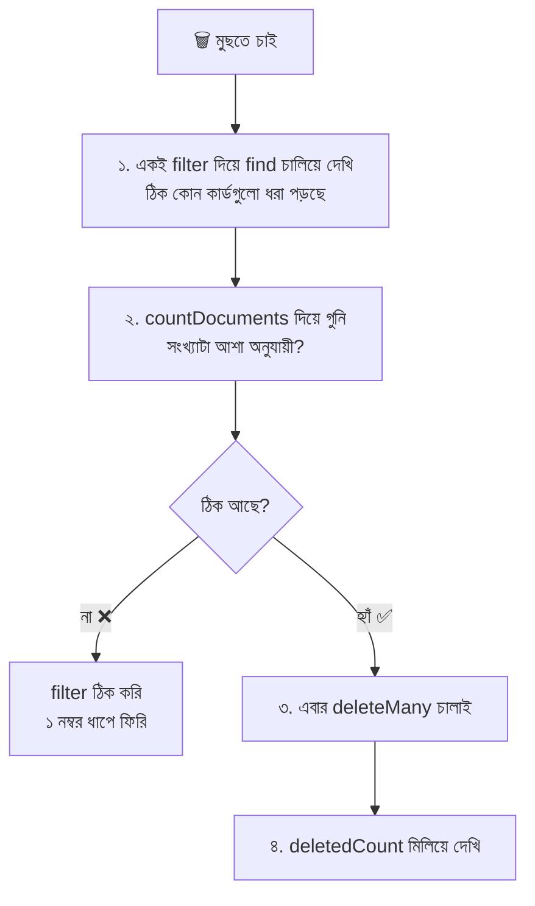

```javascript
const filter = { inStock: false };
// filter = মুছবো এমন শর্ত। একটা ভেরিয়েবলে রাখলাম যাতে দেখা আর মোছা দুই জায়গায় হুবহু একই শর্ত থাকে

db.books.find(filter, { title: 1, _id: 0 });
// ধাপ ১: আগে দেখি কোন কার্ডগুলো মুছবে

db.books.countDocuments(filter);
// ধাপ ২: কয়টা মুছবে গুনি

db.books.deleteMany(filter);
// ধাপ ৩: এবার মুছি। filter ভেরিয়েবল থাকায় আলাদা করে আবার লেখার সময় ভুল হওয়ার ভয় নেই
```

### আসল প্রজেক্টে: Soft Delete

বাস্তব অ্যাপে ডেটা সাধারণত **সত্যি সত্যি মোছা হয় না**, শুধু "মোছা" চিহ্ন দিয়ে রাখা হয়, যাতে ভুল হলে ফেরানো যায়:

```javascript
db.books.updateOne({ title: "দেবদাস" }, { $set: { isDeleted: true, deletedAt: new Date() } });
// isDeleted: true = "এই কার্ড ফেলা হয়েছে" চিহ্ন। deletedAt = কখন ফেলা হলো
// কার্ড ফিজিক্যালি থেকে যায়। সাধারণ পড়ার সময় শুধু ফেলা-না-হওয়াগুলো দেখাতে হয়:

db.books.find({ isDeleted: { $ne: true } });
// isDeleted true নয় এমন কার্ড (যাদের ঘরটাই নেই তারাও ধরা পড়ে, যা আমরা চাই)
```

### Delete-এর ফলাফল আর বিকল্প

| বিষয় | ব্যাখ্যা |
|---|---|
| `deletedCount` | কয়টা মোছা হলো (`0` মানে filter কিছুই মেলেনি, কোনো error নয়) |
| `deleteOne` কোনটা মোছে | মিলে যাওয়া প্রথমটা। নির্দিষ্ট কার্ড চাইলে `_id` দিয়ে filter করুন |
| পুরোনো `db.books.remove()` | ⚠️ deprecated। এর বদলে `deleteOne`/`deleteMany` |
| Index | `deleteMany({})` করলে index থেকে যায়, `drop()` করলে index সহ যায় |
| ফেরানো যায়? | ❌ না। Atlas-এ backup/snapshot থাকতে পারে, লোকালে না। তাই আগে ব্যাকআপ |

---

## ১৭. Node.js থেকে MongoDB — Driver-এর সাথে পরিচয়

### গল্প

এতক্ষণ আমরা মৌসুমী আপাকে **মুখে** (mongosh-এ) হুকুম দিয়েছি। কিন্তু আমাদের রেস্টুরেন্টের রিসেপশনিস্ট **Express** তো টার্মিনাল খুলে কমান্ড টাইপ করবে না! সে আপার সাথে **লিখিত চিঠিতে** যোগাযোগ করবে। এই চিঠি আদান-প্রদানের নিয়মকানুন হলো **MongoDB Node.js Driver** (`mongodb` npm প্যাকেজ)।

```mermaid
sequenceDiagram
    autonumber
    participant B as 👤 Browser
    participant E as 🛎️ Express
    participant D as 📮 mongodb Driver
    participant M as 🗄️ MongoDB
    B->>E: GET /books/66f1...
    E->>D: collection.findOne _id ObjectId
    D->>M: চিঠি পাঠালো
    M-->>D: document
    D-->>E: JS object
    E-->>B: res.json book
```

### সেটআপ

```bash
npm init -y                  # package.json বানানো
npm install mongodb          # MongoDB-র অফিসিয়াল Node.js driver
```

`.env` ফাইল (আর `.gitignore`-এ `.env` লিখতে ভুলবেন না):

```bash
MONGODB_URI=mongodb://localhost:27017
# লোকাল হলে উপরেরটা। Atlas হলে সেখান থেকে কপি করা mongodb+srv://... ঠিকানা
```

### একটা সম্পূর্ণ script — `index.js`

```javascript
// index.js — Node.js থেকে MongoDB-র CRUD (CommonJS)

const { MongoClient, ObjectId } = require("mongodb");
// MongoClient = database-এর সাথে সংযোগ তৈরির ক্লাস
// ObjectId    = _id বানানো ও বোঝার ক্লাস (URL-এর String id-কে সঠিক ধরনে আনতে লাগবে)

const uri = process.env.MONGODB_URI;
// uri = connection string। কোডে সরাসরি না লিখে .env থেকে পড়ছি, যাতে পাসওয়ার্ড GitHub-এ না যায়

const client = new MongoClient(uri);
// client = সংযোগের হাতল। এখনো connect হয়নি, শুধু তৈরি হলো

async function main() {
  // async ফাংশন, কারণ database-এর সব কাজ সময় নেয় আর Promise ফেরত দেয়, তাই await লাগে

  try {
    await client.connect();
    // connect() = আসলে server-এর সাথে যোগাযোগ শুরু। (নতুন driver-এ এটা ছাড়াও প্রথম কমান্ডে নিজে থেকে হয়, তবু স্পষ্ট করে লিখলে ভুল ধরা সহজ)

    const db = client.db("bookshop");
    // db = bookshop database-এর হাতল (mongosh-এর "use bookshop"-এর সমান)

    const books = db.collection("books");
    // books = books collection-এর হাতল (mongosh-এর db.books-এর সমান)

    // ===== ➕ Create =====
    const created = await books.insertOne({ title: "Express in Action", genre: "textbook", price: 500 });
    // created = { acknowledged: true, insertedId: ObjectId("...") }
    console.log("নতুন কার্ডের id:", created.insertedId);

    // ===== 🔍 Read =====
    const cheapNovels = await books
      .find({ genre: "novel", price: { $lt: 300 } })
      // find(filter) = mongosh-এর মতোই filter। এটা Cursor ফেরত দেয়, array নয়
      .project({ title: 1, price: 1, _id: 0 })
      // project = কোন ঘর দেখবো (Projection)
      .sort({ price: 1 })
      // sort = দাম কম থেকে বেশি
      .limit(5)
      // limit = সর্বোচ্চ ৫টা
      .toArray();
    // toArray() = Cursor-কে JavaScript array বানায়। এটা না দিলে console-এ শুধু Cursor object দেখাবে (সাধারণ ভুল!)
    console.log(cheapNovels);

    const one = await books.findOne({ title: "MongoDB Guide" }, { projection: { title: 1, price: 1 } });
    // findOne(filter, options) = একটা document বা null। এখানে projection option হিসেবে যায়
    console.log(one);

    const total = await books.countDocuments({ genre: "novel" });
    // total = novel কয়টা (একটা সংখ্যা)
    const genres = await books.distinct("genre");
    // genres = আলাদা আলাদা ধরনের array
    console.log(total, genres);

    // ===== ✏️ Update =====
    const updated = await books.updateOne({ title: "Express in Action" }, { $set: { price: 550 } });
    // updated = { matchedCount, modifiedCount, ... } (mongosh-এর ফলাফলের মতোই)
    console.log("বদলেছে:", updated.modifiedCount);

    // ===== 🗑️ Delete =====
    const removed = await books.deleteOne({ _id: created.insertedId });
    // created.insertedId আগেই ObjectId, তাই সরাসরি filter-এ দিলাম। নতুন ObjectId(...) দিয়ে মোড়ানো লাগেনি
    console.log("মুছেছে:", removed.deletedCount);
  } catch (error) {
    console.error("❌ কিছু গড়বড়:", error.message);
    // error.message = সমস্যাটা কী (যেমন connect না হওয়া, ভুল পাসওয়ার্ড)
  } finally {
    await client.close();
    // close() = সংযোগ বন্ধ করা। finally ব্লকে রেখেছি যাতে সফল হোক বা ব্যর্থ, সংযোগ বন্ধ হবেই
    // (নাহলে script শেষই হবে না, কারণ সংযোগটা খোলা থেকে যাবে)
  }
}

main();
// main() চালু করলাম। এটা async, তাই উপরের সব ধাপ ক্রমানুসারে হবে
```

চালানো:

```bash
node --env-file=.env index.js
# --env-file=.env = .env ফাইলের ভেতরের ভেরিয়েবলগুলো process.env-এ ঢুকিয়ে দাও (Node 20.6+ এ বিল্ট-ইন)
```

### mongosh বনাম Node.js Driver — পার্থক্য

| কাজ | mongosh | Node.js Driver |
|---|---|---|
| Collection ধরা | `db.books` | `db.collection("books")` |
| সব খোঁজা | `db.books.find()` | `await books.find().toArray()` |
| একটা খোঁজা | `db.books.findOne({...})` | `await books.findOne({...})` |
| Projection | `find({}, { title: 1 })` বা `.project()` | `find({}).project({...})` বা `find({}, { projection: {...} })` |
| ObjectId | `ObjectId("...")` | `new ObjectId("...")` (`require("mongodb")` থেকে আনতে হয়) |
| সবকিছু | সরাসরি চলে | `await` লাগে (Promise) |
| সংযোগ | নিজে থেকে | `MongoClient` দিয়ে নিজে |
| Query-র ভাষা (`$gt`, `$set` ইত্যাদি) | ✅ | ✅ **একদম একই** |

> 🎯 **সুখবর:** এই ফাইলে যত operator শিখলেন (`$gt`, `$or`, `$set`, `$push`...), Node.js-এ **হুবহু একই** লিখতে হয়। শুধু চারপাশে `await` আর `.toArray()`-এর মতো ছোট ছোট কাঠামো বদলায়।

### Express-এর সাথে জোড়া — একটা route

```javascript
const { ObjectId } = require("mongodb");
// ObjectId = URL-এ আসা String id-কে database-এর ধরনে বদলানোর জন্য

app.get("/books/:id", async (req, res) => {
  // async handler, কারণ ভেতরে await আছে। Express 5-এ এই handler-এ error হলে নিজে থেকেই error handler-এ যায় (আগের ফাইলে দেখেছেন)

  const { id } = req.params;
  // id = URL থেকে আসা String, যেমন "66f1a2b3c4d5e6f7a8b9c0d1"

  if (!ObjectId.isValid(id)) {
    return res.status(400).json({ error: "id ভুল ফরম্যাটে আছে।" });
    // ObjectId.isValid(id) = String-টা ObjectId হওয়ার মতো কি না। না হলে 400 (ক্লায়েন্টের ভুল)
  }

  const book = await books.findOne({ _id: new ObjectId(id) });
  // ⚠️ _id-তে String নয়, new ObjectId(id) দিতে হয়, নাহলে কিছুই মিলবে না (সেকশন ২-এর সতর্কতা)

  if (!book) {
    return res.status(404).json({ error: "এই বই পাওয়া যায়নি।" });
    // findOne কিছু না পেলে null দেয়, তখন 404
  }

  res.json(book);
  // MongoDB-র document সরাসরি JSON হয়ে গেলো (ObjectId নিজে থেকে String হয়ে যায়)
});
```

> 🔐 **নিরাপত্তা: NoSQL Injection।** ব্যবহারকারীর পাঠানো `req.body` বা `req.query` সরাসরি filter হিসেবে বসাবেন না।
> ```javascript
> books.findOne({ email: req.body.email, password: req.body.password });
> // ❌ কেউ JSON-এ { "email": "a@b.com", "password": { "$ne": "" } } পাঠালে
> // "password সমান নয় ফাঁকা" শর্ত সবসময় সত্য, ফলে পাসওয়ার্ড ছাড়াই ঢুকে পড়বে!
> ```
> সমাধান: মান নিয়ে আগে যাচাই করুন যে সেটা `string` (`typeof value === "string"`), অবজেক্ট নয়। আর পাসওয়ার্ড কখনোই সরাসরি মেলাবেন না, **hash** করে রাখুন।

> 📎 **এরপর কী?** আসল প্রজেক্টে সরাসরি driver-এর বদলে সাধারণত **Mongoose** নামের একটা লাইব্রেরি ব্যবহার হয়, যা Schema আর Model দিয়ে কাজ সহজ করে। তবে Mongoose-এর ভেতরেও এই ফাইলের সব query-র ভাষাই কাজ করে, তাই এই ভিত্তিটা কখনো বৃথা যাবে না।

---

## ১৮. সব একসাথে — পুরো Flow, সাধারণ ভুল আর সমাধান

### একটা query-র পুরো গঠন

সব শিখে আমরা এখন একটা "পূর্ণাঙ্গ হুকুম" লিখতে পারি:

> *"স্টকে থাকা novel বা textbook, দাম ২০০ থেকে ৬০০-র মধ্যে, শুধু নাম আর দাম দেখান, দাম বেশি থেকে কম ক্রমে, প্রতি পাতায় ২টা করে, ২য় পাতাটা।"*

```javascript
db.books
  .find(
    {
      inStock: true,
      // শর্ত ১: স্টকে আছে (সরাসরি মান, কমা মানে AND)
      genre: { $in: ["novel", "textbook"] },
      // শর্ত ২: Comparison operator $in — novel অথবা textbook
      price: { $gte: 200, $lte: 600 }
      // শর্ত ৩: Comparison operator দিয়ে রেঞ্জ — ২০০ থেকে ৬০০ (দুই প্রান্ত সহ)
    },
    { title: 1, price: 1, _id: 0 }
    // Projection: শুধু নাম আর দাম, _id নয়
  )
  .sort({ price: -1 })
  // Sort: দাম বেশি থেকে কম
  .skip(2)
  // Skip: প্রথম ২টা ডিঙাও, কারণ পাতা ২ = (2-1) × 2 = 2
  .limit(2);
  // Limit: পাতায় ২টা
// মূল ডেটা অক্ষত থাকলে স্টকে থাকা যোগ্য বই ৪টা: JavaScript Basics (550), পথের পাঁচালী (320), পদ্মা নদীর মাঝি (250), লালসালু (200)
// পাতা ১ = প্রথম দুটো, পাতা ২ = পদ্মা নদীর মাঝি আর লালসালু
```

### পুরো CRUD-এর একনজর

```mermaid
flowchart TB
    subgraph C["➕ Create"]
        C1["insertOne document"]
        C2["insertMany array"]
    end
    subgraph R["🔍 Read"]
        R1["find filter, projection"]
        R2["findOne"]
        R3["sort, skip, limit"]
        R4["distinct, countDocuments"]
    end
    subgraph U["✏️ Update"]
        U1["updateOne filter, update"]
        U2["updateMany"]
        U3["replaceOne, findOneAndUpdate"]
    end
    subgraph D["🗑️ Delete"]
        D1["deleteOne"]
        D2["deleteMany"]
        D3["findOneAndDelete"]
    end
    C --> DB[("🗄️ MongoDB<br/>bookshop.books")]
    R --> DB
    U --> DB
    D --> DB
```

### 💾 ডেটা আগের অবস্থায় ফেরানো

সেকশন ১৫-১৬-র update আর delete-এর পরে ডেটা বদলে গেছে। সেকশন ১৫-এর শুরুতে `books_backup` বানিয়ে রাখলে এভাবে ফেরানো যায়:

```javascript
db.books.drop();
// বদলে যাওয়া books collection পুরো ফেলে দিলাম

db.books_backup.aggregate([{ $match: {} }, { $out: "books" }]);
// backup থেকে সব কার্ড নিয়ে আবার books নামে collection বানালাম
// (এখন books আগের অবস্থায়। books_backup থেকেই যাবে, চাইলে পরে drop করে দিন)
```

### Cheat Sheet — এক পাতায় সব

| কাজ | কমান্ড |
|---|---|
| Database দেখা / বদলানো | `show dbs`, `use bookshop`, `db` |
| Collection দেখা | `show collections` |
| একটা রাখা | `db.books.insertOne({...})` |
| অনেক রাখা | `db.books.insertMany([...])` |
| সব খোঁজা | `db.books.find()` |
| শর্তে খোঁজা | `db.books.find({ price: { $gt: 500 } })` |
| একটা খোঁজা | `db.books.findOne({...})` |
| কিছু ঘর দেখা | `db.books.find({}, { title: 1, _id: 0 })` |
| সাজানো | `.sort({ price: -1 })` |
| সীমা / ডিঙানো | `.limit(3)`, `.skip(3)` |
| আলাদা মান | `db.books.distinct("genre")` |
| গোনা | `db.books.countDocuments({...})` |
| একটা বদলানো | `db.books.updateOne({...}, { $set: {...} })` |
| অনেক বদলানো | `db.books.updateMany({...}, { $inc: {...} })` |
| একটা মোছা | `db.books.deleteOne({...})` |
| অনেক মোছা | `db.books.deleteMany({...})` |

### সাধারণ ভুল ও সমাধান

| লক্ষণ / error | সম্ভাব্য কারণ | সমাধান |
|---|---|---|
| `find` কিছুই ফেরত দিচ্ছে না, অথচ ডেটা আছে | type মেলেনি (`"320"` বনাম `320`), field-এর নামে বড়-ছোট হাতের ভুল, বা `_id`-তে String দিয়েছেন | type দেখুন (`$type` দিয়ে), নাম মিলিয়ে নিন, `_id`-তে `ObjectId(...)` |
| `unknown top level operator: $gt` | operator-কে field-এর বাইরে লিখেছেন: `{ $gt: { price: 500 } }` | field আগে, operator ভেতরে: `{ price: { $gt: 500 } }` |
| `$and/$or/$nor must be a nonempty array` | `$or`-এ array-র বদলে object দিয়েছেন | `$or: [ {...}, {...} ]` |
| `Cannot do exclusion on field ... in inclusion projection` | projection-এ `1` আর `0` মিশিয়েছেন | একটা ধরনেই থাকুন (শুধু `_id: 0` ব্যতিক্রম) |
| `Update document requires atomic operators` | update-এ `$set` ভুলে গেছেন | `{ $set: { ... } }` লিখুন |
| `E11000 duplicate key error` | ইউনিক `_id` (বা unique index-এর ঘর) আবার দিয়েছেন | অন্য মান দিন, বা `_id` MongoDB-কে বানাতে দিন |
| `text index required for $text query` | `$text` চালানোর আগে text index বানাননি | `createIndex({ field: "text" })` আগে চালান |
| `Authentication failed` | ভুল ইউজারনেম/পাসওয়ার্ড, বা পাসওয়ার্ডের বিশেষ অক্ষর URL-encode করেননি | Atlas-এ Database User ঠিক করুন, `@` → `%40` |
| `ECONNREFUSED 127.0.0.1:27017` | লোকাল MongoDB server চালু নেই | `mongod` (বা service) চালু করুন, বা Docker container দেখুন |
| Atlas-এ "Could not connect ... IP not on the allowlist" ধরনের বার্তা | আপনার বর্তমান IP Network Access-এ নেই | Atlas → Network Access-এ IP যোগ করুন |
| Node-এ `find()` দিয়ে console-এ Cursor দেখাচ্ছে | `.toArray()` ভুলে গেছেন | `await collection.find().toArray()` |
| `show dbs`-এ নতুন database নেই | database-এ এখনো কোনো ডেটা বসেনি | একটা `insertOne` করুন, তারপর দেখা যাবে |
| `updateOne` করলাম, কিন্তু অন্য কার্ডগুলো বদলায়নি | `updateOne` শুধু প্রথমটা বদলায় | সব বদলাতে `updateMany` |
| `modifiedCount: 0`, অথচ `matchedCount: 1` | নতুন মান পুরোনোটার সমান | error নয়, কিছু বদলানোর ছিল না |
| `deleteMany` করার পর সব ডেটা উধাও | filter ফাঁকা `{}` ছিল বা ভুল ছিল | আগে `find`/`countDocuments` দিয়ে যাচাই (সেকশন ১৬) |
| `sort` করলে ক্রম অদ্ভুত | ঘরে মিশ্র type (সংখ্যা + String) | `$type` দিয়ে ভুল ডেটা খুঁজে ঠিক করুন |
| সঠিক ডেটা তবু `$gt` কাজ করছে না | সংখ্যাকে String হিসেবে রেখেছেন | `updateMany` দিয়ে ঠিক type-এ বদলান (pipeline update-এ `$toDouble`, `$toInt`) |
| `.count()` বা `.pretty()` নিয়ে সতর্কবার্তা | পুরোনো মেথড | `countDocuments()`; `.pretty()` এখন লাগে না |

---

## ১৯. সারসংক্ষেপ, গল্পের অভিধান ও Practice আইডিয়া

```mermaid
mindmap
  root((MongoDB CRUD))
    মূল ধারণা
      Document Database
      Database Collection Document Field
      BSON ও ObjectId
      Embedding বনাম Referencing
      Flexible Schema
    Data Types
      String Number Boolean
      Date ObjectId
      Array Embedded Document
      Decimal128 টাকার জন্য
    Tools
      Atlas ক্লাউড
      Compass GUI
      VS Code Extension
      Community Server লোকাল
      mongosh
    Create
      insertOne
      insertMany ordered
    Read
      find findOne
      Projection
      sort limit skip
      distinct
      countDocuments
    Operators
      Comparison
      Logical
      Element
      Evaluation
      Array
    Update
      updateOne updateMany
      set inc unset
      push pull addToSet
      upsert replaceOne
    Delete
      deleteOne deleteMany
      নিরাপদ মোছার অভ্যাস
```

### গল্পের অভিধান — গল্পের কোনটা মানে কী

| গল্পে | টেকনিক্যাল নাম |
|---|---|
| জ্ঞানকুটির পাঠাগারের পুরো ভবন | MongoDB Server (`mongod`) |
| পাঠাগারের শাখা | Database (`bookshop`) |
| আলমারি | Collection (`books`) |
| একটা ফাইল-কার্ড | Document |
| কার্ডের একটা ঘর | Field |
| কার্ডের ইউনিক নম্বর | `_id` / `ObjectId` |
| ছক-কাটা পুরোনো খাতা | SQL Table |
| কার্ডের ভেতরে ছোট কার্ড | Embedded Document |
| কার্ডে অন্য কার্ডের নম্বর লেখা | Reference |
| মৌসুমী আপা | `mongosh` / Driver |
| আপাকে দেওয়া হুকুম | Query |
| মেঘের দেশের ভবন | MongoDB Atlas |
| ছবিওয়ালা ড্যাশবোর্ড | Compass |
| কোড-ঘর থেকেই হুকুম | VS Code Extension |
| নিজের কম্পিউটারের ভবন | Community Server |
| নতুন কার্ড রাখা | `insertOne` / `insertMany` |
| খুঁজে আনা | `find` / `findOne` |
| ফলাফলের ঝুড়ির হাতল | Cursor |
| কার্ডের কোন কোন ঘর দেখাবো | Projection |
| তুলনার অস্ত্র | Comparison Operators (`$gt`, `$in`...) |
| শর্ত জোড়ার অস্ত্র | Logical Operators (`$and`, `$or`...) |
| ঘর আছে কি না, কোন ধরনের | Element Operators (`$exists`, `$type`) |
| লেখা/হিসাব যাচাই | Evaluation Operators (`$regex`, `$expr`...) |
| রঙিন স্টিকারের সারি | Array (`tags`) |
| কার্ড সাজানো | `sort` |
| প্রথম কয়েকটা রাখা | `limit` |
| প্রথম কয়েকটা ডিঙানো | `skip` |
| আলাদা আলাদা ধরনের তালিকা | `distinct` |
| কার্ড গোনা | `countDocuments` |
| কার্ডে কলমের সংশোধন | `updateOne` / `updateMany` + `$set` |
| থাকলে বদলাও, না থাকলে বানাও | `upsert` |
| কার্ড ফেলে দেওয়া | `deleteOne` / `deleteMany` |
| আলমারির সূচিপত্র | Index |
| সংযোগের চিঠির নিয়ম | Node.js `mongodb` Driver |

### Practice-এর জন্য আইডিয়া

`books` collection (১০টা কার্ড) দিয়ে নিজে হাতে চেষ্টা করুন। সমাধান দেখার আগে নিজে লিখুন।

**Read আর Projection**
1. শুধু `genre: "magazine"` কার্ডগুলোর `title` আর `issue` দেখান, `_id` ছাড়া।
2. `author.country` `"IN"` এমন বইগুলোর শুধু নাম আর লেখকের নাম দেখান।

**Comparison আর Logical**
3. ২০০০ সালের পরে প্রকাশিত, আর দাম ৬০০-র কম, এমন বই খুঁজুন।
4. `$or` দিয়ে "দাম ১০০-র কম অথবা rating ৪.৮-এর বেশি" খুঁজুন। তারপর একই কাজ `$nor` দিয়ে উল্টো করে করুন (কোনটা আসবে না দেখুন)।
5. `$in` আর `$nin` দিয়ে "কোনো ম্যাগাজিন নয়" এমন বই বের করুন।

**Element আর Evaluation**
6. কোন কোন কার্ডে `discount` ঘর আছে, `$exists` দিয়ে বের করুন।
7. `$type` দিয়ে `rating` ভুল ধরনে থাকা কার্ড ধরে ঠিক করুন।
8. `$regex` দিয়ে নামে "গ" অক্ষর আছে এমন বই খুঁজুন (বাংলা regex পরীক্ষা)।
9. `$expr` দিয়ে "প্রতি পৃষ্ঠার দাম ১.২-র বেশি" বই খুঁজুন।
10. `$mod` দিয়ে বিজোড় সালের বই খুঁজুন (`[2, 1]`)।

**Array**
11. `tags`-এ "programming" আছে কিন্তু "web" নেই, এমন বই খুঁজুন (`$and` + `$not`/`$nin` ভাবুন)।
12. `$size` দিয়ে ঠিক ২টা ট্যাগ আছে এমন বই খুঁজুন।

**Sort, Limit, Distinct, Count**
13. সবচেয়ে সস্তা ৩টা বই দেখান।
14. প্রতি পাতায় ৪টা করে, পাতা ৩ দেখান। কতগুলো আসবে বলুন তো, আগে থেকে ভেবে?
15. ২০২০ সালের পরের বইগুলোর আলাদা আলাদা `genre` `distinct` দিয়ে বের করুন।
16. স্টকহীন বই কয়টা? `countDocuments` দিয়ে গুনুন।

**Update আর Delete**
17. সব `novel`-এর দাম ১০% বাড়ান (`$mul`), তারপর একটা novel-এর দাম দেখে হিসাব মেলান।
18. `upsert` দিয়ে একটা নতুন বই "Redis Basics" যোগ করুন, তারপর আবার চালান (এবার কী হলো?)।
19. `$push` আর `$addToSet` দিয়ে একই ট্যাগ দুইবার যোগ করে পার্থক্য দেখুন।
20. `deleteMany` চালানোর আগে নিজেই `find` + `countDocuments` দিয়ে যাচাই করার অভ্যাস করুন।

**Node.js আর Express**
21. `index.js`-এর মতো একটা script বানিয়ে `books` collection থেকে সব `textbook` টার্মিনালে দেখান।
22. আগের ফাইলের Express `server.js`-এর `data/menu.js` (নকল array) বদলে MongoDB থেকে মেনু আনার চেষ্টা করুন। এবার server restart দিলেও ডেটা থাকবে! 🎉

> 🔜 **পরের ধাপ:** Beginner-Advanced **Aggregation Query Writing**: `$match`, `$group`, `$project`, `$lookup` (JOIN-এর MongoDB রূপ) দিয়ে ডেটা থেকে হিসাব-নিকাশ ও রিপোর্ট বানানো। এই ফাইলের `find`-এর সব শর্ত (`$match` এর ভেতরে) অবিকল কাজে লাগবে।

---


> ⚠️ **শেষ সতর্কতা:** `mongodb-crud-demo/` push করার আগে নিশ্চিত হোন যে `node_modules/` আর `.env` `.gitignore`-এ আছে। **MongoDB-র connection string-এ আপনার পাসওয়ার্ড থাকে**, ভুলে GitHub-এ চলে গেলে সেই মুহূর্তেই Atlas-এ পাসওয়ার্ড বদলে ফেলুন।
